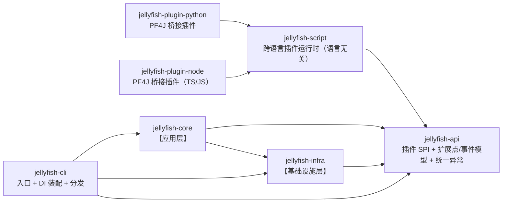

# AGENTS.md

本文件用于指导 AI 编码代理在本仓库中工作。修改代码前请先阅读。

## 项目概述

Jellyfish 是一个用 Java 1.8 编写的轻量级 AI Agent 工具，通过 PF4J 插件扩展能力；除 Java 插件外，还通过 PF4J 桥接插件支持 Python / TypeScript 等跨语言插件。

- 坐标：`zcd:jellyfish:0.0.1-SNAPSHOT`
- 构建：Maven（`pom.xml`）
- 运行环境：JDK 1.8（不要使用 Java 9+ 的 API 或语法）

## 常用命令

```bash
mvn -q compile
mvn -q package -DskipTests
mvn -q -Dtest=UserServiceTest test
```

## 整体架构图

```mermaid
flowchart TB
    subgraph "AgentHarness<br>Agent运行时宿主"
        direction TB

        subgraph "应用层<br>ReAct核心智能"
            ReAct["ReAct Loop<br>思考 → 行动 → 观察"]
        end

        subgraph "基础设施层<br>Harness运行时环境"
            direction TB

            subgraph "内核模块<br>编译期单向依赖+构造器注入，模块互调不经扩展层"
                direction LR
                SessionMgr["SessionManager<br>会话隔离 / 消息列表<br>当前 agentId / 当前模型 / 会话级切换"]
                AgentMgr["AgentManager<br>Agent 定义注册表<br>按 agentId 提供系统提示词 / 权限策略"]
                CommandMgr["CommandManager<br>命令域服务：输入解析 / 别名 / 参数切分<br>帮助渲染 / 按类型查询注册表<br>系统命令与插件命令同源"]
                ModelMgr["ModelManager<br>Provider/Model 注册/解析/路由<br>不持有全局当前态"]
                LLMClient["LLMClient<br>统一 LLM 调用抽象"]
                PermMgr["PermissionManager<br>Agent 粒度权限控制<br>核心策略 → PLAN 白名单 → 插件拦截<br>判定由调用点同步询问"]
            end

            subgraph "扩展层<br>内核与插件的唯一边界，单向四角色<br>底座：infra/registry 自有类型注册表，不依赖任何第三方事件总线"
                direction LR
                Registry["TypeRegistry（注册表底座）<br>「类型 + 路由键」→ 有序 handler 集合<br>同键唯一 · 描述符随 handler 一起存"]
                ExtReg["ExtensionRegistry<br>同步派发：一份注册表 + 同步策略<br>有返回值 · 有序 · 内联 · 不可丢弃"]
                EventCh["EventChannel<br>异步派发：同一份注册表 + 异步策略<br>void · 线程池 + 有界队列 · 可丢弃"]
                PluginMgr["PF4JPluginManager<br>插件加载 / 热部署 / 描述符体检<br>不感知注册表与事件通道"]
                PluginCtx["PluginContext<br>插件唯一入口<br>handle / contribute / observe / emit"]
            end

            subgraph "支撑基础设施"
                direction LR
                Runtime["RuntimeConfig<br>配置解析/合并/注入<br>（启动期装配，非运行期总线）"]
                Metrics["可观测性<br>Metrics/Health/Logging<br>（纯事件订阅者）"]
            end
        end
    end

    subgraph "外壳入口·jellyfish-cli"
        direction LR
        CLI["jellyfish-cli<br>main / Launcher<br>-cli / -tui / -server 模式分发<br>Dagger 组件与 Module 装配"]
    end

    subgraph "外部依赖·配置"
        direction LR
        Jelly["jellyfish.json<br>全局级 + 项目级<br>Provider/Model/插件清单"]
        Agents["agents.json<br>全局级 + 项目级<br>Agent 定义"]
    end

    subgraph "外部依赖·模型提供商"
        direction LR
        LLM["外部 LLM API<br>OpenAI/Azure/Ollama"]
    end

    subgraph "外部依赖·插件与脚本"
        direction LR
        Plugins["PF4J 插件<br>Java: 工具/记忆/横切<br>桥接: Python / TS 语言适配"]
        Scripts["脚本插件进程<br>Python 常驻网关 / TS·JS 常驻网关<br>单进程多路复用"]
    end

    subgraph "图例"
        direction LR
        Legend1["粗线 ==>：同步调用（有返回值 / 必须完成）"]
        Legend2["细实线 -->：内核内部调用（构造器注入，不经扩展层）"]
        Legend3["点线 -.->：异步通知（无返回值 / 可丢弃）"]
    end

    %% ===================== 外壳入口：命令走用户输入，不走 LLM =====================
    CLI ==>|"用户输入：命令原文（/xxx 参数）"| CommandMgr
    CLI -->|"启动会话（经 AgentHarness 门面）"| ReAct
    CommandMgr ==>|"命令执行结果"| CLI

    %% ===================== 内核内部：接口 + 构造器注入（细实线） =====================
    ReAct -->|"消息列表 / 上下文 / 当前 agentId / 当前模型"| SessionMgr
    ReAct -->|"getCurrentLlmClient"| ModelMgr
    ReAct -->|"调用 LLM"| LLMClient
    ReAct -->|"同步权限检查"| PermMgr
    SessionMgr -->|"按 currentAgentId 取 system prompt / Agent 定义"| AgentMgr
    ModelMgr -->|"管理/创建/路由"| LLMClient
    LLMClient -->|"HTTP/API"| LLM

    %% ===================== 扩展层·同步派发：需要结果或必须完成（粗线） =====================
    ReAct ==>|"list：可用工具清单（LlmTool 描述符）"| ExtReg
    ReAct ==>|"ToolCallRequest（工具名 + 参数）"| ExtReg
    SessionMgr ==>|"会话持久化 / 待办插入（无返回值但不可丢）"| ExtReg
    AgentMgr ==>|"提示词修改（链式，取返回值）"| ExtReg
    PermMgr ==>|"权限拦截（返回两态拦截裁定：不拦截 / 拦截，插件无法返回 ASK）"| ExtReg
    ExtReg ==>|"ExtensionResult / 贡献结果"| ReAct

    %% ===================== 扩展层·通知：按角色开放，内核模块作为事件发布者（点线，无返回值） =====================
    ReAct -.->|"publish：轮次开始 / 工具结果"| EventCh
    SessionMgr -.->|"publish：会话创建 / 消息追加"| EventCh
    AgentMgr -.->|"publish：Agent 定义加载 / 变更"| EventCh
    PermMgr -.->|"publish：权限审计（只发事件，不参与判定）"| EventCh
    EventCh -.->|"分发事件"| Metrics

    %% ===================== 扩展层内部：一份注册表 + 两种派发策略 =====================
    Registry -->|"同步策略：调用点线程内联派发，取返回值"| ExtReg
    Registry -->|"异步策略：线程池 + 有界队列，可丢弃"| EventCh
    PluginMgr -->|"加载 / 卸载 / 交付 PluginContext"| PluginCtx
    PluginCtx -->|"handle：工具 / 命令注册（同键唯一，描述符随 handler 一起存）"| ExtReg
    PluginCtx -->|"contribute：其它扩展点注册 / 按 pluginId 退订"| ExtReg
    PluginCtx -->|"observe / emit：按 pluginId 订阅与退订事件"| EventCh

    %% ===================== 命令域：handler 与描述符同落一份注册表，CommandManager 只做解析与帮助 =====================
    CommandMgr ==>|"解析后分发（命令名 + 参数）"| ExtReg
    CommandMgr ==>|"按类型查询命令描述符（名 / 别名 / 帮助）"| ExtReg

    %% ===================== 边界 -> 插件（下行） =====================
    PluginCtx -->|"插件唯一入口"| Plugins
    ExtReg -->|"按类型 + 路由键有序分发（调用点线程内联调用 handler）"| Plugins
    EventCh -->|"白名单 + 限流广播"| Plugins
    Plugins -->|"桥接插件拉起常驻进程"| Scripts

    %% ===================== 插件 -> 边界（上行：只能注册 / 订阅，不能发起同步派发） =====================
    Plugins -->|"handle / contribute / observe / emit"| PluginCtx

    %% ===================== RuntimeConfig 注入 =====================
    Runtime -->|"读取合并, 项目级优先"| Jelly
    Runtime -->|"读取合并, 项目级优先"| Agents
    Runtime -->|"注入 Provider/Model 配置"| ModelMgr
    Runtime -->|"注入 Agent 定义"| AgentMgr
    Runtime -->|"注入插件配置"| PluginMgr
    Runtime -->|"注入权限配置"| PermMgr
    Runtime -->|"注入会话配置"| SessionMgr
    Runtime -->|"注入事件配置（白名单 / 队列）"| EventCh

    classDef app fill:#E9F7EF,stroke:#2E8B57,color:#123
    classDef kernel fill:#E8F4FD,stroke:#2E6DA4,color:#123
    classDef extlayer fill:#FDF2E3,stroke:#C77B00,color:#123
    classDef support fill:#F2F2F2,stroke:#888,color:#333
    classDef ext fill:#FAFAFA,stroke:#AAA,color:#444
    classDef legend fill:#FFFFFF,stroke:#666,color:#333

    class ReAct app
    class SessionMgr,AgentMgr,ModelMgr,LLMClient,PermMgr,CommandMgr kernel
    class Registry,ExtReg,EventCh,PluginMgr,PluginCtx extlayer
    class Runtime,Metrics support
    class LLM,Plugins,Scripts,Jelly,Agents ext
    class Legend1,Legend2,Legend3 legend
```



## 代码结构

Maven 多模块。模块边界与「整体架构图」的两层 + 对外契约一一对应；根 `jellyfish`（`zcd:jellyfish:0.0.1-SNAPSHOT`）是 `packaging=pom` 的聚合与父 POM，统一管理版本。

依赖方向单向，禁止反向或循环：



跨语言桥接插件与内核之间没有编译期依赖：它们由 `PF4JPluginManager` 在运行时从 `plugins/` 目录加载，因此不出现在上面的依赖链里。

| 模块 | 坐标 | 职责 | 依赖 |
| --- | --- | --- | --- |
| `jellyfish-api` | `zcd:jellyfish-api` | 插件作者唯一需要依赖的稳定契约：SPI 接口、扩展点/事件模型、插件上下文、统一异常 | 无 |
| `jellyfish-infra` | `zcd:jellyfish-infra` | 架构图【基础设施层】的全部实现，含配置加载 | `jellyfish-api` |
| `jellyfish-core` | `zcd:jellyfish-core` | 架构图【应用层】：ReAct 循环与 `AgentHarness` 门面 | `jellyfish-api`、`jellyfish-infra` |
| `jellyfish-cli` | `zcd:jellyfish-cli` | `main`、启动参数解析、Dagger 装配、shaded 分发 | `jellyfish-api`、`jellyfish-infra`、`jellyfish-core` |
| `jellyfish-script` | `zcd:jellyfish-script` | 跨语言插件运行时（语言无关）：JSON-RPC over Stdio、常驻进程池、双向事件桥接、生命周期与安全护栏 | `jellyfish-api` |
| `jellyfish-plugin-python` | `zcd:jellyfish-plugin-python` | Python 桥接插件：声明宿主语言与脚本目录，拉起 Python 常驻网关，代脚本操作 `PluginContext` | `jellyfish-script`、`jellyfish-api` |
| `jellyfish-plugin-node` | `zcd:jellyfish-plugin-node` | TS/JS 桥接插件：同 Python 桥接插件，宿主 Node 常驻网关 | `jellyfish-script`、`jellyfish-api` |

包名一律全小写。

```
jellyfish-api/src/main/java/zcd/jellyfish/api/
├── JellyfishException.java        # 统一运行时异常，插件抛错也能被 core 统一捕获
├── extension/                     # 扩展点对外模型（同步派发侧）：类型即地址的请求类型（ExtensionRequest / ExtensionHandler / XxxRequest）与结果类型；结果类型按能力开洞，例如权限判定用三态 PermissionDecision、插件拦截用两态 PermissionVeto；只有数据与接口，没有任何调用语义参数
├── event/                         # 事件通道对外模型（异步派发侧）：事件基类、发布订阅入口与注册选项；只有数据与接口，没有任何调用语义参数
└── plugin/                        # 插件 SPI：插件总入口（JellyfishPlugin）、插件上下文（PluginContext）与插件声明（PluginDeclaration），面向仓库外插件作者的唯一稳定契约

jellyfish-infra/src/main/java/zcd/jellyfish/infra/
├── registry/       # 注册表底座 TypeRegistry：按「类型 + 路由键 → 有序 handler 集合」存储，同键唯一、描述符随 handler 一起存；同步与异步两侧共用，不依赖任何第三方事件总线
├── extension/      # 同步派发策略 ExtensionRegistry：调用点线程内联执行、按 order 升序、取返回值、不可丢弃；查找分 handlers（只要处理器）与 bindings（连 owner 一起给，供审计归因）；需要结果或必须完成的扩展点走这里
├── event/          # 异步派发策略 EventChannel：线程池 + 有界队列、无返回值、可丢弃；纯通知，带白名单与限流
├── session/        # 会话运行态：会话隔离、消息列表，以及会话内当前 agentId 与当前模型（仅内存态）
├── agent/          # Agent 定义注册表：从配置装载定义，按 agentId 提供提示词与权限策略
├── command/        # 命令域服务 CommandManager：输入解析 / 别名 / 参数切分 / 帮助渲染，按类型查询注册表；系统命令与插件命令同源
├── model/          # 模型注册与路由：维护 provider/model 索引，按名字解析模型并给出 LLM 客户端（不持有全局当前态）
├── llm/            # LLM 调用抽象：统一的同步/流式调用接口与各厂商实现
├── plugin/         # 插件运行时：Java 插件加载、热部署、描述符体检与上下文供给，按统一 SPI 看待桥接插件，不感知底层脚本进程
├── permission/     # 权限控制：核心策略（agent 授权）→ PLAN 只读白名单（来自 plugins.<pluginId>.readOnlyTools）→ 插件两态拦截，判定后发审计事件；权限检查不经扩展层下发，由调用点同步询问。待落地：AgentManager 提供的权限策略源、人工审批通道（ASK 暂时降级为拒绝）
├── metrics/        # 可观测性：指标采集、健康检查与日志上报
├── config/         # 配置加载：全局级 + 项目级双源读取与合并，只读
└── support/        # 通用支撑：序列化封装、类型常量等底层工具

jellyfish-core/src/main/java/zcd/jellyfish/core/
├── AgentHarness.java              # 组装门面：外部入口只认它
├── ReActLooper.java               # 思考 → 行动 → 观察
└── prompt/                        # 系统提示词与上下文组装

jellyfish-cli/src/main/java/zcd/jellyfish/cli/
├── JellyfishApplication.java      # main：解析 -cli/-tui/-server 后交给 Launcher
├── Launcher.java                  # 启动模式分发
├── mode/                          # 启动模式实现：CLI 已实现，TUI / Server 预留占位
└── di/                            # composition root：最外层负责依赖装配
    ├── JellyfishComponent.java    # Dagger2 组件定义
    └── module/                    # 各依赖域的 Dagger2 Module

jellyfish-script/src/main/java/zcd/jellyfish/script/
├── ScriptGateway.java             # 单例门面：常驻进程池、按 language + method 路由、订阅记录、生命周期
├── ScriptProcess.java             # 单个子进程 stdio 封装：sendRequest / notify / isAlive / destroyForcibly
├── ScriptProtocol.java            # JSON-RPC 2.0 over Stdio：帧编解码、请求 id 配对、超时
├── ScriptRequestHandler.java      # 脚本上行请求，映射到四角色：register_tool / register_command → handle，subscribe_event → observe，emit_event → emit
├── EventBridge.java               # 双向事件桥接：内核通知 ↔ 脚本，防循环 + 白名单 + 限流
├── ScriptLanguage.java            # 语言枚举与适配：决定各语言的启动命令与网关资源路径
├── ScriptLifecycle.java           # ShutdownHook / PID 文件 / 看门狗 / 空闲自毁
└── ScriptPermissions.java         # 权限常量：SCRIPT_PYTHON / SCRIPT_NODE / EVENT_SUBSCRIBE / EVENT_EMIT

jellyfish-plugin-python/src/main/
├── java/zcd/jellyfish/plugin/python/PythonBridgePlugin.java   # 实现 JellyfishPlugin，全部委托 ScriptGateway
└── resources/
    ├── plugin.properties        # PF4J 描述符：Plugin-Id、依赖、声明的权限
    └── scripts/                 # gateway.py 常驻网关 + 业务脚本目录

jellyfish-plugin-node/src/main/
├── java/zcd/jellyfish/plugin/node/NodeBridgePlugin.java       # 实现 JellyfishPlugin，全部委托 ScriptGateway
└── resources/
    ├── plugin.properties        # PF4J 描述符：Plugin-Id、依赖、声明的权限
    └── scripts/                 # gateway.js 常驻网关 + 业务脚本目录

src/main/resources/config.json     # 应用配置（进程名 + 各配置段的双源文件路径）
```

- **分层靠模块强制**：`core` 与 `infra` 拆开，Maven 才能在编译期守住「应用层 → 基础设施层」这条依赖方向；`api` 独立，是因为它的消费者是仓库外的插件。
- **`infra` 里三个包对应架构图的三个节点**：`registry/` 是共用底座（只有一份表），`extension/` 与 `event/` 是同一份表上的两种派发策略——同步侧有返回值、不可丢弃，异步侧无返回值、可丢弃。
- **`AgentHarness` 是唯一的组装门面**：`cli`/`tui`/`server` 都通过同一个 `JellyfishApplication` 入口走它，三种外壳只靠启动参数区分。
- **DI 装配在最外层**：Dagger 组件与 Module 只放在 `jellyfish-cli`，core/infra 只暴露构造器与 `@Module`，新增启动模式不必改动 core/infra。
- **`tui`/`server` 先不建模块**：暂时只在 `cli/mode` 留占位，等真正开工再抽 `jellyfish-tui`/`jellyfish-server`。
- **跨语言靠桥接插件落地**：`jellyfish-script` 只做语言无关的跨语言运行时，由桥接插件自行 shade 进插件 jar；内核 classpath 上不出现任何跨语言代码，`infra`/`core` 也不知道脚本进程存在。
- **脚本插件与 Java 插件同构**：脚本只能注册 handler、订阅事件、发布事件，**不能发起同步派发**，权限边界与 Java 插件完全一致。


## 架构要点

- **依赖注入（Dagger2）**：通过 Dagger2 进行依赖注入，对各个模块进行解耦。
- **配置加载**：`AppConfig` 直接绑定 `classpath:config.json`，应用级配置。`SettingsReader` 会把 `${ENV_VAR}` 替换为环境变量，apiKey 通常这样注入。
- **global/project 合并**：`RuntimeConfig` 合并两者，同名 provider 以 project 覆盖 global，默认 provider/model 同理。
- **流式调用**：`AbstractHttpLlmClient` 用 OkHttp 手写 SSE（`text/event-stream`）解析，流式请求在线程池（守护线程，名为 `llm-stream`）中执行，句柄可 `cancel()`。OpenAI 兼容协议的公共逻辑在 `AbstractOpenAiCompatibleLlmClient`。
- **异常**：统一抛 `JellyfishException`。
- **序列化与反序列化**: 读写统一走 `ObjectMapperWrapper`，不要直接 new `ObjectMapper`。
- **请求/消息模型**：`LlmRequest`、`LlmMessage`、`LlmTool` 是与厂商无关的统一模型，`LlmRequest` 用 builder 构建。
- **配置类型**：应用内部配置类（即项目代码里的配置，不会暴露给用户）用`Config`结尾，提供用用户的配置类用`Settings`结尾。
- **一份注册表 + 两种派发策略**：内核与插件之间只有两个能力面——`ExtensionRegistry`（同步派发）与 `EventChannel`（异步派发），两者共用**同一份内核自有类型注册表**（`infra/registry` 内实现，不依赖任何第三方事件总线）。差异只在派发策略：同步策略在调用点线程内联调用、按 `order` 升序、取返回值、异常原样上抛；异步策略先入有界队列再由订阅者线程派发、无返回值、可丢弃。
- **选择哪个能力面的判据是「能否丢弃」，不是「有没有返回值」**：需要同步参与结果或必须完成的（工具调用、提示词修改、权限拦截、会话持久化）走 `ExtensionRegistry`——即使没有返回值也不能丢；只是通知的（轮次开始、工具结果、指标、审计）走 `EventChannel`，允许异步、允许丢弃。因此 `Metrics` 是 best-effort 订阅者，不承担审计级可靠性。
- **类型即地址**：扩展点请求没有 ID、没有需要事前声明的清单——**请求类型本身就是那层身份**。内核在指定调用点构造请求子类（如 `ToolCallRequest` 带工具名与参数）交给注册表，注册表按「类型 + 路由键」找出处理器。插件拿不到的类型就注册不了，注册边界由类型可见性天然承载。
- **调用语义由入口与方法表达**：`PluginContext.handle` 同键唯一（工具、命令，描述符随 handler 一起存），`PluginContext.contribute` 类型级 0..N（收集式），两者都写进同一份类型注册表——工具与命令只是类型不同，不存在第二份注册表。同步侧只提供**有序查找**（`ExtensionRegistry.handlers` 返回按 `order` 升序的处理器列表；`handler` 是「此处恰好一个」的 fail-fast 版本，0 个 `NO_HANDLER`、多个 `AMBIGUOUS_HANDLER`）与**单处理器执行**（`invoke(handler, request)` 在调用点线程内联执行并返回其结果），注册表自身**不做任何编排**。需要审计归因的调用点改用 `bindings`：与 `handlers` 语义一致、只是连 owner 一起给，例如权限审计要记录「是哪个插件拦的」。
- **同步派发的护栏由调用方负责**：`ExtensionRegistry` 在调用点线程内联执行 handler，没有超时、没有白名单、没有异常隔离——这是刻意的，因为调用方需要拿到确定结果。调用方若不能容忍插件阻塞或抛错，必须自己在调用点设超时 / 捕获；`EventChannel` 侧的白名单 / 限流 / 有界队列不能替代同步侧。
- **组合规则属于调用方**：注册表只保证**有序查找**，调用几个、按什么顺序、什么时候停止、结果怎么合并都由内核在各调用点自己决定（写出显式的循环），不存在按类型硬编码的调度参数。等到需要「跳过某个处理器也不能算失败」「同一个处理器失败要换个策略」这类规则时，改动只会落在调用点。
- **权限判定的三层与 fail-open 的适用域**：`PermissionManager` 依次走「核心策略（普通 Java 代码）→ PLAN 只读白名单 → 插件拦截（两态、只收紧）」，再统一处理 ASK 与审计。fail-open 只覆盖「取不到策略」（未绑定 agent、无策略）；策略一旦生效，它的否定结论就是硬结论，否则 PLAN 模式形同虚设。插件侧结果类型独立为两态 `PermissionVeto`，因此「插件只能 Deny、不能要求人工审批」是编译期约束，不靠运行期判定。
- **插件模型**：Java 插件与跨语言桥接插件在 `PF4JPluginManager` 眼里完全同构，都只经 `PluginContext`（`handle` / `contribute` / `observe` / `emit`）与内核交互：前两者写同一份类型注册表，后两者读写事件通道；脚本进程只是桥接插件背后的一台「无状态计算器」。
- **跨语言通信**：JSON-RPC 2.0 over Stdio，每行一个 JSON；每种语言最多一个常驻进程（单进程多路复用），请求统一经 `ScriptGateway` 路由，脚本不直接管理进程。
- **跨语言事件桥接**：内核通知经 `EventBridge` 推给脚本，脚本 `emit_event` 反向回 `EventChannel`；脚本来源事件带来源标记避免回推，事件类型走白名单、负载限 1MB、队列有界。

## 编码约定

- 缩进 4 空格，K&R 风格大括号，文件末尾保留换行。
- 依赖注入一律使用构造器注入 `@Inject`，不使用字段注入。
- 内核与插件之间的交互只走 `ExtensionRegistry` / `EventChannel`，禁止引入第三方事件总线（如 Guava EventBus）。
- 注释使用中文，说明“为什么”而非复述代码。
- 类、接口、私有方法、成员变量都要有文档注释，类注释要加`@author zcd`，方法注释要用`@param`写清楚每个参数、用`@return`写清楚返回值。
- 异常统一抛出 `JellyfishException`。
- 工具方法/常量类使用 `final` + 私有构造器（如 `ProviderTypes`、`LlmClients`）。
- 所有代码均需要满足sonar规范要求。

## 单元测试

- 使用 Junit5 + Mockito 进行单元测试，使用 JaCoCo 收集单元测试覆盖率。
- 单元测试类的包路径与被测试类的路径一致。
- 单元测试类命名统一按`{被测试类命}Test`格式。
- 测试方法命名统一按 `{被测试方法}_should_{预期结果}_when_{条件}` 格式。
- 一个测试方法只验证一个行为，测试独立、可重复、无外部依赖。
- 测试结构遵循 Given/When/Then 或 Arrange/Act/Assert。
- 只 mock 外部依赖或协作者，不 mock 被测类、POJO、DTO。
- 使用 `@ExtendWith(MockitoExtension.class)`，统一 JUnit5 API，不混用 JUnit4。
- 断言使用 JUnit5 `Assertions` 或 AssertJ，异常用 `assertThrows`。
- 多组输入用 `@ParameterizedTest`，覆盖正常、边界、异常场景。
- 单元测试不启动 Spring 容器，不访问数据库、网络等真实外部资源。

## Git 约定

- 只 `git add` 本会话实际修改的文件，禁止 `git add -A` / `git add .`。
- 提交前先 `git status` 确认暂存范围。
- 提交信息格式：`{feat,fix,docs,refactor,chore}[(scope)]: 描述`，描述简洁说明改动。
- 不要提交密钥、真实 apiKey 或本地配置文件。
- 提交代码前必须先得到允许。

## 语言

- 使用中文沟通

## 行为准则

- 开发时必须严格按与用户确认的方案执行，如果开发过程中发现方案有问题，先征求用户意见，禁止私自变更方案。
