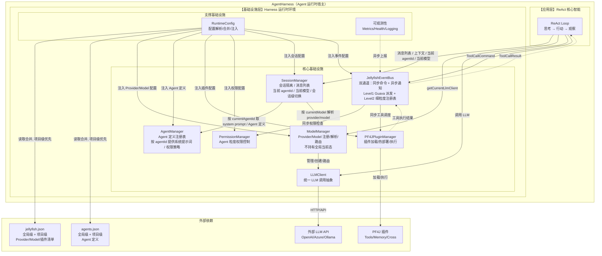
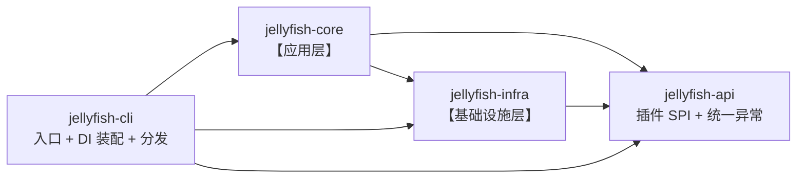

# AGENTS.md

本文件用于指导 AI 编码代理在本仓库中工作。修改代码前请先阅读。

## 项目概述

Jellyfish 是一个用 Java 1.8 编写的轻量级 AI Agent 工具，通过 PF4J 插件扩展能力。

- 坐标：`zcd:jellyfish:0.0.1-SNAPSHOT`
- 构建：Maven（`pom.xml`）
- 运行环境：JDK 1.8（不要使用 Java 9+ 的 API 或语法）

## 常用命令

```bash
mvn -q compile
mvn -q package -DskipTests
mvn -q -Dtest=UserServiceTest test
```

## 整体架构图



## 代码结构

Maven 多模块。模块边界与「整体架构图」的两层 + 对外契约一一对应；根 `jellyfish`（`zcd:jellyfish:0.0.1-SNAPSHOT`）是 `packaging=pom` 的聚合与父 POM，统一管理版本。

依赖方向单向，禁止反向或循环：



| 模块 | 坐标 | 职责 | 依赖 |
| --- | --- | --- | --- |
| `jellyfish-api` | `zcd:jellyfish-api` | 插件作者唯一需要依赖的稳定契约：SPI 接口、能力上下文、统一异常 | 无 |
| `jellyfish-infra` | `zcd:jellyfish-infra` | 架构图【基础设施层】的全部实现，含配置加载 | `jellyfish-api` |
| `jellyfish-core` | `zcd:jellyfish-core` | 架构图【应用层】：ReAct 循环与 `AgentHarness` 门面 | `jellyfish-api`、`jellyfish-infra` |
| `jellyfish-cli` | `zcd:jellyfish-cli` | `main`、启动参数解析、Dagger 装配、shaded 分发 | `jellyfish-api`、`jellyfish-infra`、`jellyfish-core` |

包名一律全小写。

```
jellyfish-api/src/main/java/zcd/jellyfish/api/
├── JellyfishException.java        # 统一运行时异常，插件抛错也能被 core 统一捕获
└── plugin/                        # 插件 SPI：插件总入口、工具/记忆/横切三类插件接口与能力上下文，面向仓库外插件作者的唯一稳定契约

jellyfish-infra/src/main/java/zcd/jellyfish/infra/
├── event/          # 双通道事件总线：同步命令通道 + 异步通知通道，Level1 Guava 派发 + Level2 细粒度注册表
├── command/        # 工具调用的同步请求-响应命令模型
├── session/        # 会话运行态：会话隔离、消息列表，以及会话内当前 agentId 与当前模型（仅内存态）
├── agent/          # Agent 定义注册表：从配置装载定义，按 agentId 提供提示词与权限策略
├── model/          # 模型注册与路由：维护 provider/model 索引，按名字解析模型并给出 LLM 客户端（不持有全局当前态）
├── llm/            # LLM 调用抽象：统一的同步/流式调用接口与各厂商实现
├── plugin/         # 插件运行时：插件加载、热部署与执行调度
├── permission/     # 权限控制：Agent 粒度的插件授权与人工审批判定
├── metrics/        # 可观测性：指标采集、健康检查与日志上报
├── config/         # 配置加载：全局级 + 项目级双源读取与合并，只读
└── support/        # 通用支撑：序列化封装、类型常量等底层工具

jellyfish-core/src/main/java/zcd/jellyfish/core/
├── AgentHarness.java              # 组装门面：外部入口只认它
├── ReActLooper.java               # 思考 → 行动 → 观察
└── prompt/                        # 系统提示词与上下文组装

jellyfish-cli/src/main/java/zcd/jellyfish/cli/
├── JellyfishApplication.java      # main：解析 -cli/-tui/-server 后交给 Launcher
├── Launcher.java                  # 启动模式分发
├── mode/                          # 启动模式实现：CLI 已实现，TUI / Server 预留占位
└── di/                            # composition root：最外层负责依赖装配
    ├── JellyfishComponent.java    # Dagger2 组件定义
    └── module/                    # 各依赖域的 Dagger2 Module

src/main/resources/config.json     # 应用配置（进程名 + 各配置段的双源文件路径）
```

- **分层靠模块强制**：`core` 与 `infra` 拆开，Maven 才能在编译期守住「应用层 → 基础设施层」这条依赖方向；`api` 独立，是因为它的消费者是仓库外的插件。
- **`AgentHarness` 是唯一的组装门面**：`cli`/`tui`/`server` 都通过同一个 `JellyfishApplication` 入口走它，三种外壳只靠启动参数区分。
- **DI 装配在最外层**：Dagger 组件与 Module 只放在 `jellyfish-cli`，core/infra 只暴露构造器与 `@Module`，新增启动模式不必改动 core/infra。
- **`tui`/`server` 先不建模块**：暂时只在 `cli/mode` 留占位，等真正开工再抽 `jellyfish-tui`/`jellyfish-server`。


## 架构要点

- **依赖注入（Dagger2）**：通过 Dagger2 进行依赖注入，对各个模块进行解耦。
- **配置加载**：`AppConfig` 直接绑定 `classpath:config.json`，应用级配置。`SettingsReader` 会把 `${ENV_VAR}` 替换为环境变量，apiKey 通常这样注入。
- **global/project 合并**：`RuntimeConfig` 合并两者，同名 provider 以 project 覆盖 global，默认 provider/model 同理。
- **流式调用**：`AbstractHttpLlmClient` 用 OkHttp 手写 SSE（`text/event-stream`）解析，流式请求在线程池（守护线程，名为 `llm-stream`）中执行，句柄可 `cancel()`。OpenAI 兼容协议的公共逻辑在 `AbstractOpenAiCompatibleLlmClient`。
- **异常**：统一抛 `JellyfishException`。
- **序列化与反序列化**: 读写统一走 `ObjectMapperWrapper`，不要直接 new `ObjectMapper`。
- **请求/消息模型**：`LlmRequest`、`LlmMessage`、`LlmTool` 是与厂商无关的统一模型，`LlmRequest` 用 builder 构建。
- **配置类型**：应用内部配置类（即项目代码里的配置，不会暴露给用户）用`Config`结尾，提供用用户的配置类用`Settings`结尾。

## 编码约定

- 缩进 4 空格，K&R 风格大括号，文件末尾保留换行。
- 依赖注入一律使用构造器注入 `@Inject`，不使用字段注入。
- 注释使用中文，说明“为什么”而非复述代码。
- 类、接口、私有方法、成员变量都要有文档注释，类注释要加`@author zcd`，方法注释要用`@param`写清楚每个参数、用`@return`写清楚返回值。
- 异常统一抛出 `JellyfishException`。
- 工具方法/常量类使用 `final` + 私有构造器（如 `ProviderTypes`、`LlmClients`）。
- 所有代码均需要满足sonar规范要求。

## 单元测试

- 使用 Junit5 + Mockito 进行单元测试，使用 JaCoCo 收集单元测试覆盖率。
- 单元测试类的包路径与被测试类的路径一致。
- 单元测试类命名统一按`{被测试类命}Test`格式。
- 测试方法命名统一按 `{被测试方法}_should_{预期结果}_when_{条件}` 格式。
- 一个测试方法只验证一个行为，测试独立、可重复、无外部依赖。
- 测试结构遵循 Given/When/Then 或 Arrange/Act/Assert。
- 只 mock 外部依赖或协作者，不 mock 被测类、POJO、DTO。
- 使用 `@ExtendWith(MockitoExtension.class)`，统一 JUnit5 API，不混用 JUnit4。
- 断言使用 JUnit5 `Assertions` 或 AssertJ，异常用 `assertThrows`。
- 多组输入用 `@ParameterizedTest`，覆盖正常、边界、异常场景。
- 单元测试不启动 Spring 容器，不访问数据库、网络等真实外部资源。

## Git 约定

- 只 `git add` 本会话实际修改的文件，禁止 `git add -A` / `git add .`。
- 提交前先 `git status` 确认暂存范围。
- 提交信息格式：`{feat,fix,docs,refactor,chore}[(scope)]: 描述`，描述简洁说明改动。
- 不要提交密钥、真实 apiKey 或本地配置文件。
- 提交代码前必须先得到允许。

## 语言

- 使用中文沟通

## 行为准则

- 开发时必须严格按与用户确认的方案执行，如果开发过程中发现方案有问题，先征求用户意见，禁止私自变更方案。
