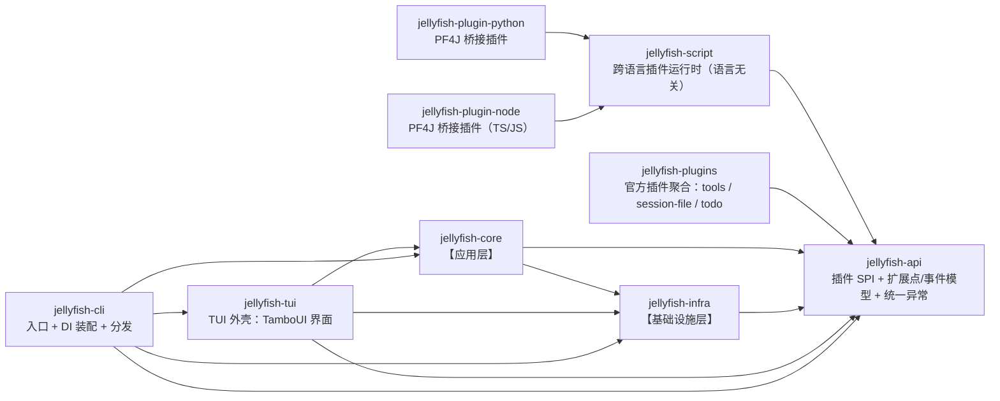

# AGENTS.md

本文件用于指导 AI 编码代理在本仓库中工作。修改代码前请先阅读。

## 项目概述

Jellyfish 是一个用 Java 1.8 编写的轻量级 AI Agent 工具，通过 PF4J 插件扩展能力；除 Java 插件外，还通过 PF4J 桥接插件支持 Python / TypeScript 等跨语言插件。

- 坐标：`zcd:jellyfish:0.0.1-SNAPSHOT`
- 构建：Maven（`pom.xml`）
- 运行环境：JDK 1.8（不要使用 Java 9+ 的 API 或语法）

## 常用命令

```bash
mvn -q compile
mvn -q package -DskipTests
mvn -q -Dtest=UserServiceTest test
```

## 整体架构图

```mermaid
flowchart TB
    subgraph "AgentHarness<br>Agent运行时宿主"
        direction TB

        subgraph "应用层<br>ReAct核心智能"
            ReAct["ReAct Loop<br>思考 → 行动 → 观察<br>流式 / 可取消 · 唯一门面 AgentHarness.chat"]
        end

        subgraph "基础设施层<br>Harness运行时环境"
            direction TB

            subgraph "内核模块<br>编译期单向依赖+构造器注入，模块互调不经扩展层"
                direction LR
                SessionMgr["SessionManager<br>会话隔离 / 消息列表 / token 统计<br>当前 agentId / 当前模型 / 权限模式<br>会话级切换"]
                AgentMgr["AgentManager + AgentRegistry<br>Agent 定义注册表<br>内置系统默认 agent + 用户自定义 agent<br>按 agentId 提供提示词（来自同名 md）/ 权限策略<br>（提示词拼装归 core/prompt）"]
                CommandMgr["CommandManager<br>命令域服务：解析 / 别名 / 分发 / 结构化清单 / 帮助 / 只读候选查询<br>不注册处理器 · 不持有会话 · 无缓存<br>系统命令与插件命令同源（系统命令由 core/command 注册）"]
                ModelMgr["ModelManager<br>Provider/Model 注册/解析/路由<br>不持有全局当前态"]
                LLMClient["LLMClient<br>统一 LLM 调用抽象"]
                PermMgr["PermissionManager<br>Agent 粒度权限控制<br>核心策略 → PLAN 白名单 → 插件拦截<br>判定由调用点同步询问"]
            end

            subgraph "扩展层<br>内核与插件的唯一边界，单向四角色<br>底座：infra/registry 自有类型注册表，不依赖任何第三方事件总线"
                direction LR
                Registry["TypeRegistry（注册表底座）<br>「类型 + 路由键」→ 有序 handler 集合<br>同键唯一 · 描述符随 handler 一起存"]
                ExtReg["ExtensionRegistry<br>同步派发：一份注册表 + 同步策略<br>有返回值 · 有序 · 内联 · 不可丢弃"]
                EventCh["EventChannel<br>异步派发：同一份注册表 + 异步策略<br>void · 线程池 + 有界队列 · 可丢弃"]
                PluginMgr["PF4JPluginManager<br>插件加载 / 热部署 / 描述符体检<br>不感知注册表与事件通道"]
                PluginCtx["PluginContext<br>插件唯一入口<br>handle / contribute / observe / emit"]
            end

            subgraph "支撑基础设施"
                direction LR
                Runtime["RuntimeConfig<br>配置解析/合并/注入<br>（启动期装配，非运行期总线）"]
                Metrics["可观测性<br>Metrics/Health/Logging<br>（纯事件订阅者）"]
            end
        end
    end

    subgraph "外壳入口·jellyfish-cli"
        direction LR
        CLI["jellyfish-cli<br>main / Launcher / RunMode<br>-cli 已落地（单次、不交互）<br>-tui 已落地（交互式，见 jellyfish-tui）<br>-server 占位<br>Dagger 组件与 Module 装配"]
    end

    subgraph "外部依赖·配置"
        direction LR
        Models["models.json<br>全局级 + 项目级<br>Provider/Model"]
        Jelly["jellyfish.json<br>全局级 + 项目级<br>插件名单/配置段等运行期设置"]
        Agents["agents.json（用户，双源）<br>default-agent.json（内置）<br>+ 同目录 {agentId}.md 提示词"]
    end

    subgraph "外部依赖·模型提供商"
        direction LR
        LLM["外部 LLM API<br>OpenAI/Azure/Ollama"]
    end

    subgraph "外部依赖·插件与脚本"
        direction LR
        Plugins["PF4J 插件<br>官方: tools / session-file<br>Java: 工具/记忆/横切<br>桥接: Python / TS 语言适配"]
        Scripts["脚本插件进程<br>Python 常驻网关 / TS·JS 常驻网关<br>单进程多路复用"]
    end

    subgraph "图例"
        direction LR
        Legend1["粗线 ==>：同步调用（有返回值 / 必须完成）"]
        Legend2["细实线 -->：内核内部调用（构造器注入，不经扩展层）"]
        Legend3["点线 -.->：异步通知（无返回值 / 可丢弃）"]
    end

    %% ===================== 外壳入口：命令走用户输入，不走 LLM =====================
    CLI ==>|"命令原文 + sessionId（输入框）"| CommandMgr
    CLI ==>|"命令名 + 参数 + sessionId（结构化入口，Web/TUI）"| CommandMgr
    CLI -->|"chat(sessionId, input, listener)：唯一入口"| ReAct
    CommandMgr ==>|"CommandResult / 结构化清单 / 帮助文本"| CLI

    %% ===================== 内核内部：接口 + 构造器注入（细实线） =====================
    ReAct -->|"消息列表 / 上下文 / 当前 agentId / 当前模型 / 权限模式 / token 统计"| SessionMgr
    ReAct -->|"getCurrentLlmClient"| ModelMgr
    ReAct -->|"调用 LLM"| LLMClient
    ReAct -->|"同步权限检查"| PermMgr
    SessionMgr -->|"按 currentAgentId 取 system prompt / Agent 定义"| AgentMgr
    ModelMgr -->|"管理/创建/路由"| LLMClient
    LLMClient -->|"HTTP/API"| LLM

    %% ===================== 扩展层·同步派发：需要结果或必须完成（粗线） =====================
    ReAct ==>|"list：可用工具清单（LlmTool 描述符）"| ExtReg
    ReAct ==>|"ToolCallRequest（工具名 + 参数）"| ExtReg
    SessionMgr ==>|"会话持久化 / 启动期恢复（无返回值但不可丢）"| ExtReg
    AgentMgr ==>|"提示词修改（链式，取返回值）"| ExtReg
    PermMgr ==>|"权限拦截（返回两态拦截裁定：不拦截 / 拦截，插件无法返回 ASK）"| ExtReg
    ExtReg ==>|"ExtensionResult / 贡献结果"| ReAct

    %% ===================== 扩展层·通知：按角色开放，内核模块作为事件发布者（点线，无返回值） =====================
    ReAct -.->|"publish：轮次开始 / 工具结果"| EventCh
    SessionMgr -.->|"publish：会话创建 / 消息追加"| EventCh
    AgentMgr -.->|"publish：Agent 定义装载（AgentsLoadedEvent）"| EventCh
    ModelMgr -.->|"publish：Model 索引重建（ModelsLoadedEvent）"| EventCh
    PermMgr -.->|"publish：权限审计（只发事件，不参与判定）"| EventCh
    EventCh -.->|"分发事件"| Metrics

    %% ===================== 扩展层内部：一份注册表 + 两种派发策略 =====================
    Registry -->|"同步策略：调用点线程内联派发，取返回值"| ExtReg
    Registry -->|"异步策略：线程池 + 有界队列，可丢弃"| EventCh
    PluginMgr -->|"加载 / 卸载 / 交付 PluginContext"| PluginCtx
    PluginCtx -->|"handle：工具 / 命令注册（同键唯一，描述符随 handler 一起存）"| ExtReg
    PluginCtx -->|"contribute：其它扩展点注册 / 按 pluginId 退订"| ExtReg
    PluginCtx -->|"observe / emit：按 pluginId 订阅与退订事件"| EventCh

    %% ===================== 命令域：handler 与描述符同落一份注册表，CommandManager 只做解析、分发与清单 =====================
    CommandMgr ==>|"handler(命令名) + invoke：两条入口共用同一条分发路径"| ExtReg
    CommandMgr ==>|"descriptorBindings 取命令名 / 别名 / 帮助（无缓存，现算）"| ExtReg

    %% ===================== 边界 -> 插件（下行） =====================
    PluginCtx -->|"插件唯一入口"| Plugins
    ExtReg -->|"按类型 + 路由键有序分发（调用点线程内联调用 handler）"| Plugins
    EventCh -->|"白名单 + 限流广播"| Plugins
    Plugins -->|"桥接插件拉起常驻进程"| Scripts

    %% ===================== 插件 -> 边界（上行：只能注册 / 订阅，不能发起同步派发） =====================
    Plugins -->|"handle / contribute / observe / emit"| PluginCtx

    %% ===================== RuntimeConfig 注入 =====================
    Runtime -->|"读取合并, 项目级优先"| Models
    Runtime -->|"读取合并, 项目级优先"| Jelly
    Runtime -->|"读取合并, 项目级优先"| Agents
    Runtime -->|"注入 Provider/Model 配置"| ModelMgr
    Runtime -->|"注入 Agent 定义"| AgentMgr
    Runtime -->|"注入插件配置"| PluginMgr
    Runtime -->|"注入权限配置"| PermMgr
    Runtime -->|"注入事件配置（白名单 / 队列）"| EventCh

    classDef app fill:#E9F7EF,stroke:#2E8B57,color:#123
    classDef kernel fill:#E8F4FD,stroke:#2E6DA4,color:#123
    classDef extlayer fill:#FDF2E3,stroke:#C77B00,color:#123
    classDef support fill:#F2F2F2,stroke:#888,color:#333
    classDef ext fill:#FAFAFA,stroke:#AAA,color:#444
    classDef legend fill:#FFFFFF,stroke:#666,color:#333

    class ReAct app
    class SessionMgr,AgentMgr,ModelMgr,LLMClient,PermMgr,CommandMgr kernel
    class Registry,ExtReg,EventCh,PluginMgr,PluginCtx extlayer
    class Runtime,Metrics support
    class LLM,Plugins,Scripts,Jelly,Agents ext
    class Legend1,Legend2,Legend3 legend
```



## 代码结构

Maven 多模块。模块边界与「整体架构图」的两层 + 对外契约一一对应；根 `jellyfish`（`zcd:jellyfish:0.0.1-SNAPSHOT`）是 `packaging=pom` 的聚合与父 POM，统一管理版本。

依赖方向单向，禁止反向或循环：



跨语言桥接插件与内核之间没有编译期依赖：它们由 `PF4JPluginManager` 在运行时从 `config.json` 的 `plugins.roots` 指定的目录（默认 `plugins/`）加载，因此不出现在上面的依赖链里。

| 模块 | 坐标 | 职责 | 依赖 |
| --- | --- | --- | --- |
| `jellyfish-api` | `zcd:jellyfish-api` | 插件作者唯一需要依赖的稳定契约：SPI 接口、扩展点/事件模型、插件上下文、统一异常 | 无 |
| `jellyfish-infra` | `zcd:jellyfish-infra` | 架构图【基础设施层】的全部实现，含配置加载 | `jellyfish-api` |
| `jellyfish-core` | `zcd:jellyfish-core` | 架构图【应用层】：ReAct 循环与 `AgentHarness` 门面 | `jellyfish-api`、`jellyfish-infra` |
| `jellyfish-tui` | `zcd:jellyfish-tui` | TUI 外壳：TamboUI 声明式界面、视图投影与滚动、TUI 版 `ReActListener` 与跨线程契约 | `jellyfish-api`、`jellyfish-infra`、`jellyfish-core` |
| `jellyfish-cli` | `zcd:jellyfish-cli` | `main`、启动参数解析、启动模式分发（CLI / TUI 已实现）、Dagger 装配、shade 打成可执行 jar | `jellyfish-api`、`jellyfish-infra`、`jellyfish-core`、`jellyfish-tui` |
| `jellyfish-script` | `zcd:jellyfish-script` | 跨语言插件运行时（语言无关）：JSON-RPC over Stdio、常驻进程池、双向事件桥接、生命周期与安全护栏（待开工） | `jellyfish-api` |
| `jellyfish-plugin-python` | `zcd:jellyfish-plugin-python` | Python 桥接插件：声明宿主语言与脚本目录，拉起 Python 常驻网关，代脚本操作 `PluginContext` | `jellyfish-script`、`jellyfish-api` |
| `jellyfish-plugin-node` | `zcd:jellyfish-plugin-node` | TS/JS 桥接插件：同 Python 桥接插件，宿主 Node 常驻网关（待开工） | `jellyfish-script`、`jellyfish-api` |
| `jellyfish-plugins` | `zcd:jellyfish-plugins` | 官方插件聚合（packaging=pom）：每个子模块产出一个独立插件 jar，不在内核依赖链上 | 各插件子模块 |
| `jellyfish-plugin-tools` | `zcd:jellyfish-plugin-tools` | 官方工具插件：`read_file` / `write_file` / `edit_file` / `list_dir` / `grep_files` | `jellyfish-api`（provided） |
| `jellyfish-plugin-session-file` | `zcd:jellyfish-plugin-session-file` | 官方会话持久化插件：一个会话一个 JSON 文件 + git 管理历史 | `jellyfish-api`（provided） |
| `jellyfish-plugin-todo` | `zcd:jellyfish-plugin-todo` | 官方待办插件：模型可写的 `todo_write` 工具 + 只读 `/todo` 命令 + system prompt 注入 | `jellyfish-api`（provided） |

包名一律全小写。

```
jellyfish-api/src/main/java/zcd/jellyfish/api/
├── JellyfishException.java        # 统一运行时异常，插件抛错也能被 core 统一捕获
├── extension/                     # 扩展点对外模型（同步派发侧）：类型即地址的请求类型（ExtensionRequest / ExtensionHandler / XxxRequest）与结果类型；结果类型按能力开洞，例如权限判定用三态 PermissionDecision、插件拦截用两态 PermissionVeto、命令用三态 CommandResult（配 CommandDescriptor 名片与 CommandArguments 参数）；会话持久化额外带一套快照值类型（SessionSnapshot / SessionMessageSnapshot / SessionToolCallSnapshot / SessionUsageSnapshot / TokenUsageSnapshot）作为请求载荷；提示词注入用 PromptContributionRequest → PromptContribution，状态栏片段用 StatusLineContributionRequest → StatusLineContribution，面板用 PanelContributionRequest → PanelContribution（带标题、内容行与**软建议**落位区域，真正的落位归外壳）；只有数据与接口，没有任何调用语义参数
├── event/                         # 事件通道对外模型（异步派发侧）：事件基类、发布订阅入口与注册选项，以及 notification/ 下的具体通知（含 UiInvalidatedEvent：插件主动告诉外壳「我贡献的界面内容已过期」的唯一通道）；只有数据与接口，没有任何调用语义参数
├── ui/                            # 插件界面内容的渲染无关模型：UiLine / UiSegment / UiEmphasis（语义强调档位而非颜色）/ UiRegion（软建议区域）；api 是零依赖的，因此这里不能出现渲染引擎类型（Style / Element），否则插件自带的同名类会在「子优先」类加载器下与内核那份不是同一个 Class
└── plugin/                        # 插件 SPI：插件总入口（JellyfishPlugin）、插件上下文（PluginContext）与插件声明（PluginDeclaration），面向仓库外插件作者的唯一稳定契约

jellyfish-infra/src/main/java/zcd/jellyfish/infra/
├── registry/       # 注册表底座 TypeRegistry：按「类型 + 路由键 → 有序 handler 集合」存储，同键唯一、描述符随 handler 一起存；同步与异步两侧共用，不依赖任何第三方事件总线
├── extension/      # 同步派发策略 ExtensionRegistry：调用点线程内联执行、按 order 升序、取返回值、不可丢弃；查找分 handlers（只要处理器）、bindings（连 owner 一起给，供审计归因）与 descriptorBindings（连 routeKey 与 owner 一起给的描述符清单，供命令清单 / 菜单）；需要结果或必须完成的扩展点走这里
├── event/          # 异步派发策略 EventChannel：线程池 + 有界队列、无返回值、可丢弃；纯通知，带白名单与限流
├── session/        # 会话运行态：会话隔离、消息列表、token 统计，以及会话内当前 agentId / 当前模型 / 权限模式（仅内存态；无配置段）；SessionManager 是唯一变更入口，每次变更同步派发 SessionPersistRequest（失败上抛），启动期用 SessionRestoreRequest 向插件要回会话；SessionSnapshots 负责会话模型 ↔ api 快照的双向映射，Session.restore 由快照还原
├── agent/          # Agent 定义注册表：AgentManager（门面，implements PermissionPolicyProvider，按 agentId 提供提示词原文与权限策略，默认 agent 恒为内置）+ AgentRegistry（定义与策略的只读索引；内置 agent 优先，同名用户条目跳过并告警）；提示词拼装归 core/prompt，新增事件 AgentsLoadedEvent
├── command/        # 命令域服务 CommandManager：输入解析 / 别名解析 / 分发 / 结构化清单（CommandInfo）/ 帮助渲染 / 只读候选查询（options → CommandOptionRequest → CommandOptions，供「选中命令即弹选择页」且不执行命令），按类型查询注册表；只注入 ExtensionRegistry，对外壳（cli / tui / server）中立；系统命令与插件命令同源，系统命令由 core/command/SystemCommands 以 owner=core 注册（/compact 等仍待落地）
├── model/          # 模型注册与路由：维护 provider/model 索引，按名字解析模型并给出 LLM 客户端（不持有全局当前态）
├── llm/            # LLM 调用抽象：统一的同步/流式调用接口与各厂商实现
├── plugin/         # 插件运行时：Java 插件加载、热部署、描述符体检与上下文供给，按统一 SPI 看待桥接插件，不感知底层脚本进程；装配输入 PluginRuntimeConfig 由「config.json 的 plugins.roots（扫描目录）+ jellyfish.json 的 plugins 段（名单/配置段）」两处组装，且是「引用稳定、快照可换」的发布点
├── permission/     # 权限控制：核心策略（agent 授权）→ PLAN 只读白名单（来自 plugins.configurations.<pluginId>.readOnlyTools）→ 插件两态拦截，判定后发审计事件；权限检查不经扩展层下发，由调用点同步询问；策略来源由 AgentManager 实现 PermissionPolicyProvider。待落地：人工审批通道（ASK 暂时降级为拒绝）
├── ui/             # UI 贡献门面 UiContributions：外壳向插件收集界面内容、并订阅「内容可能已过期」的唯一入口（外壳不直接认识 ExtensionRegistry / EventChannel）；两类贡献的区别只在「能否共存」——状态栏片段是拼接型（多插件共存，按 owner 去重），面板是独占型（带上 owner 交给外壳与用户仲裁）；调用模型是「失效时收集」而不是「每帧收集」，因此空闲时零插件调用，代价是失效触发源必须记全；单处理器抛错只跳过它自己
├── metrics/        # 可观测性：指标采集、健康检查与日志上报
├── config/         # 配置加载：全局级 + 项目级双源读取与合并，只读；四类配置类与文件一一对应：AppConfig(config.json) / ModelSettings(models.json) / AgentSettings(agents.json) / JellyfishSettings(jellyfish.json，含 plugins 与 react 段)；AppConfig 额外承载 PluginPaths(config.json 的 plugins.roots，插件扫描目录，不是双源段)；另有不走双源的内置 agent 定义：BuiltinAgentLoader(classpath:default-agent.json) + AgentPromptLoader({agentId}.md 的路径安全校验与加载)
└── support/        # 通用支撑：序列化封装、类型常量等底层工具

jellyfish-core/src/main/java/zcd/jellyfish/core/
├── AgentHarness.java              # 组装门面：外部入口只认它（chat 是唯一智能入口）
├── ReActLooper.java               # 思考 → 行动 → 观察（流式 + 专用 react 执行器）
├── ReActTurn.java                 # 回合句柄：cancel / await / isDone
├── ReActListener.java             # 流式回调：文本 / 思考 / 工具 / 完成 / 取消 / 错误
├── ReActResult.java               # 回合结果：completed / truncated / cancelled
├── prompt/                        # 系统提示词与上下文组装：PromptAssembler / ToolCatalog / ContextWindow / TokenEstimator
└── command/                       # 内核系统命令 SystemCommands（owner=core）

jellyfish-cli/src/main/java/zcd/jellyfish/cli/
├── JellyfishApplication.java       # main：解析启动参数后交给 Launcher；-h / -V 就地返回
├── Launcher.java                   # 启动模式选择 + 生命周期（bootstrap / shutdown hook / finally / 三类退出码）
├── StartupOptions.java             # 启动参数不可变值对象（含 Mode 枚举）
├── StartupOptionsParser.java       # 手写参数解析 + 用法文本（无新依赖）
├── ExitCodes.java                  # 退出码：0 成功 / 2 用法 / 3 启动 / 4 运行 / 5 未实现 / 6 未收敛
├── SessionBootstrap.java           # 启动期会话保证：建/切当前会话 + --agent/--model/--mode 存在性校验
├── console/                        # 输出面：stdout = 回答，stderr = 诊断（ConsoleIO / SystemConsoleIO / CliReActListener）
├── mode/                           # 启动模式：CliRunMode / TuiRunMode 已实现；ServerRunMode 为占位（不启动内核）
└── di/                             # composition root：最外层负责依赖装配
    ├── JellyfishComponent.java    # Dagger2 组件定义
    └── module/                    # 各依赖域的 Dagger2 Module

jellyfish-tui/src/main/java/zcd/jellyfish/tui/
├── TuiApp.java                     # 唯一入口：装配 ToolkitRunner、按键路由、回合与命令分流、/ui 分派、插件 UI 失效触发源
├── ChatShell.java                  # 版式：DockElement 五边停靠（全 length 约束）+ 视觉行转 TamboUI Line 的唯一转换点；模态浮层打开时面板让位
├── ChatLayout.java                 # 二维版式账本（纯函数）：先底/顶、后左右、最后消息区；侧栏 [20, W/4]、合计 ≤ W/3、W<80 隐藏、预算不足时先砍右栏再砍左栏
├── UiRender.java                   # 插件内容渲染：UiEmphasis → Style、UiLine → 视觉行（CJK 折行 + 行数截断）；api 与渲染引擎的唯一转换点
├── DockPanel.java                  # 常驻面板：{标题, 视觉行}；与 Overlay 同形但独立类型（模态浮层与常驻面板是两套账本）
├── UiPlacement.java                # 面板落位仲裁：候选分组、默认（建议区域 / DOCK）、用户指定优先、关闭只影响显示
├── UiCommand.java                  # 外壳自有命令 /ui 的解析与清单渲染（纯逻辑）：清单 / 轮换 / 指定 pluginId / off / on
├── ChatState.java                  # 视图状态：滚动窗口切片、智能跟随、外壳提示缓冲（带时间戳，参与投影排序）
├── UiCache.java                    # 插件 UI 贡献的帧间缓存：只在失效时收集，空闲时零插件调用；版本号跨线程自增，收集期间发生的失效不会丢
├── InflightTurn.java               # 进行中回合的暂存区（有界）：唯一一处「尚未成为会话消息」的数据
├── TranscriptProjector.java        # 纯函数投影：会话消息 + 外壳提示 + 暂存区 → 视觉行序列（按时间戳归并）
├── ShellNotice.java                # 外壳提示（命令回显 + 输出 + 三态）：带时间戳，不进会话，按时间戳插进消息流
├── ChatInputView.java              # 多行输入元素：自己渲染 TextArea 部件、自带键位归属
├── InputKeyMapper.java             # 按键判定（Ctrl+S 发送 / Ctrl+C 退出 / Esc 中断 / 滚动键）
├── MouseScrollMapper.java          # 滚轮判定：鼠标事件 → 滚动动作（只认上下滚轮，其余吞掉以保住焦点）
├── InputAction.java                # 按键动作枚举：判定与执行分离，判定是纯函数
├── StatusBarView.java              # 状态栏：agent · provider/model · 权限模式 · 工作目录 · 上下文 · token 上传/下载；Info 为外壳每帧装配的数据对象，appendFragments 把插件片段接在尾部并按显示宽度整块丢弃超限片段
├── ShellCommand.java               # 外壳自有命令 /exit 与 /ui 的判定：不进内核命令注册表
├── CommandCompletion.java          # 命令补全状态：激活判定 / 前缀过滤 / 选中 / 接受 / 收起（纯逻辑）
├── CommandCompletionView.java      # 补全面板渲染：候选 → 视觉行（纯函数，CJK 宽度安全）
├── CommandChoicePicker.java        # 二级选择页状态：命令候选 / 选中 / 上下移动 / 确认 / 收起（纯逻辑）
├── CommandChoicePickerView.java    # 二级选择页渲染：候选 → 视觉行（纯函数，CJK 宽度安全）
├── Overlay.java                    # 输入框上方浮层面板：标题 + 视觉行（补全面板与选择页共用）
├── TuiReActListener.java           # ReActListener 的 TUI 实现（react 线程 → 暂存区）
└── text/                           # 文本布局原语（与 TamboUI 解耦，可单测）
    ├── DisplayWidth.java           # CJK 感知的显示宽度
    ├── StyledSegment.java          # 带样式的文本段
    ├── VisualLine.java             # 视觉行 = 若干样式段
    └── LineWrapper.java            # 前缀 + 换行：逻辑行 → 视觉行

jellyfish-script/src/main/java/zcd/jellyfish/script/
├── ScriptGateway.java             # 单例门面：常驻进程池、按 language + method 路由、订阅记录、生命周期
├── ScriptProcess.java             # 单个子进程 stdio 封装：sendRequest / notify / isAlive / destroyForcibly
├── ScriptProtocol.java            # JSON-RPC 2.0 over Stdio：帧编解码、请求 id 配对、超时
├── ScriptRequestHandler.java      # 脚本上行请求，映射到四角色：register_tool / register_command → handle，subscribe_event → observe，emit_event → emit
├── EventBridge.java               # 双向事件桥接：内核通知 ↔ 脚本，防循环 + 白名单 + 限流
├── ScriptLanguage.java            # 语言枚举与适配：决定各语言的启动命令与网关资源路径
├── ScriptLifecycle.java           # ShutdownHook / PID 文件 / 看门狗 / 空闲自毁
└── ScriptPermissions.java         # 权限常量：SCRIPT_PYTHON / SCRIPT_NODE / EVENT_SUBSCRIBE / EVENT_EMIT

jellyfish-plugin-python/src/main/
├── java/zcd/jellyfish/plugin/python/PythonBridgePlugin.java   # 实现 JellyfishPlugin，全部委托 ScriptGateway
└── resources/
    ├── plugin.properties        # PF4J 描述符：Plugin-Id、依赖、声明的权限
    └── scripts/                 # gateway.py 常驻网关 + 业务脚本目录

jellyfish-plugin-node/src/main/
├── java/zcd/jellyfish/plugin/node/NodeBridgePlugin.java       # 实现 JellyfishPlugin，全部委托 ScriptGateway
└── resources/
    ├── plugin.properties        # PF4J 描述符：Plugin-Id、依赖、声明的权限
    └── scripts/                 # gateway.js 常驻网关 + 业务脚本目录

jellyfish-plugins/                        # 官方插件聚合（packaging=pom），不在内核依赖链上
├── jellyfish-plugin-tools/
│   ├── pom.xml                           # 只依赖 jellyfish-api（provided）+ 测试期 infra
│   └── src/main/
│       ├── resources/plugin.properties   # PF4J 描述符：plugin.id / plugin.class / plugin.requires
│       └── java/zcd/jellyfish/plugin/tools/
│           ├── ToolsPlugin.java          # JellyfishPlugin 实现：把工具清单交给上下文
│           ├── PluginTool.java           # 工具契约：ToolDescriptor + handler + register
│           ├── ToolArguments.java        # 参数读取与校验（参数是不可信输入）
│           ├── ToolSchema.java           # 参数 JSON Schema 的小构造器（无 JSON 库依赖）
│           ├── ToolPaths.java            # 路径约定：相对路径基准 + 展示口径
│           ├── ReadFileTool.java         # read_file：按行范围读取
│           ├── WriteFileTool.java        # write_file：整文件覆盖写
│           ├── EditFileTool.java         # edit_file：字面量精确替换（带匹配数量校验）
│           ├── ListDirTool.java          # list_dir：只列一层
│           └── GrepFilesTool.java        # grep_files：逐行正则搜索
└── jellyfish-plugin-session-file/
    ├── pom.xml                           # api provided + Jackson（shade 进插件包）
    └── src/main/
        ├── resources/plugin.properties
        └── java/zcd/jellyfish/plugin/sessionfile/
            ├── SessionFilePlugin.java    # 订阅会话持久化 / 恢复两个扩展点
            ├── PluginConfig.java         # sessionDir / gitEnabled，含 ~ 展开（插件自己展开）
            ├── SnapshotJson.java         # 快照 JSON 读写（自带 Jackson + ParameterNamesModule）
            ├── SessionStore.java         # 一个会话一个文件、内容未变不写、原子替换、文件名安全
            └── GitRepository.java        # git init / add / commit；环境问题只告警不上抛
└── jellyfish-plugin-todo/
    ├── pom.xml                           # api provided + Jackson（shade 进插件包）
    └── src/main/
        ├── resources/plugin.properties
        └── java/zcd/jellyfish/plugin/todo/
            ├── TodoPlugin.java           # 一个插件占五个扩展点：命令 / 工具 / 提示词贡献 / 状态栏贡献 / 面板贡献
            ├── TodoCommand.java          # 只读 /todo：列出本会话待办（写入只走 todo_write）
            ├── TodoWriteTool.java        # todo_write：整表覆盖，参数非法当场抛错
            ├── TodoPromptContribution.java # 待办注入 system prompt，无待办时空贡献
            ├── TodoStatusLine.java       # 状态栏贡献「待办 2/5」：无待办时不贡献
            ├── TodoPanel.java            # 面板贡献：完整清单常驻侧栏，已完成项整行变暗；无待办时不占区域
            ├── TodoStore.java            # 一个会话一个文件、懒加载、空表删文件、原子替换、文件名安全
            ├── TodoItem.java             # 待办项（content / done），同时是落盘 DTO
            ├── TodoJson.java             # 待办 JSON 读写（自带 Jackson，显式注解不靠 -parameters）
            ├── TodoText.java             # 四种渲染（提示词块 / 只读清单 / 工具确认 / 状态栏进度）集中一处
            └── PluginConfig.java         # todoDir，含 ~ 展开（插件自己展开）

jellyfish-cli/src/main/resources/config.json       # 应用配置（进程名 + 各配置段的双源文件路径）
jellyfish-cli/src/main/resources/default-agent.json  # 内置系统默认 agent（不走双源）
jellyfish-cli/src/main/resources/jellyfish.md        # 内置系统 agent 的提示词（文件名 = agentId）
jellyfish-cli/src/main/resources/log4j2.xml           # 日志：root 默认 WARN、只写 stderr（回答走 stdout，不能被日志污染）
```

- **分层靠模块强制**：`core` 与 `infra` 拆开，Maven 才能在编译期守住「应用层 → 基础设施层」这条依赖方向；`api` 独立，是因为它的消费者是仓库外的插件。
- **`infra` 里三个包对应架构图的三个节点**：`registry/` 是共用底座（只有一份表），`extension/` 与 `event/` 是同一份表上的两种派发策略——同步侧有返回值、不可丢弃，异步侧无返回值、可丢弃。
- **`AgentHarness` 是唯一的组装门面**：`cli`/`tui`/`server` 都通过同一个 `JellyfishApplication` 入口走它，三种外壳只靠启动参数区分。
- **DI 装配在最外层**：Dagger 组件与 Module 只放在 `jellyfish-cli`，core/infra 只暴露构造器与 `@Module`，新增启动模式不必改动 core/infra。
- **`tui`/`server` 先不建模块**：暂时只在 `cli/mode` 留占位，等真正开工再抽 `jellyfish-tui`/`jellyfish-server`。
- **官方插件是独立模块，不在内核依赖链上**：`jellyfish-plugins` 只聚合、不产出构件；每个插件一个子模块（PF4J 是「一个 jar 一个 `plugin.properties`」）。插件对 `jellyfish-api` **必须 provided**：`PluginClasspathGuard` 会在加载期拒绝自带 `zcd/jellyfish/api/**` 或 `org/pf4j/**` 的插件包（PF4J 插件类加载器是子优先，自带会遮蔽父加载器的同名类）。插件自带的第三方库用 shade 打进插件包（`session-file` 这样带 Jackson），内核 classpath 上不出现插件私有依赖。
- **跨语言靠桥接插件落地**：`jellyfish-script` 只做语言无关的跨语言运行时，由桥接插件自行 shade 进插件 jar；内核 classpath 上不出现任何跨语言代码，`infra`/`core` 也不知道脚本进程存在。
- **脚本插件与 Java 插件同构**：脚本只能注册 handler、订阅事件、发布事件，**不能发起同步派发**，权限边界与 Java 插件完全一致。


## 架构要点

- **三种启动模式、一个内核**：`-cli`（单次调用、不交互，已落地）、`-tui`（交互式界面、TamboUI，已落地）、`-server`（HTTP 服务、Undertow，待落地）三种外壳共用同一个 `main`、同一份 DI 装配、同一个 `AgentHarness` 与同一个 `CommandManager`，只靠启动参数区分。差异被收在 `RunMode` 实现里，`Launcher` 只负责「选实现 + 管生命周期」，因此补齐 Server 时入口与参数解析不需要改。顺序：CLI → TUI → Server；`jellyfish-tui` 已抽，开工 Server 时再抽 `jellyfish-server`。界面层放在 `jellyfish-tui`，`TuiRunMode` 只做「三门面接线 + 异常收敛成退出码」，与 `CliRunMode` 对称（实现放进 `jellyfish-tui` 会形成 `cli → tui → cli` 循环依赖）。
- **CLI 的输出契约**：**回答与命令结果走 stdout，诊断 / 工具进度 / 日志走 stderr**，让 `jellyfish -cli -p ... > answer.txt 2> diag.txt` 拿到干净内容；**回答不逐段落盘**——`CliReActListener` 把文本按轮次缓冲、回合收敛时整体写出，中间轮次（工具调用之前）的文本作为轨迹转写 stderr，避免诊断行插进半句话、也避免同一句话在回答前后各出现一次；退出码是机器契约（`0` 成功、`2` 用法、`3` 启动、`4` 运行、`5` 模式未实现、`6` 回合未收敛）。占位模式**不启动内核**，直接退 5，避免「看起来起来了却什么都做不了」。
- **外壳只做两件事、不自带智能**：一是把「命令还是对话」交给 `CommandManager.isCommand` 判据（CLI 与 TUI 共用），二是每轮**现读** `SessionManager.current()` 拿会话标识（`/new` `/resume` 改的是会话域，外壳不缓存）。启动期由 `SessionBootstrap` 保证「有当前会话」并把 `--agent` / `--model` / `--mode` 落上去。
- **TUI 的视图 = 会话投影 + 进行中回合暂存区**：屏幕上的消息区**不持有第二份会话消息列表**，它每次由 `SessionManager` 的消息**投影**得出（`TranscriptProjector` 是纯函数），因此插件写入历史、命令改写会话都会自动反映到屏幕。唯一的例外是 `InflightTurn`：会话是按**轮**落库的（`ReActLooper` 只在每轮模型响应聚合完成后才 `appendMessage`），流式进行中当前轮的增量在会话里**不存在**，必须暂存；它随回合终结即清空，且**有界**（超限保留尾部并标记截断）。工具轨迹**不**进暂存区——`onToolCallStarted` 发生在 assistant 消息落库之后，轨迹直接由会话投影得出。
- **TUI 的线程契约**：`ReActListener` 的 7 个回调全部发生在 `react` 池线程，而界面状态只允许在渲染线程变更。契约是「**react 线程只往线程安全的暂存区追加字节并置 volatile 脏标记；所有界面状态变更都发生在渲染线程**」。中断（`Esc`）由渲染线程直接调 `ReActTurn.cancel()`，不依赖 react 线程投递——否则用户按下后界面没有立刻可见的反应，与卡死无法区分。
- **TUI 的渲染载体是「单个 RichText」而不是「每条消息一个元素」**（实测结论）：布局容器的子元素在约 120～180 个处出现性能断崖（38ms/帧 → >3000ms/帧），而单个 `richText` 承载 3000 行仅约 1.96ms/帧。因此消息区把整份可见内容压成一个元素，滚动偏移是 `ChatState` 自己的字段（框架的 `ScrollableElement` 做不到「每帧内容都变 + 滚动位置保留」）。
- **插件的界面内容由外壳收集，插件碰不到布局**：插件只能贡献**渲染无关的数据**，目前两类：**状态栏片段**（拼接型，多插件共存）与**面板**（独占型，一块区域同时只显示一个）。`infra/ui/UiContributions` 是外壳向插件收集的唯一入口（外壳不认识 `ExtensionRegistry` / `EventChannel`，与 `CommandManager` 同口径）。**插件不可能自己造 TamboUI 组件**：`jellyfish-api` 零依赖，声明不出 `Element`；就算插件自带 TamboUI，PF4J 的**子优先**类加载器也会让它拿到的 `Element` 与内核那份不是一个 `Class`，回传必然 `ClassCastException`——这是类型系统层面的死路，不是规范问题。渲染那一侧的约束也硬：消息区必须压成**单个 `richText`**（子元素过百就断崖）。
- **区域（region）归外壳，插件只能给软建议**：`PanelContribution.preferredRegion` 是「我更想放左边」的意思，外壳**可以完全忽略**（终端太窄时侧栏整体隐藏、建议的区域已有别人、用户 `/ui` 指定过）——插件看不到终端宽度也不知道别人的存在，位置这个决定在它那边没有依据。由此外壳加一个区域**不需要改 api**（插件给 `null` 就走默认），而位置作为竞争资源必须有仲裁者，仲裁者只能是外壳与用户。落位在 `tui/UiPlacement`（纯逻辑）：用户指定优先于 `order`，默认显示 `order` 最小者，`/ui <region> off` 只影响显示而不清候选（所以关掉再打开不需要重新收集）。
- **`/ui` 是外壳自有命令**（与 `/exit` 同口径，不进内核命令注册表）：CLI 与 server 没有区域概念，注册进去只会让 `/help` 多一条对 `-cli` 无意义的条目。清单要列出**被挤下去的候选名字**而不只是个数量——只给数量，用户依旧无法用 `/ui <region> <pluginId>` 指定自己想要的。
- **五边版式只用固定约束，账本必须自己算**：`DockElement` 原生支持 top/bottom/left/right/center，五个区域一次 `dock()` 就能表达；但**所有约束一律用 `length(n)`，不用 `percent` / `fill`**——固定值下框架分配的 `center` 尺寸与 `ChatLayout` 算的完全一致，用百分比就要复刻框架的取整规则，迟早对不上（症状是「消息区被顶掉一行、滚动位置与内容错位」）。`ChatLayout` 是二维账本（纯函数）：先底/顶、后左右、最后消息区，侧栏宽度单侧 `[20, W/4]`、左右合计 ≤ `W/3`、`W < 80` 整体隐藏，消息区宽度不足时先砍右栏再砍左栏。**每一条收缩规则都是为了消息区**：面板是插件想要的，消息区是用户要看的。
- **模态浮层打开时面板让位**（补全面板 / 二级选择页）：浮层是「正在输入、正在挑参数」的强交互，与常驻面板同屏只会把焦点搞散——虽然两者在版式上并不重叠。让位只影响那一帧的显示（`ChatShell.visiblePanels` 是纯函数，不动落位也不动缓存），关掉浮层立刻恢复。**代价是打开补全面板时侧栏会消失、消息区重排**（这是已知的版面跳动，见 `tui插件方案.md` §11.5）。
- **UI 贡献的调用模型是「失效时收集」，不是「每帧收集」**：TamboUI 每 40ms 渲染一帧（`tickRate` 默认值，流式文本能实时上屏就是靠它），若每帧都去问插件，空闲时也在反复调用插件处理器；因此只在失效时收集，**代价是失效触发源必须记全——漏一个就是插件内容永久陈旧**。六处：首帧（缓存初值）、会话切换、回合开始、**回合收敛**（在渲染线程比对上一帧的「进行中」状态，因此完成 / 报错 / 取消全部收敛路径都覆盖）、命令执行后、以及 `UiInvalidatedEvent`（插件主动说的唯一通道）与 `PluginStateChangedEvent`（它让「插件装上后立刻出现、卸下后立刻消失」成为白拿的行为，插件自己不用做任何事）。缓存是 `ChatState` 之外的 `UiCache`：失效用**版本号**而不是布尔 `dirty`——布尔标记在「渲染线程刚读到 false 并开始收集、事件线程此时置 true、收集结束又清回 false」这个竞态下会**静默丢掉那次失效**；改成「收集开始前读版本、收集后回写该版本」后，收集期间发生的失效会让版本对不上，下一帧自然再收集。
- **UI 贡献处理器的三条硬约束**（写进扩展点注释）：**纯只读**（只读插件自己的内存状态，不做 I/O——它会被任一失效触发反复调用，把 I/O 写进来等于把帧率绑在磁盘上）、**不得发布 `UiInvalidatedEvent`**（否则形成「失效 → 收集 → 失效」的自激循环）、**必须快**（渲染线程内联执行）。单个处理器抛错只记 WARN 并跳过它自己——收集是全量的，不隔离就会把「一个插件坏了」放大成「整个界面没内容」。
- **TUI 的日志必须与终端隔离**：TUI 独占备用屏，任何写向 stderr 的字节都会糊在画面上。因此 `-tui` 在**参数解析之后、DI 装配之前**把 `log4j.configurationFile` 切到 `log4j2-tui.xml`（root 写文件）——必须在第一个 `Logger` 被创建之前设置，否则不生效。
- **TUI 的输入元素是自己实现的**（实测结论）：`EventRouter.addGlobalHandler` 排在聚焦元素**之后**、按键是**冒泡**的（父级无法抢先）、且 `StyledElement.onKeyEvent` 对 `TextAreaElement` 是死钩子（它重写 `handleKeyEvent` 时不调 `super`）。因此 `ChatInputView` 直接渲染 `TextArea` 部件、自己决定键位归属，编辑原语仍复用 `TextAreaState`。
- **TUI 键位是反转的：`Enter` 换行、`Ctrl+S` 发送**（实测结论）：框架的键盘解码器不解析任何修饰键编码，`Shift+Enter`（`ESC \r`）、CSI-u（`ESC [13;2u`）、CSI-27（`ESC [27;2;13~`）一律落成 `UNKNOWN`，`hasShift()`/`hasAlt()` **永远是 false**；而裸 `\r` 与 `\n` 都解码成同一种无修饰 `ENTER`。所以「`Enter` 发送 + 修饰键换行」在**所有**终端上都不可实现，只能让别的键承担发送。`Ctrl+字母` 一律解码成 `CHAR` + `ctrl` + 字母码点，没有专用 `KeyCode`，判定只能比码点（`InputKeyMapper`）。换行/发送这两个键位**不要**改成修饰键方案。
- **TUI 启动前必须做终端前置检查**：没有可交互终端时 TamboUI **不报错而是永久挂住**（退化到 dumb 终端后 `TuiRunner.pollEvent` 等一个永远不来的事件）。判据用 `System.console() == null`（实测：PTY 下非 null、管道下 null），检查挂在 `RunMode.checkEnvironment`（默认空实现，`TuiRunMode` 覆写），由 `Launcher` 在**启动内核之前**调用，不满足返回 `3`；逃生门是 `-Djellyfish.tui.skipTerminalCheck=true`。注意 JDK 8 下 `stdin`/`stdout` 任一被重定向都会判为无终端。
- **TUI 开鼠标捕获以支持滚轮，代价是终端选择需按住修饰键**：滚轮事件属于鼠标捕获，关着就**根本到不了应用**（未捕获时不少终端把备用屏下的滚轮翻译成 `↑`/`↓`，而这两个键归补全导航，在单行输入上表现为「滚轮毫无反应」）。因此 `TuiConfig.mouseCapture(true)` 是默认行为，滚轮由 `MouseScrollMapper` 认领，**非滚轮的鼠标事件一律吞掉**——放行会触发框架的 `focusManager.clearFocus()`（点在消息区就丢焦点），吞掉才能让「焦点常驻输入框」成为确定性行为。`mouseMotion` 仍为 `false`（无悬停/拖动语义）。代价：终端把鼠标交给应用，屏幕文本的本地选择/复制必须按住修饰键（macOS 为 Option）；不能接受时用 `-Djellyfish.tui.mouseCapture=false` 退回，消息区滚动仍可用 `PageUp`/`PageDown`/`End`。**括号粘贴必须保持打开**（`TuiConfig.bracketedPaste(true)`）：默认 `false` 时终端不包裹粘贴内容，而 `\r`/`\n` 都是 `ENTER`，一次多行粘贴会被拆成多次提交。
- **TUI 的命令输出按时间戳插进消息流，不贴在投影末尾**：命令输出不是会话消息（进会话会污染发给模型的历史），但它是「在某个时刻发生的事」，因此 `ShellNotice` 自带时间戳，投影时与会话消息按时间戳归并（同毫秒时消息在前）；比投影窗口更旧的提示直接丢弃。若把它整体拼在投影之后，它会永远贴在屏幕底部、且排在比它更晚的对话之前——即「命令输出在尾部堆积」。**外观上它是一个块**：命令原文回显成一行 `❯ /help`，输出块首行带 `⎿ `/`! `/`✗ `（`INFO`/`WARN`/`ERROR` 三态），续行用 6 列悬挂缩进并保留原始缩进；**不要**给它套 `dim` 或工具轨迹前缀——那是「模型做的事」的视觉，而命令输出是「用户主动要的结果」。
- **TUI 的启动提示不经过 LLM，也不进会话**：**只在「全新空会话」**（`Session.getMessages()` 为空）由外壳贴出一条固定文案（`StartupHint`：自我介绍 + `Ctrl+S` 发送 / `Enter` 换行 / `Esc` 中断 / `Ctrl+C` 退出 / `/help` / 滚动键），让空页面不再是一片空白；`/resume` 打开的已有历史不贴，底部压一条用法说明只会碍事。它**不是** `ShellNotice`：外壳提示带 `⎿ ` 块前缀与命令回显，那是「用户主动要的命令结果」的视觉，而启动提示是外壳以 agent 身份先说的话，因此由 `ChatState` 单独持有，投影时复用助手消息的样子（`⏺ jellyfish` 表头 + 正文缩进，`TranscriptProjector.appendStartupHint`），排在投影最前。它必须走外壳渲染态而不是会话消息——落进会话会被后续每一轮请求当作历史发给模型，既污染 prompt 又让模型以为自己说过这段话；写入点只有 `TuiApp.syncSession` 一处，且判据固定，反复渲染同一会话不会重复追加。
- **依赖注入（Dagger2）**：通过 Dagger2 进行依赖注入，对各个模块进行解耦。
- **配置加载**：`AppConfig` 直接绑定 `classpath:config.json`，应用级配置，**只有它声明各配置文件的位置与插件扫描目录**；默认约定全局级目录 `~/jellyfish/`、项目级目录 `./jellyfish/`（`~` 与 `~/` 由 `SettingsReader` 展开为用户主目录，`~other` 不展开）。`SettingsBinder` 会把 `${ENV_VAR}` 替换为环境变量（`\${VAR}` 转义），apiKey 通常这样注入。
- **插件扫描目录写在 `config.json` 的 `plugins.roots`，不在 `jellyfish.json`**：它与「去哪个文件读配置」同属部署事实，所以和 `model` / `agent` / `jellyfish` 三段路径放在同一处；`jellyfish.json` 的 `plugins` 段只留 `enabled` / `disabled` / `configurations`。`roots` 只写一处、不参与双源合并；`RuntimeConfig.getPluginRoots()` 负责展开条目行首的 `~`（与文件路径同一套规则，共用 `HomePaths`）并丢弃空白条目，空列表由 `PluginRuntimeConfig` 回退默认目录 `plugins`。
- **四份配置与四类配置类一一对应**：`config.json`→`AppConfig`、`models.json`→`ModelSettings`、`agents.json`→`AgentSettings`、`jellyfish.json`→`JellyfishSettings`；类名与文件名一致，一个文件一个根类、一个双源段（`config.json` 里的 `plugins` 段只承载 `PluginPaths` 一份目录清单，不是双源段）。此外 `classpath:default-agent.json` 是随构件发布的**内置只读**定义，不走双源、不进 `AppConfig`。
- **agent 的提示词改为同名 md，默认 agent 内置**：`AgentSettings` 删掉了 `defaultAgent`，用户配置改不了「进来用谁」——启动与新建会话恒绑 `classpath:default-agent.json` 里的内置 agent，想换必须 `/agent` 显式切换。每个 agent 的提示词来自与配置文件（或内置 json）同目录的 `{agentId}.md`，JSON 里写 `systemPrompt` 会被忽略（`@JsonIgnore`，因为 Jackson 默认允许对 final 字段反射赋值）。md **随源加载**（合并前按各自目录补上），所以项目级覆盖同名 agent 时提示词一起换。非法 `agentId`（含路径分隔符或 `..`）整条丢弃并告警；用户条目与内置 agent 同名时保留内置、跳过用户条目并告警；内置定义或其 md 缺失属打包错误，直接抛 `JellyfishException`。
- **global/project 合并**：`RuntimeConfig` 合并两者，同名 provider / agent / 插件配置段以 project **整对象**覆盖 global，默认 provider/model/agent 同理，`react` 段同样整对象覆盖；列表段（启用 / 禁用名单）项目级非空则**整体替换**。
- **配置驱动的索引在启动期建立**：`ModelManager` / `AgentManager` 构造期只建空索引（那时配置还没读），真正的装载发生在 `AgentHarness.bootstrap()` 的 `runtimeConfig.refresh()` 之后；`PluginRuntimeConfig` 是「引用稳定、快照可换」的发布点，必须在 `pluginManager.bootstrap()` 之前刷新。
- **流式调用**：`AbstractHttpLlmClient` 用 OkHttp 手写 SSE（`text/event-stream`）解析，流式请求在线程池（守护线程，名为 `llm-stream`）中执行，句柄可 `cancel()`。OpenAI 兼容协议的公共逻辑在 `AbstractOpenAiCompatibleLlmClient`。
- **ReAct 循环**：`AgentHarness.chat(sessionId, input, listener)` 是外壳唯一的智能入口，委托 `ReActLooper` 在专用 `react` 守护线程池里异步推进；文本 / 思考增量实时回调，工具调用只取流结束后的聚合结果。工具失败（权限拒绝 / 未知工具 / 工具异常）一律转成 tool 结果消息回灌给模型，只有模型调用本身失败才上抛。
- **上下文裁剪只裁本次请求**：`core/prompt` 的 `ContextWindow` 按 `Model.contextLength - maxOutputTokens - react.contextReserveTokens` 的预算，从最旧开始成组丢弃（assistant(toolCalls) 与其 tool 结果同生共死），`Session` 里存的历史一条不动；模型未配 `contextLength` 时不裁剪。
- **插件上下文注入只走 system prompt，不写回历史**：`PromptContributionRequest` → `PromptContribution` 是插件把自有状态（待办、召回的记忆……）送进模型的唯一入口：内核按 `order` 依次询问、拼接进 system prompt（`\n\n` 分隔），**不追加进 `messages`**，否则会被后续每轮重复 append 回会话，导致重复累积、回放与 token 统计失真。请求带 `sessionId`，就是插件找回自己那份状态的钥匙；没有处理器时内核不下发额外上下文。单个处理器抛错只记 WARN 跳过——贡献是锦上添花，不该让整个对话发不出去。
- **异常**：统一抛 `JellyfishException`。
- **序列化与反序列化**: 读写统一走 `ObjectMapperWrapper`，不要直接 new `ObjectMapper`。
- **请求/消息模型**：`LlmRequest`、`LlmMessage`、`LlmTool` 是与厂商无关的统一模型，`LlmRequest` 用 builder 构建。
- **配置类型**：应用内部配置类（即项目代码里的配置，不会暴露给用户）用`Config`结尾，提供用用户的配置类用`Settings`结尾。
- **会话状态一律归 `Session`，进程内没有全局当前态**：当前 agentId / 当前 provider / 当前 model / 权限模式都是**会话字段**，由 `SessionManager` 统一读写（唯一变更入口），因此同一进程内的不同会话可以各用各的；`ModelManager` 只做解析与路由。会话是**内存运行态**：不当配置、不建索引，其配置随插件走 `jellyfish.json` 的 `plugins.configurations.<pluginId>`，因此**不设 `session` 配置段**。
- **会话持久化是一等职责，不是旁路**：`SessionManager` 的每个变更入口（创建 / 追加消息 / 改标题 / 绑 agent / 切模型 / 切权限模式 / 关闭）都会同步派发 `SessionPersistRequest`，处理器异常**原样上抛**——那一刻起「状态已变」与「状态已落盘」必须同生共死，静默吞掉只会让下次启动悄悄少一段历史。落盘的是**整个会话快照**，因此上一次失败的变更会在下一次任何变更时被一并补上。创建与关闭因此调整了次序：先落盘再入表 / 先落盘再移除，避免「能看见但没存下」与「已关闭但没存下」。恢复（`SessionRestoreRequest`）的失败语义**相反**：单个插件读不出备份只记告警并跳过，因为落盘失败会丢新数据，而恢复失败只是回到「从零开始」。恢复必须排在 `pluginManager.bootstrap()` **之后**（插件此刻才注册好处理器），导入的会话同样广播 `SessionCreatedEvent`。
- **会话快照是 api 侧的投影，不是第二份真相**：`Session` / `LlmMessage` 住在 `jellyfish-infra`，插件只看得到 `jellyfish-api`，因此跨边界的载荷必须是一套 api 值类型（`SessionSnapshot` 及其嵌套）。映射归 `infra/session/SessionSnapshots`（与模型同域，模型加字段时改动落在同一个包），并用**往返测试**（`capture → restore → capture` 逐字段相等）守住「快照漏了一个字段」这种不会让任何编译失败的错。不走「不透明 JSON 字符串」是因为那会让持久化插件除「存/取」外什么都做不了（加密、迁移、搜索、同步数据库），而「类型即地址、契约显式」是本项目的底线。
- **`-parameters` 是全局编译约定，不许去掉**：api 的扩展点载荷是「全字段构造器 + 无 setter」的不可变类型，插件侧用 Jackson 反序列化时只能靠构造器参数名把 JSON 字段对上（`ParameterNamesModule` + `-parameters`）。丢了这个编译标志，「文件写得出、重启后读不回」，而编译与大部分单测依然全绿——只有 JSON 往返测试会报错。
- **一份注册表 + 两种派发策略**：内核与插件之间只有两个能力面——`ExtensionRegistry`（同步派发）与 `EventChannel`（异步派发），两者共用**同一份内核自有类型注册表**（`infra/registry` 内实现，不依赖任何第三方事件总线）。差异只在派发策略：同步策略在调用点线程内联调用、按 `order` 升序、取返回值、异常原样上抛；异步策略先入有界队列再由订阅者线程派发、无返回值、可丢弃。
- **选择哪个能力面的判据是「能否丢弃」，不是「有没有返回值」**：需要同步参与结果或必须完成的（工具调用、提示词修改、权限拦截、会话持久化）走 `ExtensionRegistry`——即使没有返回值也不能丢；只是通知的（轮次开始、工具结果、指标、审计）走 `EventChannel`，允许异步、允许丢弃。因此 `Metrics` 是 best-effort 订阅者，不承担审计级可靠性。
- **类型即地址**：扩展点请求没有 ID、没有需要事前声明的清单——**请求类型本身就是那层身份**。内核在指定调用点构造请求子类（如 `ToolCallRequest` 带工具名与参数）交给注册表，注册表按「类型 + 路由键」找出处理器。插件拿不到的类型就注册不了，注册边界由类型可见性天然承载。
- **调用语义由入口与方法表达**：`PluginContext.handle` 同键唯一（工具、命令，描述符随 handler 一起存），`PluginContext.contribute` 类型级 0..N（收集式），两者都写进同一份类型注册表——工具与命令只是类型不同，不存在第二份注册表。同步侧只提供**有序查找**（`ExtensionRegistry.handlers` 返回按 `order` 升序的处理器列表；`handler` 是「此处恰好一个」的 fail-fast 版本，0 个 `NO_HANDLER`、多个 `AMBIGUOUS_HANDLER`）与**单处理器执行**（`invoke(handler, request)` 在调用点线程内联执行并返回其结果），注册表自身**不做任何编排**。需要审计归因的调用点改用 `bindings`：与 `handlers` 语义一致、只是连 owner 一起给，例如权限审计要记录「是哪个插件拦的」。需要**清单**（而不是执行）的调用点改用 `descriptorBindings`：连 `routeKey` 与 owner 一起给出描述符，且**描述符为空的注册也返回**，例如命令帮助与菜单必须列出「没写名片但可执行」的命令。
- **同步派发的护栏由调用方负责**：`ExtensionRegistry` 在调用点线程内联执行 handler，没有超时、没有白名单、没有异常隔离——这是刻意的，因为调用方需要拿到确定结果。调用方若不能容忍插件阻塞或抛错，必须自己在调用点设超时 / 捕获；`EventChannel` 侧的白名单 / 限流 / 有界队列不能替代同步侧。
- **组合规则属于调用方**：注册表只保证**有序查找**，调用几个、按什么顺序、什么时候停止、结果怎么合并都由内核在各调用点自己决定（写出显式的循环），不存在按类型硬编码的调度参数。等到需要「跳过某个处理器也不能算失败」「同一个处理器失败要换个策略」这类规则时，改动只会落在调用点。
- **命令域只解析与分发，不拥有命令**：`CommandManager` 不注册处理器、不持有会话、不发事件、不缓存索引（每次现算，插件热部署后立刻可见）；命令名即路由键，别名与用法来自随 handler 落表的 `CommandDescriptor`（名片不含名字，避免「名片上的名字 ≠ 路由键」）。原文入口（输入框）与结构化入口（Web/TUI 直接给命令名 + 参数）共用同一条分发路径，且**对外壳中立**——cli / tui / server 谁调都一样；结果只有三态 + 文本，命令的副作用写回对应域服务，外壳执行后读域服务拿状态。内核系统命令（`/help` `/new` `/session` `/resume` `/model` `/agent` `/mode` `/status` `/usage`）由 `core/command/SystemCommands` 以 owner=`core` 注册进同一份注册表；`/todo` 由 `jellyfish-plugin-todo` 注册，与其它插件命令**完全同源**，`/exit` 归外壳。**候选查询是与执行平行的一条只读路径**：需要用户挑参数的命令（`/agent` `/model` `/mode` `/resume`）额外注册 `CommandOptionRequest` → `CommandOptions` 处理器，外壳选中命令时先查候选、有候选就弹二级选择页——不执行命令，因此不会误触 `/new` 这类副作用；`CommandResult` 的 choices 仅用于「直接发送无参命令」这条路径。
- **权限判定的三层与 fail-open 的适用域**：`PermissionManager` 依次走「核心策略（普通 Java 代码）→ PLAN 只读白名单 → 插件拦截（两态、只收紧）」，再统一处理 ASK 与审计。fail-open 只覆盖「取不到策略」（未绑定 agent、无策略）；策略一旦生效，它的否定结论就是硬结论，否则 PLAN 模式形同虚设。插件侧结果类型独立为两态 `PermissionVeto`，因此「插件只能 Deny、不能要求人工审批」是编译期约束，不靠运行期判定。
- **插件模型**：Java 插件与跨语言桥接插件在 `PF4JPluginManager` 眼里完全同构，都只经 `PluginContext`（`handle` / `contribute` / `observe` / `emit`）与内核交互：前两者写同一份类型注册表，后两者读写事件通道；脚本进程只是桥接插件背后的一台「无状态计算器」。
- **插件碰不到会话、也拿不到工作目录**：`PluginContext` 只有身份与四个注册订阅方法，`ToolCallRequest` / `CommandRequest` 只带 `sessionId` 这类标识。两个直接后果：插件读写不了会话内部结构（消息列表、权限模式）；工具的相对路径只能按**进程工作目录**解析（`ToolPaths` 把这个基准集中在一处，将来补会话级 cwd 只改那里）。这不是缺陷而是边界——**只要一份状态能按 `sessionId` 归属，插件就完全能自己持有它**：`jellyfish-plugin-todo` 就是这样把待办从内核搬走的（自持文件 + 提示词贡献），内核不用新增会话字段，也不必为它保留任何调用点。
- **官方插件**：`jellyfish-plugin-tools` 提供文件读写/编辑、目录列举与文本搜索五个工具（只读工具靠 `plugins.configurations.jellyfish-tools.readOnlyTools` 声明，供 PLAN 白名单）；`jellyfish-plugin-session-file` 把会话写成「一个会话一个 JSON 文件」并用 git 管理历史。**该插件的失败语义是分层的**：文件落盘失败上抛（文件是真相，对应内核的「不可丢」），git 与单个坏文件只记告警（git 只是附加的版本化层，机器没装 git 不该升级成「不能说话」；一个坏文件不该拖累同目录其它会话）。目录默认 `~/jellyfish/sessions`，首次落盘时 `git init`，提交身份用 `git -c user.name/user.email` 临时指定（新机器没有全局 git 配置也能提交，且不会把用户身份写进本仓库）；只认会话目录自己的 `.git`，绝不向上寻找父仓库。`jellyfish-plugin-todo` 承载会话待办：`todo_write` 工具整表覆盖（参数非法当场抛错，由 ReAct 转成 tool 结果回灌给模型）、只读 `/todo`、经 `PromptContributionRequest` 注入 system prompt、经 `StatusLineContributionRequest` 在状态栏显示 `待办 2/5`、经 `PanelContributionRequest` 在侧栏常驻显示完整清单（已完成项整行变暗；建议右栏但可被忽略），并在写成功后广播 `UiInvalidatedEvent` 让状态栏与面板不必等回合结束就刷新；状态落在 `<todoDir>/<sessionId>.json`（默认 `~/jellyfish/todos`，空表删文件）；待办只按 `sessionId` 归属，因此它不需要任何会话内部结构。
- **跨语言通信**：JSON-RPC 2.0 over Stdio，每行一个 JSON；每种语言最多一个常驻进程（单进程多路复用），请求统一经 `ScriptGateway` 路由，脚本不直接管理进程。
- **跨语言事件桥接**：内核通知经 `EventBridge` 推给脚本，脚本 `emit_event` 反向回 `EventChannel`；脚本来源事件带来源标记避免回推，事件类型走白名单、负载限 1MB、队列有界。

## 编码约定

- 缩进 4 空格，K&R 风格大括号，文件末尾保留换行。
- 依赖注入一律使用构造器注入 `@Inject`，不使用字段注入。
- 内核与插件之间的交互只走 `ExtensionRegistry` / `EventChannel`，禁止引入第三方事件总线（如 Guava EventBus）。
- 注释使用中文，说明“为什么”而非复述代码。
- 类、接口、私有方法、成员变量都要有文档注释，类注释要加`@author zcd`，方法注释要用`@param`写清楚每个参数、用`@return`写清楚返回值。
- 异常统一抛出 `JellyfishException`。
- 工具方法/常量类使用 `final` + 私有构造器（如 `ProviderTypes`、`LlmClients`）。
- 所有代码均需要满足sonar规范要求。

## 单元测试

- 使用 Junit5 + Mockito 进行单元测试，使用 JaCoCo 收集单元测试覆盖率。
- 单元测试类的包路径与被测试类的路径一致。
- 单元测试类命名统一按`{被测试类命}Test`格式。
- 测试方法命名统一按 `{被测试方法}_should_{预期结果}_when_{条件}` 格式。
- 一个测试方法只验证一个行为，测试独立、可重复、无外部依赖。
- 测试结构遵循 Given/When/Then 或 Arrange/Act/Assert。
- 只 mock 外部依赖或协作者，不 mock 被测类、POJO、DTO。
- 使用 `@ExtendWith(MockitoExtension.class)`，统一 JUnit5 API，不混用 JUnit4。
- 断言使用 JUnit5 `Assertions` 或 AssertJ，异常用 `assertThrows`。
- 多组输入用 `@ParameterizedTest`，覆盖正常、边界、异常场景。
- 单元测试不启动 Spring 容器，不访问数据库、网络等真实外部资源。

## Git 约定

- 只 `git add` 本会话实际修改的文件，禁止 `git add -A` / `git add .`。
- 提交前先 `git status` 确认暂存范围。
- 提交信息格式：`{feat,fix,docs,refactor,chore}[(scope)]: 描述`，描述简洁说明改动。
- 不要提交密钥、真实 apiKey 或本地配置文件。
- 提交代码前必须先得到允许。

## 语言

- 使用中文沟通

## 行为准则

- 开发时必须严格按与用户确认的方案执行，如果开发过程中发现方案有问题，先征求用户意见，禁止私自变更方案。
