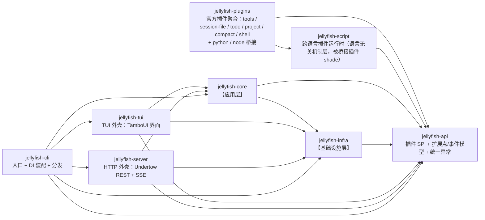

# AGENTS.md

本文件用于指导 AI 编码代理在本仓库中工作。修改代码前请先阅读。

> **只写已落地事实**：正文只描述当前代码中存在的模块与类，未落地与明确不做的部分见「已知边界与后续项」。**推导与实测数据在对应类的注释里，这里只留规则**。

## 项目概述

Jellyfish 是一个用 Java 1.8 编写的轻量级 AI Agent 工具，通过 PF4J 插件扩展能力。

- 坐标：`zcd:jellyfish:0.0.1-SNAPSHOT`
- 构建：Maven（`pom.xml`）
- 运行环境：JDK 1.8（不要使用 Java 9+ 的 API 或语法）

## 常用命令

```bash
mvn -q -Pscript-it test             # 真实 python3 的端到端（不进 mvn test：单测不访问外部资源）
mvn -q compile
mvn -q package -DskipTests
mvn -q test                        # 全量单测（JUnit5 + Mockito + JaCoCo）
mvn -q -Pserver-it test            # Server 模式端到端（真 Undertow + 真内核，走本机回环）
mvn -q -Pshell-it test             # shell 插件端到端（真 /bin/sh，会真起进程再杀掉）
mvn -q -Dtest=ChatStateTest test   # 单类单测，把类名换成目标测试类
```

## 整体架构图


```mermaid
flowchart TB
    subgraph "AgentHarness<br>Agent运行时宿主"
        direction TB

        subgraph "应用层<br>ReAct核心智能"
            ReAct["ReAct Loop<br>思考 → 行动 → 观察"]
        end

        subgraph "基础设施层<br>Harness运行时环境"
            direction TB

            subgraph "内核模块<br>单向依赖 + 构造器注入"
                direction LR
                SessionMgr["SessionManager<br>会话 + 消息 + token + 当前态"]
                AgentMgr["AgentManager + AgentRegistry<br>Agent 定义与权限策略"]
                CommandMgr["CommandManager<br>解析 / 分发 / 清单（无状态，对外壳中立）"]
                ModelMgr["ModelManager<br>Provider/Model 注册与路由"]
                LLMClient["LLMClient<br>统一 LLM 调用抽象"]
                PermMgr["PermissionManager<br>核心策略 → PLAN 白名单 → 插件拦截"]
            end

            subgraph "扩展层<br>内核与插件唯一边界；底座 infra/registry"
                direction LR
                Registry["TypeRegistry<br>「类型 + 路由键」→ 有序 handler 集合"]
                ExtReg["ExtensionRegistry<br>同步派发 · 有返回值 · 不可丢弃"]
                EventCh["EventChannel<br>异步派发 · void · 可丢弃"]
                PluginMgr["PF4JPluginManager<br>插件加载 / 热部署"]
                PluginCtx["PluginContext<br>插件唯一入口"]
            end

            subgraph "支撑基础设施"
                direction LR
                Runtime["RuntimeConfig<br>配置解析/合并/注入（启动期）"]
                Reloader["ConfigReloader<br>/reload 触发，单飞不回滚"]
                Metrics["可观测性<br>MetricsRegistry / HealthCheck"]
            end
        end
    end

    subgraph "外壳入口·jellyfish-cli / jellyfish-tui"
        direction LR
        CLI["jellyfish-cli / jellyfish-tui / jellyfish-server<br>main · Launcher · RunMode · Dagger 装配<br>-cli / -tui / -server 已落地"]
    end

    subgraph "外部依赖·配置"
        direction LR
        Models["models.json<br>全局 + 项目"]
        Jelly["jellyfish.json<br>全局 + 项目"]
        Agents["agents.json + default-agent.json<br>+ {agentId}.md"]
    end

    subgraph "外部依赖·模型提供商"
        direction LR
        LLM["外部 LLM API<br>OpenAI/Azure/Ollama"]
    end

    subgraph "外部依赖·插件"
        direction LR
        Plugins["PF4J 插件<br>tools / session-file / todo / project / compact / shell<br>+ python / node 桥接（脚本进程由它承载）"]
    end

    %% ===================== 外壳入口：命令走用户输入，不走 LLM =====================
    CLI ==>|"命令原文 + sessionId"| CommandMgr
    CLI ==>|"命令名 + 参数 + sessionId"| CommandMgr
    CLI -->|"chat：唯一入口"| ReAct
    CommandMgr ==>|"CommandResult / 清单 / 帮助"| CLI

    %% ===================== 内核内部：接口 + 构造器注入（细实线） =====================
    ReAct -->|"消息 / 上下文 / 当前态 / token"| SessionMgr
    ReAct ==>|"beginTurn / flush：回合级落盘（不可丢）"| SessionMgr
    ReAct -->|"getCurrentLlmClient"| ModelMgr
    ReAct -->|"调用 LLM"| LLMClient
    ReAct -->|"同步权限检查"| PermMgr
    SessionMgr -->|"按 currentAgentId 取定义"| AgentMgr
    ModelMgr -->|"管理/创建/路由"| LLMClient
    LLMClient -->|"HTTP/API"| LLM

    %% ===================== 扩展层·同步派发：需要结果或必须完成（粗线） =====================
    ReAct ==>|"list：工具清单（LlmTool）"| ExtReg
    ReAct ==>|"ToolCallRequest（工具名 + 参数）"| ExtReg
    ReAct ==>|"PromptContributionRequest（只进 system prompt）"| ExtReg
    SessionMgr ==>|"会话持久化 / 恢复（不可丢）"| ExtReg
    PermMgr ==>|"权限拦截（插件只能返回两态）"| ExtReg
    ExtReg ==>|"贡献结果"| ReAct

    %% ===================== 扩展层·通知：按角色开放，内核模块作为事件发布者（点线，无返回值） =====================
    ReAct -.->|"轮次开始 / 工具结果"| EventCh
    SessionMgr -.->|"会话创建 / 消息追加 / 关闭"| EventCh
    AgentMgr -.->|"AgentsLoadedEvent"| EventCh
    ModelMgr -.->|"ModelsLoadedEvent"| EventCh
    PermMgr -.->|"权限审计"| EventCh
    CommandMgr -.->|"命令审计（CommandExecutedEvent）"| EventCh
    EventCh -.->|"分发事件"| Metrics

    %% ===================== 扩展层内部：一份注册表 + 两种派发策略 =====================
    Registry -->|"同步策略：调用点内联，取返回值"| ExtReg
    Registry -->|"异步策略：有界队列，可丢弃"| EventCh
    PluginMgr -->|"加载 / 交付 PluginContext"| PluginCtx
    PluginCtx -->|"handle：工具 / 命令注册（描述符随 handler 存）"| ExtReg
    PluginCtx -->|"contribute：其它扩展点注册 / 按 pluginId 退订"| ExtReg
    PluginCtx -->|"observe / emit：按 pluginId 订阅与退订"| EventCh

    %% ===================== 命令域：handler 与描述符同落一份注册表，CommandManager 只做解析、分发与清单 =====================
    CommandMgr ==>|"handler(命令名) + invoke：共用分发路径"| ExtReg
    CommandMgr ==>|"descriptorBindings 取命令名 / 别名 / 帮助"| ExtReg

    %% ===================== 配置热更新：/reload 触发的一次性编排（非运行期总线） =====================
    Reloader -->|"重读配置 + 刷新快照"| Runtime
    Reloader ==>|"按差异启停 / 重启插件"| PluginMgr
    Reloader -.->|"ConfigReloadedEvent"| EventCh

    %% ===================== 边界 <-> 插件 =====================
    PluginCtx -->|"插件唯一入口"| Plugins
    ExtReg -->|"按类型 + 路由键有序分发"| Plugins
    EventCh -->|"白名单 + 限流广播"| Plugins
    Plugins -->|"handle / contribute / observe / emit"| PluginCtx

    %% ===================== RuntimeConfig 注入 =====================
    Runtime -->|"读取合并, 项目级优先"| Models
    Runtime -->|"读取合并, 项目级优先"| Jelly
    Runtime -->|"读取合并, 项目级优先"| Agents
    Runtime -->|"注入配置"| ModelMgr
    Runtime -->|"注入定义"| AgentMgr
    Runtime -->|"注入插件配置"| PluginMgr
    Runtime -->|"注入权限配置"| PermMgr
    Runtime -->|"注入事件配置"| EventCh

    classDef app fill:#E9F7EF,stroke:#2E8B57,color:#123
    classDef kernel fill:#E8F4FD,stroke:#2E6DA4,color:#123
    classDef extlayer fill:#FDF2E3,stroke:#C77B00,color:#123
    classDef support fill:#F2F2F2,stroke:#888,color:#333
    classDef ext fill:#FAFAFA,stroke:#AAA,color:#444

    class ReAct app
    class SessionMgr,AgentMgr,ModelMgr,LLMClient,PermMgr,CommandMgr kernel
    class Registry,ExtReg,EventCh,PluginMgr,PluginCtx extlayer
    class Runtime,Reloader,Metrics support
    class LLM,Plugins,Jelly,Agents ext
```

> 图例：`==>` 同步调用；`-->` 内核内部调用；`-.->` 异步通知。

## 代码结构

Maven 多模块；根 `jellyfish`（`zcd:jellyfish:0.0.1-SNAPSHOT`）是 `packaging=pom` 的聚合与父 POM。

依赖方向单向，禁止反向或循环：


```mermaid
flowchart LR
    API["jellyfish-api<br>插件 SPI + 扩展点/事件模型 + 统一异常"]
    PLUGINS["jellyfish-plugins<br>官方插件聚合：tools / session-file / todo / project / compact / shell<br>+ python / node 桥接"]
    SCRIPT["jellyfish-script<br>跨语言插件运行时（语言无关机制层，被桥接插件 shade）"]
    INFRA["jellyfish-infra<br>【基础设施层】"]
    CORE["jellyfish-core<br>【应用层】"]
    TUI["jellyfish-tui<br>TUI 外壳：TamboUI 界面"]
    SERVER["jellyfish-server<br>HTTP 外壳：Undertow REST + SSE"]
    CLI["jellyfish-cli<br>入口 + DI 装配 + 分发"]

    PLUGINS --> API
    PLUGINS --> SCRIPT
    SCRIPT --> API
    CORE --> API
    CORE --> INFRA
    INFRA --> API
    TUI --> CORE
    TUI --> INFRA
    TUI --> API
    SERVER --> CORE
    SERVER --> INFRA
    SERVER --> API
    CLI --> CORE
    CLI --> INFRA
    CLI --> API
    CLI --> TUI
    CLI --> SERVER
```

跨语言桥接插件是「官方插件」里的特例：它额外依赖 `jellyfish-script`，并把该运行时连同 Jackson（**含 `jackson-module-parameter-names`**，api 快照类型靠构造器参数名反序列化）、Apache Commons Exec **shade 进自己的插件包**，因此 `jellyfish-infra` / `jellyfish-core` 的 classpath 上不出现任何跨语言代码。`jellyfish-script` 是**库而不是插件**，不产出到 `plugins/` 目录。

官方插件与内核之间没有编译期依赖：由 `PF4JPluginManager` 运行时从 `config.json` 的 `plugins.roots`（默认 `plugins/`）加载，因此不在上面的依赖链里。

| 模块 | 职责 | 依赖 |
| --- | --- | --- |
| `jellyfish-api` | 插件作者唯一的稳定契约：SPI、扩展点/事件模型、统一异常 | 无 |
| `jellyfish-infra` | 基础设施层全部实现（会话 / agent / 模型 / 权限 / 插件运行时 / 命令域 / UI / 指标 / 配置） | api |
| `jellyfish-core` | 应用层：ReAct 循环与 `AgentHarness` 门面、提示词组装、压缩机制、系统命令 | api、infra |
| `jellyfish-tui` | TUI 外壳：TamboUI 界面、视图投影与滚动、TUI 版 `ReActListener` | api、infra、core |
| `jellyfish-server` | HTTP 外壳：Undertow 上的 REST + SSE、会话按 id 寻址、HTTP 化人工审批 | api、infra、core、undertow-core |
| `jellyfish-cli` | `main`、参数解析、模式分发、Dagger 装配、shade 可执行 jar | api、infra、core、tui、server |
| `jellyfish-script` | 跨语言插件运行时（语言无关机制层）：JSON-RPC over Stdio、静态清单、进程生命周期、事件桥接、熔断 | api（provided） |
| `jellyfish-plugins` | 官方插件聚合（packaging=pom），只聚合不产出构件 | 各插件子模块 |
| `jellyfish-plugin-tools` | 五个文件工具：`read_file` / `write_file` / `edit_file` / `list_dir` / `grep_files` | api（provided） |
| `jellyfish-plugin-session-file` | 会话持久化：一个会话一个 JSON 文件 + git 管理历史 | api（provided） |
| `jellyfish-plugin-todo` | 会话待办：`todo_write` 工具 + `/todo` + 提示词/状态栏/面板贡献 | api（provided） |
| `jellyfish-plugin-project` | 项目约定：探测工作目录下 `AGENTS.md`，小文件内联原文、大文件只给路径 | api（provided） |
| `jellyfish-plugin-node` | Node 桥接插件：与 python 插件同构（同一个 `ScriptBridgePlugin` 骨架），差异只有 `NodeLanguage` 与网关资源 `script/gateway.js`（Node 事件循环）、`script/worker.js`、`script/jellyfish_sdk.js`、`script/script_wire.js`、`script/dump_manifest.js`。**零第三方依赖**（只用 Node 内置模块，因此不需要 npm install） | api（provided）、jellyfish-script（shade） |
| `jellyfish-plugin-compact` | 压缩策略：摘要指令 + 保留条数与摘要上限；不启用它压缩整体不可用 | api（provided） |
| `jellyfish-plugin-shell` | 命令行：`shell` 工具（`/bin/sh -c` 执行命令原文）+ 命令分类器（只读不打扰 / 灾难形状拒绝 / 其余审批）。**无沙箱**，能读写本用户任意文件；自带 commons-exec（**shade 进插件包**，内核 classpath 上不出现它） | api（provided）、commons-exec（shade） |
| `jellyfish-plugin-python` | Python 桥接插件：读静态清单完成注册、自带 `/<lang>` 状态命令（含熔断与事件计数）、把每个脚本调用都经熔断装饰器转发、把内核事件推给脚本（`ScriptEventBridge`），把 Python 脚本插件以标准 PF4J 插件的形态接入内核（控制面单进程 + 每脚本一 worker 进程）。网关资源 `script/gateway.py`（单线程 select 事件循环）、`script/worker.py`、`script/jellyfish_sdk.py`（脚本作者唯一的 API）、`script/script_wire.py`（分帧）、`script/dump_manifest.py`（清单生成器，`gateway.py --dump-manifest` 转发同一入口）。示例插件见仓库顶层 `examples/scripts/python/`（`hello` 教学最小集、`jira` 真实形态），**端到端用例直接加载它们**，因此示例不会腐烂 | api（provided）、jellyfish-script（shade） |

包结构（只列包与少数枢纽类；其余类直接读代码）：

```
jellyfish-api/src/main/java/zcd/jellyfish/api/
├── JellyfishException.java     # 统一运行时异常
├── extension/                  # 同步扩展点：请求/结果类型、ToolDescriptor、会话快照
├── event/                      # 事件基类与 notification/ 下的具体通知
├── ui/                         # 插件界面内容的渲染无关模型
└── plugin/                     # 插件 SPI：JellyfishPlugin / PluginContext / PluginDeclaration

jellyfish-infra/src/main/java/zcd/jellyfish/infra/
├── registry/                   # 注册表底座 TypeRegistry
├── extension/                  # 同步派发策略 ExtensionRegistry
├── event/                      # 异步派发策略 EventChannel
├── session/                    # 会话运行态 Session / SessionManager / SessionDefaults / SessionSnapshots
├── agent/                      # Agent 定义注册表 AgentManager / AgentRegistry
├── command/                    # 命令域服务 CommandManager
├── model/                      # 模型注册与路由 ModelManager
├── llm/                        # LLM 调用抽象与厂商实现
├── plugin/                     # 插件运行时 PF4JPluginManager / PluginRuntimeConfig / JellyfishPluginAdapter
├── permission/                 # 权限判定 PermissionManager / ApprovalChannel
├── ui/                         # UI 贡献门面 UiContributions
├── metrics/                    # 指标与健康检查 MetricsRegistry / MetricsSubscriber / HealthCheck
├── config/                     # 配置加载与热更新 RuntimeConfig / ConfigReloader
├── tooloutput/                 # 工具结果治理：ToolOutputEnvelope / ToolOutputStore / ToolOutputLimiter
└── support/                    # 序列化封装、类型常量

jellyfish-core/src/main/java/zcd/jellyfish/core/
├── AgentHarness.java           # 组装门面（chat 是唯一智能入口）
├── ReActLooper.java            # 思考 → 行动 → 观察
├── ReActTurn / ReActListener / ReActResult
├── prompt/                     # PromptAssembler / ContextWindow / ToolCatalog / TokenEstimator / ToolResultAger
├── compact/                    # ConversationCompactor / CompactionPlan / CompactionHealthIndicator
└── command/                    # SystemCommands（owner=core）

jellyfish-cli/src/main/java/zcd/jellyfish/cli/
├── JellyfishApplication.java   # main；Launcher 模式选择与生命周期
├── console/                    # stdout=回答、stderr=诊断
├── mode/                       # CliRunMode / TuiRunMode / ServerRunMode
└── di/                         # Dagger 组件与 Module

jellyfish-tui/src/main/java/zcd/jellyfish/tui/
├── TuiApp.java                 # 唯一入口：按键路由、回合/命令分流、审批浮层
├── ChatShell / ChatLayout      # 版式与二维账本
├── TranscriptProjector / ChatState / InflightTurn   # 视图投影与状态
├── 其余视图 / 输入 / 插件 UI 类
└── text/                       # DisplayWidth / LineWrapper / MarkdownRenderer / ControlChars

jellyfish-plugins/              # 每个子模块一个插件 jar，源码结构同构：
                                #   resources/plugin.properties + PluginConfig + JellyfishPlugin 实现 + 各扩展点 handler

jellyfish-script/src/main/java/zcd/jellyfish/script/
├── ScriptLanguage.java         # 语言适配 SPI（启动命令 / 探测命令 / 环境变量白名单 / 网关资源清单）
├── ScriptBridgePlugin.java     # 桥接插件的骨架（探测/扫描/注册/事件/熔断/<语言>命令/关闭）
├── ScriptBridgeConfig.java     # 桥接插件配置解析（解释器键名与两个默认值由子类传）
├── ScriptLedger.java           # 脚本台账渲染（语言名只是入参）
├── ScriptJson.java             # 统一序列化（插件看不到 infra 的 ObjectMapperWrapper，故自带一份）
├── ScriptManifest.java         # 静态清单的零容忍解析与校验（未知键报错并列出允许键名）
├── ScriptPluginScanner.java    # 扫描脚本目录，逐脚本问题隔离
├── ScriptRegistrar.java        # 清单 → 内核注册表里的转发处理器（逐条注册隔离）
├── ScriptCaller.java           # 脚本调用入口（注册与执行之间的那道缝）
├── codec/                      # ExtensionCodec / ExtensionCodecs / 11 个扩展点编解码 / Payloads
├── protocol/                   # ScriptProtocol（帧 + 方法名 + 错误码）/ ScriptRpc（id 配对、超时、
                                #   迟到响应丢弃、断连唤醒）/ 三类调用失败异常
├── ScriptGateway.java          # 懒启动、initialize 下发清单摘要、转发、超时隔离（kill_worker）、关闭两段式
├── CircuitBreakerSettings.java # 熔断参数（失败阈值 / 冷却 / 转永久轮数，0 分别表示关闭该项）
├── ScriptCircuitBreaker.java   # 单脚本熔断状态机（CLOSED/OPEN/HALF_OPEN/PERMANENT，自动半开）
├── ScriptCircuitListener.java  # 打开 / 恢复各通知一次（由装配方发成 ConfigWarningEvent）
├── CircuitBreakingScriptCaller.java
                                # 装饰 ScriptCaller：打开期间立即抛 -32001 且**不派发**（即不摘注册）
├── ScriptProcess / ScriptProcessFactory / CommonsExecScriptProcess
                                # 子进程接口 + 接缝 + Commons Exec 实现（自持 StreamPumper + 行切分流）
├── GatewaySettings.java        # 下发给网关的超时/自毁/严格校验/事件收窄
├── GatewayResources.java       # 网关资源按内容摘要抽取到磁盘
└── （P6 起）EventBridge
```

资源位置：`default-agent.json` / `jellyfish.md` 在 infra 资源根；`summary-prompt.md` 在压缩插件资源根；`config.json` / `log4j2*.xml` 在 cli 资源根。

## 架构要点

### 新增一门语言（桥接插件）

- **注册来源是脚本目录下的静态 `manifest.json`，协议里没有任何注册方法**：因此 `start()` 期**零进程、零文件写入**，解释器缺失或损坏不影响内核启动、工具清单依然完整（PF4J 看到的永远是标准插件）。运行架构是「控制面单实例（每语言一个常驻 gateway，不跑业务）+ 数据面按脚本隔离（每脚本一 worker，懒启动、空闲自毁）」，真实解释器的端到端测试在 `mvn -Pscript-it test`。
- **一门语言 = 一个 `ScriptLanguage` 实现 + 一个薄插件 + 一份该语言的网关资源**，机制层不动。语言适配只回答四件事：怎么启动（`startCommand`）、启动前怎么探测（`probeCommand`）、进程带什么环境（`environment`，白名单而非清空）、网关由哪几个文件组成（`gatewayResources`）。
- **桥接插件的骨架全在 `jellyfish-script/ScriptBridgePlugin`**：探测解释器 → 扫描清单 → 逐脚本按 `pluginId::scriptId` 注册 → 接通事件桥接与熔断 → 注册 `/<语言>` 命令 → 按序关闭。子类只提供 `resolveConfig`（解释器写在哪一个键上、两个默认值）与 `createLanguage`。**要往子类里加第二件事之前，先问它是不是语言无关的**：是就该往上收（判断依据见 `ScriptLanguage` 的 javadoc）。
- **配置解析、台账渲染与语言无关**：`ScriptBridgeConfig` / `ScriptLedger` 一份服务所有语言；解释器键名保留各语言自己的名字（`pythonPath` / `nodePath`），由薄插件传进去——用户翻配置时找的是他那门语言的词。
- **`gatewayResources()` 归语言适配**：它是「这门语言的网关由哪几个文件组成」，与解释器路径同类；留给调用方就等于同一份知识在多处各写一遍，而不一致的表现是「网关少了一个文件」——只在第一次调用时才看得见。
- **两门语言的脚本 API 逐条对应**（`tool` / `command` / `contributes` / `subscribe` / `dumpManifest` / `compareWith`），差异只在语言本身：Python 用装饰器、Node 用「声明 + 就地注册」；Python 从文档字符串取缺省描述，Node 必须显式写 `description`（JS 拿不到注释）。**命令名片上的 `session_required` / `sessionRequired` 同样逐条对应，缺省 `True` / `true`**。
- **候选查询的约定两侧必须一致：`tokens is None`（`tokens === null`）表示「这次是候选查询」**，执行给真实的 `tokens`（`[]` 表示用户没输入参数，与 `None` 不是一回事）。`has_options=True` 让**同一个函数**回答两条路，因此只有这条标记能区分它们；Python 侧还会在**声明期**拒绝看不出两条路的签名并附最小写法，Node 侧拿不到参数名、只能靠 `null` 解引用报错——**约定共享、校验不必对称**。返回一个映射却没有 `choices` 键一律报错，不再补齐成空候选：那正是「忘了分支」的安静版本。
- **卡死的 worker 怎么收，两门语言的答案不同**：Python 的信号处理器直接 `os._exit`（CPython 在信号处理器返回后才恢复被中断的调用），因此 SIGTERM 一般够用、强杀只在关闭路径上兜底；**Node 的信号处理器排在事件循环上，卡在同步 JS 里的 worker 收不到 SIGTERM**，因此两段式关闭的第二步必须在网关的循环里做。
- **Node 侧的差异都由语言本身带来**：用 `spawn` + 一条 `init` 帧把脚本目录 / 入口 / 清单送进 worker（Node 没有 `fork`；走 argv 会让清单在进程列表里可见、还会撞参数长度上限）；收尾后必须显式 `process.exit(code)`（`resume` 过的 stdin 是活句柄，会让事件循环一直转）；`require('jellyfish_sdk')` 靠网关给 worker 设 `NODE_PATH`（非相对引入只查 `node_modules` 链与 `NODE_PATH`）。Node 运行时零第三方依赖（`script/{gateway,worker,jellyfish_sdk,script_wire,dump_manifest}.js`），示例见 `examples/scripts/node/`。
- **协议通道必须同步写**：Python 靠 `PYTHONUNBUFFERED` + 流锁，Node 靠把 `process.stdout.write` 换成同步写。异步缓冲的后果是「一个大结果帧被脚本自己的一行日志半路插入」，而现场是「偶尔收到一帧解析不了」。
- **离线生成器与运行期入口分开**：清单生成是开发期动作（进程里只该有一个脚本被加载），网关是运行期进程（同时管多个脚本）。`dump_manifest` 与 `gateway --dump-manifest` 共用同一个入口，但网关那侧是延迟加载的，正常路径上连读都不读它。
- **清单生成器改完实现必须跑一遍**：`--check` 按名字报差异、`--write` 直接落盘（推荐；shell 重定向会先把目标文件截空，而生成器要读它确认入口名）。**注意 `--check` 只比名字**——名片的 `summary` / `usage` / `aliases` / `sessionRequired` 漂移它看不出来，因此改了名片必须 `--write`，别把 `--check` 通过当成「清单是最新的」。

### 扩展层：一份注册表 + 两种派发策略

- **一份注册表 + 两种派发策略**：内核与插件之间只有 `ExtensionRegistry`（同步：调用点内联、按 order 升序、取返回值、不可丢）与 `EventChannel`（异步：有界队列、无返回值、可丢）两个能力面，共用 `infra/registry` 的同一份类型注册表。禁止引入第三方事件总线。
- **选择能力面的判据是「能否丢弃」，不是「有没有返回值」**：工具、提示词注入、权限拦截、会话持久化走同步侧（即使无返回值也不能丢）；轮次通知、指标、审计走异步侧。
- **类型即地址**：请求类型本身就是身份，注册表按「类型 + 路由键」找 handler；插件拿不到的类型就注册不了。
- **同步侧只提供有序查找与单处理器执行，注册表不做编排**：`handler` 同键唯一（0 个 `NO_HANDLER`、多个 `AMBIGUOUS_HANDLER`），`descriptorBindings` 取描述符清单（描述符为空的注册也返回）。调用顺序与结果合并由调用方决定。
- **同步派发没有超时、白名单、异常隔离**：调用方需要确定结果，若不能容忍插件阻塞或抛错，必须自己在调用点设超时或捕获。

### 会话与持久化

- **会话状态一律归 `Session`，进程内没有全局当前态**：agentId / 模型 / 权限模式都是会话字段，由 `SessionManager` 统一读写；会话是内存运行态，不设 `session` 配置段。唯一的进程级字段是 `SessionDefaults`（新建会话的待生效默认值），且**只在 `create` 那一刻被消费**，建完就跟会话无关。
- **`createDefault()` 四项全传 `null`，包括权限模式**：`null` 的含义是「按待生效默认值、其次按更下层的默认」；显式传 `PermissionMode.NORMAL` 会把首页设的那一层默认值直接跳过。
- **`SessionManager` 是唯一变更入口，落盘只有两个例外**：变更同步派发 `SessionPersistRequest` 且异常原样上抛（关闭先落盘再移除，删除走 `SessionDeleteRequest`、删不掉就当没删）。例外一：**创建不落盘**——空会话不留文件与提交，`create` 的失败语义随之从「创建时暴露」变成「第一次变更时暴露」。例外二：**回合内的消息追加只标脏**，由 `ReActLooper.execute` 的 `finally` 调 `flush` 落一次（放 `finally` 才盖得住收敛 / 取消 / 超轮次 / 异常四条路径）。因此新契约是「**回合收敛 = 已落盘**」。
- **恢复的失败语义相反**：`SessionRestoreRequest` 单个插件读不出只告警跳过；恢复必须排在 `pluginManager.bootstrap()` 之后。
- **延迟落盘的失败语义与即时落盘相反**：`flush` 失败只记 WARN 并**保留脏标记**等下次重试（此刻回合已收敛、回答已展示，升级成回合失败既补不回来也无从补救）。`AgentHarness.shutdown` 必须在 `pluginManager.close()` **之前**调 `flushAll()`——落盘经 `ExtensionRegistry` 派发给插件，插件一停就没人接了；没有这一步，「回合级落盘」会把「Ctrl+C 丢当前回合」变成新行为。
- **只有消息追加被挂起**：命令、`recordUsage`、`applyCompaction`、`close` 仍即时落盘。因此跑在独立线程上的自动压缩天然不受回合作用域影响——它本来就是一个独立的落盘单元。
- **跨边界载荷必须是 api 侧快照值类型**（`SessionSnapshot` 及嵌套），映射归 `infra/session/SessionSnapshots`，并用往返测试守字段。**快照类型必须恰好只有一个可见构造器**：新增字段用静态工厂，不要加兼容构造器。
- **`-parameters` 是全局编译约定，不许去掉**：插件侧 Jackson 靠构造器参数名反序列化，丢了会「文件写得出、重启后读不回」。

### 权限与审批

- **权限三层**：核心策略 → PLAN 只读白名单 → 插件拦截，再统一处理 ASK 与审计。fail-open 只覆盖「取不到策略」；策略一旦生效，它的否定就是硬结论。
- **插件拦截是三态 `PermissionVerdict`（`ABSTAIN` / `ASK` / `DENY`），合并取最严（`DENY > ASK > ABSTAIN`）且 `DENY` 短路**；同为 `ASK` 时保留先到者的理由（覆盖它只会让审计里的理由随插件顺序变化）。插件抛错按 `ABSTAIN` 处理。
- **ASK 由 `ApprovalChannel` 收口，只有明确批准才放行**：无审批者、超时、溢出、通道关闭、中断一律拒绝（fail-closed）；超时来自 `permission.approvalTimeoutSeconds`（缺省 120，每轮现读）。
- **只读白名单 = `ToolDescriptor.readOnly`（提供方声明，随 handler 落表）∪ `plugins.configurations.<pluginId>.readOnlyTools`（用户只能追加）**，由 `ReadOnlyTools` 现算。
- **`PermissionVerdict` 里没有 `ALLOW`，因此「插件不能放宽核心策略」是编译期约束**；`ASK` 只可能让调用更严——它最终仍走 `ApprovalChannel`，拿不到批准就降级为拒绝。**需要 `ASK` 的理由**：只有两态时「只读命令免打扰、写类命令要人看一眼」根本写不出来，用户只剩「全放行」与「每次都点批准」两个选择，而后者最终会退化成前者。
- **跨语言权限协议同口径**：`PermissionCodec` 的结果载荷是 `{"verdict":"ABSTAIN|ASK|DENY","reason":...}`，脚本侧保留布尔与字符串简写（`true`/`"deny"`/`"ask"`）；未知裁定报错，不静默按无异议。

### ReAct、上下文与压缩

- **`AgentHarness.chat(sessionId, input, listener)` 是外壳唯一智能入口**，委托 `ReActLooper` 在 `react` 线程池异步推进；工具失败一律转成 tool 结果回灌，只有模型调用本身失败才上抛。
- **上下文裁剪只裁本次请求**：`ContextWindow` 按 `contextLength - maxOutputTokens - contextReserveTokens` 从最旧成组丢弃（toolCalls 与结果同生共死），Session 历史一条不动；模型未配 `contextLength` 时不裁剪。
- **`/compact` 非破坏式、滚动摘要**：消息一条不删，只记 `Session.compaction = {boundaryMessageId, summary, droppedMessageCount}`，失败无副作用；每次只压「上次边界之后、再留 `keepRecent` 条」的那段，并把上一份摘要一起喂回，边界只向后移。
- **摘要是 system prompt 里的一块，不是消息**：顺序 agent 提示词 → 插件贡献 → 历史摘要；作为消息回灌会被每轮重复 append 成假历史。
- **单次压缩、装不下就丢最旧**：待压范围超预算时从最旧侧丢弃，被丢弃条数如实上报并落盘（`droppedMessageCount`）；至少进摘要 1 条。
- **触发两条**：`/compact`（MANUAL），或每轮组装时自动压（AUTO）——用量达 `react.autoCompactPercent`（缺省 80，写 0 关闭）或本次已被机械裁剪。自动压缩跑在本轮调用旁边不阻塞，无范围时零成本。
- **`/compact` 只起头不等结果，且只有无参执行与 `preview` 两种形态**：跑在自持 `compact` 线程池，外壳每帧轮询 `status(sessionId)`（状态带触发原因），摘要调用的 token 经 `recordUsage` 记账但不留消息；不做用户可见档位，「没什么可压」报 ERROR，`preview` 同情况返回 OK 且连模型都不解析。
- **压缩是插件能力、内核只提供机制**：`CompactionStrategyRequest` → `CompactionStrategy` 给摘要指令与两个数量参数；没有插件即整体不可用、不回退内置，`isAvailable()` 只查注册表，自动那一路第一次用不了时记一次 WARN + `ConfigWarningEvent`。
- **插件拿不到消息正文、发起模型调用的能力、否决权**；策略合并取「order 最小且声明了该字段」的那一个，数值由内核钳制（保留 `[0, 消息总数]`、摘要上限 `[200, 20000]`）；处理器必须只读且快，不得发布事件。
- **摘要指令是插件自带资源** `summary-prompt.md`，用插件自己的类加载器启动期读完；占位符 `{maxSummaryChars}` 由内核替换，缺占位符只告警不失败。
- **插件上下文只走 system prompt**：`PromptContributionRequest` 按 order 用 `\n\n` 拼接，**不追加进 messages**；单个处理器抛错只记 WARN 跳过。

### 工具结果截断与卸载

- **工具输出只有一个硬截断点**：`ReActLooper.executeTool` 经 `ToolOutputLimiter.limit` 把「工具原始输出对象」变成回灌文本，回灌给模型、写入会话、通知外壳用的是同一份文本。**两个触发点（事后截断、捕获期溢出）共用同一份预览切分与信封实现**，参数各自算、格式只有一套。
- **预览是头 30% + 尾 70%**（`ToolOutputPreview`，比例与省略标记是常量、不开放配置）：结论往往在末尾，只留头会让模型看到「一切正常的前 90%」；省略标记写明省略的行数与字符数。结构化数组是「前缀 + 哨兵元素 + 后缀」，对象只取前缀字段——避免模型把两段当成一份连续数据。
- **捕获期 sink 让内存占用与输出体积无关**：`ToolOutputSink.write` 是无界输出（命令行）的入口，`SpillCapturingSink` 阈值前缓冲、溢出时转写磁盘、之后内存里只留头尾窗口。**落盘只在溢出时发生**，短输出不产生任何文件。
- **`finish()` 幂等**：内核在 `finally` 兜底调用，工具自己也会调；收尾之后再写入会被丢弃并记 WARN。
- **落盘上限 `spillMaxBytes`（缺省 32 MiB，运行期钳制不超过 `maxBytes`）**：触及上限时写入截到上限为止（不是整个放弃——那会留下空文件而信封却说「文件里有前一段」），并置信封字段 `_partial`，否则「完整内容在 path」就是假话。
- **实时输出是旁路**：`ReActListener.onToolCallOutput` 由工具的泵线程触发（**不在 react 线程上、可能被并发调用**），可丢、抛错被隔离；**它绝不能阻塞**，否则子进程会因管道写满而停住。它只用于过程展示，落会话与回灌模型的仍是同一份权威文本。
- **区分文本与结构化，绝不按字符切**：字符串按行截断；脚本工具返回的 `Map`/`List` 先序列化再按 JSON 子树截断（数组取前缀、对象取前缀字段），回灌的一定是一段合法 JSON 信封。**不要在任何地方对可能是 JSON 的输出做 `substring`**。
- **信封是唯一格式**：`react.toolOutput` 定义落盘与上下文治理；超限时完整内容落盘，回灌 `{_truncated, _tool, _total_chars, _total_lines, _path, _hint, preview}`。渲染与解析共用 `ToolOutputEnvelope` 的字段常量，禁止两处各写一遍键名。
- **落盘失败不是回合失败**：`ToolOutputStore.store` 失败只返回 `null` 并 WARN，信封记 `_path: null` 并说明不可恢复；磁盘不可写不该把「一次工具调用」升级成故障。
- **清理只报告不阻断**：每会话按文件数 / 总字节上限从最旧删起，且永不删刚落盘的那个；写临时文件再原子改名（与 PID 文件同口径）。
- **上下文老化排在机械裁剪之前**：`ToolResultAger` 把「保留窗口之外」的信封换成带路径的 stub，只改本次请求、Session 一条不动；`keepRecentMessages` 写 `0` 表示关闭。`ContextWindow` 对 `tool` 消息不做逐字符截断，直接替成 stub。
- **工具层先自我限流**：`read_file` 有 `max_bytes`、`list_dir` 有 `limit`/`offset`、`grep_files` 有 `max_line_chars`/`max_bytes`；工具层限不住时再由中间件兜底，两层都不能省。
- **`read_file` 单行就超过 `max_bytes` 时报错，不切短**：切短会输出一行「看起来完整、实际残缺」的内容，模型无从判断自己拿到的是不是全文；错误文案给出三条出路（缩小 `limit`、调大 `max_bytes`、改用 `grep_files`）。多行累加超预算仍照旧分页（内容还在文件里，可按 `offset` 续读），两条路径的语义要分清。

### 工具调用的取消与长任务

- **取消令牌 `CancellationToken` 随 `ToolCallRequest` 交给工具**（未提供时为 `NONE`）：同步派发不会中断正在执行的工具，长阻塞的工具（命令行）只能靠它自己响应。它刻意**不走可丢的事件通道**——取消是「按下 Esc 之后必须成立的同步事实」。
- **`ReActTurnImpl` 兼作令牌**：回调**恰好执行一次**（注册时已取消则立即执行）、单个回调抛错不影响其余；回调可能在渲染线程上执行，**因此只能是「发个信号、置个标志」这类快动作**。
- **`ToolOutputSink` 是内核实现、插件只往里写**：插件因此不知道落盘路径、目录、命名与信封格式。它必须线程安全（stdout / stderr 两条泵线程并发调用）且必须持续接受写入。

### 命令行与进程

- **`shell` 没有沙箱**：命令以本进程权限执行，能读写本用户任意文件。这是能力而非漏洞，但必须让用户知道。
- **`shell` 默认不进 `askTools`，而这是刻意的**：分类器会把只读命令判成无异议（静默执行）、把其余命令升级为 `ASK`（弹一次批准框）。把 `shell` 写进 `askTools` 则是「每条命令都批准」——核心策略的 `ASK` 无法被插件的 `ABSTAIN` 降级，插件裁定只能收紧不能放宽。这一点常被写反，改动前先看 `PermissionManager.decide`。
- **不做目录围栏**：可绕过（`cd /`、绝对路径、`sh -c` 嵌套）、与 `read_file` / `write_file` 没有围栏不自洽、还会挡住合法需求。真正的边界是审批加白名单。
- **命令原文交给 `/bin/sh -c`**，因此管道、重定向、通配符按 shell 语义工作；每次调用都是新 shell，`cd` 不跨调用保留（要换目录就传 `cwd` 或 `cd X && cmd`）。Windows 映射 `cmd.exe /c` 但**未验证**。
- **`stdin` 在启动后立即关闭**：交互式命令（`vi` / `ssh` / `sudo`）必须快速失败，且绝不能抢终端——TUI 处于 raw 模式，子进程直接写终端会把界面画烂。
- **stdout 与 stderr 合并为一条流**（到达顺序，像终端）；**必须持续排空**，即使已经放弃保留内容——停止读取会让子进程因管道写满而永久阻塞，表现是「命令卡死」。
- **非零退出码如实报告，不抛异常**：`grep` 返回 1 是信息；抛异常会把「命令说了没有」与「命令根本没跑起来」混成一件事。
- **两道计时器互相独立**：墙钟（缺省 120 秒，模型可用 `timeout_seconds` 覆盖并被 `maxTimeoutSeconds` 钳制，缺省 1800）与静默（`idleTimeoutSeconds`，**缺省关闭**，只有用户能配）。前者回答「最多跑多久」，后者回答「多久没动静就当死了」；有些命令确实长时间无输出，因此静默缺省不开。**两者与取消在同一个等待循环里判定**，同一次调用的终止只有一个发起方——这也是不使用 `ExecuteWatchdog` 的原因。
- **终止链是 TERM → 宽限 → KILL，并尽力杀进程树**：只杀直接子进程会让 `npm run dev` 拉起的孙进程继续跑（「报告已终止，端口却还占着」）。JDK 8 没有 `ProcessHandle.descendants()`，只能靠 `pgrep -P` 递归，**杀不干净是已知边界**。
- **取消回调只发信号**：它可能在界面渲染线程上执行，因此不等待、不递归；完整的终止链由等待循环在几十毫秒内接手。**判定顺序必须是「先看令牌，再看进程是否退出」**——取消回调会直接杀进程，先判退出会把取消误报成正常完成。
- **环境是「继承 + 默认脱敏 + 防挂死」**：丢掉 `PATH` 会让几乎所有命令 command not found，因此不采用严格白名单；代价是脱敏必须默认开启（名字匹配 `*KEY*` / `*TOKEN*` / `*SECRET*` / `*PASSWORD*` / `*CREDENTIAL*` 的变量不传子进程）——工具输出会送到远端 LLM。防挂死注入 `PAGER=cat` / `GIT_PAGER=cat` / `GIT_TERMINAL_PROMPT=0` / `TERM=dumb` / `NO_COLOR=1` / `DEBIAN_FRONTEND=noninteractive`。
- **命令分类器是便利机制，不是安全边界**：按命令原文的前缀匹配，`FOO=bar cmd`、`$(...)`、`&&` 链、`sh -c` 嵌套都能绕过。它的价值是让只读查询不再打扰人，从而避免用户因为嫌烦把 `shell` 从 `askTools` 里整个拿掉。`find` / `git fetch` / `npm test` **刻意不算只读**（`find -delete`、改远端 ref、执行仓库里的任意代码）。
- **前缀白名单与分类器是两件事**：`allowedCommands` 非空即**默认拒绝**（给 `-cli` / `-server` 这类没有人在场的模式准备的安全网），且**不受 `commandPolicy.enabled` 影响**——那个开关关掉的是分类器这个便利机制，不是用户明确声明的约束。
- **插件停止时必须终止在途命令**（`stop()` → 杀在途），否则用户看到的是「jellyfish 都退出了，那条命令还在跑」。

### 故障模型与熔断

- **三级故障**：L1 单次调用超时/脚本回报错误、L2 worker 崩溃 → 都只影响该脚本；L3 网关进程挂掉 → 整门语言不可用。
- **计入熔断的只有「脚本没能答复」**：超时与脚本回报的错误计入；**连接层失败（L3）不计**（网关是懒启动的，一次短暂故障不该让所有脚本再等一个冷却），**`-32001`（熔断自己的拒绝）不计**（否则冷却会被自己的拒绝无限延长）。判据只此一处：`CircuitBreakingScriptCaller.countsAsFailure`。
- **不摘注册**：熔断期间转发闭包立即抛 `-32001` 且不派发。注册只能在 `start()` 窗口内发生，摘掉就等于恢复必须走 `/reload`；保留注册才有**自动半开恢复**。打开与恢复各 `emit` 一次 `ConfigWarningEvent`。
- **状态是既成事实**：`HALF_OPEN` 表示「已放行过一次探测」而非「冷却已到期」；读状态不推进状态，只有 `admit()` / `recordSuccess()` / `recordFailure()` 能转移。半开期不限制并发探测数（限制它要挂住调用线程，代价比多几次失败大）。
- **超时处置链**：宿主 `invoke` 超时 → 发 `kill_worker`（**kill 的执行方是网关**，它是父进程、持有 PID 表与回收）→ 网关杀 worker 回 `killed` → 宿主抛「已等待 N ms，已隔离该脚本的 worker」。网关自己也有同一个截止时间兜底，两边都动手是正常的，因此 `killWorker` 把「没杀到」当正常返回值。
- **超时之后有一段「正在换 worker」的窗口**：卡在不响应信号的系统调用里的 worker 只能等强杀，这期间同一脚本的调用仍会失败（已实现行为，非抖动）。熔断冷却应明显长于这个窗口。
- **迟到响应按 id 丢弃、不做补偿**：`ScriptRpc` 在超时时已摘掉等待位；`ScriptGateway.describe()` 与 `/<lang>` 台账都会给出计数。
- **worker 必须能被「立刻杀死」，两条都不能靠主线程配合**：① SIGTERM/SIGINT 处理器直接 `os._exit`（只置标志位是无效的——CPython 在处理器返回后会**恢复**被中断的系统调用，卡在用户代码里的脚本永远轮不到事件循环）；② `getppid()==1` 的孤儿检查由 `setitimer(ITIMER_REAL)` + `SIGALRM` 定时驱动，而不是放在事件循环顶部。两者都是实测出来的：以前网关被 `kill -9` 后会留下卡在 `time.sleep` 里的 worker，日志里没有任何一条指向它。
- **`invokeTimeoutSeconds: 0` 必须显式表示「没有截止时间」**：拿 0 当截止时间会让 `now > deadline` 恒真，每次调用都在派发的下一拍被秒杀，而配置的字面意思是「不超时」。

### 进程生命周期与 PID 文件

- **示例脚本在仓库顶层 `examples/scripts/{python,node}/`，且被端到端用例直接加载**：示例是从进程工作目录之外的路径被加载的（先拷进临时脚本根目录，因为 `hello` 会往自己的目录写便签），因此「示例能不能用」有 CI 守着——放在文档里的示例代码会腐烂，这份不会。改示例时 `manifest.json` 与声明必须一起改，`dump_manifest --check` 就是给这件事用的；两门语言的示例共用一份 `examples/scripts/README.md`，差异列成一张表，会一门就会另一门。
- **清单生成器的打印结果必须是内核认得的清单原文**：为比较而补齐缺省值的形状是另一份数据，把那份打印出来会让用户抄回一份内核拒收的清单。
- **「发一条事件然后立刻查状态」的用例必须让出时间**：事件异步到达且只推给**空闲** worker，而查询动作本身就把 worker 占住——两者相遇时事件被按设计丢掉，且丢掉就是永久丢掉（不排队、不重试）。这不是网关的 bug，是「不排队」的直接代价。
- **fork 出来的 worker 必须摘下继承的信号唤醒管道**（`signal.set_wakeup_fd(-1)`，在 `_child_setup` 里）：网关的唤醒管道 fd 随即被关掉，不摘的话 worker 每收到一个信号都往已关闭的 fd 写一次，往 stderr 吐四行 `Bad file descriptor` 的 traceback——**每两秒一条**，正好把真正有用的日志淹没。
- **四层防泄漏**：Java 三段式关闭 + `ShutdownHook`（**不装 `ExecuteWatchdog`**：它按墙上时钟强杀，而网关是设计成可空闲十分钟的长命进程）→ 网关作为父进程杀全部 worker → worker 自己两秒内发现「父进程没了」并退出（Linux 上另有 `prctl(PR_SET_PDEATHSIG)` 让内核代杀；设完必须自查一次 `getppid()`——父进程可能死在「fork 之后、prctl 之前」。**本机是 macOS，这条无法验证，且正确性不依赖它**）→ PID 文件供事后排查。
- **PID 文件是快照，不是锁**：不参与任何互斥判断，也没有任何代码会根据它做处置。文件里那个 PID 完全可能属于另一个 JVM（上一个 JVM 被 `kill -9`、遗留网关还没自毁、新 JVM 又起来了），未经确认就杀，代价是杀掉无辜进程。
- **路径由 Java 侧算好下发**（`ScriptPidFiles` → `GatewaySettings.pidFile`），与其它网关设置同理：让每种语言的网关自己取主目录、拼目录，三份实现里必然有两份漂移。
- **默认与网关资源目录同级**（`~/jellyfish/pids`）：资源目录名带内容摘要，改一个字节就换目录，而 PID 文件的全部价值就在「被下一次启动看见」。
- **写的人必须是「PID 属于谁」的权威**：网关自己写 `os.getpid()`；宿主即使能拿到子进程 PID 也不写。
- **先写临时文件再 `os.replace`**：读到一个只写了一半的数字比没有文件更糟——它会被当成真的。
- **干净退出时删掉，但仅当文件里仍是自己的 PID**：先走的那一个不许删掉「后来者还活着」这份唯一证据；被 `kill -9` 时它留着（这正是它存在的理由）。
- **发现陈旧内容一律只报告**：存活判定用 `os.kill(pid, 0)`（不发信号；僵尸也算「在」，排查时这是更保守的方向），结论走 `initialize` 应答 → 宿主 WARN + `/<lang>` 台账。**写不成也不拦住启动**：PID 文件是排查线索而非运行前提，为它拒绝服务会把「没有线索」升级成「脚本全不可用」。
- **进程侧状态靠推送，没有 `status` 协议方法**：worker 的 PID、在途、排队只有网关知道，而 `/<lang>` 是渲染路径——在那里发阻塞 RPC 会把展示变成可能挂住的路径，还会让「看一眼状态」成为启动网关的理由。因此 `worker_state` 携带 `pid`/`queued`/`inflight`，并由网关循环里的**一次对账**推变化（不是每个改动队列的地方各推一次：漏一处就是永久陈旧的数字）；宿主只记录、并在生命周期状态真正变化时才 INFO。

### 事件桥接

- **两侧共用同一份白名单，且都硬编码在 `jellyfish-script` 里**：可订阅 = `ScriptEventCatalog` 的 15 个通知事件（白名单而非黑名单，内核新增事件不会自动对脚本开放）；可发布 = `ScriptEventFactory` 的 `PluginNotificationEvent` / `ConfigWarningEvent` 两类自由载荷事件。**脚本不能伪造内核语义事件**——那类事件是内核事实的转述，指标与审计按「它是真的」消费。
- **投影只下发标量**：不下发嵌套快照，否则内核内部结构就成了脚本的对外契约。字段缺失不写成 JSON `null`，集合排序，枚举下发枚举名；载荷必带 `event` / `eventId` / `occurredAt`，无会话上下文时**没有** `sessionId` 键。
- **事件名的拒绝在清单期**（`ScriptManifest.parseEvents` 查目录白名单）：运行期那条路是静默的（处理器永不执行），报错里带上全部可订阅名字。
- **推送必须有队列 + 独立线程**：事件由 `EventChannel` 通知线程投递，而写子进程 stdin 会阻塞——钉死通知线程等于让指标、界面、审计一起停摆。丢弃三种情形（网关未运行、队列满、发送失败）都计数。
- **事件不拉起任何进程**：网关没在运行 / 该脚本 worker 没起过 / worker 正忙，一律丢弃并计数。让一条通知去 fork 解释器，等于把「事件到了」变成一次重操作，而且它在通知线程上。
- **网关只推给「闲着的」worker**：worker 单线程，卡在一次长调用里时 socket 缓冲区会被事件填满，而网关是单线程事件循环——一次阻塞写就停摆。
- **发布是端到端单向的**：worker 发不带 id 的 `emit_event` 通知；网关把它转成**带 id 的调用**只为拿到应答里的 `eventId`，据此记住「这条事件是哪个脚本刚发的」并在扇出时跳过它（有界 256 条，按条数过期）。**回声记忆放网关**是因为扇出点在网关，Java 侧过滤只能整条不推。
- **拒绝发布只记 WARN，不补发告警事件**：告警本身也是可订阅事件，脚本收到告警后再发一次非法事件就是跨进程的环。跨脚本的相互触发也没有全局检测（只消了直系回声），两侧都有计数可见。
- **推送路径的异常捕获面必须开大**：事件是旁路，一次 `TypeError` 就曾把整个网关带走——把「少收一条通知」升级成「所有脚本不可用」。

### 命令域

- **`CommandManager` 不注册处理器、不持有会话、不缓存索引**：命令名即路由键，别名与用法来自 `CommandDescriptor`；原文入口与结构化入口共用同一条分发路径，对外壳中立。
- **系统命令由 `core/command/SystemCommands` 以 owner=core 注册**，`/todo` 由插件注册，`/exit` `/ui` `/thinking` 归外壳；候选查询（`CommandOptionRequest` → `CommandOptions`）是与执行平行的只读路径，不执行命令。
- **命令审计每个出口经 `finish()` 收口，任何结果下恰好广播一次 `CommandExecutedEvent`**（原文、命令名、三态、owner、耗时，不带输出）；发布失败只记 WARN。
- **「需不需要会话」是命令自己声明的事实，不是外壳的名单**：`CommandDescriptor.sessionRequired` 缺省 **`true`（保守）**，`ScriptManifest` 的同名字段同口径。外壳据此推导：TUI 首页不列它、手敲它当对话；CLI 启动期必建会话所以不受影响；Server 的会话由请求路径提供。因此「`/new` `/resume` `/delete` 在首页不建会话」这类知识归命令，插件新注册的命令也能被同一规则处理。判定入口是 `CommandManager.shouldRunAsCommand(input, hasSession)`。**未注册的名字与语法错误仍返回 `true`**（交给命令域报错）——否则用户打错命令名会被静默当成提示词发给模型。
- **`sessionRequired=false` 的命令分两类，别把它们混为一谈**：一类本来就不碰会话（`/help` `/new` `/session` `/resume` `/delete` `/reload`），另一类（`/model` `/agent` `/mode`）是**降级**——有会话时改当前会话，没会话时改「下次建会话的默认值」（`SessionDefaults`），两种情形都不报错、都不建会话。降级那一类必须保证「无会话时也真的能执行完」，否则标志就在说谎。

### 配置

- **配置加载**：`AppConfig` 绑定 `classpath:config.json`，只有它声明各配置文件位置与插件扫描目录；默认全局 `~/jellyfish/`、项目 `./jellyfish/`。`SettingsBinder` 做 `${ENV_VAR}` 插值（`\${VAR}` 转义）。
- **插件扫描目录在 `config.json` 的 `plugins.roots`**，不参与双源合并；展开行首 `~`、丢弃空白条目，空列表回退默认目录 `plugins`。
- **四份配置对四类配置类**：config→`AppConfig`、models→`ModelSettings`、agents→`AgentSettings`、jellyfish→`JellyfishSettings`（plugins / react / permission 三段）；`classpath:default-agent.json` 是内置只读定义，不走双源。
- **资源跟着读者走**：`default-agent.json` / `{agentId}.md` 归 infra，摘要指令归压缩插件，`config.json` / `log4j2*.xml` 归 cli——否则换 composition root 时会以「内置 agent 缺失」启动失败而单测全绿。
- **agent 提示词来自同目录 `{agentId}.md`**，JSON 里的 `systemPrompt` 被忽略；默认 agent 恒为内置（启动与新建会话都绑它，只能 `/agent` 切换）。非法 `agentId` 整条丢弃并告警，用户与内置同名时保留内置。
- **global/project 合并**：同名 provider / agent / 插件配置段以 project 整对象覆盖；列表段项目级已声明则整体替换（写 `[]` 即清空）。
- **首页设的「待生效默认值」是运行态，不是配置**：`SessionDefaults` 纯内存、进程退出即失效，**绝不写回任何配置文件**。写配置文件是另一整层能力（写全局还是项目级？项目级覆盖时写全局等于无效；格式保真；与 `/reload` 的顺序），而 `-cli --model x` 今天也是进程级的，语义保持一致、不制造第二套「默认」。它只盖在配置默认值上面（字段为 `null` 表示「这一项继续跟随更下层」），并由 `SessionManager.create` 在建会话那一刻消费。
- **「字段缺失」≠「显式空数组」**：`allowedTools` / `plugins.enabled` 缺失（null）表示不限制，`[]` 表示一个都不放行 / 不启用；归一成空集合会让 `[]` 退化成 fail-open。`plugins.roots` 不适用。
- **配置驱动的索引在启动期建立**：构造期只建空索引，`AgentHarness.bootstrap()` 里 `runtimeConfig.refresh()` 之后才装载；`PluginRuntimeConfig` 必须在 `pluginManager.bootstrap()` 之前刷新。
- **热更新顺序固定**：`modelManager.refresh(true)`（唯一重读文件 + 清客户端缓存）→ `agentManager.refresh(false)` → `pluginRuntimeConfig.refresh` → 比对插件配置段 → `pluginManager.reload` → 广播 `ConfigReloadedEvent`。`synchronized` 单飞，不回滚，触发只有 `/reload`。
- **「重启插件」= stop + start**，成立前提是能力上下文在每次 `start()` 现造（`JellyfishPluginAdapter` 持有 `Supplier<PluginContext>`）；PF4J 插件实例在装载期缓存，stop 不会重置它。

### 插件

- **Java 插件与跨语言桥接插件在 `PF4JPluginManager` 眼里同构**，都只经 `PluginContext`（handle / contribute / observe / emit）与内核交互。
- **插件碰不到会话、也拿不到工作目录**：`PluginContext` 只有身份与四个方法，工具相对路径按进程工作目录解析（`ToolPaths`）。状态只要按 `sessionId` 归属，插件就能自己持有。
- **owner 可以是命名空间**：插件可给内部子单元分独立 owner（`pluginId` + `api.PluginOwnerNamespace.SEPARATOR` + 子标识），`PluginContextFactory.release` 按命名空间回收（`pluginId` 自身与 `pluginId::*` 一起清），因此子单元的注册不会在插件停止后残留成幽灵注册。分隔符常量在 **api**（跨边界契约：插件拼来源、内核做前缀回收，必须同一个真源），插件侧用 `PluginContext.subContext(childId)` 派生子上下文来注册到子命名空间（子身份恒从当前身份派生，无法越界）；子标识规则由 `PluginOwnerNamespace.requireChildId` 一处承担，插件侧与框架侧共用。`plugin.id` 含它的插件在描述符体检阶段被拒——否则一个叫 `x::y` 的插件会把自己的注册挂进命名空间 `x`，`x` 停止时就会越界抺掉它的注册。`EventChannel.unsubscribeAll` 仍是精确匹配（它服务于内核内部来源）。
- **官方插件**：tools 五个文件工具（三个只读）；session-file 一会话一 JSON + git（落盘失败上抛、git/坏文件只告警）；todo `todo_write` + `/todo` + 提示词/状态栏/面板贡献 + 删除清理；project 按 `maxInlineBytes`（默认 32 KiB，0=不内联）内联 `AGENTS.md` 原文或只给路径（一会话只读一次）；compact 压缩策略。
- **project 插件必须从仓库根目录启动**：查找基准是进程工作目录（与 `ToolPaths` 同一处），不做向上查找。

### 可观测性

- **可观测性是纯订阅者，自己绝不发事件**：否则形成「事件 → 指标 → 事件」自激；事件通道统计直接作仪表读取，只订阅异步侧。
- **通道是并发派发（核心 2、上限 8）且允许乱序，因此断言计数时「依赖的每一个计数器都要各自等一遍」**：等一个总数到位只说明最后那条通知开始了处理，另一个分类项可能还在别的线程手里。这条真的炸过（`MetricsSubscriberTest` 在机器被压满时读到 `PERMISSION_ALLOWED = 0`），**修法不是等更久，而是不要假设顺序**；`EventChannelConcurrencyTest` 把「慢订阅者不拖住其它通知」「乱序是允许的」这两条性质钉住，后来的人才知道那些断言为什么必须各自等。
- **启动顺序**：`eventChannel.start()` 之后、`runtimeConfig.refresh()` 之前启动 `MetricsSubscriber`；`shutdown()` 先打健康检查，末尾退订并打指标汇总。
- **诊断输出必须比被诊断对象更稳**：坏仪表跳过、检查项抛错降级为 DOWN、关闭路径日志失败只记 WARN；健康检查三档 UP/WARN/DOWN，检查项可插拔由装配根跨层拼装。刻意不加 `/metrics`。

### 外壳：CLI / TUI / Server

- **三种启动模式、一个内核**：`-cli` / `-tui` / `-server` 共用 main、DI、`AgentHarness`、`CommandManager`，差异收在 `RunMode`；界面层放 `jellyfish-tui`、服务层放 `jellyfish-server`（放进 cli 会形成 `cli → 子模块 → cli` 循环依赖）。
- **外壳只做两件事**：用 `CommandManager.shouldRunAsCommand(text, 有无会话)` 判「命令还是对话」（它内部先做 `isCommand` 的语法判定，再按 `sessionRequired` 与当前上下文决定），每轮现读 `SessionManager.current()`。启动期 `SessionBootstrap` 保证有当前会话——裸 `-tui`（进首页）与 `-server`（按 id 寻址、启动期不预建）例外。
- **CLI 输出契约**：回答与命令结果走 stdout，诊断 / 进度 / 日志走 stderr；回答按轮缓冲、收敛时整体写出。退出码 `0/2/3/4/6` 是机器契约（5 随占位模式一起移除）。
- **TUI 视图 = 会话投影 + `InflightTurn` 暂存区**：消息区不持有第二份消息列表，由 `TranscriptProjector` 纯函数投影；流式当前轮尚不在会话里，必须暂存且随回合终结清空。工具轨迹不进暂存区。
- **TUI 线程契约**：`ReActListener` 回调都在 react 池线程，界面状态只在渲染线程变更；react 线程只向线程安全暂存区追加并置 volatile 脏标记，`Esc` 中断由渲染线程直接调 `ReActTurn.cancel()`。
- **TUI 消息区必须是单个 `richText`**：布局子元素到 120～180 个即性能断崖；滚动偏移是 `ChatState` 自己的字段。
- **TUI 从首页进入**：无当前会话时显示 `HomeSplash`；分流完全交给命令域，外壳不维护名字表——`sessionRequired=false` 的命令（`/help` `/new` `/session` `/resume` `/delete` `/reload`，以及降级的 `/model` `/agent` `/mode`）在首页直接执行且不建会话，其余命令与普通文本先建会话；首页手敲一条 `sessionRequired=true` 的命令（`/compact`）按约定当作用户的话发给模型（不额外提示）。首页状态栏按「`SessionDefaults` → 配置默认值」两级解析（`resolvePendingModel`）——不读第一级的话，用户刚在首页改完会看到状态栏仍显示旧值，与实际将要用到的对不上。
- **markdown 只在 assistant 正文渲染**：只借 commonmark 的 AST，块级映射与换行自己写；用户消息与工具轨迹保持纯文本。**commonmark 锁 `0.21.0`**（0.22.0 起是 Java 11 字节码），渲染器永不抛异常、解析前先过滤控制字符。
- **思考过程默认折叠、可全局展开**（`Ctrl+T` / `/thinking` / `--show-thinking`）：思考随消息落会话（`SessionMessage.thinking`），**不进 `LlmMessage`**。开关必须纳入投影的「未变化」判据。
- **审批浮层优先级高于二级选择页与补全面板**，可见时吞掉其余按键；`Esc` 是「拒绝 + 中断回合」；详情区必须过滤控制字符、超长参数折行而不是截断。

#### Server 的会话、流式与审批

- **会话一律按 path 里的 id 寻址，不读 `SessionManager.current()`**：那是进程级单指针，多客户端下不成立。残留的只有 `/model` `/agent` `/mode` 的「选中标记」——那些只读 `current()`，Server 下退化为无标记（外观问题）。
- **启动期不建会话**：`SessionBootstrap.deferCreation` 就是「不是 CLI」——TUI 先进首页、Server 按 id 寻址，两者启动期都没有「当前会话」这个概念。`--agent` / `--model` / `--mode` **只归 CLI**：CLI 不能交互，新会话的初始值只能靠参数给；TUI 用 `/agent` `/model` `/mode` 命令，Server 用 `POST /sessions` 的请求体（不再有「服务级默认值」这一层，模型默认值归 `models.json`）。其余模式带上这些参数一律判用法错误退 2，`-p` / `--show-thinking` 同理——**拒绝而不是静默忽略**。
- **一会话一在途回合**：`SessionTurns` 用非重入的 `Semaphore(1)` 占位，且**占位早于 `AgentHarness.chat`**（回合任务一提交就 append 用户消息，事后判断冲突已经污染历史）；冲突回 409，`POST /sessions/{id}/cancel` 取消。
- **SSE 单写者**：socket 写全在 Undertow 工作线程上循环完成，`react` 线程只把事件投进无界队列（`SseReActListener`）；写失败即客户端断连，据此取消回合。并发流用 `maxStreams` 封顶（超限 503），保住 `/health` 这类短请求。
- **turnId 由外壳生成**，不用 `ReActTurn.getTurnId()`：后者要等 `chat` 返回才拿得到，而监听器必须先交出去，否则早期回调会带 `null`。
- **审批走 HTTP，但复用 `ApprovalChannel` 不改内核**：SSE 内嵌 `approval_required` / `approval_resolved`（只发属于本会话的头槽位）、`GET /approvals` 给晚到的客户端、`POST /approvals/{id}` 裁决；断连时主动拒绝仍待审的那条，否则 react 线程要阻塞到审批超时。
- **单槽位是既有语义**：`ApprovalChannel` 全局只有一个头槽位，多会话并发时后面的审批排队——首轮明确不改内核，如实暴露现状。
- **关闭顺序由 `JellyfishServer` 自己保证**：它的钩子先停 HTTP、再放行 `awaitShutdown()`，使 `run()` 返回后 `Launcher` 的 `finally` 才收内核。
- **绑定失败退 3**（启动条件不具备），不是 4；macOS 上 Undertow 会设 `SO_REUSEPORT`，已占端口仍能绑上——测「绑定失败」用不可用地址，不要用占端口。

#### TUI 的插件界面贡献

- **插件只能贡献渲染无关数据**（状态栏片段是拼接型、面板是独占型），由 `infra/ui/UiContributions` 收集；插件不可能自己造 TamboUI 组件（子优先类加载器会让 `Element` 不是同一个 Class）。
- **区域归外壳**：`preferredRegion` 只是软建议，落位在 `UiPlacement`（用户指定优先于 order）；`/ui` 是外壳自有命令，清单要列出被挤下去的候选名字。
- **五边版式全用 `length(n)`，不用 `percent` / `fill`**，账本由 `ChatLayout` 自己算（侧栏单侧 `[20, W/4]`、合计 ≤ `W/3`、`W < 80` 隐藏，不足先砍右栏）；收敛规则都为消息区让路，模态浮层打开时面板让位。
- **UI 贡献「失效时收集」而非每帧**：触发源＝首帧、会话切换、回合开始、回合收敛、命令执行后、`UiInvalidatedEvent`、`PluginStateChangedEvent`；漏一个就是内容永久陈旧。缓存用版本号而非布尔 dirty。
- **UI 贡献处理器三条硬约束**：纯只读、不得发布 `UiInvalidatedEvent`、必须快；单处理器抛错只记 WARN 跳过。

#### TUI 的终端事实与键位

- **TUI 日志必须与终端隔离**：`-tui` 在参数解析后、DI 装配前把 `log4j.configurationFile` 切到 `log4j2-tui.xml`，必须赶在第一个 `Logger` 创建之前。
- **键位反转：`Enter` 换行、`Ctrl+S` 发送，不要改成修饰键方案**：框架不解析修饰键编码，`Shift+Enter` / CSI-u / CSI-27 一律落成 UNKNOWN，裸 `\r` 与 `\n` 同形；Ctrl+字母只能比码点。
- **TUI 启动前必须做终端前置检查**（`System.console() == null` 判据，挂在 `RunMode.checkEnvironment`，由 `Launcher` 在启动内核前调用，不满足退 3），否则 TamboUI 会永久挂住；逃生门 `-Djellyfish.tui.skipTerminalCheck=true`。
- **鼠标捕获默认开**：滚轮属于鼠标捕获，关着到不了应用；非滚轮鼠标事件一律吞掉以保住焦点。代价是终端选择需按修饰键，逃生门 `-Djellyfish.tui.mouseCapture=false`。**括号粘贴必须保持打开**，否则多行粘贴被拆成多次提交。
- **TUI 命令输出按时间戳插进消息流**（`ShellNotice`），不贴投影末尾；外观是独立块（`❯` 回显 + `⎿`/`!`/`✗` 三态），不要套 dim 或工具轨迹前缀。

### 代码约定

- **异常**统一抛 `JellyfishException`；**序列化**统一走 `ObjectMapperWrapper`，不要直接 new `ObjectMapper`。
- **请求/消息模型**：`LlmRequest` / `LlmMessage` / `LlmTool` 是与厂商无关的统一模型，`LlmRequest` 用 builder 构建。
- **配置类型命名**：项目内部配置类用 `Config` 结尾，暴露给用户的配置类用 `Settings` 结尾。

## 已知边界与后续项

三种外壳（`-cli` / `-tui` / `-server`）与跨语言桥接（Python / Node）均已端到端落地；以下是**尚未做**或**明确不做**的部分，不要当成待办之外的现存 API。

- **跨语言**：`prctl(PR_SET_PDEATHSIG)` 已实现，但只在 Linux 生效、本机（macOS）无法验证——**正确性不依赖它**（孤儿检测靠定时器）。`status` 协议方法经决策**不做**，进程侧状态改随 `worker_state` 推送。真实解释器的端到端测试在 `mvn -Pscript-it test`，不进 `mvn test`。
- **`-server`**：**已落地**（`jellyfish-server`，Undertow 2.2.39.Final）——REST + SSE 接口面、会话按 id 寻址、一会话一在途回合、HTTP 化人工审批、`GET /health` 都在。**后续项**：鉴权（API key / token）。**明确不做**：自带 Web 前端、TLS、审批的多槽位（全局单槽位是既有内核语义，只如实暴露）。
- **压缩**：只有插件提供策略才可用；不启用 `jellyfish-compact` 时压缩整体不可用且**不回退内置**（刻意如此，见「ReAct、上下文与压缩」）。
- **`shell`**：**已落地**（`jellyfish-plugin-shell`，commons-exec shade 进插件包）。**已知边界**：Windows 映射未验证；进程树只能尽力杀（`pgrep -P` 不存在或没权限时退化为只杀直接子进程）；分类器可被 `FOO=bar cmd` / `$(...)` / `&&` 链绕过。**后续项**：每次调用的预览预算覆盖（原设计的 `max_bytes` 参数，需要 api 加带预算的 sink 工厂）；只读分类对重定向与复合命令不设防（若要收紧应在白名单那一层，别在便利机制上打补丁）。
- **实时输出**：`-cli` 写 stderr、`-tui` 渲染「运行中的工具轨迹」块。**后续项**：`-server` 的 SSE 客户端目前看不到工具执行期输出（`SseReActListener` 用默认空实现），要做时加一个可丢的 `tool_output` 事件。

## 编码约定

- 缩进 4 空格，K&R 风格大括号，文件末尾保留换行。
- 依赖注入一律使用构造器注入 `@Inject`，不使用字段注入。
- 内核与插件之间的交互只走 `ExtensionRegistry` / `EventChannel`，禁止引入第三方事件总线（如 Guava EventBus）。
- 注释使用中文，说明“为什么”而非复述代码。
- 类、接口、私有方法、成员变量都要有文档注释，类注释要加`@author zcd`，方法注释要用`@param`写清楚每个参数、用`@return`写清楚返回值。
- 异常统一抛出 `JellyfishException`。
- 工具方法/常量类使用 `final` + 私有构造器（如 `ProviderTypes`、`LlmClients`）。
- 所有代码均需要满足sonar规范要求。

## 单元测试

- 使用 Junit5 + Mockito 进行单元测试，使用 JaCoCo 收集单元测试覆盖率。
- 单元测试类的包路径与被测试类的路径一致。
- 单元测试类命名统一按`{被测试类命}Test`格式。
- 测试方法命名统一按 `{被测试方法}_should_{预期结果}_when_{条件}` 格式。
- 一个测试方法只验证一个行为，测试独立、可重复、无外部依赖。
- 测试结构遵循 Given/When/Then 或 Arrange/Act/Assert。
- 只 mock 外部依赖或协作者，不 mock 被测类、POJO、DTO。
- 使用 `@ExtendWith(MockitoExtension.class)`，统一 JUnit5 API，不混用 JUnit4。
- 断言使用 JUnit5 `Assertions` 或 AssertJ，异常用 `assertThrows`。
- 多组输入用 `@ParameterizedTest`，覆盖正常、边界、异常场景。
- 单元测试不启动 Spring 容器，不访问数据库、网络等真实外部资源。

## Git 约定

- 只 `git add` 本会话实际修改的文件，禁止 `git add -A` / `git add .`。
- 提交前先 `git status` 确认暂存范围。
- 提交信息格式：`{feat,fix,docs,refactor,chore}[(scope)]: 描述`，描述简洁说明改动。
- 不要提交密钥、真实 apiKey 或本地配置文件。
- 提交代码前必须先得到允许。

## 语言

- 使用中文沟通

## 行为准则

- 开发时必须严格按与用户确认的方案执行，如果开发过程中发现方案有问题，先征求用户意见，禁止私自变更方案。
