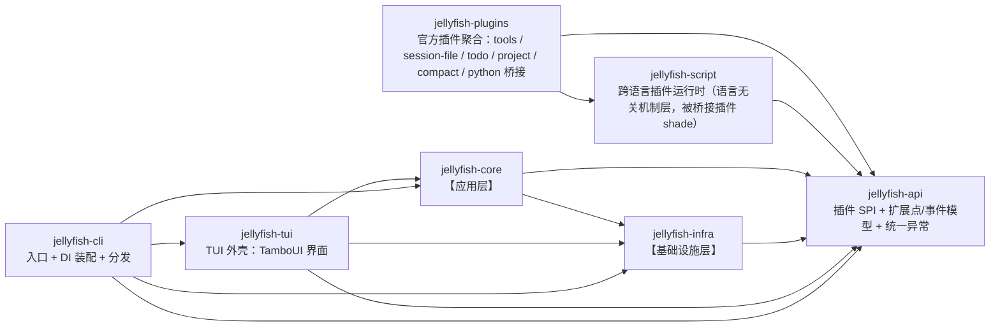

# AGENTS.md

本文件用于指导 AI 编码代理在本仓库中工作。修改代码前请先阅读。

> **只写已落地事实**：正文只描述当前代码中存在的模块与类，未落地能力见「路线图」。**推导与实测数据在对应类的注释里，这里只留规则**。

## 项目概述

Jellyfish 是一个用 Java 1.8 编写的轻量级 AI Agent 工具，通过 PF4J 插件扩展能力。

- 坐标：`zcd:jellyfish:0.0.1-SNAPSHOT`
- 构建：Maven（`pom.xml`）
- 运行环境：JDK 1.8（不要使用 Java 9+ 的 API 或语法）

## 常用命令

```bash
mvn -q -Pscript-it test             # 真实 python3 的端到端（不进 mvn test：单测不访问外部资源）
mvn -q compile
mvn -q package -DskipTests
mvn -q test                        # 全量单测（JUnit5 + Mockito + JaCoCo）
mvn -q -Dtest=ChatStateTest test   # 单类单测，把类名换成目标测试类
```

## 整体架构图


```mermaid
flowchart TB
    subgraph "AgentHarness<br>Agent运行时宿主"
        direction TB

        subgraph "应用层<br>ReAct核心智能"
            ReAct["ReAct Loop<br>思考 → 行动 → 观察"]
        end

        subgraph "基础设施层<br>Harness运行时环境"
            direction TB

            subgraph "内核模块<br>单向依赖 + 构造器注入"
                direction LR
                SessionMgr["SessionManager<br>会话 + 消息 + token + 当前态"]
                AgentMgr["AgentManager + AgentRegistry<br>Agent 定义与权限策略"]
                CommandMgr["CommandManager<br>解析 / 分发 / 清单（无状态，对外壳中立）"]
                ModelMgr["ModelManager<br>Provider/Model 注册与路由"]
                LLMClient["LLMClient<br>统一 LLM 调用抽象"]
                PermMgr["PermissionManager<br>核心策略 → PLAN 白名单 → 插件拦截"]
            end

            subgraph "扩展层<br>内核与插件唯一边界；底座 infra/registry"
                direction LR
                Registry["TypeRegistry<br>「类型 + 路由键」→ 有序 handler 集合"]
                ExtReg["ExtensionRegistry<br>同步派发 · 有返回值 · 不可丢弃"]
                EventCh["EventChannel<br>异步派发 · void · 可丢弃"]
                PluginMgr["PF4JPluginManager<br>插件加载 / 热部署"]
                PluginCtx["PluginContext<br>插件唯一入口"]
            end

            subgraph "支撑基础设施"
                direction LR
                Runtime["RuntimeConfig<br>配置解析/合并/注入（启动期）"]
                Reloader["ConfigReloader<br>/reload 触发，单飞不回滚"]
                Metrics["可观测性<br>MetricsRegistry / HealthCheck"]
            end
        end
    end

    subgraph "外壳入口·jellyfish-cli / jellyfish-tui"
        direction LR
        CLI["jellyfish-cli / jellyfish-tui<br>main · Launcher · RunMode · Dagger 装配<br>-cli / -tui 已落地，-server 占位"]
    end

    subgraph "外部依赖·配置"
        direction LR
        Models["models.json<br>全局 + 项目"]
        Jelly["jellyfish.json<br>全局 + 项目"]
        Agents["agents.json + default-agent.json<br>+ {agentId}.md"]
    end

    subgraph "外部依赖·模型提供商"
        direction LR
        LLM["外部 LLM API<br>OpenAI/Azure/Ollama"]
    end

    subgraph "外部依赖·插件"
        direction LR
        Plugins["PF4J 插件<br>tools / session-file / todo / project / compact<br>+ python 桥接（脚本进程由它承载）"]
    end

    %% ===================== 外壳入口：命令走用户输入，不走 LLM =====================
    CLI ==>|"命令原文 + sessionId"| CommandMgr
    CLI ==>|"命令名 + 参数 + sessionId"| CommandMgr
    CLI -->|"chat：唯一入口"| ReAct
    CommandMgr ==>|"CommandResult / 清单 / 帮助"| CLI

    %% ===================== 内核内部：接口 + 构造器注入（细实线） =====================
    ReAct -->|"消息 / 上下文 / 当前态 / token"| SessionMgr
    ReAct -->|"getCurrentLlmClient"| ModelMgr
    ReAct -->|"调用 LLM"| LLMClient
    ReAct -->|"同步权限检查"| PermMgr
    SessionMgr -->|"按 currentAgentId 取定义"| AgentMgr
    ModelMgr -->|"管理/创建/路由"| LLMClient
    LLMClient -->|"HTTP/API"| LLM

    %% ===================== 扩展层·同步派发：需要结果或必须完成（粗线） =====================
    ReAct ==>|"list：工具清单（LlmTool）"| ExtReg
    ReAct ==>|"ToolCallRequest（工具名 + 参数）"| ExtReg
    ReAct ==>|"PromptContributionRequest（只进 system prompt）"| ExtReg
    SessionMgr ==>|"会话持久化 / 恢复（不可丢）"| ExtReg
    PermMgr ==>|"权限拦截（插件只能返回两态）"| ExtReg
    ExtReg ==>|"贡献结果"| ReAct

    %% ===================== 扩展层·通知：按角色开放，内核模块作为事件发布者（点线，无返回值） =====================
    ReAct -.->|"轮次开始 / 工具结果"| EventCh
    SessionMgr -.->|"会话创建 / 消息追加 / 关闭"| EventCh
    AgentMgr -.->|"AgentsLoadedEvent"| EventCh
    ModelMgr -.->|"ModelsLoadedEvent"| EventCh
    PermMgr -.->|"权限审计"| EventCh
    CommandMgr -.->|"命令审计（CommandExecutedEvent）"| EventCh
    EventCh -.->|"分发事件"| Metrics

    %% ===================== 扩展层内部：一份注册表 + 两种派发策略 =====================
    Registry -->|"同步策略：调用点内联，取返回值"| ExtReg
    Registry -->|"异步策略：有界队列，可丢弃"| EventCh
    PluginMgr -->|"加载 / 交付 PluginContext"| PluginCtx
    PluginCtx -->|"handle：工具 / 命令注册（描述符随 handler 存）"| ExtReg
    PluginCtx -->|"contribute：其它扩展点注册 / 按 pluginId 退订"| ExtReg
    PluginCtx -->|"observe / emit：按 pluginId 订阅与退订"| EventCh

    %% ===================== 命令域：handler 与描述符同落一份注册表，CommandManager 只做解析、分发与清单 =====================
    CommandMgr ==>|"handler(命令名) + invoke：共用分发路径"| ExtReg
    CommandMgr ==>|"descriptorBindings 取命令名 / 别名 / 帮助"| ExtReg

    %% ===================== 配置热更新：/reload 触发的一次性编排（非运行期总线） =====================
    Reloader -->|"重读配置 + 刷新快照"| Runtime
    Reloader ==>|"按差异启停 / 重启插件"| PluginMgr
    Reloader -.->|"ConfigReloadedEvent"| EventCh

    %% ===================== 边界 <-> 插件 =====================
    PluginCtx -->|"插件唯一入口"| Plugins
    ExtReg -->|"按类型 + 路由键有序分发"| Plugins
    EventCh -->|"白名单 + 限流广播"| Plugins
    Plugins -->|"handle / contribute / observe / emit"| PluginCtx

    %% ===================== RuntimeConfig 注入 =====================
    Runtime -->|"读取合并, 项目级优先"| Models
    Runtime -->|"读取合并, 项目级优先"| Jelly
    Runtime -->|"读取合并, 项目级优先"| Agents
    Runtime -->|"注入配置"| ModelMgr
    Runtime -->|"注入定义"| AgentMgr
    Runtime -->|"注入插件配置"| PluginMgr
    Runtime -->|"注入权限配置"| PermMgr
    Runtime -->|"注入事件配置"| EventCh

    classDef app fill:#E9F7EF,stroke:#2E8B57,color:#123
    classDef kernel fill:#E8F4FD,stroke:#2E6DA4,color:#123
    classDef extlayer fill:#FDF2E3,stroke:#C77B00,color:#123
    classDef support fill:#F2F2F2,stroke:#888,color:#333
    classDef ext fill:#FAFAFA,stroke:#AAA,color:#444

    class ReAct app
    class SessionMgr,AgentMgr,ModelMgr,LLMClient,PermMgr,CommandMgr kernel
    class Registry,ExtReg,EventCh,PluginMgr,PluginCtx extlayer
    class Runtime,Reloader,Metrics support
    class LLM,Plugins,Jelly,Agents ext
```

> 图例：`==>` 同步调用；`-->` 内核内部调用；`-.->` 异步通知。

## 代码结构

Maven 多模块；根 `jellyfish`（`zcd:jellyfish:0.0.1-SNAPSHOT`）是 `packaging=pom` 的聚合与父 POM。

依赖方向单向，禁止反向或循环：


```mermaid
flowchart LR
    API["jellyfish-api<br>插件 SPI + 扩展点/事件模型 + 统一异常"]
    PLUGINS["jellyfish-plugins<br>官方插件聚合：tools / session-file / todo / project / compact / python 桥接"]
    SCRIPT["jellyfish-script<br>跨语言插件运行时（语言无关机制层，被桥接插件 shade）"]
    INFRA["jellyfish-infra<br>【基础设施层】"]
    CORE["jellyfish-core<br>【应用层】"]
    TUI["jellyfish-tui<br>TUI 外壳：TamboUI 界面"]
    CLI["jellyfish-cli<br>入口 + DI 装配 + 分发"]

    PLUGINS --> API
    PLUGINS --> SCRIPT
    SCRIPT --> API
    CORE --> API
    CORE --> INFRA
    INFRA --> API
    TUI --> CORE
    TUI --> INFRA
    TUI --> API
    CLI --> CORE
    CLI --> INFRA
    CLI --> API
    CLI --> TUI
```

跨语言桥接插件是「官方插件」里的特例：它额外依赖 `jellyfish-script`，并把该运行时连同 Jackson（**含 `jackson-module-parameter-names`**，api 快照类型靠构造器参数名反序列化）、Apache Commons Exec **shade 进自己的插件包**，因此 `jellyfish-infra` / `jellyfish-core` 的 classpath 上不出现任何跨语言代码。`jellyfish-script` 是**库而不是插件**，不产出到 `plugins/` 目录。

官方插件与内核之间没有编译期依赖：由 `PF4JPluginManager` 运行时从 `config.json` 的 `plugins.roots`（默认 `plugins/`）加载，因此不在上面的依赖链里。

| 模块 | 职责 | 依赖 |
| --- | --- | --- |
| `jellyfish-api` | 插件作者唯一的稳定契约：SPI、扩展点/事件模型、统一异常 | 无 |
| `jellyfish-infra` | 基础设施层全部实现（会话 / agent / 模型 / 权限 / 插件运行时 / 命令域 / UI / 指标 / 配置） | api |
| `jellyfish-core` | 应用层：ReAct 循环与 `AgentHarness` 门面、提示词组装、压缩机制、系统命令 | api、infra |
| `jellyfish-tui` | TUI 外壳：TamboUI 界面、视图投影与滚动、TUI 版 `ReActListener` | api、infra、core |
| `jellyfish-cli` | `main`、参数解析、模式分发、Dagger 装配、shade 可执行 jar | api、infra、core、tui |
| `jellyfish-script` | 跨语言插件运行时（语言无关机制层）：JSON-RPC over Stdio、静态清单、进程生命周期、事件桥接、熔断 | api（provided） |
| `jellyfish-plugins` | 官方插件聚合（packaging=pom），只聚合不产出构件 | 各插件子模块 |
| `jellyfish-plugin-tools` | 五个文件工具：`read_file` / `write_file` / `edit_file` / `list_dir` / `grep_files` | api（provided） |
| `jellyfish-plugin-session-file` | 会话持久化：一个会话一个 JSON 文件 + git 管理历史 | api（provided） |
| `jellyfish-plugin-todo` | 会话待办：`todo_write` 工具 + `/todo` + 提示词/状态栏/面板贡献 | api（provided） |
| `jellyfish-plugin-project` | 项目约定：探测工作目录下 `AGENTS.md`，小文件内联原文、大文件只给路径 | api（provided） |
| `jellyfish-plugin-compact` | 压缩策略：摘要指令 + 保留条数与摘要上限；不启用它压缩整体不可用 | api（provided） |
| `jellyfish-plugin-python` | Python 桥接插件：读静态清单完成注册、自带 `/<lang>` 状态命令（含熔断与事件计数）、把每个脚本调用都经熔断装饰器转发、把内核事件推给脚本（`ScriptEventBridge`），把 Python 脚本插件以标准 PF4J 插件的形态接入内核（控制面单进程 + 每脚本一 worker 进程）。网关资源 `script/gateway.py`（单线程 select 事件循环）、`script/worker.py`、`script/jellyfish_sdk.py`（脚本作者唯一的 API）、`script/script_wire.py`（分帧） | api（provided）、jellyfish-script（shade） |

包结构（只列包与少数枢纽类；其余类直接读代码）：

```
jellyfish-api/src/main/java/zcd/jellyfish/api/
├── JellyfishException.java     # 统一运行时异常
├── extension/                  # 同步扩展点：请求/结果类型、ToolDescriptor、会话快照
├── event/                      # 事件基类与 notification/ 下的具体通知
├── ui/                         # 插件界面内容的渲染无关模型
└── plugin/                     # 插件 SPI：JellyfishPlugin / PluginContext / PluginDeclaration

jellyfish-infra/src/main/java/zcd/jellyfish/infra/
├── registry/                   # 注册表底座 TypeRegistry
├── extension/                  # 同步派发策略 ExtensionRegistry
├── event/                      # 异步派发策略 EventChannel
├── session/                    # 会话运行态 Session / SessionManager / SessionSnapshots
├── agent/                      # Agent 定义注册表 AgentManager / AgentRegistry
├── command/                    # 命令域服务 CommandManager
├── model/                      # 模型注册与路由 ModelManager
├── llm/                        # LLM 调用抽象与厂商实现
├── plugin/                     # 插件运行时 PF4JPluginManager / PluginRuntimeConfig / JellyfishPluginAdapter
├── permission/                 # 权限判定 PermissionManager / ApprovalChannel
├── ui/                         # UI 贡献门面 UiContributions
├── metrics/                    # 指标与健康检查 MetricsRegistry / MetricsSubscriber / HealthCheck
├── config/                     # 配置加载与热更新 RuntimeConfig / ConfigReloader
└── support/                    # 序列化封装、类型常量

jellyfish-core/src/main/java/zcd/jellyfish/core/
├── AgentHarness.java           # 组装门面（chat 是唯一智能入口）
├── ReActLooper.java            # 思考 → 行动 → 观察
├── ReActTurn / ReActListener / ReActResult
├── prompt/                     # PromptAssembler / ContextWindow / ToolCatalog / TokenEstimator
├── compact/                    # ConversationCompactor / CompactionPlan / CompactionHealthIndicator
└── command/                    # SystemCommands（owner=core）

jellyfish-cli/src/main/java/zcd/jellyfish/cli/
├── JellyfishApplication.java   # main；Launcher 模式选择与生命周期
├── console/                    # stdout=回答、stderr=诊断
├── mode/                       # CliRunMode / TuiRunMode / ServerRunMode
└── di/                         # Dagger 组件与 Module

jellyfish-tui/src/main/java/zcd/jellyfish/tui/
├── TuiApp.java                 # 唯一入口：按键路由、回合/命令分流、审批浮层
├── ChatShell / ChatLayout      # 版式与二维账本
├── TranscriptProjector / ChatState / InflightTurn   # 视图投影与状态
├── 其余视图 / 输入 / 插件 UI 类
└── text/                       # DisplayWidth / LineWrapper / MarkdownRenderer / ControlChars

jellyfish-plugins/              # 每个子模块一个插件 jar，源码结构同构：
                                #   resources/plugin.properties + PluginConfig + JellyfishPlugin 实现 + 各扩展点 handler

jellyfish-script/src/main/java/zcd/jellyfish/script/
├── ScriptLanguage.java         # 语言适配 SPI（启动命令 / 探测命令 / 环境变量白名单）
├── ScriptJson.java             # 统一序列化（插件看不到 infra 的 ObjectMapperWrapper，故自带一份）
├── ScriptManifest.java         # 静态清单的零容忍解析与校验（未知键报错并列出允许键名）
├── ScriptPluginScanner.java    # 扫描脚本目录，逐脚本问题隔离
├── ScriptRegistrar.java        # 清单 → 内核注册表里的转发处理器（逐条注册隔离）
├── ScriptCaller.java           # 脚本调用入口（注册与执行之间的那道缝）
├── codec/                      # ExtensionCodec / ExtensionCodecs / 11 个扩展点编解码 / Payloads
├── protocol/                   # ScriptProtocol（帧 + 方法名 + 错误码）/ ScriptRpc（id 配对、超时、
                                #   迟到响应丢弃、断连唤醒）/ 三类调用失败异常
├── ScriptGateway.java          # 懒启动、initialize 下发清单摘要、转发、超时隔离（kill_worker）、关闭两段式
├── CircuitBreakerSettings.java # 熔断参数（失败阈值 / 冷却 / 转永久轮数，0 分别表示关闭该项）
├── ScriptCircuitBreaker.java   # 单脚本熔断状态机（CLOSED/OPEN/HALF_OPEN/PERMANENT，自动半开）
├── ScriptCircuitListener.java  # 打开 / 恢复各通知一次（由装配方发成 ConfigWarningEvent）
├── CircuitBreakingScriptCaller.java
                                # 装饰 ScriptCaller：打开期间立即抛 -32001 且**不派发**（即不摘注册）
├── ScriptProcess / ScriptProcessFactory / CommonsExecScriptProcess
                                # 子进程接口 + 接缝 + Commons Exec 实现（自持 StreamPumper + 行切分流）
├── GatewaySettings.java        # 下发给网关的超时/自毁/严格校验/事件收窄
├── GatewayResources.java       # 网关资源按内容摘要抽取到磁盘
└── （P6 起）EventBridge
```

资源位置：`default-agent.json` / `jellyfish.md` 在 infra 资源根；`summary-prompt.md` 在压缩插件资源根；`config.json` / `log4j2*.xml` 在 cli 资源根。

## 架构要点

### 扩展层：一份注册表 + 两种派发策略

- **一份注册表 + 两种派发策略**：内核与插件之间只有 `ExtensionRegistry`（同步：调用点内联、按 order 升序、取返回值、不可丢）与 `EventChannel`（异步：有界队列、无返回值、可丢）两个能力面，共用 `infra/registry` 的同一份类型注册表。禁止引入第三方事件总线。
- **选择能力面的判据是「能否丢弃」，不是「有没有返回值」**：工具、提示词注入、权限拦截、会话持久化走同步侧（即使无返回值也不能丢）；轮次通知、指标、审计走异步侧。
- **类型即地址**：请求类型本身就是身份，注册表按「类型 + 路由键」找 handler；插件拿不到的类型就注册不了。
- **同步侧只提供有序查找与单处理器执行，注册表不做编排**：`handler` 同键唯一（0 个 `NO_HANDLER`、多个 `AMBIGUOUS_HANDLER`），`descriptorBindings` 取描述符清单（描述符为空的注册也返回）。调用顺序与结果合并由调用方决定。
- **同步派发没有超时、白名单、异常隔离**：调用方需要确定结果，若不能容忍插件阻塞或抛错，必须自己在调用点设超时或捕获。

### 会话与持久化

- **会话状态一律归 `Session`，进程内没有全局当前态**：agentId / 模型 / 权限模式都是会话字段，由 `SessionManager` 统一读写；会话是内存运行态，不设 `session` 配置段。
- **`SessionManager` 每个变更入口都同步派发 `SessionPersistRequest`，异常原样上抛**：创建先落盘再入表、关闭先落盘再移除、删除走 `SessionDeleteRequest`（删不掉就当没删）。
- **恢复的失败语义相反**：`SessionRestoreRequest` 单个插件读不出只告警跳过；恢复必须排在 `pluginManager.bootstrap()` 之后。
- **跨边界载荷必须是 api 侧快照值类型**（`SessionSnapshot` 及嵌套），映射归 `infra/session/SessionSnapshots`，并用往返测试守字段。**快照类型必须恰好只有一个可见构造器**：新增字段用静态工厂，不要加兼容构造器。
- **`-parameters` 是全局编译约定，不许去掉**：插件侧 Jackson 靠构造器参数名反序列化，丢了会「文件写得出、重启后读不回」。

### 权限与审批

- **权限三层**：核心策略 → PLAN 只读白名单 → 插件两态拦截，再统一处理 ASK 与审计。fail-open 只覆盖「取不到策略」；策略一旦生效，它的否定就是硬结论。
- **ASK 由 `ApprovalChannel` 收口，只有明确批准才放行**：无审批者、超时、溢出、通道关闭、中断一律拒绝（fail-closed）；超时来自 `permission.approvalTimeoutSeconds`（缺省 120，每轮现读）。
- **只读白名单 = `ToolDescriptor.readOnly`（提供方声明，随 handler 落表）∪ `plugins.configurations.<pluginId>.readOnlyTools`（用户只能追加）**，由 `ReadOnlyTools` 现算；插件返回值是两态 `PermissionVeto`，因此「插件只能拒绝、不能要求审批」是编译期约束。

### ReAct、上下文与压缩

- **`AgentHarness.chat(sessionId, input, listener)` 是外壳唯一智能入口**，委托 `ReActLooper` 在 `react` 线程池异步推进；工具失败一律转成 tool 结果回灌，只有模型调用本身失败才上抛。
- **上下文裁剪只裁本次请求**：`ContextWindow` 按 `contextLength - maxOutputTokens - contextReserveTokens` 从最旧成组丢弃（toolCalls 与结果同生共死），Session 历史一条不动；模型未配 `contextLength` 时不裁剪。
- **`/compact` 非破坏式、滚动摘要**：消息一条不删，只记 `Session.compaction = {boundaryMessageId, summary, droppedMessageCount}`，失败无副作用；每次只压「上次边界之后、再留 `keepRecent` 条」的那段，并把上一份摘要一起喂回，边界只向后移。
- **摘要是 system prompt 里的一块，不是消息**：顺序 agent 提示词 → 插件贡献 → 历史摘要；作为消息回灌会被每轮重复 append 成假历史。
- **单次压缩、装不下就丢最旧**：待压范围超预算时从最旧侧丢弃，被丢弃条数如实上报并落盘（`droppedMessageCount`）；至少进摘要 1 条。
- **触发两条**：`/compact`（MANUAL），或每轮组装时自动压（AUTO）——用量达 `react.autoCompactPercent`（缺省 80，写 0 关闭）或本次已被机械裁剪。自动压缩跑在本轮调用旁边不阻塞，无范围时零成本。
- **`/compact` 只起头不等结果，且只有无参执行与 `preview` 两种形态**：跑在自持 `compact` 线程池，外壳每帧轮询 `status(sessionId)`（状态带触发原因），摘要调用的 token 经 `recordUsage` 记账但不留消息；不做用户可见档位，「没什么可压」报 ERROR，`preview` 同情况返回 OK 且连模型都不解析。
- **压缩是插件能力、内核只提供机制**：`CompactionStrategyRequest` → `CompactionStrategy` 给摘要指令与两个数量参数；没有插件即整体不可用、不回退内置，`isAvailable()` 只查注册表，自动那一路第一次用不了时记一次 WARN + `ConfigWarningEvent`。
- **插件拿不到消息正文、发起模型调用的能力、否决权**；策略合并取「order 最小且声明了该字段」的那一个，数值由内核钳制（保留 `[0, 消息总数]`、摘要上限 `[200, 20000]`）；处理器必须只读且快，不得发布事件。
- **摘要指令是插件自带资源** `summary-prompt.md`，用插件自己的类加载器启动期读完；占位符 `{maxSummaryChars}` 由内核替换，缺占位符只告警不失败。
- **插件上下文只走 system prompt**：`PromptContributionRequest` 按 order 用 `\n\n` 拼接，**不追加进 messages**；单个处理器抛错只记 WARN 跳过。

### 故障模型与熔断

- **三级故障**：L1 单次调用超时/脚本回报错误、L2 worker 崩溃 → 都只影响该脚本；L3 网关进程挂掉 → 整门语言不可用。
- **计入熔断的只有「脚本没能答复」**：超时与脚本回报的错误计入；**连接层失败（L3）不计**（网关是懒启动的，一次短暂故障不该让所有脚本再等一个冷却），**`-32001`（熔断自己的拒绝）不计**（否则冷却会被自己的拒绝无限延长）。判据只此一处：`CircuitBreakingScriptCaller.countsAsFailure`。
- **不摘注册**：熔断期间转发闭包立即抛 `-32001` 且不派发。注册只能在 `start()` 窗口内发生，摘掉就等于恢复必须走 `/reload`；保留注册才有**自动半开恢复**。打开与恢复各 `emit` 一次 `ConfigWarningEvent`。
- **状态是既成事实**：`HALF_OPEN` 表示「已放行过一次探测」而非「冷却已到期」；读状态不推进状态，只有 `admit()` / `recordSuccess()` / `recordFailure()` 能转移。半开期不限制并发探测数（限制它要挂住调用线程，代价比多几次失败大）。
- **超时处置链**：宿主 `invoke` 超时 → 发 `kill_worker`（**kill 的执行方是网关**，它是父进程、持有 PID 表与回收）→ 网关杀 worker 回 `killed` → 宿主抛「已等待 N ms，已隔离该脚本的 worker」。网关自己也有同一个截止时间兜底，两边都动手是正常的，因此 `killWorker` 把「没杀到」当正常返回值。
- **超时之后有一段「正在换 worker」的窗口**：卡在不响应信号的系统调用里的 worker 只能等强杀，这期间同一脚本的调用仍会失败（已实现行为，非抖动）。熔断冷却应明显长于这个窗口。
- **迟到响应按 id 丢弃、不做补偿**：`ScriptRpc` 在超时时已摘掉等待位；`ScriptGateway.describe()` 与 `/<lang>` 台账都会给出计数。
- **worker 必须能被「立刻杀死」，两条都不能靠主线程配合**：① SIGTERM/SIGINT 处理器直接 `os._exit`（只置标志位是无效的——CPython 在处理器返回后会**恢复**被中断的系统调用，卡在用户代码里的脚本永远轮不到事件循环）；② `getppid()==1` 的孤儿检查由 `setitimer(ITIMER_REAL)` + `SIGALRM` 定时驱动，而不是放在事件循环顶部。两者都是实测出来的：以前网关被 `kill -9` 后会留下卡在 `time.sleep` 里的 worker，日志里没有任何一条指向它。
- **`invokeTimeoutSeconds: 0` 必须显式表示「没有截止时间」**：拿 0 当截止时间会让 `now > deadline` 恒真，每次调用都在派发的下一拍被秒杀，而配置的字面意思是「不超时」。

### 事件桥接

- **两侧共用同一份白名单，且都硬编码在 `jellyfish-script` 里**：可订阅 = `ScriptEventCatalog` 的 15 个通知事件（白名单而非黑名单，内核新增事件不会自动对脚本开放）；可发布 = `ScriptEventFactory` 的 `PluginNotificationEvent` / `ConfigWarningEvent` 两类自由载荷事件。**脚本不能伪造内核语义事件**——那类事件是内核事实的转述，指标与审计按「它是真的」消费。
- **投影只下发标量**：不下发嵌套快照，否则内核内部结构就成了脚本的对外契约。字段缺失不写成 JSON `null`，集合排序，枚举下发枚举名；载荷必带 `event` / `eventId` / `occurredAt`，无会话上下文时**没有** `sessionId` 键。
- **事件名的拒绝在清单期**（`ScriptManifest.parseEvents` 查目录白名单）：运行期那条路是静默的（处理器永不执行），报错里带上全部可订阅名字。
- **推送必须有队列 + 独立线程**：事件由 `EventChannel` 通知线程投递，而写子进程 stdin 会阻塞——钉死通知线程等于让指标、界面、审计一起停摆。丢弃三种情形（网关未运行、队列满、发送失败）都计数。
- **事件不拉起任何进程**：网关没在运行 / 该脚本 worker 没起过 / worker 正忙，一律丢弃并计数。让一条通知去 fork 解释器，等于把「事件到了」变成一次重操作，而且它在通知线程上。
- **网关只推给「闲着的」worker**：worker 单线程，卡在一次长调用里时 socket 缓冲区会被事件填满，而网关是单线程事件循环——一次阻塞写就停摆。
- **发布是端到端单向的**：worker 发不带 id 的 `emit_event` 通知；网关把它转成**带 id 的调用**只为拿到应答里的 `eventId`，据此记住「这条事件是哪个脚本刚发的」并在扇出时跳过它（有界 256 条，按条数过期）。**回声记忆放网关**是因为扇出点在网关，Java 侧过滤只能整条不推。
- **拒绝发布只记 WARN，不补发告警事件**：告警本身也是可订阅事件，脚本收到告警后再发一次非法事件就是跨进程的环。跨脚本的相互触发也没有全局检测（只消了直系回声），两侧都有计数可见。
- **推送路径的异常捕获面必须开大**：事件是旁路，一次 `TypeError` 就曾把整个网关带走——把「少收一条通知」升级成「所有脚本不可用」。

### 命令域

- **`CommandManager` 不注册处理器、不持有会话、不缓存索引**：命令名即路由键，别名与用法来自 `CommandDescriptor`；原文入口与结构化入口共用同一条分发路径，对外壳中立。
- **系统命令由 `core/command/SystemCommands` 以 owner=core 注册**，`/todo` 由插件注册，`/exit` `/ui` `/thinking` 归外壳；候选查询（`CommandOptionRequest` → `CommandOptions`）是与执行平行的只读路径，不执行命令。
- **命令审计每个出口经 `finish()` 收口，任何结果下恰好广播一次 `CommandExecutedEvent`**（原文、命令名、三态、owner、耗时，不带输出）；发布失败只记 WARN。

### 配置

- **配置加载**：`AppConfig` 绑定 `classpath:config.json`，只有它声明各配置文件位置与插件扫描目录；默认全局 `~/jellyfish/`、项目 `./jellyfish/`。`SettingsBinder` 做 `${ENV_VAR}` 插值（`\${VAR}` 转义）。
- **插件扫描目录在 `config.json` 的 `plugins.roots`**，不参与双源合并；展开行首 `~`、丢弃空白条目，空列表回退默认目录 `plugins`。
- **四份配置对四类配置类**：config→`AppConfig`、models→`ModelSettings`、agents→`AgentSettings`、jellyfish→`JellyfishSettings`（plugins / react / permission 三段）；`classpath:default-agent.json` 是内置只读定义，不走双源。
- **资源跟着读者走**：`default-agent.json` / `{agentId}.md` 归 infra，摘要指令归压缩插件，`config.json` / `log4j2*.xml` 归 cli——否则换 composition root 时会以「内置 agent 缺失」启动失败而单测全绿。
- **agent 提示词来自同目录 `{agentId}.md`**，JSON 里的 `systemPrompt` 被忽略；默认 agent 恒为内置（启动与新建会话都绑它，只能 `/agent` 切换）。非法 `agentId` 整条丢弃并告警，用户与内置同名时保留内置。
- **global/project 合并**：同名 provider / agent / 插件配置段以 project 整对象覆盖；列表段项目级已声明则整体替换（写 `[]` 即清空）。
- **「字段缺失」≠「显式空数组」**：`allowedTools` / `plugins.enabled` 缺失（null）表示不限制，`[]` 表示一个都不放行 / 不启用；归一成空集合会让 `[]` 退化成 fail-open。`plugins.roots` 不适用。
- **配置驱动的索引在启动期建立**：构造期只建空索引，`AgentHarness.bootstrap()` 里 `runtimeConfig.refresh()` 之后才装载；`PluginRuntimeConfig` 必须在 `pluginManager.bootstrap()` 之前刷新。
- **热更新顺序固定**：`modelManager.refresh(true)`（唯一重读文件 + 清客户端缓存）→ `agentManager.refresh(false)` → `pluginRuntimeConfig.refresh` → 比对插件配置段 → `pluginManager.reload` → 广播 `ConfigReloadedEvent`。`synchronized` 单飞，不回滚，触发只有 `/reload`。
- **「重启插件」= stop + start**，成立前提是能力上下文在每次 `start()` 现造（`JellyfishPluginAdapter` 持有 `Supplier<PluginContext>`）；PF4J 插件实例在装载期缓存，stop 不会重置它。

### 插件

- **Java 插件与跨语言桥接插件在 `PF4JPluginManager` 眼里同构**，都只经 `PluginContext`（handle / contribute / observe / emit）与内核交互。
- **插件碰不到会话、也拿不到工作目录**：`PluginContext` 只有身份与四个方法，工具相对路径按进程工作目录解析（`ToolPaths`）。状态只要按 `sessionId` 归属，插件就能自己持有。
- **owner 可以是命名空间**：插件可给内部子单元分独立 owner（`pluginId` + `api.PluginOwnerNamespace.SEPARATOR` + 子标识），`PluginContextFactory.release` 按命名空间回收（`pluginId` 自身与 `pluginId::*` 一起清），因此子单元的注册不会在插件停止后残留成幽灵注册。分隔符常量在 **api**（跨边界契约：插件拼来源、内核做前缀回收，必须同一个真源），插件侧用 `PluginContext.subContext(childId)` 派生子上下文来注册到子命名空间（子身份恒从当前身份派生，无法越界）；子标识规则由 `PluginOwnerNamespace.requireChildId` 一处承担，插件侧与框架侧共用。`plugin.id` 含它的插件在描述符体检阶段被拒——否则一个叫 `x::y` 的插件会把自己的注册挂进命名空间 `x`，`x` 停止时就会越界抺掉它的注册。`EventChannel.unsubscribeAll` 仍是精确匹配（它服务于内核内部来源）。
- **官方插件**：tools 五个文件工具（三个只读）；session-file 一会话一 JSON + git（落盘失败上抛、git/坏文件只告警）；todo `todo_write` + `/todo` + 提示词/状态栏/面板贡献 + 删除清理；project 按 `maxInlineBytes`（默认 32 KiB，0=不内联）内联 `AGENTS.md` 原文或只给路径（一会话只读一次）；compact 压缩策略。
- **project 插件必须从仓库根目录启动**：查找基准是进程工作目录（与 `ToolPaths` 同一处），不做向上查找。

### 可观测性

- **可观测性是纯订阅者，自己绝不发事件**：否则形成「事件 → 指标 → 事件」自激；事件通道统计直接作仪表读取，只订阅异步侧。
- **启动顺序**：`eventChannel.start()` 之后、`runtimeConfig.refresh()` 之前启动 `MetricsSubscriber`；`shutdown()` 先打健康检查，末尾退订并打指标汇总。
- **诊断输出必须比被诊断对象更稳**：坏仪表跳过、检查项抛错降级为 DOWN、关闭路径日志失败只记 WARN；健康检查三档 UP/WARN/DOWN，检查项可插拔由装配根跨层拼装。刻意不加 `/metrics`。

### 外壳：CLI 与 TUI

- **三种启动模式、一个内核**：`-cli` / `-tui`（已落地）、`-server`（待落地）共用 main、DI、`AgentHarness`、`CommandManager`，差异收在 `RunMode`；界面层放 `jellyfish-tui`（放 cli 会形成 `cli → tui → cli` 循环依赖）。
- **外壳只做两件事**：用 `CommandManager.isCommand` 判「命令还是对话」，每轮现读 `SessionManager.current()`。启动期 `SessionBootstrap` 保证有当前会话——裸 `-tui` 例外（进首页，不建会话）。
- **CLI 输出契约**：回答与命令结果走 stdout，诊断 / 进度 / 日志走 stderr；回答按轮缓冲、收敛时整体写出。退出码 `0/2/3/4/5/6` 是机器契约，占位模式不启动内核直接退 5。
- **TUI 视图 = 会话投影 + `InflightTurn` 暂存区**：消息区不持有第二份消息列表，由 `TranscriptProjector` 纯函数投影；流式当前轮尚不在会话里，必须暂存且随回合终结清空。工具轨迹不进暂存区。
- **TUI 线程契约**：`ReActListener` 回调都在 react 池线程，界面状态只在渲染线程变更；react 线程只向线程安全暂存区追加并置 volatile 脏标记，`Esc` 中断由渲染线程直接调 `ReActTurn.cancel()`。
- **TUI 消息区必须是单个 `richText`**：布局子元素到 120～180 个即性能断崖；滚动偏移是 `ChatState` 自己的字段。
- **TUI 从首页进入**：无当前会话时显示 `HomeSplash`；外壳自有命令不建会话，`/new` `/resume` `/delete` 不预先建，其余命令与普通文本先建会话再执行。
- **markdown 只在 assistant 正文渲染**：只借 commonmark 的 AST，块级映射与换行自己写；用户消息与工具轨迹保持纯文本。**commonmark 锁 `0.21.0`**（0.22.0 起是 Java 11 字节码），渲染器永不抛异常、解析前先过滤控制字符。
- **思考过程默认折叠、可全局展开**（`Ctrl+T` / `/thinking` / `--show-thinking`）：思考随消息落会话（`SessionMessage.thinking`），**不进 `LlmMessage`**。开关必须纳入投影的「未变化」判据。
- **审批浮层优先级高于二级选择页与补全面板**，可见时吞掉其余按键；`Esc` 是「拒绝 + 中断回合」；详情区必须过滤控制字符、超长参数折行而不是截断。

#### TUI 的插件界面贡献

- **插件只能贡献渲染无关数据**（状态栏片段是拼接型、面板是独占型），由 `infra/ui/UiContributions` 收集；插件不可能自己造 TamboUI 组件（子优先类加载器会让 `Element` 不是同一个 Class）。
- **区域归外壳**：`preferredRegion` 只是软建议，落位在 `UiPlacement`（用户指定优先于 order）；`/ui` 是外壳自有命令，清单要列出被挤下去的候选名字。
- **五边版式全用 `length(n)`，不用 `percent` / `fill`**，账本由 `ChatLayout` 自己算（侧栏单侧 `[20, W/4]`、合计 ≤ `W/3`、`W < 80` 隐藏，不足先砍右栏）；收敛规则都为消息区让路，模态浮层打开时面板让位。
- **UI 贡献「失效时收集」而非每帧**：触发源＝首帧、会话切换、回合开始、回合收敛、命令执行后、`UiInvalidatedEvent`、`PluginStateChangedEvent`；漏一个就是内容永久陈旧。缓存用版本号而非布尔 dirty。
- **UI 贡献处理器三条硬约束**：纯只读、不得发布 `UiInvalidatedEvent`、必须快；单处理器抛错只记 WARN 跳过。

#### TUI 的终端事实与键位

- **TUI 日志必须与终端隔离**：`-tui` 在参数解析后、DI 装配前把 `log4j.configurationFile` 切到 `log4j2-tui.xml`，必须赶在第一个 `Logger` 创建之前。
- **键位反转：`Enter` 换行、`Ctrl+S` 发送，不要改成修饰键方案**：框架不解析修饰键编码，`Shift+Enter` / CSI-u / CSI-27 一律落成 UNKNOWN，裸 `\r` 与 `\n` 同形；Ctrl+字母只能比码点。
- **TUI 启动前必须做终端前置检查**（`System.console() == null` 判据，挂在 `RunMode.checkEnvironment`，由 `Launcher` 在启动内核前调用，不满足退 3），否则 TamboUI 会永久挂住；逃生门 `-Djellyfish.tui.skipTerminalCheck=true`。
- **鼠标捕获默认开**：滚轮属于鼠标捕获，关着到不了应用；非滚轮鼠标事件一律吞掉以保住焦点。代价是终端选择需按修饰键，逃生门 `-Djellyfish.tui.mouseCapture=false`。**括号粘贴必须保持打开**，否则多行粘贴被拆成多次提交。
- **TUI 命令输出按时间戳插进消息流**（`ShellNotice`），不贴投影末尾；外观是独立块（`❯` 回显 + `⎿`/`!`/`✗` 三态），不要套 dim 或工具轨迹前缀。

### 代码约定

- **异常**统一抛 `JellyfishException`；**序列化**统一走 `ObjectMapperWrapper`，不要直接 new `ObjectMapper`。
- **请求/消息模型**：`LlmRequest` / `LlmMessage` / `LlmTool` 是与厂商无关的统一模型，`LlmRequest` 用 builder 构建。
- **配置类型命名**：项目内部配置类用 `Config` 结尾，暴露给用户的配置类用 `Settings` 结尾。

## 路线图（尚未落地）

以下能力**尚未完整落地**，不要当成现存 API；已落地的部分在条目里明确标注。设计细节见对应方案文档。

- **跨语言插件桥接**：Python 已端到端打通——owner 命名空间、静态清单解析与校验、按清单注册（11 个扩展点全开、与 Java 插件同权）、协议帧与 id 配对、Commons Exec 进程管理、Python 网关与 worker、SDK 与 `--dump-manifest` 清单生成器、`/<lang>` 状态命令、熔断与超时隔离链、事件桥接（订阅与发布双向）。**PID 文件与启动期陈旧 PID 报告尚未落地**；`/snapshot` 与 `status` 协议方法仍未实现。
  架构为「控制面单实例 + 每脚本一 worker 进程」；注册来源是脚本目录下的静态 `manifest.json`（协议里**没有**注册方法），因此 `start()` 期零进程、零文件写入，Python 缺失不影响内核启动、工具清单依然完整。Python 网关是**单线程 `select` 事件循环**（因此「fork 时没有线程」恒真）。真实解释器的端到端测试在 `mvn -Pscript-it test`。`jellyfish-plugin-node` 待 Python 同构验证通过后再加。见 `跨语言插件方案.md`。
- **`-server` 模式**：HTTP 服务外壳（Undertow），对外暴露能力接口。`ServerRunMode` 目前是占位（不启动内核，退 5），开工时抽 `jellyfish-server` 模块。设计见 `cli方案.md`。

## 编码约定

- 缩进 4 空格，K&R 风格大括号，文件末尾保留换行。
- 依赖注入一律使用构造器注入 `@Inject`，不使用字段注入。
- 内核与插件之间的交互只走 `ExtensionRegistry` / `EventChannel`，禁止引入第三方事件总线（如 Guava EventBus）。
- 注释使用中文，说明“为什么”而非复述代码。
- 类、接口、私有方法、成员变量都要有文档注释，类注释要加`@author zcd`，方法注释要用`@param`写清楚每个参数、用`@return`写清楚返回值。
- 异常统一抛出 `JellyfishException`。
- 工具方法/常量类使用 `final` + 私有构造器（如 `ProviderTypes`、`LlmClients`）。
- 所有代码均需要满足sonar规范要求。

## 单元测试

- 使用 Junit5 + Mockito 进行单元测试，使用 JaCoCo 收集单元测试覆盖率。
- 单元测试类的包路径与被测试类的路径一致。
- 单元测试类命名统一按`{被测试类命}Test`格式。
- 测试方法命名统一按 `{被测试方法}_should_{预期结果}_when_{条件}` 格式。
- 一个测试方法只验证一个行为，测试独立、可重复、无外部依赖。
- 测试结构遵循 Given/When/Then 或 Arrange/Act/Assert。
- 只 mock 外部依赖或协作者，不 mock 被测类、POJO、DTO。
- 使用 `@ExtendWith(MockitoExtension.class)`，统一 JUnit5 API，不混用 JUnit4。
- 断言使用 JUnit5 `Assertions` 或 AssertJ，异常用 `assertThrows`。
- 多组输入用 `@ParameterizedTest`，覆盖正常、边界、异常场景。
- 单元测试不启动 Spring 容器，不访问数据库、网络等真实外部资源。

## Git 约定

- 只 `git add` 本会话实际修改的文件，禁止 `git add -A` / `git add .`。
- 提交前先 `git status` 确认暂存范围。
- 提交信息格式：`{feat,fix,docs,refactor,chore}[(scope)]: 描述`，描述简洁说明改动。
- 不要提交密钥、真实 apiKey 或本地配置文件。
- 提交代码前必须先得到允许。

## 语言

- 使用中文沟通

## 行为准则

- 开发时必须严格按与用户确认的方案执行，如果开发过程中发现方案有问题，先征求用户意见，禁止私自变更方案。
