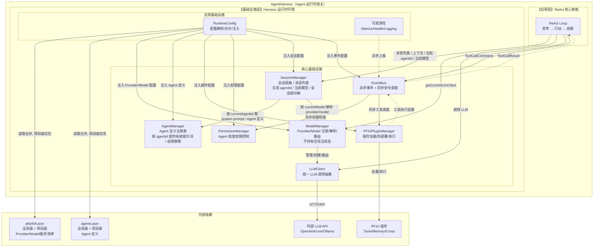
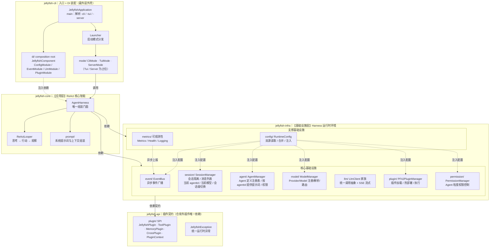
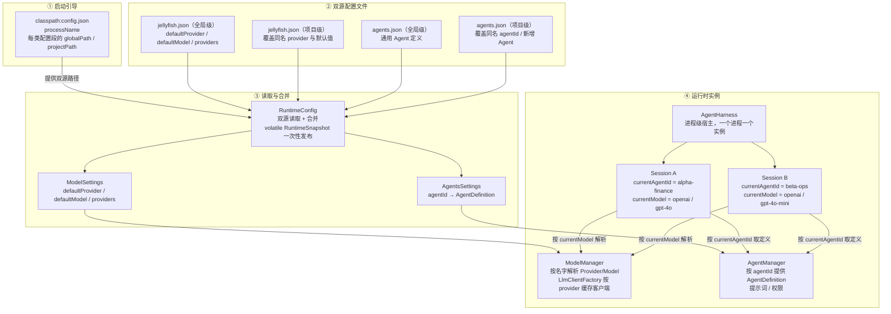

# 🚀 轻量级 Java AI Agent 完整技术方案 v2.6

## 基于 Java 8 + PF4J + Undertow + Guava EventBus + llm-client + TamboUI 的事件驱动 ReAct Agent

---

# 一、项目概述

## 1.1 核心定位

构建一个**极致轻量、模块化、事件驱动**的 Java AI Agent 框架，面向**国内存量 Java 8 系统的智能化升级**需求，帮助企业不更换技术栈、不升级 JDK，快速接入大语言模型能力。

## 1.2 设计哲学

> **"Keep the Kernel Tiny, Keep the Skills Global."**

| 原则 | 说明 |
|------|------|
| **极致轻量** | 核心依赖 < 15MB，启动 < 2s，适合微服务和 Serverless |
| **Java 8 兼容** | 面向金融、政务、制造等大量存量 Java 8 系统 |
| **事件驱动** | Guava AsyncEventBus 异步解耦所有组件，**包括插件** |
| **插件化** | PF4J 热加载，插件通过订阅事件与核心交互，无需直接依赖 |
| **跨语言** | Python/TypeScript 通过 Stdio 协议贡献插件（同样通过事件调度） |
| **双协议** | Web 使用 SSE，TUI/CLI 使用 NDJSON 或直接控制台输出 |
| **双模式** | HTTP Server 模式 + 本地 TUI（全屏终端图形界面）模式 |
| **多 Provider/Model** | 支持 OpenAI、Azure、Ollama 等多服务商，JSON 配置，运行时动态切换 |
| **多Agent** | 每个 Agent 独立配置，独立权限控制 |

## 1.3 核心概念澄清

| 概念 | 定义 |
|------|------|
| **AgentHarness** | **Agent 运行时宿主**，一个进程一个实例，装载应用层（ReAct 核心智能）+ 基础设施层（会话、模型、插件、权限、事件、监控） |
| **ReAct Loop** | **应用层**，只负责核心推理决策（思考→行动→观察），对基础设施层一无所知 |
| **基础设施层** | **Harness 运行时环境**，为 ReAct Loop 提供所有运行依赖：Session、Model、Plugin、Permission、EventBus、Metrics |
| **Agent 定义** | `agents.json` 中的一条 `AgentDefinition`（提示词、权限），由 `AgentManager` 按 `agentId` 提供 |
| **Agent 实例** | **会话级的运行时组合**：`Session` 持有的当前 `agentId` + 当前 `Model`，二者均可在会话中切换 |

**一句话总结：Harness 是 Agent 的运行时宿主，Session 承载「当前是哪个 Agent、用哪个模型」，ReAct 是智能大脑，基础设施层是躯干和器官。**

## 1.4 最终技术选型

| 组件 | 选型 | 版本 | 理由 |
|------|------|------|------|
| Web 服务器 | Undertow | 2.2.24.Final | 轻量 1.5MB，原生 SSE，Java 8 兼容 |
| LLM 客户端 | llm-client | 0.8.58+ | 轻量，SSE 流式原生支持，Builder 模式 |
| 事件总线 | Guava AsyncEventBus | 33.0.0-jre | 成熟，异步，~2MB，Java 8 兼容 |
| 插件框架 | PF4J | 3.10.0 | 轻量 ~200KB，类隔离，热加载 |
| 命令执行 | Apache Commons Exec | 1.3 | 安全执行跨语言脚本 |
| JSON | Jackson (databind) | 2.14.2 | 行业标准，用于配置解析 |
| HTTP | OkHttp (llm-client 内置) | 4.12.0 | 高性能，SSE 支持 |
| 日志 | SLF4J + Logback | 1.7.36 | 标准方案 |
| **终端 UI** | **TamboUI** | **最新 SNAPSHOT** | **现代 TUI 框架，支持 GraalVM，开发体验佳** |

---

# 二、系统架构图（Mermaid）

## 2.1 整体架构图（Harness = Agent 运行时宿主）



## 2.2 架构分层详解

分层在**代码结构**上落为 Maven 多模块，模块之间的依赖方向单向、由编译期强制：`cli → core → infra → api`，禁止反向或循环依赖。入口层（cli）只做组装与分发，应用层（core）只做推理决策，基础设施层（infra）提供全部运行依赖，契约层（api）只面向仓库外的插件作者。



各层职责与依赖约束：

| 层 / 模块 | 坐标 | 职责 | 允许依赖 |
| --- | --- | --- | --- |
| 入口层 `jellyfish-cli` | `zcd:jellyfish-cli` | `main`、启动参数解析、Dagger 装配、shaded 分发；三种外壳只靠启动参数区分 | `api`、`infra`、`core` |
| 应用层 `jellyfish-core` | `zcd:jellyfish-core` | ReAct 循环与 `AgentHarness` 门面，对基础设施层只认接口 | `api`、`infra` |
| 基础设施层 `jellyfish-infra` | `zcd:jellyfish-infra` | 架构图【基础设施层】的全部实现，含配置加载 | `api` |
| 契约层 `jellyfish-api` | `zcd:jellyfish-api` | SPI 接口、能力上下文、统一异常；保持窄接口、零内部依赖 | 无 |

三条不可动摇的约束：

1. **分层靠模块强制**：`core` 与 `infra` 拆成独立模块，Maven 才能在编译期守住「应用层 → 基础设施层」的依赖方向；`api` 独立，是因为它的消费者是仓库外的插件。
2. **`AgentHarness` 是唯一的组装门面**：`cli` / `tui` / `server` 都通过同一个 `JellyfishApplication` 入口走它，外部入口只认它，不直接触碰 infra 内部组件。
3. **DI 装配在最外层**：Dagger 组件与 Module 只放在 `jellyfish-cli`，`core` / `infra` 只暴露构造器与 `@Module`；新增启动模式不必改动 `core` / `infra`。`tui` / `server` 先不建模块，只在 `cli/mode` 留占位。

包名一律全小写；完整的包清单见仓库 `AGENTS.md` 的「代码结构」章节。

## 2.3 配置与实例关系

配置分三层：**启动引导 → 双源配置文件 → 运行时实例**。`classpath:config.json` 只回答「每一类配置的全局级、项目级文件在哪」，因此应用级配置里不存在任何 provider / model / agent 的具体值；真正的配置内容全部放在全局级 + 项目级的 JSON 中，由 `RuntimeConfig` 统一合并后注入各组件。



对应的类型与职责：

| 层级 | 文件 / 类 | 说明 |
| --- | --- | --- |
| 启动引导 | `classpath:config.json` → `AppConfig` | `processName` 等标量字段 + 各配置段的 `ConfigPaths`（`globalPath` / `projectPath`，空串表示未配置） |
| 读取 | `SettingsReader` / `SettingsBinder` / `ConfigLoader` | 只读；`classpath:` 与本地文件两种来源；绑定前替换 `${VAR}` / `${VAR:-默认值}` 环境变量占位符 |
| 合并 | `RuntimeConfig` → `RuntimeSnapshot` | 对每个配置段执行同一套双源合并，整体替换 `volatile` 快照避免中间态 |
| 模型 | `jellyfish.json` → `ModelSettings` | `defaultProvider` / `defaultModel` / `providers`（`providers` 是以 provider 名为 key 的映射） |
| Agent | `agents.json` → `AgentsSettings` | `agentId → AgentDefinition` 映射，详见 §4.2 |

合并规则（对所有配置段一致）：

1. **同名 key 整对象替换**：项目级中与全局级同名的 provider / agent，以项目级整对象替换全局级，避免同一条目的字段散落在两份文件里；不同 key 视为新增。
2. **默认值项目级优先**：`defaultProvider` / `defaultModel` 取项目级非空值，项目级未配置时回退全局级。
3. **同路径只读一次**：`globalPath` 与 `projectPath` 相同（常见于只维护一份配置）时视为单源，只解析一次。
4. **配置问题不中断启动**：文件缺失、字段非法、默认值指向不存在的 provider/model，只发 `ConfigWarningEvent`；真正用到时再由 `ModelManager` 抛 `JellyfishException`。

实例关系：**一个 `AgentHarness` 是进程级的运行时宿主**，其下可同时承载多个 `Session`；一个 `Session` 对应一次与用户的对话，通过 `currentAgentId` 从 `AgentManager` 取 `AgentDefinition`，通过 `currentModel` 从 `ModelManager` 取客户端，二者都可在会话中随时切换。

模型定义只存在于 `jellyfish.json`，Agent 定义只存在于 `agents.json`，两者互不引用、没有强关联；由于 Agent 不再声明模型，`Session` 的初始模型取 `jellyfish.json` 的 `defaultProvider` / `defaultModel`，初始 `agentId` 由会话创建方指定。底层客户端由 `ModelManager` 与 `LlmClientFactory` 按 provider 复用连接池。

---

# 四、配置管理

## 4.1 模型配置：`models.json`

```json
{
  "defaultProvider": "openai",
  "defaultModel": "gpt-4o",
  "providers": [
    {
      "name": "openai",
      "type": "OPENAI",
      "apiKey": "${OPENAI_API_KEY}",
      "baseUrl": "https://api.openai.com/v1",
      "models": [
        {
          "name": "gpt-4o",
          "contextLength": 128000,
          "supportsFunctions": true,
          "maxOutputTokens": 4096
        },
        {
          "name": "gpt-4o-mini",
          "contextLength": 128000,
          "supportsFunctions": true,
          "maxOutputTokens": 4096
        }
      ]
    },
    {
      "name": "azure",
      "type": "AZURE",
      "apiKey": "${AZURE_API_KEY}",
      "endpoint": "https://your-resource.openai.azure.com/",
      "deployment": "gpt-4",
      "models": [
        {
          "name": "azure-gpt-4",
          "contextLength": 8192,
          "supportsFunctions": true,
          "maxOutputTokens": 2048
        }
      ]
    },
    {
      "name": "ollama",
      "type": "OPENAI_COMPATIBLE",
      "baseUrl": "http://localhost:11434/v1",
      "models": [
        {
          "name": "llama3.1",
          "contextLength": 8192,
          "supportsFunctions": false,
          "maxOutputTokens": 2048
        }
      ]
    }
  ]
}
```

## 4.2 Agent 定义：`agents.json`（全局级 + 项目级）

`agents.json` 只描述「Agent 是什么」——提示词、权限。
顶层是以 `agentId` 为 key 的映射，一次定义多个 Agent；全局级与项目级各一份，同名 `agentId` 由项目级整对象替换。

```json
{
  "agents": {
    "alpha-finance": {
      "enabled": true,
      "description": "财务数据分析 Agent，只能访问财务相关工具",
      "systemPrompt": "prompts/alpha-finance.md",
      "permissions": {
        "allowedPlugins": [
          "calculator",
          "excel_reader",
          "financial_data_fetcher",
          "chart_generator"
        ],
        "deniedPlugins": [
          "shell_executor",
          "file_deleter"
        ],
        "allowedTags": [
          "finance",
          "readonly",
          "default"
        ],
        "requiresApproval": [
          "database_query"
        ]
      }
    },
    "beta-ops": {
      "enabled": true,
      "description": "运维排障 Agent，允许执行受限 shell 命令",
      "systemPrompt": "prompts/beta-ops.md"
    }
  }
}
```

字段说明：

| 字段 | 类型 | 必填 | 默认 | 说明 |
| --- | --- | --- | --- | --- |
| `enabled` | boolean | 否 | `true` | 为 `false` 时该 Agent 不实例化，便于临时下线 |
| `description` | string | 否 | 空 | 仅用于展示与日志，不参与推理 |
| `systemPrompt` | string | 否 | 内置缺省提示词 | 支持 `classpath:` 与相对路径；文件缺失时告警并回退缺省 |
| `permissions.allowedPlugins` | string[] | 否 | 空（不额外授权） | 显式授权列表 |
| `permissions.deniedPlugins` | string[] | 否 | 空 | 显式拒绝列表，**拒绝优先于允许** |
| `permissions.allowedTags` | string[] | 否 | `["default"]` | 按插件标签授权；会话可通过 `grantTag` 追加，但只能落在 `allowedTags` 内 |
| `permissions.requiresApproval` | string[] | 否 | 空 | 命中时需人工确认，确认前不执行 |

约定：

1.**`agentId` 取自配置 key**，配置里不再重复写 `agentId` 字段，避免 key 与字段不一致；项目级同名 key 整对象替换全局级定义，不同 key 追加。
2.**环境变量占位符可用**：任意字符串字段都支持 `${VAR}` / `${VAR:-默认值}`，与 §4.1 一致，便于把 webhook、审批人账号等敏感值留在环境里。
3.**配置阶段只告警**：`systemPrompt` 文件缺失、`permissions.*` 引用了未加载的插件名等，均只发 `ConfigWarningEvent`，由 `AgentManager` 在按 `agentId` 取定义时按可降级策略处理，不中断进程启动。
4.**审批与授权正交**：`allowedPlugins` / `deniedPlugins` / `allowedTags` 决定插件「能否被调用」，`requiresApproval` 决定「是否先经人工确认」；命中 `requiresApproval` 时先确认，确认通过后仍受前三个列表约束。

---

## 4.3 会话运行时状态：当前 Agent 与当前模型

**Agent 与 Model 是两条正交的维度**：`agents.json` 只描述「Agent 是什么」（提示词、权限），`jellyfish.json` 只描述「模型是什么」，两者互不引用。运行时的「当前用哪个 Agent、哪个模型」全部落在 `Session` 上，因此同一个 `AgentHarness`（进程级宿主）可以在不同会话里同时使用不同的 Agent 和模型，互不干扰。

| 字段 | 来源 | 说明 |
| --- | --- | --- |
| `currentAgentId` | 会话创建方指定 | 由 `AgentManager` 按 id 解析出 `AgentDefinition` |
| `currentProvider` / `currentModel` | 会话创建时取 `defaultProvider` / `defaultModel` | 由 `ModelManager` 解析出 `Provider` / `Model` 与 `LlmClient` |
| `options` | 会话内设置 | 采样参数（`temperature` / `topP` / `maxTokens` 等），拼进 `LlmRequest` 时生效 |

约定：

1. **切换只影响本会话**：会话内切换 Agent 或模型不回写任何配置文件，也不影响其它会话。
2. **切换不重置上下文**：消息列表保留；拼接上下文时按**当前模型**的 `contextLength` 重新裁剪。
3. **只在真正用到时才报错**：配置阶段只告警，解析不到 provider / model 时由 `ModelManager` 抛 `JellyfishException`。
4. **`ModelManager` 无全局当前态**：只负责「名字 → Provider/Model/LlmClient」的注册、解析与路由，当前选择由 `Session` 持有。

