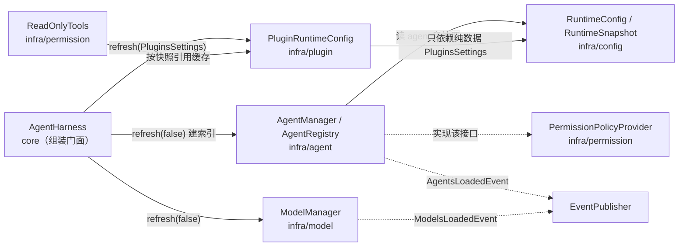

# Agent 模块落地方案

> 状态：**已全部裁决（Q1～Q13）并落地完成**，见 §12 落地记录
> 范围：交付 `infra/config` 的 agent 段 + `infra/agent` 全部实现 + `plugins` 段接线 + 两个装载事件 + DI 装配 + 单测；
> **不接** `SessionManager`、`ReActLooper`、`core/prompt`、人工审批通道。

## 0. 已确认口径（用户裁决）

| # | 决策 | 落地含义 |
| --- | --- | --- |
| 1 | **只按工具名授权** | `agents.json` 里写工具名集合；**删除**「按插件标签授权」的方案与相关注释（`PluginProperties.JELLYFISH_TAGS` 的表述要改） |
| 2 | 未提供 / 未知 agentId **引用不到任何 agent** | `find(null)`、`policyOf(null)` 都不命中；`policyOf` 落到 `unrestricted`（fail-open）；会话创建时自动绑定默认 agent 由 `AgentManager.resolveDefault()` 提供入口 |
| 3 | 新增 Agent 装载事件，**并回头给 ModelManager 补对称事件** | 新增 `AgentsLoadedEvent` + `ModelsLoadedEvent`；`ModelManager` 构造器加 `EventPublisher` |
| 4 | 提示词按推荐 | `systemPrompt` **原文透传**，不做插值、不拼装、不引用外部 md；`${}` 冲突用 `\${}` 转义并在文档里写明 |
| 5 | **`plugins` 段本轮一起接线** | `PluginRuntimeConfig` 改成「快照持有者」并由配置驱动；顺带修掉 `ReadOnlyTools` 的构造期快照顺序隐患 |
| 6 | `agents.json` 示例写进 README | 仓库根 README 增「配置」一节 |
| 7 | `AgentSettings` 进 `RuntimeSnapshot` | 单点 volatile 发布，与 `JellyfishSettings` 对称 |
| 8 | 字段只做 4 个 | `agentId` / `description` / `systemPrompt` / `permissions`；不预留模型、轮次、工具集等未读字段 |
| 9 | 范围与 permission 那轮口径一致 | 只交付模块本身 + 装配，不接线调用点 |
| 10 | **本轮不做 `SessionManager`** | 依赖它的实现（会话级自动绑定默认 agent）只留 `TODO` 注释，**不写占位实现** |
| 11 | 配置文件 ↔ 配置类统一（后者覆盖前者的旧命名） | `config.json`→`AppConfig`、`models.json`→`ModelSettings`、`agents.json`→`AgentSettings`、`jellyfish.json`→`JellyfishSettings`；一个文件一个根类、一个双源段 |

## 1. 现状基线（实测）

- `jellyfish-infra/src/main/java/zcd/jellyfish/infra/agent/` 是**空目录**；`jellyfish-infra/src/main/java/zcd/jellyfish/infra/command/`、`metrics/`（本轮不动）、`jellyfish-core/src/main/java/zcd/jellyfish/core/prompt/` 同样为空。
- `PermissionPolicyProvider`（`infra/permission`）已就位，注释明确写着「将来 `AgentManager` 从 `agents.json` 装载 agent 定义后实现本接口，依赖方向是 agent → permission」。
- `PermissionModule.providePermissionPolicyProvider()` 目前返回占位实现 `agentId -> PermissionPolicy.unrestricted()`，并挂着一句 `TODO AgentManager 落地后……`。
- `RuntimeConfig` 只处理一个配置段（`AppConfig.getModel()` → `ModelSettings` → `RuntimeSnapshot`）；**没有** agent 段，`RuntimeSnapshot` 只有 `ModelSettings` 与派生出的 providers。
- `ModelSettings` 的注释自称「模型配置文件（`jellyfish.json`）反序列化后的原始结构」——历史上 `jellyfish.json` 与 `ModelSettings` 确实是一对。本轮按 Q11 统一为「一个文件一个根类」：`config.json`→`AppConfig`、`models.json`→`ModelSettings`、`agents.json`→`AgentSettings`、`jellyfish.json`→`JellyfishSettings`。仓库中**不存在** `AppSettings`（`App*` 前缀已归 `AppConfig`），也**没有** `models.json` / `agents.json` / `jellyfish.json` 实体文件：三份都是从零添加、位置由 `config.json` 声明。
- `ModelSettings` 的引用面只有 6 个文件（`RuntimeSnapshot` / `RuntimeConfig` / `ConfigLoader` 类注释 + 3 个测试类），`ModelManager` **不直接引用它**（只用 `getProviders()` / `getDefaultProvider()` / `getDefaultModel()` 三个门面方法）——这是「模型段改挂 models.json」只需改类注释、不须动任何代码的原因。
- `PluginModule.providePluginRuntimeConfig()` 返回 `PluginRuntimeConfig.defaults()`（硬编码扫 `plugins/`、不限启用禁用、无插件配置），**`jellyfish.json` 的 `plugins` 段实际读不进来**——因此 `ReadOnlyTools` 合并出的白名单**恒为空**，PLAN 模式必然全拒。
- `PluginRuntimeConfig` 是**不可变**装配输入，被 `PF4JPluginManager` **在构造期**注入、在 `bootstrap()` 里才交给 `JellyfishPluginManager`；`ReadOnlyTools` 则**在构造期解析一次**并永久缓存——两者都早于 `runtimeConfig.refresh()`，是本轮必须处理的时序隐患。
- `PluginProperties.JELLYFISH_TAGS` 注释写着「插件标签，供 `agents.json` 的按标签授权使用」；标签解析能力（`JellyfishPluginDescriptor.getTags()`）已实现且有测试。
- `api/event/notification/` 有 7 个事件，**没有**任何 Agent / Model 装载事件。

## 2. 目标态

### 2.1 依赖边（本轮新增）



三条新边都需要评审时明确接受：

1. `infra/agent → infra/config`（读配置段快照）与 `infra/agent → infra/permission`（实现策略接口）——`PERMISSION` 方案早已预告，且无环。
2. **`infra/plugin → infra/config`**：`PluginRuntimeConfig.refresh(PluginsSettings)` 需要一个配置类型。这是对 `PluginRuntimeConfig` 现有注释（「不依赖配置层」）的一次**收紧解释**，见 §3.4。
3. `infra/permission → infra/plugin` 是既有边，本轮只是让它在**运行期**真正读到配置（原来读到的是硬编码默认值）。

### 2.2 包结构

```
jellyfish-infra/src/main/java/zcd/jellyfish/infra/config/
├── JellyfishSettings.java  # 【新增】jellyfish.json 的根：plugins 段（将来的会话 / 事件 / 权限段也落这里）
├── AgentSettings.java      # 【新增】agents.json 的根：defaultAgent + agents 映射
├── AgentDefinition.java    # 【新增】单个 agent 定义：agentId / description / systemPrompt / permissions
├── AgentPermissions.java   # 【新增】permissions 段原始值：三个工具名列表
├── PluginsSettings.java    # 【新增】plugins 段原始值：enabled / disabled / configurations（扫描目录后续迁去 config.json 的 PluginPaths）
├── ModelSettings.java      # 【改】只改类注释：对应文件由 jellyfish.json 改为 models.json（不再承载 plugins 段）
├── RuntimeSnapshot.java    # 【改】加 agentSettings / jellyfishSettings
├── RuntimeConfig.java      # 【改】加 agent / jellyfish 两段的双源读取与合并 + 三个 getter
└── AppConfig.java          # 【改】加 agent / jellyfish 两个段的双源路径（ConfigPaths）

jellyfish-infra/src/main/java/zcd/jellyfish/infra/agent/
├── AgentRegistry.java      # 【新增】只读索引：agentId → AgentDefinition + agentId → PermissionPolicy + defaultAgentId
└── AgentManager.java       # 【新增】门面 + implements PermissionPolicyProvider

jellyfish-api/src/main/java/zcd/jellyfish/api/event/notification/
├── AgentsLoadedEvent.java  # 【新增】agent 定义装载完成
└── ModelsLoadedEvent.java  # 【新增】provider / model 索引重建完成

jellyfish-infra/src/main/java/zcd/jellyfish/infra/plugin/
└── PluginRuntimeConfig.java # 【改】加 refresh(PluginsSettings)，内部改为「快照持有者」

jellyfish-infra/src/main/java/zcd/jellyfish/infra/permission/
└── ReadOnlyTools.java       # 【改】构造期解析一次 → 按快照引用缓存

jellyfish-infra/src/main/java/zcd/jellyfish/infra/model/
└── ModelManager.java        # 【改】构造器加 EventPublisher；构造期只建索引不发事件，refresh 发事件

jellyfish-core/src/main/java/zcd/jellyfish/core/
└── AgentHarness.java        # 【改】构造器加 AgentManager / PluginRuntimeConfig；bootstrap 补两步

jellyfish-cli/src/main/java/zcd/jellyfish/cli/
├── di/AgentModule.java      # 【新增】把 PermissionPolicyProvider 绑定到 AgentManager
├── di/PermissionModule.java # 【改】删除占位 @Provides（否则同类型双绑定，Dagger 编译期报错）
├── di/PluginModule.java     # 【改】PluginRuntimeConfig 由配置驱动
└── di/JellyfishComponent.java # 【改】加 AgentModule 与 agentManager() getter

src/main/resources/config.json 与 jellyfish-cli/src/main/resources/config.json  # 【改】加 agent / jellyfish 两个段路径（model 段由用户指向 models.json）
README.md                       # 【改】新增「配置」一节（agents.json 示例）
AGENTS.md                       # 【改】按 §5.1 同步
permission方案.md                # 【改】顶部加一行注记：AgentManager 已落地，§4.4 示例键路径收敛
```

**配置文件 ↔ 配置类（本仓库统一约定）**：

| 文件 | 根配置类 | 内容 |
| --- | --- | --- |
| `classpath:config.json` | `AppConfig` | 应用级：`processName` + 各配置段的双源路径。**只有它声明路径**，其余文件在哪由它决定 |
| `models.json` | `ModelSettings` | `defaultProvider` / `defaultModel` / `providers` |
| `agents.json` | `AgentSettings` | `defaultAgent` / `agents` |
| `jellyfish.json` | `JellyfishSettings` | `plugins`（以及将来的会话 / 事件 / 权限等运行时段） |

类名与文件名一一对应；`config.json` 里每个文件对应一个 `ConfigPaths` 段（段名即 `AppConfig` 的字段名）。**一个文件一个根类、一个双源段**：不把两段塞进同一个根类——这是本轮把模型段与插件段拆成两份文件的直接原因。

**为什么 `AgentSettings` / `AgentDefinition` / `AgentPermissions` 放 `infra/config` 而不是 `infra/agent`**：它们是**用户可见配置类**，与 `ModelSettings` / `Provider` / `Model` 同族（`infra/config` 是配置段与纯数据类的家）。若放进 `infra/agent`，则 `RuntimeConfig` 必须依赖 `infra/agent`，而 `AgentManager` 又依赖 `RuntimeConfig`——包级循环。放在 `infra/config` 后依赖是单向的 `agent → config`。

**为什么 `AgentDefinition` 里不直接持有 `PermissionPolicy`**：那会给 `infra/config` 引入 `→ infra/permission` 的边（配置包依赖权限包，概念上错位）。转换放在 `AgentRegistry.refresh()` 里一次完成（见 §3.2），`policyOf` 退化为一次 map 取值。

### 2.3 职责一览

| 类 | 做什么 | 不做什么 |
| --- | --- | --- |
| `AgentManager`（infra/agent） | 从 `RuntimeConfig` 读 agent 段 → 交给注册表建索引；提供 `find` / `require` / `resolveDefault` / `systemPromptOf`；实现 `policyOf` | 不读文件、不解析 JSON、不拼装提示词、不校验工具是否存在、不持有会话状态 |
| `AgentRegistry`（infra/agent） | 承载「agentId → 定义」与「agentId → 权限策略」两张只读索引 + defaultAgentId，整体重建 | 不读配置、不解析默认值（默认值解析归门面）、不做判定 |
| `AgentDefinition`（infra/config） | 只表达「这个 agent 长什么样」（不变量值对象） | 不知道权限模块、不知道会话、不知道插件 |
| `AgentPermissions`（infra/config） | 只表达「配置里写了哪三组工具名」 | 不做优先级判定（优先级归 `PermissionPolicy`） |
| `PluginsSettings`（infra/config） | 只承载 `plugins` 段原始结构 | 不解析路径、不组装 `PluginRuntimeConfig` |
| `PluginRuntimeConfig`（infra/plugin） | 仍是插件管理器唯一认的装配输入，只是变成「稳定引用 + 内部快照可替换」 | 不读配置、不认识 `PluginSettings` 以外的配置类型 |

## 3. 关键签名（Java 8）

### 3.1 配置层（`infra/config`）

```java
/** 单个 agent 的权限段原始值：只承载用户写下的三组工具名，不做优先级判定。 */
public final class AgentPermissions {

    /**
     * 反序列化构造器。
     *
     * @param deniedTools  显式拒绝的工具名，可为 {@code null} 或空
     * @param askTools     需人工审批的工具名，可为 {@code null} 或空
     * @param allowedTools 允许的工具名（空表示不限制），可为 {@code null}
     */
    @JsonCreator
    public AgentPermissions(@JsonProperty("deniedTools") List<String> deniedTools,
                            @JsonProperty("askTools") List<String> askTools,
                            @JsonProperty("allowedTools") List<String> allowedTools) {
        // 内部一律转成不可变 List，缺省为空列表
    }

    public List<String> getDeniedTools();
    public List<String> getAskTools();
    public List<String> getAllowedTools();

    /** 三组都为空表示「无声明」。 */
    public boolean isEmpty();

    @Override
    public String toString();
}
```

```java
/** agent 定义：agents.json 里一个条目的不可变快照，不含任何运行期状态。 */
public final class AgentDefinition {

    /**
     * 反序列化与合并共用的构造器。
     *
     * @param agentId      agent 标识，可为 {@code null}（由合并阶段按配置 key 回填，照 {@code Provider}）
     * @param description  用途描述，可为 {@code null}
     * @param systemPrompt 系统提示词<b>原文</b>，可为 {@code null}；本类不做插值与拼装
     * @param permissions  权限段，可为 {@code null}（按空处理）
     */
    @JsonCreator
    public AgentDefinition(@JsonProperty("agentId") String agentId,
                           @JsonProperty("description") String description,
                           @JsonProperty("systemPrompt") String systemPrompt,
                           @JsonProperty("permissions") AgentPermissions permissions) { ... }

    /**
     * 以配置 key 回填标识，返回副本。
     *
     * @param agentId 配置里该条目的 key
     * @return 回填后的副本
     */
    public AgentDefinition withAgentId(String agentId);

    public String getAgentId();
    public String getDescription();     // 可为 null
    public String getSystemPrompt();    // 可为 null；原文，不插值
    public AgentPermissions getPermissions();   // 恒非 null

    @Override
    public String toString();   // 只带 agentId，避免提示词进日志
}
```

```java
/** 整份 agents.json 反序列化后的原始结构，只承载单份文件的内容，不做双源合并。 */
public final class AgentSettings {

    /**
     * 反序列化与合并共用的构造器。
     *
     * @param defaultAgent 默认 agentId，可为 {@code null}
     * @param agents       agentId → agent 定义，可为 {@code null}
     */
    @JsonCreator
    public AgentSettings(@JsonProperty("defaultAgent") String defaultAgent,
                         @JsonProperty("agents") Map<String, AgentDefinition> agents) { ... }

    /** 获取默认 agentId，未配置时为 {@code null}。 */
    public String getDefaultAgent();

    /** 获取 agentId → 定义，可能为空但不会为 {@code null}，顺序与配置一致。 */
    public Map<String, AgentDefinition> getAgents();

    /** 是否未配置任何 agent。 */
    public boolean isEmpty();
}
```

```java
/** plugins 段原始值：启用 / 禁用名单、各插件配置段。 */
public final class PluginsSettings {

    /**
     * 反序列化与合并共用的构造器。
     *
     * @param enabled        启用名单，可为 {@code null}
     * @param disabled       禁用名单，可为 {@code null}
     * @param configurations pluginId → 该插件配置段，可为 {@code null}
     */
    @JsonCreator
    public PluginsSettings(@JsonProperty("enabled") List<String> enabled,
                           @JsonProperty("disabled") List<String> disabled,
                           @JsonProperty("configurations") Map<String, Map<String, Object>> configurations) { ... }

    public List<String> getEnabled();
    public List<String> getDisabled();
    public Map<String, Map<String, Object>> getConfigurations();

    /** 三段全空表示「未配置 plugins 段」。 */
    public boolean isEmpty();
}
```

> **后续调整**：`roots` 一度写在本段里，后因「去哪找插件 jar」与「去哪个文件读配置」同属部署事实而迁到
> `config.json`（`PluginPaths`）。落地后本段只剩三个字段，扫描目录由 `RuntimeConfig#getPluginRoots()` 提供、
> `PluginRuntimeConfig#refresh(List, PluginsSettings)` 一并装入快照。下面各处保留迁移前的形态，
> 仅作为当初决策记录。

本轮把「模型段」与「插件段」**拆成两份文件**，因此 `JellyfishSettings` 是**新增类**，`ModelSettings` 保持原名、只换挂靠的文件：

```java
/**
 * {@code jellyfish.json} 反序列化后的原始结构：运行期设置。
 * <p>
 * 按本仓库统一约定（类名 ↔ 文件名）：{@code config.json} → {@code AppConfig}、
 * {@code models.json} → {@code ModelSettings}、{@code agents.json} → {@code AgentSettings}、
 * {@code jellyfish.json} → 本类。
 * <p>
 * 本类承载「既不属于模型、也不属于 agent」的运行期配置段：当前只有 {@code plugins}，
 * 将来的会话 / 事件 / 权限段也落在这里。插件段<b>不</b>塞进 {@code ModelSettings}：
 * 一个根类只承载自己那份文件的内容，这是「一个文件一个根类」约定的直接推论。
 * <p>
 * 该类只承载「单份文件」的内容，不做 global/project 合并；合并结果由 {@link RuntimeConfig}
 * 产出。不可变：不存在 setter，集合以不可变映射发布。
 */
public class JellyfishSettings {

    @JsonCreator
    public JellyfishSettings(@JsonProperty("plugins") PluginsSettings plugins) { ... }

    /**
     * 获取插件段。
     *
     * @return 插件段，未配置时为空对象而非 {@code null}
     */
    public PluginsSettings getPlugins();
}
```

`ModelSettings` 的改动**只有一处注释**：类注释里的 `jellyfish.json` → `models.json`（并补一句「本类只承载模型段，插件段见 `JellyfishSettings`」）。**无字段增删、无构造器签名变化**，`ModelSettingsTest` 原样保留。

`RuntimeSnapshot` / `RuntimeConfig`：

```java
    public static RuntimeSnapshot of(ModelSettings modelSettings, AgentSettings agentSettings,
                                     JellyfishSettings jellyfishSettings);
    public ModelSettings getModelSettings();          // 保持不变
    public AgentSettings getAgentSettings();          // 新增
    public JellyfishSettings getJellyfishSettings();  // 新增
    public PluginsSettings getPluginsSettings();      // 转发 snapshot.getJellyfishSettings().getPlugins()
```

```java
    // RuntimeConfig.refresh() 内新增的部分
    ModelSettings mergedModel = load(appConfig.getModel(), ModelSettings.class, RuntimeConfig::mergeModelSettings);
    AgentSettings mergedAgents = load(appConfig.getAgent(), AgentSettings.class, RuntimeConfig::mergeAgentSettings);
    JellyfishSettings mergedJellyfish = load(appConfig.getJellyfish(), JellyfishSettings.class,
            RuntimeConfig::mergeJellyfishSettings);
    notifyIfInvalid(mergedModel);
    notifyIfInvalid(mergedAgents);
    notifyIfInvalid(mergedJellyfish);
    this.snapshot = RuntimeSnapshot.of(mergedModel, mergedAgents, mergedJellyfish);
```

> `notifyIfInvalid` 按参数类型重载（`ModelSettings` / `AgentSettings` / `JellyfishSettings`），既有方法签名与行为不变；`ModelManager` 只看 `getProviders()` / `getDefaultProvider()` / `getDefaultModel()` 三个门面方法，**完全不受这次拆分影响**。

### 3.2 `infra/agent`

```java
/**
 * agent 定义与权限策略的只读索引。
 * <p>
 * 两张表 + 一个默认值由 {@link #refresh} 一次性整体重建：定义表来自 agents.json，
 * 策略表是定义表到 {@link PermissionPolicy} 的一次性转换结果——转换放在刷新期做，
 * 是为了让 {@code policyOf} 退化成一次 map 取值，避免每次工具调用都复制集合
 * （参照 {@code ModelRegistry} 用 volatile 字段发布不可变映射的做法）。
 */
@Singleton
public final class AgentRegistry {

    /** agentId → 定义，顺序与配置一致。 */
    private volatile Map<String, AgentDefinition> definitionsById = Collections.emptyMap();

    /** agentId → 权限策略，与定义表同步重建。 */
    private volatile Map<String, PermissionPolicy> policiesById = Collections.emptyMap();

    /** 默认 agentId，可为 {@code null}。 */
    private volatile String defaultAgentId;

    @Inject
    public AgentRegistry() {
    }

    /**
     * 用最新配置整体重建索引。
     *
     * @param settings 合并后的 agent 配置，不可为 {@code null}
     */
    public synchronized void refresh(AgentSettings settings) { ... }

    /**
     * 按 agentId 查找定义。
     *
     * @param agentId agent 标识，可为 {@code null}
     * @return 定义；{@code null} 或未知标识时返回 {@code null}
     */
    public AgentDefinition find(String agentId);

    /**
     * 按 agentId 取权限策略。
     *
     * @param agentId agent 标识，可为 {@code null}
     * @return 策略；未命中时返回 {@link PermissionPolicy#unrestricted()}，恒非 {@code null}
     */
    public PermissionPolicy policyOf(String agentId);

    /**
     * 获取默认 agentId。
     *
     * @return 配置里声明的默认 agentId，未配置时为 {@code null}
     */
    public String getDefaultAgentId();

    /**
     * 获取全部定义。
     *
     * @return 不可修改集合，可能为空但不会为 {@code null}
     */
    public Collection<AgentDefinition> all();
}
```

```java
/**
 * Agent 门面：从配置装载定义，按 agentId 提供系统提示词与权限策略（AGENTS.md 的职责描述）。
 * <p>
 * 与 {@code ModelManager} 同构：构造期只建（空）索引，真正的装载发生在
 * {@code AgentHarness.bootstrap()} 中 {@code runtimeConfig.refresh()} 之后。
 * <p>
 * <b>fail-open 的边界</b>：{@code agentId} 为空或未被配置声明 → 引用不到任何 agent →
 * {@link #policyOf} 返回 {@link PermissionPolicy#unrestricted()}，与 permission 方案的
 * fail-open 口径一致；需要「硬失败」的调用点（如将来的 /agent 切换命令）改用 {@link #require}。
 */
@Singleton
public class AgentManager implements PermissionPolicyProvider {

    @Inject
    public AgentManager(RuntimeConfig runtimeConfig, AgentRegistry registry, EventPublisher events) { ... }

    /**
     * 重建 agent 索引。
     *
     * @param reloadConfig 是否先重新读取配置文件（热更新时传 {@code true}）
     */
    public void refresh(boolean reloadConfig);

    /**
     * 按 agentId 查找定义。
     *
     * @param agentId agent 标识，可为 {@code null}
     * @return 定义，未命中返回 {@code null}
     */
    public AgentDefinition find(String agentId);

    /**
     * 按 agentId 查找定义，未命中即失败。
     *
     * @param agentId agent 标识，不可为空白
     * @return 定义
     * @throws JellyfishException 标识为空或未被任何 agent 声明时抛出
     */
    public AgentDefinition require(String agentId);

    /**
     * 解析「会话创建时应绑定的默认 agent」。
     * <p>
     * 三档：① 配置了 {@code defaultAgent} 且存在 → 它；② 未配置但有 agent → 第一个（配置顺序）；
     * ③ 一个 agent 都没有 → 返回 {@code null}。
     * <p>
     * <b>与 {@code ModelManager.resolveDefault()} 的唯一差别</b>：没有 agent 时返回 {@code null}
     * 而不是抛异常。「一个 agent 都没配」是合法状态（全员 fail-open），不需要让会话创建失败。
     * <p>
     * TODO 会话级自动绑定未落地：{@code SessionManager} 尚未实现，本方法目前没有任何调用点。
     *      待它落地后在「创建会话」那一步调用本方法并把结果写入会话的当前 agentId；
     *      刻意<b>不</b>在 {@code SessionManager} 里写占位实现，避免出现一个永远不被执行的假接线。
     *
     * @return 默认 agent 定义，无任何 agent 时返回 {@code null}
     */
    public AgentDefinition resolveDefault();

    /**
     * 取系统提示词原文。
     *
     * @param agentId agent 标识，可为 {@code null}
     * @return 提示词原文；未命中或未配置提示词时返回 {@code null}
     */
    public String systemPromptOf(String agentId);

    /**
     * 获取配置声明的默认 agentId。
     *
     * @return 默认 agentId，未配置时为 {@code null}
     */
    public String getDefaultAgentId();

    /**
     * 获取全部 agent 定义。
     *
     * @return 不可修改集合，可能为空但不会为 {@code null}
     */
    public Collection<AgentDefinition> all();

    @Override
    public PermissionPolicy policyOf(String agentId);

    /**
     * 只重建索引、不发事件：构造期总线可能尚未启动，发事件只会产生一条被缓冲重放的假事件。
     *
     * @param reloadConfig 是否先重新读取配置文件
     */
    private void rebuild(boolean reloadConfig);
}
```

`AgentManager` 构造器最后一行调 `rebuild(false)`（与 `ModelManager` 完全同构，注释里写明「此刻快照必为空，真正的装载在 bootstrap」）。

### 3.3 装载事件（`api/event/notification`）

```java
/** agent 定义装载完成事件：每次索引重建后广播（含「一个都没有」的情况）。 */
public final class AgentsLoadedEvent extends AbstractJellyfishEvent {

    /**
     * 构造事件。
     *
     * @param defaultAgentId 配置声明的默认 agentId，可为 {@code null}
     * @param agentIds       本次装载的 agentId 集合
     */
    public AgentsLoadedEvent(String defaultAgentId, Set<String> agentIds) {
        super(null);
        ...
    }

    public String getDefaultAgentId();
    public Set<String> getAgentIds();
}
```

```java
/** provider / model 索引重建完成事件：与 {@link AgentsLoadedEvent} 对称。 */
public final class ModelsLoadedEvent extends AbstractJellyfishEvent {

    /**
     * 构造事件。
     *
     * @param defaultProvider 配置声明的默认 provider，可为 {@code null}
     * @param defaultModel    配置声明的默认 model，可为 {@code null}
     * @param providerNames   本次索引到的 provider 名集合
     */
    public ModelsLoadedEvent(String defaultProvider, String defaultModel, Set<String> providerNames) {
        super(null);
        ...
    }
    ...
}
```

`ModelManager` 的改动（**只看这三点**）：

```java
    @Inject
    public ModelManager(RuntimeConfig runtimeConfig, ModelRegistry modelRegistry,
                        LlmClientFactory llmClientFactory, EventPublisher events) {
        ...
        rebuild(false);          // 构造期只建索引，不发事件
    }

    /** 刷新模型索引，并在重建后广播 {@link ModelsLoadedEvent}。 */
    public void refresh(boolean reloadConfig) {
        rebuild(reloadConfig);
        events.publish(new ModelsLoadedEvent(runtimeConfig.getDefaultProvider(),
                runtimeConfig.getDefaultModel(), providerNames()));
    }

    /** 只重建索引、不发事件。 */
    private void rebuild(boolean reloadConfig) { ...原 refresh 的全部实现... }
```

**发布语义（两个事件一致）**：
- 每次 `refresh(...)` **成功后**发一条，**内容可以为空**（「0 个 agent / 0 个 provider」这件事必须可见）；
- 事件表示「**索引已重建**」而不是「配置发生了变更」——变更检测要 diff 上一份快照，本轮不做（写进 TODO）；
- `EventChannel` 是 best-effort，本事件可丢弃（与 `ConfigWarningEvent` 同级别）。

### 3.4 `plugins` 段接线

`PluginRuntimeConfig` 从「不可变装配输入」改为「**稳定引用 + 内部快照可替换**」——这正是本仓库既有的 `RuntimeConfig` + `RuntimeSnapshot` 做法（字段依旧是 final 引用，换的是内部 volatile 快照）：

```java
public final class PluginRuntimeConfig {

    /** 当前快照，整体替换保证读取一致性；未刷新时是构造器 / 工厂给出的初始快照。 */
    private volatile Snapshot snapshot;

    /** 保留既有构造器与工厂方法签名（既有单测不动），只是把参数装进初始快照。 */
    public PluginRuntimeConfig(List<Path> pluginsRoots, Set<String> enabledPluginIds,
                               Set<String> disabledPluginIds,
                               Map<String, Map<String, Object>> pluginConfigurations) { ... }

    public static PluginRuntimeConfig defaults();
    public static PluginRuntimeConfig ofRoots(Path... roots);

    /**
     * 用最新配置整体替换快照。
     * <p>
     * <b>为什么是本对象持有快照而不是重建本对象</b>：本对象在构造期就被注入 {@code PF4JPluginManager}
     * 与 {@code ReadOnlyTools}，而配置在 {@code runtimeConfig.refresh()} 之后才可用；
     * 若靠重建对象，注入方永远拿不到新值。改法是「引用不变、快照可换」。
     * <p>
     * <b>为什么接受 {@code infra/plugin → infra/config}</b>：{@code PluginsSettings} 是纯数据
     * （无 IO、无 PF4J 类型、不被插件管理器之外的人使用），依赖无环；相比让组装门面手工映射四个字段，
     * 一处映射更不容易漏字段。本类注释里「不依赖配置层」的表述同步收紧为「不依赖配置层的加载逻辑」。
     *
     * @param settings 合并后的插件段配置，可为 {@code null}（按空处理）
     */
    public void refresh(PluginsSettings settings);

    // 后续调整：签名变为 refresh(List<Path> pluginsRoots, PluginsSettings settings)，
    // 扫描目录来自 config.json；本对象不再自己解析 roots 字符串、不再展开 ~（由 RuntimeConfig 负责）。

    public List<Path> getPluginsRoots();
    public Set<String> getEnabledPluginIds();
    public Set<String> getDisabledPluginIds();

    /**
     * 获取全部插件配置段。
     * <p>
     * 同一快照期内的返回值<b>恒为同一实例</b>，消费方（如 {@code ReadOnlyTools}）可以用引用比较
     * 判断「快照是否换过」，从而避免每次调用都重新解析。
     *
     * @return 不可变映射，无配置时为空映射而非 {@code null}
     */
    public Map<String, Map<String, Object>> getPluginConfigurations();

    /** 内部不可变快照：四个字段一次性替换。 */
    private static final class Snapshot { ... }
}
```

`ReadOnlyTools` 由「构造期解析一次」改为「按快照引用缓存」——顺带修掉「白名单恒为空 / 永不刷新」的隐患：

```java
    /** 上次解析所依据的插件配置快照，用于判断是否需要重算。 */
    private Map<String, Map<String, Object>> parsedFrom;

    /** 由 {@link #parsedFrom} 派生的只读工具名集合。 */
    private Set<String> names = Collections.emptySet();

    /**
     * 获取全部只读工具名。
     * <p>
     * 白名单随插件配置快照变化而重算：{@code PluginRuntimeConfig} 在启动期被刷新，
     * 本对象若在刷新前就被构造（Dagger 让它是懒加载的，时机不确定），只解析一次会永久读到空集合。
     *
     * @return 不可变集合，未配置任何只读工具时为空集合
     */
    public Set<String> names();

    public boolean contains(String toolName);
```

### 3.5 组装时序（`AgentHarness`）

```java
    @Inject
    public AgentHarness(RuntimeConfig runtimeConfig, EventChannel eventChannel, ModelManager modelManager,
                        AgentManager agentManager, PluginRuntimeConfig pluginRuntimeConfig,
                        PF4JPluginManager pluginManager) { ... }

    public void bootstrap() {
        eventChannel.start();
        runtimeConfig.refresh();
        modelManager.refresh(false);
        agentManager.refresh(false);
        // 插件运行时在 bootstrap() 时才读装配输入，因此刷新必须排在 pluginManager.bootstrap() 之前
        pluginRuntimeConfig.refresh(runtimeConfig.getPluginsSettings());
        pluginManager.bootstrap();
    }
```

顺序的理由与既有注释同源：**通知订阅者注册完成 → 配置加载 → 各注册表建索引 → （插件配置刷新）→ 插件启动**；`pluginRuntimeConfig.refresh(...)` 必须在 `pluginManager.bootstrap()` 之前，因为 `JellyfishPluginManager` 的启用/禁用种子与扫描根目录都在那一刻读取。

### 3.6 DI 装配

```java
// cli/di/AgentModule.java（新增）
@Module
public final class AgentModule {

    private AgentModule() {
    }

    /**
     * 把权限策略来源绑定到 AgentManager。
     * <p>
     * 取代 PermissionModule 里的占位实现：同一类型只能有一个绑定，否则 Dagger 编译期报错。
     *
     * @param agentManager agent 门面
     * @return 策略来源
     */
    @Provides
    @Singleton
    static PermissionPolicyProvider providePermissionPolicyProvider(AgentManager agentManager) {
        return agentManager;
    }
}
```

- `PermissionModule` 删除 `providePermissionPolicyProvider()` 与相关 import、更新类注释（策略绑定已迁出）；
- `PluginModule.providePluginRuntimeConfig(RuntimeConfig)` 改为「先建默认对象、再用配置刷新」：`PluginRuntimeConfig config = PluginRuntimeConfig.defaults(); config.refresh(runtimeConfig.getPluginsSettings()); return config;`
- `JellyfishComponent` 加 `AgentModule.class` 与 `AgentManager agentManager();`。

## 4. 装载与合并语义

### 4.1 配置形状

`config.json`（**只有它声明配置文件路径与插件扫描目录**）：

```json
{
  "processName": "Jellyfish",
  "model":     { "globalPath": "/etc/jellyfish/models.json",   "projectPath": "./models.json" },
  "agent":     { "globalPath": "/etc/jellyfish/agents.json",   "projectPath": "./agents.json" },
  "jellyfish": { "globalPath": "/etc/jellyfish/jellyfish.json", "projectPath": "./jellyfish.json" },
  "plugins":   { "roots": ["plugins"] }
}
```

> 段名即 `AppConfig` 的字段名：`model`（既有段，指向的文件由 jellyfish.json 改为 models.json）、`agent`（新增）、`jellyfish`（新增）、`plugins`（**后续调整**：扫描目录原先写在 `jellyfish.json` 的 `plugins.roots`，因与「去哪个文件读配置」同属部署事实而迁到此处的 `PluginPaths`；`jellyfish.json` 的 `plugins` 段自此只留 `enabled` / `disabled` / `configurations`）。如果不想让段名叫 `jellyfish`，只需改 `AppConfig` 的字段名，不影响其它改动。

`models.json`（provider / model）：

```json
{
  "defaultProvider": "openai",
  "defaultModel": "gpt-4o",
  "providers": { "openai": { "type": "openai", "apiKey": "${OPENAI_API_KEY}", "models": [{"name": "gpt-4o"}] } }
}
```

`jellyfish.json`（运行期设置，当前只有插件段；扫描目录不在这里，见上方 `config.json` 的 `plugins.roots`）：

```json
{
  "plugins": {
    "enabled": [],
    "disabled": ["jellyfish-plugin-node"],
    "configurations": {
      "jellyfish-plugin-python": { "readOnlyTools": ["read_file", "list_dir"] }
    }
  }
}
```

`agents.json`：

```json
{
  "defaultAgent": "coder",
  "agents": {
    "coder": {
      "description": "通用编码助手",
      "systemPrompt": "You are Jellyfish, a coding agent.",
      "permissions": {
        "deniedTools": ["bash"],
        "askTools": ["write_file"],
        "allowedTools": []
      }
    }
  }
}
```

合并规则（与 provider 一致，逐条落到注释）：

| 段 | 规则 | 理由 |
| --- | --- | --- |
| `agents.<id>` | 同名 agent **整对象替换**（项目级覆盖全局级），不同 key 视为新增 | 逐字段合并会让「一半权限来自全局、一半来自项目」无法审计 |
| `defaultAgent` | 项目级非空值优先，否则回退全局级 | 与 `defaultProvider` 完全一致，复用 `override(...)` |
| `plugins.configurations.<pluginId>` | 同名插件配置段**整对象替换** | 同上；这是 `readOnlyTools` 与将来插件配置的共同语义 |
| `plugins.enabled` / `disabled` | 项目级**非空则整体替换**全局级（列表不做并集） | 并集会让「项目级想收窄」做不到；顺序与「谁是生效值」必须唯一 |
| `config.json` 的 `plugins.roots` | 不参与双源合并（只写在 `config.json` 一处） | 它与文件路径同属部署事实，天然只有一份真相 |
| `plugins.disabled` 与 `enabled` | `disabled` 优先（既有 `ConfigPluginStatusProvider` 语义，不变） | —— |

### 4.2 容错（一律「告警不中断」）

| 情形 | 处理 |
| --- | --- |
| `agents.json` 路径已配置但文件缺失 / 为空 | `RuntimeConfig.read` 既有逻辑发 `ConfigWarningEvent`；agent 索引为空 |
| `agents.json` 的 key 为空白 | 跳过该条目 + 发 `ConfigWarningEvent` |
| agent 条目 `permissions` 段类型不对（如写成字符串） | 绑定失败会抛 `JellyfishException`——与 `models.json` 现有行为一致（**不做**逐项兜底），此处不新增容忍逻辑 |
| `defaultAgent` 指向不存在的 agent | 发 `ConfigWarningEvent`，索引照常建立；`resolveDefault()` 按 §3.2 的三档处理 |
| 工具名空白 / 重复 | 由 `PermissionPolicy.of` 既有逻辑忽略，不额外告警 |
| `plugins` 段缺失 | `PluginsSettings.isEmpty()` 为真 → `PluginRuntimeConfig` 落到默认（扫 `plugins/`、不限启用禁用、无配置段） |
| `plugins.roots` 为空 | `PluginRuntimeConfig` 既有逻辑回退 `DEFAULT_PLUGINS_ROOT`（后续调整：`roots` 迁到 `config.json`，空白条目由 `RuntimeConfig` 先丢弃） |

### 4.3 未命中语义（fail-open 的适用域不变）

| 情形 | `policyOf` 结果 | `require` 结果 |
| --- | --- | --- |
| `agentId == null` | `unrestricted()`（放行） | 抛 `JellyfishException` |
| `agentId` 非空但未被声明 | `unrestricted()`（放行） | 抛 `JellyfishException` |
| 命中 agent，`permissions` 段为空 | `unrestricted()`（放行） | 返回定义 |
| 命中 agent，策略非空 | 该策略 | 返回定义 |

**这一层不改变 `PermissionManager` 的任何判定逻辑**：PLAN 白名单、显式拒绝、ASK 降级全部照旧，`policyOf` 只是从「恒返回 unrestricted 的占位」换成「按 agentId 查表」。

## 5. 触达点改造清单

| 文件 | 动作 |
| --- | --- |
| `jellyfish-api/.../notification/AgentsLoadedEvent.java` | 新增 |
| `jellyfish-api/.../notification/ModelsLoadedEvent.java` | 新增 |
| `infra/config/JellyfishSettings.java` / `AgentSettings.java` / `AgentDefinition.java` / `AgentPermissions.java` / `PluginsSettings.java` | 新增 |
| `infra/config/AppConfig.java` | **改**：加 `agent` / `jellyfish` 两段（`ConfigPaths`）与 getter |
| `infra/config/ModelSettings.java` | **改**：类注释里的文件由 `jellyfish.json` → `models.json`（无字段/签名变化） |
| `infra/config/RuntimeSnapshot.java` | **改**：加 `agentSettings` / `jellyfishSettings`；`of(...)` 多两个参数 |
| `infra/config/RuntimeConfig.java` | **改**：加 agent / jellyfish 两段 load/merge + `getAgentSettings()` / `getJellyfishSettings()` / `getPluginsSettings()` / `notifyIfInvalid(...)` 重载 |
| `infra/agent/AgentRegistry.java` / `AgentManager.java` | 新增（`resolveDefault()` 内留 `TODO`，见 Q12） |
| `infra/plugin/PluginRuntimeConfig.java` | **改**：内部改 `Snapshot` + `refresh(PluginsSettings)`；四个 getter 行为不变 |
| `infra/permission/ReadOnlyTools.java` | **改**：构造期解析 → 按快照引用缓存 |
| `infra/model/ModelManager.java` | **改**：构造器加 `EventPublisher`；拆出 `rebuild(...)`；`refresh` 发 `ModelsLoadedEvent` |
| `infra/plugin/PluginProperties.java` | **改**：`JELLYFISH_TAGS` 注释去掉「供 agents.json 的按标签授权使用」 |
| `core/AgentHarness.java` | **改**：构造器加 2 个协作者；`bootstrap()` 补 `agentManager.refresh(false)` 与 `pluginRuntimeConfig.refresh(...)` |
| `cli/di/AgentModule.java` | 新增 |
| `cli/di/PermissionModule.java` | **改**：删占位 `@Provides`、更新注释 |
| `cli/di/PluginModule.java` | **改**：`PluginRuntimeConfig` 由配置驱动 |
| `cli/di/JellyfishComponent.java` | **改**：加 `AgentModule` 与 getter |
| `jellyfish-cli/src/main/resources/config.json`、`src/main/resources/config.json` | **改**：加 `agent` / `jellyfish` 两个段路径 |
| `README.md` | **改**：新增「配置」一节（四份配置的最小示例 + `${}` 转义说明） |
| `AGENTS.md` | **改**：见 §5.1 |
| `infra/permission/PermissionSettings.java` | **改**：类注释里的配置路径 `plugins.<pluginId>` → `plugins.configurations.<pluginId>`（Q10=A） |
| `permission方案.md` | **改**：顶部加一行注记（AgentManager 已落地；§4.4/§5.1 的示例键路径收敛为 `plugins.configurations.<pluginId>`） |

**明确不改**：`PermissionManager`、`PermissionPolicy`、`PermissionVeto`、`ExtensionRegistry`、`TypeRegistry`、`EventChannel`、`PluginContext`、`PF4JPluginManager`、`JellyfishPluginManager`、`ConfigPluginStatusProvider`、`ReadOnlyTools` 的判定语义、`infra/session`、`core/ReActLooper`。

### 5.1 `AGENTS.md` 同步清单

| 位置 | 现文 | 改为 |
| --- | --- | --- |
| 代码结构 infra 包列表 | `├── agent/          # Agent 定义注册表：从配置装载定义，按 agentId 提供提示词与权限策略` | 补一句落地口径：`AgentManager（门面，implements PermissionPolicyProvider）+ AgentRegistry（只读索引）；提示词拼装仍归 core/prompt` |
| 代码结构 infra 包列表 | `├── permission/     # …待落地：AgentManager 提供的权限策略源、人工审批通道（ASK 暂时降级为拒绝）` | 去掉「AgentManager 提供的权限策略源」，只留人工审批通道 |
| 架构图 `AgentMgr` 出边 | `ReAct -->|"消息列表 / 当前 agentId / 当前模型"| SessionMgr` 与 `SessionMgr -->|"按 currentAgentId 取 system prompt / Agent 定义"| AgentMgr` | 不变（已准确） |
| 架构图 `AgentMgr` 出边 | —— | 补 `AgentMgr -.-> publish：Agent 定义装载（AgentsLoadedEvent）`；`ModelMgr` 对称补 `ModelsLoadedEvent` |
| 架构图 `Runtime --> AgentMgr` | `注入 Agent 定义` | 补「agents.json 全局级 + 项目级双源合并」 |
| 架构图 `jellyfish.json` 节点 | `Provider/Model/插件清单` | **拆成两个节点**：`models.json`（Provider/Model）+ `jellyfish.json`（插件清单 / 运行期设置）；`Runtime → ModelMgr` 的入边改标 models.json |
| 架构要点「配置加载」段 | —— | 补一条：四份文件对应四类 Settings 根（`AppConfig` / `ModelSettings` / `AgentSettings` / `JellyfishSettings`），均走双源合并；`plugins` 段在 `bootstrap()` 中于插件启动前刷新 |

## 6. 测试计划

| 测试类 | 覆盖点 |
| --- | --- |
| `AgentPermissionsTest` | 三个列表的不可变性、缺省 → 空列表、`isEmpty()` 的三组组合 |
| `AgentDefinitionTest` | 字段透传、`permissions == null` → 空对象、`withAgentId` 返回副本不改原件、`toString` 不含提示词 |
| `AgentSettingsTest` | 反序列化、缺 `agents` 段、空 key 跳过策略（若由 RuntimeConfig 实现则本类只测结构） |
| `PluginsSettingsTest` | 反序列化、缺省四段均为空、`isEmpty()` |
| `AgentRegistryTest` | 整体重建、策略表与定义表同步、`find(null/未知)` → null、`policyOf(null/未知)` → unrestricted 且恒非 null、`all()` 只读 |
| `AgentManagerTest` | ① 构造期快照为空 → 索引为空；② `refresh(false)` 后按配置命中；③ `refresh(true)` 会重读 `RuntimeConfig`；④ `require(null/未知)` 抛 `JellyfishException`；⑤ `resolveDefault()` 三档（配置命中 / 无默认取第一个 / 无 agent 返回 null）；⑥ `systemPromptOf` 未命中返回 null；⑦ **每次 `refresh` 发一条 `AgentsLoadedEvent`，构造期不发**；⑧ 事件发布抛异常不影响索引重建 |
| `AgentsLoadedEventTest` / `ModelsLoadedEventTest` | 字段透传、`agentIds` 只读、`sessionId` 为 null |
| `ModelManagerTest`（既有，新增用例） | `refresh` 发 `ModelsLoadedEvent`；构造期不发；内容为当前 provider 名集合 |
| `PluginRuntimeConfigTest`（新增） | `refresh(PluginsSettings)` 后四个 getter 同步更新；`getPluginConfigurations()` 在两次刷新之间**引用相等**、刷新后**引用不同**；`settings == null` 落默认 |
| `ReadOnlyToolsTest`（既有，适配） | 断言方式不变；新增「快照替换后 `names()` 重算」与「未变更时不重复发告警」两条用例 |
| `RuntimeConfigTest`（既有，新增用例） | agent 段双源合并（同名整对象替换、`defaultAgent` 回退、指向不存在时告警）；jellyfish 段里 `plugins` 的同名整对象替换、roots/enabled/disabled 项目级整体替换；`getPluginsSettings()` 转发正确 |
| `AppConfigTest`（既有，新增用例） | 缺 `agent` / `jellyfish` 段 → 空 `ConfigPaths` 而非 null |
| `JellyfishSettingsTest`（新增） | 反序列化、缺 `plugins` 段 → 空对象、`getPlugins()` 不可变 |
| `ModelSettingsTest`（既有） | **原样保留**（本轮只改 `ModelSettings` 的类注释） |
| `PluginModuleTest`（既有，适配） | `providePluginRuntimeConfig(runtimeConfig)` 由配置驱动：给了配置就生效，没给就是默认根目录 |
| `PermissionModuleTest`（既有，适配） | 删除占位断言 |
| `AgentModuleTest`（新增） | `providePermissionPolicyProvider(agentManager)` 返回的就是传入的实例 |
| `AgentHarnessTest`（新增） | `bootstrap()` 调用顺序：`eventChannel.start` → `runtimeConfig.refresh` → `modelManager.refresh` → `agentManager.refresh` → `pluginRuntimeConfig.refresh` → `pluginManager.bootstrap`（用 Mockito `InOrder` 钉住，这是本轮最容易悄悄坏掉的地方） |

约定：JUnit5 + Mockito，`@ExtendWith(MockitoExtension.class)`；只 mock 协作者；方法命名 `{被测试方法}_should_{预期}_when_{条件}`。

## 7. 实施阶段

| 阶段 | 内容 | 结束判据 |
| --- | --- | --- |
| 1 | 两个装载事件 + `ModelManager` 拆 `rebuild`/`refresh` + 单测 | `mvn -q -pl jellyfish-api,jellyfish-infra test` 全绿 |
| 2 | `AgentPermissions` / `AgentDefinition` / `AgentSettings` / `PluginsSettings` + 单测 | 配置类结构就位，不碰 `RuntimeConfig` |
| 3 | 拆分配置文件：新增 `JellyfishSettings` + `ModelSettings` 类注释改挂 models.json + `AppConfig` 加 `agent` / `jellyfish` 两段 + `RuntimeSnapshot` / `RuntimeConfig` 接 agent 段与插件段 + 既有单测补用例 | `RuntimeConfigTest` / `AppConfigTest` / `ModelSettingsTest` / `JellyfishSettingsTest` 全绿 |
| 4 | `PluginRuntimeConfig` 改快照持有者 + `ReadOnlyTools` 改按引用缓存 + 单测 | `PluginRuntimeConfigTest` 新增全绿；既有 `ReadOnlyToolsTest` 全绿 |
| 5 | `AgentRegistry` + `AgentManager`（含 `resolveDefault()` 的 `TODO`）+ 单测 | §6 的 AgentManagerTest ①～⑧ 全绿 |
| 6 | DI：`AgentModule`、删 `PermissionModule` 占位、`PluginModule` 配置驱动、组件 getter + 单测 | `mvn -q test` 全绿 |
| 7 | `AgentHarness` 装配顺序 + `AgentHarnessTest` | `InOrder` 断言全绿 |
| 8 | 文档：`AGENTS.md`、`README.md`、`permission方案.md` 注记、`PluginProperties` / `PermissionSettings` 注释；自查（`@author zcd`、`@param`/`@return`、无 Java 9+ API、无用 import、认知复杂度） | 无待办项，文档与代码一致 |

## 8. 验收标准

1. `mvn -q test` 全绿；新增类行覆盖率 ≥ 90%（JaCoCo 报告人工核对）。
2. `AgentHarnessTest` 的装配顺序断言全绿——这是本轮唯一的跨模块时序契约。
3. 「fail-open 只覆盖未命中」的矩阵（§4.3）逐格有单测钉住，且**未命中/命中**两条路径都不会返回 `null` 策略。
4. `permission` 模块除 `ReadOnlyTools` 的缓存策略外，判定语义一行未改；`PermissionManagerTest` 原样全绿。
5. `PluginRuntimeConfig` 既有构造器与工厂方法签名不变，既有 `PF4JPluginManagerTest` / `ConfigPluginStatusProviderTest` / `JellyfishPluginFactoryTest` 原样全绿。
6. 未实现能力（热更新、diff 变更事件、提示词模板、会话级自动绑定）均留有可检索的 `TODO`，且**不为未落地的依赖写占位实现**（Q12）。
7. 所有新增类/方法/字段有文档注释，类注释带 `@author zcd`，注释解释「为什么」。
8. 文档同步完毕（§5.1 + README + permission 方案注记）。

## 9. 已知限制（本轮接受，写进代码注释）

| # | 限制 | 影响 | 后续 |
| --- | --- | --- | --- |
| L1 | 「会话创建时自动绑定默认 agent」的**调用点**本轮不落地 | `resolveDefault()` 已就绪但无人调用 | **已由 session 轮闭环**：`SessionManager.create(...)` 在 agentId 空白时调用 `resolveDefault()` 并写入会话的当前 agentId（无 agent 时仍为 `null`，fail-open 不变）；本轮按要求只在依赖它的实现处留 `TODO` 注释（不在 `SessionManager` 里写占位实现），见 §3.2 |
| L2 | 无配置热更新 | 只能靠显式 `refresh(true)` | 与 `ModelManager` 一起做文件监听 |
| L3 | 装载事件不代表「配置变更」 | 无法区分首次装载与热更新 | 需要保存上一份快照做 diff |
| L4 | Agent 定义不校验工具是否存在 | 配了不存在的工具名不会报错 | 归 `ReActLooper` / `ToolCallRequest` 的 `NO_HANDLER` |
| L5 | 提示词不支持插值与外部文件引用 | 多 agent 共享提示词片段只能复制 | 需要时再设计（注意与 `${}` 的冲突） |
| L6 | 白名单仍不随插件**热部署**变化 | 热部署新插件后其 `readOnlyTools` 不刷新 | 插件配置热更新落地时一并处理（原 permission L3 的一半已随本轮的按引用缓存修掉） |
| L7 | 事件是 best-effort | 「装载完成」不等于「订阅者都看到了」 | 不属本模块 |
| L8 | 配置文件与配置类的对应关系曾不统一（`jellyfish.json` ↔ `ModelSettings`，`plugins` 段无独立根类） | 看代码与看文件对不上 | **已随 Q11 裁决消除**：`config.json`→`AppConfig`、`models.json`→`ModelSettings`、`agents.json`→`AgentSettings`、`jellyfish.json`→`JellyfishSettings` |

## 10. 风险与缓解

| 风险 | 缓解 |
| --- | --- |
| **装配时序**：`AgentManager` / `PluginRuntimeConfig` 在 `runtimeConfig.refresh()` 之前被读取 → 索引与白名单恒为空 | ① 构造期只 `rebuild`、不发事件；② `bootstrap()` 顺序固定并由 `AgentHarnessTest` 用 `InOrder` 钉住；③ `AgentManagerTest` 单独钉「构造期为空 → refresh 后非空」；④ `ReadOnlyTools` 改为按快照引用缓存，即使构造得更早也能读到后续刷新 |
| `PluginRuntimeConfig` 由不可变改成快照持有者，可能被误当成线程安全的可变对象随意改 | 只暴露 `refresh(PluginsSettings)` 一个写入口，且内部整体替换不可变快照；getter 全部读 `snapshot`；类注释写明「不是线程安全的配置对象，只是快照发布点」 |
| 新增 `infra/plugin → infra/config` 这条边引发评审争议 | `PluginsSettings` 是纯数据（无 IO、无 PF4J 类型）；若评审否决，退路是让 `AgentHarness` 用四个原始参数调用 `refresh(...)`，代价是形态映射散在门面里 |
| 改名 + 签名变更（`RuntimeSnapshot.of(...)`、`JellyfishSettings`、`ModelManager`）波及既有测试 | 改名单独一步（阶段 3 前半），先让全量测试在「只改名」状态下全绿，再做功能改动；三个类的改动都是「加一个参数 + 拆一个私有方法」，既有断言不动，只补新用例 |
| Dagger 同类型双绑定（`PermissionPolicyProvider`）导致编译期失败 | 这正是期望的失败方式：删占位 `@Provides` 与新增 `AgentModule` 必须在同一阶段完成（阶段 6） |
| `ReadOnlyTools` 从「构造期一次」改为「按引用缓存」，可能漏掉并发下的重复解析 | 用 double-check + `parsedFrom` 引用比较；重复解析只是多算一次，不影响正确性 |

## 11. 裁决记录

| # | 问题 | 裁决 | 落点 |
| --- | --- | --- | --- |
| Q1 | agent 授权粒度 | **只按工具名**；删除按标签授权 | 0 表 #1、§5.1 |
| Q2 | 未提供 / 未知 agentId | 引用不到任何 agent；`policyOf` → unrestricted；会话创建自动绑定默认 agent 由 `resolveDefault()` 提供入口 | §3.2、§4.3、§7 阶段 5、L1 |
| Q3 | 装载事件 | **新增 `AgentsLoadedEvent` + 对称的 `ModelsLoadedEvent`** | §3.3 |
| Q4 | 提示词插值 | 原文透传，不插值、不引用外部文件 | §3.1、L5 |
| Q5 | `plugins` 段 | **本轮一起接线** | §3.4、§3.5 |
| Q6 | 示例配置 | 写进 README | §5、阶段 8 |
| Q7 | `AgentSettings` 归属 | 进 `RuntimeSnapshot` | §3.1 |
| Q8 | 字段边界 | 只做 `agentId` / `description` / `systemPrompt` / `permissions` | §3.1 |
| Q9 | 范围 | 只交付模块 + 装配，不接调用点 | §0 表 #9、L1 |
| Q10 | `plugins` 段的 JSON 形状 | **A**：保留键与插件段分离——`plugins.roots` / `plugins.enabled` / `plugins.disabled` / `plugins.configurations.<pluginId>`。**否决 B**（`plugins.<pluginId>` 与保留键同级）：pluginId 由插件作者自由取名，与 `roots`/`enabled`/`disabled` 撞名时既无报错也无优先级约定。**后续调整**：`roots` 移出到 `config.json` 的 `plugins.roots`（保留键与插件配置段分离这条结论不变，`jellyfish.json` 仍只有 `enabled` / `disabled` / `configurations`） | §4.1；§11.1 第 2 条同步 permission 方案的示例键路径 |
| Q11 | 配置文件 ↔ 配置类的对应关系 | **统一为**：`config.json` → `AppConfig`、`models.json` → `ModelSettings`、`agents.json` → `AgentSettings`、`jellyfish.json` → `JellyfishSettings`。事实澄清：仓库里 `jellyfish.json` **原本**由 `ModelSettings` 承载（见其类注释），**不存在** `AppSettings`（`App*` 前缀归 `classpath:config.json` 的 `AppConfig`），也**没有** `models.json`。落地含义：① 新增 `JellyfishSettings`，承载 `plugins` 段；② `ModelSettings` **不改名**，只把类注释指向 `models.json`、不再承载插件段；③ `config.json` 的 `model` 段改指 models.json，新增 `agent` / `jellyfish` 两段 | §2.2（约定表）、§3.1、§4.1；L8 消除 |
| Q12 | 本轮是否做 `SessionManager` | **不做**；依赖它的实现（会话级自动绑定默认 agent）**只写 `TODO` 注释**，不写占位实现 | §3.2、L1、阶段 5/6 |
| Q13 | `config.json` 里 jellyfish.json 的段名 | **`jellyfish`**（段名即 `AppConfig` 字段名）。换名只需改一个字段名 | §4.1 |

### 11.1 已关闭的派生事项

1. **「按标签授权」相关内容一并清掉**：只改 `PluginProperties.JELLYFISH_TAGS` 的注释（改为「仅作诊断 / 展示用途」），**不动** `JellyfishPluginDescriptor` 的标签解析能力与既有测试——标签是 PF4J 描述符层的既有能力，本轮只取消它在授权上的用途。
2. **Q10 选 A 后，`plugins` 段的规范键路径收敛为 `plugins.configurations.<pluginId>`**：`permission方案.md` 顶部加一行注记即可（不改历史内容与判定语义），但**代码注释也要同步**——`PermissionSettings` 的类注释（现写 `plugins.<pluginId>`）与 `permission方案.md` §4.4/§5.1 里同样的写法；`PluginContext.configuration()` 只说「jellyfish.json 中的配置段」，不含路径，无需改。
3. **Q12 的 TODO 落点**：只在「依赖 `SessionManager` 才能发生的那一步」写注释，不给还没落地的类留空壳。具体两处——`AgentManager.resolveDefault()` 的 javadoc 里注明「调用点（会话创建时的自动绑定）由 `SessionManager` 落地后接入」，以及 `AgentHarness.bootstrap()` 不需要任何改动（`SessionManager` 不在启动汇编里）。

---

Q1～Q13 已全部裁决，已按 §7 全部落地，记录见 §12。

## 12. 落地记录

| 阶段 | 内容 | 结果 |
| --- | --- | --- |
| 1 | `AgentsLoadedEvent` / `ModelsLoadedEvent` + `ModelManager` 拆 `rebuild`/`refresh` | **已完成**；构造期不发事件、`refresh` 发一条（内容可为空），发布失败只记日志 |
| 2 | `AgentPermissions` / `AgentDefinition` / `AgentSettings` / `JellyfishSettings` / `PluginsSettings` | **已完成**，均不可变、缺省即空集合 |
| 3 | `AppConfig` 加 `agent` / `jellyfish` 两段；`ModelSettings` 改挂 `models.json`；`RuntimeSnapshot` / `RuntimeConfig` 接 agent 与插件段 | **已完成**；`override` 泛型化，新增 `listOverride`（列表段项目级非空整体替换） |
| 4 | `PluginRuntimeConfig` 改「引用稳定、快照可换」+ `ReadOnlyTools` 按快照引用缓存 | **已完成**；顺带修掉「白名单恒为空 / 永不刷新」的隐患 |
| 5 | `AgentRegistry` + `AgentManager` | **已完成**；`resolveDefault()` 按 Q12 留 `TODO`，未写占位实现；该 `TODO` 已于 session 轮闭环（见 §9 L1） |
| 6 | DI：`AgentModule`、删 `PermissionModule` 占位、`PluginModule` 配置驱动、组件 getter | **已完成**；`PermissionModuleTest` 随之删除（模块已无 `@Provides` 可测） |
| 7 | `AgentHarness` 装配时序 + `AgentHarnessTest` | **已完成**，用 `InOrder` 钉住六步顺序 |
| 8 | 文档与自查 | **已完成**：`AGENTS.md`、`README.md`（新增「配置」一节）、`permission方案.md` 注记、`PluginProperties` / `PermissionSettings` 注释 |

落地时相对方案的两处补充（均为收紧，不改判定语义）：

1. **`AgentRegistry` 依赖 `EventPublisher`**：方案 §3.2 没写这个协作者，但 §4.2 容错表要求「agents key 为空白 → 跳过 + 告警」。把「哪些条目能入索引」的判断与告警放在索引里，与 `ReadOnlyTools` 处理非法白名单声明的做法一致。
2. **`RuntimeConfig.notifyIfInvalid(JellyfishSettings)` 的具体内容**：方案只说要重载，未规定检查项。实现取唯一一处真实歧义——同一 pluginId 同时出现在 `enabled` 与 `disabled`（按既有语义 disabled 生效，但用户多半写错了）。

测试结果：`mvn -o clean test` 全绿（api 73 + infra 469 + core 3 + cli 11）。`jellyfish-core` 新增了 JUnit5 + Mockito 测试依赖（含 `mockito-inline`：本模块 SUT 依赖 `EventChannel` / `PF4JPluginManager` / `PluginRuntimeConfig` 这类 final 组件）。
