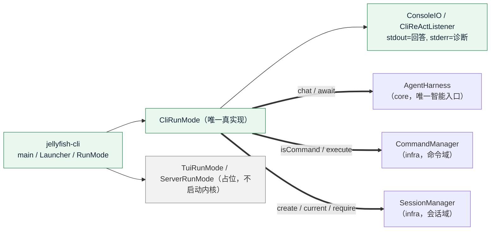

# CLI 外壳落地方案（含三种启动模式口径）

> 状态：**口径已全部裁决**（M1～M3 三模式定义、C1～C4、T1～T4、S1～S6、D1～D6），见 §10 裁决记录；
> **本轮只实现 `-cli` 单次模式**，`-tui` / `-server` 只落占位（口径先记进本文档，实现另开轮）。
> 范围：交付 `jellyfish-cli` 的 `main` / 启动参数解析 / 启动模式分发 / CLI 单次执行 / 输出与诊断分流 / 日志落 stderr / 可执行 jar 打包 / 单测 / 文档同步。
> **不动** `jellyfish-api` / `jellyfish-infra` / `jellyfish-core` 的任何生产代码——本轮唯一的例外是给 `JellyfishComponent` 加一个 `sessionManager()` getter，那属于 `jellyfish-cli` 自己的 DI 面。
> 顺序（已裁决）：**CLI → TUI → Server**。

---

## 0. 三种启动模式的定义（本轮统一口径）

三种模式是**同一个进程的三种外壳**，共享同一个 `JellyfishApplication` 入口、同一份 Dagger 装配、同一个 `AgentHarness` 门面，只靠启动参数区分。区别在「谁来驱动 ReAct 回合」与「结果往哪里去」。

| 模式 | 形态 | 交互 | 运行示例 | 实现依赖 | 本轮 |
| --- | --- | --- | --- | --- | --- |
| `-cli` | **单次调用**：进一个输入，出一次结果，进程退出 | 无 | `jellyfish -cli -p "今天天气怎么样？"` | 纯 JDK | **落地** |
| `-tui` | **交互式终端界面** | 有 | `jellyfish -tui` | TamboUI（+ JLine 3 后端） | 占位 |
| `-server` | **HTTP 服务**，对外暴露能力接口给第三方 Web | 无（服务化） | `jellyfish -server 9096` | Undertow | 占位 |

### 0.1 `-cli`：单次调用、不交互

- **入口**：`-p/--print <prompt>` 给输入；无 `-p` 时从 **stdin 读到 EOF**（管道与「手敲完按 Ctrl+D」两种都覆盖，Unix 风格）。
- **会话**：进程级**临时会话**，每次进程新建，用完即丢（会话持久化未落地，见 §8 L1）。
- **输出**：回答走 **stdout**（流式增量）；诊断、工具进度、错误走 **stderr**（见 §3.4）。
- **命令**：输入以 `/` 开头时走命令域（`jellyfish -cli -p "/help"`），否则走 LLM——与交互外壳同一套分流判据（`CommandManager.isCommand`）。
- **退出**：给完结果即退出；退出码见 §3.2。
- **不提供**：提示符、主循环、`/exit`、历史、补全（那是 `-tui` 的活）。

### 0.2 `-tui`：命令行界面、有交互、TamboUI 实现

- **入口**：`jellyfish -tui`，无位置参数。
- **形态**：交互式终端界面，用 TamboUI 构建；退出由界面内的退出动作触发。
- **与内核的关系**：与 CLI 完全一致——同一份 `AgentHarness.chat`、同一份 `CommandManager`、同一个「每轮现读当前会话」的规则；差别只在渲染层与输入循环。
- **本轮不动**：只保留 `TuiRunMode` 占位，打一行「尚未实现，请用 -cli」到 stderr，退出码 5，**不启动内核**。
- **开工前必须先冒烟**：TamboUI 目前只有 **snapshot 构建**且官方标注 experimental；先验证 JDK 1.8 下 `tamboui-tui` + `tamboui-jline3-backend` 能编译运行，再谈界面（见 §9 R2）。

### 0.3 `-server`：HTTP 服务、Undertow、自定义端口

- **入口**：`jellyfish -server 9096`（端口为位置参数，同时支持 `--port 9096`）；缺省端口 `9096`。
- **绑定**：默认只绑 `127.0.0.1`（安全默认），要对外需要显式 `--host 0.0.0.0`。
- **对外能力（本轮只记口径，不实现）**：REST + SSE——`POST /sessions` 建会话、`GET /sessions` 列表、`GET /sessions/{id}` 概要、`POST /sessions/{id}/chat`（SSE 流式）、`POST /sessions/{id}/commands`（命令，含 `isCommand` 分流语义）、`GET /commands`（结构化清单，供前端做菜单）、`DELETE /sessions/{id}`。选 SSE 是因为 `ReActListener` 本就是流式回调，映射天然。
- **鉴权**：本轮口径为「无鉴权 + 默认只绑 localhost」；API key / token 单开一轮。
- **不带**自带 Web 前端，纯接口。
- **依赖坑（已查证）**：parent `pom.xml` 里已声明的 `undertow.version = 2.4.3.Final` **不可用**——Undertow **2.3.0 起最低要求 Java 11，并已迁到 `jakarta.*`**；本项目是 JDK 1.8 + `javax.*`，Server 轮必须改用 **2.2.x 线的最后一个版本（`2.2.39.Final`）**。
- **本轮不动**：只保留 `ServerRunMode` 占位，打一行「尚未实现，请用 -cli」到 stderr，退出码 5，**不启动内核**。

### 0.4 模式与模块的演进约定

- 三种模式**同属 `jellyfish-cli`**：`main` / 参数解析 / `Launcher` / 模式分发 / DI 装配都在这里。
- **开工 TUI 时抽 `jellyfish-tui`，开工 Server 时抽 `jellyfish-server`**（沿 AGENTS.md「等真正开工再抽模块」的口径）。届时 `jellyfish-cli` 只多两条依赖，`Launcher` 与参数解析**零改动**——这正是本轮把 `RunMode` 抽成接口的目的。
- 三种模式都不允许绕开 `AgentHarness.chat`（唯一智能入口）与 `CommandManager`（唯一命令入口）。

---

## 1. 现状基线（实测）

- `jellyfish-cli` 只有 `di/` 九个类：`JellyfishComponent` + 八个 Module。**没有 `main`、没有 `Launcher`、没有 `mode/` 实现**（`mode/` 是空目录），也没有任何生产代码调用 `AgentHarness.chat`。
- `jellyfish-cli/pom.xml` 依赖 api / infra / core / dagger，**没有 slf4j binding**：`infra` 的 `slf4j-api` 在运行期解析不到实现，全仓库的 `LOG.warn / LOG.error`（配置告警、权限审计、命令域 WARN）**目前全部是 NOP**。
- `jellyfish-cli/pom.xml` **没有 shade 配置**，`mvn package` 产出的是不可直接运行的薄 jar。
- `JellyfishComponent` 已暴露 `agentHarness()` / `commandManager()` / `modelManager()` / `permissionManager()` / `runtimeConfig()` / `llmClientFactory()`，**未暴露 `SessionManager`**。
- 内核侧接缝已就绪，本轮不需要任何新能力：
  - 智能入口：`AgentHarness.chat(sessionId, userInput, listener)` → `ReActTurn`（`await()` / `cancel()` / `isDone()`）。
  - 流式回调：`ReActListener` 的 7 个默认方法，**全部回调在同一 `react` 线程**。
  - 命令入口：`CommandManager.isCommand(input)` / `execute(input, sessionId)` / `execute(name, args, sessionId)` / `commands()` / `renderHelp()`；结果三态 `CommandResult.Kind`（`OK` / `ERROR` / `UNKNOWN`），`isError()` 可用于选输出流。
  - 会话入口：`SessionManager.create(agentId, provider, model, mode)` / `createDefault()` / `current()` / `switchTo(id)` / `require(id)` / `bindAgent` / `switchModel` / `setPermissionMode`。
  - 生命周期：`AgentHarness.bootstrap()` / `shutdown()`，且 `shutdown()` 的四个收敛步骤**都已幂等**（`ReActLooper.close` → `shutdownNow`；`SystemCommands.close` 清空即止；`PF4JPluginManager.close` 内有 `manager == null` 早退；`EventChannel.close` 内有 `closed` 早退），因此「shutdown hook + finally」双调用安全。
  - 启动顺序已固定：`eventChannel.start()` → 注册核心命令 → `runtimeConfig.refresh()` → 模型 / agent 索引 → 插件配置刷新 → `pluginManager.bootstrap()`。
- `/help`、`/session`、`/status`、`/usage`、`/todo`、`/model`（无参）、`/agent`（无参）**都不需要模型配置**，因此 CLI 的端到端冒烟可以**离线**做（不需要 apiKey）。

---

## 2. 目标态

### 2.1 依赖边（本轮新增）



**本轮只有「外壳 → 内核」的调用，没有反向边**：CLI 不注册任何扩展点、不发任何事件、不碰注册表。内核不知道外壳存在。

### 2.2 包结构与文件清单

```
jellyfish-cli/src/main/java/zcd/jellyfish/cli/
├── JellyfishApplication.java       # 【新】main：解析参数 → Launcher → System.exit(code)
├── Launcher.java                   # 【新】装配 RunMode + 生命周期（bootstrap / shutdown hook / finally）
├── StartupOptions.java             # 【新】启动参数值对象（不可变，含 Mode 枚举）
├── StartupOptionsParser.java       # 【新】手写参数解析（零新依赖）
├── ExitCodes.java                  # 【新】退出码常量 + 私有构造器
├── SessionBootstrap.java           # 【新】启动期会话保证（现读当前会话 / --session / --agent……）
├── console/
│   ├── ConsoleIO.java              # 【新】输入输出抽象（可测的关键）
│   ├── SystemConsoleIO.java        # 【新】System.in / out / err 实现
│   └── CliReActListener.java       # 【新】ReActListener 的 CLI 渲染（stdout / stderr 分流）
├── mode/
│   ├── RunMode.java                # 【新】模式接口
│   ├── CliRunMode.java             # 【新】单次执行（唯一真实现）
│   ├── TuiRunMode.java             # 【新】占位
│   └── ServerRunMode.java          # 【新】占位
└── di/
    ├── JellyfishComponent.java     # 【改】新增 sessionManager() getter（配套更新类注释）
    └── ...（其余 Module 不动）

jellyfish-cli/src/main/resources/
├── config.json                     # 不动
└── log4j2.xml                      # 【新】root=WARN，Console appender target=SYSTEM_ERR

jellyfish-cli/src/test/java/zcd/jellyfish/cli/
├── StartupOptionsParserTest.java   # 【新】
├── SessionBootstrapTest.java       # 【新】
├── LauncherTest.java               # 【新】
├── console/CliReActListenerTest.java # 【新】
└── mode/CliRunModeTest.java        # 【新】

pom.xml（parent）
└── pluginManagement 新增 maven-shade-plugin；dependencyManagement 新增 log4j-slf4j-impl（已在管理内）
jellyfish-cli/pom.xml
└── 新增 log4j-slf4j-impl 依赖 + shade 执行
```

**为什么不建独立模块**：AGENTS.md 已定「TUI / Server 先不建模块，等真正开工再抽」。本轮只有 CLI 一个真实现，抽模块只会多一层空壳。

**为什么 `console/` 单独一个包**：CLI 的所有副作用只有「读一行 / 写一段」这一种。把它抽成接口，`CliRunMode` 的全部分支（`-p` / stdin / 命令分流 / 命令三态 / 回合失败 / 截断）都能用内存实现测，不去 mock `System.out`。

---

## 3. 设计细节

### 3.1 启动参数（`StartupOptions` + `StartupOptionsParser`）

```java
/** 启动模式。 */
public enum Mode { CLI, TUI, SERVER }

/** 启动参数（不可变）。 */
public final class StartupOptions {
    private final Mode mode;                    // 模式，必填（无模式参数即用法错误）
    private final String prompt;                // -p/--print，可为 null（null = 读 stdin 到 EOF）
    private final String sessionId;             // --session，可为 null
    private final String agentId;               // --agent，可为 null
    private final String provider;              // --model 拆出的 provider，可为 null
    private final String model;                 // --model 拆出的 model，可为 null
    private final PermissionMode permissionMode;// --mode，可为 null（按 NORMAL）
    private final int port;                     // -server 端口（CLI / TUI 忽略）
    private final String host;                  // -server 绑定地址（CLI / TUI 忽略）
    private final boolean showThinking;         // --show-thinking
    private final boolean verbose;              // --verbose
    private final boolean help;                 // -h/--help
    private final boolean version;              // -V/--version
}
```

| 参数 | 形态 | 说明 |
| --- | --- | --- |
| `-cli` / `-tui` / `-server` | 模式旗标，三选一且必须给 | `-server` 可带位置端口：`-server 9096` |
| `-p` / `--print <prompt>` | 取值 | 仅 CLI 模式有意义；缺省则读 stdin 到 EOF |
| `--port <n>` | 取值 | `-server` 的等价写法；与位置端口同时给且不一致 → 用法错误 |
| `--host <addr>` | 取值 | 缺省 `127.0.0.1` |
| `--session <id>` | 取值 | 切到已有会话；不存在 → 用法错误（见 D4） |
| `--agent <id>` | 取值 | 新建会话时绑定 |
| `--model <provider/model>` | 取值 | **必须是 `provider/model` 形式**（见 D5） |
| `--mode <plan\|normal>` | 取值 | 新建会话的权限模式（大小写不敏感，仅对这两个值） |
| `--show-thinking` | 开关 | 思考过程打到 stderr（缺省丢弃） |
| `--verbose` | 开关 | 日志级别降到 DEBUG |
| `-h` / `--help` | 开关 | 打印用法退 0 |
| `-V` / `--version` | 开关 | 打印版本退 0 |

解析规则（`StartupOptionsParser`，纯静态方法、无状态）：

- **不引 picocli / JLine**：参数表就这十几个，手写解析零新依赖，也不给 Java 8 添变量（D1）。
- **不猜模式**：`args` 里没有模式旗标 → 用法错误（`-h` / `-V` 例外）。刻意不做「默认 CLI」，避免「敲 `jellyfish` 却阻塞在 stdin」这种歧义。
- **未知参数、缺值、非法值**（端口非数字 / 越界、`--model` 缺 `/`、`--mode` 非法值、给 CLI 模式传 `--port`）→ 一律抛 `JellyfishException`，由 `main` 打印用法 + 错误行后退 **2**。
- **解析结果不依赖任何内核对象**，可独立单测。

### 3.2 生命周期与退出码（`JellyfishApplication` / `Launcher` / `ExitCodes`）

```java
/** 退出码。 */
public final class ExitCodes {
    public static final int OK = 0;               // 正常结束
    public static final int USAGE_ERROR = 2;      // 参数 / 用法错误
    public static final int STARTUP_ERROR = 3;    // bootstrap 失败（配置、插件、DI）
    public static final int RUNTIME_ERROR = 4;    // 回合失败，或命令返回 ERROR
    public static final int NOT_IMPLEMENTED = 5;  // -tui / -server 尚未实现
    public static final int TRUNCATED = 6;        // 回合达最大轮次未收敛
}
```

```java
public final class JellyfishApplication {
    public static void main(String[] args) {
        // 1. 解析参数（失败 → stderr 用法 + 退 2）
        // 2. --help / --version 就地返回（不建 DI、不起内核）
        // 3. new Launcher(DaggerJellyfishComponent.create()).launch(options)
        // 4. System.exit(code)
    }
}
```

```java
public final class Launcher {
    public int launch(StartupOptions options) {
        RunMode mode = modeFor(options);
        if (!mode.isImplemented()) {              // TUI / SERVER
            return mode.run(options);             // 占位：打未实现 + 退 5，不启动内核
        }
        AgentHarness harness = component.agentHarness();
        Thread hook = new Thread(harness::shutdown, "jellyfish-shutdown");
        Runtime.getRuntime().addShutdownHook(hook);
        try {
            try { harness.bootstrap(); }
            catch (JellyfishException e) { return ExitCodes.STARTUP_ERROR; }        // 3：内核没起成
            try { /* SessionBootstrap.ensureCurrentSession */ }
            catch (JellyfishException e) { return ExitCodes.USAGE_ERROR; }         // 2：参数不可满足
            try { return mode.run(options); }
            catch (JellyfishException e) { return ExitCodes.RUNTIME_ERROR; }        // 4：跑挂了
        } finally {
            removeShutdownHook(hook);             // 幂等；hook 里可能已调过
            harness.shutdown();
        }
    }

    /** 模式选择：本轮 CLI 返回真实现，TUI / Server 返回占位。包级可见，便于单测断言。 */
    RunMode modeFor(StartupOptions options) { ... }
}
```

> **落地修正**：原方案只有一个 `catch`（把三者都报成启动失败 3）。实际分成三段后，「`--session` 指向不存在的会话」才能正确地报用法错误 2——否则脚本分不清「配置错了」与「参数写错了」。

要点：

1. **占位模式不启动内核**：`-tui` / `-server` 直接返回 5，既不建会话、也不加载插件、也不起事件线程——避免「看起来启动了其实什么都做不了」。
2. **shutdown 双保险**：`addShutdownHook` 覆盖 Ctrl+C / `kill`，`finally` 覆盖正常路径；两侧都会调 `harness.shutdown()`，靠内核已有的幂等保证安全（§1 已核）。
3. **Ctrl+C 语义**：**整体退出**，不实现「第一次取消回合、第二次退出」——后者要 `sun.misc.Signal`（JDK 内部 API，sonar 不认）。进程退出时 `reActLooper.close()` 会 `shutdownNow` 掉进行中的回合，行为可解释（见 §8 L3）。
4. **退出码是机器契约**：脚本据此判成败，故 `-tui` / `-server` 返回 5 而不是 0。
5. **`--version` 取值**：优先读 jar manifest 的 `Implementation-Version`（`Package.getImplementationVersion()`），为 `null` 时回退常量 `"development"`。刻意**不**为版本号引入资源过滤（那会把 `${}` 过滤规则扩散到 `config.json`，与 `SettingsBinder` 的环境变量语法打架）。

### 3.3 CLI 单次执行流水（`CliRunMode`）

```java
public final class CliRunMode implements RunMode {
    CliRunMode(AgentHarness harness, CommandManager commands, SessionManager sessions, ConsoleIO console);

    @Override
    public int run(StartupOptions options) {
        // 1. 取输入：-p 优先；否则读 stdin 到 EOF
        String input = options.getPrompt() != null ? options.getPrompt() : console.readAll();
        if (StringUtils.isBlank(input)) {                 // 空输入 → 用法错误
            console.printErr("没有输入：用 -p 指定，或从 stdin 传入。交互请用 -tui。");
            return ExitCodes.USAGE_ERROR;
        }
        // 2. 现读当前会话（不缓存）：/new /resume 之后立刻生效，规则与 TUI 一致
        String sessionId = currentSessionId();
        // 3. 命令 / LLM 分流：判据只有一个（isCommand，不查注册表）
        if (commands.isCommand(input)) {
            return runCommand(commands.execute(input, sessionId));
        }
        // 4. 一次 ReAct 回合：流式渲染交给 listener，await 拿终态
        return runTurn(harness.chat(sessionId, input, new CliReActListener(console, options.isShowThinking())));
    }
}
```

`runCommand`：

| `CommandResult.Kind` | 去向 | 退出码 |
| --- | --- | --- |
| `OK` | stdout（无输出则不打） | 0 |
| `UNKNOWN` | stdout（文案里已含「输入 /help」提示） | 0（用户输入错，不是程序失败） |
| `ERROR` | stderr，前缀 `错误：` | 4 |

`UNKNOWN` 给 0 是刻意的：它是「没这条命令」的人为输入错误，与「程序执行失败」不是一类；TUI 下它也不会中断交互。

`runTurn`：

| 终态 | 输出 | 退出码 |
| --- | --- | --- |
| `completed` | 回答已在 stdout 流式打完 | 0 |
| `truncated` | stdout 保留可读提示（`ReActResult.content`）+ stderr 一行警告 | 6 |
| `cancelled` | stderr 一行「已取消」（单次模式理论上不可达，防御性处理） | 4 |
| 抛 `JellyfishException` | `onError` 已打 stderr，这里再补退出码 | 4 |

### 3.4 输出与诊断分流（`ConsoleIO` / `CliReActListener`）

```java
/** 外壳的输入输出面；抽成接口后 CLI 的全部行为都能用内存实现测。 */
public interface ConsoleIO {
    String readAll();              // 读 stdin 到 EOF（CLI 单次模式）
    void writeOut(String text);    // stdout：回答与命令结果，原样不换行（流式增量）
    void writeErr(String text);    // stderr：思考过程这类流式诊断，原样不换行
    void writeErrLine(String line);// stderr：工具进度 / 错误 / 占位提示，整行自动换行
}
```

> **落地修正**：原方案里的 `readLine(String prompt)` 已删除——保留「无 TUI 库的纯文本 REPL」与已裁决的 T4（不保留降级形态）直接矛盾，且单次模式用不到它，留着就是永远不执行的假接口。
> **落地修正**：原方案的 `printErr` 拆成了 `writeErr`（流式，不换行）与 `writeErrLine`（整行）——思考过程是增量回调，逐块加换行会把一句话打成十几行。

| `ReActListener` 事件 | 去向 | 形态 |
| --- | --- | --- |
| `onText(delta)` | **stdout** | 原样增量写出（模型给什么写什么），每次 flush |
| `onThinking(delta)` | stderr | 缺省**丢弃**；`--show-thinking` 时以 `· ` 前缀逐行写 |
| `onToolCallStarted(id, name)` | stderr | `→ <name>` |
| `onToolCallCompleted(id, name, ok, out)` | stderr | `← <name> ok|failed（<out 长度> 字符）`——**不打全文**，避免刷屏 |
| `onComplete(result)` | stdout / stderr | 回答未以换行收尾则补一个换行到 stdout；`truncated` 时 stderr 一行警告 |
| `onError(t)` | stderr | `回合失败：<message>` |
| `onCancelled()` | stderr | `已取消` |

**「回答走 stdout、诊断走 stderr」是本轮最重要的一条契约**：它让 `jellyfish -cli -p "..." > answer.txt` 拿到干净回答、`2> log.txt` 拿到诊断，也让这个外壳第一次真正具备「可被脚本使用」的属性（D3）。

**工具输出只报状态与长度**：工具结果可能上万字符，终端里毫无意义；需要看内容时用插件自己的日志。

### 3.5 会话（`SessionBootstrap`）

```java
/** 启动期保证「有一个当前会话」，并把 --agent / --model / --mode 落到新建会话上。 */
public final class SessionBootstrap {
    /** 保证当前会话存在；返回当前会话。 */
    Session ensureCurrentSession(StartupOptions options);
}
```

规则与顺序：

1. `--session` 给了 → `sessions.switchTo(id)`；**不存在则抛 `JellyfishException`**（→ 退 2）。刻意不静默新建——用户明确点名了一个会话，静默换一个是最坏的体验（D4）。
2. 否则若 `sessions.current() != null` → 直接用它（本轮单进程只会有一个，但规则对 TUI/Server 同样成立）。
3. 否则 → `sessions.create(agentId, provider, model, permissionMode)` + `switchTo(...)`；无 `--agent` 时传 `null`，由 `SessionManager` 走 `resolveDefault()`（「一个 agent 都没配」是合法状态，不能因此失败）。
4. `--model` 必须是 `provider/model`：解析后**先用 `ModelManager.resolve(provider, model)` 校验存在性**，不存在则退 2 并提示可用 `/model` 查看（fail-fast，而不是等到第一次 LLM 调用才炸）。
5. 单次模式下每次进程都是新会话，因此 `--session` **实际只在 TUI / Server 轮有用**；本轮保留解析与报错语义，让参数面先稳定下来。

### 3.6 日志（`log4j2.xml`）

- `jellyfish-cli` 补 `log4j-slf4j-impl`（版本已在 parent `dependencyManagement` 内，`log4j2.version = 2.25.4`）。
- `log4j2.xml`：单个 Console appender，**`target="SYSTEM_ERR"`**，root level 由系统属性决定：

```xml
<Configuration>
  <Properties>
    <Property name="logLevel">${sys:jellyfish.log.level:-WARN}</Property>
  </Properties>
  <Appenders>
    <Console name="Stderr" target="SYSTEM_ERR">
      <PatternLayout pattern="%d{HH:mm:ss.SSS} %-5level %logger{36} - %msg%n"/>
    </Console>
  </Appenders>
  <Loggers>
    <Root level="${logLevel}"><AppenderRef ref="Stderr"/></Root>
  </Loggers>
</Configuration>
```

- `--verbose` → 在 `main` 里、**任何日志调用之前** `System.setProperty("jellyfish.log.level", "DEBUG")`；也支持直接 `-Djellyfish.log.level=DEBUG`。
- **不引入 `log4j-core` 的编程 API**（避免为了改级别把 log4j2 实现类编进业务代码），级别只走这个系统属性。
- 文件日志（`~/.jellyfish/logs` + 轮转）留到后续轮：那是目录约定与运维话题，不混进本轮。

### 3.7 打包（shade）

`jellyfish-cli/pom.xml` 新增 `maven-shade-plugin`（`pluginManagement` 放版本）：

- `ManifestResourceTransformer`：`Main-Class: zcd.jellyfish.cli.JellyfishApplication`。
- `ServicesResourceTransformer`：保留 `META-INF/services`（OkHttp / Jackson / PF4J 都靠它）。
- 过滤 `META-INF/*.SF|*.DSA|*.RSA`（避免签名残留导致启动失败）。
- `createDependencyReducedPom = true`。
- 产物：`jellyfish-cli/target/jellyfish-cli-0.0.1-SNAPSHOT.jar` 可直接 `java -jar`。
- **风险点**：log4j2 的 `Log4j2Plugins.dat` 在多 jar 合并时可能被丢，导致日志配置失效（见 §9 R1）；实现时用官方 `log4j-transform-maven-shade-plugin` 的 plugin cache transformer，若该插件在 JDK 8 下不可用则退化为「先验证 `Log4j2Plugins.dat` 是否完整保留」，不成立再换方案。

### 3.8 明确不做的事

- 不做交互式 REPL、不做提示符、不做 `/exit`（CLI 单次模式天然没有）。
- 不做补全、历史、高亮、语法着色（command 方案 L5 已记为外壳遗留，归 `-tui` 轮）。
- 不做流式输出的 Markdown 渲染 / 代码块高亮（终端能力与依赖都不在本轮）。
- 不实现 `-tui` / `-server` 的任何行为。
- 不新增任何配置段（参数是启动期输入，不进 `config.json`）。
- 不改内核代码（唯一例外是 `JellyfishComponent` 加 `sessionManager()`）。
- 不发任何命令审计事件（架构图无此边，command 方案 L7）。

---

## 4. `AGENTS.md` / `README.md` 同步清单

### 4.1 `AGENTS.md`

| 位置 | 改动 |
| --- | --- |
| 架构图 `CLI` 节点 | 措辞改为「`main` / `Launcher` / 模式分发（`-cli` 已落地单次模式；`-tui` / `-server` 占位）+ Dagger 装配」 |
| 代码结构 `jellyfish-cli` 树 | 补 `StartupOptions` / `StartupOptionsParser` / `ExitCodes` / `SessionBootstrap` / `console/` / `mode/` 四类文件 |
| 架构要点 | 新增「**三种启动模式与三种外壳**」一条：CLI 单次 / TUI 交互 / Server HTTP 的口径、演进顺序、以及「三种模式都必须走 `AgentHarness.chat` 与 `CommandManager`」 |
| 架构要点 | 新增「**CLI 模式的输出契约**」一条：stdout＝回答与命令结果，stderr＝诊断与进度，日志也走 stderr；退出码是机器契约 |
| 依赖表 | `jellyfish-cli` 行补「shade 打包可执行 jar」 |
| 已知遗留 | 「无 CLI / TUI / Server 外壳」改为「CLI 单次模式已落地；TUI（TamboUI）与 Server（Undertow）待落地」 |

### 4.2 `README.md`

- 新增「运行」段：`mvn -o clean package` → `java -jar jellyfish-cli/target/jellyfish-cli-0.0.1-SNAPSHOT.jar -cli -p "..."`。
- 参数表（§3.1 全表）+ 退出码表（§3.2）+ 三个示例（`-h`、`-cli -p "/help"`、`echo "/session" | ... -cli`）。
- 说明「stdout 是回答、stderr 是诊断」。

### 4.3 其他文档

| 文档 | 改动 |
| --- | --- |
| `react方案.md` §8 L1 | 标注「**已由 CLI 外壳轮闭环**（`-cli` 单次模式）；TUI / Server 另开轮」 |
| `command方案.md` §9 L9 | 同上标注：系统命令已有真实调用点（`CliRunMode` 的命令分流） |
| `permission方案.md` L5 | 不改：人工审批仍待落地，但补一句「CLI 单次模式无交互，无法承载审批」 |

---

## 5. 测试计划

| 测试类 | 用例 |
| --- | --- |
| `StartupOptionsParserTest` | ① 三模式旗标解析；② 无模式旗标 → 抛；③ `-p` 取值、缺值 → 抛；④ `-server 9096` 位置端口；⑤ `--port` 与位置端口一致 / 不一致 → 抛；⑥ 端口非数字 / ≤0 / >65535 → 抛；⑦ `--model a/b` 拆分；⑧ `--model` 无 `/` → 抛；⑨ `--mode plan/normal/PLAN`；⑩ `--mode` 非法 → 抛；⑪ `--agent` / `--session`；⑫ `--show-thinking` / `--verbose`；⑬ `-h` / `--help`；⑭ `-V` / `--version`；⑮ 未知参数 → 抛；⑯ 给 CLI 模式传 `--port` → 抛；⑰ `-h` 与模式旗标缺失共存时不报错（帮助优先） |
| `SessionBootstrapTest` | ① 无当前会话 → `create` + `switchTo`；② 有当前会话且无覆盖参数 → 不动；③ `--session` → `switchTo`，不存在 → 抛；④ `--agent` / `--mode` 透传进 `create`；⑤ `--model` 不存在 → 抛；⑥ 无 agent 配置时不失败（`agentId = null` 是合法状态） |
| `CliReActListenerTest` | ① `onText` → stdout 无额外字符；② thinking 缺省丢弃；③ `--show-thinking` → stderr 且带前缀；④ 工具开始 / 结束 → stderr 单行且**不含工具输出全文**；⑤ `onComplete` 未换行则补换行；⑥ `truncated` → stderr 警告；⑦ `onError` → stderr；⑧ `onCancelled` → stderr |
| `CliRunModeTest` | ① `-p` 非命令 → 调 `chat` 且 `await`；② `-p` 命令 → 调 `execute` 且**不**调 `chat`；③ 命令 `OK` → 0；④ 命令 `ERROR` → 4 且打 stderr；⑤ 命令 `UNKNOWN` → 0；⑥ 空输入 → 2；⑦ 无 `-p` → 读 `console.readAll()`；⑧ 回合抛 `JellyfishException` → 4；⑨ `truncated` → 6；⑩ 每轮取到的是 `sessions.current()` 的最新会话（`/new` 语义） |
| `LauncherTest` | ① `-cli` → 走 `bootstrap` + `mode.run` + `shutdown`；② `-tui` / `-server` → 返回 5 **且不调 `bootstrap`**；③ `bootstrap` 抛 `JellyfishException` → 返回 3 且仍调 `shutdown`；④ `modeFor` 返回正确实现类（`instanceof` 断言）；⑤ 模式实现抛 `RuntimeException` → 仍 `shutdown` |

**测试约束**：JUnit5 + Mockito，`@ExtendWith(MockitoExtension.class)`；`ConsoleIO` 用内存实现（不 mock 接口）；不断言真实 `System.out`；不启动 Dagger、不读真实配置、不访问网络。

---

## 6. 实施阶段（每阶段结束都可编译、可测试）

| 阶段 | 内容 | 完成判据 |
| --- | --- | --- |
| P1 | `ExitCodes` + `StartupOptions` + `StartupOptionsParser` + `StartupOptionsParserTest` | 解析用例全绿，零新依赖 |
| P2 | `ConsoleIO` + `SystemConsoleIO` + `CliReActListener` + `CliReActListenerTest` | 分流契约（stdout / stderr）被测试钉住 |
| P3 | `SessionBootstrap` + `CliRunMode` + 两个测试类 | CLI 全部分支（输入、命令三态、回合三态、退出码）覆盖 |
| P4 | `RunMode` + `TuiRunMode` / `ServerRunMode` + `Launcher` + `JellyfishApplication` + `JellyfishComponent.sessionManager()` + `LauncherTest` | Dagger 编译通过；模式分发与生命周期幂等被测试钉住 |
| P5 | `log4j2.xml` + shade 打包 + `README.md` / `AGENTS.md` / 三份方案文档同步 + 全量回归 + 手工冒烟 | `mvn -o clean package` 全绿；冒烟清单（§7）逐条通过 |

---

## 7. 验收标准

1. `mvn -o clean package` 全绿，产出可直接运行的 `jellyfish-cli-0.0.1-SNAPSHOT.jar`。
2. `java -jar ... -h` → 用法到 stdout，退 0；`-V` → 版本，退 0。
3. `java -jar ... -tui` / `-server 9096` → 「尚未实现，请用 -cli」到 stderr，退 5，**无内核启动日志**。
4. `java -jar ... -cli -p "/help"` → 命令清单到 stdout，退 0（**无需任何模型配置，离线可验**）。
5. `java -jar ... -cli -p "/session"` → 会话列表到 stdout，退 0；`/new` 后 `current()` 语义正确。
6. `echo "/usage" | java -jar ... -cli` → 从 stdin 读到输入并执行，退 0。
7. `java -jar ... -cli -p "/nosuch"` → `UNKNOWN` 文案到 stdout、退 0；`-cli -p ""` → 退 2。
8. 配好 `models.json` + apiKey 后：`java -jar ... -cli -p "你好" > out.txt 2> err.txt` → `out.txt` 只有回答（流式），`err.txt` 只有诊断与日志；`out.txt` 中**不出现**任何日志行。
9. `--verbose` 后 stderr 出现 DEBUG 日志；不加时只有 WARN 及以上。
10. 现有测试全绿（api / infra / core / cli），JaCoCo 不下降。
11. 所有新增类 / 接口 / 成员变量有文档注释，类注释带 `@author zcd`，方法注释含 `@param` / `@return`，注释解释「为什么」。
12. `AGENTS.md` / `README.md` / 三份方案文档同步完毕，无「外壳未落地」的过期措辞。

---

## 8. 已知限制与后续 TODO

| # | 限制 | 影响 | 后续 |
| --- | --- | --- | --- |
| L1 | 无会话持久化 | `-cli` 每次进程都是新会话；`--session` 实际不可用 | 持久化轮（同步扩展点 + 插件） |
| L2 | 无 TUI / Server | 交互与服务化能力缺失 | 按 CLI → TUI → Server 顺序另开轮 |
| L3 | Ctrl+C 只能整体退出，不能「只取消当前回合」 | 流式回答中途 Ctrl+C 会连进程一起结束 | 若真需要，用 JLine 的信号能力在 TUI 轮一并解决（避免 `sun.misc.Signal` 内部 API） |
| L4 | 无补全 / 历史 / Markdown 渲染 | 终端体验朴素 | `-tui` 轮 |
| L5 | 单次模式每次都要重新加载配置与插件 | 冷启动有开销（PF4J 扫描 + HTTP 客户端建池） | 需要脚本批量调用时再考虑常驻模式 |
| L6 | 无命令审计事件 | 无法从事件通道审计「谁执行了什么命令」 | command 方案 L7，架构图无此边 |
| L7 | 未用 `AppConfig.processName` | 用法文本里的程序名是常量 | 若将来要多入口共用进程名再接线 |
| L8 | 人工审批通道仍未落地 | CLI 单次模式无交互，天然无法承载审批；`ASK` 继续降级为 `DENY` | 审批轮（依赖交互外壳，TUI） |

代码内 TODO 落点：`TuiRunMode` / `ServerRunMode` 的类注释（实现要点与前置条件）、`ConsoleIO.readLine`（TUI 轮若无 TUI 库的降级形态）、`Launcher` 的占位分支注释。

---

## 9. 风险与缓解

| # | 风险 | 缓解 |
| --- | --- | --- |
| R1 | shade 合并后 `Log4j2Plugins.dat` 丢失 → 日志配置失效（静默无日志） | 用官方 plugin cache transformer；P5 冒烟**必须**验证「`--verbose` 能看见 DEBUG 日志」「默认看不见 INFO」，而不是只看编译通过 |
| R2 | TamboUI 只有 snapshot 且标注 experimental；示例是 Java 17+ 风格 | 口径：TUI 轮**第一件事**是在 JDK 1.8 下冒烟 `tamboui-tui` + `tamboui-jline3-backend`；不通过则换 Lanterna 或 JLine 3 手写。本轮不受影响（占位） |
| R3 | `undertow.version = 2.4.3.Final` 与 JDK 1.8 / `javax` 不兼容 | 已查证：2.3.0 起要求 Java 11 且迁到 `jakarta.*`；Server 轮改用 `2.2.39.Final`。本轮不受影响（占位） |
| R4 | stdout 与 stderr 都指向同一终端时，流式回答与诊断行可能视觉交错 | 已知并接受：需要干净输出时按 §3.4 重定向；诊断行都短且带前缀，可读 |
| R5 | `System.setProperty("jellyfish.log.level")` 必须在首次日志之前设置，否则不生效 | 放在 `main` 解析参数后、任何 `LOG` 调用前；`Launcher` 内不做静态初始化日志；P5 冒烟覆盖 |
| R6 | 参数面过早固化，TUI / Server 轮要改 | 参数表按三种模式统一设计（`--session` / `--model` / `--agent` / `--mode` 都是模式无关的），`--port` / `--host` 已为 Server 预留；解析器无状态，扩展只加字段 |
| R7 | CLI 直连 `SessionManager` / `CommandManager`，将来 TUI 复制一份分流逻辑 | 分流判据只有 `CommandManager.isCommand` 一处，规则（现读当前会话、命令副作用回写会话域）写进 `AGENTS.md`，TUI 轮复用同一份约束 |

---

## 10. 裁决记录

### 10.1 三种模式口径（本轮确认）

| # | 事项 | 结论 |
| --- | --- | --- |
| M1 | `-cli` | **单次调用、不交互**，`jellyfish -cli -p "..."`；无 `-p` 时读 stdin 到 EOF |
| M2 | `-tui` | **命令行界面、有交互**，TamboUI 实现，`jellyfish -tui` |
| M3 | `-server` | **HTTP 服务**，Undertow 实现，`jellyfish -server 9096`（端口可自定义） |

### 10.2 本轮范围与顺序

| # | 事项 | 结论 |
| --- | --- | --- |
| M4 | 本轮实现范围 | **只实现 `-cli`**；三模式定义记进本文档；`-tui` / `-server` 只落占位 |
| M5 | 实现顺序 | **CLI → TUI → Server**（已裁决） |
| M6 | 模块划分 | 本轮不建新模块；TUI 轮抽 `jellyfish-tui`，Server 轮抽 `jellyfish-server` |

### 10.3 CLI 模式细节（原 C1～C4）

| # | 事项 | 结论 |
| --- | --- | --- |
| C1 | `-p` 缺省 | 读 **stdin 到 EOF**（覆盖管道与「手敲 + Ctrl+D」）；两者都空 → 退 2 |
| C2 | 单次模式是否认命令 | **认**，复用 `CommandManager.isCommand` 分流 |
| C3 | 输出 | 回答流式到 **stdout**；诊断 / 工具进度 / 错误到 **stderr**；回合失败退 4 |
| C4 | 会话 | 进程级临时会话，新建即用，退出即丢 |

### 10.4 TUI / Server 口径（原 T1～T4、S1～S6，本轮不实现）

| # | 事项 | 结论 |
| --- | --- | --- |
| T1 | 是否三模式同轮做 | **否**，一轮一个模式；本轮只 CLI |
| T2 | TUI 界面形态 | 对话式为主：消息滚动区 + 输入框 + 状态栏；会话列表 / 待办用命令文本输出，不单开面板 |
| T3 | TamboUI snapshot 风险 | 接受，但 TUI 轮先冒烟；不通过则换 Lanterna 或 JLine 3 |
| T4 | 是否保留「无 TUI 库的纯文本 REPL」 | **不保留**：CLI 单次 + stdin 已覆盖脚本场景，降级形态是重复维护 |
| S1 | 端口与绑定 | `-server 9096` 位置参数 + `--port`；缺省 `9096`；缺省只绑 `127.0.0.1`，`--host 0.0.0.0` 显式放开 |
| S2 | 接口协议 | **REST + SSE**（`ReActListener` 天然映射流式） |
| S3 | 接口集合 | `POST /sessions`、`GET /sessions`、`GET /sessions/{id}`、`POST /sessions/{id}/chat`（SSE）、`POST /sessions/{id}/commands`、`GET /commands`、`DELETE /sessions/{id}` |
| S4 | 鉴权 | 本轮口径：无鉴权 + 只绑 localhost；API key / token 单开一轮 |
| S5 | 自带前端 | **不带**，纯接口 |
| S6 | 模块与依赖 | Server 轮抽 `jellyfish-server`，Undertow 用 `2.2.39.Final`（Java 8 + `javax` 线） |

### 10.5 本轮新增裁决（细化时发现）

| # | 事项 | 结论 | 理由 |
| --- | --- | --- | --- |
| D1 | 是否引 picocli / JLine | **不引**，手写解析 | 参数表只有十几个，零新依赖优于表达力 |
| D2 | `-v` 冲突 | `-V/--version` + `--verbose` | 原推荐里 `-v` 同时表示两者，实现前必须消歧 |
| D3 | stdout / stderr 契约 | 回答与命令结果 → stdout；诊断 / 进度 / 日志 → stderr | 让 `-cli` 真正可被脚本使用（`> answer.txt` 干净） |
| D4 | `--session` 不存在时 | **报错退 2**，不静默新建 | 用户点名了会话，静默换一个是最坏体验；同时诚实反映「无持久化」的现状 |
| D5 | `--model` 形式 | **必须 `provider/model`**；裸模型名报错并提示 `/model` | 避免在 CLI 里复制「按模型名反查 provider」的逻辑（该逻辑现在只在 `SystemCommands` 里） |
| D6 | 占位模式是否启动内核 | **不启动**，直接退 5 | 避免「看起来起来了却什么都做不了」，也不白起插件与事件线程 |

---

## 11. 落地记录（P1～P5 完成）

| 阶段 | 内容 | 结果 |
| --- | --- | --- |
| P1 | `ExitCodes` + `StartupOptions`（builder 风格）+ `StartupOptionsParser` + `StartupOptionsParserTest` | 完成；解析用例 51 个全绿，零新依赖 |
| P2 | `ConsoleIO` + `SystemConsoleIO` + `CliReActListener` + 两个测试类 | 完成；分流契约（stdout / stderr）被 32 个用例钉住 |
| P3 | `RunMode` + `SessionBootstrap` + `CliRunMode` + 两个测试类 | 完成；输入来源 / 命令三态 / 回合三态 / 退出码全覆盖 |
| P4 | `TuiRunMode` / `ServerRunMode` 占位 + `Launcher` + `JellyfishApplication` + `JellyfishComponent.sessionManager()` + 两个测试类 | 完成；Dagger 编译通过，模式分发与生命周期被钉住 |
| P5 | `log4j2.xml` + `log4j-slf4j-impl` / `log4j-core` + shade 可执行 jar + `README` / `AGENTS.md` / 三份方案文档同步 + 全量回归 + 手工冒烟 | 完成；可执行 jar 端到端跑通（见下） |

### 11.1 落地时对方案的五处修正（已同步进本文档正文）

| # | 方案原样 | 实际落地 | 原因 |
| --- | --- | --- | --- |
| 1 | `ConsoleIO.readLine(prompt)` | **删除** | 与 T4「不保留纯文本 REPL」直接矛盾，且单次模式用不到——留下就是永不执行的假接口 |
| 2 | `ConsoleIO.printErr(line)` | 拆成 `writeErr`（流式）/ `writeErrLine`（整行） | 思考过程是增量回调，逐块加换行会把一句话打成十几行 |
| 3 | `Launcher` 单一 `catch` → 退 3 | **三段 classify**：bootstrap → 3、会话准备 → 2、mode.run → 4 | `--session` 指向不存在的会话是**参数错误**（2），报成启动失败会让脚本误判 |
| 4 | 参数里 `-v/--version` | `-V/--version` + `--verbose`（已记 D2） | 消歧 |
| 5 | 模型校验只查「存在」 | `--model` **必须 `provider/model`**，且会话不存在时给中文理由 | 避免在 CLI 复制「按模型名反查 provider」的逻辑；会话不持久化这点必须写进提示语 |

### 11.2 测试补充（超出 §5 的测试计划）

| 测试类 | 为什么加 |
| --- | --- |
| `SystemConsoleIOTest` | `readAll` 到 EOF、三个流的写法、失败包装都是副作用面，值得单独钉住 |
| `JellyfishApplicationTest` | 只覆盖不触碰内核装配的三条路径：参数错误 / 帮助 / 版本 |
| `RecordingConsoleIO`（测试支撑） | 手写记录器优于 `verify(System.out)`；与 infra 的 `LlmClientTestSupport` 同属测试支撑类 |
| `SessionTestSupport`（测试支撑） | `Session` 是 final 且构造器包级可见，只能经真实 `SessionManager` 造出真会话；同时避免把聚合根 mock 成假对象（`LauncherTest` 还依赖「`switchTo` 之后 `current()` 真的变了」这条接线行为） |

### 11.3 端到端冒烟（可执行 jar，离线可验部分全部通过）

| # | 命令 | 结果 |
| --- | --- | --- |
| 1 | `java -jar … -h` / `-V` | 用法 / `jellyfish 0.0.1-SNAPSHOT` 到 stdout，退 0 |
| 2 | `java -jar … -tui` / `-server 9096` | 「尚未实现，请使用 -cli」到 stderr，退 5，**无内核启动日志** |
| 3 | `java -jar … -cli -p "/help"` | 10 条命令清单到 stdout，退 0（**无需模型配置**） |
| 4 | `echo "/session" \| java -jar … -cli` | 会话列表到 stdout，退 0；`2> err.txt` 里只有 PF4J 的一条 WARN |
| 5 | `-cli -p "/nosuch"` | `UNKNOWN` 文案到 stdout，退 0 |
| 6 | `-cli -p "   "` | 「没有输入」到 stderr，退 2 |
| 7 | `-cli --port 9096 -p x` / 无模式旗标 | 用法错误到 stderr，退 2 |
| 8 | `-cli --session nope -p x` | 中文理由 + **无栈**，退 2 |
| 9 | `-cli --agent ghost` / `--model openai/gpt-4o`（未配模型） | 中文理由 + 指路命令，退 2 |
| 10 | `-cli --verbose -p "/status"` | DEBUG 日志出现（证明 `applyVerbosity` 早于日志初始化）；不加时只有 WARN |
| 11 | `-cli -p "你好"`（未配模型） | 「回合失败：no provider with model configured」到 stderr，退 4 |

**R1（shade 丢 `Log4j2Plugins.dat`）未发生**：jar 内 `META-INF/org/apache/logging/log4j/core/config/plugins/Log4j2Plugins.dat` 完整保留（只有 log4j-core 一个贡献者），因此不需要引入 plugin cache transformer。

### 11.4 仍需你在配好 apiKey 后验证的一条

验收标准 §7-8（`-cli -p "你好" > out.txt 2> err.txt`，stdout 只有回答、stderr 只有诊断）需要真实模型配置。
仓库 `config.json` 的路径默认为空，开着就能跑命令；要真跑一轮对话按 `README.md` 的「想真跑一轮对话」三步走即可。
