# 架构与设计决策

本文面向**维护者与想深挖实现的读者**：讲清「为什么是这个形态」。**安装、配置与日常用法**见根目录的 [README.md](../README.md)，
逐配置项的解释见 [configuration.md](configuration.md)，HTTP 接口细节见 [server-api.md](server-api.md)。

代码层面的硬规则（不变量、踩过的坑、改动时的注意事项）在仓库根目录的 [AGENTS.md](../AGENTS.md)，本文不重复。

## 模块划分与依赖方向

Maven 多模块，根 `jellyfish`（`zcd:jellyfish:0.0.1-SNAPSHOT`）是 `packaging=pom` 的聚合与父 POM。依赖方向单向，禁止反向或循环：

```
jellyfish-api（插件 SPI + 扩展点/事件模型 + 统一异常，无实现依赖）
      ↑
jellyfish-infra（基础设施层：注册表、扩展、事件通道、插件运行时、配置加载、指标）
      ↑
jellyfish-core（应用层：ReAct 循环与 AgentHarness 门面、提示词组装、压缩机制、系统命令、子代理委派）
      ↑
jellyfish-tui（TUI 外壳）  jellyfish-server（HTTP 外壳）  →  jellyfish-cli（入口 + DI 装配 + 模式分发 + shade 可执行 jar）
```

| 模块 | 职责 |
| --- | --- |
| `jellyfish-api` | 插件作者唯一的稳定契约：SPI、扩展点/事件模型、统一异常 |
| `jellyfish-infra` | 基础设施层全部实现（会话 / agent / 模型 / 权限 / 插件运行时 / 命令域 / UI / 指标 / 配置） |
| `jellyfish-core` | 应用层：ReAct 循环与 `AgentHarness` 门面、提示词组装、压缩机制、系统命令、子代理委派 |
| `jellyfish-tui` | TUI 外壳：TamboUI 界面、视图投影与滚动、TUI 版可靠 lane 订阅者（`TuiTurnListener`） |
| `jellyfish-server` | HTTP 外壳：Undertow 上的 REST + SSE、会话按 id 寻址、HTTP 化人工审批 |
| `jellyfish-cli` | `main`、参数解析、模式分发、Dagger 装配、shade 可执行 jar |

**官方插件已拆分到独立仓库**（`Jellyfish-Plugins`），与内核之间没有编译期依赖：由 `PF4JPluginManager` 运行时从
`config.json` 的 `plugins.roots` 加载，因此不在上面的依赖链里。跨语言桥接运行时（原 `jellyfish-script`）也随桥接插件走，
它把该运行时连同 Jackson、Apache Commons Exec **shade 进自己的插件包**，因此本仓库的 classpath 上不出现任何跨语言代码。

**三种启动模式共享同一个入口与同一份装配，只靠启动参数区分**——`-cli` / `-tui` / `-server` 的差异只落在
「谁来消费可靠 lane 的事件与命令结果」这一层，内核行为完全一致。**分流顺序（命令判定 → 输入改写 → 输入指令 → 起回合）
已经收归内核的 `ConversationService.submit`**，外壳只声明自己的 `SubmissionPolicy` 并处理判别式结果；
**回合事件也走内核的可靠 lane（`ShellStreams`）**，外壳只做订阅者
（见 [design/kernel-conversation-runtime.md](design/kernel-conversation-runtime.md)）：这两条此前都在三个外壳各写一份，
并已漂移出「`!` 只有 TUI 有」「命令谓词两套」两个问题。这也是内核与外壳之间保持中立的理由：命令域、输入指令解析、
提交排序、回合事件发布都在内核侧（对外壳中立），外壳只负责呈现与输入采集。

## 扩展层：四条通道，各管一件事

扩展点是内核与插件之间**唯一的边界**。它们被刻意分开，因为每一类的失败语义根本不同：

| 通道 | 形态 | 用途 |
| --- | --- | --- |
| 同步扩展点（`ExtensionRegistry`） | 有返回值、同步派发、**不可丢弃** | 工具、**工具参数改写与结果整形**、**生命周期钩子（压缩前 / 会话关闭前 / 会话分支前 / 回合开始前）**、命令、提示词贡献、回合上下文、权限拦截、会话持久化 / 恢复、压缩策略、**请求调优**、**老化策略**、UI 贡献、输入指令、**输入改写**、**厂商注册与模型目录发现**、**工具激活**、**工具行渲染提示**、**快捷键贡献** |
| 异步事件通道（`EventChannel`） | `void`、异步派发、**可丢弃** | 轮次与会话等通知、可观测性（含**缓存前缀断裂**） |
| 动作入站队列（`ActionQueue`） | 插件主动投递、内核在安全点排空、结果**轮询**取得 | 插件发起的用户消息、压缩、切换会话模型、分支会话、重建工具清单 |
| 外壳贡献信箱（`ShellIngress`） | 插件主动投递、**外壳自己**来取、结果**扁平枚举**回报 | `NOTICE`（临时通知）、`INVALIDATED`（内容脏了） |

**可丢与不可丢不能合成一条路**：一次工具调用没有返回值就是功能坏了，而一条统计通知丢了只是少一个数字。合成之后
「这条通知到底能不能丢」会变成一个需要逐条判断的字段，而判断错了要么拖慢主链路（把通知按同步等待处理），
要么悄悄丢功能（把有返回值的调用丢进队列）。

**同样地，内核回合事件与插件贡献也不能合成一条**：前者不可丢、有序、单来源；后者可丢、可合并、多来源。
两条路共用一套订阅形状（`ShellStreams` 上的 `subscribe` / `subscribeShell`），但**可丢性挂在通道上**，
一眼可辨。合成之后「插件不能伪造内核事件」就只剩运行时校验（origin 标签），而现在它是**类型上的不可能**：
`PluginContext` 上没有任何方法能写可靠 lane，`ShellIngress` 只接 `ShellContribution`。

**动作队列与贡献信箱也不是事件通道**：它们都没有订阅、没有广播、没有 handler 注册，只有一条有界的单向队列。
它们的存在只回答一件事：**插件能不能主动发起事情**——在它们之前插件只能当能力提供者，做不了工作流参与者
（检查点、handoff、自动提交）。硬约束是它们**不产生同步环**：投递只入队，结果分别由插件轮询 `ActionHandle`
与看 `ShellContributionStatus` 取得，内核永远不在完成时回头调插件。

**动作只投进正在跑的顶层回合，内核不自己起回合**：这个内核里「一次 `chat` 调用 = 一个回合」，
回合的边界由外壳决定。让内核自己起一个回合，会让外壳不知道发生了什么事——它在途状态、取消入口、
输入互斥与并发写历史会一起变坏。因此没有在途回合时入队当场失败，而不是默默开一个新回合；
子代理（嵌套）回合同样不开窗，插件也没有任何中止回合或召回已投行动作的入口
（边界细则见 [constraints/extensions.md](constraints/extensions.md) 的「插件动作的能力边界」）。

权限只能收紧不能放宽：插件拦截是三态（`ABSTAIN` / `ASK` / `DENY`），**没有 `ALLOW`**。内核**不持有任何「模式」概念**：
「只读运行」「先出计划再动手」这类按模式收窄的授权，是插件用同一个类型级扩展点（`PermissionCheckRequest`）表达的
一条普通拦截——官方 `jellyfish-plugin-plan` 就是这么做的（`plugins.configurations.jellyfish-plan.readOnlyTools`
即「用户说哪些工具在它开启时可用」）。早先这一层由内核自己实现，并允许工具提供方在描述符里自称只读、与用户配置取并集——
那让名单**只增不减**、判定权还落在提供方手里（MCP 那一侧的提供方甚至是不受信的外部进程），因此该字段与内核那一层都已整个移除。
代价是**不装那个插件就没有这类模式**，而装了之后也**开箱为空**：没配任何名字时它拒掉全部工具，这是刻意的
（「用户没表态」与「用户不准」在白名单语义下是同一件事）。

**缓存相关的两个扩展点只开放「旋钮」，不开放「内容」**：`RequestTuningRequest` 的结果类型只有缓存路由键、
保留策略、断点数三个字段，`AgingStrategyRequest` 只给两个阈值与 stub 文案——两者的返回类型里**都没有**
`systemPrompt` / `messages` / `tools` / `model` 这类字段，插件在编译期即无法改写请求内容。理由：prompt 缓存是
前缀匹配，而「前缀不变」是**全局**性质，取决于所有组装决策的合取，任何一处被改坏整条前缀就作废（详见
[design/llm-cache.md](design/llm-cache.md)）。因此这类能力只能由内核独占。

**工具的两个改写点各自只开放一个方向**：`ToolArgumentPreRequest` 只给「换成另一份参数 / 拒绝」
（没有「放行」那一态），`ToolResultPostRequest` 只给「换输出 / 换元数据」（没有「拒绝」那一态——
工具已经跑完，此时拒绝只会让结果凭空消失）。两者的位置是硬的：参数改写**在权限判定之前**
（否则出现「审批看到 A、执行的是 B」），结果整形**在截断之前**（否则信封与落盘文件永久分叉）。

**插件拿不到会话与工作目录**，只拿得到 `PluginContext`（handle / contribute / observe / emit，
以及 `runtimeInfo()` 这份**进程级事实**快照：外壳种类、有无交互界面、是否具备审批通道、有无终端）；
工具的相对路径按进程工作目录解析。这是「插件是一条扩展线，不是一个可以到处伸手的进程内脚本」的落地方式。
`runtimeInfo()` 里的 `supportsApproval` 是**静态**语义（外壳具不具备审批通道），不表示此刻有人在线，
插件只能用做降级决策，不能用做安全判定。

**三个生命周期钩子开放的是「要不要做」而不是「怎么做」**（`CompactionPreRequest` / `SessionBeforeCloseRequest` /
`TurnBeforeRequest`）：它们各自只能 `cancel`（拦下）或调一个小旋钮（保留条数 / 换输入文本），
而「怎么压」「怎么存」「怎么跑」全留内核。三者的调用点都从「不花钱、不可逆之前」选：
压缩在摘要请求发出之前，关闭在最后一次落盘之前，回合在追加用户消息之前。
其中只有「用户主动关闭会话」的否决会被采纳——进程收尾与内部收尾不允许被插件拖住。

**输入侧有两个相邻但不同的扩展点**：`InputTransformRequest` 管<b>任意文本改写 / 短路</b>（不认标记），
`InputDirectiveRequest` 管<b>标记式语法</b>（`!` / `@`，标记就是路由键）。两者分成两个服务
（`InputTransforms` 与 `InputDirectives`），不合成一个——合成会让「这条输入谁说了算」
变成一个需要判别的字段。输入改写的位置同样是硬的：<b>命令判定之后、指令解析之前、建会话之前</b>。

**模型与厂商可插拔**：内核只认「厂商无关的请求 → 厂商格式的 HTTP」这一层契约（`api/llm` 的
`LlmTransport` 与七个值类型），插件据此接管 `models.json` 里 `type` 指向的新类型；`LlmRequest` 这些
随厂商演化的模型留在 infra，由 `PluginLlmClientAdapter` 一层翻译。**内核自带 type 不可被插件覆盖**——
传输请求里带的是已解析好的 apiKey，一个能顶替 `openai` 的插件等于把用户的密钥转发出去。
模型目录可由插件动态发现（`ModelCatalogRequest`，按 provider 名问），但 `models.json` 仍是唯一持久事实。

**会话扩展条目与分支**：插件与内核都能在会话上挂自己的命名空间下的状态条目（不再需要伪装成一次工具调用），
也能从某一点分出一条并列的新会话。**「哪一类会话」由 `SessionKind` 判定**（`NORMAL` / `EPHEMERAL` / `FORKED`），
`parentSessionId` 降级为追溯信息——两者合一曾让分支会话被误判成子代理会话，而不落盘是静默的数据丢失。
fork 不复制 token 用量，压缩摘要按「边界是否落在复制范围内」取舍。

**回合内插入的消息必须并入下一条 `user` 消息，不能另起一条**：`STEER` 的插入点上，会话里最后几条是
`assistant(tool_use)` + `tool`，而 Anthropic 要求 user / assistant 交替——另起一条会被直接拒绝。
因此 `ClaudeLlmClient` 的映射把「紧跟工具结果的用户文本」并进那条 `user` 消息，
作为 `tool_result` 块之后的 `text` 块。

## 工具结果的信封与元数据

工具结果超过 `react.maxToolOutputChars` 时**不从中间切断**：完整内容先落盘，回灌给模型的是一段合法 JSON 信封，
内含 `_truncated`、原始大小、`_path` 与 `preview`（结构化结果是截断后的子树，纯文本是截断后的字符串）。

- **预览取头 30% + 尾 70%**，并写明省略了多少行、多少字符——结论往往在末尾，只留头会让模型看到「一切正常的前 90%」。
- **`_path` 只在保留窗口内有效**：清理上限一旦被触到就从最旧的文件开始删，因此几十轮之前那个路径可能已经不在了。
  这不是缺陷——文件是运行产物，引用计数式保留会让落盘与会话历史互相耦合。要长期留用的内容请在它还在时另存一份。
- **元数据与文本同源**：命令行的退出码与终止原因既出现在回灌文本的首行（给模型读），也作为字段随会话与 SSE 一起走
  （给界面与审计读），因此不会出现「文本说成功、字段说失败」。元数据随工具结果消息落进会话文件，重启后警告标记仍在。
  前端**据字段渲染失败标记，不要去解析 `output` 的首行文案**——那行措辞是给模型看的，改一个词标记就会消失。
- **`read_file` 遇到「单行就超过 `max_bytes`」会报错而不是切短**：切短会产出一行看起来完整、实际残缺的内容，
  而模型无从判断自己拿到的是不是全文。多行累加超预算仍然是正常分页（内容还在文件里，可按 `offset` 续读）。
- 内核这层兜底之外，**工具自身也默认限流**（`read_file` 的 `max_bytes`、`list_dir` 的 `limit`/`offset`、
  `grep_files` 的 `max_line_chars`/`max_bytes`），让绝大多数调用根本用不到兜底。

逐字段的配置说明见 [configuration.md](configuration.md#工具结果与落盘)。

## 权限与审批

优先级是 `deniedTools` > `askTools` > `allowedTools`。`askTools` 里的工具每次调用都要人工审批，三种外壳的处理不同：

| 外壳 | 行为 |
| --- | --- |
| `-tui` | 弹出审批选择框（`↑`/`↓` 选，`Enter` 确认，`Esc` 拒绝并中断回合） |
| `-server` | 把待审批项推进 SSE 流（`approval_required`），由 `POST /approvals/{requestId}` 裁决 |
| `-cli` | 没有审批界面（也没有审批者），**一律按拒绝处理**——绝不静默放行 |

- **`Esc` 是「拒绝并中断回合」**，不是只拒绝：只拒绝的话，模型往往会换个方式接着试。
- **审批框等不到答复按拒绝处理**，缺省 120 秒（`permission.approvalTimeoutSeconds`）。它有缺省值而不允许「永不超时」——
  审批请求发生在 `react` 线程上并被同步等待，一个永远不来的答复就是一条永远不返回的线程。
- **审批缺省按会话多槽位**：每个会话一个头槽位，会话之间互不排队；同一会话内仍是单槽位 + FIFO 队列 + 缺省 120 秒超时。

## 压缩上下文（`/compact`）

长会话的每一轮都要把整段历史重新发给模型，token 花得越来越多。压缩多花**一次**调用把更早的对话压成一份摘要，
之后每次请求只带摘要 + 最近若干条原文。

**前提**：压缩由插件提供策略（摘要指令 + 参数）。没有启用 `jellyfish-compact`（或同类插件）时，压缩整体不可用——
`/compact` 会直接告诉你，自动压缩也不生效。摘要指令本身是一份资源文件，随**插件**发布（`summary-prompt.md`，在插件 jar
根目录），不是硬编码在内核的代码里。**插件只回答「这一次该怎么压」**——摘要指令与两个数量参数；读消息、选范围、
发模型调用、推进边界、记用量全部由内核负责，插件拿不到任何一条消息正文。

四条口径值得记牢：

- **历史一条不删**。压缩是非破坏式的：屏幕上的会话、`/resume`、落盘的那份文件都还是完整历史，变的只是「发给模型的
  那条链路从哪里开始」。因此不会有「压完就再也看不到原文」这种事。
- **可以反复压**。每次只压「上次边界之后新积累的那一段」；上一份摘要不必再单独拼一遍——自 P2b 起它是消息区里的
  一条合成消息，本来就在待发的上下文里。会话里因此始终只有一块摘要、边界只会向后移（滚动摘要）；已压过的那段不会再花一次钱。
- **摘要调用复用当前上下文**（cache-safe fork）。发出去的不是「渲染后的全文」，而是**父请求的真前缀 + 一条追加指令**，
  因此整段对话按缓存命中价计费，只有指令那几十个 token 是新的。前缀必须逐字节相同，所以它切的是父请求自己的字节、
  原样带上工具清单、并用 `tool_choice: none` 关掉工具调用；三条缺一条这次调用就退回到全价。
  **这是省钱的关锤**：原先那次调用从第 0 个 token 就分叉，而它恰恰发生在会话最长的时候。
- **一次压完；只有 fork 造不出来时才丢最旧的**。待压范围在父请求里时就一条不丢。唯一会退到「从最旧侧丢弃」的是
  「机械裁剪已经把待压范围吞掉」那种现场——那时 fork 出来的前缀会缺一段、摘要将毫无依据，于是回退到把该段渲染成正文
  发出去（按全价，但摘要正确）。**被丢弃的那一段既不在摘要里，也不会再发给模型**：它是真正消失的数据，所以完成提示会
  写明「另有 N 条……未纳入摘要且不再发送」。`/compact preview` 会先把这件事、以及本次花的是哪一种钱算给你看。
- **摘要是一条每次现算的出站合成消息，不是 system prompt 里的一块**。它排在压缩边界之后、被保留历史之前，
  **不落盘**——落盘就会每轮重复 append，越聊越像一份不断膨胀的假历史，屏幕投影与 `/resume` 也会跟着多出一条
  谁都没说过的话。它不留在 system prompt，是为了让那里**在整个会话里逐字节恒定**：system prompt 站在缓存前缀的
  第 0 个 token，它一变后面全部内容都要按未命中价重发。**这一改动不提升命中率**（摘要只在压缩时变，两种排法的
  分叉点是同一个位置，推导见 `docs/design/llm-cache.md` §4.3），换来的是那条不变量。
- **摘要以 `user` 角色送出，紧随其后的消息也是 `user` 时并入其中**：`system` 角色不行——Claude 与 Gemini 会把
  消息列表里的 system 消息上提回顶层 system prompt（`collectSystemPrompt`，有测试锁定），等于什么都没搬；
  而 Anthropic 又拒绝连续的 `user` 消息。并入只改出站内容，不动会话（与 `ToolResultAger` 同一口径）。

压缩调用的 token 计入会话用量（`/usage` 看得到）。`/status` 会显示「已压缩 N 条更早消息（丢弃 M 条）」，TUI 状态栏也会追加
`已压缩 N 条（丢弃 M 条）`；压缩期间状态栏显示 `压缩中…`，完成后在消息流里贴一条结果提示（失败也一样贴，并带上原因）。

## 子代理委派（`task`）

模型可以把一段自足的子任务**委派给另一个 agent** 去做，只拿回它的最终结论。这个能力是**内核自带的**，不需要额外装插件；
它由 `agents.json` 里标了 `delegatable: true` 的 agent 提供。

**子代理与主会话除了那段任务之外相互隔离**：它看不到本次对话的历史、你读过哪些文件、主会话用的是哪个模型。它拿到的
只有三样——它自己那份 `{agentId}.md` 提示词、项目约定（`AGENTS.md`）、以及模型写的那段 `task.prompt`。

代价与收益是同一件事的两面：探索与实现产生的噪音留在子代理那边，主对话只多一行结论；反过来，「挑战我刚才的想法」
这类需要共享对话背景的用法，就只能靠模型把背景写进任务描述。

其他设计要点：

- **`allowedTools` 只随委派生效**：它决定子代理能看到哪些工具（执行时照旧受权限判定约束），主会话不受影响。
- **子代理不继承主会话的模型**：模型来自它自己的 `model` 字段，没配就落到 `models.json` 的全局默认。
- **它跑在自己的会话里，而那个会话不进会话体系**：不落盘、不进 `/session` 列表、不可 `resume`、不可 fork，
  进程退出也不会「恢复」出一堆子代理会话；但它花掉的 token **计入父会话**，生命周期事件带 `parentSessionId`
  供可观测性区分。让它不可 resume 是刻意的——续聊一个「只为了干一件窄活而存在」的会话没有语义。
- **每个 run 跑在自己的线程上，父回合等它但不占执行线程**：`task` 派生一个 run（`AgentRuntime.spawn`），
  run 在独立的 `agent-run` 池上跑，父回合 `await` 时让出并发许可；取消父回合会连着取消整棵 run 子树。
- **在跑的子代理看得见**：TUI 有一块「子代理」面板（`类型 · 状态 · 已运行 Ns`），由内核以 `owner=core`
  贡献；`-server` 的 SSE 客户端能收到 `run_started` / `run_finished`。两条路同源——都读运行时的 run 事实。
- **一次委派在磁盘上留下痕迹**：run 终结时把 run 身份、终态、轮数、用量与子会话的完整 transcript 写进
  `<toolOutput.dir>/subagent-runs/<runId>.json`（独立命名空间 + 独立配额，与工具输出的清理互不干扰）。
  它是可观测窗口而不是合规归档（最旧的会被清理）。
- **多个子代理可以共享一份工作列表**：装了 `jellyfish-todo` 时，父回合写计划、子代理用
  `todo_claim` / `todo_done` 认领与完成，读写的是**同一份**清单（键来自内核交给工具的 `parentSessionId`，
  子代理落在父会话上），面板上还能看到「谁在做」。插件的两个能力在这里正交地拼在一起：
  子代理来自内核，任务列表来自插件，两者互不认识——**跨能力的整合只走内核的中立面或模型**。
- **run 的生命周期对插件可见**：内核把 run 的开始与结束翻成 `AgentRunProgressEvent` 发到通知通道，
  插件据此把「谁在做」画到自己的界面上。这条通道**可丢**（异步通知），因此消费方自愈：
  展示层给条目设过期时限，而不是把丢失的结束事件变成永久的「正在跑」。
- **「回合被用户打断」同样是可见的**：`TurnRegistry.cancel` 取消到在途回合时广播 `TurnCancelledEvent`
  （带 `turnId`）。取消此前只在外壳的可靠 lane 上可见，而插件看不到那条通道；事件只报顶层回合的取消、
  只报一遍（连按取消键不会算重），子代理那侧的取消是父回合级联下来的一环，不单独上报。
- **递归有三道上限 + 一套预算**：`subAgent.maxDepth`（一条链多深）、`subAgent.maxSpawnsPerTurn`（一层扇出多少）
  与 `subAgent.maxConcurrentRuns`（全局同时在跑多少）——三者正交，只有其中一个都不够；再叠加
  单 run 墙钟 / 单 run token / 树 token 三个预算。子代理自己能不能再往下委派，取决于它的 `allowedTools` 里有没有 `task`。
- **子代理的报告正文不进屏幕**：它是一整篇长文，会作为工具结果回灌给模型；轨迹行上那句摘要就是「刚才那一行到底是什么事」的答案
  （`⎿ task · 子代理 scout · 3 轮 · 123456 tok`）。命令行模式同口径（走 stderr）：
  `← task 完成（26 字符） · 子代理 scout · 3 轮 · 123456 tok`。出问题时末尾再加一个警示标记，
  如 `⎿ task · 子代理 scout ⚠ REJECTED`（`⚠` 后面是原因）；token 是精确值，可与 `/usage` 里的数字直接对上。
- **委派被拒绝时**（类型写错、层数用尽、任务为空……）模型拿到的是同一段文本——它会换个参数重试，或者自己把活干了。

## TUI 的几处取舍

**发送是 `Ctrl+S` 而不是 `Enter`**：终端在 raw 模式下，`Shift+Enter`、`Alt+Enter`、CSI-u 等所有「带修饰的 Enter」编码
都无法被底层框架区分（一律解码成无修饰的 `Enter`），`Enter` 与 `\n` 也完全同形。因此「`Enter` 发送 + 修饰键换行」
在任何终端上都不可实现。反转之后 `Enter` 稳定换行，发送交给一个可稳定识别的组合键。

**思考过程默认折叠，且是全局开关**：模型返回的思考过程会随消息一起落进会话，但屏幕上默认只占一行。想读全文按 `Ctrl+T`
（或敲 `/thinking`）——这是一个**全局**开关：要么所有思考都展开，要么都折叠。屏幕上没有「选中某条消息」这种交互，
逐块展开只会换来一套选择态与焦点管理。

**只有助手正文按 markdown 渲染**：标题、列表、引用、代码块、行内代码、加粗 / 斜体 / 删除线、链接、分隔线都会渲染；
**表格画成网格**——按显示列量出每列宽度再排（`DisplayWidth` 按 East Asian Width 近似），格子放不下时在列内折行、
不按列截断；列数多到每列连 3 列内容都分不到时退回等宽代码块，此时不再假装是排好的表。少数宽度有歧义的码点
（带变体选择符的 emoji 等）仍可能让某张表错位一格，这是「按列对齐」的固有代价。**用户消息保持纯文本**
（用户打的多是自然语言，渲染收益低，还可能吞掉原文空白），工具轨迹不变。图片与 HTML 原样显示源码，不请求也不解释。

**滚轮可用，代价是终端选择被应用截走——两个出口**：滚轮事件要求应用捕获鼠标（`TuiConfig.mouseCapture(true)`，**默认开启**），
而捕获后终端的鼠标选择归应用——复制屏幕文本需按住修饰键（macOS 为 Option，而 Terminal.app 上的 Option 拖动是矩形选择，
实际等于没有）。想复制时按 `Ctrl+O`（或敲 `/mouse`）把鼠标交还终端：拖选与 `⌘C` 立刻可用，代价只是期间滚轮停用
（改用 `PageUp` / `PageDown` / `End`），复制完再按一下收回。这是一个运行期开关，不必重启、也不改变默认行为；
若整体不想要鼠标捕获，用 `-Djellyfish.tui.mouseCapture=false`。

**TUI 独占备用屏，因此没有 stdout 契约**（`> answer.txt` 不适用），退出后也不回显会话内容；日志改写到文件，
绝不写 stderr——否则会撕坏画面。启动前必须做终端前置检查（`System.console() == null` 判据），否则 TamboUI 会永久挂住；
逃生门 `-Djellyfish.tui.skipTerminalCheck=true`。

**插件不能自己布局界面**：它只能贡献渲染无关的数据（文本 + 语义强调档位），位置、宽度、行数全部由外壳决定——
状态栏片段按显示宽度拼接、并从最后一个起**整块丢弃**超宽的部分；面板的折行与行数上限由版式账本给出，插件无权把消息区挤没。

界面按**区域**组织，而一块区域同一时刻只显示一个贡献，因此两个插件抢同一位置时默认只显示 `order` 最小的那个，其余进入候选
（用 `/ui` 查看与切换）。界面窄于 80 列时左右侧栏自动隐藏；窄到放不下时面板会让位给消息区，而不是反过来。

外壳**不**每帧询问插件（那样空闲时也在反复调用处理器），只在失效时收集一次：会话切换、回合开始或结束、命令执行后、
插件加载卸载、以及插件自己发布 UI 失效事件。整体不要插件 UI 时用 `-Djellyfish.tui.pluginPanels=false`。

## 输入指令 `!` 与 `@`

两条都由插件提供（没装对应插件时它们只是一段普通文本），但语义差别很大：

- **`!命令` 复用模型调用完全相同的工具执行链路**（`ToolExecutor`），因此只读命令静默执行、其余照旧弹审批框，
  `Esc` 也能中断正在跑的命令。结果**作为一条 user 消息**落进会话而不是 tool 消息——这里没有模型回合，但下一次提问时
  模型看得到结果，这正是「手动跑一条命令再让模型解释」想要的效果。
- **`@路径` 只把路径写进消息，不内联文件内容**：读取由模型调用 `read_file` 完成（tools 插件会用一段 system prompt 约定
  告诉模型这件事）。因此大文件不会撑爆上下文，`read_file` 的 `max_bytes` 与权限判定照旧生效，也不存在新鲜度问题。

## 可观测性

进程退出时会往日志里打一份**健康检查**（模型 / 插件 / 事件通道 / 压缩）与一份**运行期指标汇总**（命令、工具、权限、会话、
压缩、事件通道队列等），用于事后排查。插件启停相关的计数（`plugin.started` / `plugin.stopped` / `plugin.failed` /
`plugin.stateChanges`）来自 `PluginStateChangedEvent`，它在插件启用 / 停止 / 卸载 / 启动失败时由插件运行时广播。

**指标只做程序化输出，没有 `/metrics` 命令**：一份只在退出时落盘的排查材料，不需要额外的暴露面与鉴权面；
`GET /health` 承担的是「服务活着吗」这一件事（见 [server-api.md](server-api.md)），不是指标出口。

### token 用量的口径（含缓存）

- **输入的口径是「总输入」**：`promptTokens` 含缓存命中与建缓存的部分，`cacheReadTokens` / `cacheWriteTokens`
  是它的**子集**。四家原本并不一致——OpenAI / DeepSeek / Gemini 的输入字段本就把缓存计入，
  Anthropic 的三个输入字段却是**互斥划分**（`input_tokens` 只计新增部分）。归一化在各自的
  `parseUsage` 里完成，因此消费方只需要一套公式。推导与原文出处见 `LlmUsage` 的类注释。
- **命中率按累计量现算**（累计命中 / 累计输入），不是把每次调用的命中率取平均——后者会让一次 3 token 的
  调用与一次 100000 token 的调用等权，于是命中率被大量无信息的小调用抬起来。
- **`/usage` 与 `/status` 给出「命中 / 输入（百分比）」**：两个数都给，因为比例给判断、绝对值给量级。
  命中数为 0 既可能是真没命中、也可能是厂商不上报；当前接入的四家在有缓存活动时都会带上这些字段。
- **两块用量快照都带缓存字段**：`SessionUsageSnapshot`（会话累计，随会话落盘，因此 `/resume` 之后
  命中率不归零）与 `TokenUsageSnapshot`（单次调用，随消息落盘，同时是下面那个通知的载荷）。
- **一次调用记完账会广播 `LlmCallCompletedEvent`**：它是「这台机器一共命中了多少缓存」唯一的来源——
  `/usage` 读的是会话状态，进程退出即消失。`MetricsSubscriber` 据此累加 `llm.calls`、
  `llm.promptTokens`、`llm.cacheReadTokens`、`llm.cacheWriteTokens`。两条边界：**不产生消息的调用
  （`/compact` 的摘要）也要发**，否则它在进程级彻底不可见；**合并子代理累计量的那条路径不发**，
  那份用量在子代理会话里已经逐次发过，再发一次会把子代理的账重复计入。
- **失败的调用会广播 `LlmCallFailedEvent`，两者互斥**：成功的调用没用量可言，反之亦然。
  事件带上**结构化的 HTTP 状态码**（`LlmHttpException` 携带它，因此不用去消息文本里正则匹配），
  订阅方据此区分「字段被拒该降级」与「限流该重试」——`isRejected()` 把这条判据固化在载荷上。
  它由 `SessionManager.publishCallFailure` 统一发出，回合 / 压缩 / 缓存保活三条路径共用同一个口径；
  **只包裹真正的那一次模型调用**，压缩过程中「边界消息不在会话里」这类内部错误不会被误报成端点拒了请求。
- **可缓存前缀的断裂会被观察、记日志并广播**：`CacheBreakWatcher` 对比同一会话相邻两轮的可缓存前缀，
  指出断在哪一层（system prompt / 工具清单 / 第几条消息起）。**日志内的 WARN 会节流，
  `CachePrefixChangedEvent` 不节流**：下一轮的前缀如果仍然与这一轮不连续，那就是又一次真实的缓存损失，
  计数型订阅方需要看到每一次。它只比较、不改请求，详见 `PromptAssembler.watchCacheBreak`。

## 整体架构图

内核模块、扩展层、外壳与外部依赖之间的调用关系（`==>` 同步调用；`-->` 内核内部调用；`-.->` 异步通知）。
模块级的依赖方向与包结构见 [AGENTS.md](../AGENTS.md) 的「仓库结构与模块边界」。

```mermaid
flowchart TB
    subgraph "AgentHarness<br>Agent运行时宿主"
        direction TB

        subgraph "应用层<br>ReAct核心智能"
            ReAct["ReAct Loop<br>思考 → 行动 → 观察"]
        end

        subgraph "基础设施层<br>Harness运行时环境"
            direction TB

            subgraph "内核模块<br>单向依赖 + 构造器注入"
                direction LR
                SessionMgr["SessionManager<br>会话 + 消息 + token + 当前态"]
                AgentMgr["AgentManager + AgentRegistry<br>Agent 定义与权限策略"]
                CommandMgr["CommandManager<br>解析 / 分发 / 清单（无状态，对外壳中立）"]
                InputMgr["InputDirectives<br>输入指令：! / @（外壳中立）"]
                ModelMgr["ModelManager<br>Provider/Model 注册与路由"]
                LLMClient["LLMClient<br>统一 LLM 调用抽象"]
                PermMgr["PermissionManager<br>核心策略 → 插件拦截"]
                SubAgentMgr["SubAgentLauncher + task 工具<br>子代理委派 + 嵌套回合"]
            end

            subgraph "扩展层<br>内核与插件唯一边界；底座 infra/registry"
                direction LR
                Registry["TypeRegistry<br>「类型 + 路由键」→ 有序 handler 集合"]
                ExtReg["ExtensionRegistry<br>同步派发 · 有返回值 · 不可丢弃"]
                EventCh["EventChannel<br>异步派发 · void · 可丢弃"]
                PluginMgr["PF4JPluginManager<br>插件加载 / 热部署"]
                PluginCtx["PluginContext<br>插件唯一入口"]
            end

            subgraph "支撑基础设施"
                direction LR
                Runtime["RuntimeConfig<br>配置解析/合并/注入（启动期）"]
                Reloader["ConfigReloader<br>/reload 触发，单飞不回滚"]
                Metrics["可观测性<br>MetricsRegistry / HealthCheck"]
            end
        end
    end

    subgraph "外壳入口·jellyfish-cli / jellyfish-tui"
        direction LR
        CLI["jellyfish-cli / jellyfish-tui / jellyfish-server<br>main · Launcher · RunMode · Dagger 装配<br>-cli / -tui / -server 已落地"]
    end

    subgraph "外部依赖·配置"
        direction LR
        Models["models.json<br>全局 + 项目"]
        Jelly["jellyfish.json<br>全局 + 项目"]
        Agents["agents.json + default-agent.json<br>+ {agentId}.md"]
    end

    subgraph "外部依赖·模型提供商"
        direction LR
        LLM["外部 LLM API<br>OpenAI/Azure/Ollama"]
    end

    subgraph "外部依赖·插件"
        direction LR
        Plugins["PF4J 插件（独立仓库 Jellyfish-Plugins）<br>tools / session-file / todo / project / compact / shell / skills / mcp<br>+ python / node 桥接（脚本进程由它承载）"]
    end

    %% ===================== 外壳入口：命令走用户输入，不走 LLM =====================
    CLI ==>|"命令原文 + sessionId"| CommandMgr
    CLI ==>|"命令名 + 参数 + sessionId"| CommandMgr
    CLI -->|"chat：唯一入口"| ReAct
    CLI -->|"! / @：解析 / 执行 / 补全"| InputMgr
    CommandMgr ==>|"CommandResult / 清单 / 帮助"| CLI

    %% ===================== 内核内部：接口 + 构造器注入（细实线） =====================
    ReAct -->|"消息 / 上下文 / 当前态 / token"| SessionMgr
    ReAct ==>|"beginTurn / flush：回合级落盘（不可丢）"| SessionMgr
    ReAct -->|"解析本次模型（SessionModelResolver）"| ModelMgr
    ReAct -->|"调用 LLM"| LLMClient
    ReAct -->|"同步权限检查"| PermMgr
    ReAct ==>|"task 工具 → 委派（派生 run）"| SubAgentMgr
    SubAgentMgr ==>|"AgentRuntime.spawn → 调度到 agent-run 池跑完这个 run；run 事件走 RunEventBus"| ReAct
    SubAgentMgr -->|"run 终结 → 归档（独立命名空间与配额）"| ToolOut["ToolOutputStore<br/>工具结果 / run 归档"]
    SubAgentMgr ==>|"owner=core 注册 task 工具 + 类型清单 + 运行面板"| ExtReg
    SubAgentMgr -->|"瞬时会话 / 用量归集到父会话"| SessionMgr
    SubAgentMgr -->|"工具清单过滤判据（与执行期同一份）"| PermMgr
    SubAgentMgr -->|"取子代理的偏好模型"| ModelMgr
    SessionMgr -->|"按 currentAgentId 取定义"| AgentMgr
    ModelMgr -->|"管理/创建/路由"| LLMClient
    LLMClient -->|"HTTP/API"| LLM

    %% ===================== 扩展层·同步派发：需要结果或必须完成（粗线） =====================
    ReAct ==>|"list：工具清单（LlmTool）"| ExtReg
    ReAct ==>|"ToolCallRequest（工具名 + 参数）"| ExtReg
    ReAct ==>|"PromptContributionRequest（进 system prompt）"| ExtReg
    ReAct ==>|"TurnContextRequest（拼进本轮 user 消息）"| ExtReg
    SessionMgr ==>|"会话持久化 / 恢复（不可丢）"| ExtReg
    InputMgr ==>|"ToolCallRequest（经 ToolExecutor：权限 + 截断唯一入口）"| ExtReg
    InputMgr ==>|"结果落 user 消息（不可丢）"| SessionMgr
    PermMgr ==>|"权限拦截（插件只能返回两态）"| ExtReg
    ExtReg ==>|"贡献结果"| ReAct

    %% ===================== 扩展层·通知：按角色开放，内核模块作为事件发布者（点线，无返回值） =====================
    ReAct -.->|"轮次开始 / 工具结果"| EventCh
    SessionMgr -.->|"会话创建 / 消息追加 / 关闭"| EventCh
    AgentMgr -.->|"AgentsLoadedEvent"| EventCh
    ModelMgr -.->|"ModelsLoadedEvent"| EventCh
    PermMgr -.->|"权限审计"| EventCh
    CommandMgr -.->|"命令审计（CommandExecutedEvent）"| EventCh
    EventCh -.->|"分发事件"| Metrics

    %% ===================== 扩展层内部：一份注册表 + 两种派发策略 =====================
    Registry -->|"同步策略：调用点内联，取返回值"| ExtReg
    Registry -->|"异步策略：有界队列，可丢弃"| EventCh
    PluginMgr -->|"加载 / 交付 PluginContext"| PluginCtx
    PluginMgr -.->|"PluginStateChangedEvent（启动 / 停止 / 失败）"| EventCh
    PluginCtx -->|"handle：工具 / 命令注册（描述符随 handler 存）"| ExtReg
    PluginCtx -->|"contribute：其它扩展点注册 / 按 pluginId 退订"| ExtReg
    PluginCtx -->|"observe / emit：按 pluginId 订阅与退订"| EventCh

    %% ===================== 命令域：handler 与描述符同落一份注册表，CommandManager 只做解析、分发与清单 =====================
    CommandMgr ==>|"handler(命令名) + invoke：共用分发路径"| ExtReg
    CommandMgr ==>|"descriptorBindings 取命令名 / 别名 / 帮助"| ExtReg

    %% ===================== 配置热更新：/reload 触发的一次性编排（非运行期总线） =====================
    Reloader -->|"重读配置 + 刷新快照"| Runtime
    Reloader ==>|"按差异启停 / 重启插件"| PluginMgr
    Reloader -.->|"ConfigReloadedEvent"| EventCh

    %% ===================== 边界 <-> 插件 =====================
    PluginCtx -->|"插件唯一入口"| Plugins
    ExtReg -->|"按类型 + 路由键有序分发"| Plugins
    EventCh -->|"按类型广播：有界队列，满则丢弃并记账"| Plugins
    Plugins -->|"handle / contribute / observe / emit"| PluginCtx

    %% ===================== RuntimeConfig 注入 =====================
    Runtime -->|"读取合并, 项目级优先"| Models
    Runtime -->|"读取合并, 项目级优先"| Jelly
    Runtime -->|"读取合并, 项目级优先"| Agents
    Runtime -->|"注入配置"| ModelMgr
    Runtime -->|"注入定义"| AgentMgr
    Runtime -->|"注入插件配置"| PluginMgr
    Runtime -->|"注入权限配置"| PermMgr
    Runtime -->|"注入事件配置"| EventCh

    classDef app fill:#E9F7EF,stroke:#2E8B57,color:#123
    classDef kernel fill:#E8F4FD,stroke:#2E6DA4,color:#123
    classDef extlayer fill:#FDF2E3,stroke:#C77B00,color:#123
    classDef support fill:#F2F2F2,stroke:#888,color:#333
    classDef ext fill:#FAFAFA,stroke:#AAA,color:#444

    class ReAct app
    class SessionMgr,AgentMgr,ModelMgr,LLMClient,PermMgr,SubAgentMgr,CommandMgr,InputMgr kernel
    class Registry,ExtReg,EventCh,PluginMgr,PluginCtx extlayer
    class Runtime,Reloader,Metrics support
    class LLM,Plugins,Jelly,Agents ext
```



> 图例：`==>` 同步调用；`-->` 内核内部调用；`-.->` 异步通知。

## 已知边界与后续项

三种外壳（`-cli` / `-tui` / `-server`）均已端到端落地，跨语言桥接的 Python / Node 实现与端到端测试随官方插件仓库走；
以下是**尚未做**或**明确不做**的部分，不要当成待办之外的现存 API。

- **脚本插件的能力档（不是「与 Java 插件同权」）**：`jellyfish-plugin-python` / `jellyfish-plugin-node` 把脚本目录
  暴露成标准插件，但**只覆盖一部分扩展点**——已打通 11 个（工具、命令、候选查询、提示词 / 状态栏 / 面板贡献、
  权限拦截、会话持久化三段、压缩策略）。「还没做」与「明确不做」写入插件仓库的
  `script/extension-points.json`（`in` / `planned` / `excluded` 三档），并由那里的 `ExtensionPointCoverageTest` 守着：
  内核新增扩展点而未分类会让插件仓库构建失败。这与「新增扩展点的公共约定」配套（见
  [constraints/extensions.md](constraints/extensions.md#新增扩展点的公共约定)）。
  - **已落地的脚本侧能力**：handler 可以是 async（Node；Python 的 HTTP 天然同步，无需改造）；
    逐脚本配置段 `plugins.configurations.<桥接插件>.scripts.<脚本 id>`，与 Java 插件同一条 `${ENV}` 插值通道；
    工具可返回带 `summary` / `terminal` 的元数据（轨迹行上的一句话与失败标记），并拿得到调用者身份
    （`parentSessionId` / `runId` / `rootRunId`）；取消令牌会中止在途脚本调用。
  - **明确不做的扩展点**：返回 Java 对象的（`ProviderRegistrationRequest` 要一个 `LlmTransport`，脚本给不了）、
    跑在渲染线程 / 启动期的（`ToolRenderHintRequest` / `InputReferenceRequest` / `ShortcutContributionRequest`）——
    脚本调用是一次可能冷启动的进程往返，这些位置不能付这个代价。
  - **已知边界**：脚本进程的环境变量是**严格白名单**（密钥不能靠 env 传，要走上一条配置段）；
    取消令牌能中止在途调用（失败 + 隔离 worker），但**脚本侧看不到取消标志**——worker 单线程，
    在途调用期间读不到新帧，因此脚本不能用它做资源清理；输出捕获（`ToolOutputSink`）仍未开放，
    超大输出靠内核事后截断；脚本没有出向边（`submit` / `present` / 扩展条目 / `delegations`）——
    这四件是「脚本只处理请求」这个立场的代价，与「同权」无关。

- **`-server`**：**已落地**（`jellyfish-server`，Undertow 2.2.39.Final）——REST + SSE 接口面、会话按 id 寻址、
  一会话一在途回合（内核 `TurnRegistry`）、HTTP 化人工审批（按会话多槽位）、`GET /health` 都在。**鉴权已落地**（API key：`--api-key` 或环境变量
  `JELLYFISH_SERVER_API_KEY`，除 `GET /health` 外全部接口校验）。**明确不做**：自带 Web 前端、TLS。
- **压缩**：只有插件提供策略才可用；不启用 `jellyfish-compact` 时压缩整体不可用且**不回退内置**（刻意如此）。
- **插件主动动作**：**已落地**——`PluginContext.submit(PluginAction)` 这条入站队列，动作清单有界
  （用户消息 + `STEER` / `FOLLOW_UP`、压缩、切换会话模型、分支会话、重建工具清单），结果靠轮询
  `ActionHandle` 取得。**明确不做**：
  - **回合之外的动作**——动作只能落进正在跑的**顶层**回合（子代理回合不开窗），内核**不自己起回合**
    （起了会让外壳的在途状态、取消入口、输入互斥与并发写历史一起变坏）。定时检查点、长任务完成后汇报、
    自动提交这类「回合发起者」诉求需要由外壳提供显式入口，而不是让内核隐式起回合；
  - **中止回合**——**永久不做**，那是用户主权（外壳的取消入口），因此动作清单里没有 `ABORT_TURN`；
    插件投出的动作也没有任何召回入口，只能另投一条把状态改回来。
  规则与边界见
  [constraints/extensions.md](constraints/extensions.md#插件动作的能力边界只在顶层回合内)。
- **UI 深度**：**已落地**——`UiSegment` 多一个「种类」维度（纯样式词汇，与强调档位正交，颜色归档位、
  修饰归种类）、插件可给工具轨迹行一条渲染提示、可占用 `Ctrl+<字母>` 并派发成一条 `/命令`。
  **明确不做**：自定义组件 / overlay、替换 editor / footer / header、主题与自定义颜色、
  消息与条目的自定义渲染器、富文本表格（理由见 [constraints/shells.md](constraints/shells.md)）。
- **工具激活**：**已落地**——插件可在会话冻结工具清单的那一刻表达「这个工具现在不该出现」
  （`ToolActivationRequest`），也可显式请求重建清单（`PluginAction.rebuildToolCatalog`，换来一次前缀断裂）。
  **明确不做**：deferred / 延迟加载（需要厂商协议支持，而 `LlmRequest` 是厂商无关的扁平 `tools` 列表）、
  按轮激活（只在冻结点求值）、自动感知 MCP 的 `tools/list_changed`（重扫只改注册表，不影响已冻结的会话清单）。
- **模型厂商可插拔**：**已落地**——插件可为一个内核不认识的新 `type` 提供传输实现，模型目录也可动态发现。
  **明确不做**：OAuth / 登录命令（插件要做就自己做并在 `start()` 里写进自己的配置段）、
  插件重写内核的序列化逻辑（契约只是「厂商无关的请求 → 厂商格式的 HTTP」）、插件提供 provider 实例
  （只加 type，实例一律来自 `models.json`）。**已知边界**：插件停止后不等待在途调用结束，
  正在跑的那一次按它自己的取消令牌走完。
- **出站消息序列的工具调用配对**：压缩边界对齐、出站兜底、取消补结果三处都已落地，规则见
  [constraints/react-compact.md](constraints/react-compact.md#消息序列的工具调用配对约束)。
  **已知边界**：**中段**的配对缺失（一组工具只落了部分结果，来自进程崩溃或手工改过的会话文件）
  不做归一化——修它要拆掉一个已存在、且可能被后续消息引用到的工具调用，风险与收益不相称；
  两端的异常已被兜住。
- **实时输出**：三种外壳都有——`-cli` 写 stderr、`-tui` 渲染「运行中的工具轨迹」块、`-server` 推可丢的
  `tool_output` SSE 事件。**已知边界**：`-server` 的丢弃计数只在服务端可观测，没有推给客户端
  （客户端以 `tool_done` 为准）。
- **TUI 轨迹行带调用参数**：`⎿` 行是「工具名 + 结果摘要 + 失败后缀 + 调用参数」，参数取自会话里 assistant 的
  `toolCalls`（**执行之前就落库**），按 `toolCallId` 与结果消息配对，因此运行期与 `-resume` 之后看到的是同一份文本。
  参数折行且受行数上限约束（`Ctrl+E` / `/toolargs` 展开），不用按列截断——长命令的尾巴恰恰是最该看见的部分。
  **参数 → 展示文本的口径只有一份**（`infra/support/ToolArgumentsText`）：审批浮层、TUI 轨迹行、
  `-cli --show-tool-args` 三处共用它，否则同一条参数会有三种面貌。**参数不脱敏**（与 Codex 的 `--verbose`
  同口径）：按参数名猜遮不住真正会出事的地方（`command` / `content`），要遮蔽得由工具或用户显式声明。
- **工具结果元数据已结构化**（`exitCode` / `terminal` / `summary` 三个约定键 + 工具自定键）：TUI 轨迹、
  CLI 结束行、SSE `tool_done`、会话快照四处都拿到了。**仍需注意**：`metadata` 只在会话快照里
  （进不了 `LlmMessage`），因此它也不参与上下文裁剪——这正是想要的（模型不需要它，界面需要）。
- **子代理**：**已落地**（内核原生，`core/subagent` + `core/runtime`）——`task` 工具、瞬时会话、
  **调度到独立 `agent-run` 池执行的嵌套回合**、三道上限 + 一套预算（governor）、
  工具清单过滤、用量归集、事件带 `parentSessionId`；`RunRegistry` 给每个 run 一个稳定标识与父子树，
  但**尚未**接线到观测面板/归档（P1）。设计与分期见
  [design/subagent-runtime.md](design/subagent-runtime.md)。**明确不做**：
  - **上下文 fork（永久不做，不是推后）**——「挑战我刚说的方案」这类对话条件型委派只能靠调用方把背景写进
    `task.prompt`；
  - **后台子代理**（会像 pi 那样需要 spawn 自身进程，而本项目 shade 成单 jar、连自己的入口都找不到）；
  - **给插件的委派能力面**（`ToolCallRequest` 上没有 `SubAgentRunner` 之类的设施，因此插件无法自己编排
    并行 / 链式委派——真要做得先想清楚那个能力面要给谁、怎么收窄）；
  - **子代理类型的运行时注册**（只能来自 `agents.json`）；
  - **并行 / 链式 / 工作流编排**（内核不因此长出一个 workflow 引擎）。
  - **已知边界**：嵌套审批仍走全局单槽位（与 Server 同）；子代理看不到主会话的模型（刻意）；
    递归靠 `maxDepth` + `maxSpawnsPerTurn` + `maxConcurrentRuns` 三道，再叠加单 run 墙钟 / 单 run token / 树 token
    三个预算；等待中的 run 会让出并发许可（否则深度大于 1 会自锁死）。
