# Jellyfish 约束与规范

> 本文件是内核仓库的**技术约束单一真源**：跨模块的规范、边界条件与「不要这么做」。
> 三层解释的分工是 **代码自身 → javadoc（某个类自己的为什么与实测数据）→ 本文件（跨类的规则）**。
> 面向使用者的说明在 [`../README.md`](../README.md)；类内部的设计推导与实测数据在对应类的 javadoc 里，本文不重复。
> 文档与代码之间容易产生偏移，因此**能在类注释里说清的事不写在这里**——剩下的每一条都是「改坏了会静默出错」的规则。

## 整体架构图

内核模块、扩展层、外壳与外部依赖之间的调用关系（`==>` 同步调用；`-->` 内核内部调用；`-.->` 异步通知）。
模块级的依赖方向与包结构见 [AGENTS.md](../AGENTS.md) 的「仓库结构与模块边界」。

```mermaid
flowchart TB
    subgraph "AgentHarness<br>Agent运行时宿主"
        direction TB

        subgraph "应用层<br>ReAct核心智能"
            ReAct["ReAct Loop<br>思考 → 行动 → 观察"]
        end

        subgraph "基础设施层<br>Harness运行时环境"
            direction TB

            subgraph "内核模块<br>单向依赖 + 构造器注入"
                direction LR
                SessionMgr["SessionManager<br>会话 + 消息 + token + 当前态"]
                AgentMgr["AgentManager + AgentRegistry<br>Agent 定义与权限策略"]
                CommandMgr["CommandManager<br>解析 / 分发 / 清单（无状态，对外壳中立）"]
                InputMgr["InputDirectives<br>输入指令：! / @（外壳中立）"]
                ModelMgr["ModelManager<br>Provider/Model 注册与路由"]
                LLMClient["LLMClient<br>统一 LLM 调用抽象"]
                PermMgr["PermissionManager<br>核心策略 → 插件拦截"]
                SubAgentMgr["SubAgentLauncher + task 工具<br>子代理委派 + 嵌套回合"]
            end

            subgraph "扩展层<br>内核与插件唯一边界；底座 infra/registry"
                direction LR
                Registry["TypeRegistry<br>「类型 + 路由键」→ 有序 handler 集合"]
                ExtReg["ExtensionRegistry<br>同步派发 · 有返回值 · 不可丢弃"]
                EventCh["EventChannel<br>异步派发 · void · 可丢弃"]
                PluginMgr["PF4JPluginManager<br>插件加载 / 热部署"]
                PluginCtx["PluginContext<br>插件唯一入口"]
            end

            subgraph "支撑基础设施"
                direction LR
                Runtime["RuntimeConfig<br>配置解析/合并/注入（启动期）"]
                Reloader["ConfigReloader<br>/reload 触发，单飞不回滚"]
                Metrics["可观测性<br>MetricsRegistry / HealthCheck"]
            end
        end
    end

    subgraph "外壳入口·jellyfish-di / jellyfish-cli / jellyfish-tui"
        direction LR
        CLI["jellyfish-di（装配：Dagger 组件 + JellyfishAssembler，交付 JellyfishRuntime）<br>jellyfish-cli / jellyfish-tui / jellyfish-server<br>main · Launcher · RunMode<br>-cli / -tui / -server 已落地"]
    end

    subgraph "外部依赖·配置"
        direction LR
        Models["models.json<br>全局 + 项目"]
        Jelly["jellyfish.json<br>全局 + 项目"]
        Agents["agents.json + default-agent.json<br>+ {agentId}.md"]
    end

    subgraph "外部依赖·模型提供商"
        direction LR
        LLM["外部 LLM API<br>OpenAI/Azure/Ollama"]
    end

    subgraph "外部依赖·插件"
        direction LR
        Plugins["PF4J 插件（独立仓库 Jellyfish-Plugins）<br>tools / session-file / todo / project / compact / shell / skills / mcp<br>+ python / node 桥接（脚本进程由它承载）"]
    end

    %% ===================== 外壳入口：命令走用户输入，不走 LLM =====================
    CLI ==>|"命令原文 + sessionId"| CommandMgr
    CLI ==>|"命令名 + 参数 + sessionId"| CommandMgr
    CLI -->|"chat：唯一入口"| ReAct
    CLI -->|"! / @：解析 / 执行 / 补全"| InputMgr
    CommandMgr ==>|"CommandResult / 清单 / 帮助"| CLI

    %% ===================== 内核内部：接口 + 构造器注入（细实线） =====================
    ReAct -->|"消息 / 上下文 / 当前态 / token"| SessionMgr
    ReAct ==>|"beginTurn / flush：回合级落盘（不可丢）"| SessionMgr
    ReAct -->|"解析本次模型（SessionModelResolver）"| ModelMgr
    ReAct -->|"调用 LLM"| LLMClient
    ReAct -->|"同步权限检查"| PermMgr
    ReAct ==>|"task 工具 → 委派（派生 run）"| SubAgentMgr
    SubAgentMgr ==>|"AgentRuntime.spawn → 调度到 agent-run 池跑完这个 run；run 事件走 RunEventBus"| ReAct
    SubAgentMgr -->|"run 终结 → 归档（独立命名空间与配额）"| ToolOut["ToolOutputStore<br/>工具结果 / run 归档"]
    SubAgentMgr ==>|"owner=core 注册 task 工具 + 类型清单 + 运行面板"| ExtReg
    SubAgentMgr -->|"瞬时会话 / 用量归集到父会话"| SessionMgr
    SubAgentMgr -->|"工具清单过滤判据（与执行期同一份）"| PermMgr
    SubAgentMgr -->|"取子代理的偏好模型"| ModelMgr
    SessionMgr -->|"按 currentAgentId 取定义"| AgentMgr
    ModelMgr -->|"管理/创建/路由"| LLMClient
    LLMClient -->|"HTTP/API"| LLM

    %% ===================== 扩展层·同步派发：需要结果或必须完成（粗线） =====================
    ReAct ==>|"list：工具清单（LlmTool）"| ExtReg
    ReAct ==>|"ToolCallRequest（工具名 + 参数）"| ExtReg
    ReAct ==>|"PromptContributionRequest（进 system prompt）"| ExtReg
    ReAct ==>|"TurnContextRequest（拼进本轮 user 消息）"| ExtReg
    SessionMgr ==>|"会话持久化 / 恢复（不可丢）"| ExtReg
    InputMgr ==>|"ToolCallRequest（经 ToolExecutor：权限 + 截断唯一入口）"| ExtReg
    InputMgr ==>|"结果落 user 消息（不可丢）"| SessionMgr
    PermMgr ==>|"权限拦截（插件只能返回两态）"| ExtReg
    ExtReg ==>|"贡献结果"| ReAct

    %% ===================== 扩展层·通知：按角色开放，内核模块作为事件发布者（点线，无返回值） =====================
    ReAct -.->|"轮次开始 / 工具结果"| EventCh
    SessionMgr -.->|"会话创建 / 消息追加 / 关闭"| EventCh
    AgentMgr -.->|"AgentsLoadedEvent"| EventCh
    ModelMgr -.->|"ModelsLoadedEvent"| EventCh
    PermMgr -.->|"权限审计"| EventCh
    CommandMgr -.->|"命令审计（CommandExecutedEvent）"| EventCh
    EventCh -.->|"分发事件"| Metrics

    %% ===================== 扩展层内部：一份注册表 + 两种派发策略 =====================
    Registry -->|"同步策略：调用点内联，取返回值"| ExtReg
    Registry -->|"异步策略：有界队列，可丢弃"| EventCh
    PluginMgr -->|"加载 / 交付 PluginContext"| PluginCtx
    PluginMgr -.->|"PluginStateChangedEvent（启动 / 停止 / 失败）"| EventCh
    PluginCtx -->|"handle：工具 / 命令注册（描述符随 handler 存）"| ExtReg
    PluginCtx -->|"contribute：其它扩展点注册 / 按 pluginId 退订"| ExtReg
    PluginCtx -->|"observe / emit：按 pluginId 订阅与退订"| EventCh

    %% ===================== 命令域：handler 与描述符同落一份注册表，CommandManager 只做解析、分发与清单 =====================
    CommandMgr ==>|"handler(命令名) + invoke：共用分发路径"| ExtReg
    CommandMgr ==>|"descriptorBindings 取命令名 / 别名 / 帮助"| ExtReg

    %% ===================== 配置热更新：/reload 触发的一次性编排（非运行期总线） =====================
    Reloader -->|"重读配置 + 刷新快照"| Runtime
    Reloader ==>|"按差异启停 / 重启插件"| PluginMgr
    Reloader -.->|"ConfigReloadedEvent"| EventCh

    %% ===================== 边界 <-> 插件 =====================
    PluginCtx -->|"插件唯一入口"| Plugins
    ExtReg -->|"按类型 + 路由键有序分发"| Plugins
    EventCh -->|"按类型广播：有界队列，满则丢弃并记账"| Plugins
    Plugins -->|"handle / contribute / observe / emit"| PluginCtx

    %% ===================== RuntimeConfig 注入 =====================
    Runtime -->|"读取合并, 项目级优先"| Models
    Runtime -->|"读取合并, 项目级优先"| Jelly
    Runtime -->|"读取合并, 项目级优先"| Agents
    Runtime -->|"注入配置"| ModelMgr
    Runtime -->|"注入定义"| AgentMgr
    Runtime -->|"注入插件配置"| PluginMgr
    Runtime -->|"注入权限配置"| PermMgr
    Runtime -->|"注入事件配置"| EventCh

    classDef app fill:#E9F7EF,stroke:#2E8B57,color:#123
    classDef kernel fill:#E8F4FD,stroke:#2E6DA4,color:#123
    classDef extlayer fill:#FDF2E3,stroke:#C77B00,color:#123
    classDef support fill:#F2F2F2,stroke:#888,color:#333
    classDef ext fill:#FAFAFA,stroke:#AAA,color:#444

    class ReAct app
    class SessionMgr,AgentMgr,ModelMgr,LLMClient,PermMgr,SubAgentMgr,CommandMgr,InputMgr kernel
    class Registry,ExtReg,EventCh,PluginMgr,PluginCtx extlayer
    class Runtime,Reloader,Metrics support
    class LLM,Plugins,Jelly,Agents ext
```

> 图例：`==>` 同步调用；`-->` 内核内部调用；`-.->` 异步通知。

## 模块与依赖方向

| 模块 | 职责 | 依赖 |
| --- | --- | --- |
| `jellyfish-api` | 插件作者唯一的稳定契约：SPI、扩展点 / 事件模型、统一异常 | 无 |
| `jellyfish-infra` | 基础设施层全部实现 | api |
| `jellyfish-core` | 应用层：会话提交管线、ReAct 循环、提示词、压缩机制、系统命令、子代理委派 | api、infra |
| `jellyfish-tui` / `jellyfish-server` | 两种交互外壳（界面层 / 服务层） | api、infra、core |
| `jellyfish-di` | 装配层：Dagger2 组件、门面 `JellyfishRuntime`、手工装配 `JellyfishAssembler` | api、infra、core |
| `jellyfish-cli` | `main`、参数解析、模式分发、shade 可执行 jar | api、infra、core、di、tui、server |

- **依赖方向单向，禁止反向或循环**。界面层与服务层**不得放进 `jellyfish-cli`**（会形成 `cli → 子模块 → cli` 循环）。
- **`core.subagent` 依赖 `core`，不是反过来**：`RunContext` 归 `core`。
- **`jellyfish-di` 不带任何资源**：它只装配，不提供配置或提示词（`default-agent.json` / `{agentId}.md` 归 infra，
  `config.json` / `log4j2*.xml` 归 cli）。
- **新增依赖绑定两处都要改**：`@Module` 的每条 `@Provides` 在 `JellyfishAssembler` 里都有一行对应物，
  一致性由 `JellyfishAssemblerTest` 守。
- **`AppConfig` 两侧都由调用方注入**，模块里没有它的 `@Provides`：配置来源是**部署事实**
  （CLI 要 `classpath:config.json`，Spring 侧要它自己的来源），不由「用哪种装法」决定。
  Dagger 侧走 `JellyfishComponent.Builder.appConfig(...)`，只要缺省来源时用 `ConfigModule.loadDefault()`。
  **不要**把它改回模块提供——那会让两种装法在配置来源上重新分叉（`N-07`）。

## 扩展层与插件运行时

### 两个注册式能力面 + 四条插件出边

- **`ExtensionRegistry`（同步）**：调用点内联、按 `order` 升序、取返回值、**不可丢**。
- **`EventChannel`（异步）**：有界队列、无返回值、**可丢**。
  判据是「能否丢弃」，不是「有没有返回值」：工具、参数改写与结果整形、生命周期钩子、厂商注册与模型目录发现、
  工具激活、提示词注入、权限拦截、会话持久化、输入改写走**同步侧**；轮次通知、指标、审计走**异步侧**。
- 两者共用 `infra/registry` 的同一份 `TypeRegistry`。**禁止引入第三方事件总线**（如 Guava EventBus）。
- **插件的四条出边**：`ActionQueue`（入站动作）、`ShellIngress`（出站贡献）、`SubAgentPort`（出站委派）、
  `AskPort`（出站提问）。前两者是内核自有、**有界、单向**队列，都不是事件总线（无订阅、无广播、无 handler 注册）。
- **出向能力只能是「端口」，不能是扩展点**：`handle` / `contribute` 的方向是「内核回头找插件」，
  插件根本没有 invoke 内核处理器的入口（`PluginContext` 刻意不给）。把委派或提问做成扩展点，插件照样调不动它。
- **类型即地址**：注册表按「类型 + 路由键」找 handler；插件拿不到的类型就注册不了。
- 同步派发**没有超时、白名单、异常隔离**：调用点若不能容忍插件阻塞或抛错，必须自己设超时或捕获。
- **同步侧只提供有序查找与单处理器执行，注册表不做编排**：`handle` 同键唯一（0 个 → `NO_HANDLER`，
  多个 → `AMBIGUOUS_HANDLER`），`contribute` 是 0..N 个。结果合并规则写在调用点的 `for` 循环里，
  只有两类：**链式**（逐环传递，无「谁胜」规则）与**合并**（`order` 最小且声明了该字段的那一个胜出）。
  **禁止「取最后一个非缺省」**。

### 插件动作只在顶层回合内

- 一次 `chat` 调用 = 一个回合，回合边界由外壳决定。投递窗口由 `ReActLooper.chat` 开、回合作业的 `finally` 关；
  **没有在途顶层回合就没有窗口**，`submit` 当场回报 `FAILED` + `NO_TURN_IN_FLIGHT`，**不新开回合**。
- **内核不自己起回合**（会弄坏外壳的在途状态、取消入口、输入互斥与并发写历史四件事）；
  「插件在回合之外想说话」（定时检查点、长任务完成后汇报、自动提交反思结论）**明确不做**。
- 回合之外**唯一被允许的形态是「显示」**：`present(ShellContribution.notice(...))`。
- **子代理（嵌套）回合不开窗**：`runNested` 不调 `beginTurn`。
- **插件没有任何召回入口**：`ActionHandle` 不提供取消、超时与 `get()`；动作清单里没有 `ABORT_TURN`
  （中止回合是用户主权）。
- **失败是常态**：插件常从事件订阅回调投递，容易落在回合收敛之后，必须按 `ActionFailureReason` 分流
  （能否重试由原因码决定），不当异常处理。残留动作只能以 `TURN_ENDED_UNREACHED` / `TURN_SUPERSEDED` 收尾。
- **`SubAgentPort` 与 `AskPort` 是四条出边里的两个例外**：都不是队列。`SubAgentPort` 是
  「句柄式异步 + 调用方阻塞等待」（`spawn` 立即返回句柄，`handle.await()` 阻塞在**插件自己的线程**上）；
  `AskPort` 是**直接阻塞**（`ask(request)` 在调用线程上等到用户答复或超时，工具处理器本就在 `react` 线程上被同步调用）。
  **内核绝不在关键路径上同步回调插件**。
  - 两者都**不带来新权限**：委派的准入、深度、扇出、并发、预算、取消、归档全走 `task` 的同一条代码路径；
    提问只是一个答案，选任何一项都不放行任何工具（权限只由 `PermissionManager` 收口）。
  - 两者拿不到端口时都**不抛异常**（`unavailable()` 给出「永远拒绝」/「永远答不上来」的占位），
    也**都不随 `ContextLifecycle` 失效**——它们不是注册，而是一次委派 / 一次提问。
- **`ShellIngress` 不注入 `SessionManager` 与 `AgentHarness`**——「插件不能新建会话、不能起回合」是结构性约束。

### `present` 与 `ShellContribution`

- **推送事件、拉取状态**：通知 / 失效提示走 `present`；面板、状态栏、会话条目的**内容**走拉取。
- `Kind` 是封闭枚举（`NOTICE` / `INVALIDATED`）；贡献不产生 `LlmMessage`、不参与 prompt 组装、不进 `SessionMessage`、不落盘。
- **不自动建会话**：`Scope.SESSION` 必须指向**已存在**的会话；查不到 → `DROPPED_NO_SESSION`，**绝不调 `SessionManager.create`**。
- **没有渲染面就不收**：`-cli` 单次调用 → `DROPPED_NO_RENDERER`（判据是**外壳种类**，不是 `RuntimeInfo.hasUI()`）；
  未写入运行时信息时落到保守的「不收」一侧。
- **`DROPPED_QUEUE_FULL` 不重试**；只有 `INVALIDATED` 值得稍后重发（幂等）。
- 内容行用 `lines`。**空 `lines` 是「不显示」，不是「清空」**。`what` 只是线索，外壳可忽略它并全量重拉。
- **文本是不可信输入**：`lines` 里的控制字符必须在**渲染面**滤掉，内核不做内容改写。
- 指标只记计数（`plugin.shellContribution.*`），**不记审计事件**。
- **投递结果用 `ShellContributionStatus` 回报**；**只有「已停止」抛异常**。

### 新增同步扩展点

- 请求类型**必须显式定义「0 个 handler 时是什么行为」**并写测试：老插件不注册它时，调用点必须走与改造前
  **逐字段一致**的路径。
- **必须写明失败语义**（handler 抛错时按 `ABSTAIN` / 保留原值 / 继续 中的哪一个处理）。
- 请求 / 结果类型放 `api`，**恰好一个可见构造器 + 静态工厂**；新增字段只能用新静态工厂补，**不加兼容构造器**。
- 新增同步扩展点**必须在脚本桥接的能力档里登记**（`Jellyfish-Plugins` 的
  `jellyfish-script/src/main/resources/script/extension-points.json`，分 `in` / `planned` / `excluded`）：
  未分类即让插件仓库构建失败。

### 覆盖是一条链，不是就地替换

- `registerUnique` 遇到已占用的键且声明了 `override(true)` 时，新登记**压在旧登记之上**；旧登记仍在表里，只是不生效。
  `handler(type, routeKey)` 的「同键唯一」语义对外逐字段不变（只看链顶）。
- **解除链顶就是一次回退**：`Subscription.close()`、插件停止时的 `removeAllUnder(pluginId)` 都让被压住的那层自动重新生效。
  若就地替换并丢弃旧登记，插件一走被它顶掉的内核工具 / 命令就**永久消失**。
- **回收按 owner 判定，与是否生效无关**：收槽位里的**全部**登记，否则被压住的层会在覆盖者离开后悄悄复活。

### 插件生命周期

- **注册窗口是插件的整个存活期，不是 `start()` 之内**；回收仍只按 owner 一次收干净。
  `Subscription.close()` 是主动注销的正式手段，**注销是可选优化，不是必须动作**。
- **`stop()` 之后注册一律当场抛 `JellyfishException`（fail-closed）**；产生注册的后台线程**必须在 `stop()` 返回前停下来**。
- `start()` 抛错 → 插件转 `FAILED`，框架回收已完成的注册，**不保证**再调 `stop()`。
- **插件碰不到会话、也拿不到工作目录**：`PluginContext.runtimeInfo()` 只有进程级事实（外壳种类、有无交互界面、
  是否具备审批通道、有无终端），**不含 `sessionId` / `agentId` / `cwd` / 上下文用量 / 提示词**。
  工具相对路径按进程工作目录解析。

### owner 与命名空间

- **owner 可以是命名空间**：`pluginId` + `api.PluginOwnerNamespace.SEPARATOR` + 子标识；
  内核按命名空间做前缀回收（`pluginId` 自身与 `pluginId::*` 一起清）。
- **分隔符常量在 `api`**（跨边界契约，必须同一个真源）。
- 插件侧用 `PluginContext.subContext(childId)` 派生子上下文，**子身份恒从当前身份派生，无法越界**。
- **`plugin.id` 含分隔符的插件在描述符体检阶段被拒**。
- **`EventChannel.unsubscribeAll` 仍是精确匹配**，不参与命名空间前缀回收。

### 插件扫描与配置

- **新增 / 删除插件 jar 需要重启进程**（扫描目录与插件集合只在启动期确定）；
  `jellyfish.json` 里插件配置段的变化由 `/reload` 按差异重启对应插件。
- **模式类授权的名单不回内核**：内核不持有「模式」概念（无字段、无枚举、无 `/mode`、无 `--mode`）。
  按模式收窄的授权是插件的一条普通拦截，名单归插件自己的配置段；**工具描述符里没有「只读」字段**。

## 会话、持久化与配置

### 会话状态

- 会话状态一律归 `Session`，进程内无全局当前态；agentId / 模型是会话字段。**不设 `session` 配置段**。
- 唯一进程级字段是 `SessionDefaults`（新建会话的待生效默认值），**只在 `create` 那一刻被消费**。
- `SessionManager.createDefault()` 三项全传 `null`；`null` = 按待生效默认值、其次按更下层默认。
- **没有「权限模式」字段**：模式是插件能力（存于会话扩展条目），内核不存它，新建会话也不接收它。

### 落盘

`SessionManager` 是唯一变更入口：变更同步派发 `SessionPersistRequest` 且**异常原样上抛**；
关闭先落盘再移除，删除走 `SessionDeleteRequest`、**删不掉就当没删**。

关闭前钩子 `SessionBeforeCloseRequest` → `LifecycleVerdict`，调用点在**最后一次落盘之前**：

| 触发 | 否决是否被采纳 |
| --- | --- |
| `USER_REQUEST` | 采纳（fail-loud：抛 `JellyfishException` 且会话留在表里，**不得静默不关**） |
| `SHUTDOWN` / `RELOAD` / `INTERNAL` | 忽略（钩子仍被调用） |

handler 抛错**按放行处理**。它只管「结束运行态、保留快照」；删除另走 `SessionDeleteRequest`。

| 场景 | 语义 |
| --- | --- |
| 创建 | 不落盘（空会话无文件、无提交）；失败从「创建时暴露」变为「第一次变更时暴露」 |
| 回合内消息追加 | 只标脏，由 `ReActLooper.execute` 的 `finally` 调 `flush` 落一次；**回合收敛 = 已落盘** |
| 恢复 `SessionRestoreRequest` | 单插件读不出只告警跳过；**必须排在 `pluginManager.bootstrap()` 之后** |
| 延迟落盘 `flush` 失败 | 只记 WARN 并**保留脏标记**等下次重试（不得升级为回合失败） |
| `AgentHarness.shutdown` | **必须在 `pluginManager.close()` 之前**调 `flushAll()`；顺序是「先静默所有写者、再兜底落盘」，因此在途 run（`RunScheduler.close()`）与在途指令（`InputDirectives.close()`）都排在那次 `flushAll()` **之前** |

- 只有消息追加被挂起；命令、`recordUsage`、`applyCompaction`、`close` 仍即时落盘
  （独立线程上的自动压缩不受回合作用域影响）。

### 会话种类

- **`SessionKind` 是「哪一类会话」的唯一判定来源**：`NORMAL` / `EPHEMERAL` / `FORKED`；
  `parentSessionId` 降级为追溯信息，**不得再用它做判定**。
- `EPHEMERAL`：在会话表里（可追消息、发事件），但**不进 `all()`、不落盘**、不参与恢复；收尾走 `close()`。
- `FORKED`：**与普通会话同等对待**（进 `all()`、落盘、可 `/resume` 与 `/delete`）。
- **「这份东西归哪个会话」用 `SessionManager.ownerSessionId`（插件侧 `PluginContext.ownerSessionId`）**：
  沿父链只穿 `EPHEMERAL`，遇到用户会话就停。三类会话的答案分别是「自己」/「派它的用户会话」
  （可穿多层，`maxDepth ≥ 2` 时**不能**只看直接父）/「自己」（分支会话也是用户会话）。
  **不要在调用侧重写这条规则**：按 `parentSessionId != null` 判归属会在 `FORKED` 上得到错误结论，
  而按「直接父」判归属会在嵌套委派上落到中间的临时会话上。
- fork 四条硬规则：① 切点必须落在工具调用组边界上且**向「后」推，不得往前退**；② 不复制 `usage`；
  ③ 压缩摘要只在 `indexOf(boundaryMessageId) <= 切点` 时带上，判定在配对对齐之后；④ 扩展条目照带。
  `SessionBeforeForkRequest` 的否决**一定被采纳**，请求里给的是**对齐之后的切点**。

### 会话扩展条目

- key 写入时拼 owner 前缀；插件侧 key **不得含 `::`**。
- 插件侧入口在 `PluginContext`（`putExtensionEntry` / `removeExtensionEntry` / `extensionEntries`），
  **不在 `SessionManager` 上**；读取按命名空间过滤。
- 走既有的「唯一变更入口 + 标脏 + `flush`」，**不新增第三条落盘路径**。
- 条目不进模型上下文，但随会话落盘，**因此有上限**：单条值 64 KiB / 每会话 64 条 / key 256 字符；
  超限抛 `JellyfishException` 且**不写入**（不截断、不静默淘汰），错误信息带 owner。
- 插件停止**不删**条目。

### 用量记账

- `recordUsage` 两重载：`LlmUsage` 版 = 一次调用，恒加 1；子代理回合的累计用量走 `SessionUsage` 版，
  **把调用次数一并带过来**。
- **调用次数只认 assistant 消息**：user 输入与 tool 结果走 `SessionUsage.plusTokens`（只累加 token），
  只有 assistant 走 `plus`。
- 子代理用量归集到父会话；**归集失败只记 WARN**。

### 跨边界载荷

- 跨边界载荷必须是 **api 侧快照值类型**，映射归 `infra/session/SessionSnapshots`，用往返测试守字段。
- 快照类型**必须恰好一个可见构造器**：新增字段用静态工厂，**不要加兼容构造器**。
- **`-parameters` 是全局编译约定，不许去掉**。

### 配置加载

- `AppConfig` 绑定 `classpath:config.json`，**只有它声明各配置文件位置与插件扫描目录**；
  默认全局 `~/.jellyfish/`、项目 `./.jellyfish/`。`SettingsBinder` 做 `${ENV_VAR}` 插值（`\${VAR}` 转义）。
- **插件扫描目录不参与双源合并**；展开行首 `~`、丢弃空白条目，空列表回退 `plugins`。
- 四份配置对四类：config→`AppConfig`、models→`ModelSettings`、agents→`AgentSettings`、jellyfish→`JellyfishSettings`；
  `classpath:default-agent.json` 是内置只读定义，**不走双源**。
- agent 提示词来自同目录 `{agentId}.md`，JSON 的 `systemPrompt` 被忽略；**默认 agent 恒为内置**
  （启动与新建会话都绑它，只能 `/agent` 切换）；非法 `agentId` 整条丢弃并告警，用户与内置同名时**保留内置**。
- 配置驱动索引在启动期建立：构造期只建空索引，`AgentHarness.bootstrap()` 里 `runtimeConfig.refresh()` 之后才装载；
  **`PluginRuntimeConfig` 必须在 `pluginManager.bootstrap()` 之前刷新**。
- `global` / `project` 合并：同名 provider / agent / 插件配置段以 project **整对象**覆盖；
  列表段项目级已声明则整体替换（写 `[]` 即清空）；`react` / `permission` / `subAgent` 段同口径。
- **插件能问出「我这个配置段是哪一级给的」**：`PluginContext.configScope()` 给来源层级，
  `globalConfiguration()` 给**只由全局级决定**的那一份。整对象替换意味着项目级一旦写了某个插件段，
  `configuration()` 里就是项目级那份——而有一类键（提示内联上限、加载目录范围）**只能认全局级**：
  它们收紧的是一个安全边界，不能由随仓库变化的内容决定。**两样都要给**，因为「来源是项目级就整段忽略」
  会把用户全局级设过的值一起丢掉。默认实现退回合并值（= 改造前行为），真实内核如实返回。
- **项目级默认不加载**：它按进程当前目录解析，因此内容取决于「在哪个仓库里启动」，而它能改 provider 的
  `baseUrl` / `apiKey`、新增 agent、改落盘目录与插件配置——一个 `git clone` 下来的目录就足以改变运行行为。
  判据在 `ProjectConfigTrust`：**信任单位是「文件绝对路径 + 内容指纹」**，内容一变即失效（避免一次
  `git pull` 之后沿用旧的信任）。授予方式只有三种——`--trust-project-config`（本次进程，不落盘）、
  TUI 启动时的确认框选「加载并记住」（落进 `~/.jellyfish/trusted-project-configs.json`）、
  以及「仅本次加载」；**缺省答案与读取失败一律按「不加载」**。
  `classpath:` 形式的项目级路径**不受本闸管辖**：它属于运行构件本身（Spring 接入方正是靠它把配置放进
  自己的 `resources`），与全局级同性质。
- **项目级被跳过时必发一条 `ConfigWarningEvent`**（源为 `project-config`）：静默跳过会让用户以为配置生效了。
  文件不存在不发告警——「这个目录没有项目级配置」是常态。
- **「字段缺失」≠「显式空数组」**：`allowedTools` / `plugins.enabled` 缺失为不限制，`[]` 为一个都不放行 / 不启用；
  `plugins.roots` 不适用。

### `AgentDefinition` 的两个字段

| 字段 | 含义 |
| --- | --- |
| `delegatable`（缺省 `false`） | 只回答「能否被 `task` 当作目标」；**不**回答它自己能否再往下委派（后者由深度上限 + 自身 `allowedTools` 是否含 `task` 决定） |
| `model` | 模型引用的最低一级回落；由 `ModelManager.resolveReference` 统一解析，与 `/model` 共用同一份 |

### 热更新

- 顺序固定：`modelManager.refresh(true)` → `agentManager.refresh(false)` → `pluginRuntimeConfig.refresh`
  → 比对插件配置段 → `pluginManager.reload` → 广播 `ConfigReloadedEvent`。
- `synchronized` 单飞，**不回滚**，触发只有 `/reload`。
- 「重启插件」= stop + start，前提是能力上下文在每次 `start()` 现造；PF4J 插件实例在装载期缓存，**stop 不会重置它**。
- **`config.json` 不参与热更新**；新增 / 删除插件 jar 仍需重启。

### 待生效默认值与模型解析

- `SessionDefaults` 纯内存、进程退出即失效，**绝不写回任何配置文件**；字段 `null` = 该项继续跟随更下层。
- 模型解析三级回落收在 `SessionModelResolver`：会话显式 → `agent.model` → 全局默认；`ReActLooper` 与
  `ConversationCompactor` 共用它。**子代理不继承父会话的模型**。

## 权限与审批

### 权限两层

**核心策略 → 插件拦截**，再统一处理 ASK 与审计。

- **fail-open 只覆盖「取不到策略」**；策略一旦生效，它的否定就是硬结论。而「取不到」本身不静默：
  会话绑了一个没声明的 `agentId` 时发一条 `ConfigWarningEvent`（每个标识一次），
  免得「名字配错了」与「权限本来就这么宽」长得一模一样。
- **内核不持有「模式」概念**：按模式收窄的授权是插件的一条普通拦截，因此「装了它才有、卸了它就没了」是唯一的分界。
- **参数改写排在权限判定之前**（防 TOCTOU）：排在之后就会出现「审批浮层显示参数 A、真正执行参数 B」，
  用户批准的东西与执行的东西不是同一个。排在之前则审批记录、界面轨迹行、`-cli --show-tool-args`、
  会话里落库的 `toolCalls` 是同一份文本。它**不是放宽权限的入口**：改写之后照旧走核心策略与插件拦截。
- 参数改写链上的 `DENY` **不进权限审计**：那是「插件拒了这条参数」，压根没有权限结论；
  它表现为一条 `terminal=REJECTED` 的工具失败结果。

### 插件拦截：三态，取最严

- **`PermissionVerdict` 是三态（`ABSTAIN` / `ASK` / `DENY`）**，合并**取最严**（`DENY > ASK > ABSTAIN`）
  且 **`DENY` 短路**。**同为 `ASK` 时保留先到者的理由**。
- **插件抛错或返回 `null` 一律按 `DENY` 处理**（fail-closed）：拦截只能收紧，因此「没能表态」不能
  等价于「无异议」——否则一条按模式或按参数收窄的授权会在插件出故障时静默消失，现场没有任何痕迹。
  拒绝的理由写明是哪条拦截没跑成（含 owner），异常另进日志。故障以「工具被拒」的形式呈现，
  而不是让异常逃出判定链。
- **`PermissionVerdict` 里没有 `ALLOW`，因此「插件不能放宽核心策略」是编译期约束**。
- **`ToolFilter` 的判据不重写，而是复用执行期判定**（`PermissionManager.usableTools`）。
  推论：**`ASK` 不算被拒**；**插件拦截不参与过滤**（它要看参数、可能问人）。模式类收窄因此在清单里看不到。

### 审批：fail-closed

- **ASK 由 `ApprovalChannel` 收口，只有明确批准才放行**：**无审批者、超时、溢出、通道关闭、中断一律拒绝**。
- 超时来自 `permission.approvalTimeoutSeconds`（缺省 120，**每轮现读**）。
- **`Esc` 是「拒绝 + 中断回合」**，不是只拒绝。
- **头槽位是每会话一个**：同一会话内是「一个头槽位 + FIFO 队列 + 只对头生效 + 首次结论胜出」，
  **会话之间互不排队**。`resolve` 返回「是否真的落定了一条头槽位」，供 HTTP 层区分 404；排队中的请求裁决它等于无事发生。
- **读侧两个口**：`pending(sessionId)` 回答「现在该批准哪一条」；`pendingApprovals(sessionId)` 回答
  「这个会话一共还欠几条」。**能裁决的始终只有头槽位那一条**。
- 三种外壳：`-tui` / `-server` 会挂审批者，**`-cli` 不挂**（那里没有审批者，需要审批的调用一律按拒绝处理）。
- **「有没有审批者」对外只暴露静态语义**：`RuntimeInfo.supportsApproval()` 回答的是「本外壳**具备**审批通道吗」，
  **不表示此刻有人在线**。插件只能据此做降级决策，不能据此做安全判定。

### 插件侧的模式实现要求（以官方 `jellyfish-plugin-plan` 为准）

- **白名单为空 = 一个都不许**（白名单语义）：「用户没表态」与「用户不准」是同一件事。
- **拒绝文案必须点明去哪儿声明**（带上配置键）。
- **白名单为空时补一条 `ConfigWarningEvent`，每种配置只发一次**；挂在「因白名单为空而拒绝」上，**不挂在启动上**。
- **开关状态放会话扩展条目**，不要自建文件。
- **子代理不继承插件的模式状态**：开关存在会话上，子代理是另一个会话；要不要传播由插件自己决定。

### 向用户提问（`ask_user`）

- **机制在内核、工具在插件**：通道 `AskChannel` 在内核（`infra/ask`），工具 `ask_user` 在官方 tools 插件；
  插件经 `PluginContext.askUser()` 那条出向边发起提问。**工具本身不经扩展点**——扩展点的方向反了，见上面「四条出边」。
- **它不是审批，不涉及权限**：在这里选任何一项都不会放行任何工具，权限只由核心策略与插件拦截收口。
  因此 `AskChannel` 与 `ApprovalChannel` **各自独立实现、不抽公共基类**：载荷与语义都不同
  （一个收敛成 `PermissionDecision`，一个带答案；`Esc` 一个中断回合、一个不中断），
  骨架只值 200 行，绑在一起以后更难改。
- **它不是 fail-closed，这与审批刻意相反**：无答复者（`-cli` 不挂）、无人回答（超时）、用户放弃，
  三种都返回**成功的工具结果**，文本说明原因并让模型自行判断。审批者缺席时放行等于静默放宽权限，
  而提问缺席时让模型照自己的判断继续，代价只是它可能猜错并说出来。做成失败会让模型以为环境出错、反复重试。
- **头槽位与审批同口径**：每会话一个 + FIFO 队列 + **只对头槽位生效** + 首次结论胜出 + 排队上限 8；
  **会话之间互不排队**。裁决、超时、关闭三方都在同一把锁内落定，后到者当作无事发生。
- **子代理回合必须当场拒绝**：外层界面按**当前会话**取待答项，而子代理有独立的会话，
  它的提问不会出现在任何一个界面上；判据是 `ToolCallRequest.getRunId() != null`，
  工具直接返回「子代理回合里无法向用户提问」，**绝不进通道等待**（那只会静默卡到超时）。
- **三种外壳**：`-tui` 弹提问浮层（末项固定为「其它（自己输入）」，编辑态把按键放行给常驻输入框）；
  `-server` 推 `ask_required` + `POST /asks/{id}`（断开时收敛未决项）；
  `-cli` 不挂答复者，提问立刻返回「无法送达用户」。
- **选项区不复用命令候选的渲染**：`CommandChoicePickerView` 是「短标签（硬限 30 列）+ 长说明」的双列布局，
  为 `/model` 那种候选设计；提问的 `label` 才是内容本身，塞进 30 列必然被截断（且 30 是常量、与浮层宽度无关，
  再宽的终端也一样看不到全文）。因此 `AskPrompt` 自己渲染选项：**标签用满整行、选中项完整折行**
  （标签与说明都展开，至多 6 行，超出写「… 已省略 N 行」），未选中项单行截断。
  保证是「**你准备按 Enter 的那一项一定完整可读**」，代价是移动光标时浮层高度会变一两行。
  选项状态仍复用 `CommandChoicePicker`（`↑`/`↓`/`Enter` 的语义与窗口逻辑只写一份）。
- 载荷是 api 侧值类型（`AskRequest` / `AskOption` / `AskAnswer` / `AskPort`），**恰好一个可见构造器 + 静态工厂**。
- 超时来自 `ask.timeoutSeconds`（缺省 120，**每次提问现读**）；**不复用** `permission.approvalTimeoutSeconds`——
  两者的合理等待长度不同，共用一个键会让改审批顺带改掉提问。

## ReAct 循环、上下文与子代理

### ReAct 循环

- **`AgentHarness.chat(sessionId, input, listener)` 是外壳唯一智能入口**，委托 `ReActLooper` 在 `react` 线程池
  异步推进；**工具失败一律转成 tool 结果回灌，只有模型调用本身失败才上抛**。
- **`react` 池线程数上限 8**（即并发顶层回合数），队列 128，空闲回收 60 秒。
- **收敛有两种「形状正常、内容不对」的例外，由内核兜底**（此前会被静默当成正常收敛，用户看不出区别）：
  - **空回复**（无正文且无工具调用）：同一回合内**自动重试 1 次**，且**不落库**——一条空的 assistant 消息
    对界面与模型都没有信息量，落进历史反而会跟着之后的每次请求发出去；**token 照记**（`recordUsage`，
    与压缩的摘要调用同一口径，因为钱确实花了）。重试用尽后收敛并带提示。
    **上限是常量而不是配置项**：它是兜底，不是需要按场景调优的旋钮。
  - **被输出上限截断**（`LlmResponse.isTruncated()`：`length` / `max_tokens` / `MAX_TOKENS`，大小写不敏感）：
    **只提示、不自动续写**——续写要么改请求、要么多发一轮，都会动到缓存前缀与计费口径。
  - **流在结束标记之前断掉**（`LlmResponse.isIncomplete()`）：形状与上一条完全一样（有正文、没有工具调用），
    因此也走同一句提示的分支，但**措辞不同**——这一种的成因是连接断了，该做的是重发，而不是去调
    `maxOutputTokens`（给一条对不上的建议比不给更糟，用户会以为「调了也没用」）。
    **判定看两个信号**：读到了厂商的结束标记（`[DONE]` / `message_stop`），或拿到了**结束原因**。
    任一出现都算正常收尾——只看标记会误伤「不发 `[DONE]` 但给了 `finish_reason`」的兼容厂商，
    只看原因则会漏掉别的情形。两者都没有才标 `isIncomplete()`，因此正常厂商一个回合都不会被误报。
- **提示走 `ReActResult.notice`，与正文严格分开**：它不是模型说的话，因此**不得拼进 `content`**
  （会让人以为模型说过，且污染历史与缓存前缀）。链路是 `ReActResult.notice` → `ShellTurnEvent.COMPLETED`
  → 外壳各自的提示通道（TUI 的提示行、`-cli` 的 stderr、Server 的 `TurnCompleteEvent.notice`）。
  **它与 `truncated` 是两回事**：后者是「达到最大轮次未收敛」，在 TUI 里有自己的文案，
  两者混用会让截断提示显示成「已达最大轮次」。
  TUI 侧承载它的字段叫 `note`（原先叫 `errorMessage`——被拦下与截断提示都不是错误，名字必须对得上含义）。
- **子代理 run 不进 `react` 池，跑在自己的 `agent-run` 池上**：父回合等子代理时阻塞在自己的线程上，
  把 run 排回 `react` 池会让 8 条线程被并发父回合占满并互相等死。两池不共享队列，并发由
  `subAgent.maxConcurrentRuns` 的许可门控；**等待中的 run 会让出许可**，否则深度大于 1 时会自锁死。
- **`agent-run` 池按上界固定、积压交给有界队列**：线程数恒为 `maxConcurrentRuns × (maxDepth + 1)`
  （活跃 + 等待孩子的父的运行上界），**不回收核心线程**——按需扩容在有队列时不会发生（JDK 只在队列满时
  才把线程数扩到 max），那会让并发退化成一两条线程。队列容量 = `subAgent.maxQueuedRuns`（有界，不许 0 = 无界）：
  「这一批派得比并发多」进队列等许可，只有「线程 + 队列都满」才当场失败。
- **墙钟从 run 真正开始执行起算**（拿到许可、装载上下文之后才登记看门狗）：排队等许可的时间不是它跑的时间，
  否则「扇得多」会直接变成「排在后面的被判超时」。代价是排队本身没有超时约束。
- **排队期间被取消的 run 不再执行**：调度器取出任务时先查取消标记，已取消就直接落 `CANCELLED`
  （回合可能已结束，结果没人读，跑了只是白占许可与 token）。
- **`RunScheduler.close()` 是一个显式动作，不只是「关池」**：先立旗（关停之后 `submit` 一律以
  「内核正在关闭」失败，**不得说成「排队已满」**——那会把人引去调 `maxQueuedRuns`），再取消在途 run，
  再 `shutdownNow` 丢掉排队中的任务，然后有界等待（2 秒）收敛，最后把仍未收敛的就地按 `CANCELLED` 收尾。
  **兜底那一步不能省**：被 `shutdownNow` 丢掉的任务永远不会跑，也就没有人来给它们的句柄落终态，
  而拿不到结果的表现是等它的人**永久挂住**（不是一条错误）。`AgentHarness.shutdown` 在
  `reActLooper.close()` 之后、`flushAll()` 与 `pluginManager.close()` **之前**调它——run 会写子会话、会调插件工具。
- **回合开始前可被拦下（`TurnBeforeRequest` → `TurnDirective`）**，调用点必须在**追加用户消息之前**——
  一旦消息进了会话，拦下就只剩「再删掉」这条路，而历史是 append-only 的。顶层与嵌套共用同一个入口。拦下后：
  - **不追加用户消息、不调用模型、不伪造 assistant 消息**，会话一字未改；
  - `ReActResult` 多一档终态 `blocked`，理由原样带到外壳：TUI 走终局行、`-cli` 走 stderr 并以退出码 `7` 结束
    （stdout 保持空）、Server 发 `turn_blocked` SSE 终态；
  - `replaceInput` **只对顶层回合生效**，嵌套回合忽略并记 DEBUG；
  - handler 抛错按放行处理。

### 提示词布局与缓存

- **system prompt 按「稳定性」分层拼接，不按注册顺序**：`STATIC` → `SESSION` → `VOLATILE`，
  同一层内保持 `order` 升序。厂商的 prompt 缓存是**前缀匹配**，一块放在第几位直接决定「它一变要作废多少内容」。
- **易变状态不进 system prompt，随本轮用户消息走**：`TurnContextRequest` 的产物拼进本轮用户消息并**随消息落盘**，
  因此是 append-only 的。判据只看「会话内会不会变」：不会变 → 提示词贡献；会变 → 回合上下文。
- **`PromptContribution.of(text)` 的缺省分层是 `SESSION`**：不改的老插件行为与引入分层之前完全一致。
- **回合上下文不做核内去重**（核内去重会让「上一次注入的内容恰好落在被压缩掉的那一段」变成静默丢失）。
- **可缓存前缀的实际断裂会被观察并记日志**：`CacheBreakWatcher` 对比同一会话相邻两轮并指出断在哪一层；
  从稳定变为断裂的那一轮记 WARN，持续期间降到 DEBUG。

### 工具清单

- **工具清单在一个会话内既不换顺序、也不换集合**（它进的是缓存前缀里很靠前的位置，一变则整段请求连同全部历史作废）。
  - **顺序**：`ToolCatalog` 按 `order` + **名称**排，不用注册顺序。
  - **集合**：`ToolCatalog` **按会话冻结一份清单**（首次取清单时拍快照），注册表的变化只对**新会话**生效。
  - **要变就必须显式变**：`PluginAction.rebuildToolCatalog(sessionId, reason)` 清掉该会话的冻结快照，
    由 `ActionDispatcher` 在**回合边界**排空（对下一个回合生效）。它必定换来一次前缀断裂，因此记一条 WARN。
    **内核绝不在注册表变化时自动重建**——那会把冻结保证拆掉。
- **按模式收窄的授权必须走权限拦截，而不是替换工具集**（清单逐字节不变，且拒绝理由能经工具结果回灌给模型）。
- **插件可以在冻结点表达「这个工具现在不该出现」**：`ToolActivationRequest`（第一个非 `ABSTAIN` 胜出）。
  **隐藏 ≠ 禁用**：被隐藏的工具不进清单，但仍在注册表里，`ToolExecutor` 直接调用仍会执行。

### 上下文裁剪

- **裁剪只裁本次请求**：`ContextWindow` 按 `contextLength - maxOutputTokens - contextReserveTokens` 从最旧
  **成组**丢弃（toolCalls 与结果同生共死），**Session 历史一条不动**；模型未配 `contextLength` 时不裁剪。
- **`ContextWindow` 对 `tool` 消息不做逐字符截断**，直接替成 stub。
- **上下文老化排在机械裁剪之前**。

### 消息序列的工具调用配对约束

- **出站序列必须满足两条厂商共同强制的规则**：每条 `tool` 消息都有前置的 `assistant(toolCalls)`；
  每条 `assistant(toolCalls)` 都紧跟齐它的全部结果。违反任一条，厂商以 400 拒掉**整次请求**，且失败会一直重复。
- **压缩边界必须落在工具调用组的边界上**：起点若落在 `tool` 消息上，就**向前退到组开头**
  （`keepRecent` 是「**至少**保留最近多少条」）。对齐后退到可压范围下界时，按「没有可压历史」处理。
- **组装请求时再兜一层**：`PromptAssembler` 出站前跳过开头的孤儿 `tool` 消息、丢弃结尾悬空的 `assistant(toolCalls)`。
- **回合被取消时必须给未执行的工具调用补结果**：`assistant(toolCalls)` 在**执行工具之前**落盘，
  因此取消时为剩下的补上「已取消」结果并标 `terminal=CANCELLED`。
- **`ToolExecutor` 不抛错，因此取消是唯一需要补的来源**。

### 压缩

- **`/compact` 非破坏式、滚动摘要**：消息一条不删，只记
  `Session.compaction = {boundaryMessageId, summary, droppedMessageCount}`，**失败无副作用**；
  每次只压「上次边界之后、再留 `keepRecent` 条」的那段，并把上一份摘要一起喂回，**边界只向后移**。
- **单次压缩、装不下就丢最旧**：待压范围超预算时从最旧侧丢弃，被丢弃条数如实上报并落盘；**至少进摘要 1 条**。
- **摘要调用复用当前上下文（cache-safe fork）**：发出去的是「父请求的真前缀 + 一条追加指令」，三条都不可省：
  ① 切的是**父请求自己的字节**；② **工具原样带上**；③ 用 `tool_choice: none` 关掉工具调用。
- **摘要是一条每次现算的出站合成消息，不落盘**：排在压缩边界之后、被保留历史之前。角色用 `user`，
  紧随其后也是 `user` 时并入其中。
- **触发两条**：`/compact`（MANUAL），或每轮组装时自动压（AUTO）——用量达 `react.autoCompactPercent`
  （缺省 80，写 0 关闭）或本次已被机械裁剪。**无范围时零成本**。
- **`/compact` 只起头不等结果**，只有无参执行与 `preview` 两种形态；跑在自持 `compact` 线程池，
  外壳每帧轮询 `status(sessionId)`；**不做用户可见档位**，「没什么可压」报 ERROR，`preview` 同情况返回 OK
  且**连模型都不解析**。

### 压缩是插件能力、内核只提供机制

- **`CompactionStrategyRequest` → `CompactionStrategy`** 给摘要指令与两个数量参数；没有插件即整体不可用、
  **不回退内置**，`isAvailable()` 只查注册表。
- **`CompactionPreRequest` → `CompactionDirective`** 是「这次要不要压、压多少」，调用点在**选定范围之后、
  发起摘要模型调用之前**——那是唯一「还没花钱」的位置。它可以 `cancel` 或 `keepRecent(n)`；
  多个钩子同时给 `keepRecent` 时取 **order 最小**的那一个。它只给规模，**不给消息正文**。
  handler 抛错按放行处理。
- **插件拿不到消息正文、发起模型调用的能力、否决权**；数值由内核钳制（保留 `[0, 消息总数]`、
  摘要上限 `[200, 20000]`）；处理器**必须只读且快，不得发布事件**。
- **摘要指令是插件自带资源 `summary-prompt.md`**；占位符 `{maxSummaryChars}` 由内核替换，缺占位符只告警不失败。
- **插件上下文只走 system prompt**：按 order 用 `\n\n` 拼接，**不追加进 messages**；单个处理器抛错只记 WARN 跳过。

### 子代理（嵌套回合）

- **它是内核能力而不是插件**：它改的是「循环可以调用自己」。内核以 `owner=core` 注册
  （`core/subagent/SubAgentTools`），插件要替换必须显式声明 `override`。
- **开关关掉时连工具一起摘掉，因此它必须自己听 `ConfigReloadedEvent`**（`ConfigReloader` 在 infra、
  `SubAgentTools` 在 core，**infra 不可能反向知道它**）；重算是 best-effort，丢了的表现是外观陈旧而**不是放行**。
  **清单贡献里仍要再读一次开关**（重算与组装请求之间有一段窗口）。
- **子代理与主会话除了传入的任务之外相互隔离**（fresh-only，**没有 fork，且不做**）。
  它拿到的只有自己那份 `AgentDefinition`、项目约定与任务原文。
- **准入全部排在副作用之前**：开关、任务非空、回合作用域、层数、预算、类型存在且 `delegatable`、
  非委派给自己、模型可解析——**一个被拒绝的委派不建会话、不发事件**。
- **`REJECTED`（换个参数就能修）与 `FAILED`（已经跑起来但出错）分开**。
- **三道上限 + 一道授权 + 一套预算**：`maxDepth` / `maxSpawnsPerTurn` / `maxConcurrentRuns` 三者正交，
  叠加单 run 墙钟 / 单 run token / 树 token 三个预算。「子代理能不能再委派」由它自己的 `allowedTools`
  是否含 `task`（未声明 = 不限制）叠加在深度上。
- **树 token 预算不是独立的限制，而是「所有子代理都跑满」的封顶**：缺省刻意等于
  `maxSpawnsPerTurn` × `runTokenBudget`（12 × 50 万）。比这个乘积小时它会先于单 run 预算生效，
  那时个别子代理没触到自己的上限却被截断，而表现是「某几个步骤失败了」——看不出真正的原因。
  因此**调大 `maxSpawnsPerTurn` 时必须一起调大它**。（写 {@code 0} 表示不限制。）
  只有子代理 run 计入树账（顶层回合 `runId == null`，`budgetExceededReason` 直接返回），
  每轮把该轮响应的 totalTokens 累加进去（`RunTree.treeTokens` 跨线程共享）。
- **`maxSpawnsPerTurn` 是「一个顶层回合里累计派多少个」，不是「一层扇出多少」**：`spawnCount` 只增不减，
  在 `ReActLooper.execute` 开的那棵树上记账，**整个回合的累计额**、且与 `task` 等别的调用方共享。
  缺省 12 是为了让一次编排（步骤数以十几计）开箱可用；取 3 会让第 4 个派生就被拒，而那个失败长得像
  「某几个步骤坏了」。**额度可以查**（`SubAgentPort.quota()` → `DelegationQuota`）：编排方据此在派生
  任何子代理之前整份拒绝，而不是派到一半才发现——查询与 `spawn` 的拒绝理由共用 `limitReason`，只有一份说法。
- **扇出多于并发不是错误**：超出 `maxConcurrentRuns` 的 run 进 `maxQueuedRuns` 的等待区排队等许可，
  只有「线程 + 等待区」都满才当场失败（`FAILED`，理由里带上该调的键）。
- **上下文是一回合一账，不是一次委派一账**：`RunContext` 由 `ReActLooper.execute` 在顶层回合开闭；
  `RunTree` 跨线程按引用共享。`react` / `agent-run` 线程会被复用，因此**必须**在 `finally` 里清掉上下文。
- **子代理的工具清单按它自己的 agent 配置收窄**，**过滤只随嵌套回合传递**，主会话路径传 `ToolFilter.none()`。
- **`ToolFilter` 与工具激活是两个闸门，都要放行**（一个管组装期「该不该出现」，一个管执行期「能不能用」）。
- **用量归集到父会话且在 `finally` 里只记日志**（子会话马上被关掉，那些 token 是真花掉的）。
- **归档与工具输出不共用配额**：run 归档写到 `<toolOutput.dir>/subagent-runs/`（独立命名空间 + 独立上限）；
  归档在 `finally` 里、**先于 `runtime.remove`** 发生；写失败只记 WARN。
  **归档路径会一路带回调用方**（`SubAgentOutcome.getArchivePath()` → `DelegationResult.getArchivePath()`，
  收尾的 `finally` 覆盖全部四个终局），因为归档的用处正是让「它到底做了什么」有出口——路径不交出去，
  全文写在磁盘上却没有任何指针。它可能缺席（归档失败、被上限清理、run 未开始），调用方必须容忍。
- **run 事件不挂 `ShellTurnEvent`**：走运行时自持的 `RunEventBus`（`core.runtime`），外壳订阅。
- **广播终态必须早于 `handle.complete`**；run 起跑时要先把状态置为运行中。
- 呈现：轨迹行上的标识走 `ToolMetadata.KEY_SUMMARY`（`子代理 scout · 3 轮 · 123456 tok`），**不是靠界面认工具名**；
  摘要里**不带状态词**，轮数与 token **都只在跑过的情况下写**；**`TRUNCATED` 是唯一需要在摘要里额外说一句的状态**，
  它还要附上子代理最后一段已产出的正文（**只给最后一段**，倒着找第一条带正文的助手消息）。
  **未收敛的三种来源（轮数上限 / token 预算 / 墙钟）共用 `TRUNCATED`**，因此回灌文本的首行必须原样给出原因
  （`SubAgentLauncher` 从 run 结果的 `error` 与文本两处取，前者是墙钟、后者是循环器给的提示），
  而工具侧的首行只写中性措辞「未收敛」——在首行里挑一种来源写死，就会把另外两种说成错的那种。
  **原因同时留在结果的 `error` 上**（`SubAgentOutcome.getError()`），供调用方原样转述而不是去解析文本。
  **截断提示按语境指向不同的配置键**（顶层读 `react.maxRounds`，嵌套读 `subAgent.maxRounds`）。
  **只有 `TRUNCATED` 才在回灌文本末尾附上归档路径**（`[完整记录见 <path>]`）：正常完成时回灌的就是完整结论，
  附路径只会诱导主模型去读一份并不需要的文件；而未收敛时确实有更早的轮次没有出口。它与工具输出落盘互补
  而不重叠——后者管「文本太长」，前者管「文本不长但进程没跑完」。

## 工具执行、输入指令与命令域

### 工具执行

- **`ToolExecutor` 是权限 → 路由 → 截断的唯一执行点**：模型发起的工具调用与输入指令（`!`）走同一条路径。
- **七步顺序不可重排**：参数解析 → `ToolArgumentPreRequest` 链 → `PermissionCheckRequest` → `ToolCallRequest`
  → `ToolResultPostRequest` 链 → `ToolOutputLimiter.limit` → 落会话与通知。
  **0 个 handler 时参数与结果原样穿过**（有单测锁定）。
  - **参数改写必须在权限判定之前**（TOCTOU，见「权限与审批」）——**这是最不能挪的一处**。
  - **结果整形必须在截断之前**：截断之后回来改文本会产出「信封说被截断、正文却完整」这种自相矛盾的结果，
    而且落盘文件是截断那一步写的。**`output` 在该步保持原始类型**，不得提前序列化成文本。
  - **两个改写点的失败语义都是「按无异议处理」**（handler 抛错记 WARN 后继续）。
  - **参数改写不做重新校验**：内核没有工具的参数 schema，写 `REPLACE` 的插件自己保证参数形状合法。

### 输出截断与落盘

- **工具输出只有一个硬截断点**，**回灌给模型、写入会话、通知外壳用的是同一份文本**；
  两个触发点（事后截断、捕获期溢出）**共用同一份预览切分与信封实现**。
- **预览是头 30% + 尾 70%**（比例与省略标记是常量、**不开放配置**）：结论往往在末尾。
  结构化数组是「前缀 + 哨兵元素 + 后缀」，对象只取前缀字段。
- **捕获期 sink 让内存占用与输出体积无关**；**落盘只在溢出时发生**，短输出不产生任何文件。
- **`finish()` 幂等**；**收尾之后再写入会被丢弃并记 WARN**。
- **落盘上限 `spillMaxBytes`**：触及上限时**写入截到上限为止**（不是整个放弃），并置信封字段 `_partial`。
- **实时输出是旁路**（不在 react 线程上、可能被并发调用），可丢、抛错被隔离；**它绝不能阻塞**。
  TUI 保留末 20 行、CLI 直接写 stderr、**Server 按待发条数封顶**（它是唯一必须封顶的）。
- **区分文本与结构化，绝不按字符切**：字符串按行截断；`Map`/`List` 先序列化再按 JSON 子树截断。
  **不要在任何地方对可能是 JSON 的输出做 `substring`**。
- **信封是唯一格式**：超限时完整内容落盘，回灌
  `{_truncated, _tool, _total_chars, _total_lines, _path, _hint, preview}`。
  渲染与解析共用 `ToolOutputEnvelope` 的字段常量，**禁止两处各写一遍键名**。
- **落盘失败不是回合失败**：只 WARN，信封记 `_path: null` 并说明不可恢复。
- **清理只报告不阻断**：每会话按文件数 / 总字节上限从最旧删起，且**永不删刚落盘的那个**；写临时文件再原子改名。
  **`_path` 只在保留窗口内有效**（这是「不做引用计数式保留」的直接代价，刻意接受）；
  **主目录内的落盘路径记成 `~` 形式**（`HomePaths.abbreviate`）：绝对路径会把真实用户名与主目录结构
  带进上下文（并随会话落盘、被导出、发给上游模型），而它对「回查这个文件」这件事没有任何用处。
  文件工具认 `~`（`ToolPaths.expandHome`），因此回灌的路径仍可直接交给 `read_file`——
  缩写若让模型打不开文件，那就只是拿可用性换美观。
- **不做「输出体量杀命令」**：无界输出由超时兜住；超出 `spillMaxBytes` 的部分继续排空并丢弃。

### 上下文老化

- **老化排在机械裁剪之前**：`ToolResultAger` 把「保留窗口之外」的信封换成带路径的 stub，
  **只改本次请求、Session 一条不动**；`keepRecentMessages` 写 `0` 表示关闭。
- **两种触发口径，由 `react.cache.agingPercent` 选择**：`70`（缺省）只在上下文用量达到该百分比时老化，
  且**一个压缩周期内只推进一次**，其余轮次边界冻住不动；`0` 则按「距尾部多少条消息」，边界每轮重算（逃生门）。
  水位口径必须把边界冻住——否则每轮追加 2–3 条消息就让边界前移，移过「最近、最贵、刚被缓存」的那一段。
- **边界状态按会话有界**（最近 64 个会话），淘汰的代价是「这个会话多断一次」而不是算错。
- **stub 必须保留预览首行**（工具把退出码 / 终止原因 / cwd 放在正文首行，而落盘文件里只有正文）；
  首行长度上限 **400 字符**；结构化预览不取首行。

### 结构化元数据

- **界面与审计读字段、模型读文本**。约定只有三个键：`exitCode` / `terminal` 回答「成没成」，
  `summary` 回答「刚才那一行到底是什么事」；其余键工具自定、**内核只透传不解释**。
- **判据只有一个实现**：`ToolMetadata.failed()` = 「退出码非零或非正常终止」。
  **工具抛异常时内核补 `terminal=FAILED`；参数被插件拒绝时补 `terminal=REJECTED`**（后者表示工具压根没跑）。
  要区分两者请读 `terminal` 的具体取值，**不要在 `failed()` 之外另立判据**。
- **它不进 `LlmMessage`**，而是随工具结果消息落进会话快照并给外壳。**界面绝不去解析回灌文本的首行文案**。
- **`summary` 是「工具自己拼好的一句话」而不是一组字段**：外壳对具体工具一无所知是这套架构的前提，
  因此**外壳永远不该按工具名分支**，而是按「有没有摘要」。
- **工具抛异常时的原因来自 `JellyfishException` 的消息**：内核只转述工具自己写的那一句（进 `summary`），
  因此工具应当把消息写成一句给人看的原因，**不要**放密钥或大段内容；非 `JellyfishException` 只标 `FAILED`。
- **摘要是展示用的事实，不得参与任何逻辑分支**。

### 工具层先自我限流

- **两层都不能省**：工具自己的参数（`max_bytes` / `limit` / `max_line_chars`）+ 中间件兜底。
- **`read_file` 单行就超过 `max_bytes` 时报错，不切短**（切短会输出一行「看起来完整、实际残缺」的内容）；
  错误文案给出三条出路。多行累加超预算仍照旧分页——**两条路径的语义要分清**。

### 取消与长任务

- **取消令牌 `CancellationToken` 随 `ToolCallRequest` 交给工具**（未提供时为 `NONE`）：
  **同步派发不会中断正在执行的工具**。它刻意**不走可丢的事件通道**。
- **`ReActTurnImpl` 兼作令牌**：回调**恰好执行一次**、单个回调抛错不影响其余；
  回调可能在渲染线程上执行，**因此只能是「发个信号、置个标志」这类快动作**。
- **`ToolOutputSink` 是内核实现、插件只往里写**：插件因此不知道落盘路径、目录、命名与信封格式。
  它**必须线程安全**且**必须持续接受写入**。

### 输入改写（命令之后、指令之前、建会话之前）

- **`InputTransformRequest` → `InputTransformResult`**（`continueAsIs` / `replace` / `handled`），
  `contribute` + order 升序链式传递；`handled` 立即短路。
- **三个位置都是硬的**：① 排在**命令判定之后**；② 排在**指令解析之前**，且指令按改写后的文本解析；
  ③ 排在**建会话之前**。Server 上它还排在**占一个在途回合槽位之前**。
- **后果之一：插件能把普通文本改成 `!命令`，从而触发一次工具执行**。这个代价是刻意的——
  工具执行仍走完整的权限与审批链路。**不要把它当漏洞来修**。
- **`handled(notice)` 复用命令结果的渲染通道**，**不建会话、不起回合、不追加消息、不调模型**。
- **它跑在调用线程上，TUI 路径上那是渲染线程**：handler 只能纯计算、不得阻塞、不得回调内核；
  抛错按「保持当前文本」处理；0 个 handler 时行为逐字节不变。

### 输入指令 `!` 与文件引用 `@`

- **输入框的特殊语法归插件，不归外壳**：**没有插件就没有这个语法**，外壳不维护「哪些标记需要哪个插件」的名单。
- **插件只能声明映射，执行权始终在内核**：`InputDirectiveResult` 只能表达「请用这个工具、这几个参数跑一次」
  或「我不认领」。插件拿不到 `PermissionManager`，**任何在 handler 里直接执行命令的实现都是错的**。
- **执行体是 `ToolExecutor`，与模型发起的工具调用同一条路径**。
- **标记就是路由键**：用 `handle`（同键唯一）注册，两个插件抢同一个标记会在插件启动时以 `DUPLICATE_HANDLER` 当场暴露。
  标记必须是**单个非空白字符**（`InputMarkers` 一处校验）。
- **两个请求类型分开**：`InputDirectiveRequest`（行首、提交时一次解析、可触发执行）与
  `InputReferenceRequest`（行内、渲染线程每帧可能问一次、纯只读）。
- **`!` 的结果落成 user 消息，不是 tool 消息**（tool 消息必须与 `assistant.toolCalls` 配对，而这里没有模型回合）。
- **`@` 不内联、不展开**：真正的读取由模型调用 `read_file`，因此权限与 `max_bytes` 照旧生效。
- **片段切分由内核算，插件不重复实现**。
- **执行是异步的，界面每帧轮询句柄**；`Esc` 调 `cancel()`。
  **`beginDirective` 必须早于提交执行**——晚一步重置会抹掉执行线程写出的第一段实时输出。
- **关闭顺序**：`AgentHarness.shutdown` 在 `reActLooper.close()` 之后依次调 `RunScheduler.close()` 与
  `InputDirectives.close()`（前者收在途 run、后者取消在途命令），
  **两者都必须早于 `flushAll()` 与 `pluginManager.close()`**——它们都会写子会话、都会调插件工具。
- **指令在可靠 lane 上也是一个「有始有终」的事件流**：结束时会发**恰好一条终态**
  （`Esc` 取消 → `cancelled`，其余 → `completed`），因为契约是「每个标识的事件流恰好一条终态」。
  结束通知在**提交执行之前**就交进 `InputDirectives.submit(…, completion)`——指令可能短到在你拿到句柄
  之前就结束，「先提交后注册」会漏掉那一次。**失败原因不在这条事件里**：它已经作为会话消息落库并展示，
  在这里再说一遍等于同一件事出现两次；终态只回答「这条流到此为止」。
- **指令执行队列满时抛 `JellyfishException`（不是 `RejectedExecutionException`）**：后者不在
  `ConversationService.submit` 的契约里，会一路穿过外壳；而且被拒的指令必须从在途表里摘掉——
  留着的条目既不会被执行，又会让关闭时的取消清单越来越长。

### 命令域

- **`CommandManager` 不注册处理器、不持有会话、不缓存索引**：命令名即路由键，别名与用法来自
  `CommandDescriptor`；原文入口与结构化入口共用同一条分发路径，**对外壳中立**。
- **系统命令由 `core/command/SystemCommands` 以 `owner=core` 注册**，插件命令由插件注册，
  `/exit` `/ui` `/thinking` `/toolargs` `/mouse` 归外壳；候选查询是与执行**平行**的只读路径，**不执行命令**。
- **`task` 由 `core/subagent/SubAgentTools` 以 `owner=core` 注册**，必须在插件启动之前完成；
  插件显式声明 `override` 即可替换。
- **命令审计每个出口经 `finish()` 收口，任何结果下恰好广播一次 `CommandExecutedEvent`**（**不带输出**）；
  发布失败只记 WARN。
- **「需不需要会话」是命令自己声明的事实，不是外壳的名单**：`CommandDescriptor.sessionRequired` 缺省
  **`true`（保守）**。判定入口是 `CommandManager.shouldRunAsCommand(input, hasSession)`。
  **未注册的名字与语法错误仍返回 `true`**——否则用户打错命令名会被静默当成提示词发给模型。
- **`sessionRequired=false` 的命令分两类**：本来就不碰会话的（`/help` `/new` `/session` `/resume` `/delete` `/reload`），
  与**降级**的（`/model` `/agent` `/mode`：有会话时改当前会话，没会话时改 `SessionDefaults`）。
  **降级那一类必须保证「无会话时也真的能执行完」**，否则标志就在说谎。
- **命令可以「接力」**：命令返回 `CommandResult.handoff(text)` 时，`ConversationService.submit` **不把结果交给外壳**，
  而是用该文本替换本次输入，继续走输入改写 → 指令 → 建会话 → 起回合那条路。
  - **它只声明，不执行**（与 `InputDirectiveResult.toolCall` 同一口径）：插件因此获得「替用户说一句话」的表达力，
    而**没有**获得起回合的能力——回合仍然起在 `ConversationService.submit` 里，仍然由外壳那一次提交拥有，
    因此 `PluginAction` 那条「只有顶层回合内才有投递窗口」的边界不受影响。
  - **接力文本与用户手敲的文本下游逐字段一致**：同样过 `InputTransformRequest`、同样过 `TurnBeforeRequest`、
    同样进会话历史、模型据此产生的工具调用同样过完整的权限与审批链。命令没有借此取得任何新权限。
  - **接力结果没有 `output`**：屏幕上该出现的是「接力文本被当作你的输入」与模型的回答，再叠命令自己的输出
    会让人分不清哪句是模型说的。命令要留反馈就走 `present`。
  - **Server 只走半程**：`POST /sessions/{id}/commands` 是纯 JSON、与 `/chat` 的 SSE 契约分开，
    因此起回合那一步由客户端补（拿 `CommandResultDto.handoff` 去 POST `/chat`）。TUI / CLI 由内核一次做完。

## 三种外壳与可观测性

### 三个外壳的共同约定

- **三种启动模式、一个内核**：共用 main、DI、`AgentHarness`、`CommandManager`，差异收在 `RunMode`。
- **裸跑兜底只有一处，且判据只有「参数个数为零」**：`args` 为空（含 `null`）时 `StartupOptionsParser`
  把模式定为 `-tui`，等价于显式 `jellyfish -tui`。**不许扩成内容推断**——带了参数却没给模式一律
  「请指定启动模式」退 `2`（`jellyfish --verbose` 亦然），这样「敲了没反应」与「悄悄挂在等 stdin」
  两头都不会发生。兜底收在解析器里，因此 `Launcher` 与各 `RunMode` 只面对「模式已定」的世界。
- **分流顺序由内核统一，外壳不再自己排**：提交入口是
  `ConversationService.submit(sessionId, text, source, SubmissionPolicy, listener)`，顺序固定为
  **命令判定 → 输入改写 → 输入指令 → 起回合**。外壳只声明自己的 `SubmissionPolicy`，
  并 `switch` 返回的 `Submission.Kind` 做呈现；**外壳不得再自己复制这套顺序**。
  外壳仍自行截胡**外壳自有命令**（`/exit` `/ui` `/thinking` `/toolargs` `/mouse`：它们不进内核注册表），
  且在进入 `submit` 之前做。在 TUI 里这条截胡**必须排在「回合进行中」的检查之前**：那些命令不写会话
  （不起新回合、不追加消息），与 `Ctrl+T` / `Ctrl+E` / `Ctrl+O`、退出键、插件快捷键是同一个动作——
  键位在回合里生效，命令就必须同样生效，否则同一个动作有两套语义，而且回合跑着的时候连 `/exit` 都敲不了
  （判定在 `TuiApp.routeOf` 一处，顺序本身有用例守着；普通文本不受影响，它仍要等回合结束、草稿留在输入框）。
- **每轮现读当前会话**：外壳不缓存 sessionId，这样 `/new` `/resume` 之后立刻生效。
  需要会话的路径由 `SubmissionPolicy.sessions` 决定是「按需建」还是「必须有」：
  TUI 用 `CREATE_IF_NEEDED`（首页延迟建），CLI / Server 用 `REQUIRE_EXISTING`。
- **CLI 输出契约**：回答与命令结果走 stdout，诊断 / 进度 / 日志走 stderr；回答按轮缓冲、收敛时整体写出。
  **写出前一律过 `ControlChars`**：`writeOut` / `writeErr` 走 `strip`（保留换行——增量诊断靠它断行），
  `writeErrLine` 走 `singleLine`（整行语义下换行是注入手段）。这是外壳里唯一往终端写字节的地方，
  而写出去的几乎都是不可信文本（模型回答、工具输出正文、异常消息、命令回显）。
  **判据取「文本从哪里来」而不是「写到哪里去」**：stdout 被重定向时下游不是终端、`ESC` 没有攻击性，
  但 JDK 1.8 没有可靠的「这是不是终端」判定，且「有时过滤有时不过滤」会让行为随运行环境变化；
  代价是重定向到文件时回答里的控制字符也会被剔掉——**这是刻意的取舍**，不是遗漏。
  **退出码 `0/2/3/4/6/7` 是机器契约**，且**归类看的是「失败发生在哪一步」，不是异常属于哪个类**：
  `bootstrap` 期间的任何运行时异常都算「内核没起成」（`3`），`mode.run` 与「参数没问题却仍然出错」的
  会话准备算运行期故障（`4`）；只认 `JellyfishException` 会让别的运行时异常穿到进程入口、被打成
  「初始化失败」退 `3`——而那时内核往往已经起来了，脚本会据此去改一份本来没问题的配置。
  `--show-tool-args` 的参数**单行、200 码点封顶**；该旗标只被 `-cli` 接受，`-tui` / `-server` 退 `2`。
- **外壳种类是插件可见的进程级事实**：`Launcher` 在 `bootstrap()` **之前**把 `RuntimeInfo` 写进
  `RuntimeInfoHolder`（插件在 `start()` 里就会读它）。**写入必须早于 bootstrap**，晚一步插件读到的就是
  「未知外壳」。

  | 外壳 | `shell` | `hasUI` | `supportsApproval` | `interactive` |
  | --- | --- | --- | --- | --- |
  | `-cli` | `CLI` | `false` | `false` | `System.console() != null` |
  | `-tui` | `TUI` | `true` | `true` | `System.console() != null` |
  | `-server` | `SERVER` | `false` | `true` | `System.console() != null` |

  它**不打开会话与工作目录**：四个字段全是进程级事实。不经过外壳启动流程的用法拿到的是
  `RuntimeInfo.unknown()` 而不是 `null`。

### TUI

- **视图 = 会话投影 + `InflightTurn` 暂存区**：消息区**不持有第二份消息列表**；
  流式当前轮尚不在会话里，**必须暂存且随回合终结清空**。工具轨迹不进暂存区。
- **线程契约**：可靠 lane 的订阅者回调**不在渲染线程上**，界面状态**只在渲染线程变更**；
  订阅者只向线程安全暂存区追加。
- **订阅用 `subscribeAll`**：TUI 从首页进入，会话是 `submit` 内部才建的，提交之前拿不到会话标识。
- **消息区必须是单个 `richText`**（布局子元素到 120～180 个即性能断崖）；滚动偏移是 `ChatState` 自己的字段。
- **TUI 从首页进入**：无当前会话时显示字标与引导提示（**放不下就整行丢弃而不是裁切**）。
  **分流完全交给命令域，外壳不维护名字表**——`sessionRequired=false` 的命令在首页直接执行且不建会话；
  首页手敲一条 `sessionRequired=true` 的命令**按约定当作用户的话发给模型**。
  **首页投影的垂直居中只按「字标 + 引导提示 + 少量状态反馈」算**（命令输出走 `DOCK` 面板，不参与），
  否则每贴一条输出就少一半留白、字标被逐条顶上去。
- **输入指令（`!`）排在命令域之后、对话之前**，且一律先建会话（结果要落进历史）。
- **首页状态栏按「`SessionDefaults` → 配置默认值」两级解析**。
- **markdown 只在 assistant 正文渲染**：用户消息与工具轨迹保持纯文本。**commonmark 锁 `0.21.0`**；
  渲染器**永不抛异常**、解析前先过滤控制字符。**表格画成网格**（格子放不下时在列内**折行**，
  列数多到分不到 `MIN_COLUMN_WIDTH` 时退回**等宽代码块**降级）。
- **思考过程默认折叠、可全局展开**（TUI 走 `Ctrl+T` / `/thinking`，`-cli` 走 `--show-thinking`）：思考随消息落会话，
  **不进 `LlmMessage`**。开关**必须纳入投影的「未变化」判据**。
- **工具调用参数进轨迹行**（`⎿ 工具名 · 结果摘要 · 失败后缀 · 调用参数`）：唯一来源是会话里 assistant 的
  `toolCalls`（执行**之前**已落库），界面**不缓存第二份参数**；配对靠 `toolCallId`。
  **顺序与文案不变，参数排在最后**——失败后缀不能被参数挤出显示范围。参数按显示列**折行**并受行数上限约束，
  **不要退回按列截断**。
- **参数不做脱敏**（三个显示面同口径）：外壳按参数名猜不出哪个是密钥，要遮蔽应由工具或用户**显式声明**；
  渲染一律走 `infra/support/ToolArgumentsText`（控制字符过滤照旧，与脱敏不是一回事）。
- **工具参数默认折叠、可全局展开**（`Ctrl+E` / `/toolargs`），开关同样**必须纳入投影的「未变化」判据**。
- **审批浮层优先级高于二级选择页与补全面板**，可见时吞掉其余按键；详情区必须过滤控制字符、超长参数折行；
  参数**按原文显示**。
- **TUI 命令输出走 `DOCK` 面板，不进消息区**（`ShellOutput`）：只留**最近一次**、`Esc` 关闭、
  可滚动（`PageUp` / `PageDown` / 滚轮 / `End`，面板可见时这些键优先给面板）、开始新一轮输入或新敲一条命令时让位。
  它**优先于插件 `DOCK` 面板**（两者互斥：一块区域同时只放一个），高度受 `ChatLayout` 的纵向预算约束
  （内容上限取 `ChatLayout.PANEL_MAX_ROWS`），超出靠滚动而不是把面板撑高。
  **不要改回「按时间戳插进消息流」**——首页上那样会让字标被逐条输出顶走，会话页上会让命令输出插进对话中间。
- **插件通知仍按时间戳插进消息流**（`ShellNotice` + `TranscriptProjector.notice`）：它是异步推送的状态，
  不是用户敲出来的反馈；来源归因交给 `getOwner()`。
- **外壳的自有命令结果与插件通知走两条路**：命令结果（含 `CommandResult` 失败、`/ui list`、`/mouse`）
  一律进命令输出面板；`/ui`、`/resume` 这类**弹选择页时不再贴文本**（面板同时关掉）。
- **输入框必须自己定位终端硬件光标**：框架的 `TextArea.renderWithCursor` 不调用 `Frame.setCursorPosition`，
  硬件光标会停在上一帧最后写入的那一格，输入法预编辑串会把整屏顶上去，之后所有差量重绘错位。
  因此 `ChatInputView` 自带定位，且**显示行判定必须与 `TextArea` 同口径**。
- **进行中回合的表头与空行必须用与落库后同一判据**（`insideAssistantBlock`）：流式期多补的那两行会在
  工具结果落库那一刻消失，用户看到的是**画面自己动了一下**——判据只能有一份。
- **键位反转：`Enter` 换行、`Ctrl+S` 发送，不要改成修饰键方案**（框架不解析修饰键编码）。
- **粘贴有上限，且超限时整段不插入**：上限 1 MiB **码点**（与 server 的请求体上限同一量级——三个外壳共用
  一份「一次输入多大」的预算），判的是**插入之后的总长**（反复粘小段同样能把它堆到失控）。截断会让用户
  以为粘全了，因此超限时一个字都不插入，并通过构造时交进去的提示通道给外壳一句提示（输入区没有消息区，
  落点由外壳定）。理由不是「文本太大」而是**输入框每帧都要按宽度重算显示行**：一份误粘的日志就能让界面卡住，
  提交之后它还会成为一条用户消息进会话、进模型上下文。
- **TUI 日志必须与终端隔离**：`-tui`（裸跑同属 TUI 模式）在参数解析后、DI 装配前把 `log4j.configurationFile` 切到
  `log4j2-tui.xml`，**必须赶在第一个 `Logger` 创建之前**。
- **TUI 日志必须滚动、必须有上限**：它是唯一写文件的日志目标，而 TUI 是长时间驻留的外壳（一次开几天），
  于是「只写一个文件」等于把磁盘交给日志使用量决定。单文件上限与**历史档数**走系统属性
  `jellyfish.log.maxSize`（缺省 `10 MB`）/ `jellyfish.log.maxFiles`（缺省 `5`，因此磁盘上限约 60 MB），
  **当前日志始终写在 `jellyfish.log.file` 那个名字上**（用户与文档引用的是它），历史是它的 `.%i` 后缀。
  这份约束由 `TuiLogRollingTest` 守着——它真写日志、真检查盘上留下几个文件，因为
  「XML 里有 `RollingFile` 字样」证明不了上限真的生效。
  推论：任何统计这份日志体积的地方都要**连历史档一起算**（见资源监控插件的 `logFile` 口径）。
- **TUI 启动前必须做终端前置检查**，**不满足退 3**（裸跑因此也退 `3`，不会挂住）；逃生门 `-Djellyfish.tui.skipTerminalCheck=true`。
- **鼠标捕获默认开，且可在运行期交还终端**；**非滚轮鼠标事件一律吞掉以保住焦点**；
  **退回前若与启动配置不一致必须自己关掉上报**。**括号粘贴必须保持打开**。

### 插件界面贡献

- **两条 lane 共用一套订阅形状**：`subscribe` / `subscribeAll` 是**可靠 lane**（同步扇出、不丢、不乱序），
  `subscribeShell` 是**尽力 lane**（每 owner 有界、可合并、可丢）。**可丢性挂在通道上，不在事件上**。
- **尽力 lane 要外壳自己来取**：`drainShell()` 在**调用者线程**上把积压的贡献交给订阅者。
  TUI 在 `render()` 帧首调它，Server 在 SSE 写循环里调它。插件推得再多也拖不住任何线程。
- **TUI 的贡献落地**：`NOTICE` → `ChatState.appendPluginNotice`，`INVALIDATED` → `uiCache.invalidate()`。
  文本在落地前必须过 `ControlChars.strip`——`TranscriptProjector` 对提示块**不做**过滤。
- **屏幕文本的过滤收口在 `StyledSegment` 的构造器**：进屏幕的文本都来自不可信来源（模型、工具输出、
  插件贡献、文件名），而「逐个渲染器去过滤」漏一处就漏一条路。收在这里，新增渲染路径自动被覆盖；
  过滤幂等，上游已滤过的再过一次无副作用。**不走 `StyledSegment` 的只有输入框**（它直接交 `TextArea`
  渲染），因此粘贴、整体回填与逐字符键入三处各自过滤。
  **`-cli` 的收口点是 `SystemConsoleIO` 的三个写出方法**（它是该外壳唯一往终端写字节的地方，
  调用点无一直连 `System.out` / `System.err`）；日志行与 CLI 整行诊断共用的「压成单行」
  规则在 `ControlChars.singleLine` 里只有一份。
- **插件通知按来源封顶**：淘汰的是**该来源最早的那一条**。
- **推送事件、拉取状态**：面板 / 状态栏的**内容**仍走拉取；推送只负责说「内容脏了」。
- **插件只能贡献渲染无关数据**；**插件不可能自己造 TamboUI 组件**（子优先类加载器会让 `Element`
  不是同一个 Class）。
- **区域归外壳**：`preferredRegion` 只是软建议，落位在 `UiPlacement`（用户指定优先于 order）。
- **`/ui` 的两级选择页靠「命令级联」实现，选择页组件仍是单层的**：级联成立的前提是
  **选择页确认＝把取值拼回命令再执行一次**，因此**不要给 `CommandChoicePicker` 加层级栈**
  （它被审批浮层共用）。**推论一**：`confirmChoice` 必须先走 `executeShellOwned`。
  **推论二**：补全面板的接受路（`acceptCandidate`）必须先问外壳自有命令的候选入口
  （`ShellCommand.options`，外壳优先于命令域，与提交路径同序），否则 `/ui` 只能「先发送一次才弹页」，
  与 `/resume` 的「选中即弹」不一致；**新增带候选的外壳命令只改那一处**。
- **五边版式全用 `length(n)`，不用 `percent` / `fill`**，账本由 `ChatLayout` 自己算。
  **合计超限时两栏各保下限，而不是直接舍右栏**（只要求 `W/3` 装得下两个下限，再窄才保留旧取舍）。
  **这条降级按帧间变化记日志，不在账本里记**（账本保持纯函数）。
  **浮层打开时面板不再整体让位，而是照常显示、需要时变矮**。
  **推论：整帧高度必须正好等于终端高度**。
- **UI 贡献「失效时收集」而非每帧**：触发源＝首帧、会话切换、回合开始、回合收敛、命令执行后、
  `UiInvalidatedEvent`、`ShellContribution.INVALIDATED`、`PluginStateChangedEvent`；**漏一个就是内容永久陈旧**。
  缓存用版本号而非布尔 dirty。
- **UI 贡献处理器三条硬约束**：纯只读、不得发布 `UiInvalidatedEvent`、必须快；单处理器抛错只记 WARN 跳过。
- **文本段有两个正交维度**：`UiSegmentKind`（是什么 → **修饰**）与 `UiEmphasis`（该多抢眼 → **颜色**）。
  **种类不许改颜色**。词汇表只收**纯样式**；**映射只在 `UiRender` 一处**。
- **面板与轨迹行只有 TUI 渲染**：`-cli` / `-server` 不消费 `UiSegment`。
- **工具行渲染提示只改显示，改不了轨迹行的文本**。**全局 `Ctrl+E` 优先于插件的 `showArguments=false`**。
- **插件快捷键只派发 `/命令`，不回调插件**：键位形状收窄成 `ctrl+[a-z]`，内核保留键位
  （`Ctrl+C/S/T/E/O`）拒绝占用；**命令存在性在收集时校验**。

### Server

- **会话一律按 path 里的 id 寻址，不读 `SessionManager.current()`**（那是进程级单指针，多客户端下不成立）。
- **启动期不建会话**。**`--agent` / `--model` / `-p` / `--show-thinking` 只归 CLI**，
  **其余模式带上这些参数一律判用法错误退 2**——**拒绝而不是静默忽略**。
- **一会话一在途回合（内核不变量）**：`TurnRegistry` 用非重入的 `Semaphore(1)` 占位，且**占位早于
  `AgentHarness.chat`**（回合任务一提交就 append 用户消息，事后判断冲突已经污染历史）。
  **槽位的归还在内核**（`TurnRegistry.releasing` 把「终态回调」与「归还」绑死），调用方不要自己写 `try/finally`。
- **登记（`TurnRegistry.bind`）必须带上槽位**：占位与拿到回合句柄之间隔着一次异步提交，回合可能在拿到
  句柄之前就收敛（会话不存在、前置语句抛错、被插件在开始前拦下），那种迟到的登记会留下过期条目，
  并在极限交错下**盖掉下一个回合**（取消键于是指向一个已结束的回合，`Esc` 静默失效）。因此一律写
  `turns.bind(slot, turn)`——**没有不带槽位的重载，这是有意的**。
- **API key 鉴权包在路由外面**（`ApiKeyGuard` 是外层 handler）：逐个处理器里加校验等于「漏一个就是一条攻击面」，
  而「新加接口忘了校验」**没有任何测试能可靠拦住**。**目前只有 `GET /health` 豁免**。
  它自己先 `dispatch` 到工作线程再写 401（**阻塞 I/O 不允许在 IO 线程上**）；密钥比较用
  `MessageDigest.isEqual` 做**常时比较**。
- **缺省不鉴权是刻意的，但没配密钥时必须留下一条 WARN**（默认日志级别就是 WARN）。
- **不接受用 query 参数传密钥**。
- **SSE 单写者**：socket 写全在**专用线程**上循环完成，订阅者只把事件投进**无界队列**；
  写失败即客户端断连，据此取消回合。并发流用 `maxStreams` 封顶（超限 503）。
  **写循环不跑在 Undertow 工作线程上**（`exchange.dispatch(streamExecutor, …)`）：阻塞写没有可用的超时，
  客户端连上不读时它会一直等，留在工作线程上就等于把 `/health`、`/commands` 这类短请求的线程一起占住
  （缺省 `maxStreams=16` 而工作线程下限是 8，八条流就够）。专用池容量取 `maxStreams`，
  因此「拿到并发流许可一定拿得到线程」，池里不会积压。
  **`maxStreams` 仍然是流数量与内存的上限**：慢客户端会一直占着它那一条许可与一个线程，直到断开——
  这是刻意的（许可就是用来限制这个的）。文本事件的队列仍然无界，因为一轮的文本总量由模型输出上限
  决定；唯一的例外是实时工具输出，它自带条数上限（生产者是子进程，可能是 `yes`）。
  线程名是 `jellyfish-sse-N`（守护线程），排查「谁把线程占满了」时靠它辨认。
- **订阅先于提交**：`turn_start` 与第一批增量由内核发布，晚订阅会丢掉开头那一段。
- **turnId 由内核生成**并随事件一起到达，外壳不再自造。
- **审批走 HTTP，路由由内核按会话做**；**断连时主动拒绝仍待审的那条**，否则 react 线程要阻塞到审批超时。
- **插件贡献也进 SSE，但它是尽力 lane**：**写循环改成 1 秒一片地等**（回合事件一到就走，
  插件贡献的延后最多一秒）；交付仍只有一个写者。
- **关闭顺序由 `JellyfishServer` 自己保证**：它的钩子先停 HTTP、再放行 `awaitShutdown()`。
- **绑定失败退 3**（启动条件不具备），不是 4；**测「绑定失败」用不可用地址，不要用占端口**
  （macOS 上 Undertow 会设 `SO_REUSEPORT`，已占端口仍能绑上）。

### 可观测性

- **可观测性是纯订阅者，自己绝不发事件**（否则形成「事件 → 指标 → 事件」自激）；只订阅异步侧。
- **通道是并发派发且允许乱序，因此断言计数时「依赖的每一个计数器都要各自等一遍」**；
  **修法不是等更久，而是不要假设顺序**。
- **启动顺序**：`eventChannel.start()` 之后、`runtimeConfig.refresh()` 之前启动 `MetricsSubscriber`
  与 `ConfigWarningReporter`；`shutdown()` 先打健康检查，末尾退订并打指标汇总。
- **配置告警必须有「人看得见」的出口**：配置层只发 `ConfigWarningEvent`（不依赖日志实现），
  因此每一条告警都要有订阅方渲染——`MetricsSubscriber` 只计数（`config.warnings`），
  `ConfigWarningReporter` 负责打成一行 WARN。**只加计数不加渲染，等于告警没发生**：
  用户看到的是「配置写了没作用」，而关停时那句 `config.warnings=N` 只说数量。
  渲染前必须过 `ControlChars.singleLine`：告警里的字段名来自用户的 JSON。
- **诊断输出必须比被诊断对象更稳**：坏仪表跳过、检查项抛错降级为 DOWN、关闭路径日志失败只记 WARN；
  健康检查三档 UP/WARN/DOWN。**刻意不加 `/metrics`**。

### 跨模块约定

- **异常**统一抛 `JellyfishException`；**序列化**统一走 `ObjectMapperWrapper`，**不要直接 `new ObjectMapper`**。
- **请求 / 消息模型**：`LlmRequest` / `LlmMessage` / `LlmTool` 是与厂商无关的统一模型，`LlmRequest` 用 builder 构建。
- **厂商私有字段只有一条受控入口**：`models.json` 的 `providers.<name>.vendorBody` / `models[].vendorBody`（请求体）与
  `vendorHeaders`（请求头），经 `VendorBody` / `VendorHeaders` 清洗后由 `PromptAssembler` 挂在 `LlmRequest` 上。
  内核**不解释键含义、不校验字段名**，只保证五件事：保留键（结构性键 / 候选数键 `n`·`candidateCount` /
  采样类键 / Anthropic 的 `cache_control`，四家拼法各算一个）在**任意深度**被丢弃并告警；头名/头值按
  HTTP 字符集校验（不然非法配置会在每次请求时由 HTTP 客户端抛一个带值原文的异常）；清洗在**解析配置时**完成（请求期只做纯函数深合并，不刷日志）；
  规则**只有一处**——`ModelTuning.applyTo(builder)`，正常组装、cache-safe fork、缓存保活、压缩回退四条构造请求的
  路径都调它；各请求来源的复制路径（`PromptAssembler.reuseOf`）要把全部调优字段带上。
  **采样参数不走这条路**：`sampling` 段的七个字段（`temperature` / `topP` / `topK` / `seed` /
  `frequencyPenalty` / `presencePenalty` / `stop`）各有正式入口，一个参数只能有一个入口。
  **内核只声明意图、客户端判断「自家认不认」**（如 `top_k` 不下发给 OpenAI 系、`seed` 不下发给 Claude）；
  「同一家不同代际认不认」（Claude 4.7+ 移除温度类参数、DeepSeek 的思考模式与采样参数互相挑食）属于厂商知识，
  内核不按模型名猜，只在 README 写明。
  **唯一由配置决定的「内核自己写的字段名」是输出上限**：`Model.maxTokensField` 决定下发 `max_tokens`
  还是 `max_completion_tokens`（OpenAI 的推理模型与 gpt-5 之后拒收前者，DeepSeek / OpenRouter 只认前者）。
  它只挂模型级（同一端点下不同模型的答案不同），且**取值在 `Model` 构造期校验**：这一处不适用「不校验」的口径——
  键是内核写的，写错既不会命中厂商字段、也没有任何提示（输出上限被静默忽略）。
  请求头只有 provider 级（端点是 provider 的属性），因此客户端直接读 `Provider`，模型列表这类没有请求对象的调用也带上它。
  **模型目录发现只换规格**：插件报回的目录按 id 覆盖 `contextLength` / `maxOutputTokens`，用户写的 `sampling` /
  `vendorBody` / `maxTokensField` 按 id 带过来（否则一次元数据刷新会悄悄清掉配置里还写着的参数）。
- **配置类型命名**：项目内部配置类用 `Config` 结尾，暴露给用户的配置类用 `Settings` 结尾。
- **流式请求两个方向的时限与上限都是常量**（在 `AbstractHttpLlmClient` 里，不开放配置）：
  读超时 **300 秒**（只对「单次读操作」生效，因此语义是「这么久没有任何数据」而不是「整轮时限」；
  曾经它是 0，等于对端静默断连时永久挂住）、单个 SSE 事件 **8 MiB**、单行 **1 MiB**。
  这三条都是「安全带」：配错只会更不安全，因此没有做成旋钮。事件与单行是两道不同的闸——
  前者挡「很多行拼起来的巨事件」，后者挡「一行本身就巨长」，对端两种情况都能把内存吃光。
  **读流结束时必须判「有没有正常收尾」**，判定细则见 ReAct 一节（`isIncomplete()`）。

## Server 接口契约

接口清单（方法 / 路径 / 一句话说明）见 [`../README.md`](../README.md) 的 Server 模式一节，这里只列接入方必须遵守的契约。

### 鉴权

| 情形 | 行为 |
| --- | --- |
| 没配密钥（缺省） | **不鉴权**：任何能访问该端口的人都能建会话、跑命令、读全部会话正文。对只绑回环的本地场景够用 |
| 配了密钥 | 除 `GET /health` 外**所有接口**都要 `Authorization: Bearer <密钥>`，否则 `401` + `{"error":"UNAUTHORIZED"}` 并带 `WWW-Authenticate: Bearer realm="jellyfish"` |

- 密钥来源：`--api-key` 或环境变量 `JELLYFISH_SERVER_API_KEY`（后者推荐：argv 会出现在 `ps` 里）。
- **绑非回环地址却不配密钥：拒绝启动退 3**，不是只留一条 WARN。判据用
  `InetAddress.isLoopbackAddress()`（`localhost` / `::1` / `127.0.0.2` 都算回环），解析不出来按非回环处理
  （那多半是主机名写错了，让它在启动期暴露）。回环 + 无密钥仍然允许，那是「本机跑一次」的刻意缺省。
- **写请求（`POST`/`PUT`/`PATCH`/`DELETE`）校验来源**：带 `Origin`（缺省时退到 `Referer`）则其主机必须与本服务一致，
  否则回 403；两个头都不带则放行（`curl` / SDK 不受同源策略约束）。这挡的是**浏览器被恶意页面指使**去驱动本机 agent——
  浏览器对「简单请求」会照常发出并执行副作用、只是响应不可读，因此只绑回环挡不住（请求确实来自本机）。
  `Origin` 为字面量 `null` 一律拒绝（判不出同源就不放行）。
- **`GET /health` 不校验**：探活必须能在「还没有密钥」的场景下工作，且它不含会话正文与路径。
  路径按**归一化后**比对（尾斜杠等价，`/health/` 也算），与路由共用 `RequestPath` 的同一份判据——
  路由按段匹配本来就忽略尾斜杠，守门人若按请求原文精确比对，就会在路由明明认得那个地址时先回 `401`。
- **不接受用 query 参数传密钥**（URL 会进访问日志、浏览器历史与 Referer）。
- **密钥比较是常时比较**；密钥短于 16 位会在启动日志里告警，但不拒绝启动。
- **命令域与对话域同权**：`POST /sessions/{id}/commands` 能执行 `/reload` 等系统命令，因此密钥泄露等于整机权限泄露。
- **`/sessions/{id}/commands` 先校验会话存在**（不存在回 404）：不校验的话幽灵 id 也能把命令跑起来、回
  `200 + kind=ERROR`，调用方分不清「会话不存在」与「命令这次失败」，而 `/chat` 与 `GET /sessions/{id}` 对同种输入都回 404。
- **服务端是单主体模型**：内核不认识「哪个调用方」，一个 API key 就是一个信任域。按调用方的会话 / 审批归属
  属于 Spring starter 的 `user` 包（那里有 userId），**不要用本服务做多租户**。

### SSE 事件

`POST /sessions/{id}/chat` 的事件类型：

| 事件 | 说明 |
| --- | --- |
| `turn_start` | 回合开始 |
| `text` | 助手正文增量 |
| `thinking` | 思考过程增量 |
| `tool_start` | 工具调用开始 |
| `tool_output` | 工具执行期的实时输出（**可丢**，按待发条数封顶） |
| `tool_done` | 工具调用结束（**权威结果**） |
| `approval_required` | 需要人工审批 |
| `approval_resolved` | 审批已裁决 |
| `ask_required` | 模型在向用户提问，载荷即 `AskDto`（`requestId`/`question`/`options`） |
| `ask_resolved` | 提问已被作答（或超时 / 收敛），**不带答案**——结果随后以 `tool_done` 到达 |
| `shell_notice` | 插件推的一条通知，载荷 `{owner,sessionId,key,severity,lines}` |
| `shell_invalidated` | 插件说「我贡献的内容脏了」，载荷 `{owner,sessionId,what}` |
| `input_handled` | 终态：输入被插件接过去了，**根本没有回合** |
| `done` | 终态：回合正常结束 |
| `cancelled` | 终态：回合被取消 |
| `turn_blocked` | 终态：回合被插件在开始前拦下，载荷 `{turnId,sessionId,reason}` |
| `error` | 终态：回合出错 |

- `done` / `cancelled` / `turn_blocked` / `input_handled` / `error` 是终态，写出后流结束；
  空闲超时写 `: keepalive` 注释帧。
- **`input_handled` 与其他终态的区别**：它不带 `turnId`，也不占一个在途回合槽位。客户端应当把它当成
  「外壳提示」而不是「回答」。
- **`turn_blocked` 单独一档而不是归入 `error`**：客户端对两者的处理不同（改请求 / 找人确认 vs 重试 / 报障）。
  同一条理由在 `-cli` 上是退出码 `7`。
- **`ask_resolved` 与 `approval_resolved` 都不带结论**：内核只暴露「当前槽位还在不在」，
  裁决结果不回传——客户端本来就是给出答案的那一方，而在两条路径同时作答时「谁的那次生效」只有内核说得准。
  要看模型收到了什么答案，读流里的 `tool_done`（那是权威结果）。
- **`tool_output` 是可丢的过程信息**，载荷 `{turnId,toolCallId,toolName,chunk}`；
  **权威结果始终是 `tool_done` 里的 `output`**。
- **`tool_done` 的 `metadata`**：**前端据字段渲染失败标记，不要去解析 `output` 的首行文案**。
  `terminal` 取值含 `FAILED` 与 `REJECTED`，两者都让界面显示警示标记。没有元数据时它是空对象 `{}`。
- **`shell_notice` / `shell_invalidated` 走的是尽力 lane，不是回合事件**：
  - 与回合**没有关系**：客户端不能把它们当成回合的一部分，也不能用它们判断回合是否结束。
  - **它们可丢**：每 owner 有界、同 key 可合并、满了丢最新一条；客户端**不得把它们当状态真源**。
  - **不落盘、不进模型上下文**。**时延最多一秒**。
  - `severity` 取值是 `INFO` / `WARN` / `ERROR`（语义，不是颜色）；`lines` 是**已经滤掉控制字符**的纯文本行。
  - **`SHELL` scope 的贡献发给每一条流**；`SESSION` scope 只发给它自己的那条流。
  - `key` 非空时表示「同 owner + 同 key 的后到者覆盖先到者」，客户端可当作**原地更新**。

### 会话语义

- **会话一律按路径里的 id 寻址**；`--agent` / `--model` 降级为「新建会话的默认值」；启动期不预建任何会话。
- **同会话同时只允许一个回合**：第二个请求返回 `409`；要打断就用 `POST /sessions/{id}/cancel`，
  或直接断开 SSE 连接（服务端据此取消回合）。
- **人工审批走 HTTP**：客户端拿 `requestId` 调 `POST /sessions/{id}/approvals/{requestId}`。头槽位**每会话一个**，
  会话之间互不排队。**裁决要求 `requestId` 属于路径里那个会话、且是它的头槽位**，否则 404：
  内核的 `ApprovalChannel.resolve(id, approved)` 只看「是不是它自己那个会话的头槽位」、不校验调用方说的会话，
  少了这一层，路径里的会话就只是装饰。
  **`GET /approvals` 仍然保留，但它是只读的发现入口**（跨会话最早那一条，带 `sessionId`）：
  子代理的审批落在它自己的会话上，按主会话订阅的流看不到它，删掉这个入口那条审批就只能等超时。
  它不构成绕过归属的路径——裁决一律按会话收口。
- **向用户提问同一条路**：流里推 `ask_required`（载荷即 `AskDto`），拿 `requestId` 调
  `POST /sessions/{id}/asks/{requestId}`，
  请求体给 `{"optionId":"…"}` 或 `{"text":"…"}`，两者都不给（或 `text` 全空白）回 400。
  头槽位语义与审批一致；**客户端断开时服务端收敛未决提问**，否则那条 `react` 线程要阻塞到超时。
- **错误体统一为** `{"error":"CODE","message":"…"}`。
  **`message` 不携带调用方给的文本**（会话 id、agent / 模型名、命令原文与命令名、请求路径、
  `Content-Type`、`requestId` 等）：它们会随响应进客户端、进日志、进代理与监控，未清洗时能伪造日志行、
  改终端显示；与「会话不存在」相关的答复还须与「存在但无权」**逐字节相同**（文案里只要出现 id，
  两侧就可能在被规范化后出现差异）。原文一律只进日志，并经 `LogText.singleLine` 压成单行 + 限长。
  例外只有一条：**异常消息**（`ApiException` 与内核异常）本身就是服务端自己的话，照常回。
- **与另外两种模式的口径差异**：`-cli` 没有审批界面，`askTools` 一律拒绝；`-server` 恰好相反，
  审批被显式搬到 HTTP 层。`-server` 是常驻进程，因此**没有** `-cli` 的单次退出码语义，
  一轮对话的结果只能从 SSE 流里读。提问同理：`-cli` 不挂答复者，`ask_user` 回一条「无法送达用户」。

## 边界与明确不做

三种外壳均已端到端可用。以下是**边界与明确不做**的清单，**不要把它们当成现存 API**。

- **脚本插件的能力档（不是「与 Java 插件同权」）**：Python / Node 桥接把脚本目录暴露成标准插件，
  但**只覆盖一部分扩展点**；具体支持哪些、哪些明确不做，写在插件仓库的
  `script/extension-points.json`（`in` / `planned` / `excluded` 三档），由那里的 `ExtensionPointCoverageTest` 守着。
  - **明确不做的扩展点**：返回 Java 对象的（脚本给不了）、跑在渲染线程 / 启动期的
    （脚本调用是一次可能冷启动的进程往返，这些位置不能付这个代价）。
  - **已知边界**：脚本进程的环境变量是**严格白名单**（密钥要走上一条配置段）；取消令牌能中止在途调用，
    但**脚本侧看不到取消标志**；**输出捕获明确不做**（脚本工具没有无界流式输出那个形状）；
    脚本没有出向边（`submit` / `present` / 扩展条目 / `delegations` / `askUser`）——那是「脚本只处理请求」这个立场的代价。
- **`-server` 明确不做**：自带 Web 前端、TLS。
- **压缩**：只有插件提供策略才可用；不启用压缩插件时整体不可用且**不回退内置**（刻意如此）。
- **插件主动动作明确不做**：
  - **回合之外的动作**——动作只能落进正在跑的顶层回合（子代理回合不开窗），内核**不自己起回合**；
  - **中止回合**——**永久不做**，那是用户主权；插件投出的动作也没有任何召回入口。
- **UI 深度明确不做**：自定义组件 / overlay、替换 editor / footer / header、主题与自定义颜色、
  消息与条目的自定义渲染器、富文本表格。
- **工具激活明确不做**：deferred / 延迟加载（需要厂商协议支持，而 `LlmRequest` 是厂商无关的扁平 `tools` 列表）、
  按轮激活（只在冻结点求值）、自动感知 MCP 的 `tools/list_changed`。
- **`ask_user` 明确不做**：
  - **一屏多题**——一次只问一个问题；多问会挤进同一条工具结果，模型也难分辨哪个答案对应哪个问题；
  - **超过 6 个选项**——超出一个模态框能读完的量，用户会开始随便选；上限在插件侧判，越界即参数错误；
  - **把答案当权限用**——它只回灌给模型当信息，选任何一项都不放行任何工具；
  - **子代理里提问**——外层界面按**当前会话**取待答项，而子代理有独立的会话，
    它的提问不会出现在任何一个界面上；`ask_user` 因此在 run 上当场拒绝，不进通道等待。
- **模型厂商可插拔明确不做**：OAuth / 登录命令、插件重写内核的序列化逻辑、
  插件提供 provider 实例（只加 type，实例一律来自 `models.json`）。
  **已知边界**：插件停止后不等待在途调用结束。
  **厂商私有字段的边界**：可以透传（`vendorBody` / `vendorHeaders`），但内核不会因此认识厂商语义——
  它不做按字段名的分支、不校验字段名是否被端点认识（**打错就是静默无效**），也不替厂商维护「哪些模型认哪些字段」。
  需要按模型 / 按运行期状态决定发什么，那仍然是插件的事（`RequestTuningRequest`）。
- **出站消息序列的工具调用配对已知边界**：**中段**的配对缺失不做归一化
  （修它要拆掉一个已存在、且可能被后续消息引用到的工具调用）；两端的异常已被兜住。
- **实时输出已知边界**：`-server` 的丢弃计数只在服务端可观测，没有推给客户端。
- **工具结果元数据的边界**：`metadata` 只在会话快照里（进不了 `LlmMessage`），因此它也不参与上下文裁剪
  ——这正是想要的。
- **子代理明确不做**：
  - **上下文 fork**（**永久不做，不是推后**）——对话条件型委派只能靠调用方把背景写进 `task.prompt`；
  - **后台子代理**（需要 spawn 自身进程，而本项目 shade 成单 jar）；
  - **子代理类型的运行时注册**（只能来自 `agents.json`）；
  - **并行 / 链式 / 工作流编排**（内核不因此长出一个 workflow 引擎；要编排就装官方 workflow 插件）。
  - **已知边界**：嵌套（子代理）的审批落在**子会话**自己的头槽位上，因此按主会话 id 取件的外壳看不到它，
    只能靠跨会话的只读入口 `GET /approvals` 发现「有一条、在哪个会话」，再按那个会话裁决
    （`POST /sessions/{id}/approvals/{requestId}`）；子代理看不到主会话的模型（刻意）。
