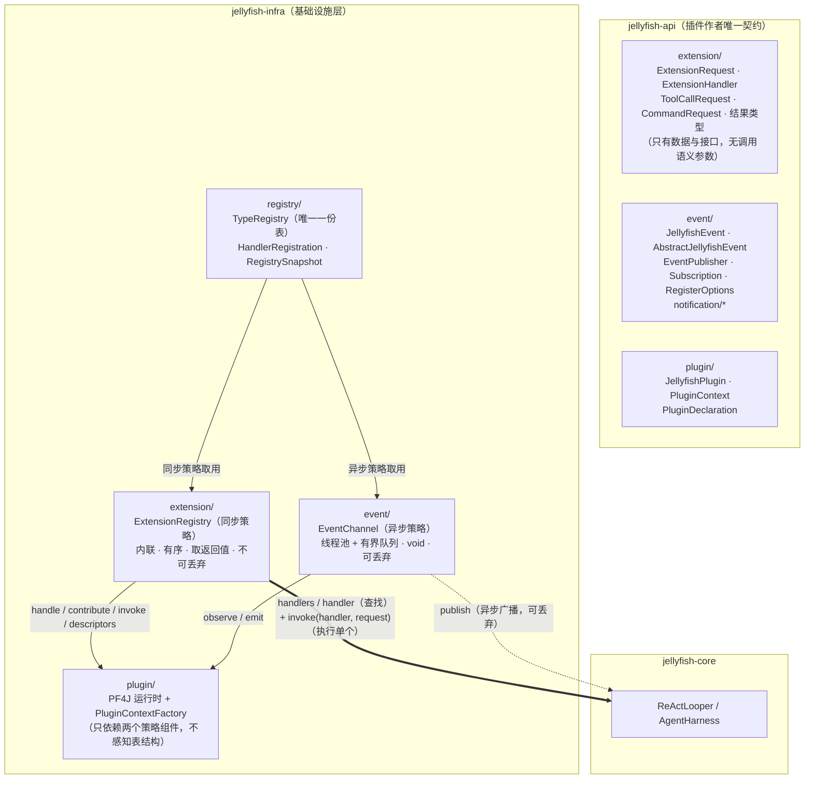

# Jellyfish 扩展层（原 event 包）重构方案

> 本方案以 `AGENTS.md` 的最新设计为唯一目标态，替换现有的「Callback + Event 双通道 + Guava EventBus」历史设计。
> 基线：**当前工作区**（未提交的半成品迁移），口径确认见 §0。

---

## 0. 确认口径与基线

### 0.1 已确认的决策

| # | 事项 | 结论 |
| --- | --- | --- |
| 1 | 基线 | 以**当前工作区**为基线；保留已改好的 `api/plugin`、`infra/plugin`（PF4J 运行时），只重构扩展层与触达点 |
| 2 | 描述符存储 | `handle(...)` 增加描述符参数；注册表**不透明存放**描述符；调用点按期望类型**类型化取回** |
| 3 | 命名与 API 面 | `api/event/callback` → `api/extension`；`Callback`→`ExtensionRequest`、`CallbackHandler`→`ExtensionHandler`、`CallbackException`→`ExtensionException`；**不留 deprecated 过渡**；`JellyfishEvent`/`AbstractJellyfishEvent`/`EventPublisher`/`Subscription`/`RegisterOptions` 保留原名与原包 |
| 4 | 同步派发简化 | 删除应答槽、嵌套深度护栏、异常兜底分发器；`NO_HANDLER` 由 `ExtensionRegistry.invoke` 直接抛 `ExtensionException`；指标只保留异步侧一个轻量 `EventChannelStats` |
| 4.1 | **同步调用面（用户裁决）** | 注册表只提供**查找**与**单处理器执行**两个原子能力：调用方先 `handlers(type, routeKey)` 拿到有序 handler 列表，再对每个 handler 调 `invoke(handler, request)` 执行，**本次结果由调用方处理后自行决定是否调下一个**。空表判定、顺序、短路、合并全部归调用方；框架不再有 `invoke(request)` 这种“自己找 + 自己调”的入口 |
| 5 | 白名单/限流 | v1 **不进** `EventChannel`；`EventChannel` 只做「线程池 + 有界队列 + 拒绝策略 + 启动期缓冲」；白名单/限流继续由跨语言侧的 `EventBridge` 负责 |
| 6 | 范围 | 只做 `api/extension` + `infra/{registry,extension,event}` 及全部触达点；`CommandManager`、`PermissionManager`、`AgentManager`、`infra/metrics` 本轮**保持空目录不落地** |
| 7 | 单测 | 随重构重写 `infra/event` 的测试为新三包测试，每个 public 类一个 `XxxTest`，不设覆盖率阈值 |
| 8 | 文档 | 新增根目录 `event重构方案.md`；另需按 §6 修正 `AGENTS.md` 中与决策 4.1 冲突的两句同步派发表述（`跨语言插件方案.md` 已有状态更新，不动） |
| 9 | 工具描述符归属 | 新增 `api/extension/ToolDescriptor`；`infra/llm.LlmTool` 由它构造（`api` 树保持 `AGENTS.md` 的三包结构） |
| 10 | 异步队列满 | 丢弃 + `droppedEvents` 计数 + 限流 WARN，**取消**「非事件线程内联降级」 |
| 11 | 唯一查找糖 | 保留 `handler(type, routeKey)`：0 → `NO_HANDLER`、≥2 → `AMBIGUOUS_HANDLER`，**只查不调** |
| 12 | 查找方法命名 | `handlers(type, routeKey)` / `handler(type, routeKey)`（与插件侧 `handle` 对称）；`TypeRegistry.resolve` 作废为底座原语 |

### 0.2 基线事实（实测）

- 工作区已有未提交的半成品迁移，且 `mvn -o compile` 与 `mvn -o test-compile` **当前均通过**。
- **已符合新设计**：`api/plugin/{JellyfishPlugin, PluginContext, PluginDeclaration}`、`infra/plugin/*`（PF4J 运行时）、`api/event/callback/CommandRequest`。
- **仍是旧设计**：`api/event/callback/*`（`Callback`/`CallbackHandler`/`CallbackException`）、`infra/event/*`（`JellyfishEventBus` + Guava + `CallbackDispatcher`/`EventDispatcher`/`CallbackRegistry`/`EventRegistry`/`CallbackReplies`/`DispatchContext`/`RegistrySnapshot`）。
- **不存在的包**：`infra/registry/`、`infra/extension/`。**空目录**：`infra/{agent,command,metrics,permission}`、`core/prompt`。
- **Guava 唯一用途**就是事件总线（`com.google.common` 仅出现在 `infra/event` 及其测试），可整体移除依赖。
- **未接入 DI**：`PF4JPluginManager`、`PluginRuntimeConfig` 目前没有任何 Dagger `@Provides`（现状如此，本轮不改这一点）。
- 反向耦合点：`infra/plugin` 反向依赖 `JellyfishEventBus.pluginContext()` / `unregisterAll()`，形成 `infra.event ⇄ infra.plugin` 包级循环，本轮必须消除。

---

## 1. 为什么废弃旧设计

| # | 旧设计问题 | 新设计要求 |
| --- | --- | --- |
| 1 | **类型登记点硬编码**：`CallbackDispatcher` 每类回调手写一个 `@Subscribe` 方法、`EventDispatcher` 每类事件再写一个；新增扩展点必须改框架代码 | 类型即地址：`TypeRegistry` 按「类型 + 路由键」查表，新增请求类型**零框架改动** |
| 2 | **依赖第三方事件总线**：Guava `EventBus` 是唯一注册表 + 派发引擎 | 内核自有 `TypeRegistry`，禁止第三方事件总线 |
| 3 | **两张表两套键**：`CallbackKey(类型, 路由键)` 与事件类型的 `Map`，注册/回收/诊断各写一遍 | 一份表：`TypeRegistry`，两种策略只是取用方式不同 |
| 4 | **应答槽机制**：因 Guava `@Subscribe` 只能返回 `void`，被迫引入 `CallbackReplies` 回填 + `await` 读取 | 内联派发，处理器**直接返回值**，无应答槽 |
| 5 | **调用语义被硬化成框架参数**：`INLINE`/`ISOLATED`、per-handler 超时、最大嵌套深度、dead event 计数 | 护栏交给调用方；同步侧内联、无超时、无异常隔离 |
| 6 | **插件入口按扩展点分组**：`tools()`/`commands()`/`events()`/`publisher()` + `@ExtensionPoint` 定义注册表 + 能力声明清单 | `handle`/`contribute`/`observe`/`emit`，注册边界由类型可见性承载（WIP 已改） |
| 7 | **描述符无处安放**：工具描述符（供 LLM `list`）与 handler 分离，没有随 handler 一起存 | 描述符随 handler 一起存在同一份注册表里 |

---

## 2. 目标态

### 2.1 分层与依赖方向



- **单向**：`api` ← `infra` ← `core` ← `cli`；`registry` 不依赖 `extension`/`event`（只被依赖）；`extension` 与 `event` 互不依赖，各自只依赖 `registry`。
- **消除包级循环**：`infra.event` 不再反向引用 `infra.plugin`。装配插件上下文的职责下沉到 `infra/plugin/PluginContextFactory`（持有 `ExtensionRegistry` + `EventChannel`），`PF4JPluginManager` 只依赖该工厂。

### 2.2 目标包结构（新增/改造后）

```
jellyfish-api/src/main/java/zcd/jellyfish/api/
├── extension/                              # 【新】同步派发侧对外模型
│   ├── ExtensionRequest.java               # 由 Callback 改名：abstract，仅承载请求数据
│   ├── ExtensionHandler.java               # 由 CallbackHandler 改名
│   ├── ExtensionException.java             # 由 CallbackException 改名，错误码精简
│   ├── ToolCallRequest.java                # 迁移（路由键 = 工具名）
│   ├── ToolCallResult.java                 # 迁移
│   ├── CommandRequest.java                 # 迁移（路由键 = 命令名）
│   └── ToolDescriptor.java                 # 【新】工具描述符（`LlmTool` 由它构造）
├── event/                                  # 【保留】异步派发侧对外模型
│   ├── JellyfishEvent.java / AbstractJellyfishEvent.java / EventPublisher.java
│   ├── Subscription.java / RegisterOptions.java
│   └── notification/*                      # 各核心事件类型（保留）
└── plugin/                                 # 保留；handle 增描述符参数

jellyfish-infra/src/main/java/zcd/jellyfish/infra/
├── registry/                               # 【新】一份表
│   ├── TypeRegistry.java                   # 「类型 + 路由键」→ 有序 handler 集合；同键唯一 or 0..N
│   ├── HandlerRegistration.java            # 由 callback/CallbackRegistration 迁移
│   ├── RegistryKey.java                    # 由 callback/CallbackKey 迁移（包私有）
│   └── RegistrySnapshot.java               # 由 infra/event 迁入（单表视图）
├── extension/                              # 【新】同步策略
│   └── ExtensionRegistry.java              # handle / contribute / invoke / descriptors / unregisterAll
├── event/                                  # 【改造】异步策略
│   ├── EventChannel.java                   # 由 JellyfishEventBus 收敛而来
│   ├── EventChannelOptions.java            # 由 EventBusOptions（去掉 maxCallbackDepth）
│   ├── EventChannelStats.java              # 由 EventBusStats（去掉回调类计数）
│   ├── EventSubscriber.java                # 【新，包私有】过滤谓词 + 监听器
│   ├── EventSubscription.java              # 由 notification/EventSubscription 迁移
│   ├── EventThreadFactory.java             # 迁移
│   └── EventRejectedExecutionHandler.java  # 迁移（策略见 §5.5）
└── plugin/
    ├── PluginContextFactory.java           # 【新】创建 PluginContext + 按 owner 回收
    ├── PluginContextImpl.java              # 改造依赖：ExtensionRegistry + EventChannel
    ├── JellyfishPluginManager.java          # 改造依赖：PluginContextFactory
    └── PF4JPluginManager.java               # 改造依赖：PluginContextFactory
```

### 2.3 职责一览

| 类 | 位置 | 职责 | 明确不做 |
| --- | --- | --- | --- |
| `TypeRegistry` | infra/registry | 唯一注册表：按「类型 + 路由键」存有序 handler + 描述符；唯一/多值两种登记；按 owner 回收；快照 | 不知道 handler 是同步还是异步、不知道类型语义 |
| `ExtensionRegistry` | infra/extension | 同步策略：`handle`/`contribute` 写入 registry；`handlers`/`handler` 做**有序查找**；`invoke(handler, request)` **只执行传入的那一个**处理器并返回结果；`descriptors` 类型化取描述符 | 无超时、无白名单、无异常隔离、无应答槽；**不自己找 handler、不做多处理器编排**（顺序 / 短路 / 合并全由调用方驱动） |
| `EventChannel` | infra/event | 异步策略：`publish` 入有界队列由订阅者线程广播；`subscribe`/`unsubscribeAll`；启动期缓冲；`close` 排空 | 不回调业务、不抛业务异常、不保证投递 |
| `PluginContextFactory` | infra/plugin | 把一个 `PluginDeclaration` 装配成绑定 owner 的 `PluginContext`；卸载时回收两条策略上的注册 | 不做插件加载/生命周期（那是 PF4J 运行时） |
| `PluginContextImpl` | infra/plugin | 插件唯一入口实现：4 个方法全部绑定 `pluginId` 作为 owner | 不暴露任何注册表内部结构 |

---

## 3. 旧 → 新 映射表

### 3.1 对外契约（jellyfish-api）

| 旧 | 处理 | 新 |
| --- | --- | --- |
| `event/callback/Callback<R>` | 改名 + 精简字段 | `extension/ExtensionRequest<R>`（删除 `callbackId`、`deadlineNanos`、`isExpired`） |
| `event/callback/CallbackHandler<C,R>` | 改名 | `extension/ExtensionHandler<C,R>`（签名不变，仍 `throws Exception`） |
| `event/callback/CallbackException` | 改名 + 错误码精简 | `extension/ExtensionException`，`Code = {NO_HANDLER, DUPLICATE_HANDLER, RESULT_TYPE_MISMATCH, DESCRIPTOR_TYPE_MISMATCH}` |
| `event/callback/ToolCallRequest` | 迁移，去掉 `timeoutMillis` | `extension/ToolCallRequest` |
| `event/callback/ToolCallResult` | 迁移，不变 | `extension/ToolCallResult` |
| `event/callback/CommandRequest` | 迁移，去掉 `timeoutMillis` | `extension/CommandRequest` |
| `event/{JellyfishEvent,AbstractJellyfishEvent,EventPublisher,Subscription,RegisterOptions}` | **保留** | 原样 |
| `event/notification/*` | **保留** | 原样 |
| `plugin/PluginContext.handle` | 增描述符参数 | 见 §4.4 |

### 3.2 基础设施（jellyfish-infra）

| 旧 | 处理 | 新 |
| --- | --- | --- |
| `event/JellyfishEventBus` | **删除**，职责一分为三 | 异步 → `EventChannel`；装配插件上下文 → `PluginContextFactory`；注册表 → `TypeRegistry` |
| `event/CallbackDispatcher` | **删除** | `ExtensionRegistry.invoke` 内联派发，不再需要「每类型一个 Guava 登记点」 |
| `event/EventDispatcher` | **删除** | `EventChannel` 直接按表广播，不再需要 `DeadEvent`/`@Subscribe` |
| `event/EventDispatchExceptionHandler` | **删除** | 同步侧异常原样上抛；异步侧逐个 try/catch 计数 |
| `event/CallbackReplies` | **删除** | 内联派发，handler 直接返回值 |
| `event/DispatchContext` | **删除** | 无应答槽、无嵌套深度护栏 |
| `event/callback/CallbackRegistry` | **并入** | `registry/TypeRegistry`（唯一/多值登记 + 解析 + 回收） |
| `event/notification/EventRegistry` | **并入** | `registry/TypeRegistry`（订阅也是「类型级 0..N handler」） |
| `event/callback/CallbackKey` | 迁移 + 改包私有 | `registry/RegistryKey` |
| `event/callback/CallbackRegistration` | 迁移 + 增描述符字段 | `registry/HandlerRegistration` |
| `event/notification/EventRegistration` | 并入 | `event/EventSubscriber`（过滤 + 监听器作为不透明 handler 存表） |
| `event/notification/EventSubscription` | 迁移 | `event/EventSubscription`（实现 `Subscription`，幂等） |
| `event/notification/EventDispatchResult` | **删除** | 命中/出错计数由 `EventChannel` 直接累加进 `EventChannelStats` |
| `event/RegistrySnapshot` | 迁移 + 单表化 | `registry/RegistrySnapshot`（`of(TypeRegistry)`） |
| `event/EventBusOptions` | 改名 + 精简 | `event/EventChannelOptions`（去 `maxCallbackDepth`） |
| `event/EventBusStats` | 改名 + 精简 | `event/EventChannelStats`（去 `dispatchedCallbacks`/`failedCallbacks`/`noHandlerCallbacks`/`nestingRejectedCallbacks`/`deadEventTypes`） |
| `event/EventThreadFactory` | 保留 | 原样（线程名前缀 `jellyfish-event-`，守护线程） |
| `event/EventRejectedExecutionHandler` | 保留 + 策略简化 | 见 §5.5 |
| `plugin/PluginContextImpl` | 改造依赖 | 依赖 `ExtensionRegistry` + `EventChannel` |
| `plugin/{JellyfishPluginManager,PF4JPluginManager}` | 改造依赖 | 依赖 `PluginContextFactory`，不再依赖 `JellyfishEventBus` |

### 3.3 已在工作区删除（方案确认后随提交固化）

`api/event/{EventRegistrar}`、`api/event/callback/{CommandRegistrar,ToolRegistrar,ExtensionPoint,ExtensionShape,PluginRequest,PluginRequestHandler,PluginExtensible,PermissionCheckRequest,PermissionDecision}`、`infra/event/{CallbackExecutor,CallbackRejectedExecutionHandler,PluginContextImpl}`、`infra/event/callback/{ExtensionPointRegistry,ExtensionPointDefinition}` 及对应测试。

---

## 4. 关键接口签名（Java 8）

### 4.1 api/extension

```java
/** 扩展点请求基类：只承载请求数据，是纯只读的请求消息，没有 ID、没有调用语义参数。 */
public abstract class ExtensionRequest<R> {
    protected ExtensionRequest(Class<R> resultType, String sessionId);   // resultType 抵消泛型擦除
    public abstract String getRouteKey();                                // 路由键；类型级请求返回 null
    public final Class<R> getResultType();
    public final String getSessionId();                                  // 进程级请求为 null
}

/** 类型化扩展点处理器；允许受检异常以降低插件样板代码。 */
@FunctionalInterface
public interface ExtensionHandler<C extends ExtensionRequest<R>, R> {
    R handle(C request) throws Exception;                                // 返回值不得为 null（除约定外）
}

/** 扩展点错误码异常：框架判定扩展点无法正常完成，与处理器业务异常区分开。 */
public class ExtensionException extends JellyfishException {
    public enum Code { NO_HANDLER, AMBIGUOUS_HANDLER, DUPLICATE_HANDLER, RESULT_TYPE_MISMATCH, DESCRIPTOR_TYPE_MISMATCH }
    public ExtensionException(Code code, String detail);
    public ExtensionException(Code code, String detail, Throwable cause);
    public Code getCode();
}

/** 工具描述符：插件注册工具时与 handler 一起落表，供 ReAct 侧 list 时构造 LlmTool。 */
public final class ToolDescriptor { /* name / description / parameters(JSON Schema) */ }
```

### 4.2 api/plugin（仅 handle 增描述符）

```java
public interface PluginContext {
    String pluginId();
    Map<String, Object> configuration();

    /** 同键唯一：路由键精确匹配，至多一个处理器（工具、具名命令）。descriptor 可为 null。 */
    <C extends ExtensionRequest<R>, R> Subscription handle(
            Class<C> requestType, String routeKey, Object descriptor,
            ExtensionHandler<C, R> handler, RegisterOptions options);

    default <C extends ExtensionRequest<R>, R> Subscription handle(
            Class<C> requestType, String routeKey, Object descriptor, ExtensionHandler<C, R> handler) { ... }

    default <C extends ExtensionRequest<R>, R> Subscription handle(
            Class<C> requestType, String routeKey, ExtensionHandler<C, R> handler) { /* descriptor = null */ }

    /** 类型级 0..N：order 升序依次调用（收集式贡献）。 */
    <C extends ExtensionRequest<R>, R> Subscription contribute(
            Class<C> requestType, Object descriptor, ExtensionHandler<C, R> handler, RegisterOptions options);
    default <C extends ExtensionRequest<R>, R> Subscription contribute(
            Class<C> requestType, ExtensionHandler<C, R> handler) { ... }

    <E extends JellyfishEvent> Subscription observe(Class<E> eventType, Predicate<E> filter, Consumer<E> listener);
    default <E extends JellyfishEvent> Subscription observe(Class<E> eventType, Consumer<E> listener) { ... }

    void emit(JellyfishEvent event);
}
```

### 4.3 infra/registry

```java
/** 注册项：handler 不透明、描述符不透明，唯一性/顺序/序号由注册表补齐。 */
public final class HandlerRegistration {
    public String getOwner();          // 内核组件名或 pluginId，回收与诊断的唯一线索
    public Class<?> getType();         // 扩展点请求类型 / 事件类型
    public String getRouteKey();       // null = 类型级
    public Object getHandler();        // ExtensionHandler 或 EventSubscriber（不透明）
    public Object getDescriptor();     // 工具描述符等，可为 null
    public long getSequence();         // 注册序号，同 order 时兜底排序
    public int getOrder();
    public String getOverriddenOwner();
}

/** 唯一一份表：两种派发策略共用，「类型 + 路由键 → 有序 handler 集合」。 */
public final class TypeRegistry {
    /** 同键唯一登记：冲突且未声明 override 时抛 ExtensionException(DUPLICATE_HANDLER)。 */
    public HandlerRegistration registerUnique(HandlerRegistration candidate, boolean override);

    /** 同键 0..N 登记：类型级贡献、事件订阅。 */
    public HandlerRegistration registerShared(HandlerRegistration candidate);

    /** 解析：类型按 isAssignableFrom 匹配；routeKey 为 null 的注册项对所有路由键生效；order 升序、同序按 sequence。 */
    public List<HandlerRegistration> resolve(Class<?> type, String routeKey);

    public List<HandlerRegistration> descriptorsOf(Class<?> type, Class<?> descriptorType);
    public boolean remove(HandlerRegistration registration);
    public int removeAll(String owner);       // 按 owner 回收，返回条数
    public List<HandlerRegistration> snapshot();
    public boolean isEmpty();
    public void clear();
}
```

要点：
- `registerUnique` 的冲突判定是**键级**的（同一 `(type, routeKey)`），覆盖时记录 `overriddenOwner` 便于诊断。
- 存储与并发沿用现有 `CallbackRegistry` 的成熟做法：`ConcurrentHashMap<RegistryKey, CopyOnWriteArrayList<HandlerRegistration>>` 存表 + 「请求类型 → 候选注册项」解析缓存，**任何写操作（登记/覆盖/解除/回收/清空）都使缓存失效**。
- `descriptorsOf` 复用同一次 `resolve` 的候选集合，只做描述符过滤与类型校验，不再单独扫表。
- 事件订阅用 `registerShared` + `routeKey = null`，天然允许多个订阅者。

### 4.4 infra/extension

```java
/** 同步策略：只做「有序查找 + 执行单个处理器」。编排（顺序 / 短路 / 合并）与护栏（超时 / 捕获）均属调用方。 */
public final class ExtensionRegistry {
    @Inject public ExtensionRegistry(TypeRegistry registry);   // infra 只暴露构造器，DI 在最外层

    public <C extends ExtensionRequest<R>, R> Subscription handle(
            String owner, Class<C> type, String routeKey, Object descriptor,
            ExtensionHandler<C, R> handler, RegisterOptions options);

    public <C extends ExtensionRequest<R>, R> Subscription contribute(
            String owner, Class<C> type, Object descriptor,
            ExtensionHandler<C, R> handler, RegisterOptions options);

    /** 执行单个处理器：内联调用、校验结果类型、原样返回；不查表、不四处调用、不做任何编排。 */
    public <C extends ExtensionRequest<R>, R> R invoke(ExtensionHandler<C, R> handler, C request);

    /** 有序查找：返回全部命中处理器（order 升序、同序按注册顺序、不可修改）；可能为空；不调用任何处理器。 */
    public <C extends ExtensionRequest<R>, R> List<ExtensionHandler<C, R>> handlers(Class<C> type, String routeKey);

    /** 唯一查找（同键唯一场景）：命中 0 个抛 NO_HANDLER；命中 ≥2 个抛 AMBIGUOUS_HANDLER；只查不调。 */
    public <C extends ExtensionRequest<R>, R> ExtensionHandler<C, R> handler(Class<C> type, String routeKey);

    /** 类型化取描述符；空表返回空列表；类型不匹配抛 DESCRIPTOR_TYPE_MISMATCH。 */
    public <D> List<D> descriptors(Class<? extends ExtensionRequest<?>> type, Class<D> descriptorType);

    public int unregisterAll(String owner);
    public RegistrySnapshot snapshot();
}
```

**三个入口的职责边界（这是本次重构的核心语义）**：

| 入口 | 做什么 | 不做什么 |
| --- | --- | --- |
| `handlers(Class<C>, String routeKey)` | 在调用点线程**同步查表**，返回 order 升序的有序 handler 列表（可能为空，不可修改） | 不调用任何处理器、不判空表、不排序以外的任何决策 |
| `handler(Class<C>, String routeKey)` | 同上，但用于「同键唯一」场景：0 个 → `NO_HANDLER`，≥2 个 → `AMBIGUOUS_HANDLER` | 不调用处理器（沿袭「用错入口当场暴露」的 fail-fast） |
| `invoke(ExtensionHandler<C,R> handler, C request)` | **只执行传入的那一个**处理器：内联调用，结果按 `request.getResultType()` 校验（非 null 且类型不符 → `RESULT_TYPE_MISMATCH`）后原样返回；异常原样上抛 | 不查表、不找其它 handler、不做聚合/链式/AND |

**调用方循环（唯一正确的多用例写法）**：

```java
List<ExtensionHandler<PermissionCheckRequest, PermissionDecision>> candidates =
        extensions.handlers(PermissionCheckRequest.class, null);
for (ExtensionHandler<PermissionCheckRequest, PermissionDecision> handler : candidates) {
    PermissionDecision decision = extensions.invoke(handler, request);
    if (decision.isDeny()) {          // 短路、合并、链式…全是调用点的事
        return decision;
    }
}
return PermissionDecision.allow();
```

这样设计的好处：① **短路天然可行**（如权限拦截遇到 Deny 就不再调后面的）；② **链式不需要往请求里塞“前一个结果”**（把上一个 `invoke` 的返回值当作下一个请求的输入即可）；③ **每个 handler 的异常处置可以逐调用点不同**（有的调用点直接抛，有的记一笔继续）；④ 注册表内**不存在任何组合策略代码**，与 `AGENTS.md`「组合规则属于调用方」完全一致。

代价与约定：空表不再由框架抛错（`handlers` 只返回空列表），调用点必须自行判空；同键唯一场景建议用 `handler(...)` 保持 fail-fast。

### 4.5 infra/event

```java
/** 异步派发策略：有界队列 + 订阅者线程，无返回值、可丢弃。 */
public final class EventChannel implements EventPublisher, AutoCloseable {
    @Inject public EventChannel(EventChannelOptions options, TypeRegistry registry);

    @Override public void publish(JellyfishEvent event);        // 立即返回；未 start 时入启动期缓冲
    public void start();                                        // 回放启动期缓冲，之后提交线程池
    public <E extends JellyfishEvent> Subscription subscribe(
            String owner, Class<E> eventType, Predicate<E> filter, Consumer<E> listener);
    public int unsubscribeAll(String owner);
    public EventChannelStats stats();
    public RegistrySnapshot snapshot();
    @Override public void close();                              // 停止接收 → 排空 → 清表
}
```

### 4.6 infra/plugin

```java
/** 插件上下文工厂：把 pluginId 绑定为 owner，并作为插件侧唯一的回收入口。 */
public final class PluginContextFactory {
    @Inject public PluginContextFactory(ExtensionRegistry extensions, EventChannel events);

    public PluginContext create(PluginDeclaration declaration);  // 创建绑定 owner 的上下文
    public void release(String pluginId);                        // 回收两条策略上的注册，任一步失败不阻断另一步
}
```

`JellyfishPluginManager` / `PF4JPluginManager`：把字段 `JellyfishEventBus eventBus` 换成 `PluginContextFactory contexts`；`contextOf(declaration)` → `contexts.create(declaration)`；`eventBus.unregisterAll(pluginId)` → `contexts.release(pluginId)`（三处：`rollback`/`safeStop`/`safeUnload`）。

---

## 5. 关键语义决策

### 5.1 一份表如何同时承载两种 handler
`TypeRegistry` 的 handler 与 descriptor 都是不透明 `Object`：同步侧存 `ExtensionHandler` + 工具描述符；异步侧把「过滤谓词 + 监听器」封装成包私有 `EventSubscriber` 作为 handler（descriptor 为 null）。**唯一性由登记入口决定**（`registerUnique` / `registerShared`），不是键的属性——这与「同键唯一」的表述一致：同键在唯一入口下唯一，在共享入口下 0..N。

### 5.2 同步调用面：注册表只做「查找」与「执行单个」，编排全归调用方
- `handlers(type, routeKey)`：**有序查找**（order 升序、同序按注册顺序），返回不可修改列表，可能为空；**不调用任何处理器**。
- `handler(type, routeKey)`：同键唯一场景的查找糖，0 个抛 `NO_HANDLER`、≥2 个抛 `AMBIGUOUS_HANDLER`，仍然**只查不调**。
- `invoke(handler, request)`：**只执行传入的那一个**处理器，返回其结果；不查表、不四处调用。
- “依次调用、合并结果、遇错中断、遇 Deny 短路”都是调用方的 `for` 循环里的事——注册表内不存在任何组合策略代码，也就没有「首个结果 / 首个非 null 结果」这类需要框架替调用方猜的语义。
- 设计取舍：把 `invoke` 的参数从「请求」改成「handler + 请求」，就消灭了“框架自己找自己调”这条路径；代价是调用点多两行查表代码，换来的是调用意图完全显式。

### 5.3 同步侧不做护栏（刻意）
`ExtensionRegistry.handlers` / `invoke` 都在调用点线程内联执行，**没有超时、没有白名单、没有异常隔离**。调用方若不能容忍插件阻塞或抛错，必须自己在调用点设超时/捕获；`EventChannel` 侧的白名单/限流/有界队列**不能替代**同步侧。

### 5.4 描述符随 handler 一起存
描述符存表、类型化取回：`descriptors(ToolCallRequest.class, ToolDescriptor.class)`。这样 `ReActLooper` 生成 `LlmTool` 清单时无需再维护第二份工具目录，工具下架（`unregisterAll`）时描述符自动消失。

### 5.5 异步队列满时的策略（已确认）
**队列满即丢弃 + `droppedEvents` 计数 + 限流 WARN**，不再保留「非事件线程降级为调用线程内联执行」。理由：异步侧契约是「可丢弃」，内联降级会把订阅者拖回 ReAct 调用线程，违反契约；`ConfigWarningEvent` 一类通知属 best-effort，由启动期缓冲 + 有界队列覆盖正常路径。

### 5.6 启动期缓冲保留
`publish` 在 `start()` 之前入缓冲队列（有界，溢出计数丢弃），`start()` 回放。保留原因：`RuntimeConfig.refresh()` 期间的配置告警必须不因订阅者尚未注册而丢失（`AgentHarness.bootstrap()` 顺序：`eventChannel.start()` → `runtimeConfig.refresh()` → `modelManager.refresh(false)`）。

### 5.7 指标边界
只保留 `EventChannelStats`（published/dropped/pendingReplayed/pendingOverflow/unmatched/subscriberErrors/activeThreads/queueSize）。**同步侧不加指标**：失败即抛给调用方，调用方自己感知；`infra/metrics` 留待后续统一可观测性时再消费。

### 5.8 异常与日志
- 同步侧：处理器抛出的 `RuntimeException` 原样上抛；受检异常包装为 `JellyfishException`（接口不声明受检异常）。
- 异步侧：单个订阅者异常被捕获 → `subscriberErrors` 计数 + WARN，不影响其它订阅者；无订阅者命中 → `unmatchedNotifications` 计数 + DEBUG。
- 删除 Guava `DeadEvent` 的「无 dispatcher 登记的类型」检测：新设计没有登记点，等价能力由 `unmatchedNotifications` + 无 handler 时同步侧直接抛 `NO_HANDLER` 覆盖。

### 5.9 兼容过渡
项目尚未发布，**不做 deprecated 别名**：旧类一次性删除，调用点一次性改名。工作区已有的半成品迁移与新命名冲突的部分直接改，不留桥接层。

---

## 6. 触达点改造清单（文件级）

| 文件 | 改动 |
| --- | --- |
| `jellyfish-api/.../api/event/callback/*` | 删除（内容迁到 `api/extension`） |
| `jellyfish-api/.../api/extension/*` | 新增 6 个类（§4.1） |
| `jellyfish-api/.../api/plugin/PluginContext.java` | `Callback`→`ExtensionRequest`、`CallbackHandler`→`ExtensionHandler`；`handle` 增 `descriptor` 参数与重载 |
| `jellyfish-api/.../api/event/*`、`notification/*` | 不动 |
| `jellyfish-infra/.../infra/registry/*` | 新增 `TypeRegistry`/`HandlerRegistration`/`RegistryKey`/`RegistrySnapshot` |
| `jellyfish-infra/.../infra/extension/ExtensionRegistry.java` | 新增 |
| `jellyfish-infra/.../infra/event/*` | 重写为 `EventChannel` 一族；删除 Guava 相关类（§3.2） |
| `jellyfish-infra/.../infra/plugin/PluginContextFactory.java` | 新增 |
| `jellyfish-infra/.../infra/plugin/PluginContextImpl.java` | 依赖换成 `ExtensionRegistry` + `EventChannel`；实现新 `handle` |
| `jellyfish-infra/.../infra/plugin/{JellyfishPluginManager,PF4JPluginManager}.java` | 依赖换成 `PluginContextFactory` |
| `jellyfish-infra/.../infra/config/RuntimeConfig.java` | 不改（仍依赖窄接口 `EventPublisher`，由 `EventChannel` 实现） |
| `jellyfish-core/.../core/AgentHarness.java` | 依赖换成 `EventChannel`（+ 预留 `ExtensionRegistry`）；`bootstrap()` 改 `eventChannel.start()`；更新类注释里的事件总线措辞 |
| `jellyfish-cli/.../cli/di/EventModule.java` | 改为提供 `EventChannelOptions`、`EventChannel`、`EventPublisher` 视图 |
| `jellyfish-cli/.../cli/di/ExtensionModule.java` | 新增：提供 `TypeRegistry`（单例）、`ExtensionRegistry`（单例） |
| `jellyfish-cli/.../cli/di/JellyfishComponent.java` | `modules` 增加 `ExtensionModule.class` |
| `jellyfish-infra/pom.xml` | 移除 Guava 依赖与相关注释 |
| `pom.xml`（根） | 移除 `guava.version` 与 `dependencyManagement` 中的 Guava 条目 |
| `AGENTS.md` | **按决策 4.1 修正同步派发表述**：「架构要点」中「多个则按 `order` 升序依次全部内联调用并返回首个结果」改为「注册表只提供**有序查找**（`handlers`/`handler`）与**单处理器执行**（`invoke(handler, request)`）；调用顺序、短路与结果合并由调用方自行驱动」；「注册表只保证有序调用 + 收集返回值」改为「注册表只保证**有序查找**」；其余段落（`infra/registry`/`infra/extension`/`api/extension` 已列）不改 |
| `event重构方案.md`（本文件） | 新增；其余文档不改（`跨语言插件方案.md` 已有状态更新） |

---

## 7. 删除清单

**主代码**：`api/event/callback/{Callback,CallbackHandler,CallbackException,ToolCallRequest,ToolCallResult,CommandRequest}`（迁移后删）、`infra/event/{JellyfishEventBus,CallbackDispatcher,EventDispatcher,EventDispatchExceptionHandler,CallbackReplies,DispatchContext}`、`infra/event/callback/*`、`infra/event/notification/*`、`infra/plugin/PluginContextImpl` 的旧字段（改造而非删类）。

**测试**（`jellyfish-infra/src/test/.../infra/event/`）：

| 删除 | 替代 |
| --- | --- |
| `CallbackDispatcherTest`、`EventDispatcherTest` | `ExtensionRegistryTest`（查找顺序 / 单处理器执行 / 异常 / 空表与多命中） |
| `JellyfishEventBusTest` | `EventChannelTest`（队列/缓冲/订阅/关闭） |
| `CallbackRepliesTest`、`DispatchContextTest` | 无（机制已删除） |
| `CallbackRegistryTest`、`EventRegistryTest` | `TypeRegistryTest` |
| `CallbackKeyTest` | `RegistryKeyTest`（或由 `TypeRegistryTest` 覆盖） |
| `EventDispatchExceptionHandlerTest` | 无 |
| `RegistrySnapshotTest` | `RegistrySnapshotTest`（迁到 registry 包，单表断言） |
| `EventBusOptionsTest`、`EventBusStatsTest` | `EventChannelOptionsTest`、`EventChannelStatsTest` |
| `EventRegistrationTest`、`EventSubscriptionTest`、`EventDispatchResultTest` | `EventSubscriberTest`(?)/`EventSubscriptionTest`，`EventDispatchResult` 删除 |
| `EventThreadFactoryTest`、`EventRejectedExecutionHandlerTest` | 保留（改断言策略） |

**api 测试**：`CallbackTest`→`ExtensionRequestTest`、`CommandRequestTest`（改包/改类型）、`PermissionDecisionTest`/`PluginRequestTest`（已删）。

**依赖**：Guava（根 pom + `jellyfish-infra/pom.xml`）。

---

## 8. 测试计划

### 8.1 新增/重写测试类与覆盖点

| 测试类 | 关键用例 |
| --- | --- |
| `TypeRegistryTest` | 唯一登记冲突抛错；`override=true` 覆盖并记录 `overriddenOwner`；共享登记 0..N；`order` 升序同序按 `sequence`；路由键 `null` 类型级匹配所有路由键；`resolve` 的 `isAssignableFrom` 宽窄匹配；`remove` 幂等；`removeAll(owner)` 只删自己；`clear`/`isEmpty`；写后解析缓存失效；并发注册（多线程）不丢条 |
| `ExtensionRegistryTest` | 同键重复注册抛 `DUPLICATE_HANDLER`；`override` 覆盖生效；`handlers` 返回**全部**命中、order 升序/同序按注册顺序、列表不可修改、**不调用任何处理器**、**无命中返回空列表而不抛错**；`handler` 无命中抛 `NO_HANDLER`、多命中抛 `AMBIGUOUS_HANDLER`、命中 1 个时不执行处理器；`invoke(handler, request)` 在**当前线程内联**执行、返回该处理器结果、**不会碰其它已注册处理器**（用第二个 handler 做反证）；结果类型不符抛 `RESULT_TYPE_MISMATCH`；处理器异常原样上抛（受检异常包装 `JellyfishException`）；调用方循环（短路 / 链式）用例；`descriptors` 命中/空/类型不符；`unregisterAll` 后 `handlers`/`handler` 都不再命中 |
| `EventChannelTest` | 未 `start` 时入缓冲、`start` 回放；`publish` 不阻塞调用线程；订阅过滤谓词；按类型宽窄匹配（订阅父类型收到子类型）；单订阅者异常不影响其它订阅者并计数；队列满丢弃计数；`close` 幂等且拒绝后续发布；`unsubscribeAll(owner)`；启动期缓冲溢出计数 |
| `RegistrySnapshotTest` | 单表快照渲染包含 owner/order/描述符标记；空表渲染占位 |
| `EventChannelOptionsTest` / `EventChannelStatsTest` | 参数校验（正数、maxPool ≥ core）；计数读取与 `render()` 文本 |
| `PluginContextFactoryTest` | `create` 绑定 owner（注册项 owner = pluginId）；`release` 同时清掉扩展点与订阅；`release` 对未知 owner 安全 |
| `PluginContextImplTest`（已有，改造） | 四个入口都落到 owner；`handle` 描述符透传；`emit` 转 `publish` |
| `ExtensionRequestTest` / `ToolCallRequestTest` / `CommandRequestTest` | 路由键、参数只读、名字空白校验、结果类型；确认已无 `callbackId`/`deadline` |
| `PluginContext` 相关（api） | 默认方法委托到带描述符的重载 |

### 8.2 命令与覆盖率

```bash
mvn -o -q compile && mvn -o -q test-compile
mvn -o test                      # 报告：各模块 target/site/jacoco/index.html
```

不设 `check` 阈值；沿用「每个 public 类都有测试、每个测试方法只验证一个行为」的约定。

---

## 9. 实施阶段（每阶段结束都可编译、可测试）

| 阶段 | 内容 | 退出标准 |
| --- | --- | --- |
| P1 | `api/extension` 落地（改名 + 精简字段 + `ExtensionException`）；`api/plugin/PluginContext` 增描述符；删旧 `api/event/callback`；同步改 `PluginContextImpl`（先接旧注册表签名过渡） | `mvn -o compile` 通过；api 测试改造完成 |
| P2 | `infra/registry`：`TypeRegistry` + `HandlerRegistration` + `RegistryKey` + `RegistrySnapshot` + 单测 | `TypeRegistryTest` 绿 |
| P3 | `infra/extension/ExtensionRegistry`（含描述符）+ 单测；`PluginContextImpl` 切到 `ExtensionRegistry` | `ExtensionRegistryTest` 绿 |
| P4 | `infra/event` 重写为 `EventChannel` 一族（去 Guava）+ 单测；新增 `PluginContextFactory`；插件运行时改依赖 | `EventChannelTest` 绿；`infra/plugin` 测试改构造依赖后绿 |
| P5 | 删除全部旧类与旧测试；`AgentHarness`/DI Module 切换；根 pom + infra pom 去 Guava；全量 `mvn -o test` | 全量测试绿；`grep -r "com.google.common" --include=*.java` 无命中；`grep -rn "Guava" pom.xml jellyfish-*/pom.xml` 无命中 |

---

## 10. 验收标准

- [ ] `AGENTS.md` 中 `infra/{registry,extension,event}` 三包与 `api/{extension,event,plugin}` 的目录/类名逐一落地，且**没有任何第三方事件总线**。
- [ ] `TypeRegistry` 是唯一一份表：全仓库不存在第二处「类型 → handler」的注册结构。
- [ ] `ExtensionRegistry` 只提供**有序查找**（`handlers`/`handler`）与**单处理器执行**（`invoke(handler, request)`）：无应答槽、无超时、无白名单、无异常隔离；注册表内**不存在任何组合策略代码**（顺序 / 短路 / 合并全在调用点）；`invoke` 不会触碰调用方没传进来的处理器。
- [ ] `AGENTS.md` 中同步派发的表述已按决策 4.1 修正，与实际实现一致。
- [ ] `EventChannel` 无返回值、有界队列、可丢弃、启动期有缓冲、`close` 幂等。
- [ ] 描述符随 handler 存表，且可类型化取回。
- [ ] 插件与内核的交互只经 `PluginContext` 四入口；`PluginContextFactory.release` 是唯一回收入口。
- [ ] `infra/event` 与 `infra/plugin` 之间**不再有包级循环**。
- [ ] Guava 从依赖中移除，编译与测试全绿。
- [ ] 新增/重写测试覆盖 §8.1 的全部用例；JaCoCo 报告可生成。
- [ ] 所有新增类/接口/成员/私有方法带中文文档注释与 `@author zcd`；4 空格缩进；异常统一 `JellyfishException` 家族。

---

## 11. 风险与缓解

| # | 风险 | 缓解 |
| --- | --- | --- |
| 1 | 单表混装两类 handler，误把事件订阅当扩展点调用 | 登记入口分离（`registerUnique`/`registerShared`）+ 两侧各自封装（`ExtensionRegistry`/`EventChannel`），`TypeRegistry` 只对包内暴露解析结果 |
| 2 | 插件 ClassLoader 侧看不到 `ExtensionRequest` 子类 → 注册失败 | PF4J 父加载器必须共享 `jellyfish-api`（`PluginClasspathGuard` 已约束插件包不得自带内核契约类），在 §8.1 的集成用例中断言 |
| 3 | 同步内联导致阻塞调用线程（插件慢） | 明确写进文档与 Javadoc：护栏在调用方；`ReActLooper` 接入时对工具调用按需自带超时/捕获 |
| 4 | 队列满丢事件导致启动期告警丢失 | 启动期缓冲 + `pendingOverflow`/`droppedEvents` 计数 + 限流 WARN；配置告警不影响启动 |
| 5 | 解析缓存与注册并发不一致 | 沿用现有 `ConcurrentHashMap` + `CopyOnWriteArrayList` + 写时清缓存（`candidates.clear()`）的成熟实现；补并发注册单测 |
| 6 | `order` 语义被误用为「异步事件优先级」 | 文档与 Javadoc 明确：`order` 仅对同步类型级贡献有意义；事件按注册顺序派发 |
| 7 | 描述符类型化取回靠调用点约定 | 取值 API 强制传 `descriptorType`，不符即抛 `DESCRIPTOR_TYPE_MISMATCH`（fail-fast） |

---

## 12. 裁决记录（已全部确认，无遗留待确认项）

| # | 问题 | 裁决 |
| --- | --- | --- |
| A | 工具描述符类型归属 | 新增 `api/extension/ToolDescriptor`；`infra/llm.LlmTool` 由它构造（见 §4.1/§5.4） |
| B | 同步调用面形态 | 查找与执行拆开：`handlers`/`handler` 只查，`invoke(handler, request)` 只执行传入的那一个（见 §4.4/§5.2） |
| C | 异步队列满时的策略 | 丢弃 + 计数 + 限流 WARN，取消「调用线程内联降级」（见 §5.5） |
| D | 是否保留唯一查找糖 `handler(...)` | 保留（0 → `NO_HANDLER`，≥2 → `AMBIGUOUS_HANDLER`，只查不调） |
| E | 查找方法命名 | `handlers` / `handler`，与插件侧 `handle` 对称 |

## 13. 实施进度

| 阶段 | 状态 | 产出 |
| --- | --- | --- |
| P1 `api/extension` + `PluginContext` 描述符 + 旧包删除 | **已完成** | `api/extension/{ExtensionRequest,ExtensionHandler,ExtensionException,ToolDescriptor,ToolCallRequest,ToolCallResult,CommandRequest}`；`api/event/callback` 已删；`PluginContext` 增描述符与默认重载；`mvn -o test` 全绿（api 42 + infra 345） |
| P2 `infra/registry` | **已完成** | `TypeRegistry`/`HandlerRegistration`/`RegistryKey`/`RegistrySnapshot` + 3 个测试类（31 例）；`mvn -o test` 全绿（418 例） |
| P3 `infra/extension` | 待开始 | — |
| P4 `infra/event` + `PluginContextFactory` | 待开始 | — |
| P5 删旧 + DI 切换 + 去 Guava + 全量回归 | 待开始 | — |
