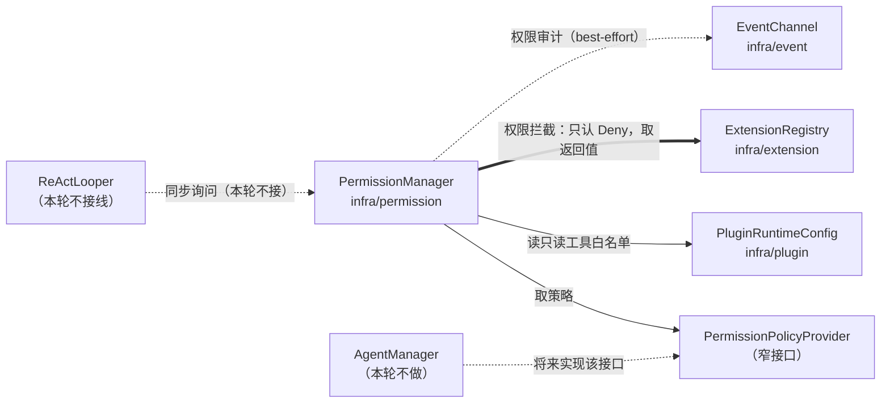

# Permission 模块落地方案

> 后续变更（`agent方案.md` 落地后）：AgentManager 已实现 `PermissionPolicyProvider`，`plugins` 段已真实接入 `PluginRuntimeConfig`；本文档 §4.4 / §5.1 中的示例键路径随之收敛为 `plugins.configurations.<pluginId>`（判定语义与结论不变，仅配置路径形状变化）。

> 状态：**裁决已完成**（§11），待开工；含 `AGENTS.md` 同步更新（§5.1）
> 范围：只交付 Permission 模块（api 契约 + infra 实现 + 单测 + DI 装配），**不接** `ReActLooper`、**不做** `AgentManager`、**不做** `SessionManager`、**不做**人工审批交互。

## 0. 已确认口径（用户裁决）

| # | 决策 | 落地含义 |
| --- | --- | --- |
| 1 | 策略来自 `agents.json` 的 agent 定义，由 `AgentManager` 提供（选项 a） | `PermissionManager` 通过窄接口 `PermissionPolicyProvider` 取策略；本轮用占位实现，AgentManager 落地后由它实现该接口 |
| 2 | 本轮不一起做 `AgentManager` | 判定矩阵靠 stub provider 单测钉住；无端到端「按 agent 拒绝」验证 |
| 3 | PLAN 模式是**会话级可切换状态**，只读工具白名单配在**插件配置**里 | 模式随请求带入；白名单来自 `PluginRuntimeConfig` 的插件配置段 |
| 4 | 判定三态（ALLOW / DENY / ASK），暂不可实现的写 `TODO`；策略 fail-open | 「取不到策略」→ ALLOW（fail-open）；**ASK 绝不降级为放行，一律降级为 DENY**（审批通道未落地，见 4.3） |
| 5 | 核心策略写普通 Java 代码 | 不进注册表，`PermissionManager` 内显式 `if` 链 |
| 6 | 管所有插件 | 拦截扩展点对全部插件开放，所有工具调用无一例外过闸 |
| 7 | 放行也发审计事件 | 每次判定后都 `publish`，含 ALLOW |
| 8 | 只交付 Permission 模块 | 不改 `AgentHarness`、不接 `ReActLooper` |
| 9 | 审计事件必须记录判定来源（owner） | `ExtensionRegistry` 新增带来源的查找面 `bindings(...)`；`PermissionDecidedEvent` 增加 `source` 字段 |
| 10 | 插件不能返回 ASK | 插件侧结果类型**独立为两态** `PermissionVeto`（不拦截 / 拦截），ASK 在类型上不可表达 |

## 1. 现状基线（实测）

- `jellyfish-api/src/main/java/zcd/jellyfish/api/extension/` 已有 `ExtensionRequest` / `ExtensionHandler` / `ExtensionException` / `ToolCallRequest` / `ToolCallResult` / `ToolDescriptor` / `CommandRequest`；**没有**任何权限相关类型（旧版 `api/event/callback/PermissionCheckRequest` 与 `PermissionDecision` 已在本轮重构中删除）。
- `jellyfish-infra/src/main/java/zcd/jellyfish/infra/permission/` 是**空目录**；`agent/`、`command/`、`metrics/` 同样是空目录。
- `ExtensionRegistry` 只暴露「有序查找 + 执行单个处理器」：`handlers(type, routeKey)` 返回 `List<ExtensionHandler>`（**不带 owner**）、`invoke(handler, request)` 内联执行并校验结果类型；编排（短路、异常处置）归调用方。
- `PluginRuntimeConfig` 已持有 `pluginId → 配置段` 映射，但只暴露 `configurationOf(pluginId)`，**没有**整份配置的访问方法。
- `EventChannel` 是 best-effort：有界队列、队列满即丢弃、启动期缓冲；`EventPublisher` 是窄接口。
- `SessionManager`、`AgentManager`、`ReActLooper` 均为空壳占位。

## 2. 目标态

### 2.1 依赖边（本轮新增）



新增两条依赖边，都需要在评审时明确接受：

1. `infra/permission → infra/plugin`：为了读插件配置里的只读工具白名单。`infra/plugin` 不反向依赖 `permission`，无环。
2. `infra/permission → PermissionPolicyProvider`（同包窄接口）：将来 `infra/agent` 实现它，形成 `agent → permission`，无环。先例：`RuntimeConfig → EventPublisher`。

### 2.2 包结构

```
jellyfish-api/src/main/java/zcd/jellyfish/api/extension/
├── PermissionMode.java             # 会话模式枚举：NORMAL / PLAN
├── PermissionCheckRequest.java     # 类型级请求：agentId / toolName / arguments / mode / sessionId
├── PermissionVeto.java             # 【插件侧结果】拦截裁定两态：不拦截 / 拦截（刻意不含 ASK）
└── PermissionDecision.java         # 【内核判定】三态结果 ALLOW / DENY / ASK + reason

jellyfish-api/src/main/java/zcd/jellyfish/api/event/notification/
└── PermissionDecidedEvent.java     # 权限审计事件（放行也发）

jellyfish-infra/src/main/java/zcd/jellyfish/infra/extension/
└── HandlerBinding.java             # 【新增】带来源的处理器绑定：只给需要审计归因的调用点用

jellyfish-infra/src/main/java/zcd/jellyfish/infra/permission/
├── PermissionPolicy.java           # agent 粒度策略值对象：denied / ask / allowed 三个集合
├── PermissionPolicyProvider.java   # 窄接口：agentId → 策略（无策略返回 unrestricted）
├── ReadOnlyTools.java              # 插件配置合并出的只读工具名集合（PLAN 白名单）
├── PermissionSettings.java         # 用户可见配置键常量（readOnlyTools）
└── PermissionManager.java          # 唯一同步入口：核心策略 → PLAN 白名单 → 插件拦截 → 审计

jellyfish-cli/src/main/java/zcd/jellyfish/cli/di/
└── PermissionModule.java           # 策略提供者占位实现 + 白名单装配
```

**为什么请求/结果放 `api/extension`**：请求类型即身份——插件拿不到类型就注册不了。插件要能「按 PLAN 模式拦截」，就必须看得见 `PermissionCheckRequest` 与 `PermissionDecision`。

**为什么 `PermissionMode` 放 api 而不是 infra**：它是请求的字段，插件侧也要看得到；将来 `SessionManager`（infra）持有它也要依赖 api。

**为什么 `PermissionPolicy` 放 infra 而不是 api**：它是内核内部的判定输入，插件既不需要看也不应该看（策略收窄由核心代码负责）。

### 2.3 职责一览

| 类 | 做什么 | 不做什么 |
| --- | --- | --- |
| `PermissionManager` | 串起核心策略 → PLAN 白名单 → 插件拦截，短路与异常处置写在它自己的 `for` 里，最后发审计事件 | 不解析配置、不持有会话状态、不执行人工审批 |
| `PermissionPolicy` | 只表达「这个 agent 对这些工具的授权态度」（不变量值对象） | 不知道 PLAN、不知道插件、不知道审计 |
| `PermissionPolicyProvider` | 把 `agentId` 映射成策略 | 不判定、不缓存（缓存由将来的 AgentManager 快照负责） |
| `ReadOnlyTools` | 把插件配置段的 `readOnlyTools` 合并成一个全局工具名集合 | 不判定、不感知会话 |
| `PermissionSettings` | 配置键常量 | 不读文件（读取由配置层负责） |

## 3. 关键接口签名（Java 8）

### 3.1 api/extension

```java
/** 会话权限模式：由调用点从会话状态读出并带入请求，进程无全局态。 */
public enum PermissionMode {
    /** 常规模式：只受 agent 策略约束。 */
    NORMAL,
    /** 计划模式：仅允许只读工具。 */
    PLAN
}
```

```java
/** 权限检查请求：类型级扩展点，内核在调用点构造，插件按类型注册拦截处理器。 */
public final class PermissionCheckRequest extends ExtensionRequest<PermissionVeto> {

    private final String agentId;
    private final String toolName;
    private final Map<String, Object> arguments;
    private final PermissionMode mode;

    /**
     * @param agentId   发起调用的 agentId，可为 {@code null}（未绑定 agent 时按无策略处理）
     * @param toolName  待检查的工具名，不可为空白
     * @param arguments 工具参数，可为 {@code null}
     * @param mode      会话权限模式，可为 {@code null}（按 {@link PermissionMode#NORMAL} 处理）
     * @param sessionId 会话标识，可为 {@code null}
     */
    public PermissionCheckRequest(String agentId, String toolName, Map<String, Object> arguments,
                                  PermissionMode mode, String sessionId) { ... }

    /** 便捷构造：NORMAL 模式、进程级（无会话）。 */
    public PermissionCheckRequest(String agentId, String toolName, Map<String, Object> arguments) { ... }

    @Override
    public String getRouteKey() {
        return null;   // 类型级：拦截是对「一次工具调用」的整体判断，不按工具名分槽
    }

    public String getAgentId();
    public String getToolName();
    public Map<String, Object> getArguments();   // 只读、非 null
    public PermissionMode getMode();             // 非 null，缺省 NORMAL
}
```

设计说明：

- **`getRouteKey()` 恒为 `null`**：拦截处理器必须用 `contribute`（类型级 0..N）注册。若按工具名分槽，两个插件都想拦同一个工具就会撞 `DUPLICATE_HANDLER`，与「管所有插件」冲突。
- **带 `arguments`**：Deny 策略常要看参数（如 `bash` 带 `rm -rf`），且拦截发生在执行前、参数已齐。
- **`agentId` 允许为空**：为空即「无策略」，按 fail-open 放行（见 4.1）。
- **`mode` 缺省 NORMAL**：构造器内 `mode == null ? NORMAL : mode`，避免 `PermissionManager` 到处判空。
- **结果类型是 `PermissionVeto` 而不是 `PermissionDecision`**：这是「插件不能返回 ASK」的硬约束所在（见下）。

```java
/**
 * 拦截裁定：插件唯一能表达的两态——不拦截 / 拦截。
 * <p>
 * <b>刻意不含 ASK</b>：ASK 是内核策略才能提出的诉求（需要人工看一眼），插件既不能放宽核心策略，
 * 也不能要求人工审批，因此这里只给两个态。
 * <p>
 * <b>不拦截 ≠ 放行</b>：放行权始终在核心策略手里，插件只能往「更严」的方向施加影响，
 * 这也是 AGENTS.md「权限拦截只支持 Deny」的落地方式。
 */
public final class PermissionVeto {

    /** 拦截理由，不拦截时为 {@code null}。 */
    private final String reason;

    /** 是否拦截。 */
    private final boolean denied;

    /**
     * 构造「不拦截」裁定。
     *
     * @return 不拦截
     */
    public static PermissionVeto none();

    /**
     * 构造「拦截」裁定。
     *
     * @param reason 拦截理由，可为 {@code null}
     * @return 拦截
     */
    public static PermissionVeto deny(String reason);

    /**
     * 是否拦截。
     *
     * @return 拦截返回 {@code true}
     */
    public boolean isDenied();

    /**
     * 获取拦截理由。
     *
     * @return 拦截理由，不拦截时为 {@code null}
     */
    public String getReason();
}
```

这样「插件不能返回 ASK」有三重保障：① 插件拿到的结果类型里根本没有 ASK 这个态，编译期就写不出来；
② 泛型约束 `ExtensionHandler<PermissionCheckRequest, PermissionVeto>` 把错误实现挡在编译期；
③ 即使插件用原始类型硬塞错对象，`ExtensionRegistry.invoke` 的 `RESULT_TYPE_MISMATCH` 运行时兜底。

```java
/** 权限判定结果：三态 + 理由。 */
public final class PermissionDecision {

    /** 判定三态。 */
    public enum Outcome {
        /** 放行。 */
        ALLOW,
        /** 拒绝。 */
        DENY,
        /** 需要人工审批（审批通道未落地，见 PermissionManager 的 TODO）。 */
        ASK
    }

    public static PermissionDecision allow(String reason);
    public static PermissionDecision deny(String reason);
    public static PermissionDecision ask(String reason);

    public Outcome getOutcome();
    public boolean isAllowed();
    public boolean isDenied();
    public boolean isAsk();
    public String getReason();   // 可为 null
}
```

### 3.2 api/event/notification

```java
/** 权限判定审计事件：每次判定后广播，含放行。best-effort，可丢弃。 */
public final class PermissionDecidedEvent extends AbstractJellyfishEvent {

    private final String agentId;
    private final String toolName;
    private final PermissionMode mode;
    private final PermissionDecision.Outcome outcome;
    private final String reason;
    private final String source;

    /**
     * @param agentId   发起调用的 agentId，可为 {@code null}
     * @param toolName  待检查的工具名
     * @param mode      当时的会话权限模式
     * @param outcome   最终判定（ASK 已按 4.3 降级，不会出现在事件里）
     * @param reason    判定理由，可为 {@code null}
     * @param source    判定来源：核心策略为 {@code "core"}，插件拦截为该插件 pluginId
     * @param sessionId 会话标识，可为 {@code null}
     */
    public PermissionDecidedEvent(String agentId, String toolName, PermissionMode mode,
                                  PermissionDecision.Outcome outcome, String reason, String source,
                                  String sessionId) { ... }

    /**
     * 获取判定来源。
     *
     * @return {@code "core"} 或拦截插件的 pluginId
     */
    public String getSource();
}
```

### 3.3 infra/permission

```java
/** agent 粒度权限策略：不可变值对象。三个集合都为空表示「无策略」。 */
public final class PermissionPolicy {

    /** 无策略：不限制任何工具（fail-open 的载体）。 */
    public static PermissionPolicy unrestricted();

    /**
     * @param deniedTools  显式拒绝的工具名，可为 {@code null}
     * @param askTools     需人工审批的工具名，可为 {@code null}
     * @param allowedTools 允许的工具名（空表示不限制），可为 {@code null}
     */
    public static PermissionPolicy of(Set<String> deniedTools, Set<String> askTools, Set<String> allowedTools);

    /** 是否无策略（三个集合都空）。 */
    public boolean isEmpty();

    /** 显式拒绝？ */
    public boolean denies(String toolName);

    /** 需审批？ */
    public boolean requiresApproval(String toolName);

    /** 允许？allowedTools 为空表示不限制。 */
    public boolean allows(String toolName);
}
```

```java
/** 策略来源窄接口：本轮由 PermissionModule 提供占位实现，AgentManager 落地后由它实现。 */
@FunctionalInterface
public interface PermissionPolicyProvider {

    /**
     * 取某个 agent 的权限策略。
     *
     * @param agentId agent 标识，可为 {@code null}
     * @return 策略，保证非 {@code null}；无策略时返回 {@link PermissionPolicy#unrestricted()}
     */
    PermissionPolicy policyOf(String agentId);
}
```

```java
/** 只读工具集合：把各插件配置段里的 readOnlyTools 合并成一个全局工具名集合。 */
@Singleton
public final class ReadOnlyTools {

    @Inject
    public ReadOnlyTools(PluginRuntimeConfig pluginConfig, EventPublisher events) { ... }

    /**
     * 判断工具是否为只读工具。
     *
     * @param toolName 工具名，可为 {@code null}
     * @return 只读返回 {@code true}
     */
    public boolean contains(String toolName);

    /** 只读工具名全量视图，供诊断使用。 */
    public Set<String> names();
}
```

```java
/** 用户可见配置键常量（写在 jellyfish.json 的 plugins.<pluginId> 段里）。 */
public final class PermissionSettings {

    /** 只读工具白名单键：{@code {"plugins": {"my-plugin": {"readOnlyTools": ["read_file"]}}}}。 */
    public static final String READ_ONLY_TOOLS = "readOnlyTools";

    private PermissionSettings() {
    }
}
```

```java
/** 权限管理器：内核侧唯一的同步判定入口，编排（短路 / 异常处置）写在这里。 */
@Singleton
public class PermissionManager {

    /** 核心策略判定的来源标识：写进审计事件，与插件 pluginId 区分开。 */
    public static final String CORE_SOURCE = "core";

    @Inject
    public PermissionManager(PermissionPolicyProvider policies, ReadOnlyTools readOnlyTools,
                             ExtensionRegistry extensions, EventPublisher events) { ... }

    /**
     * 判定一次工具调用是否放行。
     *
     * @param request 权限检查请求，不可为 {@code null}
     * @return 判定结果，保证非 {@code null}；本轮不会返回 ASK（见 4.3）
     */
    public PermissionDecision decide(PermissionCheckRequest request) { ... }
}
```

### 3.4 infra/extension：带来源的查找面（对既有同步调用面的一处扩展）

审计要回答「谁判的」，而现有的 `handlers()` 只回处理器、丢了 owner。因此新增一个**只给归因调用点用**的入口：

```java
/** 带来源的处理器绑定：需要审计归因的调用点用它，其余调用点继续用 handlers()。 */
public final class HandlerBinding<C extends ExtensionRequest<R>, R> {

    private final String owner;
    private final ExtensionHandler<C, R> handler;

    /**
     * @param owner   来源（内核组件名或 pluginId），不可为空白
     * @param handler 处理器，不可为 {@code null}
     */
    public HandlerBinding(String owner, ExtensionHandler<C, R> handler) { ... }

    public String getOwner();
    public ExtensionHandler<C, R> getHandler();
}
```

```java
// ExtensionRegistry 新增方法；现有方法的行为一律不变
    /**
     * 有序查找全部命中的处理器，并携带来源。
     * <p>
     * 与 {@link #handlers} 语义完全一致（order 升序、同序按注册顺序、不可修改、只查不调），
     * 唯一差别是同时给出 owner，供需要审计归因的调用点使用。
     *
     * @param type     请求类型，不可为 {@code null}
     * @param routeKey 路由键，可为 {@code null}
     * @param <C>      请求类型
     * @param <R>      结果类型
     * @return 不可修改的绑定列表，无命中时为空列表
     */
    public <C extends ExtensionRequest<R>, R> List<HandlerBinding<C, R>> bindings(Class<C> type, String routeKey);
```

设计说明：

- **为什么不给 `handlers()` 加 owner**：工具分发等既有调用点不需要归因，加宽返回类型会污染所有调用点；归因只是权限审计这一个调用点的需求，单独开入口更贴合「调用点按需取用」。
- **为什么不直接注入 `TypeRegistry`**：那会绕过同步派发策略层；且 `HandlerRegistration.getHandler()` 是 `Object`，调用点得做无类型保障的强转，而 `bindings()` 能像 `handlers()` 一样做类型化投影。
- **内部实现复用**：`handlers()` 改为基于 `bindings()` 做一次映射，消除重复的强转逻辑；对外行为（顺序、只读性、空列表）保持不变，既有单测必须继续全绿。
- **需要同步更新 `AGENTS.md`**：架构要点里「同步侧只提供有序查找（`handlers`）与单处理器执行（`invoke`）」的表述要补上 `bindings`。是否本轮一并改文档见 §11.1。

## 4. 判定语义

### 4.1 fail-open 的适用范围（必须写死在注释里）

| 情形 | 结果 | 理由 |
| --- | --- | --- |
| `agentId` 为空 / 无策略（`policy.isEmpty()`） | ALLOW | 取不到策略 → fail-open |
| `PermissionPolicyProvider` 尚未由 AgentManager 实现（本轮） | ALLOW | 同上 |
| 策略存在且模式为 PLAN，工具不在只读白名单 | DENY | **这是策略生效的明确判定，不受 fail-open 影响** |
| 白名单为空（没有任何插件声明只读工具） | DENY | **已裁决 Q1**：PLAN 是白名单语义，属「已生效但集合为空」，不属于「取不到策略」 |
| 核心策略判定为 ASK（无论审批通道是否可用） | **DENY** | **已裁决 Q2**：宁拒绝、不静默放行，一律降级为拒绝（见 4.3） |

fail-open 只覆盖「**取不到策略**」，不覆盖「**策略已生效但判定为否**」——否则 PLAN 模式形同虚设。

### 4.2 判定流水线（`PermissionManager.decide`）

```java
public PermissionDecision decide(PermissionCheckRequest request) {
    // 1. 核心策略（普通 Java 代码，优先级：显式拒绝 > 需审批 > 允许范围收窄 > PLAN 白名单）
    PermissionDecision decision = evaluatePolicy(request);
    String source = CORE_SOURCE;

    // 2. 插件拦截：只认 Deny、order 升序、遇 Deny 短路。
    //    核心已 Deny 时跳过（结果已是最严，再问插件没有意义）。
    if (!decision.isDenied()) {
        for (HandlerBinding<PermissionCheckRequest, PermissionVeto> binding
                : extensions.bindings(PermissionCheckRequest.class, null)) {
            PermissionVeto veto = intercept(binding, request);   // 异常 → null（无异议）
            if (veto != null && veto.isDenied()) {
                decision = PermissionDecision.deny(veto.getReason());
                source = binding.getOwner();                          // 归因：谁拦的
                break;
            }
        }
    }

    // 3. ASK 降级：审批通道未落地（见 4.3），一律按拒绝处理
    decision = resolveApproval(decision);

    // 4. 审计：放行也发，best-effort，失败不影响判定
    events.publish(new PermissionDecidedEvent(request.getAgentId(), request.getToolName(), request.getMode(),
            decision.getOutcome(), decision.getReason(), source, request.getSessionId()));

    return decision;
}

/** 核心策略 + PLAN 白名单，顺序即优先级。 */
private PermissionDecision evaluatePolicy(PermissionCheckRequest request) {
    PermissionPolicy policy = policies.policyOf(request.getAgentId());
    String toolName = request.getToolName();
    if (policy.denies(toolName)) {
        return PermissionDecision.deny("agent 策略显式拒绝该工具");
    }
    if (policy.requiresApproval(toolName)) {
        return PermissionDecision.ask("agent 策略要求人工审批该工具");
    }
    if (!policy.allows(toolName)) {
        return PermissionDecision.deny("工具不在 agent 允许范围内");
    }
    if (request.getMode() == PermissionMode.PLAN && !readOnlyTools.contains(toolName)) {
        return PermissionDecision.deny("PLAN 模式仅允许只读工具");
    }
    return PermissionDecision.allow(null);
}

/** 单个拦截处理器：只认 Deny；返回 null 表示无异议。 */
private PermissionVeto intercept(HandlerBinding<PermissionCheckRequest, PermissionVeto> binding,
                                 PermissionCheckRequest request) {
    try {
        return extensions.invoke(binding.getHandler(), request);
    } catch (RuntimeException e) {
        LOG.warn("权限拦截处理器执行失败，按无异议处理: owner={} tool={}",
                binding.getOwner(), request.getToolName(), e);
        return null;   // 已裁决 Q3：异常视为无异议
    }
}

// TODO 人工审批通道未落地：审批者永远缺席，因此 ASK 一律降级为 DENY。
//      审批通道落地后改为「向审批者提问 → ALLOW / DENY」，ASK 才会作为终态返回。
private static PermissionDecision resolveApproval(PermissionDecision decision) {
    return decision.isAsk()
            ? PermissionDecision.deny(decision.getReason() + "（审批通道未落地，按拒绝处理）")
            : decision;
}
```

语义要点：

- **插件只能表达「不拦截 / 拦截」**：结果类型 `PermissionVeto` 里没有 ASK、也没有「放行」（见 3.1）。返回 `none()` 或 `null` 等价于无异议——不是类型级限制，而是**调用点的组合规则**（与「组合规则属于调用方」一致）。
- **`invoke` 返回 `null` 必须判空**：`ExtensionRegistry.invoke` 允许 `null` 结果（`resultType.cast(null)` 通过）。
- **异常处置（已裁决 Q3）**：捕获 `RuntimeException` → WARN + 视为无异议。同步侧本无护栏，这就是「调用点自己决定」的那一层。
- **ASK 一律降级为 DENY（已裁决 Q2）**：`decide()` 本轮不会返回 ASK，审计事件里也不会出现 ASK。
- **归因（已裁决 Q6）**：`source` 记录判定来源，核心策略为 `"core"`，插件拦截为拦截插件的 `pluginId`。
- **审计顺序**：先判定、后发布；发布失败不改变返回值。

### 4.3 ASK 的落地（本轮只留 TODO）

**ASK 绝不降级为放行，一律降级为拒绝**（已裁决 Q2）。理由：策略明确说「这个工具要人看一眼」，而审批者缺席；此时放行等于**静默放宽**权限，而拒绝的代价只是工具执行失败、可被用户察觉。

```java
// TODO 人工审批通道未落地：审批者永远缺席，因此 ASK 一律降级为 DENY。
//      审批通道落地后改为「向审批者提问 → ALLOW / DENY」，ASK 才会作为终态返回；
//      降级发生的唯一位置是 PermissionManager.resolveApproval(...)，调用点无需再处理 ASK。
```

降级后的 `reason` 保留策略原文并追加降级说明（如「agent 策略要求人工审批该工具（审批通道未落地，按拒绝处理）」），让审计既能看出真实意图、又能看出实际行为。

### 4.4 只读白名单的来源与合并

```json
{
  "plugins": {
    "jellyfish-plugin-python": { "readOnlyTools": ["read_file", "list_dir"] },
    "jellyfish-plugin-node":   { "readOnlyTools": ["grep"] }
  }
}
```

- 合并结果是一个**扁平的全局工具名集合** `{read_file, list_dir, grep}`。
- **不需要「工具 → 插件」归因**：工具名全局唯一由 `ToolCallRequest` + `PluginContext.handle`（同键唯一）保证，因此「哪个插件声明的」不影响判定结果。这也让 `ExtensionRegistry` 不必新增 owner 归因能力。
- **容错**：配置值不是 `List`、列表里不是 `String`、工具名为空白 → 跳过该项并 `publish(ConfigWarningEvent)`（照本仓库「配置可疑但不中断启动」的既有做法）。
- **刷新**：`PluginRuntimeConfig` 是装配期快照，本轮不做热更新；插件热部署后白名单不刷新，写入 TODO。
- **核心侧工具**：内核将来自己注册的工具没有插件配置段，PLAN 下无法声明只读 → TODO 预留保留段（如 `plugins.core.readOnlyTools`）（已裁决 Q7：本轮只留 `TODO`，不实现）。

## 5. 触达点改造清单

| 文件 | 动作 |
| --- | --- |
| `jellyfish-api/.../api/extension/PermissionMode.java` | 新增 |
| `jellyfish-api/.../api/extension/PermissionDecision.java` | 新增 |
| `jellyfish-api/.../api/extension/PermissionCheckRequest.java` | 新增 |
| `jellyfish-api/.../api/extension/PermissionVeto.java` | 新增（插件侧两态结果） |
| `jellyfish-api/.../api/event/notification/PermissionDecidedEvent.java` | 新增 |
| `jellyfish-infra/.../infra/permission/PermissionPolicy.java` | 新增 |
| `jellyfish-infra/.../infra/permission/PermissionPolicyProvider.java` | 新增 |
| `jellyfish-infra/.../infra/permission/ReadOnlyTools.java` | 新增 |
| `jellyfish-infra/.../infra/permission/PermissionSettings.java` | 新增 |
| `jellyfish-infra/.../infra/permission/PermissionManager.java` | 新增 |
| `jellyfish-infra/.../infra/extension/HandlerBinding.java` | 新增（3.4） |
| `jellyfish-infra/.../infra/extension/ExtensionRegistry.java` | **改**：新增 `bindings(...)`；`handlers(...)` 内部改为复用同一条路径（对外行为不变） |
| `jellyfish-infra/test/.../infra/extension/ExtensionRegistryTest.java` | **改**：仅新增 `bindings` 相关用例，既有用例不动 |
| `jellyfish-infra/.../infra/plugin/PluginRuntimeConfig.java` | **改**：新增 `getPluginConfigurations()`（整份配置的只读视图），现有方法不动 |
| `jellyfish-cli/.../cli/di/PermissionModule.java` | 新增（Q4 确认后） |
| `jellyfish-cli/.../cli/di/JellyfishComponent.java` | **改**：新增 `PermissionManager permissionManager();`（Q4 确认后） |
| 对应单测 7 个类 | 新增 |

**明确不改**：`AgentHarness`、`ReActLooper`、`SessionManager`、`AgentManager`、`TypeRegistry`、`EventChannel`、`PluginContext`、`ExtensionRegistry` 的既有方法、其余任何既有测试。

### 5.1 `AGENTS.md` 同步更新清单（已裁决：一并更新）

只改描述性文字与新增能力的说明，**不动文档结构与既有结论**：

| AGENTS.md 位置 | 现文 | 改为 |
| --- | --- | --- |
| 架构要点「调用语义由入口与方法表达」 | 「同步侧只提供**有序查找**（`ExtensionRegistry.handlers` …）与**单处理器执行**（`invoke(handler, request)` …）」 | 补上 `bindings`：与 `handlers` 语义一致、但随处理器一起给出 owner，供需要审计归因的调用点使用 |
| 代码结构 infra 包列表 | `├── permission/     # 权限控制：Agent 粒度的授权与人工审批判定（待落地；…）` | 改为已落地口径：核心策略 + PLAN 只读白名单 + 插件 Deny 拦截 + 审计；并注明「AgentManager 策略源」「人工审批通道」仍待落地 |
| 代码结构 infra 包列表 | `├── extension/      # 同步派发策略 ExtensionRegistry：…` | 补 `bindings`（可选） |
| 架构图节点 `PermMgr` | `PermissionManager<br>Agent 粒度权限控制<br>判定由调用点同步询问，不经扩展层` | 补「核心策略 + PLAN 白名单 + 插件 Deny 拦截；审计走事件」 |
| 架构图 `PermMgr` 出边 | `权限拦截（PLAN 模式，只支持 Deny，取返回值）` | 措辞收紧为「返回两态拦截裁定（不拦截 / 拦截），插件无法返回 ASK」 |
| 架构图 `jellyfish.json` 节点 | `Provider/Model/插件清单` | 补一个例子键：PLAN 白名单写在 `plugins.<pluginId>.readOnlyTools`（可选） |
| api 包结构注释 | `extension/ # 扩展点对外模型…` | 可在示例类型里带上 `PermissionCheckRequest` / `PermissionVeto`（可选） |

## 6. 测试计划

| 测试类 | 覆盖点 |
| --- | --- |
| `PermissionDecisionTest` | 三态工厂、`isAllowed/isDenied/isAsk`、`reason` 可空 |
| `PermissionVetoTest` | `none()` / `deny()` 两态工厂、`isDenied`、`reason` 可空；**不存在 ask 工厂**（编译期约束由签名保证） |
| `PermissionCheckRequestTest` | `getRouteKey()` 为 `null`；`arguments` 只读且非空；`mode` 缺省为 NORMAL；`toolName` 空白抛 `JellyfishException`；`agentId`/`sessionId` 透传 |
| `PermissionDecidedEventTest` | 字段（含 `source`）透传、`belongsToSession` |
| `PermissionPolicyTest` | `@ParameterizedTest` 覆盖三集合语义矩阵：显式拒绝优先、ask 次之、allowed 收窄、全空 = 不限制 |
| `ReadOnlyToolsTest` | 多插件合并；非 `List` 值 / 非 `String` 项 / 空白项容错并各发一条 `ConfigWarningEvent`；无配置时为空集合 |
| `PermissionManagerTest` | ① 无策略 → ALLOW；② 显式拒绝 → DENY 且**不查询**插件；③ ask → **DENY**（降级）+ reason 含降级说明；④ allowed 收窄 → DENY；⑤ PLAN + 只读 → ALLOW；⑥ PLAN + 非只读 → DENY；⑦ PLAN + 白名单为空 → **DENY**；⑧ 核心 ALLOW + 插件 deny → DENY 且短路（后续 handler 不被调用）；⑨ 核心 ASK + 插件 deny → DENY（source 为 pluginId）；⑩ 插件 `none()` / `null` → 无异议；⑪ 插件抛 `RuntimeException` → 放行（无异议）+ WARN；⑫ **每次判定都发一条审计事件（含 ALLOW）**；⑬ 审计发布抛异常不影响判定返回值；⑭ `source` 归因：核心判定为 `"core"`、插件拦截为 pluginId |
| `HandlerBindingTest` | getter 透传、owner 空白 / handler 为 `null` 的入参校验 |
| `ExtensionRegistryTest`（既有，新增用例） | `bindings()` 的顺序、只读性、空列表、owner 归因与 `handlers()` 一致 |
| `PermissionModuleTest` | 策略提供者占位实现返回 unrestricted；`ReadOnlyTools` 装配成功（照 `PluginModuleTest` 风格） |

约定：JUnit5 + Mockito，`@ExtendWith(MockitoExtension.class)`；只 mock 协作者（`PermissionPolicyProvider` / `ExtensionRegistry` / `EventPublisher` / `PluginRuntimeConfig` / `ReadOnlyTools`）；方法命名 `{被测试方法}_should_{预期}_when_{条件}`。

## 7. 实施阶段（每阶段结束都可编译、可测试）

| 阶段 | 内容 | 结束判据 |
| --- | --- | --- |
| 1 | api 契约：`PermissionMode` / `PermissionDecision` / `PermissionVeto` / `PermissionCheckRequest` / `PermissionDecidedEvent` + 单测 | `mvn -q -pl jellyfish-api test` 全绿 |
| 2 | infra 判定内核：`PermissionPolicy` / `PermissionPolicyProvider` / `PermissionSettings` + 单测 | 策略语义矩阵全绿 |
| 3 | infra 白名单与编排：`ReadOnlyTools` + `PluginRuntimeConfig.getPluginConfigurations()` + `HandlerBinding` / `ExtensionRegistry.bindings(...)` + `PermissionManager` + 单测 | 判定矩阵 ①～⑭ 全绿，既有 `ExtensionRegistryTest` 原样全绿 |
| 4 | DI 装配：`PermissionModule` + 组件 getter + 单测 | `mvn -q test` 全绿 |
| 5 | 文档同步与自查：按 §5.1 改 `AGENTS.md`；自查文档注释（类 `@author zcd`、方法 `@param`/`@return`）、无 Java 9+ API、Sonar 常见项（无用 import、认知复杂度） | 无待办项，文档与实际代码一致 |

## 8. 验收标准

1. `mvn -q test` 全绿；新增类行覆盖率 ≥ 90%（JaCoCo 报告人工核对，仓库未设硬阈值）。
2. 判定矩阵（4.2 + 4.1）的每一种情形都有单测钉住，**包括 fail-open 与 PLAN 白名单**。
3. 除「`PluginRuntimeConfig` 加只读方法」「`ExtensionRegistry` 加 `bindings(...)`（并把 `handlers(...)` 改为复用同一路径）」「`JellyfishComponent` 加 getter」外，**不修改任何既有类的行为**；`ExtensionRegistry` 既有单测必须原样全绿。
4. 所有新增类/接口/私有方法/成员变量有文档注释，类注释带 `@author zcd`，注释解释「为什么」。
5. 未实现能力（ASK 审批、白名单热更新、核心侧工具只读声明）均留有可检索的 `TODO` 注释。
6. `AGENTS.md` 按 §5.1 更新完毕，文档描述与实际代码一致。

## 9. 已知限制（本轮接受，写进代码注释）

| # | 限制 | 影响 | 后续 |
| --- | --- | --- | --- |
| L1 | `EventChannel` 是 best-effort（有界队列、可丢弃） | 「放行也发」≠「放行也审计到」；真审计级可靠需另开同步落盘通道 | 不属本模块 |
| L2 | 拦截扩展点是类型级，任何插件都能拦任何工具 | 插件 A 能 Deny 插件 B 的工具（全局闸门） | 刻意接受（已裁决 Q6 只解决「审计归因」，不限制匹配范围）；若将来要「各管各的」，需按 owner 限制可拦范围 |
| L3 | 白名单来自装配期快照 | 插件热部署后白名单不刷新 | 插件配置热更新落地时一并处理 |
| L4 | 核心侧工具无插件配置段 | 内核自注册的工具在 PLAN 下会被拒 | 见 4.4（已裁决 Q7：只留 TODO） |
| L5 | ASK 无审批通道 | 策略要求审批时一律降级为拒绝 | 见 4.3 |
| L6 | 插件无法要求人工审批 | 拦截通道在**类型上只有两态**（不拦截 / 拦截），插件写不出 ASK | 与「插件只能收窄、不能放宽」一致；真要支持需扩拦截通道的结果类型 |

## 10. 风险与缓解

| 风险 | 缓解 |
| --- | --- |
| 「白名单为空」语义定错，导致 PLAN 模式失效或完全不可用 | 已裁决为全拒，由单测 ⑦ 钉住 |
| fail-open 被误用到 PLAN 白名单上 | 4.1 表格 + 单测 ⑦ 双向钉住 |
| `permission → plugin` 这条新边引发评审争议 | 只读 `PluginRuntimeConfig`（纯不可变值对象，无 IO、无 PF4J 类型泄漏）；若评审否决，退路是把白名单移入独立权限配置段 |
| 判定一次要读三处状态，出现半更新 | 将来 AgentManager 用 volatile 快照（照 `RuntimeConfig`），本轮 `PluginRuntimeConfig` 已是不可变对象 |
| `PermissionManager` 认知复杂度（核心策略 + 白名单 + 循环 + 归因 + 审计） | 核心策略抽成 `evaluatePolicy(...)`、拦截抽成 `intercept(...)`、降级抽成 `resolveApproval(...)`，主方法只留编排 |
| 扩展 `ExtensionRegistry` 的调用面会影响既有语义 | 新增 `bindings()` 与 `handlers()` 语义完全一致（仅多带 owner），`handlers()` 改为复用同一路径，既有单测保持全绿 |

## 11. 裁决记录

| # | 问题 | 裁决 | 落点 |
| --- | --- | --- | --- |
| Q1 | PLAN 模式下白名单为空 | **全拒** | 4.1 / 单测 ⑦ |
| Q2 | ASK 的降级方向 | **降级为 DENY，绝不降级为放行** | 4.1 / 4.3 / 单测 ③ |
| Q3 | 拦截处理器抛异常 | **视为无异议** + WARN | 4.2 / 单测 ⑪ |
| Q4 | 是否加 DI 装配 | **加** | 阶段 4 |
| Q5 | `PermissionPolicy` 三集合 | 接受 | 3.3 |
| Q6 | 审计是否记 owner | **要记** | 3.2 的 `source` + 3.4 的 `bindings()` |
| Q7 | 核心侧工具只读声明 | 本轮只留 `TODO` 预留配置段 | 4.4 |
| Q8 | 类型命名 | 接受 | 3.x |
| Q9 | 插件能否返回 ASK | **不能**：插件侧结果类型独立为两态 `PermissionVeto` | 3.1 / 4.2 |
| Q10 | `AGENTS.md` 是否本轮更新 | **一并更新** | 5.1 / 阶段 5 |

### 11.1 已关闭的派生事项

1. **插件无法返回 ASK（已裁决 Q9）**：比「运行时忽略」更硬的做法是**类型级收窄**——插件侧结果类型独立为 `PermissionVeto`（不拦截 / 拦截），ASK 在插件侧编译期就不可表达（见 3.1 的三重保障）。
2. **`AGENTS.md` 一并更新（已裁决 Q10）**：具体改哪几处见 §5.1，随本轮一并提交。

至此无待确认项，可按 §7 阶段 1 开工。
