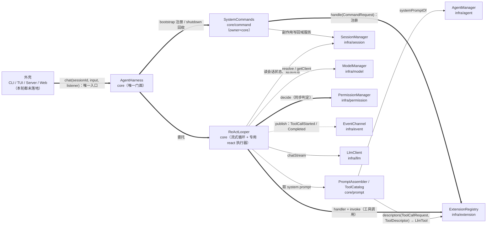

# ReAct 模块落地方案

> 状态：**口径已全部裁决**（见 §11 裁决记录），本文档为落地依据。
> 范围：交付 `core/prompt`（提示词与上下文组装 + 机械裁剪 + pending todo 注入）、`core/ReActLooper`（**流式**驱动的思考 → 行动 → 观察循环，异步可取消）、`core/command/SystemCommands`（系统命令）、`infra/config` 的 `react` 配置段、`infra/session` 的 pending todo 运行态、`AgentHarness` 唯一门面方法，以及单测 + 文档同步；
> **不接**任何外壳（CLI / TUI / Server / Web 仍未落地）、**不做**摘要式压缩（`/compact`）、**不做**会话持久化、**不做**人工审批通道、**不做**插件配置热更新、**不做** `infra/metrics`、**不做**跨语言脚本模块。

## 0. 口径草案与裁决状态

| # | 事项 | 口径 | 落地含义 | 裁决 |
| --- | --- | --- | --- | --- |
| 1 | 本轮是否含 CLI 外壳 | **不含** | core 交付可单测驱动的完整循环；`main` / `Launcher` / `mode` 另开轮 | **已裁决：不含** |
| 2 | LLM 调用形态 | **流式** | `ReActLooper` 走 `LlmClient.chatStream`；文本 / 思考增量实时回调；工具调用只取流结束后的最终聚合结果 | **已裁决：流式** |
| 3 | 门面线程形态 | **异步 + 可取消** | `AgentHarness.chat(...)` 立即返回 `ReActTurn`；`cancel()` / `await()`；专用 `react` 执行器 | **已裁决：要取消** |
| 4 | 门面入口数量 | **唯一**：`AgentHarness.chat(sessionId, input, listener)` | `ReActLooper` / `SystemCommands` 不进 `JellyfishComponent` 对外暴露 | **已裁决：唯一门面** |
| 5 | 工具失败语义 | 权限拒绝 / 未知工具 / 工具异常**一律作为 tool 结果消息回灌**，循环继续；只有 LLM 调用失败才抛 | 与 agent 方案 L4「未知工具归 `ReActLooper` 的 `NO_HANDLER`」闭环 | **已裁决：按推荐** |
| 6 | 系统命令 | **纳入本轮**：`/help` `/new` `/session` `/resume` `/model` `/agent` `/mode` `/status` `/usage` `/todo` | `owner = "core"`，与插件命令同源同一份注册表；`/exit` 归外壳 | **已裁决：纳入** |
| 7 | `/clear` | **不做** | 清空上下文的正解是 `/new` 开新会话 | **已裁决：不做** |
| 8 | pending todo | **本轮落地**：会话态字段 + `/todo` 命令 + 注入 system prompt | 注入**不写回**会话历史 | **已裁决：做** |
| 9 | `todo_write` 核心工具 | **后续做**（已记 TODO） | 与 `ReadOnlyTools`「核心工具只读声明」TODO 同批闭环 | **已裁决：后做** |
| 10 | 上下文裁剪 | **机械裁剪**（读法 1）：只裁本次发给 LLM 的 prompt（system + 历史 + 注入），**会话历史一条不动** | 预算 = `contextLength - maxOutputTokens - contextReserveTokens` | **已裁决：读法 1** |
| 11 | 摘要式压缩（读法 2） | **后续做**（已记 TODO），随 `/compact` 落地 | 需额外 LLM 调用 + 摘要写回，复杂度高 | **已裁决：后做** |
| 12 | 配置段 | `jellyfish.json` 新增 `react` 段：`maxRounds` / `contextReserveTokens` / `maxToolOutputChars` | 走既有双源合并，项目级整对象覆盖 | **已裁决：加配置** |
| 13 | 系统提示词为空 | **不下发** system prompt，不内置默认提示词 | 与 `LlmClients.isNotBlank(request.getSystemPrompt())` 的既有判断一致 | **已裁决：按推荐** |
| 14 | 事件 | **不新增事件** | 每轮可见性用既有 `SessionMessageAppendedEvent`；工具埋点用既有 `ToolCallStartedEvent` / `ToolCallCompletedEvent` | 默认 |
| 15 | `/resume` 跨进程 | **仅进程内** | 会话是纯内存态；跨进程恢复等持久化轮，帮助文案写明 | 默认 |
| 16 | 命令副作用回读 | 结果只承载文本，副作用写回域服务 | 对齐命令域 Q13 | 默认 |
| 17 | `AGENTS.md` / `README.md` | 本轮一并更新（§5） | 文档与实现同批交付 | 默认 |

## 1. 现状基线（实测）

- `jellyfish-core/.../core/ReActLooper.java` 是**空壳**（只有一个空类）；`core/prompt/` 是**空目录**。
- `LlmClient` 已提供 `chat` / `chatStream` / `cancel` 能力：`chatStream(request, listener)` 返回 `LlmStreamHandle`，流任务跑在 `llm-stream` 守护线程池；`LlmStreamListener.onComplete(LlmResponse)` 给出**聚合后的完整结果**（含工具调用），`onError` / `onCancelled` 与 `onComplete` 互斥。
- `ModelManager` 只做解析与路由，**不持有当前态**：`resolve(provider, model)` / `resolveDefault()` → `ResolvedModel`，`getClient(ResolvedModel)` → `LlmClient`。
- `SessionManager` 已提供 `create` / `createDefault` / `current` / `require` / `switchTo` / `close` / `all` / `appendMessage` / `updateTitle` / `bindAgent` / `switchModel` / `setPermissionMode` / `messagesOf` / `llmMessagesOf`；会话内含 `agentId` / `provider` / `model` / `permissionMode` / `SessionUsage`。
- `PermissionManager.decide(PermissionCheckRequest)` 是内核唯一同步判定入口，**不会返回 ASK**（未落地时降级为 DENY）。
- `ExtensionRegistry` 已提供 `handlers` / `handler` / `bindings` / `invoke` / `descriptors` / `descriptorBindings`；工具描述符 `ToolDescriptor` 随 handler 落表，**无需第二份工具目录**。
- `AgentManager` 提供 `systemPromptOf(agentId)`（原文）/ `policyOf` / `find` / `require` / `resolveDefault` / `all` / `getDefaultAgentId`。
- `JellyfishSettings` 当前**只有 `plugins` 段**；`mergeJellyfishSettings` 只合并插件段；`RuntimeSnapshot.empty()` 直接 `new JellyfishSettings(null)`。
- `Session` 当前**没有待办字段**（session 方案 Q16 明确「本轮不落字段」）；`appendMessage` 的持久化 TODO 仍在。
- `cli/di` 无 `CoreModule`；`JellyfishComponent` 已暴露 `commandManager()` / `permissionManager()` 等。
- `AgentHarness` 已固定六步启动顺序，并由 `AgentHarnessTest` 用 `InOrder` 钉住。

## 2. 目标态

### 2.1 依赖边（本轮新增 / 加固）



### 2.2 新增 / 改动文件清单

| 文件 | 改动 |
| --- | --- |
| `infra/config/ReactSettings.java` | 新增（`maxRounds` / `contextReserveTokens` / `maxToolOutputChars` + 默认值） |
| `infra/config/JellyfishSettings.java` | 改：新增 `react` 字段与 getter；构造器加参数；`isEmpty()` 同时看 `react.isDefault()` |
| `infra/config/RuntimeConfig.java` | 改：`mergeJellyfishSettings` 合并 `react`；新增 `getReactSettings()` |
| `infra/config/RuntimeSnapshot.java` | 改：`empty()` 传两个 `null` |
| `infra/session/PendingTodo.java` | 新增（不可变：`id` / `content` / `status` / `createdAt`） |
| `infra/session/Session.java` | 改：待办列表 + 会话内自增 id；包级读写方法 |
| `infra/session/SessionManager.java` | 改：`addTodo` / `completeTodo` / `clearTodos` / `todosOf`；更新持久化 TODO 措辞 |
| `infra/permission/ReadOnlyTools.java` | 改：TODO 措辞指向 `todo_write` 核心工具（行为不变） |
| `core/prompt/ToolCatalog.java` | 新增 |
| `core/prompt/TokenEstimator.java` | 新增 |
| `core/prompt/ContextWindow.java` | 新增 |
| `core/prompt/PromptAssembler.java` | 新增 |
| `core/ReActLooper.java` | 重写（流式循环 + 工具执行 + 取消 + 专用执行器） |
| `core/ReActListener.java` | 新增 |
| `core/ReActTurn.java` | 新增 |
| `core/ReActResult.java` | 新增 |
| `core/command/SystemCommands.java` | 新增 |
| `core/AgentHarness.java` | 改：注入 `ReActLooper` / `SystemCommands`；新增 `chat(...)`；bootstrap / shutdown 补步骤 |
| `cli/di/JellyfishComponent.java` | 不改（不加新访问器，保持唯一门面） |
| `AGENTS.md` / `README.md` | 同步（§5） |

**明确不改**：`jellyfish-api`（本轮零改动）、`ExtensionRegistry` / `TypeRegistry` / `EventChannel` / `PluginContext` / `PF4JPluginManager`、`PermissionManager` 判定语义、`ModelManager`、`AgentManager`、`CommandManager`、`LlmClient` 及其实现。

## 3. 设计细节

### 3.1 配置段 `react`

`ReactSettings`（用户可见 → `Settings` 结尾，不可变，缺省值在构造器内落地）：

```java
public class ReactSettings {
    private static final int DEFAULT_MAX_ROUNDS = 16;
    private static final int DEFAULT_CONTEXT_RESERVE_TOKENS = 1024;
    private static final int DEFAULT_MAX_TOOL_OUTPUT_CHARS = 20000;
    // maxRounds / contextReserveTokens / maxToolOutputChars，<= 0 时取默认值
    public boolean isDefault(); // 三项都等于默认值
}
```

`JellyfishSettings` 构造器变为 `(PluginsSettings plugins, ReactSettings react)`，两者都可为 `null`（按默认处理）。合并规则沿用「项目级整对象覆盖」：项目级 `react` 非空则整体替换全局级，否则回退全局级，两者都缺省则用默认值。

```json
"react": {
  "maxRounds": 16,
  "contextReserveTokens": 1024,
  "maxToolOutputChars": 20000
}
```

### 3.2 `core/prompt`

| 类 | 职责 | 不做 |
| --- | --- | --- |
| `TokenEstimator` | 近似 token 估算：CJK 字符按 1 token、其余按 0.25 token；每条消息加固定格式开销 | 不引入第三方 tokenizer |
| `ContextWindow` | 按预算裁剪消息，成组保留（assistant 带 tool_calls 与其 tool 结果同生共死），返回「裁剪后消息 + 是否截断」 | 不修改会话历史 |
| `ToolCatalog` | `descriptors(ToolCallRequest.class, ToolDescriptor.class)` → `List<LlmTool>`，无缓存 | 不建第二份工具目录 |
| `PromptAssembler` | 组装 `systemPrompt`（agent 原文 + 待办块）与 `LlmRequest`（模型 / system / 裁剪后消息 / tools / maxTokens） | 不发事件、不写会话 |

**裁剪算法**（`ContextWindow.crop`）：

1. 计算预算 `budget = model.contextLength - model.maxOutputTokens - contextReserveTokens`；
   `contextLength <= 0`（未配置）时**不裁剪**，直接返回全量。
2. `historyBudget = budget - estimate(systemPrompt)`；若 `historyBudget <= 0`，只保留最新一组。
3. 把消息切成「组」：`assistant(toolCalls) + 紧随的 tool 结果` 为一组，其余消息各自成组。
4. 从**最新组**向最旧累加：加入下一组会超预算且已保留非空 → 停止并置 `truncated = true`；**最新一组永远保留**。
5. 若最新一组本身超预算：保留但截断单条正文到剩余预算内，并加省略标记。

**注入口径**：`systemPrompt = agent 原文 + "\n\n[待办]\n- [ ] ...\n- [x] ..."`；待办为空则只留 agent 原文；两者都为空则 `systemPrompt = null`（不下发）。

### 3.3 `ReActLooper`（流式 + 可取消）

依赖：`SessionManager` / `ModelManager` / `PermissionManager` / `ExtensionRegistry` / `EventPublisher` / `PromptAssembler` / `ReactSettings`。

**执行器**：`ReActLooper` 自持一个专用守护线程池（命名为 `react`，有界），**不复用 `llm-stream`**——循环线程会阻塞等待流任务完成，同一线程池内互相等待会饿死。`ReActLooper` 实现 `AutoCloseable`，由 `AgentHarness.shutdown()` 收敛。
> 备注：不走 Dagger `@Named` 注入是为了避免给现有 `ExecutorService`（stream）加限定符、牵动 `LlmModule` 全部客户端创建器；专用执行器是循环的实现细节，不对外暴露。

**主流程**：

```
execute(turnId, sessionId, userInput, listener):
  1. session = sessionManager.require(sessionId)            // 失败 -> onError + 抛
  2. sessionManager.appendMessage(sessionId, user(input), null)
  3. for round in 1..maxRounds:
       若已取消 -> 返回 cancelled
       resolved = resolveModel(session)                     // 会话显式 provider/model，否则 resolveDefault()
       request  = promptAssembler.buildRequest(session, resolved)
       response = callStreaming(client, request, listener)  // 阻塞等本次流结束；文本/思考增量实时回调
       若被取消 -> 返回 cancelled
       appendMessage(assistant(content, toolCalls), response.usage)
       若 !response.hasToolCalls() -> 返回 completed(content)
       for call in response.toolCalls:
           若已取消 -> 返回 cancelled
           appendMessage(tool(executeTool(session, call)))
  4. 返回 truncated(可读提示)
```

**`callStreaming`**：内部 `LlmStreamListener` + `CountDownLatch`；`onText` / `onThinking` 直接转发给业务监听器；`onComplete` 记录 `LlmResponse` 并计数；`onError` 记录异常并计数；`onCancelled` 记录取消并计数。等待结束后：异常 → `onError` + 上抛；取消 → 返回取消态。

**`executeTool`**（判定顺序固定，失败一律回灌）：

```
toolCallId = call.id 或生成的 UUID
解析参数 JSON -> Map（ObjectMapperWrapper）；解析失败 -> 结果文本「参数解析失败」
publish ToolCallStartedEvent(toolCallId, toolName, sessionId)
start = now
try:
   decision = permissionManager.decide(agentId, toolName, args, mode, sessionId)
   若 denied -> 结果文本「权限拒绝：<reason>」
   否则:
     handler = extensions.handler(ToolCallRequest.class, toolName)
                （NO_HANDLER -> 结果文本「未知工具：<name>」；AMBIGUOUS -> 结果文本「工具注册冲突」）
     result  = extensions.invoke(handler, ToolCallRequest)
     output  = 序列化 result.output（字符串原样，其余 JSON）
catch Exception -> 结果文本「工具执行失败：<message>」
finally publish ToolCallCompletedEvent(toolCallId, toolName, success, 耗时, errorMessage, sessionId)
listener.onToolCallStarted / onToolCallCompleted
return truncate(output, maxToolOutputChars)
```

**assistant 消息归一**：`response.toolCalls` 中 `id` 为空白时补一个生成 id，保证 `LlmMessage.tool(...)` 能与其配对。

### 3.4 `ReActTurn` / `ReActListener` / `ReActResult`

```java
/** 一次 ReAct 回合的句柄。 */
public interface ReActTurn {
    String getTurnId();
    void cancel();          // 置取消标志 + 取消当前 LLM 流；循环在轮次/工具边界退出
    ReActResult await();    // 阻塞等待；失败抛 JellyfishException
    boolean isDone();
}

/** 流式回调：全部在 react 线程触发（单线程语义，调用方无需自行加锁）。 */
public interface ReActListener {
    default void onText(String delta) {}
    default void onThinking(String delta) {}
    default void onToolCallStarted(String toolCallId, String toolName) {}
    default void onToolCallCompleted(String toolCallId, String toolName, boolean success, String output) {}
    default void onComplete(ReActResult result) {}
    default void onCancelled() {}
    default void onError(Throwable error) {}
    ReActListener NOOP = new ReActListener() {};   // 便利常量
}

/** 回合结果。 */
public final class ReActResult {
    String sessionId; String content; int rounds; boolean truncated; boolean cancelled;
    static ReActResult completed(...); static ReActResult truncated(...); static ReActResult cancelled(...);
}
```

### 3.5 pending todo（`infra/session`）

`PendingTodo`（不可变值对象）：

| 字段 | 说明 |
| --- | --- |
| `id` | 会话内自增编号（字符串），`/todo done <id>` 用；清空后不复用编号 |
| `content` | 待办内容 |
| `status` | `PENDING` / `DONE` |
| `createdAt` | 创建时间戳 |

`Session` 新增：待办列表（实例锁内读写）+ 自增序号；包级 `addTodo` / `completeTodo` / `clearTodos` / `getTodos`（快照）。
`SessionManager` 新增：`addTodo(sessionId, content)` / `completeTodo(sessionId, todoId)` / `clearTodos(sessionId)` / `todosOf(sessionId)`。
**不发事件**（与「会话切换不发事件」一致）；持久化仍走将来的同步扩展点（TODO 保留）。

### 3.6 `core/command/SystemCommands`

- 构造注入 `CommandManager` / `SessionManager` / `ModelManager` / `AgentManager` / `ExtensionRegistry`。
- `register()`：逐条 `extensions.handle("core", CommandRequest.class, name, descriptor, handler, RegisterOptions.DEFAULT)`，返回的 `Subscription` 收集起来。
- `close()`：关闭全部 `Subscription`（`AgentHarness.shutdown()` 调用）。
- 命令名即路由键，别名与用法随 `CommandDescriptor` 落表（不含名字）。

| 命令 | 别名 | 行为 |
| --- | --- | --- |
| `/help [命令]` | `/h` `/?'` | 无参调 `renderHelp()`；带参调 `renderHelp(name)` |
| `/new` | | `createDefault()` + `switchTo(sessionId)` |
| `/session` | `/sessions` | 列出全部会话，标记当前 |
| `/resume <id>` | | `switchTo(id)`；未命中返回 `ERROR` |
| `/model [名]` | | 无参列出 `provider/model`；带参 `provider/model` 或裸模型名（跨 provider 取首个匹配）→ `switchModel` |
| `/agent [id]` | `/a` | 无参列出；带参 `require(id)` 校验后 `bindAgent` |
| `/mode [plan\|normal]` | | 无参显示；带参 `setPermissionMode` |
| `/status` | | 当前会话概要：sessionId / provider / model / agentId / 权限模式 / 消息数 / token 累计 |
| `/usage` | `/cost` | 当前会话 `SessionUsage` |
| `/todo [add\|done\|clear]` | | 无参列列表；`add <文本>` 用 `raw`；`done <id>`；`clear` |

`/exit` `/quit` **不进注册表**（外壳职责）。所有处理器返回 `CommandResult`，副作用写回域服务。

### 3.7 `AgentHarness` 接线

- 构造器新增 `ReActLooper` / `SystemCommands`（Dagger 自动装配）。
- `bootstrap()`：在 `eventChannel.start()` 之后新增 `systemCommands.register()`，其余六步顺序不变；核心命令先于插件注册，插件若要覆盖同名命令必须显式声明 `override`。
- 新增唯一门面方法：`public ReActTurn chat(String sessionId, String userInput, ReActListener listener)`，直接委托 `ReActLooper`。
- `shutdown()`：先 `reactLooper.close()`（停新回合、收敛执行器），再 `systemCommands.close()`，再 `pluginManager.close()`，最后 `eventChannel.close()`；各步用 `try/finally` 保证收敛。

### 3.8 事件

本轮**不新增事件**。每轮可见性由 `SessionMessageAppendedEvent`（`appendMessage` 内已发）覆盖；工具埋点用 `ToolCallStartedEvent` / `ToolCallCompletedEvent`（被拒 / 未知 / 异常也发 `Completed(success=false)`，便于订阅方统一记账）。

## 4. `AGENTS.md` / `README.md` 同步清单

| 位置 | 改为 |
| --- | --- |
| 架构图 `ReAct Loop` 节点 | 补「流式 / 可取消 / 唯一门面 `AgentHarness.chat`」 |
| 架构图 `SessionMgr ==> ExtReg` | 措辞改为「会话持久化（pending todo 注入已落在 `core/prompt`）」 |
| 代码结构 `core/` | 补 `prompt/`（`PromptAssembler` / `ToolCatalog` / `ContextWindow` / `TokenEstimator`）与 `command/SystemCommands` |
| 代码结构 `infra/session/` | 补「pending todo 运行态」 |
| 代码结构 `infra/config/` | 补 `ReactSettings(react 段)` |
| `command方案` 里「系统命令待落地」 | 标注 **已由 ReAct 轮闭环**，并保留 `todo_write` / `/compact` 后续项 |
| `AGENTS.md` 已知 TODO 段 | 补 `todo_write`（含 `ReadOnlyTools` 核心工具只读声明）、`/compact` 摘要压缩、CLI 外壳 |
| `README.md` | `jellyfish.json` 示例补 `react` 段与字段说明 |

## 5. 测试计划

| 测试类 | 覆盖点 |
| --- | --- |
| `ReactSettingsTest` | 默认值、缺省/非法值回退、`isDefault()`、getter |
| `JellyfishSettingsTest`（改） | 构造器两参、`react` 缺省、`isEmpty` 含 `react` |
| `RuntimeConfigTest`（改） | `react` 双源合并：项目级整对象覆盖 / 回退全局 / 都缺省用默认 |
| `PendingTodoTest` | 不可变、`PENDING`/`DONE` 工厂、`createdAt` |
| `SessionTest`（改） | 待办自增 id、追加顺序、`completeTodo` 幂等/未命中、`clearTodos`、快照不可变 |
| `SessionManagerTest`（改） | 四个写入口的会话不存在抛错、返回值、按会话隔离 |
| `TokenEstimatorTest` | CJK / 非 CJK / 空串 / 混合；消息级估算含工具调用参数 |
| `ContextWindowTest` | 未配 `contextLength` 不裁剪；按组保留不拆散 assistant+tool；最新组永远保留；超预算截断；空历史 |
| `ToolCatalogTest` | 描述符 → `LlmTool` 字段映射、顺序、空注册表、无描述符 |
| `PromptAssemblerTest` | systemPrompt = agent 原文 + 待办块；agent/待办皆空 → `null`；`LlmRequest` 的 model/maxTokens/tools/messages |
| `ReActLooperTest` | ① 纯文本一轮返回；② 一次工具调用后返回；③ 多工具顺序执行；④ 权限拒绝回灌；⑤ 未知工具回灌；⑥ 工具抛异常回灌 + 失败事件；⑦ 超轮次 `truncated=true`；⑧ usage 落会话；⑨ assistant/tool 消息顺序与 `toolCallId` 配对；⑩ 取消：`cancel()` 后 `await()` 返回取消态且 `onCancelled` 触发；⑪ LLM 失败 → `onError` + `await()` 抛 |
| `SystemCommandsTest` | 十条命令的成功 / 无参 / 非法参数分支；副作用写回域服务；`close()` 后命令不可见 |
| `AgentHarnessTest`（改） | `bootstrap` 顺序含 `systemCommands.register()`；`shutdown` 顺序（looper → commands → plugin → channel）；`chat` 委托 |

约定：JUnit5 + Mockito，`@ExtendWith(MockitoExtension.class)`；`ReActLooperTest` 用真实 `ExtensionRegistry` + 真实 `TypeRegistry`（工具路由是核心价值），mock `LlmClient` / `SessionManager` 之外的重依赖，`await()` 驱动异步回合；`SystemCommandsTest` 用真实 `ExtensionRegistry` + 真实 `CommandManager`。

## 6. 实施阶段（每阶段结束都可编译、可测试）

| 阶段 | 内容 | 结束判据 |
| --- | --- | --- |
| P1 | `ReactSettings` + `JellyfishSettings` + `RuntimeConfig` 合并 + 单测 | `mvn -q -pl jellyfish-infra test` 相关用例全绿 |
| P2 | `PendingTodo` + `Session` + `SessionManager` + 单测 | session 全部用例全绿 |
| P3 | `core/prompt` 四件套 + 单测 | prompt 用例全绿 |
| P4 | `ReActLooper` + `ReActTurn` / `ReActListener` / `ReActResult` + 单测 | `ReActLooperTest` 全绿 |
| P5 | `SystemCommands` + 单测 | `SystemCommandsTest` 全绿 |
| P6 | `AgentHarness` 接线 + `AgentHarnessTest` 更新 + `AGENTS.md` / `README.md` + TODO 更新 | `AgentHarnessTest` 全绿，文档一致 |
| P7 | 全量 `mvn -q test` + JaCoCo 抽查 + 自查（`@author zcd`、`@param`/`@return`、无 Java 9+ API、无无用 import、认知复杂度） | 全量测试绿 |

## 7. 验收标准

1. `mvn -q test` 全绿；新增类行覆盖率 ≥ 90%（JaCoCo 报告人工核对）。
2. `AgentHarness` 的 ReAct 入口**只有** `chat(sessionId, input, listener)` 一个；`JellyfishComponent` 不新增 ReAct 相关访问器。
3. 工具失败三态（拒绝 / 未知 / 异常）都表现为 tool 结果消息，且循环继续；只有 LLM 调用失败上抛。
4. `cancel()` 能在「LLM 流进行中」与「工具执行之间」两个时点生效，`await()` 返回 `cancelled=true`。
5. 裁剪只作用于本次 `LlmRequest`：`Session.messages` 在裁剪前后条数不变。
6. pending todo 注入不写回历史：同一会话连续两轮，历史中不出现待办消息。
7. `react` 段缺省值生效，且项目级整对象覆盖全局级（有测试钉住）。
8. 系统命令经同一份 `ExtensionRegistry` 注册，`owner = "core"`；`close()` 后清单里不再出现。
9. 所有新增类 / 接口 / 私有方法 / 成员变量有文档注释，类注释带 `@author zcd`，注释解释「为什么」。
10. `AGENTS.md` 与 `README.md` 按 §4 更新完毕。

## 8. 已知限制与后续 TODO

| # | 限制 | 影响 | 后续 |
| --- | --- | --- | --- |
| L1 | **无 CLI / TUI / Server 外壳** | 端到端只能靠单测与将来的外壳 | 外壳轮（`main` / `Launcher` / `mode`） |
| L2 | **无摘要式压缩** | 长会话只能机械丢弃旧消息，信息会损失 | `/compact` 轮（读法 2），依赖持久化 |
| L3 | **无 `todo_write` 核心工具** | 模型不能自行维护待办，只能靠 `/todo` 命令 | 与 `ReadOnlyTools` 核心工具只读声明同批（预留 `plugins.configurations.core.readOnlyTools` 或把只读性迁到 `ToolDescriptor`） |
| L4 | **无会话持久化** | `/resume` 仅进程内；进程退出即丢 | 持久化轮（同步扩展点 + 插件） |
| L5 | **无人工审批通道** | `ASK` 继续降级为 `DENY` | 审批轮（依赖交互外壳） |
| L6 | **无插件配置热更新** | PLAN 白名单不随热部署刷新 | 配置热更新轮 |
| L7 | `react` 执行器规模为固定常量 | 无并发调参手段 | 真有压力时再配置化 |
| L8 | pending todo 无插件贡献通道 | 插件不能注入待办 | 随持久化 / 扩展点轮 |

代码内 TODO 落点：`ReadOnlyTools` 的 `todo_write` 说明、`SessionManager.appendMessage` 的持久化说明、`SystemCommands` 类注释的 `/compact` 说明。

## 9. 风险与缓解

| 风险 | 缓解 |
| --- | --- |
| 流式回调在 `react` 线程、工具执行也在 `react` 线程，监听器实现线程不安全 | 文档明确「全部回调单线程（`react` 线程）」；`ReActListener.NOOP` 供纯同步调用 |
| 循环线程等待流线程，若复用 `llm-stream` 会互相饿死 | 专用 `react` 执行器，与 `llm-stream` 隔离 |
| 裁剪把 assistant(toolCalls) 与 tool 结果拆散，导致请求非法 | 按组裁剪，组内同生共死；单测 ② 钉住 |
| 待办注入每轮重复落进历史，导致回放失真 | 注入只进 `systemPrompt`，不写回会话；验收 6 钉住 |
| 核心命令与插件命令同名 | 核心先注册；插件必须显式 `override` 才能覆盖，否则 `DUPLICATE_HANDLER` 立刻暴露 |
| 模型不返回 `toolCall.id` | `ReActLooper` 补齐生成 id，保证 tool 结果可配对 |
| `ReactSettings` 加入 `JellyfishSettings` 牵动既有测试 | 用两参构造器 + `null` 兜底，改动集中在 config 测试 |
| 工具输出过长撑爆上下文 | `maxToolOutputChars` 截断 + `ContextWindow` 兜底裁剪 |

## 10. 裁决记录

| # | 问题 | 结论 |
| --- | --- | --- |
| Q1 | 是否含 CLI 外壳 | **不含**，另开轮 |
| Q2 | 同步还是流式 | **流式** |
| Q3 | 系统命令范围 | **纳入**，含 `/session` `/resume` + 补充常用命令；不做 `/clear` |
| Q4 | 工具失败语义 | 拒绝 / 未知 / 异常一律回灌，循环继续 |
| Q5 | 上下文裁剪 | **做**，读法 1（机械裁剪本次 prompt） |
| Q6 | pending todo 注入 | **做**（会话态 + `/todo` + 注入 system prompt） |
| Q7 | 门面形态 | 唯一门面方法，**异步 + 可取消** |
| Q8 | 最大轮次 | **配置化**（`react.maxRounds`） |
| Q9 | 系统提示词为空 | 不下发，不内置默认 |
| Q10 | `todo_write` | **后续做**，已记 TODO |
| Q11 | 摘要式压缩（读法 2） | **后续做**，随 `/compact` |

## 11. 落地记录（P1～P7 完成）

| 阶段 | 内容 | 结果 |
| --- | --- | --- |
| P1 | `ReactSettings` + `JellyfishSettings`（两参构造）+ `RuntimeConfig.mergeJellyfishSettings` / `getReactSettings` + `RuntimeSnapshot.empty` | 完成；`ReactSettingsTest` / `JellyfishSettingsTest` / `RuntimeConfigTest` 全绿 |
| P2 | `PendingTodo` + `Session`（待办列表、自增 id）+ `SessionManager`（`addTodo` / `completeTodo` / `clearTodos` / `todosOf`） | 完成；`PendingTodoTest` / `SessionTest` / `SessionManagerTest` 全绿 |
| P3 | `core/prompt`：`TokenEstimator` / `ContextWindow` / `ToolCatalog` / `PromptAssembler` | 完成；四个测试类全绿 |
| P4 | `ReActLooper` + `ReActTurn` / `ReActListener` / `ReActResult` + 专用 `react` 执行器 + 流式/取消/失败回灌 | 完成；`ReActLooperTest` 10 个用例全绿 |
| P5 | `core/command/SystemCommands`（10 条系统命令，owner=core） | 完成；`SystemCommandsTest` 全绿 |
| P6 | `AgentHarness` 注入 `ReActLooper` / `SystemCommands`、`chat` 门面、启动注册与关闭回收；`AGENTS.md` / `README.md` / 类注释同步 | 完成；`AgentHarnessTest` 全绿 |
| P7 | 全量 `mvn -o clean test` | 全绿：api 101 + infra 609 + core 53 + cli 11 = **774** 个用例，0 失败 |

### 与文档的偏差（已确认口径一致）

1. **执行器不走 Dagger**：`ReActLooper` 自持专用守护线程池（线程名 `react`），未新增 `CoreModule`；理由见 §3.3。
2. **`PromptAssembler` 注入 `RuntimeConfig` 而非 `ReactSettings`**：`ReactSettings` 不是 Dagger 可注入类型，且每次现读 `getReactSettings()` 才能跟随配置热更新。
3. **`ReactSettings.contextReserveTokens` 用 `Integer` 收参**：区分「未配置」与「显式配 0」，避免缺省值被 0 覆盖。
4. **`Session.getTodos()` 为 public**：与 `getMessages()` 同口径的读路径，返回防御性不可修改快照；写方法仍包级可见。
5. **`ContextWindow` 超预算的最新组按「组内条数平均分配预算」截断正文**，工具调用参数不截断（保证请求合法）。

### 遗留（后续轮）

- `todo_write` 核心工具 + `ReadOnlyTools` 核心工具只读声明；
- `/compact` 摘要式压缩（读法 2）；
- CLI / TUI / Server 外壳（`main` / `Launcher` / `mode`）；
- 会话持久化同步扩展点、人工审批通道、插件配置热更新、`infra/metrics`、跨语言脚本模块。
