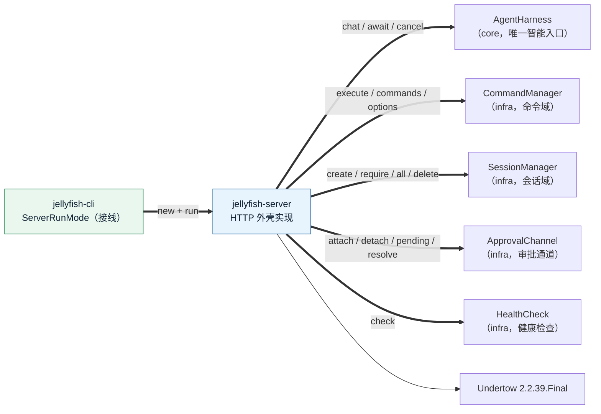

# Server 模式落地方案（HTTP 服务外壳）

> 状态：**已全部落地**（P0～P8，见 §15）。口径裁决见 §12。
> 范围：交付 `jellyfish-server` 模块、`-server` 的 `ServerRunMode` 真实现、REST + SSE 接口面、HTTP 化的人工审批、生命周期与关闭、单测与端到端冒烟、文档同步。
> 交叉引用：`cli方案.md` §0.3 / §10.4（S1～S6）是本方案的底稿；本文档取代其中「`-server` 只落占位」的陈述。
> **不动** `jellyfish-api` 的任何生产代码。允许的最小内核改动见 §9（`ObjectMapperWrapper` 补 I/O 方法、`JellyfishComponent` 补 getter、`SessionBootstrap` 增加 SERVER 分支），都是「外壳接入内核」必需的接缝，不改变任何既有语义。

---

## 0. 目标与范围

`-server` 是「同一个进程的第三种外壳」：与 `-cli` / `-tui` 共用 `main`、DI 装配、`AgentHarness` 与 `CommandManager`，只把「输入从哪来、结果往哪去」从终端换成 HTTP。

**首轮做**：会话 CRUD、流式对话（SSE）、命令执行与清单 / 候选、取消在途回合、HTTP 化人工审批、健康检查、绑定地址与端口。

**首轮不做**（见 §13）：API key / token 鉴权、自带 Web 前端、TLS、`/metrics`、多用户与权限隔离。

| 能力 | 首轮 | 后续轮 |
| --- | --- | --- |
| 会话 CRUD + 对话（SSE） | ✅ | |
| 命令执行 / 清单 / 候选 | ✅ | |
| 取消进行中回合 | ✅ | |
| HTTP 化人工审批 | ✅ | |
| 健康检查 | ✅ | |
| API key / token 鉴权 | ❌ | 单开一轮 |
| 自带 Web 前端 | ❌ | 明确不做 |
| TLS / 反向代理整合 | ❌ | 交给部署侧 |

---

## 1. 前置验证（已完成，D1 门槛）

**结论：Undertow `2.2.39.Final` 在 JDK 1.8 下可用，选定它。**

实测（本机 `1.8.0_504`，Temurin）：编译通过 → 起服务 → 阻塞 handler 应答 JSON → `text/event-stream` 分帧逐帧 flush 成功 → `stop()` 干净退出。`io/undertow/Undertow.class` 的 class 主版本号 = **52（Java 8）**。

| 项 | 值 |
| --- | --- |
| 版本 | `io.undertow:undertow-core:2.2.39.Final` |
| 传递依赖 | `jboss-logging 3.4.1` / `xnio-api 3.8.16` / `xnio-nio 3.8.16` / `jboss-threads 3.5.1` / `wildfly-common 1.5.4` / `wildfly-client-config 1.0.1` |
| 与 `javax`/`jakarta` 的关系 | **无关**：本方案只用 `undertow-core` 自带的 `HttpHandler`，不引 `undertow-servlet`，因此「2.3.0 起迁到 `jakarta.*`」这条坑不适用 |

**为什么必须先验证再定模块**：`cli方案.md` 记录的 `undertow.version = 2.4.3.Final` 不可用（要求 Java 11），2.2.x 是对应 Java 8 的维护线但**官方未显式承诺末版仍支持 Java 8**。冒烟过了才敢把版本写进父 POM——这与 TUI 轮先验 TamboUI 的做法一致。

---

## 2. 模块划分与依赖边

新建 `jellyfish-server`，`jellyfish-cli` 加一条依赖；`ServerRunMode` 留在 `jellyfish-cli` 只做接线（与 `TuiRunMode` 完全对称）。**不把 `ServerRunMode` 放进 `jellyfish-server`**：`RunMode` / `StartupOptions` / `ExitCodes` 都定义在 cli，放进去会形成 `cli → server → cli` 循环。



**只有「外壳 → 内核」的调用，没有反向边**：`jellyfish-server` 不注册扩展点、不发事件、不碰注册表。内核不知道 HTTP 存在。

### 2.1 包结构

```
jellyfish-server/src/main/java/zcd/jellyfish/server/
├── JellyfishServer.java        # Undertow 启动 / 路由装配 / 停止 / 阻塞
├── ServerConfig.java           # 绑定 host / port / 并发与体积上限（由 StartupOptions 映射）
├── SessionTurns.java           # 每会话在途回合表：并发控制 + 取消
├── SseReActListener.java       # ReActListener → SSE 事件（react 线程只入队）
├── ApprovalBridge.java         # 审批通道 ↔ HTTP：头槽位发现、事件构造、裁决
├── http/
│   ├── Router.java             # 方法 + 路径模板 → handler
│   ├── JsonBody.java           # 请求体读取与 DTO 反序列化（走 ObjectMapperWrapper）
│   ├── Responses.java          # JSON / 空体 / 错误状态码的统一写出
│   ├── ApiException.java       # 带 HTTP 状态码的受检异常
│   └── SseWriter.java          # SSE 分帧、flush、keepalive、断连探测
├── handler/
│   ├── SessionHandlers.java    # POST/GET/DELETE /sessions*
│   ├── ChatHandler.java        # POST /sessions/{id}/chat（SSE）
│   ├── CommandHandlers.java    # /commands*、/sessions/{id}/commands
│   ├── ApprovalHandlers.java   # GET /approvals、POST /approvals/{id}
│   └── HealthHandler.java      # GET /health
└── dto/                        # HTTP 合同 DTO（请求 + 响应），server 私有
```

### 2.2 依赖

`jellyfish-server/pom.xml`：`jellyfish-api` + `jellyfish-infra` + `jellyfish-core`（与 tui 同构）+ `io.undertow:undertow-core`（版本走父 POM 的 `undertow.version`）。

父 POM：把 `undertow.version` 从 `2.4.3.Final` 改成 `2.2.39.Final`，并加注释说明「2.3.0 起要求 Java 11 且迁 `jakarta.*`」这条边界（与 `commonmark.version` 的注释同风格）。新增 `jellyfish-server` module。

---

## 3. 对外接口面

### 3.1 端点表

| 方法 | 路径 | 请求体 | 成功响应 | 说明 |
| --- | --- | --- | --- | --- |
| `POST` | `/sessions` | `CreateSessionRequest` | 201 `SessionDetail` | 建会话；body 字段全可选，缺省取 `--agent/--model/--mode`，再退内核默认 |
| `GET` | `/sessions` | — | 200 `SessionSummary[]` | 会话摘要列表（**不含**消息正文） |
| `GET` | `/sessions/{id}` | — | 200 `SessionDetail` | 完整快照（含消息与用量），供前端渲染历史 |
| `DELETE` | `/sessions/{id}` | — | 204 | 删除（含插件持久化） |
| `POST` | `/sessions/{id}/chat` | `ChatRequest` | 200 `text/event-stream` | 流式对话，**恒为 SSE**（D2） |
| `POST` | `/sessions/{id}/cancel` | — | 200 `CancelResult` | 取消该会话在途回合 |
| `POST` | `/sessions/{id}/commands` | `CommandExecRequest` | 200 `CommandResultDto` | 执行命令（原文或结构化） |
| `GET` | `/commands` | — | 200 `CommandInfoDto[]` | 结构化命令清单（前端菜单用） |
| `GET` | `/commands/{name}/options` | — (query `sessionId`) | 200 `CommandChoiceDto[]` | 候选值；无候选返回 `[]` |
| `GET` | `/approvals` | — | 200 `ApprovalDto` / 204 | 当前**头槽位**待审批项（供晚到的客户端 / 轮询） |
| `POST` | `/approvals/{requestId}` | `ApprovalDecisionRequest` | 204 / 404 | 批准或拒绝 |
| `GET` | `/health` | — | 200 `HealthDto` | 复用 `HealthCheck`，三档 UP/WARN/DOWN |

**`POST /sessions` 不做幂等去重**：每次调用都建新会话（与 `/new` 一致）；前端需要「回到旧会话」就存 id 或用 `GET /sessions`。启动期**不预建会话**（§5.3）。

### 3.2 请求 / 响应 DTO

全部为 `jellyfish-server` 私有类型，与内核模型解耦——HTTP 合同不随 `Session` / `CommandInfo` 加字段而漂移。

```
CreateSessionRequest   { agentId?, provider?, model?, permissionMode? }
ChatRequest            { message }                    // 空白 message → 400
CommandExecRequest     { input? , name?, args?[] }    // 二选一；都给 → 400
ApprovalDecisionRequest{ approved }                   // 必填布尔

SessionSummary         { sessionId, title?, agentId?, provider?, model?,
                         permissionMode, createdAt, updatedAt,
                         messageCount, usage: UsageDto }
SessionDetail          { ...Summary..., messages: MessageDto[], compaction?: CompactionDto }
MessageDto             { messageId, timestamp, role, content?, thinking?,
                         toolCallId?, toolCalls?: ToolCallDto[], usage?: UsageDto }
UsageDto               { promptTokens, completionTokens, totalTokens, llmCalls }
CommandInfoDto         { name, summary?, usage?, aliases[] }
CommandResultDto       { kind: "OK"|"ERROR"|"UNKNOWN", output?, choices: ChoiceDto[] }
ChoiceDto              { value, label, description?, selected }
ApprovalDto            { requestId, sessionId?, agentId?, toolName, arguments?,
                         mode?, reason?, timestamp }
CancelResult           { cancelled }                  // 无在途回合时 false
HealthDto              { status: "UP"|"WARN"|"DOWN", healthy, results: [{name,level,detail?}] }
```

`SessionDetail` 直接由 `SessionSnapshots.capture(session)` 投影（api 侧快照），再补 `messages` 的 HTTP 形状；`SessionSummary` 由 `Session` getter 直读。**不把 `Session` / `CommandInfo` 直接序列化出去**。

### 3.3 错误模型

统一错误体：`{ "error": "<CODE>", "message": "<可读中文>" }`。可读文案来自 `JellyfishException.getMessage()`，不透传栈。

| 状态码 | CODE | 触发 |
| --- | --- | --- |
| 400 | `BAD_REQUEST` | body 非法 JSON / 必填缺失 / 空白 message / 命令名与原文都给 |
| 400 | `NOT_A_COMMAND` | `/commands` 的 `input` 不以 `/` 开头（保留 `isCommand` 分流语义，提示改用 `/chat`） |
| 404 | `SESSION_NOT_FOUND` | 会话 id 不存在（`SessionManager.require` 抛） |
| 404 | `COMMAND_NOT_FOUND` | 命令名未注册（`CommandResult.Kind.UNKNOWN`） |
| 404 | `APPROVAL_NOT_FOUND` | 该 `requestId` 不是当前头槽位，或已被裁决 |
| 405 | `METHOD_NOT_ALLOWED` | 路径匹配但方法不符 |
| 409 | `TURN_IN_PROGRESS` | 该会话已有在途回合（§5.2） |
| 413 | `PAYLOAD_TOO_LARGE` | 请求体超 `maxBodyBytes` |
| 500 | `INTERNAL_ERROR` | 其它 `JellyfishException` / 未捕获异常（打 ERROR 日志） |
| 503 | `TOO_MANY_STREAMS` | 并发 SSE 连接数超 `maxStreams` |

**命令执行的三态映射**：`CommandResult.Kind` 原样进 `CommandResultDto.kind`——`ERROR` 是**业务失败**（命令存在但这次没成），不是传输失败，故：

- `OK` / `ERROR` → **200** + `CommandResultDto`（与 CLI 的语义一致）。
- `UNKNOWN` → **404 `COMMAND_NOT_FOUND`** + `CommandResultDto`（前端要能一眼区分「命令不存在」与「命令执行失败」）。

---

## 4. SSE 协议

### 4.1 帧格式

严格 SSE：`event: <类型>\ndata: <JSON>\n\n`。每条 `data` 是单行 JSON（禁止内嵌裸换行；文本里的换行由 JSON 转义承担）。

### 4.2 事件类型

| `event` | 载荷 | 对应 `ReActListener` |
| --- | --- | --- |
| `turn_start` | `{ turnId, sessionId }` | 回合受理后立刻发 |
| `text` | `{ turnId, delta }` | `onText` |
| `thinking` | `{ turnId, delta }` | `onThinking` |
| `tool_start` | `{ turnId, toolCallId, toolName }` | `onToolCallStarted` |
| `tool_done` | `{ turnId, toolCallId, toolName, success, output }` | `onToolCallCompleted` |
| `approval_required` | `ApprovalDto` | **无回调**，由 §6 的头槽位轮询发现 |
| `approval_resolved` | `{ requestId }` | 同上，头槽位消失时发一次 |
| `done` | `{ turnId, sessionId, content?, rounds, truncated }` | `onComplete`（`truncated=false`） |
| `cancelled` | `{ turnId, sessionId, rounds }` | `onCancelled` |
| `error` | `{ turnId, code, message }` | `onError` |

`done` / `cancelled` / `error` 是**终态帧**，写出后流即结束（`endExchange`）。`tool_done.output` 是回灌给模型的同一份文本（可能被 `ToolOutputLimiter` 截断为信封）——前端可原样展示，这是唯一真相。

### 4.3 keepalive 与断连

- 空闲超过 `keepaliveSeconds`（缺省 15）时写 `: keepalive\n\n` 注释帧，防中间代理按空闲断流（LLM 单轮可能静默数十秒）。
- **客户端断连即取消回合**：写帧失败（`IOException`）→ `turn.cancel()` → 结束流。若此时正卡在审批等待，额外 `ApprovalBridge.rejectOnDisconnect(requestId)`（§6.4），否则 react 线程会一直阻塞到审批超时。

---

## 5. 会话与并发模型

### 5.1 显式会话寻址，不依赖 `current()`

`SessionManager.current()` 是**进程级单指针**，多客户端 HTTP 下不成立。Server 一律按 path 里的 `sessionId` 显式寻址：

- 对话：`AgentHarness.chat(sessionId, message, listener)`（`ReActLooper` 内部已 `require(sessionId)`，不读 `current()`）。
- 命令：`CommandManager.execute(input, sessionId)` / `execute(name, args, sessionId)`。
- 候选：`CommandManager.options(name, sessionId)`。

**已核查的残留**：`SystemCommands` 里 `/model` `/agent` `/mode` 的「选中项标记」与候选（`renderModels` / `renderAgents` / `modelChoices` / `agentChoices` / `modeOptions`）只读 `current()`。Server 若从不 `switchTo`，`current()` 恒为 `null`，这些标记退化为「无标记」——**外观问题，不是正确性问题**。首轮接受并记录，不为此改内核（改它要动 `CommandOptionRequest` 的候选路径，收益仅是一个星号）。

唯一会写全局指针的是 `/resume` 与 `/new`；Server 执行它们会改 `current()`，但 Server 自身从不读它，因此无副作用——**不建议前端在 Server 模式下用 `/resume`**（用 `GET /sessions` + path 寻址即可），文档写明。

### 5.2 一会话一在途回合

同一会话并发两个回合会把消息历史交错写坏（`ReActLooper.execute` 是先 append 用户消息再循环）。用 `SessionTurns` 做串行化：

```
SessionTurns: ConcurrentHashMap<String, ReActTurn>
take(sessionId, turn):
    先清理已 done 的旧条目
    previous = map.putIfAbsent(sessionId, turn)
    previous != null && !previous.isDone()  → 抛 409 TURN_IN_PROGRESS
    （previous 已 done 时 replace 掉）
release(sessionId, turnId): 仅当表里仍是自己的 turn 才移除
cancel(sessionId): 有在途则 cancel()，返回是否真的取消
```

- 跨会话并发**不限制**（各占一个 react 线程，池上限由内核 `react` 线程池决定）。
- 回合终结（终态帧写出 / 写失败 / 取消）时 `release`，放行下一条。
- 这样「同一会话的消息历史」与「同一会话的 SSE 流」都天然串行。

### 5.3 启动期不建会话

`Launcher` 现在对所有已实现模式都跑 `SessionBootstrap.ensureCurrentSession`，会让 Server 启动时凭空落一个空会话文件（`create` 会立即持久化）。改动：

- `SessionBootstrap.deferCreation` 对 `SERVER` **恒真**：Server 启动时一个会话都不建，等 `POST /sessions`。
- `--session` 在 `-server` 下判**用法错误**（退 2）：Server 的会话由 HTTP path 寻址，启动参数指向单个会话没有意义。
- `--agent` / `--model` / `--mode` 在 `-server` 下**不落到某个会话**，而是作为 `CreateSessionRequest` 缺省字段；校验（存在性）仍在 `SessionBootstrap.requireAgentExists` / `requireModelExists`（启动期就报错，别等第一个请求）。

---

## 6. 审批的 HTTP 化（D7）

### 6.1 语义来源

`ApprovalChannel` 已经是「react 线程同步等待、外壳读取裁决」的现成交接点，且天然是**全局单槽位 + 队列**：`pending()` 只返回头槽位，`resolve(id, approved)` 只对头生效，`MAX_WAITING=8`。TUI 的做法是**每帧轮询 `pending()`**。Server 沿用同一套语义，**不改 `ApprovalChannel`**。

### 6.2 挂载

`ServerRunMode.run()` 在启动 HTTP 前 `approvals.attach()`，停止时 `approvals.detach()`（与 `TuiRunMode` 完全对称）。attach 之前/之后的 `ASK` 都走原有 fail-closed 路径（无审批者一律拒绝）。因此 Server 下「策略要求审批 → 真的等审批」，而不是直接拒绝——这是 D7 的实质变化。

### 6.3 三条投递路径（同一份事实，不是三份实现）

1. **SSE 内嵌**（主路径）：`ChatHandler` 的等待循环在每次 tick（keepalive 间隔）检查 `ApprovalBridge.headFor(sessionId)`；头槽位属于本会话且 `requestId` 尚未发过 → 发 `approval_required`；头槽位由本会话的请求变为别的值或消失 → 发一次 `approval_resolved`。**只有属于本会话的头槽位才发**（否则一个全局审批会广播到所有流）。
2. **`GET /approvals`**（补充路径）：返回当前头槽位（含其 `sessionId`），供晚到客户端、非 SSE 页面或轮询式前端。
3. **`POST /approvals/{requestId}`**：校验 `requestId` 就是当前头槽位且未被裁决 → `resolve(id, approved)` → 204；否则 404 `APPROVAL_NOT_FOUND`（`resolve` 本身对非头调用是静默 no-op，必须在外层给出可读状态）。

`ApprovalBridge` 收口这三条路径的公共逻辑：`headFor(sessionId)`、`toDto(Pending)`、`resolve(requestId, approved)`、`rejectIfPending(requestId)`。

### 6.4 断连与关闭

- **SSE 断连**：`rejectOnDisconnect` 在头槽位是「本会话刚发过的那条」时调 `resolve(id, false)`，把卡在审批等待的 react 线程立刻放行（否则要等 `permission.approvalTimeoutSeconds`，缺省 120 秒）。
- **服务停止**：`detach()` 一次性拒绝全部未决请求（已有语义），react 线程立即收敛。

### 6.5 已知局限（记录，不在首轮解决）

`ApprovalChannel` 是**全局单槽位**：会话 A 的审批未决时，会话 B 的审批只能排队，B 的回合会阻塞到 A 裁决或超时。这是多客户端下最可能被抱怨的一点，但修它要重新设计审批通道（每会话槽位或事件化），属于内核改动，**首轮明确不做**，在文档与 `GET /approvals` 的说明里注明「同一时刻只有一条待审批项」。

---

## 7. 流式实现与背压

### 7.1 单写者模型

**所有 socket 写都发生在 Undertow 的 handler 工作线程上**；react 线程只把事件投进队列：

```
ChatHandler（worker 线程）:
    startBlocking()
    turn = harness.chat(sessionId, message, listener)   // listener 只 offer 事件
    turns.take(sessionId, turn)                         // 冲突 → 409（在起流之前）
    写 turn_start
    loop:
        event = queue.poll(keepaliveSeconds)            // 单写者，无锁
        if event == null: 发 keepalive 注释; 检查审批头槽位; continue
        写 event
        if event.isTerminal(): break
    endExchange()
finally:
    turns.release(...)

SseReActListener（react 线程）: 构造 SseEvent → queue.offer
```

好处：输出流单写者、无需锁；客户端断连时 `write` 直接抛 `IOException`，天然成为取消信号。

**队列**：`LinkedBlockingQueue` 无界。理由：一轮的文本增量总量受模型输出上限约束，且消费者（worker 线程）始终在跑；有界队列在满时要么阻塞 react 线程（拖死回合）、要么丢事件（丢正文即错），两者都比「多占几 KB 内存」更糟。

### 7.2 线程与连接上限

handler 工作线程会被整轮占用（可达数分钟），因此：

- Undertow worker 线程数由 `ServerConfig` 配置（缺省 `max(8, CPU*2)`，可调）。
- `maxStreams`（缺省 16）用 `Semaphore` 封顶：拿不到许可直接 **503 TOO_MANY_STREAMS**，不排队。目的不是限吞吐，而是**防止工作线程池被长回合耗光后连 `/health` 都答不了**。
- `/health`、`/commands` 等短请求与 SSE 共用工作线程池，因此 `maxStreams` 必须显著小于工作线程数。

---

## 8. 生命周期

- `ServerRunMode.run()`：`JellyfishServer.start()` → `awaitShutdown()` → 返回退出码。**阻塞**直到收到停止信号。
- 停止信号有两条来源，都收进 `JellyfishServer`：JVM 关闭钩子（Ctrl+C / `kill`）与显式 `stop()`。
- **确定顺序**：`JellyfishServer` 自己注册关闭钩子，钩子里**先 `server.stop()`（停止接受新连接、收敛在途流）→ 再放行 latch**。`run()` 返回后 `Launcher` 的 `finally` 才调 `harness.shutdown()`。这样顺序是「先停 HTTP、再收内核」，不依赖两个 shutdown hook 的竞序。

```
Launcher.launch():
    harness.bootstrap()
    SessionBootstrap.ensureCurrentSession()   // SERVER 下不建会话（§5.3）
    mode.run()                                // ServerRunMode.run() 阻塞
                                              //   ├─ JellyfishServer.start()
                                              //   └─ awaitShutdown()
finally:
    harness.shutdown()                        // HTTP 已停，在途回合已收敛
```

- **端口占用 / 绑定失败**：`JellyfishServer.start()` 捕获 → 抛 `JellyfishException` → `Launcher` 归 `STARTUP_ERROR`（退 3），报可读理由（`-server 端口 9096 已被占用`），不刷栈。
- **启动日志**：`JellyfishServer` 用 `LOG.info` 打一行 `已监听 http://host:port（无鉴权，默认仅回环）`，让用户知道服务起来了。这行走 stderr（Log4j2 默认），不进 stdout。

---

## 9. 需要改动的既有代码

| 文件 | 改动 | 为什么必须 |
| --- | --- | --- |
| 父 `pom.xml` | `undertow.version` → `2.2.39.Final`；新增 `jellyfish-server` module | §1 已验证 |
| `jellyfish-infra/.../support/ObjectMapperWrapper.java` | 补 `readValue(byte[], Class)` / `writeValue(OutputStream, Object)`（或 `writeValueAsBytes`） | HTTP 读写是字节流；AGENTS 要求序列化统一走它，server 不得自己 `new ObjectMapper` |
| `jellyfish-cli/.../di/JellyfishComponent.java` | 补 `healthCheck()` getter | `GET /health` 需要 |
| `jellyfish-cli/.../SessionBootstrap.java` | `deferCreation` 增加 `SERVER` 分支；`--session` 在 SERVER 下报错 | §5.3 |
| `jellyfish-cli/.../Launcher.java` | `modeFor` 的 `SERVER` 分支改为构造真 `ServerRunMode`（注入 harness/commands/sessions/models/agents/approvals/healthCheck/console） | 接线 |
| `jellyfish-cli/.../mode/ServerRunMode.java` | 占位 → 真实现（`run()` 委托 `JellyfishServer`） | 主体 |
| `jellyfish-cli/.../StartupOptionsParser.java` | `-server` 下 `--session` 判用法错误；`--port`/`--host` 供 server 用 | §5.3 |
| `README.md` / `AGENTS.md` / `cli方案.md` | `-server` 从「尚未实现」改为「已落地」，补端点表与安全口径 | 文档同步 |

**不改**：`jellyfish-api`、`AgentHarness` / `ReActLooper` / `ReActListener`（接缝已足够）、`SessionManager`、`CommandManager`、`ApprovalChannel`、`PermissionManager`。

---

## 10. 实施计划（阶段）

| 阶段 | 内容 | 完成判据 |
| --- | --- | --- |
| P0 | Undertow 2.2.39.Final on JDK8 冒烟 | ✅ 已完成（§1） |
| P1 | 模块骨架 + 父 POM 版本 + cli 依赖；`ObjectMapperWrapper` 补 I/O；`JellyfishComponent.healthCheck()` | `mvn -q compile` 通过，Dagger 编译通过 |
| P2 | `http/`：`Router` / `JsonBody` / `Responses` / `ApiException` / `SseWriter` + `dto/` | 路由匹配、状态码映射、SSE 分帧被单测钉住 |
| P3 | 会话端点 + `SessionTurns` + `Launcher` / `SessionBootstrap` 的 SERVER 分支 | 启动不建会话；并发 chat → 409 被钉住 |
| P4 | `ChatHandler` + `SseReActListener` + cancel；SSE 全事件链 | 用 mock `AgentHarness` 断言事件序列与终态 |
| P5 | 命令端点（execute / list / options）+ 三态映射 | 端到端可跑 `/help`、`/session`（**无需 apiKey**） |
| P6 | 审批：`ApprovalBridge` + SSE 内嵌 + `GET/POST /approvals`；`attach` / `detach` | 真 `ApprovalChannel` 上断言头槽位、裁决、断连拒绝 |
| P7 | `GET /health` + `JellyfishServer` 生命周期 + `ServerRunMode` 真实现 | `-server` 起停、端口占用退 3、Ctrl+C 干净退出 |
| P8 | 文档同步 + 端到端冒烟 + `-Pserver-it` profile | README / AGENTS / cli方案 一致；冒烟清单全通过 |

---

## 11. 测试计划

**单元测试（`mvn test`，不碰 socket）**：

| 测试类 | 钉住什么 |
| --- | --- |
| `RouterTest` | 路径模板匹配、方法不符 → 405、未知路径 → 404、尾斜杠与 query 剥离 |
| `ResponsesTest` | 每个状态码的 JSON 形状；`ApiException` → 状态码映射 |
| `SseWriterTest` | 帧格式、`data` 单行 JSON、keepalive 注释、写失败抛 `IOException` |
| `SseReActListenerTest` | 10 个回调 → 事件的完整映射；终态标记正确 |
| `SessionTurnsTest` | 同会话第二个回合 → 冲突；done 后放行；`release` 不误删他人在途；cancel |
| `SessionHandlersTest` / `CommandHandlersTest` | mock `SessionManager` / `CommandManager`：三态映射、404/409/400 分支 |
| `ApprovalBridgeTest` | 真 `ApprovalChannel`（infra 无外部依赖）：头槽位、`sessionId` 过滤、`resolve` 非头 → 404、断连拒绝 |
| `JsonDtoTest` | 请求 DTO 反序列化（非法 JSON / 缺字段）、响应 DTO 序列化字段齐全 |
| `SessionBootstrapServerTest` | SERVER 下不建会话；`--session` → 报错 |
| `ServerRunModeTest` | 构造校验；`run()` 绑定失败退 3 |

**端到端（`mvn -q -Pserver-it test`，独立 profile，不进 `mvn test`）**：真 Undertow 起在**临时端口**（`port=0` 由系统分配或探测空闲端口），走本机回环，不需要外部网络与 apiKey：

1. `GET /health` → 200 UP。
2. `POST /sessions` → 201，拿到 id；`GET /sessions` 含它。
3. `POST /sessions/{id}/commands` body `/help` → 200 `OK` 且 output 含命令清单。
4. `GET /commands` → 含 `help` / `session` / `status`。
5. `GET /commands/help/options` → `[]`（无候选不报错）。
6. `POST /sessions/{id}/chat`（未配模型）→ SSE 首个业务帧为 `error`，状态仍 200，连接正常结束。
7. `DELETE /sessions/{id}` → 204；再 `GET /sessions/{id}` → 404。
8. 并发两个 `chat` 同会话 → 第二个 409。
9. `POST /approvals/{假 id}` → 404。
10. 服务 `stop()` 后端口释放（可重新 `start`）。

---

## 12. 裁决记录（D1～D10）

| # | 事项 | 结论 |
| --- | --- | --- |
| D1 | HTTP 实现 | **Undertow 2.2.39.Final**；开工前必须实机冒烟（已完成，§1）；不通过则退回 JDK 内置 `com.sun.net.httpserver` |
| D2 | chat 流式协议 | **恒为 SSE**（不做 `Accept` 协商、不提供同步 JSON chat） |
| D3 | `--session` 在 `-server` 下 | **判用法错误**（退 2）；`--agent/--model/--mode` 降级为新建会话默认值 |
| D4 | 首轮挂审批者 | **挂**（`attach()`），ASK 真的等待审批；未 attach 时仍 fail-closed |
| D5 | CORS | **不内置**，文档写明「同源部署或反代处理」 |
| D6 | JSON 序列化 | 给 `ObjectMapperWrapper` 补字节流 I/O 方法；server 不自己 `new ObjectMapper` |
| D7 | HTTP 化审批 | **首轮做**：SSE 内嵌 `approval_required` + `GET /approvals` + `POST /approvals/{id}`，复用 `ApprovalChannel`，不改内核（§6） |
| D8 | 端口占用 / 绑定失败 | 归类**启动失败**，退 3，报可读理由 |
| D9 | 测试策略 | handler 层 mock 内核单测不进 socket；真 Undertow e2e 放 `-Pserver-it` |
| D10 | 健康检查 | 保留 `GET /health`；`/metrics` 按 AGENTS 继续刻意不做 |

---

## 13. 非目标（首轮明确不做）

- **鉴权 / 授权**：无 API key、无 token、无多用户隔离。安全边界＝「默认只绑 `127.0.0.1`」。`--host 0.0.0.0` 是显式的、危险的自负其责开关。
- **自带 Web 前端**：纯接口。
- **TLS**：交给反向代理。
- **`/metrics` 端点**：AGENTS 已裁决「刻意不加」，可观测性仍走日志。
- **审批的多槽位 / 事件化**：全局单槽位是既有语义，首轮不改（§6.5）。
- **会话「当前指针」语义的 HTTP 化**：Server 不暴露 `current`，一律显式 id。
- **WebSocket / 双向流**：SSE 单向足够（输入走 POST，取消走单独 POST）。
- **请求级取消信号的中途乱序保护**：取消幂等，重复调用无副作用。

---

## 14. 安全口径（必须写进 README）

- 缺省只绑 `127.0.0.1`，对外必须显式 `--host 0.0.0.0`。
- **无鉴权**：任何能访问该端口的人都能建会话、跑命令（含文件工具）、读全部会话正文。鉴权落地前不要暴露到公网或他人可达网段。
- 命令域与对话域同权：`POST /sessions/{id}/commands` 能执行 `/reload` 等系统命令，权限与 CLI 一致。
- 人工审批只在 Server 进程内生效；审批通过的工具仍受核心策略与插件否决约束（审批不能越过策略）。

---

## 15. 落地记录（P0～P8）

| 阶段 | 交付 | 结果 |
| --- | --- | --- |
| P0 | Undertow 2.2.39.Final on JDK 1.8 冒烟 | 完成（§1） |
| P1 | 父 POM `undertow.version` → `2.2.39.Final` + 新增 `jellyfish-server` 模块；`ObjectMapperWrapper` 补 `readValue(byte[],Class)` / `writeValueAsBytes`；`JellyfishComponent.healthCheck()` | 完成 |
| P2 | `http/`：`Router` / `JsonBody` / `Responses` / `ApiException` / `SseWriter` + 全套 DTO | 完成；路由匹配 / 状态码 / SSE 分帧被单测钉住 |
| P3 | 会话端点 + `SessionTurns` + `Launcher` / `SessionBootstrap` 的 SERVER 分支 | 完成；启动不建会话、并发 409 被钉住 |
| P4 | `ChatHandler` + `SseReActListener` + cancel | 完成；事件序列与终态被钉住 |
| P5 | 命令端点（execute / list / options） | 完成；三态映射（`UNKNOWN`→404）被钉住 |
| P6 | `ApprovalBridge` + SSE 内嵌 + `GET/POST /approvals` | 完成；真 `ApprovalChannel` 上断言头槽位 / 裁决 / 断连拒绝 |
| P7 | `GET /health` + `JellyfishServer` 生命周期 + `ServerRunMode` 真实现 | 完成；绑定失败退 3 |
| P8 | 文档同步 + `-Pserver-it` 端到端（`ServerEndToEndIT`） | 完成 |

### 15.1 实现期对方案的修正

| # | 方案原样 | 实际落地 | 原因 |
| --- | --- | --- | --- |
| 1 | `SessionTurns` 「先起回合、再登记」 | **先占位、再起回合**，且占位用非重入的 `Semaphore(1)` | `AgentHarness.chat` 一返回就已 append 用户消息，事后判断冲突会污染历史；`ReentrantLock` 允许同线程重入，会静默放过「同线程误占两次」 |
| 2 | SSE 的 turnId 用 `ReActTurn.getTurnId()` | **外壳自己生成** | 监听器必须在 `chat` 之前交出去，而 turnId 要等 `chat` 返回才有；回填会让早期回调带上 `null` |
| 3 | `approval_resolved` 载荷 `{requestId, approved, reason?}` | **只有 `{requestId}`** | `ApprovalChannel` 只暴露「当前有没有待审批项」，裁决结果不回传；结果是随后以 `tool_done` 到达的。要展示「谁批的」属于另一轮的内核改造 |
| 4 | `POST /approvals/{id}` 成功回 200 | **204** | 裁决没有响应体可给，204 比空对象干净 |
| 5 | 用「占用端口」测绑定失败 | **用不可用地址** | macOS 上 Undertow 会设 `SO_REUSEPORT`，已占端口仍能绑上（实测），用例会挂在 `awaitShutdown` 上 |
| 6 | `RunMode.isImplemented()` + 退出码 5 | **移除** | 三种模式全部落地后它是永不执行的分支（与之前移除 `ConsoleIO.readLine` 同一口径） |
| 7 | 端到端 IT 放 `jellyfish-server` | **放 `jellyfish-cli`** | 真内核需要 composition root（Dagger 装配），只有 cli 有 |

### 15.2 验证

- `mvn -q test`：16 个模块全绿（`jellyfish-server` 81 个用例）。
- `mvn -q -pl jellyfish-cli -am -Pserver-it test`：`ServerEndToEndIT` 通过——真 Undertow + 真内核，覆盖健康检查、会话 CRUD、命令执行与清单、SSE 对话终态、404 分支、端口释放。
