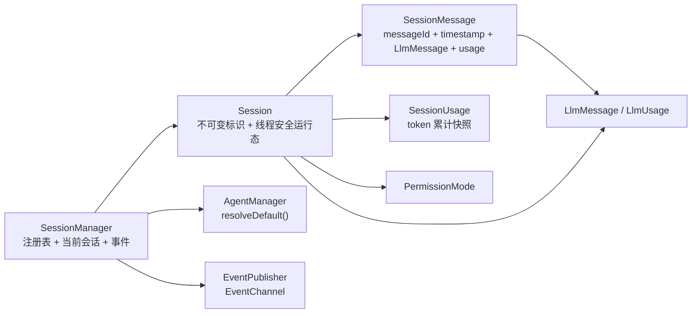

# Session 模块落地方案

> 状态：**Q1～Q18 已全部裁决**（Q16～Q18 采用推荐），见 §11 裁决记录
> 范围：交付 `infra/session` 全部实现 + `infra/agent` 的 `resolveDefault()` 接线闭环 + 三个会话事件 + 单测 + 文档同步；
> **不接** `ReActLooper`、**不接** `AgentHarness`、**不落**持久化本体、**不定义**持久化扩展点、**不做**上下文裁剪。
> 不新增任何配置段：持久化由插件完成，因此其配置随 `jellyfish.json` 的 `plugins.configurations.<pluginId>` 一起，不进 `session` 段。

## 0. 已确认口径（用户裁决）

| # | 决策 | 落地含义 |
| --- | --- | --- |
| 1 | 本轮只做**内存态会话运行态** | 交付 `infra/session` + 事件 + 单测；持久化只留 `TODO` 注释，**不写占位实现**（沿用 agent 模块 Q12 的口径） |
| 2 | **不接 `AgentHarness.bootstrap()`** | 会话由外部入口（将来的命令层 / 启动参数）创建，启动期不存在会话；`AgentHarness` 本轮**零改动** |
| 3 | 架构图那条边的第二项是 **pending todo 注入** | `AGENTS.md` 里「待办插入」的措辞改为「pending todo 注入」；语义定义见 §4.5，本轮只定义不实现 |
| 4 | 会话消息**加一层 `SessionMessage`** | `SessionMessage { messageId, timestamp, LlmMessage, usage }`；**删除**旧占位 `Message`；`LlmMessage` 保持厂商无关、不掺会话元信息 |
| 5 | **需要 token 统计** | `SessionMessage` 携带 `usage`（仅 assistant 可非 null）+ `Session` 维护 O(1) 累加器 + `SessionUsage` 快照，见 §3.2 / §4.6 |
| 6 | `currentModel` 存**字符串对** | `(provider, model)` 两个字段，不持有 `ResolvedModel`；切换模型 = 改这两个字段 |
| 7 | `sessionId` 用 **UUID** | `UUID.randomUUID().toString()`；可读名走独立的 `title` 字段，两者解耦 |
| 8 | 采用 **`Map<sessionId, Session>` + `currentSessionId`** | 为 server 多会话预留；`create` / `switchTo` / `current` / `close` / `all` |
| 9 | `close` 语义 | 从 Map 移除 + 发 `SessionClosedEvent` + 当前会话关闭后 `currentSessionId` 置空（不自动切别的） |
| 10 | 事件方案 | 关闭新增 `SessionClosedEvent`、追加新增 `SessionMessageAppendedEvent`；**会话切换不发事件**（纯内存运行态） |
| 11 | **不定义持久化扩展点** | 本轮不碰扩展层；只在 `SessionManager` 注释写明「消息追加后应走同步扩展点落盘」 |
| 12 | **不新增 `session` 配置段** | 持久化配置随插件走 `plugins.configurations.<pluginId>`；`Session` 保持零配置 |
| 13 | **不做上下文裁剪 / token 预算** | 留 `TODO`，方法注释写明预算由调用点（将来的 `core/prompt`）负责 |
| 14 | 测试口径 | JUnit5 + Mockito；`SessionTest` / `SessionManagerTest` / `SessionMessageTest` / `SessionUsageTest` / 事件测试；并发只测可重复的**隔离语义**，不写时序 flaky 测试 |
| 15 | 旧占位类处置 | `Message` 直接删除（无外部引用）；`Session` / `SessionManager` 重写 |
| 16 | pending todo **本轮不落字段** | ReAct 未落地 ⇒ 无调用点，落字段就是「永远读不到的假接线」（同 Q1 口径）。只在 §4.5 定义语义 + 改 `AGENTS.md` 措辞 |
| 17 | token 统计**双层落点** | `SessionMessage.usage`（可回放、可算每轮成本）+ `Session` 内部累加器 / `getUsage()` 返回 `SessionUsage` 快照（O(1) 读取） |
| 18 | `SessionManager` **只注入 `AgentManager` + `EventPublisher`** | 创建时用 `AgentManager.resolveDefault()` 绑定默认 agent（架构图本就有 `SessionMgr --> AgentMgr` 这条边）；**不注入 `ModelManager`** |

### 0.1 Q18 的展开：为什么不注入 `ModelManager`

`ModelManager.resolveDefault()` 在「一个模型都没配」时**抛异常**，会话创建会被它拖成硬失败——而「没配模型」不该让会话创建失败（真正的报错时机是第一次调用 LLM）。因此会话的 `provider` / `model` 初值一律允许 `null`，语义是「跟随默认」，由调用点（将来的 `ReActLooper`）用 `ModelManager.resolveDefault()` 解析。agent 则不设这条退路：agent 决定提示词与权限策略，安全语义必须尽早定下来，且 `resolveDefault()` 在无 agent 时返回 `null` 而非抛错，天然可空。

## 1. 现状基线（实测）

- `jellyfish-infra/src/main/java/zcd/jellyfish/infra/session/` 下三个类都是占位：
  - `Message`：只有 `role` / `content` / `timestamp`，是可变 POJO，**缺 toolCalls / usage 等字段**，且与 `LlmMessage` 是两套模型；
  - `Session`：只有 `sessionId` + `List<Message>`，是可变 POJO，注释自称「内存态占位实现」；
  - `SessionManager`：**空类**，无 `@Singleton`、无 `@Inject`、无任何方法。
- 全仓库对这三个类的引用数为 **0**（无调用点、无测试），删除 / 重写零风险。
- 真正的统一消息模型在 `infra/llm`：`LlmMessage`（不可变，角色 + content + toolCallId + name + toolCalls）、`LlmResponse`（含 `thinking` / `usage` / `finishReason`）、`LlmUsage`（`int` 三字段、不可变、`totalTokens<=0` 时用 prompt+completion 兜底）、`LlmToolCall`。
- `SessionCreatedEvent`（`api/event/notification`）**已存在**：`SessionCreatedEvent(String agentId, String sessionId)`，目前无发布点。
- 事件基类 `AbstractJellyfishEvent` 已统一维护 `eventId` / `occurredAt` / `sessionId`，并提供 `belongsToSession(String)`。
- `EventPublisher` 是窄接口（`void publish(JellyfishEvent)`），由 `cli/di/EventModule` 提供；`AgentManager` 自带 `@Inject` 构造器，Dagger 可直接装配 ⇒ **`SessionManager` 只需 `@Inject` 构造器，不需要新增任何 Dagger Module**。
- `AgentManager.resolveDefault()` 已就绪，javadoc 里明确写着 `TODO 会话级自动绑定未落地：SessionManager 尚未实现，本方法目前没有任何调用点`，并注明「待它落地后在『创建会话』那一步调用本方法」——本轮就是闭环它。
- `AgentManager` 另有 `find/null 命中`、`require/未命中抛错`、`systemPromptOf`、`policyOf`（fail-open）四件套；系统提示词原文由会话的 `agentId` 反查，**会话不存提示词**。
- `PermissionMode`（`api/extension`，`NORMAL` / `PLAN`）的 javadoc 已写明「由调用点从会话状态读出并随请求带入，进程内不存在全局当前模式」⇒ 它必须有一个会话级落点，本轮补上。
- 架构图中与本模块直接相关的两条边：
  - `ReAct -->|"消息列表 / 上下文 / 当前 agentId / 当前模型"| SessionMgr`（会话是这些状态的唯一持有者）；
  - `SessionMgr ==>|"会话持久化 / 待办插入（无返回值但不可丢）"| ExtReg`（同步、不可丢；第二项的措辞本轮按 Q3 修正为「pending todo 注入」）。
- **不存在** `session` 配置段，也不存在 `SessionSettings`；`JellyfishSettings` 目前只有 `plugins` 段。

## 2. 目标态

### 2.1 依赖边（本轮新增）

```
SessionManager（infra/session） ──> AgentManager（infra/agent）      创建会话时解析默认 agent
SessionManager（infra/session） ──> EventPublisher（api/event）      广播会话生命周期事件
SessionManager（infra/session） ──> Session / SessionMessage / SessionUsage（同包）
Session（infra/session）        ──> LlmMessage / LlmUsage（infra/llm）  复用统一模型，不自建一套
Session（infra/session）        ──> PermissionMode（api/extension）    会话级权限模式
```

- **`infra/session` → `infra/agent`**：同一模块内的构造器注入，且架构图已显式画出 `SessionMgr --> AgentMgr`。
- **不引入新模块依赖**，`infra/llm` 与 `api/*` 的既有依赖方向不变。
- **不依赖 `ExtensionRegistry`**：持久化扩展点按 Q11 留到持久化那一轮；一旦落地，唯一改动点是 `SessionManager.appendMessage(...)` 内部加一次同步派发，`Session` 不需要注入扩展层。



### 2.2 包结构

```
jellyfish-infra/src/main/java/zcd/jellyfish/infra/session/
├── Session.java            # 【重写】会话聚合根：标识 + 元信息 + 消息列表 + token 累计（线程安全）
├── SessionMessage.java     # 【新增】会话内一条消息：messageId + timestamp + LlmMessage + usage
├── SessionUsage.java       # 【新增】会话级 token 累计快照（不可变值对象）
├── SessionManager.java     # 【重写】会话域服务：注册表 / 当前会话 / 生命周期 / 事件 / 唯一变更入口
└── Message.java            # 【删除】被 SessionMessage 取代，全仓库零引用

jellyfish-api/src/main/java/zcd/jellyfish/api/event/notification/
├── SessionCreatedEvent.java          # 已存在，本轮首次有发布点
├── SessionClosedEvent.java           # 【新增】
└── SessionMessageAppendedEvent.java  # 【新增】
```

### 2.3 职责一览

| 组件 | 职责 | 明确不做 |
| --- | --- | --- |
| `SessionManager`（infra/session） | 维护会话注册表与当前会话；创建 / 切换 / 关闭会话；解析默认 agent；广播会话事件；作为会话运行态变更的**唯一入口**（追加消息 / 改标题 / 绑 agent / 切模型 / 切权限模式） | 不读配置、不拼装提示词、不判定权限、不调 LLM、不落盘、不做上下文裁剪 |
| `Session`（infra/session） | 持有 `sessionId` / `createdAt` / `title` / `updatedAt` / `agentId` / `provider` / `model` / `permissionMode` / `messages` / `usage`；对自身状态提供加锁的读快照与变更方法（变更方法**包级可见**，只许 `SessionManager` 调用） | 不知道事件通道、不知道扩展层、不知道 agent 定义与模型配置、不解析默认值 |
| `SessionMessage`（infra/session） | 一条消息的不可变载体：`messageId`（UUID）+ `timestamp` + `LlmMessage` + `usage` | 不做角色判断、不做内容裁剪、不感知会话 |
| `SessionUsage`（infra/session） | 不可变的 token 累计快照（prompt / completion / total / llmCalls）与 `plus(LlmUsage)` 累加 | 不持有会话、不读配置、不做成本换算 |
| `SessionClosedEvent` / `SessionMessageAppendedEvent`（api） | 纯数据通知：关闭、消息追加 | 不携带消息正文（隐私与体积），只带标识与角色 |

**为什么不拆 `SessionRegistry`**：仓库里的 `XxxManager + XxxRegistry` 拆分（`ModelManager`/`AgentManager`）是为了把「配置驱动的**只读**索引」与「门面 + 事件发布」隔开。会话表是**可变的运行态**，切分出去只会得到一个纯转发的空壳；持久化由插件负责（`ExtensionRegistry` 同步派发），本地也不需要 `Store` 抽象。等将来真的出现第二份会话视图（如服务端多租户索引）再拆不迟。

## 3. 关键签名（Java 8）

### 3.1 `infra/session`：`SessionMessage`

```java
package zcd.jellyfish.infra.session;

import zcd.jellyfish.api.JellyfishException;
import zcd.jellyfish.infra.llm.LlmMessage;
import zcd.jellyfish.infra.llm.LlmUsage;

import java.util.Objects;
import java.util.UUID;

/**
 * 会话内的一条消息：会话域元信息 + 厂商无关的消息本体。
 * <p>
 * 为什么不直接往 {@link Session} 里放 {@link LlmMessage}：消息 id、产生时间、token 用量属于
 * <b>会话域</b>，持久化回放、UI 展示与指标聚合都需要它们；而 {@link LlmMessage} 是各厂商接口
 * 无关的统一模型，掺入会话元信息会污染它的语义边界。因此这里包一层，两个模型各自保持干净。
 * <p>
 * 不可变：所有字段 final，无 setter。
 *
 * @author zcd
 */
public final class SessionMessage {

    /** 消息唯一标识（UUID）。 */
    private final String messageId;

    /** 消息产生时间戳（epoch millis）。 */
    private final long timestamp;

    /** 消息本体。 */
    private final LlmMessage message;

    /** 本次模型调用返回的 token 用量；仅 assistant 消息可能非 {@code null}。 */
    private final LlmUsage usage;

    /**
     * 构造一条会话消息。
     *
     * @param messageId 消息唯一标识，不可为空白
     * @param timestamp 消息产生时间戳（epoch millis）
     * @param message   消息本体，不可为 {@code null}
     * @param usage     token 用量，可为 {@code null}
     */
    public SessionMessage(String messageId, long timestamp, LlmMessage message, LlmUsage usage) {
        if (messageId == null || messageId.trim().isEmpty()) {
            throw new JellyfishException("messageId must not be blank");
        }
        this.messageId = messageId;
        this.timestamp = timestamp;
        this.message = Objects.requireNonNull(message, "message must not be null");
        this.usage = usage;
    }

    /**
     * 用当前时刻与自动生成的 id 构造一条消息。
     *
     * @param message 消息本体，不可为 {@code null}
     * @return 会话消息
     */
    public static SessionMessage of(LlmMessage message) {
        return of(message, null);
    }

    /**
     * 用当前时刻与自动生成的 id 构造一条带 token 用量的消息。
     *
     * @param message 消息本体，不可为 {@code null}
     * @param usage   token 用量，可为 {@code null}
     * @return 会话消息
     */
    public static SessionMessage of(LlmMessage message, LlmUsage usage) {
        return new SessionMessage(UUID.randomUUID().toString(), System.currentTimeMillis(), message, usage);
    }

    /** @return 消息唯一标识 */
    public String getMessageId() { ... }

    /** @return 消息产生时间戳（epoch millis） */
    public long getTimestamp() { ... }

    /** @return 消息本体，保证非 {@code null} */
    public LlmMessage getMessage() { ... }

    /** @return token 用量，可能为 {@code null} */
    public LlmUsage getUsage() { ... }

    /** @return 消息角色，取自 {@link LlmMessage#getRole()} */
    public String getRole() { return message.getRole(); }
}
```

**要点**：`getRole()` 是投影而非字段——角色只有一个真相（`LlmMessage`），避免两处不一致。

### 3.2 `infra/session`：`SessionUsage`

```java
/**
 * 会话级 token 累计快照。不可变值对象，每次累加返回新实例。
 * <p>
 * 为什么不直接复用 {@link LlmUsage}：后者表达「<b>一次</b>调用的用量」且字段是 {@code int}，
 * 既没有累加语义、也会在长会话里溢出。本类用 {@code long} 承载累计值，并额外记录调用次数
 * （{@code llmCalls}），让「这个会话花了几次调用、多少 token」变成 O(1) 可读的会话属性。
 *
 * @author zcd
 */
public final class SessionUsage {

    /** 零用量的初始快照。 */
    public static final SessionUsage EMPTY = new SessionUsage(0L, 0L, 0L, 0L);

    /** 累计输入 token 数。 */
    private final long promptTokens;

    /** 累计输出 token 数。 */
    private final long completionTokens;

    /** 累计总 token 数。 */
    private final long totalTokens;

    /** 累计 LLM 调用次数（含未返回用量的调用）。 */
    private final long llmCalls;

    /**
     * 构造用量快照。
     *
     * @param promptTokens     累计输入 token 数
     * @param completionTokens 累计输出 token 数
     * @param totalTokens      累计总 token 数
     * @param llmCalls         累计调用次数
     */
    public SessionUsage(long promptTokens, long completionTokens, long totalTokens, long llmCalls) { ... }

    /**
     * 累加一次调用的用量。
     * <p>
     * {@code usage} 为 {@code null} 时（厂商未返回用量）只累加调用次数，token 三个字段保持不变：
     * 「未返回」不等于「用了 0 token」，计数仍然要涨，否则调用次数会漏。
     *
     * @param usage 一次调用的 token 用量，可为 {@code null}
     * @return 累加后的新快照
     */
    public SessionUsage plus(LlmUsage usage) { ... }

    /** @return 累计输入 token 数 */
    public long getPromptTokens() { ... }

    /** @return 累计输出 token 数 */
    public long getCompletionTokens() { ... }

    /** @return 累计总 token 数 */
    public long getTotalTokens() { ... }

    /** @return 累计 LLM 调用次数 */
    public long getLlmCalls() { ... }
}
```

### 3.3 `infra/session`：`Session`

```java
/**
 * 一次会话的运行态聚合根。
 * <p>
 * 持有三层状态：
 * <ol>
 *     <li><b>标识与生命周期</b>：{@code sessionId}（UUID，创建后不可变）、{@code createdAt}、{@code updatedAt}、{@code title}；</li>
 *     <li><b>会话级选择</b>：当前 {@code agentId}、当前 {@code provider} / {@code model}、当前 {@link PermissionMode}；</li>
 *     <li><b>内容与计量</b>：消息列表与 token 累计。</li>
 * </ol>
 * <b>变更方法一律包级可见</b>：外部只能经 {@link SessionManager} 修改会话，事件发布与将来的持久化派发
 * 都挂在那一个入口上；本类只保证「单会话内的原子性与快照安全」。
 * <p>
 * 线程安全策略：所有读写都在实例锁内（方法级 {@code synchronized}），读方法返回防御性快照，
 * 调用方拿到的列表不会被后续追加改动。会话之间互不影响，跨会话的隔离由
 * {@link SessionManager} 的 {@code ConcurrentHashMap} 提供。
 *
 * @author zcd
 */
public final class Session {

    /** 会话唯一标识（UUID），创建后不可变。 */
    private final String sessionId;

    /** 会话创建时间戳（epoch millis），创建后不可变。 */
    private final long createdAt;

    /** 消息列表，按追加顺序排列。 */
    private final List<SessionMessage> messages = new ArrayList<SessionMessage>();

    /** 会话标题，可为 {@code null}。 */
    private String title;

    /** 最近一次变更时间戳（epoch millis）。 */
    private long updatedAt;

    /** 当前绑定的 agentId，{@code null} 表示未绑定（fail-open）。 */
    private String agentId;

    /** 当前 provider 名，{@code null} 表示跟随配置默认值。 */
    private String provider;

    /** 当前 model 名，{@code null} 表示跟随配置默认值。 */
    private String model;

    /** 当前权限模式，保证非 {@code null}。 */
    private PermissionMode permissionMode;

    /** token 累计快照，追加时替换为新实例。 */
    private SessionUsage usage = SessionUsage.EMPTY;

    /**
     * 构造会话运行态，仅供 {@link SessionManager} 调用。
     *
     * @param sessionId      会话唯一标识
     * @param agentId        初始 agentId，可为 {@code null}
     * @param provider       初始 provider，可为 {@code null}
     * @param model          初始 model，可为 {@code null}
     * @param permissionMode 初始权限模式，{@code null} 按 {@link PermissionMode#NORMAL} 处理
     * @param createdAt      创建时间戳（epoch millis）
     */
    Session(String sessionId, String agentId, String provider, String model,
            PermissionMode permissionMode, long createdAt) { ... }

    // ---- 读取（public，返回快照）----

    /** @return 会话唯一标识 */
    public String getSessionId() { ... }

    /** @return 会话创建时间戳（epoch millis） */
    public long getCreatedAt() { ... }

    /** @return 最近一次变更时间戳（epoch millis） */
    public long getUpdatedAt() { ... }

    /** @return 会话标题，可能为 {@code null} */
    public String getTitle() { ... }

    /** @return 当前 agentId，未绑定时为 {@code null} */
    public String getAgentId() { ... }

    /** @return 当前 provider 名，跟随默认时为 {@code null} */
    public String getProvider() { ... }

    /** @return 当前 model 名，跟随默认时为 {@code null} */
    public String getModel() { ... }

    /** @return 当前权限模式，保证非 {@code null} */
    public PermissionMode getPermissionMode() { ... }

    /** @return token 累计快照，保证非 {@code null} */
    public synchronized SessionUsage getUsage() { ... }

    /** @return 消息条数 */
    public synchronized int size() { ... }

    /**
     * 取消息列表的不可修改快照。
     *
     * @return 不可修改列表，可能为空但不会为 {@code null}
     */
    public synchronized List<SessionMessage> getMessages() { ... }

    // ---- 变更（包级可见：只许 SessionManager 调用）----

    /**
     * 追加一条消息并累加 token 用量。
     *
     * @param message 会话消息
     * @return 追加后的消息条数
     */
    synchronized int append(SessionMessage message) { ... }

    /**
     * 设置标题。
     *
     * @param title 标题，可为 {@code null}
     */
    synchronized void setTitle(String title) { ... }

    /**
     * 设置当前 agentId。
     *
     * @param agentId agentId，可为 {@code null}
     */
    synchronized void setAgentId(String agentId) { ... }

    /**
     * 设置当前 provider / model。
     *
     * @param provider provider 名，可为 {@code null}
     * @param model    model 名，可为 {@code null}
     */
    synchronized void setModel(String provider, String model) { ... }

    /**
     * 设置权限模式。
     *
     * @param permissionMode 权限模式，{@code null} 按 {@link PermissionMode#NORMAL} 处理
     */
    synchronized void setPermissionMode(PermissionMode permissionMode) { ... }
}
```

### 3.4 `infra/session`：`SessionManager`

```java
/**
 * 会话域服务：会话隔离、消息列表、当前 agentId 与当前模型的会话级切换。
 * <p>
 * 与 {@code ModelManager} / {@code AgentManager} 的差异：那两者是「配置驱动的只读索引 + 事件」，
 * 本类是<b>可变运行态</b>——不做配置装载、不建索引、不广播装载事件，只维护
 * 「sessionId → Session」表与一个进程内当前会话指针。
 * <p>
 * <b>唯一变更入口</b>：所有会话运行态变更（追加消息 / 改标题 / 绑 agent / 切模型 / 切权限模式）
 * 都必须经本类。原因是这些变更要连带做两件横切的事——广播通知、将来的同步扩展点落盘
 * （架构图 {@code SessionMgr ==> ExtReg}）——集中在一处才不会每个调用点各写一遍。
 * <p>
 * <b>不持有全局模型状态</b>：当前模型是会话字段，本类只做读写转发；解析与路由仍归 {@code ModelManager}。
 * <p>
 * <b>本轮不做</b>：持久化（由插件经同步扩展点完成，待落地时在 {@link #appendMessage} 内加一次派发）、
 * 上下文裁剪与 token 预算（归将来的 {@code core/prompt}）、pending todo 注入（见方案 §4.5）。
 *
 * @author zcd
 */
@Singleton
public class SessionManager {

    /** 日志。 */
    private static final Logger LOG = LoggerFactory.getLogger(SessionManager.class);

    /** agent 门面，仅用于会话创建时解析默认 agent。 */
    private final AgentManager agentManager;

    /** 通知发布入口，用于广播会话生命周期事件。 */
    private final EventPublisher events;

    /** 会话表：sessionId → 会话运行态。 */
    private final Map<String, Session> sessions = new ConcurrentHashMap<String, Session>();

    /** 当前会话标识；{@code null} 表示当前没有会话。 */
    private final AtomicReference<String> currentSessionId = new AtomicReference<String>();

    /**
     * 构造会话域服务。
     *
     * @param agentManager agent 门面，用于解析会话创建时的默认 agent
     * @param events       通知发布入口
     */
    @Inject
    public SessionManager(AgentManager agentManager, EventPublisher events) { ... }

    /**
     * 创建一个会话并返回其运行态。
     * <p>
     * {@code agentId} 为空白时按 {@link AgentManager#resolveDefault()} 绑定默认 agent（可能仍为
     * {@code null}：一个 agent 都没配是合法状态），这正是 agent 模块留下的 TODO 的闭环点。
     * {@code provider} / {@code model} 不做默认值解析：它们只影响路由，{@code null} 表示「跟随默认」，
     * 由调用点在真正发起 LLM 调用时用 {@code ModelManager} 解析（见 Q18）。
     * <p>
     * <b>本方法不自动把新会话设为当前会话</b>：并发创建不应互相抢占当前指针，切换由调用点显式
     * {@link #switchTo(String)} 完成。
     *
     * @param agentId        agent 标识，可为空白（按默认 agent 绑定）
     * @param provider       provider 名，可为 {@code null}
     * @param model          model 名，可为 {@code null}
     * @param permissionMode 权限模式，可为 {@code null}（按 NORMAL 处理）
     * @return 新建的会话运行态
     */
    public Session create(String agentId, String provider, String model, PermissionMode permissionMode) { ... }

    /**
     * 按默认值与常规模式创建一个会话。
     *
     * @return 新建的会话运行态
     */
    public Session createDefault() { ... }

    /**
     * 取当前会话。
     *
     * @return 当前会话，没有当前会话时返回 {@code null}
     */
    public Session current() { ... }

    /**
     * 取指定会话，未命中即失败。
     *
     * @param sessionId 会话标识，不可为空白
     * @return 会话运行态
     * @throws JellyfishException 会话标识为空白，或该会话不存在时抛出
     */
    public Session require(String sessionId) { ... }

    /**
     * 切换当前会话。
     *
     * @param sessionId 会话标识，不可为空白
     * @return 切到的会话运行态
     * @throws JellyfishException 会话不存在时抛出
     */
    public Session switchTo(String sessionId) { ... }

    /**
     * 关闭会话：从会话表移除，广播 {@link SessionClosedEvent}；若关闭的是当前会话，当前指针置空。
     * <p>
     * 幂等：会话不存在时返回 {@code null} 且不抛错——关闭路径（进程退出、UI 关窗）不该因为
     * 重复关闭而中断收敛。
     *
     * @param sessionId 会话标识，可为 {@code null}
     * @return 被关闭的会话运行态，会话不存在时返回 {@code null}
     */
    public Session close(String sessionId) { ... }

    /**
     * 取全部会话。
     *
     * @return 不可修改集合，可能为空但不会为 {@code null}
     */
    public Collection<Session> all() { ... }

    /**
     * 追加一条消息并累加 token 用量，随后广播 {@link SessionMessageAppendedEvent}。
     * <p>
     * TODO 会话持久化未落地：持久化由插件经 ExtensionRegistry 同步扩展点完成（架构图
     *      {@code SessionMgr ==> ExtReg}）；落地时在本方法内、广播事件之后加一次同步派发，
     *      派发失败必须上抛（「无返回值但不可丢」）。
     *
     * @param sessionId 会话标识，不可为空白
     * @param message   消息本体，不可为 {@code null}
     * @param usage     本次模型调用的 token 用量，可为 {@code null}
     * @return 追加后的会话消息
     * @throws JellyfishException 会话不存在时抛出
     */
    public SessionMessage appendMessage(String sessionId, LlmMessage message, LlmUsage usage) { ... }

    /**
     * 设置会话标题。
     *
     * @param sessionId 会话标识
     * @param title     标题，可为 {@code null}
     * @return 变更后的会话运行态
     * @throws JellyfishException 会话不存在时抛出
     */
    public Session updateTitle(String sessionId, String title) { ... }

    /**
     * 绑定当前 agentId。
     *
     * @param sessionId 会话标识
     * @param agentId   agentId，可为 {@code null}（表示解绑）
     * @return 变更后的会话运行态
     * @throws JellyfishException 会话不存在时抛出
     */
    public Session bindAgent(String sessionId, String agentId) { ... }

    /**
     * 切换当前 provider / model。
     *
     * @param sessionId 会话标识
     * @param provider  provider 名，可为 {@code null}（表示跟随默认）
     * @param model     model 名，可为 {@code null}（表示跟随默认）
     * @return 变更后的会话运行态
     * @throws JellyfishException 会话不存在时抛出
     */
    public Session switchModel(String sessionId, String provider, String model) { ... }

    /**
     * 切换会话权限模式。
     *
     * @param sessionId      会话标识
     * @param permissionMode 权限模式，{@code null} 按 NORMAL 处理
     * @return 变更后的会话运行态
     * @throws JellyfishException 会话不存在时抛出
     */
    public Session setPermissionMode(String sessionId, PermissionMode permissionMode) { ... }

    /**
     * 取会话消息列表的不可修改快照。
     *
     * @param sessionId 会话标识
     * @return 不可修改列表
     * @throws JellyfishException 会话不存在时抛出
     */
    public List<SessionMessage> messagesOf(String sessionId) { ... }

    /**
     * 取会话消息本体的投影，便于调用点直接构建 {@code LlmRequest}。
     *
     * @param sessionId 会话标识
     * @return 不可修改的 {@link LlmMessage} 列表
     * @throws JellyfishException 会话不存在时抛出
     */
    public List<LlmMessage> llmMessagesOf(String sessionId) { ... }
}
```

**方法数偏多的自我辩解**：14 个方法里 8 个是「按 sessionId 转发到 `Session`」的薄壳，之所以不把 `Session` 的变更方法放开成 `public`，就是为了让「事件 + 将来的落盘」只有一处落点（同 §2.3 的取舍）。

### 3.5 会话事件（`api/event/notification`）

`SessionCreatedEvent` **已存在，不改**：`new SessionCreatedEvent(resolvedAgentId, session.getSessionId())`。

```java
/**
 * 会话关闭事件：会话从会话表移除后广播，供指标与 UI 收敛会话视图。
 *
 * @author zcd
 */
public final class SessionClosedEvent extends AbstractJellyfishEvent {

    /** 关闭时绑定的 agentId。 */
    private final String agentId;

    /** 关闭时的消息条数。 */
    private final int messageCount;

    /**
     * 构造会话关闭事件。
     *
     * @param sessionId    会话标识
     * @param agentId      关闭时的 agentId，可为 {@code null}
     * @param messageCount 关闭时的消息条数
     */
    public SessionClosedEvent(String sessionId, String agentId, int messageCount) {
        super(sessionId);
        this.agentId = agentId;
        this.messageCount = messageCount;
    }

    /** @return 关闭时的 agentId，可为 {@code null} */
    public String getAgentId() { ... }

    /** @return 关闭时的消息条数 */
    public int getMessageCount() { ... }
}
```

```java
/**
 * 会话消息追加事件：消息落入会话后广播，供指标与 UI 增量刷新。
 * <p>
 * <b>不携带消息正文</b>：通知是异步、可丢弃的 best-effort 通道，把对话内容塞进去既放大体积
 * 又有隐私面；需要正文的订阅者用 {@code sessionId} + {@code messageId} 回查会话。
 *
 * @author zcd
 */
public final class SessionMessageAppendedEvent extends AbstractJellyfishEvent {

    /** 追加的消息标识。 */
    private final String messageId;

    /** 追加的消息角色。 */
    private final String role;

    /**
     * 构造消息追加事件。
     *
     * @param sessionId 会话标识
     * @param messageId 消息标识
     * @param role      消息角色
     */
    public SessionMessageAppendedEvent(String sessionId, String messageId, String role) {
        super(sessionId);
        this.messageId = messageId;
        this.role = role;
    }

    /** @return 消息标识 */
    public String getMessageId() { ... }

    /** @return 消息角色 */
    public String getRole() { ... }
}
```

### 3.6 DI 装配

- `SessionManager` 自带 `@Inject` 构造器（`AgentManager` + `EventPublisher`），两者都已有绑定
  （`AgentModule` 提供/装配 `AgentManager`、`EventModule.provideEventPublisher`）；
- **不需要新增 Dagger Module**，也不改 `JellyfishComponent` / `AgentHarness`；
- `Session`、`SessionMessage`、`SessionUsage` 是运行态对象，**不进 DI 容器**。

### 3.7 典型时序（将来的调用点）

```
外部入口           SessionManager        AgentManager        EventPublisher
   |  createDefault()   |                    |                    |
   |------------------->| resolveDefault()   |                    |
   |                    |------------------->|                    |
   |                    |  create + 存表      |                    |
   |                    |---- SessionCreatedEvent ----------------->|  (best-effort)
   |  appendMessage(id, user 消息)            |                    |
   |------------------->| append + 累加 usage |                    |
   |                    |---- SessionMessageAppendedEvent -------->|  (best-effort)
   |  switchModel(id, p, m)                   |                    |
   |------------------->| setModel            |                    |  (不发事件)
   |  close(id)          |                    |                    |
   |------------------->| 移除 + 清当前指针    |                    |
   |                    |---- SessionClosedEvent ---------------->|  (best-effort)
```

## 4. 语义规则

### 4.1 会话生命周期

| 阶段 | 动作 | 事件 | 失败语义 |
| --- | --- | --- | --- |
| 创建 | `create(...)` / `createDefault()` → 生成 UUID、解析默认 agent、入表 | `SessionCreatedEvent` | 只可能因 `sessionId` 撞车失败（UUID 实际不可能），不因「没配 agent / 没配模型」失败 |
| 激活 | `switchTo(sessionId)` | 无 | 会话不存在 → `JellyfishException`（显式动作，fail-fast） |
| 运行 | `appendMessage` / `updateTitle` / `bindAgent` / `switchModel` / `setPermissionMode` | 仅 `appendMessage` 发事件 | 会话不存在 → `JellyfishException` |
| 关闭 | `close(sessionId)` → 移除 + 若为当前则清指针 | `SessionClosedEvent` | 幂等：不存在返回 `null`，不抛错 |

**刻意不引入 `SessionStatus` 枚举**：会话「关闭」= 从表里消失，不存在「已关闭但仍可查到」的中间态；多一个状态字段就多一组非法组合（已关闭还能不能 append？）。真需要历史会话时，那是持久化的职责（插件侧），运行态不需要墓碑。

### 4.2 默认值解析与 fail-open 的适用域

| 字段 | 创建时解析 | 允许 `null` | `null` 的含义 |
| --- | --- | --- | --- |
| `agentId` | 是，`AgentManager.resolveDefault()`（可能返回 `null`） | 是 | 未绑定 agent ⇒ `AgentManager.policyOf(null)` 落到 `unrestricted`，提示词为空（fail-open，与 permission 方案同口径） |
| `provider` / `model` | **否** | 是 | 跟随配置默认值，由调用点用 `ModelManager.resolveDefault()` 解析；解析不到时在「真正调用 LLM」处抛 `JellyfishException` |
| `permissionMode` | 是，缺省 `NORMAL` | 否 | — |
| `title` | 否 | 是 | 无标题；由调用点（命令 / UI）设置，不做「首条用户消息自动截取」 |

### 4.3 并发

- **会话表**：`ConcurrentHashMap`；`currentSessionId` 用 `AtomicReference`（`compareAndSet` 语义清晰，且比 `volatile String` 更能表达「指针整体替换」）。
- **会话内部**：`Session` 的全部读写都在实例锁内；读方法返回**防御性快照**（`new ArrayList<>` + `unmodifiableList`），调用方后续追加不会影响已取出的列表，遍历时也不会 `ConcurrentModificationException`。
- **可变性与工厂**：`SessionMessage` / `SessionUsage` 完全不可变，天然免锁。
- **隔离性**：会话之间无共享可变状态；同一进程内 A 会话的追加 / 切模型不影响 B 会话（这也是「模型状态归会话、`ModelManager` 不持有全局当前态」的落地校验点）。
- **不做**：跨会话的顺序保证、会话级公平锁、`ReentrantReadWriteLock` 优化。当前是「单会话内低并发 + 多会话弱耦合」场景，`synchronized` 足够；换成读写锁属于无实测依据的过早优化。

### 4.4 事件与丢弃域

- 三个会话事件都走 **`EventChannel`（异步、有界队列、可丢弃）**，与架构图「会话创建 / 消息追加发通知」的口径一致；发送失败只记日志，**不影响会话本身的状态变更**（对齐 `ModelManager` / `AgentManager` 的发事件写法）。
- 会话变更的**可靠面**不靠事件：将来持久化走**同步扩展点**（`SessionMgr ==> ExtReg`，不可丢）。因此事件订阅者（Metrics / UI）只能是 best-effort，不允许把「会话已落盘」的语义建在事件上。
- **会话切换不发事件**：切换是纯内存指针变更，UI 由自己的交互路径知道用户切了会话；发一条事件只会给订阅者增加一个必须处理的冗余来源。

### 4.5 pending todo 注入（本轮只定义语义，Q16 = 不落字段）

**定义**：会话在构建「本轮上下文」时，把**尚未完成的待办项（pending todo）**渲染成一条消息追加进送给 LLM 的消息序列，使模型在多轮之间记得还有哪些事没做完。

**边界（写进方案与代码注释，本轮不落字段）**：

1. **归属**：pending todo 列表是**会话级状态**（换会话即换待办），不是进程级、也不是 agent 级；
2. **注入点**：注入发生在**构建上下文**时（将来的 `core/prompt` / `ReActLooper`），**不写回** `Session.messages` 历史——否则每一轮都会把同一批待办重复落进历史，回放与 token 统计全部失真；
3. **来源**：由调用点写入（计划模式下的任务规划）与同步扩展点由插件贡献（`SessionMgr ==> ExtReg` 那条边的第二项）两条路；
4. **本轮范围**：`ReActLooper` / `core/prompt` 未落地 ⇒ 无调用点。按 Q1 与 agent 模块 Q12 的口径，**不落 `pendingTodos` 字段、不写占位方法**，只把上述语义写进本节与 `AGENTS.md` 的架构图描述。

### 4.6 token 统计

- **写入**：`SessionManager.appendMessage(sessionId, message, usage)` 在追加时把 `usage` 存进 `SessionMessage`，同时 `Session.usage = session.usage.plus(usage)`（O(1)，不遍历消息列表）。
- **`usage` 为 `null`**（厂商未返回用量，见 `LlmUsage` 的注释）：token 三个字段不变，`llmCalls` 仍 +1。
- **读取**：`Session.getUsage()` 返回 `SessionUsage` 快照。`llmCalls` 与 token 之和分开记账，便于「按次计费」与「按量计费」两种展示。
- **不做的**：成本换算（单价是 provider 配置的事）、按 agent 汇总、跨会话聚合（属 Metrics）。

## 5. 触达点改造清单

| 文件 | 改动 |
| --- | --- |
| `infra/session/Message.java` | **删除** |
| `infra/session/SessionMessage.java` | 新增（§3.1） |
| `infra/session/SessionUsage.java` | 新增（§3.2） |
| `infra/session/Session.java` | 重写（§3.3） |
| `infra/session/SessionManager.java` | 重写（§3.4） |
| `api/event/notification/SessionClosedEvent.java` | 新增 |
| `api/event/notification/SessionMessageAppendedEvent.java` | 新增 |
| `api/event/notification/SessionCreatedEvent.java` | 不改（仅新增首次发布点） |
| `infra/agent/AgentManager.java` | **只删 javadoc 里的 `TODO 会话级自动绑定未落地` 段**，换成「调用点在 `SessionManager.create`」；方法与行为零改动 |
| `cli/di/**`、`core/**` | **零改动**（无需新 Module，不接 `AgentHarness` / `ReActLooper`） |
| `infra/config/**`、`cli/src/main/resources/config.json` | **零改动**（不加 `session` 配置段，Q12） |

### 5.1 `AGENTS.md` 同步清单

1. 架构图 `SessionMgr` 节点描述：`会话隔离 / 消息列表 / 当前 agentId / 当前模型 / 会话级切换`
   → 追加 `+ token 统计`（`Session` 与 `SessionMessage` 的实际职责）。
2. 架构图边 `SessionMgr ==>|"会话持久化 / 待办插入（无返回值但不可丢）"| ExtReg`
   → 措辞改为 **`"会话持久化 / pending todo 注入（无返回值但不可丢）"`**（Q3）。
3. 代码结构 `infra/session/` 一行：`会话运行态：会话隔离、消息列表，以及会话内当前 agentId 与当前模型（仅内存态）`
   → 改为 `会话运行态：会话隔离、消息列表、token 统计，以及会话内当前 agentId / 当前模型 / 权限模式（仅内存态；持久化由插件经同步扩展点完成）`。
4. 「架构要点」补一条口径：**会话状态一律归 `Session`，进程内不存在全局当前 agent / 当前模型 / 当前权限模式；持久化配置随插件走 `plugins.configurations.<pluginId>`，不设 `session` 配置段**。
5. `README.md`：**不改**（本轮不新增任何用户可见配置）。
6. `agent方案.md` 的 §L1「会话创建时自动绑定默认 agent 的调用点本轮不落地」加一行注记：**已由 session 轮闭环**（属文档回填，不改历史裁决）。

## 6. 测试计划

统一口径：JUnit5 + Mockito（`@ExtendWith(MockitoExtension.class)`）、`{被测试类名}Test`、`{方法}_should_{预期}_when_{条件}`、Given/When/Then、只 mock 外部协作者（`AgentManager` / `EventPublisher`），不 mock `Session` / `SessionMessage` / `SessionUsage` 这些 POJO / 值对象。

| 测试类 | 覆盖点 |
| --- | --- |
| `SessionMessageTest` | 工厂方法生成非空且**互不相同**的 `messageId`；`timestamp` 落在调用前后区间内；`usage` 透传；`getRole()` 投影自 `LlmMessage`；`messageId` 空白 / `message` 为 `null` 抛 `JellyfishException` |
| `SessionUsageTest` | `EMPTY` 四个字段全 0；`plus` 累加三个 token 字段与 `llmCalls`；`plus(null)` 只涨 `llmCalls`；`plus` 返回新实例、原实例不变（不可变性） |
| `SessionTest` | 追加顺序与条数；`updatedAt` 单调不减；`append` 同时累加 `usage`；`getMessages()` 快照不可变（改快照不改内部、后续追加不改已取快照）；`setTitle` / `setAgentId` / `setModel` / `setPermissionMode(null→NORMAL)`；`getPermissionMode()` 初值 `NORMAL` |
| `SessionManagerTest` | `create` 在 `agentId` 空白时用 `resolveDefault()` 绑定默认 agent（mock 返回定义）；`resolveDefault()` 为 `null` 时 `agentId` 为 `null` 且**不抛错**；`create` 发 `SessionCreatedEvent` 且 `agentId` 为解析后的值；`create` **不改变当前会话**；`createDefault()` 走同一路径；`require` 未知 id 抛 `JellyfishException`、空白 id 抛 `JellyfishException`；`current()` 无会话返回 `null`；`switchTo` 成功 / 未知抛错；`close` 移除 + 发 `SessionClosedEvent`（`messageCount` 正确）+ 关闭当前会话后 `current()` 为 `null`；`close(null)` / `close(未 知)` 返回 `null` 不抛错（幂等）；`appendMessage` 未知会话抛错、成功时发 `SessionMessageAppendedEvent` 且 `role` / `messageId` 正确、`getUsage()` 被累加；`messagesOf` / `llmMessagesOf` 返回不可修改快照；**两会话隔离**（A 追加不影响 B 的 `size()` / `usage`）；`switchModel` / `bindAgent` / `setPermissionMode` 只影响目标会话 |
| `SessionClosedEventTest` / `SessionMessageAppendedEventTest`（api） | 字段透传；`getSessionId()` 进基类；`belongsToSession` 判定 |
| `SessionCreatedEventTest`（api） | 补一个（该类此前无测试）：`agentId` / `sessionId` 透传、`agentId` 为 `null` 时可读 |

**并发测试口径**：不写「多线程抢占时序」类断言（易 flaky）。只写一种确定性的隔离测试：顺序创建两个会话、交替追加，断言各自消息列表与 usage 互不干扰；`ConcurrentHashMap` 的并发正确性由 JDK 保证，不重复测。

## 7. 实施阶段

| 阶段 | 内容 | 完成判据 |
| --- | --- | --- |
| 1 | 事件（api）：`SessionClosedEvent` + `SessionMessageAppendedEvent` + 两个事件测试 + `SessionCreatedEventTest` | `mvn -q -pl jellyfish-api test` 全绿 |
| 2 | 值对象：`SessionUsage` + `SessionMessage`，删除 `Message` | 两个测试类全绿，无残留引用（`grep Message` 只剩 `SessionMessage` / `LlmMessage`） |
| 3 | `Session` 重写（含包级变更方法 + 锁 + 快照） | `SessionTest` 全绿 |
| 4 | `SessionManager` 重写（注册表 / 当前会话 / 事件 / `resolveDefault` 接线 / 持久化 TODO） | `SessionManagerTest` 全绿 |
| 5 | 回填 `AgentManager.resolveDefault()` 的 javadoc（删 TODO，指到 `SessionManager.create`） | `AgentManagerTest` 无需改动且仍全绿 |
| 6 | 文档同步（§5.1 的 6 项）+ 自查（`@author zcd`、`@param`/`@return`、无 Java 9+ API、无用 import、认知复杂度） | 文档与代码一致，`mvn -q test` 全绿 |

## 8. 验收标准

1. `mvn -q test` 全绿（模块：api / infra / core / cli），JaCoCo 覆盖 `infra/session` 全部新增类的分支与主路径。
2. `AgentManager.resolveDefault()` **有真实调用点**（`SessionManager.create`），`TODO` 注释删除；`AgentManager` 的行为与既有测试零改动。
3. `Session` / `SessionManager` 不再有任何「占位」「待补全」措辞；未实现能力（持久化、裁剪、pending todo 注入）均留有**可检索的 `TODO`**，且**不为未落地的依赖写占位实现**（Q1 / Q16）。
4. 旧 `Message` 类已删除，全仓库无残留引用；`LlmMessage` **零改动**（不被会话元信息污染）。
5. 不新增配置段、不新增 Dagger Module、`AgentHarness` / `ReActLooper` / `cli` 零改动。
6. 代码满足仓库约定：Java 8、4 空格、构造器 `@Inject`、中文「为什么」注释、统一 `JellyfishException`、Sonar 规范。
7. `AGENTS.md` 与代码一致（§5.1 的 6 项）。

## 9. 已知限制（本轮接受，写进代码注释）

| # | 限制 | 原因 / 后续 |
| --- | --- | --- |
| L1 | 会话**不持久化**，进程退出即丢 | 持久化由插件经同步扩展点完成（`SessionMgr ==> ExtReg`）；`appendMessage` 内已留 TODO 落点 |
| L2 | **无上下文裁剪 / token 预算** | `core/prompt` 未落地；`SessionUsage` 只做计量，不参与裁剪决策 |
| L3 | pending todo **未落字段** | `ReActLooper` 未落地，无调用点（Q16） |
| L4 | `thinking`（推理过程）**不进会话消息** | `LlmMessage` 不含该字段，`LlmResponse.getThinking()` 目前只在调用点可见；需要回放推理过程时再决定是扩 `LlmMessage` 还是给 `SessionMessage` 加字段 |
| L5 | 不存**系统提示词快照** | 提示词由 `currentAgentId` 反查 `AgentManager`；agent 定义热更新后历史会话会用新提示词（回放一致性属于持久化那一轮的问题） |
| L6 | `title` **不自动生成** | 「首条用户消息截断」是 UI/命令层策略，放会话域会让纯数据类承担展示逻辑 |
| L7 | 会话表**无上限、无淘汰** | 多会话长驻场景（server）需要时再加 LRU / 上限；当前 CLI 单会话无压力 |

## 10. 风险与缓解

| 风险 | 影响 | 缓解 |
| --- | --- | --- |
| `SessionManager` 方法数偏多，被当成「什么都往这里塞」的门面 | 类膨胀、职责漂移 | §2.3 明确「不做」清单；变更入口只允许「改变会话运行态」的动作，持久化 / 裁剪 / 待办注入一旦落地都必须是**独立组件**而非新方法 |
| 会话内含锁，将来 `ReActLooper` 在锁外持有 `Session` 引用做长耗时操作 | 锁竞争（当前无实测压力） | 读路径返回快照、写方法极短；真有压力时再评估读写锁或不可变快照式 `Session` |
| `create` 的默认 agent 绑定依赖 `AgentManager` 索引已装载 | 若在 `bootstrap()` 之前创建会话，会绑到 `null` | 会话创建由外部入口在启动完成后触发；`null` 本身是合法状态（fail-open），不会崩 |
| 事件含 `messageId` 但不含正文，订阅者需回查 | 订阅者实现稍繁 | 已在 javadoc 写明回查方式；若 Metrics/UI 实测需要正文再评估（正文属可靠面，不该走可丢弃通道） |
| 删除 `Message` 类可能与将来某个分支冲突 | 合并冲突 | 全仓库零引用；改动集中在一个包内，冲突面极小 |

## 11. 裁决记录

| # | 问题 | 结论 | 落点 |
| --- | --- | --- | --- |
| Q1 | 本轮范围 | 只做内存态会话运行态；持久化留 TODO 不写占位 | §0/§2.3/§9 L1 |
| Q2 | 是否接 `AgentHarness` | 不接，启动期无会话 | §1/§3.6 |
| Q3 | 「待办插入」语义 | 即 pending todo 注入；`AGENTS.md` 措辞同步修正 | §4.5/§5.1-2 |
| Q4 | 消息模型 | 加一层 `SessionMessage`，删除旧 `Message` | §3.1 |
| Q5 | token 统计 | 需要：`SessionMessage.usage` + `Session` 累加器 | §3.2/§4.6 |
| Q6 | `currentModel` 表示 | `(provider, model)` 字符串对 | §3.3/§4.2 |
| Q7 | `sessionId` | UUID | §3.1 |
| Q8 | 会话模型 | `Map` + `currentSessionId` | §3.4 |
| Q9 | `close` 语义 | 移除 + 事件 + 当前指针置空 | §4.1 |
| Q10 | 事件方案 | 关闭 / 追加各一个；切换不发 | §3.5/§4.4 |
| Q11 | 持久化扩展点 | 本轮不定义 | §0/§3.4 TODO |
| Q12 | `session` 配置段 | 不加；持久化配置随插件 | §0/§5 |
| Q13 | 上下文裁剪 | 不做，留 TODO | §0/§9 L2 |
| Q14 | 测试口径 | JUnit5 + Mockito，只测确定性隔离语义 | §6 |
| Q15 | 旧占位类 | `Message` 删除，`Session` / `SessionManager` 重写 | §5 |
| Q16 | pending todo 是否落字段 | **不落**（仅定义语义 + 改 `AGENTS.md` 措辞） | §4.5/§5.1-2 |
| Q17 | token 统计落点 | 双层：消息带用量 + 会话累加快照 | §3.2/§4.6 |
| Q18 | `SessionManager` 依赖面 | 只注入 `AgentManager` + `EventPublisher` | §0.1/§3.4 |

## 12. 落地记录

| 阶段 | 内容 | 结果 |
| --- | --- | --- |
| 1 | `SessionClosedEvent` + `SessionMessageAppendedEvent` + 补 `SessionCreatedEventTest` | **已完成**；三个事件类均为不可变数据载体，测试覆盖字段透传、`null` agentId 与 `belongsToSession` |
| 2 | `SessionUsage` + `SessionMessage`，删除 `Message` | **已完成**；`Message` 已删、全仓库无残留引用；`LlmMessage` 零改动 |
| 3 | `Session` 重写 | **已完成**；变更方法包级可见，读写均 `synchronized`，读返回防御性快照 |
| 4 | `SessionManager` 重写 | **已完成**；`ConcurrentHashMap` + `AtomicReference`，`close` 用 `compareAndSet` 清当前指针，`resolveDefault()` 接线闭环 |
| 5 | 回填 `AgentManager.resolveDefault()` javadoc | **已完成**；`TODO` 段删除，改为「调用点是 `SessionManager.create(...)`」 |
| 6 | 文档同步 + 全量测试 | **已完成**；`AGENTS.md` 6 项 + `agent方案.md` L1/§12 注记，`mvn clean test` 全绿 |

落地时相对方案的三处补充（均为收紧或消除文档误导，不改判定语义）：

1. **`SessionUsage` 增加 `toString()`**：与 `LlmUsage` / `ResolvedModel` 一致，便于日志排查，并补测试。
2. **`SessionManager.close` 用 `compareAndSet` 而非直接置空**：方案 §4.1 只写「当前会话关闭后置空」。直接 `set(null)` 会把并发下刚切换过去的新当前会话一起清掉；`compareAndSet(sessionId, null)` 才表达「只清掉正是被关掉的那个」。
3. **`AGENTS.md` 删掉架构图边 `Runtime -->|"注入会话配置"| SessionMgr`**：Q12 明确不设 `session` 配置段，这条边与裁决矛盾；会话的 agent / 模型 / 权限模式都来自创建入参与 `AgentManager`，不来自 `RuntimeConfig`。
4. **测试里按类型挑选事件**：`verify(events).publish(captor.capture())` 的 `ArgumentCaptor` **不按类型过滤**，会匹配全部广播；同一个用例里已有创建 / 追加等多个事件时就报 `TooManyActualInvocations`。已改成先捕获全部事件再按类型挑（`SessionManagerTest.publishedEvent`）。

自查结果：`@author zcd` / `@param` / `@return` 齐备；无 Java 9+ API；无未用 import；无 `System.out`；未使用字段注入。

测试结果：`mvn clean test` 全绿（api 82 + infra 525 + core 3 + cli 11 = 621）。新增的 `infra/session` 四个类均**行 / 分支 / 方法 100% 覆盖**（`mvn -pl jellyfish-infra jacoco:report` 中 session 包 `LINE_MISSED` = 0）。
