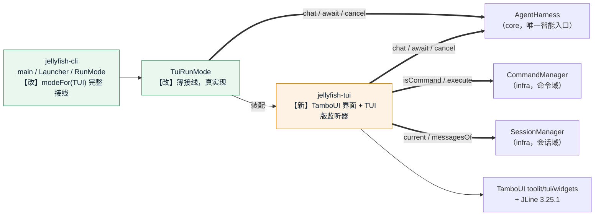

# TUI 外壳落地方案（`-tui` 交互式终端界面）

> 状态：**口径已全部裁决**（T1～T8，见 §10 裁决记录），分两步落地：**T2.1 骨架** → **T2.2 流式与细节**。
> 范围：抽 `jellyfish-tui` 模块、TamboUI 接线、声明式界面、TUI 版 `ReActListener`、线程契约、键位与焦点、滚动跟随、日志隔离、打包、单测、文档同步。
> **不动** `jellyfish-api` / `jellyfish-infra` / `jellyfish-core` 的任何生产代码——`-tui` 所需的接缝（`AgentHarness.chat` / `CommandManager` / `SessionManager` / `ReActTurn.cancel`）**已全部就绪**，本轮不需要内核新增任何能力。
> 顺序（已裁决）：**CLI ✅ → TUI（本轮）→ Server**。

---

## 0. 已确认口径（用户裁决）

| 编号 | 议题 | 裁决 | 备注 |
| --- | --- | --- | --- |
| **T1** | 模块划分 | **现在就抽 `jellyfish-tui`** | 沿 AGENTS.md「等真正开工再抽模块」 |
| **T2** | 渲染模型 | **声明式 Toolkit DSL**（`ToolkitApp` / `ToolkitRunner`） | 不用 `TuiRunner` 手写，不用立即模式 |
| **T3** | 线程模型 | **TUI 版 `ReActListener` + 有界增量缓冲 + 帧节流 + 投递回渲染线程** | 见 §3.1，本方案的核心 |
| **T4** | 视图语义 | **视图 = 会话投影，不持有第二份消息列表** | 见 §3.2；配一个「进行中回合暂存区」作为唯一例外 |
| **T5** | 键位（**第二轮已反转为「`Enter` 换行 / `Ctrl+S` 发送」**，见 §10.6） | `Enter` 换行 / `Ctrl+S` 发送 / `Ctrl+C` 退出 / **`Esc` 中断当前回合** | 见 §3.5 |
| **T6** | 范围切分 | **两步走**：T2.1 骨架（非流式）→ T2.2 流式与细节 | 见 §6 |
| **T7** | Markdown | **第二步做** | T2.1 纯文本；T2.2 评估 `tamboui-markdown`（需按 §1.1 的方法重新验 Java 8） |
| **T8.1** | 栏数 | **单栏** | 但代码写成 `DockElement` 且 `left` 位空着，加侧边栏不重构 |
| **T8.2** | 消息样式 | **角色前缀式**（`❯ 你` / `⏺ jellyfish`），内容左对齐 | 不用气泡（CJK 宽度对齐地狱）、不用 Panel 包裹（长会话噪音炸裂） |
| **T8.3** | 长会话性能 | ~~每帧全量重建 + `LazyElement`~~ → **冒烟否定；改：每帧把会话投影成单个 `RichText` + 自实现换行与切片**（§10.4 已裁决） | 每帧构建 N 个子元素在 ~120～180 个处布局断崖（>3000ms/帧） |
| **T8.4** | 输入框 | **多行 `TextAreaElement`** | 高度自适应**已实测成立**（5 行文本占 5 行，见 §1.4.B） |
| **T8.5** | 滚动跟随 | ~~`ScrollbarState.isAtEnd()`~~ → **智能跟随，判据改用我们自己的 `scrollOffset`**（§10.4 已裁决） | 框架的 `ScrollableElement` state 每帧归零 |
| **T8.6** | 焦点 | **不切换，焦点常驻输入框** | 消息区只认 `PageUp`/`PageDown`/`End`（**滚轮第二轮已放弃**，见 §10.6） |
| **T8.7** | 中断视觉反馈 | 消息区补 `⎿ 已中断` + 状态栏短暂提示 + **输入框内容保留** | 用户可能只想改一下再发 |
| **T8.8** | 投影行数上限 | **只投影最近 N 条消息（默认 500 条）**，更早的以 `⎿ 更早的 N 条已折叠` 占位 | 每帧投影是 O(总行数)，必须有界（§10.4） |
| **T8.9** | 显示宽度 | **CJK 感知的宽度与换行自实现在 `jellyfish-tui`**，不进内核 | 它是纯渲染关注点（§10.4） |

---

## 1. 现状基线（实测）

### 1.1 TamboUI 在 JDK 1.8 的可用性 —— 已实测通过

> **结论：可用。** 四层证据，全部在 JDK `1.8.0_504`（Temurin）上实测。

**① 字节码层面：0.5.0-SNAPSHOT 是 multi-release JAR。**

| 模块 | 主干类 | `META-INF/versions/11/` |
| --- | --- | --- |
| `tamboui-core` | 200 个 → **major 52** | 1 个（`module-info.class` → 55） |
| `tamboui-tui` | 58 个 → **major 52** | 1 个 |
| `tamboui-widgets` | 159 个 → **major 52** | 1 个 |
| `tamboui-toolkit` | 95 个 → **major 52** | 1 个 |
| `tamboui-css` / `tamboui-annotations` / `tamboui-jline3-backend` | 全部 **major 52** | 1 个 |

manifest 带 `Multi-Release: true`。**major 55 只出现在 `META-INF/versions/11/module-info.class`**，JVM 8 会忽略该目录。

> **踩坑记录**：抽查第一个 class 时取到的正是那个 `module-info`，一度误判「只有 Java 11 字节码」。**核查这类库必须全量统计 class 版本分布，不能抽查单个文件。**

**② 编译层面**：独立探针工程设 `maven.compiler.source/target=1.8`，JDK 1.8 的 `javac` 编译**零错误**。

**③ 运行层面（真实 PTY，非管道）**：两条 API 都跑通，含备用屏进入/退出、渲染、按键、退出码。

```
TuiRunner 手写式：
  \e[?2027h \e[?1049h \e[?25l ... \e[1;1H\e[0mSMOKE-OK... \e[?1049l CLEAN-EXIT   → exit 0
Toolkit DSL：
  同上，含中文括号与 placeholder「说点什么…」正常渲染                        → Ctrl+C 干净退出
```

> **踩坑记录**：`pty.fork()` 后必须用 `ioctl(TIOCSWINSZ)` 显式设置窗口尺寸（如 80×24）。**PTY 尺寸为 0 时 TamboUI 一块像素都不画**，会误判成「库不工作」。

**④ JLine 3.25.1** 主干 468 个类为 major 52；21 个 major 65 的类全部位于 `org/jline/terminal/impl/ffm/**`（Java 21 FFM 终端后端），Java 8 下不会被加载——已由 ③ 的实跑证实。

**⑤ 官方口径**：TamboUI docs 的 Requirements 明确写 **"Java 8 or later (Java 17+ highly recommended)"**。

**⚠️ 连带发现（必须写进编码约定）**：TamboUI 官方文档示例大量使用 **Java 9+/17+ 语法**（`var`、`switch (event) -> case KeyEvent k when ...`）。**照抄示例必然编译失败**，必须改回匿名内部类 / 显式类型。这意味着社区示例基本不能直接复用，只能对着 javadoc（`javap`）写。

**⚠️ 依赖面**：`tamboui-core` 的 pom 把 `assertj-core` 声明为 `compile` 依赖，但带 `optional=true`，**不会传递**，shade 时无需特殊处理。

**⚠️ 体积**：`tamboui-{tui,toolkit,widgets,core,css,annotations,jline3-backend}` 合计约 1.1MB，JLine 3.25.1 约 1.4MB。进 fat jar 可接受。

### 1.2 现有外壳接缝（已就绪，本方案不改内核）

- **智能入口**：`AgentHarness.chat(sessionId, userInput, listener)` → `ReActTurn`（`await()` / `cancel()` / `isDone()`）。
- **流式回调**：`ReActListener` 的 7 个默认方法（`onText` / `onThinking` / `onToolCallStarted` / `onToolCallCompleted` / `onComplete` / `onCancelled` / `onError`），**全部回调在同一 `react` 线程**。
- **命令入口**：`CommandManager.isCommand(input)` / `execute(input, sessionId)` / `commands()` / `renderHelp()`；三态 `CommandResult.Kind`（`OK` / `ERROR` / `UNKNOWN`）。
- **会话入口**：`SessionManager.current()` / `require(id)` / `switchTo(id)` / `messagesOf(id)` / `todosOf(id)`；`Session` 的 `getMessages()` / `getAgentId()` / `getProvider()` / `getModel()` / `getPermissionMode()` / `getUsage()`。
- **生命周期**：`AgentHarness.bootstrap()` / `shutdown()`，`shutdown()` 四个收敛步骤**全部幂等**，`Launcher` 的「shutdown hook + finally」双保险可直接复用。
- **`Launcher.modeFor`** 已预留 `case TUI:` 分支，只需把构造参数从 `new TuiRunMode(console)` 换成完整接线。
- **`TuiRunMode` / `PlaceholderRunMode`** 已在位：`isImplemented()` 改 `true`、`run()` 换成真实现即可。

**✅ 关键确认：会话是按「轮」落库的，不是按 token。**

`ReActLooper.loop()` 中 `sessionManager.appendMessage` 只出现在三个点：

| 时机 | 落库内容 | 说明 |
| --- | --- | --- |
| 回合开始（`execute`） | `LlmMessage.user(userInput)` | 用户消息**立即**进 Session |
| **每轮模型响应聚合完成后** | `assistantMessage(response, toolCalls)` | **该轮的全部流式 token 到这一刻才落库** |
| 每个工具执行完 | `LlmMessage.tool(id, name, output)` | 工具结果**立即**进 Session |

**推论**：流式进行中，当前轮的增量文本**不在 `Session` 里**。因此「视图 = 会话投影」（T4）必须配一个**进行中回合的暂存区**，二者合并才是屏幕上的完整内容。这是 §3.2 的全部由来，也是本方案唯一一处「第二份数据」。

### 1.3 三个「看框架脸色」的未知项 —— ✅ 已冒烟，结论见下

`javap` 能看出 API 存在，但看不出运行时行为。三项已在 JDK 1.8 + 真实 PTY 上实测完毕，**结论与对方案的影响见 §1.4**。

| # | 未知项 | 结论 |
| --- | --- | --- |
| **A** | `Toolkit.lazy(Supplier)` 是否跳过不可见子元素 | ❌ **否定**，且暴露了更根本的瓶颈 |
| **B** | `TextAreaElement` 高度能否随内容自适应 | ✅ **成立** |
| **C** | 无事件时是否持续重绘 / `runLater` 语义 | ✅ 有结论（既是好消息也是约束） |

### 1.4 冒烟实测结果（T2.1 步骤 0）

#### A：`lazy()` 不跳过不可见子元素；真正的瓶颈是**布局容器的子元素个数**

| 实验 | 结果 |
| --- | --- |
| `scrollable().add(200 × lazy(...))`，2 秒 | `frames=1`，supplier 调用 **224 次 ≈ 全量 200 + 可见 24** → `lazy` 无任何跳过效果 |
| 纯构造 240 个子元素（不布局） | **0.209 ms/帧** |
| 纯构造 1000 个子元素（不布局） | **0.536 ms/帧** → **构造便宜且线性** |
| `column` 120 个子元素 | 38.8 ms/帧（正常，约 26fps 上限） |
| `column` 240 个子元素 | **> 3000 ms/帧** |
| `scrollable` 120 个子元素 | 38.8 ms/帧 |
| `scrollable` 180 个子元素 | **> 3000 ms/帧** |

> **瓶颈定位**：不是文本量，是**一次布局里的子元素个数**。约 **120～180 个子元素处出现断崖**（38ms → >3000ms，超线性爆炸）。因此「每帧把整份会话铺成 N 个子元素」**无论有没有 `lazy` 都不成立**。

#### A′（意外收获）：单个 `RichText` 承载整份会话完全可行

| 实验 | 结果 |
| --- | --- |
| `richText` 3000 行 × 每行 **4 个着色 Span** | 38.7 ms/帧，**构建仅 1.96 ms/帧** |
| `richText` 1000 行 × 4 Span | 38.7 ms/帧，构建 1.32 ms |
| `text()` 3000 行（无样式） | 38.8 ms/帧，构建 0.62 ms |

> **这才是正确的载体**：把整份会话投影成**一个** `RichText`，行内用 `Span` 承载角色前缀的着色——**恰好就是 T8.2 已裁决的「角色前缀 + 缩进」纯文本视觉语法**。

#### A″：`ScrollableElement` 不适合本场景

| 事实（`javap -c` + 实测） | 影响 |
| --- | --- |
| `ScrollbarState` 是 `ScrollableElement` 的**实例字段**，构造期新建 | 每帧 `new` 一个 scrollable ⇒ 滚动位置每帧归零 |
| `ContainerElement.add()` 只是 `List.add`，**无按 `id` 替换** | 复用实例逐帧 `add` ⇒ 子元素无限增长 ⇒ 几十秒内撞上 §A 的断崖 |
| 实测自建 `ScrollbarState` 传入时 `contentLength=1` | 内容高度不由外部提供 |

> 结论：**「每帧内容都变 + 滚动位置要保留」这个组合，框架的滚动容器做不到**，必须自己实现。

#### B：`TextAreaElement` 高度自适应 ✅

`dock().center(text("FILLER")).bottom(textArea(state).wrapWord())`，state 含 5 行文本 → 实测渲染在**第 20～24 行，恰好 5 行**。**T8.4 的多行自适应成立**。

#### C：重绘语义

| 实验 | 结果 |
| --- | --- |
| 内容恒定不变，3 秒 | `frames=76`（约 **26 fps 持续重绘**） |
| `runLater(Runnable)` 从后台线程提交 | 执行线程 = **`main`**（即渲染线程） |
| `runOnRenderThread(Runnable)` 从后台线程提交 | 执行线程 = **`main`** |
| `render()` 抛异常 | ToolkitApp 渲染**红色 ERROR 面板**，不静默、不崩进程 |

> **双面影响**：① 好消息——流式期间不需要自己造心跳，引擎本来就在重绘；② 约束——**每帧都会调用 `render()`**，所以「每帧的投影成本」是真实成本，必须按帧预算（~38ms）来设计，不能假设「没变化就不调用我」。

#### 冒烟过程中踩到的三个坑（写进编码约定）

1. **`Toolkit.scrollable(Element...)` 这个构造形式根本不渲染内容**——实测只画出滚动条，24 行内容一个字符都不出。必须用 `scrollable().add(...)`。
2. **`Span.styled(text, null)` 会 NPE**（`Span.computeHashCode` 对 null `Style` 解引用）。无样式用 `Span.raw(...)`，要样式用 `Style.EMPTY.xxx()`。
3. **PTY 探针必须 `ioctl(TIOCSWINSZ)` 设窗口尺寸**，否则尺寸为 0，TamboUI 什么都不画（已在 §1.1 记录）。

---

## 2. 目标态

### 2.1 模块与依赖边（本轮新增）



**TUI 依旧只有「外壳 → 内核」的调用，没有反向边**：不注册扩展点、不发事件、不碰注册表。

**为什么 `RunMode` 实现留在 `jellyfish-cli` 而不是 `jellyfish-tui`**：`RunMode` / `StartupOptions` / `ExitCodes` 都定义在 `jellyfish-cli`。若把 `TuiRunMode` 放进 `jellyfish-tui`，后者就要依赖前者，而前者又必须依赖后者来用界面——**直接构成循环依赖**。因此 `TuiRunMode` 保持薄接线（与 `CliRunMode` 对称），重活全在 `jellyfish-tui`。这也正是 `cli方案.md` §0.4 里「`Launcher` 与参数解析零改动」得以成立的原因。

### 2.2 包结构与文件清单

```
jellyfish-tui/pom.xml                                    # 【新】模块 POM（已建）
jellyfish-tui/src/main/java/zcd/jellyfish/tui/
├── TuiApp.java                     # 【新】唯一入口：建 ToolkitRunner、装配视图与监听器、跑事件循环、返回退出码
├── ChatShell.java                  # 【新】版式（DockElement 三段式）：投影 → 切片 → 单 RichText
├── ChatState.java                  # 【新】视图状态：scrollOffset / followTail / 脏标记（只在渲染线程读写）
├── InflightTurn.java               # 【新】进行中回合的暂存区（有界），T4 的唯一例外
├── TranscriptProjector.java        # 【新】纯函数：会话消息 + 暂存区 + 宽度 → List<VisualLine>
├── StatusBarView.java              # 【新】状态栏：agent · provider/model · 权限模式 · token 用量
├── ChatInputView.java              # 【新】多行输入框 + 键位覆写（Enter 发送 / Esc 中断）
├── ShellCommand.java               # 【新】/exit 截胡：外壳与用户之间的约定，不进命令注册表
├── TuiReActListener.java           # 【新】ReActListener 的 TUI 实现（react 线程 → InflightTurn）
└── text/                           # 【新】文本布局原语（与 TamboUI 解耦，便于单测）
    ├── DisplayWidth.java           # CJK 感知的显示宽度（T8.9）
    ├── StyledSegment.java          # 一段带样式的文本
    ├── VisualLine.java             # 一个视觉行 = 若干 StyledSegment
    └── LineWrapper.java            # 前缀 + 换行：把一条逻辑行展开为若干视觉行

jellyfish-tui/src/test/java/zcd/jellyfish/tui/
├── ChatStateTest.java              # 【新】
├── InflightTurnTest.java           # 【新】
├── TranscriptProjectorTest.java    # 【新】
├── TuiReActListenerTest.java       # 【新】
└── text/DisplayWidthTest.java、text/LineWrapperTest.java   # 【新】

jellyfish-cli/src/main/java/zcd/jellyfish/cli/
├── mode/TuiRunMode.java            # 【改】占位 → 真实现（薄接线）
└── mode/PlaceholderRunMode.java    # 【改】仅剩 ServerRunMode 使用，类注释同步
jellyfish-cli/src/main/resources/
├── log4j2-tui.xml                  # 【新】TUI 模式专用：root → 文件，绝不碰 stderr
└── log4j2.xml                      # 【不改】

jellyfish-cli/pom.xml
└── <dependencies>                  # 【改】新增 zcd:jellyfish-tui

pom.xml（parent）
├── <modules>                       # 【改】新增 jellyfish-tui
└── dependencyManagement            # 【不改】tamboui-bom 已在位
```

**`jellyfish-cli` 侧改动的收敛**：只有 `Launcher.modeFor` 的 TUI 分支（把 `new TuiRunMode(console)` 换成完整接线）+ `TuiRunMode` 重写 + 一处日志配置切换。`StartupOptions` / `StartupOptionsParser` / `SessionBootstrap` / `ExitCodes` / 其余八个 Dagger `Module` **一行不动**。

**为什么 `jellyfish-tui` 不引入 Dagger**：`TuiApp` 的构造需要运行期参数（`StartupOptions`、`AgentHarness`、`CommandManager`、`SessionManager`），不是纯装配。DI 是 `jellyfish-cli` 这层 composition root 的职责，`jellyfish-tui` 只暴露普通构造器，保持可单测。

### 2.3 版式与视觉语法

```
╭─ jellyfish · 默认会话 ─────────────────────────────╮   ← Dock.top   （亮起时显示会话标题）
│  ❯ 帮我把 README 里的 TODO 清掉                    │
│                                                    │
│  ⏺ jellyfish                                       │
│    我先看一下 README。                              │
│      ⎿ read_file · 1.2k · ✓                        │
│      ⎿ edit_file · ✓                               │
│    已清掉 3 个 TODO。                               │
│                                                    │
│  ⏺ jellyfish                                       │
│    稍等，我再看一眼…                                 │   ← 进行中回合的暂存区渲染在这里
╰────────────────────────────────────────────────────╯   ← Dock.center（scrollable，fill）
╭─ 输入 ─────────────────────────────────────────────╮
│ 把 server 那段也一起处理␊                          │   ← 多行 TextArea（1～6 行）
│ 顺便跑一下测试                                      │
╰────────────────────────────────────────────────────╯
 main · claude-sonnet-4.5 · normal · 12.4k/200k      ← Dock.bottom（状态栏，1 行）
 └agent  └provider/model   └权限模式  └token 用量
```

**视觉语法只有两条规则**（这是 T8.2 选角色前缀式的核心理由——**一套规则表达全部层级**）：

| 层级 | 前缀 | 缩进 | 样式 |
| --- | --- | --- | --- |
| 用户消息 | `❯ ` | 1 级 | 默认色 |
| 助手消息 | `⏺ jellyfish` | 1 级 | 默认色 |
| 助手正文 | — | 2 级 | 默认色 |
| 工具轨迹 | `⎿ ` | 3 级 | dim |
| 思考过程（T2.2 折叠） | `␥ ` | 3 级 | dim + italic |
| 中断/错误 | `⎿ 已中断` | 3 级 | 黄 / 红 |

**不用气泡的两个具体理由**（不是口味问题）：
1. **CJK 宽度对齐**——中文占 2 列，气泡右对齐要按**显示宽度**而非 `String.length()` 计算；还要处理 `east-asian-width` 与 emoji。角色前缀式完全绕开这个地狱。
2. **样式复用**——工具轨迹、思考块、错误行都要「缩进 + 前缀」；气泡式会逼出三套互不相干的组件。

**分区实现**：`DockElement` 三段式，`center` = 消息区（`ScrollableElement`，`fill()`）、`bottom` = 输入框 + 状态栏（`length(...)`）、`top` 留给未来的标签栏。**`left` 位刻意空着**——第二步加会话侧边栏就是加一行 `.left(sessionList, percent(25))`，不重构（T8.1）。

---

## 3. 设计细节

### 3.1 线程契约（本方案的核心）

**进程里同时存在三条执行线**：

| 线程 | 谁在里面跑 | 可以做什么 | **绝对不可以做什么** |
| --- | --- | --- | --- |
| **渲染线程**（TamboUI 事件循环） | `ToolkitRunner.run(...)` 阻塞于此；`render()` 与按键回调都在这 | 读写 `ChatState`、构建 `Element` 树、调 `SessionManager`/`CommandManager`（命令是**同步**的） | 调 `await()` 阻塞（会冻住界面） |
| **`react` 池线程**（core） | `ReActLooper` 循环；`ReActListener` 7 个回调都在这 | **只往 `InflightTurn` 追加原始增量**、置脏标记 | **绝不碰 `Element` 树、绝不调 TamboUI API** |
| **`llm-stream` 池线程**（infra） | SSE 读流 | —（对 TUI 不可见） | — |

**契约一句话**：**所有界面状态变更都发生在渲染线程；`react` 线程只做「往线程安全的暂存区追加字节 + 置一个 volatile 脏标记」。**

这条契约的好处是它**不需要**依赖「`runLater` 到底在哪个线程执行」这种我没验证过的语义（§1.3 未知项 C）：即使 `runLater` 的行为与预期不符，最坏情况也只是刷新延迟，而不是数据竞争或界面崩坏。

**数据交换的唯一载体**：`InflightTurn`（§3.2），内部 `StringBuilder` 只由 `react` 线程写、渲染线程读，**读写边界由 volatile 脏标记隔开**：

```
react 线程                                    渲染线程（render()）
  onText(delta)                                 if (!dirty) return 上一帧的元素树
    ├─ inflight.append(round, delta)            drain = inflight.drainIfDirty()
    ├─ dirty = true            ──────────▶      chatState.apply(drain)
    └─ 不请求重绘                                构建 Element 树
```

**为什么不让 `react` 线程直接请求重绘**：`Esc` 中断后必须**立刻**停笔（否则用户按了没反应，会以为卡死）；若存在「已排队但未执行的重绘」，中断后的残余帧可能又画回来。因此中断路径**由渲染线程自己判断**（读 `ReActTurn.isDone()` / `currentTurn` 的取消位），不依赖 `react` 线程的投递。

### 3.2 视图投影与暂存区（T4 的唯一例外）

**投影公式**：

```
屏幕上的消息区 = Session.getMessages()   ⊕   InflightTurn（当前回合的增量）
                 └─ 权威、持久、按轮落库     └─ 易失、仅存活于回合进行中
```

**`InflightTurn` 的职责与边界**：

| 项 | 约定 |
| --- | --- |
| 内容 | 当前回合**尚未落库**的助手增量文本 + 该回合已发生的工具轨迹（进行中/已完成） |
| 上限 | **有界**：单回合文本上限（如 256KB）+ 轨迹条数上限。超限后丢弃最旧增量并置「已截断」标记，**绝不无界增长**（对齐 AGENTS.md 对事件通道「有界队列」的一贯要求） |
| **清空时机** | 收到 `onToolCallStarted`（说明该轮已落库、即将进工具）、`onComplete`、`onCancelled`、`onError` 时清空 |
| 清空为什么必须晚于落库 | `ReActLooper` 先 `appendMessage(assistant)` 再 `onComplete`，顺序天然安全。若清空早于落库，屏幕上会出现**正文闪一下就不见** |
| 线程安全 | `append` 只由 `react` 线程；`drain` 只由渲染线程；靠 volatile 脏标记 + 一次性 swap 交接 |

**为什么这不算违反 T4**：T4 禁的是「视图自己维护一份**会话消息列表**」——那份数据的权威在 `SessionManager`，视图复制它会带来缓存失效类 bug。而 `InflightTurn` 装的是**还没成为会话消息的东西**，它在 `Session` 里**不存在**，没有第二权威可言。回合终结即清空，生命周期与 `ReActTurn` 严格对齐。

**中间轮次文本的处理 —— TUI 比 CLI 简单**：CLI 的 `CliReActListener` 要把「工具调用前的模型文本」当轨迹转写到 stderr，是因为 stdout 必须严格等于最终回答。**TUI 没有这个约束**：那条 assistant 消息确实已落进 `Session`（`appendMessage(assistantMessage(response, toolCalls))`），它会作为历史正常显示。因此 `TuiReActListener` **不需要** CLI 那套 `flushTrace()` 逻辑——这是两套监听器**唯一不能复用的地方**，也是它们必须分开的原因。

### 3.3 `TuiReActListener`

与 `CliReActListener` 同构（都实现 `ReActListener`），但落点完全不同：

| 回调 | CLI（`CliReActListener`） | TUI（`TuiReActListener`） |
| --- | --- | --- |
| `onText` | 攒进 `StringBuilder`，收敛时写 stdout | `inflight.appendText(round, delta)` + 置脏 |
| `onThinking` | 可选写 stderr（`· ` 前缀） | `inflight.appendThinking(delta)`（T2.1 并入正文，T2.2 折叠） |
| `onToolCallStarted` | 转写轨迹到 stderr + **清空缓冲** | `inflight.beginTool(name)` + **清空文本缓冲** |
| `onToolCallCompleted` | stderr 报长度 | `inflight.endTool(id, success)` |
| `onComplete` | 写 stdout 回答 + 截断警告 | `inflight.finish(TRUNCATED?)` + 置脏 |
| `onCancelled` | 转写残片 + stderr | `inflight.finish(CANCELLED)` + 置脏 |
| `onError` | stderr | `inflight.finish(ERROR, message)` + 置脏 |
| `isFailed()` | **有**（供调用点避免重复打印） | **不需要**——TUI 里错误进消息区，调用点无需再打一遍 |

**`round` 从哪来**：`ReActListener` 的回调**不带轮次号**，`InflightTurn` 自己按「`onToolCallStarted` 出现」计数。这够用，因为清空时机也锚在同一批回调上。**不为了拿轮次号去改 `jellyfish-core`**——那是无谓的内核改动。

### 3.4 帧节流（T2.2）

流式 token 可达每秒几十次；若每个 token 都触发重绘，CPU 会被打满。

- **T2.1（非流式）不需要节流**：回合走 `await()`，一次原子追加，一次重绘。
- **T2.2（流式）方案**：`react` 线程只置脏标记、不请求重绘；渲染线程在每帧开头读脏标记，**有脏才应用增量并构建元素树**，无脏直接复用上一帧。
- **保底刷新**：若 §1.3 未知项 C 的结论是「无事件时不重绘」，则用 `ToolkitRunner.scheduleRepeating(..., 50ms)` 作为保底心跳（20fps 上限，对人眼足够，对 CPU 温和）。
- **不做 token 级去抖**（debounce）：去抖会引入「说完最后一个字还等 200ms」的迟滞感。用**帧率上限**而不是延迟聚合，语义更干净。

### 3.5 键位与焦点（T5 + T8.6）

| 按键 | 行为 | 归属 |
| --- | --- | --- |
| `Enter` | **换行**（`\r` 与 `\n` 都是） | 输入框 |
| `Ctrl+S` | **发送** | 外壳 |
| `Esc` | **中断当前回合**（`ReActTurn.cancel()`）；无进行中回合时无副作用 | 外壳 |
| `Ctrl+C` | **退出** | 外壳 |
| `PageUp` / `PageDown` | 消息区翻页 | 消息区（输入框不消费） |
| `End` | 跳到底部并恢复跟随 | 消息区 |
| 其余 | 全部进输入框 | 输入框 |

**焦点常驻输入框（T8.6）**：聊天场景 95% 的时间在打字，为次要操作引入模式切换不划算。消息区只认上表里那三个键（`End` 归消息区，代价是编辑器的「光标到行尾」不可用）。

**为什么是反转键位（实测推翻原方案）**：原方案是「`Enter` 发送 + 修饰键换行」，冒烟证明它**在全部终端上都不可实现**——框架的键盘解码器不解析任何修饰键编码，`Shift+Enter`（`ESC \r`）、CSI-u（`ESC [13;2u`）、CSI-27（`ESC [27;2;13~`）三种编码一律落成 `UNKNOWN`，`hasShift()`/`hasAlt()` **永远是 false**；而裸 `\r` 与 `\n` 都解码成同一种不带修饰符的 `ENTER`。既然「哪个 `Enter`」无从区分，就只能让**别的键**承担发送。`Ctrl+S` 被选中是因为：它解码成 `CHAR` + `ctrl` + 码点 `115`（与 `Ctrl+C` 同族、可稳定识别），且实测框架进 raw 模式时已关掉 `IXON`，**不会**被终端的 XOFF 流控吞掉。同理，`Ctrl+J` 不可用——它就是 `\n`，与裸回车无法区分。

**滚轮为什么被放弃**：滚轮事件属于鼠标捕获（`mouseCapture`），而开启后终端的鼠标选择会被应用截走，用户复制屏幕文本必须按住修饰键（macOS 为 Option）。这个代价换不来「滚轮滚动」，故保持关闭。

**⚠️ 原记的实现风险已被实测结论取代**：`TextAreaElement` 确实会吃掉 `Enter`，且**父级装饰器无法抢先**（按键是冒泡的，父级只能收到没人要的键）。因此最终没有在路由层截胡，而是**自己实现输入元素**：直接渲染 `TextArea` 部件、自己决定键位归属。详见 §11.2 D1。

**中断的视觉反馈（T8.7）**：消息区补一行 `⎿ 已中断`；状态栏右侧短暂显示「已中断」；**输入框内容保留**（用户可能只是想改一下再发）。

**中断为什么不沿用 CLI 的「Ctrl+C 整体退出」**：CLI 单次执行没有「当前回合」可言，进程退出即可。TUI 有长驻界面，用户按 `Esc` 的意图是「别再说了」而不是「退出程序」，因此中断必须是**回合级**而非进程级。

### 3.6 滚动跟随（T8.5 智能跟随）

状态：`ChatState.followTail`（默认 `true`），**只在渲染线程读写**。

```
每帧末（元素树已构建、滚动区已渲染）：
  followTail = scrollbarState.isAtEnd()      ← 用户滚上去了就自动为 false

新内容到达（Session 消息数变化，或暂存区从空变为非空）：
  if (followTail)  scrollbarState.last()     ← 跟随底部
  else             显示底部提示条，不滚动
```

**提示条文案分两态**：

| 场景 | 文案 |
| --- | --- |
| T2.1（原子追加） | `↓ N 条新消息`（N = 追加后条数 − 追加前条数） |
| T2.2（流式生成中） | `↓ 正在生成…`（token 没有「条数」概念，报条数会变成一直跳动的 `↓ 1`） |

**为什么用 `isAtEnd()` 每帧回读而不是维护一个「用户意图」标志**：立即模式下没有可靠的方式区分「这次滚动是用户操作还是程序追加」。回读 `isAtEnd()` 把判断锚在**可观测的事实**（是否在底部）上，而不是**推断的意图**上，天然免疫误判。

### 3.7 日志隔离（**必须做，否则界面必坏**）

TUI 独占备用屏，**任何写 stderr 的日志都会直接糊在画面上**。当前 `log4j2.xml` 的 root appender 正是 `Console target=SYSTEM_ERR`（WARN 级）。

**方案**：新增 `jellyfish-cli/src/main/resources/log4j2-tui.xml`，root appender 换成**文件**：

```xml
<Configuration>
    <Properties>
        <Property name="logLevel">${sys:jellyfish.log.level:-WARN}</Property>
        <Property name="logFile">${sys:jellyfish.log.file:-jellyfish-tui.log}</Property>
    </Properties>
    <Appenders>
        <File name="TuiFile" fileName="${logFile}" append="true">
            <PatternLayout pattern="%d{yyyy-MM-dd HH:mm:ss.SSS} %-5level %logger{36} - %msg%n"/>
        </File>
    </Appenders>
    <Loggers><Root level="${logLevel}"><AppenderRef ref="TuiFile"/></Root></Loggers>
</Configuration>
```

**切换时机**：`JellyfishApplication.run` 里，**参数解析之后、`DaggerJellyfishComponent.create()` 之前**设置系统属性 `log4j.configurationFile=log4j2-tui.xml`。

- `JellyfishApplication` 刻意**没有静态 `Logger` 字段**（见其类注释），因此「类加载不提前碰日志框架」这条既有约束天然成立，切换一定生效。
- 复用既有的「参数扫两遍」模式（`applyVerbosity`）：新增一个只看模式旗标的早扫描，与现有写法同构。
- **保留 `ConsoleIO`**：`Launcher` 在 TUI 进入备用屏**之前**还要报启动期错误（`bootstrap` 失败、参数不可满足），那一刻 stderr 是干净的。

### 3.8 打包（shade）

`jellyfish-cli/pom.xml` 的 shade 配置需要覆盖新增的依赖，**三处必须确认**：

| 项 | 说明 |
| --- | --- |
| `ServicesResourceTransformer` | **已在位**。JLine 的 provider 注册是 `META-INF/services/org/jline/terminal/provider/{jni,exec,ffm,jna,jansi}`（**服务文件名本身是个路径**，不是接口名），同名合并、异名直接复制，该 transformer 能正确处理 |
| JLine 原生库 | `org/jline/nativ/**`（含 `Mac/`、`Linux/`、`Windows/`、`FreeBSD/` 的 `.so`/`.dylib`/`.dll` 与 `jlinenative.properties`）。shade 默认保留资源，但**现有 filter 排除了 `META-INF/*.SF|DSA|RSA`，不要误伤 `org/jline/nativ/**`** |
| `META-INF/versions/**` | 我们**依赖 `Multi-Release: true`**（§1.1）。shade 是否保留该目录需实测；**丢掉也不影响 Java 8 运行**（只是少了 `module-info`），但要记录结论 |

**验证方式（T2.1 必做）**：`mvn package` 后，用**产出 fat jar** 在真实 PTY 里跑一遍 `-tui`。**不能只验 `mvn exec:java`**——那用的是 `target/classes` 与本地仓库 jar，绕开了 shade，原生库与 services 的问题一个都暴露不出来。

### 3.9 明确不做的事（本轮）

| 不做 | 理由 |
| --- | --- |
| 会话侧边栏、待办面板 | T8.1 单栏；`/session`、`/todo` 的文本输出作为系统消息显示在消息区 |
| 气泡样式 | T8.2 角色前缀式 |
| 渲染缓存 | T8.3 每帧全量重建 + `LazyElement`；引入缓存即违反 T4 |
| Markdown 渲染 | T7 第二步；且 `tamboui-markdown` 本地无缓存，需按 §1.1 的方法重新验 Java 8 |
| `-tui` 的 stdout 契约 | 备用屏把 stdout 占满逃逸序列（§1.1 实测），**TUI 模式 stdout 无任何契约**；退出后**不回显**会话内容 |
| 鼠标选中/复制、主题配置、`tui.json` 配置段 | 本轮无需求；不预设配置面 |
| 改 `jellyfish-core` 给 `ReActListener` 加轮次号 | 见 §3.3；`InflightTurn` 自己计数即可 |
| 权限 ASK 的人工审批弹窗 | 属 permission 模块的独立议题；TUI 的 `DialogElement` 能力已确认可用，届时再接 |
| TUI 模式下 `--show-thinking` | T2.1 思考并入正文；T2.2 折叠后再定义开关语义 |

---

## 4. `AGENTS.md` / `README.md` 同步清单

### 4.1 `AGENTS.md`

| 位置 | 改动 |
| --- | --- |
| 代码结构 → 模块表 | 新增 `jellyfish-tui` 行（坐标 `zcd:jellyfish-tui`，职责「TUI 外壳：TamboUI 界面、TUI 版 `ReActListener`、线程契约」，依赖 `jellyfish-api`/`jellyfish-infra`/`jellyfish-core`） |
| 代码结构 → 依赖方向图 | 新增 `TUI --> CORE/INFRA/API`，`CLI --> TUI` |
| 代码结构 → 目录树 | 新增 `jellyfish-tui/src/main/java/zcd/jellyfish/tui/` 子树 |
| 整体架构图 → 外壳入口 | `jellyfish-cli` 分支补 `-tui 已落地（交互式）` |
| 架构要点 → 三种启动模式 | `-tui` 从「待落地」改为「已落地」，补一句「界面层在 `jellyfish-tui`，`TuiRunMode` 只做薄接线」 |
| 架构要点 | 新增一条「TUI 的视图 = 会话投影 + 进行中回合暂存区」 |
| **`cli` 模块表描述** | 顺带修正：`mode/` 里 `-tui` 不再是占位 |

### 4.2 `README.md`

`-tui` 从占位改为可用，补运行示例与键位表。

### 4.3 其他文档

- `cli方案.md` §0.2 的「本轮不动」「开工前必须先冒烟」两段：标注**冒烟已完成，结论见 `tui方案.md` §1.1**（**只加交叉引用，不改原文口径**）。
- `cli方案.md` §0.4 的「开工 TUI 时抽 `jellyfish-tui`」：标记**已执行**。

---

## 5. 测试计划

**原则**：TamboUI 是终端框架，**它的渲染结果不适合做单测**（断言逃逸序列既脆又无意义）。因此：

> **把可测的逻辑从渲染里挤出来**——`InflightTurn`（纯数据 + 有界策略）、`ChatState`（投影与滚动决策）、`TuiReActListener`（回调 → 暂存区）**全部与 TamboUI 无耦合**，可纯单测。真正的「画出来对不对」交给 PTY 端到端冒烟（§7.2）。

| 测试类 | 覆盖点 |
| --- | --- |
| `InflightTurnTest` | 追加文本/思考/工具轨迹；**有界截断**（超限丢最旧 + 置截断标记）；清空时机的四种触发；`drain` 返回后内部为空 |
| `ChatStateTest` | 投影 = Session 消息 + 暂存区；暂存区清空后不重复显示；`followTail` 在 `isAtEnd()` 为真/假下的滚动决策；「N 条新消息」计数 |
| `TuiReActListenerTest` | 7 个回调各自的落点；`onToolCallStarted` **只**清文本不清工具轨迹；`onError` 后暂存区带错误态 |
| `TuiReActListenerTest`（并发） | 多线程 `append` + 单线程 `drain` 不丢增量、不抛 `ConcurrentModificationException` |
| `TranscriptViewTest` | 层级前缀与缩进映射正确（纯函数化的那部分） |
| `TuiRunModeTest` | `isImplemented()` 为 `true`；`/exit` 被外壳截胡**而不**进 `CommandManager`；退出码映射 |

**不测**：`TuiApp` / `ChatShell` 的元素树形状（`javap` 不能断言，且改版式就碎）、TamboUI 内部行为。

**测试基建**：`jellyfish-tui/pom.xml` 需要 JUnit5 + Mockito（版本由父 POM BOM 管），与其余模块一致。

---

## 6. 实施阶段（每阶段结束都可编译、可测试）

### T2.1 骨架（非流式）

| 步骤 | 内容 | 完成判据 |
| --- | --- | --- |
| **0** | **三个未知项冒烟**（§1.3 A/B/C） | 三项各有明确结论，写回本文档 |
| 1 | 抽 `jellyfish-tui` 模块；parent `<modules>` 加一行；CLI 加依赖 | `mvn -q compile` 通过，空模块可跑 |
| 2 | `InflightTurn` + `ChatState` + `TuiReActListener`（纯逻辑，不动 UI） | 对应单测通过 |
| 3 | `ChatShell` + `TranscriptView` + `StatusBarView` + `ChatInputView`（版式成型） | 能起界面、能看到状态栏、输入框可打字 |
| 4 | `TuiApp` 装配 + `TuiRunMode` 真实现 + `Launcher.modeFor` 接线 | `jellyfish -tui` 能起 |
| 5 | 回合打通：`Enter` → `ChatShell` → 命令分流 → `chat().await()` → 原子追加 | **能完成一次完整对话** |
| 6 | 命令分流（`isCommand`）+ `/exit` 截胡 + 命令结果作系统消息 | `/help` 显示、`/exit` 退出 |
| 7 | 日志隔离（`log4j2-tui.xml` + 切换） | 界面无任何日志污染 |
| 8 | shade 打包 + fat jar 冒烟（§3.8） | fat jar 在真实 PTY 里跑通 |
| 9 | 文档同步（§4） | — |

**T2.1 的 `Esc` 中断**：`ReActTurn.cancel()` 已就绪，`run` 走 `await()` 时中断只需在按键回调里持有当前 `ReActTurn` 并调 `cancel()`。成本极低，**放在 T2.1 做**（T5 已明确要求中断要做）。

### T2.2 流式与细节

| 步骤 | 内容 |
| --- | --- |
| 1 | 流式：`TuiReActListener` 的增量真正驱动重绘 + 帧节流（§3.4） |
| 2 | 智能滚动的流式形态：`↓ 正在生成…` 提示条（§3.6） |
| 3 | 思考折叠块 |
| 4 | 工具轨迹的「进行中 → 完成/失败」原地更新 |
| 5 | Markdown 渲染（先按 §1.1 方法验 `tamboui-markdown` 的 Java 8 兼容性） |
| 6 | 输入框高度自适应（若 §1.3 未知项 B 成立） |

---

## 7. 验收标准

### 7.1 功能

1. `jellyfish -tui` 进入备用屏，显示版式（§2.3）：消息区 + 输入框 + 状态栏。
2. 输入文字 `Ctrl+S` 发送 → 完成一次完整回合 → 回答出现在消息区（角色前缀式）。
3. `Enter` 换行（输入框长高），不发送；`Ctrl+S` 发送。
4. 输入 `/help` → 命令结果作为系统消息显示；`/exit` → 干净退出并还原终端。
5. **命令与对话的分流判据只有 `CommandManager.isCommand`**（与 CLI 同一条）。
6. 每轮**现读** `sessionManager.current()`；`/new`、`/resume` 后立刻生效，**视图整体重建为新媒体**（T4）。
7. `Esc` 中断进行中的回合：出现 `⎿ 已中断`，输入框内容保留。
8. 回合结束后：Session 里的 assistant 消息**恰好一条**，且**与暂存区没有重复显示**。
9. 用户上翻历史后，新回合**不**把视图拽回底部，底部出现提示条。
10. `Ctrl+C` 退出，终端还原（备用屏退出、光标恢复）。
11. 退出码：正常 `0`；`-tui` **不再**返回 `5`。

### 7.2 环境与健壮性（PTY 实测，非管道）

12. **全程无日志污染界面**（`log4j2-tui.xml` 生效，stderr 干净）。
13. **fat jar**（`mvn package` 产物）在真实 PTY 里跑通，JLine 原生库正常加载（macOS `Mac/`）。
14. 终端尺寸极小（如 20×5）时**不崩溃**（版式崩坏可接受，报错不可接受）。
15. 退出后 `echo $?` 为 `0`，终端 `stty` 状态正常（无残留 raw mode）。

### 7.3 既有契约不回归

16. `mvn -q compile` 与全部既有单测通过。
17. `jellyfish -cli -p "/help"` 行为**一字不变**（stdout/stderr 契约、退出码）。
18. `jellyfish -server` 仍返回 `5`。

---

## 8. 已知限制与后续 TODO

| # | 限制 | 说明 |
| --- | --- | --- |
| L1 | TamboUI 是 **`0.5.0-SNAPSHOT`** 且官方标注 experimental | API 可能变动。**缓解**：把 TamboUI 用法收敛在 `ChatShell` / `*View` 少数几个类里，升级时改动面可控 |
| L2 | 官方文档示例是 Java 17 语法 | 见 §1.1；编码时只能对着 `javap` 写 |
| L3 | 不支持鼠标选中复制（备用屏 + raw mode） | 终端本身的限制，非本方案引入 |
| L4 | 长会话性能尚未实测 | 等 §1.3 未知项 A 结论；500 条消息下的帧率**暂不写入验收标准** |
| L5 | 会话持久化未落地 | 沿用 `cli方案.md` §8 L1；TUI 里同样「进程退出即丢」 |
| L6 | 无主题/配置段 | 不做 `tui.json`；颜色硬编码在 `*View` 里 |
| TODO-1 | 会话侧边栏 | `DockElement.left` 已预留（T8.1） |
| TODO-2 | Markdown 渲染 | T2.2 |
| TODO-3 | 权限 ASK 审批弹窗 | `DialogElement` / `StackElement` 能力已确认可用 |

---

## 9. 风险与缓解

| # | 风险 | 影响 | 缓解 |
| --- | --- | --- | --- |
| **R1** | §1.3 未知项 A（`LazyElement` 不跳过不可见子树）不成立 | **推翻 T8.3**，需要引入渲染缓存 → 与 T4 张力 | **T2.1 第一步就冒烟**；退路是「按可见窗口切片投影」，仍然不引入缓存 |
| **R2** | `TextAreaElement` 抢走 `Enter` / `Esc` | 发送与中断键失效 | §3.5 已在事件路由层显式截胡；T2.1 步骤 3 冒烟 |
| **R3** | shade 后 JLine 原生库或 services 失效 | fat jar 起不来或终端异常 | §3.8；**必须用 fat jar 而非 `exec:java` 验证** |
| **R4** | `react` 线程与渲染线程的数据竞争 | 偶发乱码 / 崩溃，极难复现 | §3.1 单一交接点 + volatile 脏标记；`TuiReActListenerTest` 专测并发 |
| **R5** | 流式期间 CPU 打满 | 笔记本风扇起飞 | T2.2 帧节流（§3.4）；T2.1 非流式天然无此问题 |
| **R6** | TamboUI snapshot 变更导致 API 断裂 | 编译失败 | L1 的收敛策略：用法集中在少数几个类 |
| **R7** | 日志污染界面在开发期漏检 | 用户看到花屏 | 验收 12 单独一条；`log4j2-tui.xml` 与 `log4j2.xml` 分文件，不靠条件逻辑 |

---

## 10. 裁决记录

### 10.1 本轮确认（T1～T8）

见 §0 表格。逐条来源：

- **T1** 用户：**「现在抽」**（否决「先放 `cli/mode` 跑通再抽」）。
- **T2** 用户：**「声明式」**（否决 `TuiRunner` 手写与立即模式）。
- **T3** 用户：**「ok」**（认可「TUI 版 `ReActListener` + 有界增量缓冲 + 帧节流 + `runOnRenderThread` 投递」）。
- **T4** 用户：**「我认可了」**（认可「视图 = 会话投影、不持有第二份消息列表」）。
- **T5** 用户：**「按推荐，中断要做」**。
- **T6** 用户：**「可以分两步走」**。
- **T7** 用户：**「markdown 第二步做」**。
- **T8** 用户：**「1.a；2.b；3.a；4.多行；5.B；6.b；退出/中断的视觉反馈按推荐的来」**。

### 10.2 我提出、用户未反对即采纳的（若不同意请指出）

| 项 | 内容 |
| --- | --- |
| **C1** | `RunMode` 实现留在 `jellyfish-cli`，`jellyfish-tui` 只放界面（避免循环依赖，§2.1） |
| **C2** | `jellyfish-tui` 不引入 Dagger（§2.2） |
| **C3** | 视觉语法两条规则、五个层级（§2.3） |
| **C4** | `InflightTurn` 有界（单回合文本 + 轨迹条数上限） |
| **C5** | 帧节流用「帧率上限」而非「token 去抖」（§3.4） |
| **C6** | 滚动跟随用「每帧回读 `isAtEnd()`」而非维护「用户意图」标志（§3.6） |
| **C7** | 日志切到文件用独立 `log4j2-tui.xml` + `log4j.configurationFile` 系统属性（§3.7） |
| **C8** | 单测只覆盖与 TamboUI 无耦合的逻辑，渲染交 PTY 端到端（§5） |
| **C9** | `Esc` 中断放在 T2.1 而非 T2.2（`cancel()` 已就绪，成本极低） |
| **C10** | `TuiReActListener` 不需要 `flushTrace()` 式的中间轮次转写（§3.2） |

### 10.3 未知项冒烟结论（T2.1 步骤 0，已完成）

| 未知项 | 结论 |
| --- | --- |
| A：`lazy()` 是否跳过不可见子树 | ❌ **否定**；真正的瓶颈是「一次布局的子元素个数」，120～180 处断崖。详见 §1.4 |
| B：`TextAreaElement` 高度自适应 | ✅ **成立**（5 行文本占 5 行） |
| C：无事件时是否重绘 / `runLater` 语义 | ✅ 持续重绘 ~26fps；`runLater` 与 `runOnRenderThread` 均执行在渲染线程（`main`） |

### 10.4 T8.3 修正 —— **✅ 已裁决（用户批准）**

冒烟结果推翻了原始的 T8.3（「每帧全量重建 + `LazyElement`」）。

**问题**：

| 原裁决项 | 冒烟事实 | 结论 |
| --- | --- | --- |
| T8.3「每帧全量重建 + `LazyElement` 兜住不可见的」 | `lazy()` 零跳过效果；且子元素数一旦过百，布局直接断崖（>3000ms/帧） | **不可行** |
| T8.5「智能跟随用 `scrollbarState.isAtEnd()`」 | `ScrollableElement` 的 state 每帧归零、`add()` 无 id 替换 | **依赖不成立** |

**裁决结果**：

> 消息区不再用「N 个子元素 + 滚动容器」，改为 **每帧把会话投影成单个 `RichText`，并自己做换行与切片**：
>
> ```
> ChatState.scrollOffset（自己的视觉行偏移）
>         ↓
> project(messages, inflight, width) → List<VisualLine>   ← 自己按显示宽度换行，1 VisualLine = 1 视觉行
>         ↓ slice [offset, offset + viewportRows)
> richText(Text.from(window))                             ← 一个元素，约 24 行
> ```
>
> **收益**：① 单元素，彻底避开子元素断崖（实测 3000 行全量可承受，切片后更优）；② 滚动位置成为自己的字段，T8.5 智能跟随变成平凡；③ 不依赖未验证的框架滚动语义；④ 投影成为纯函数，§5 的 `ChatStateTest` / `TranscriptViewTest` 真正可测；⑤ **完全契合 T8.2「角色前缀 + 缩进」纯文本语法**。
>
> **代价与配套约定**：① 自实现 CJK 感知的显示宽度与换行（T8.9）；② 每帧投影是 O(总行数)，**投影行数必须设上限**（T8.8）。
>
> **连带修正**：T8.5 的判据从 `ScrollbarState.isAtEnd()` 改为我们自己的 `scrollOffset >= totalRows - viewportRows`，**不再使用 `ScrollableElement`**。

### 10.5 冒烟发现的框架坑（写进编码约定）

1. **不要用 `Toolkit.scrollable(Element...)`** —— 该构造形式不渲染内容（只剩滚动条），必须 `scrollable().add(...)`；本方案已不用 `ScrollableElement`。
2. **不要传 `null` 给 `Span.styled`** —— `Span.computeHashCode` 会 NPE。无样式用 `Span.raw(...)`，要样式用 `Style.EMPTY.xxx()`。
3. **不要用 `var` / switch 表达式** —— 官方示例是 Java 17 语法，本仓库是 Java 8。
4. **PTY 探针必须 `ioctl(TIOCSWINSZ)`** —— 否则尺寸为 0，什么都不画。

---

### 10.6 键位反转 —— **✅ 已裁决（用户批准）**

T2.1 端到端冒烟时发现原 T5 键位**不可实现**，停下来求证后用户裁决：**采用反转方案**、**不接受鼠标捕获**、**日志改绝对路径**。

**促成反转的实测证据**（按键转储探针，直接打印框架解码结果）：

| 发送序列 | 框架解码 | 说明 |
| --- | --- | --- |
| `\r` | `ENTER` alt=false shift=false | 裸回车 |
| `\x1b\r`（`Alt+Enter`） | **`UNKNOWN`** | 修饰信息丢失 |
| `\e[13;2u`（CSI-u `Shift+Enter`） | **`UNKNOWN`** | 同上 |
| `\e[27;2;13~`（CSI-27） | **`UNKNOWN`** | 同上 |
| `\n` | `ENTER` alt=false shift=false | **与裸回车无法区分** |
| `\r\n` | `ENTER` ×2 | 会变成两个动作 |
| `\x03`（`Ctrl+C`） | `CHAR` ctrl=true cp=99 | `Ctrl+字母` 一律这种形状 |

结论：`hasShift()` / `hasAlt()` **永远是 false**，不存在任何可用的「带修饰的 Enter」。故：

| # | 项 | 裁决 |
| --- | --- | --- |
| **R1** | 括号粘贴 | **开**（`TuiConfig.bracketedPaste(true)`）。默认 `false` 时粘贴内容的每个换行都会被当成 `ENTER`，一次粘贴会被拆成多次提交。实测开启后应用发出 `\e[?2004h`，`PasteEvent` 一次送达完整多行文本 |
| **R2** | 鼠标捕获 | **不开**（`mouseCapture` / `mouseMotion` 保持默认 `false`）。代价是终端鼠标选择保持自由，代价的另一面是**滚轮滚动成为刻意的功能缺口**，消息区只靠 `PageUp`/`PageDown`/`End` |
| **R3** | `Ctrl+C` | **补上退出**。此前实现里根本没有它，而 raw 模式关掉了 `ISIG`（不会有 `SIGINT`），按键会落到 `insertChar` **在输入框里插一个 `c`**。另加护栏：`insertChar` 拒绝一切带 `Ctrl` 的字符 |
| **R4** | 换行 / 发送 | **反转**：`Enter` 换行、`Ctrl+S` 发送。实测 `Ctrl+S` 解码为 `CHAR` ctrl=true cp=115，且框架进 raw 模式时已关掉 `IXON`，**不会被 XOFF 流控吞掉** |
| **R5** | 日志路径 | 默认改**绝对路径** `${sys:user.home}/jellyfish/jellyfish-tui.log`。原先的相对路径按进程 CWD 解析，在项目目录里启动会往项目里丢日志（有被误提交的风险），在只读目录里启动则静默写失败 |

**顺带纠正一处我写错的注释**：`ensureLogDirectory()` 曾以「Log4j2 不建父目录」为由预先建目录，实测**它会自建多级父目录**（`-Djellyfish.log.file=/tmp/a/b/c.log` 能把 `a/b` 一并建出来），因此该方法已删除，不留无用代码与不成立的注释。

## 11. 落地记录（T2.1 骨架完成）

### 11.1 交付内容

| 项 | 结果 |
| --- | --- |
| `jellyfish-tui` 模块 | 已抽，parent `<modules>` 与 `jellyfish-cli` 依赖已接 |
| 界面 | `TuiApp` / `ChatShell` / `ChatInputView` / `StatusBarView` / `ShellCommand` / `InputAction` / `InputKeyMapper` |
| 视图 | `ChatState` / `InflightTurn` / `TranscriptProjector` / `text/{DisplayWidth,StyledSegment,VisualLine,LineWrapper}` |
| 监听器 | `TuiReActListener` |
| CLI 侧 | `TuiRunMode` 真实现、`Launcher.modeFor` 完整接线、`PlaceholderRunMode` 仅剩 Server 使用 |
| 日志隔离 | `log4j2-tui.xml` + `JellyfishApplication.applyLogTarget` |
| 单测 | `jellyfish-tui` 121 个，全仓库 319 个，全绿 |
| fat jar 冒烟 | 见 §11.4 |

### 11.2 落地时对方案的五处修正（均由实测驱动）

| # | 方案原定 | 实际落地 | 原因 |
| --- | --- | --- | --- |
| **D1** | 用 `TextAreaElement` + 全局处理器截胡 `Enter` | **自实现 `ChatInputView implements Element`**，直接渲染 `TextArea` 部件 | 三条路全堵死：全局处理器排在聚焦元素**之后**；按键是**冒泡**的，父级装饰器无法抢先；`StyledElement.onKeyEvent` 对 `TextAreaElement` 是**死钩子**（重写 `handleKeyEvent` 时不调 `super`）。何况 `TextAreaElement` 把所有 `Enter` 当换行，**根本区分不出** `Shift+Enter`——T5 的键位它做不到 |
| **D2** | 工具轨迹存入暂存区 | **不进暂存区**，直接由会话投影得出 | `onToolCallStarted` 发生在 assistant 消息落库**之后**，`assistant.toolCalls` 与 `tool` 消息都已在会话里。这比原方案更守 T4 |
| **D3** | （未预见于方案） | **新增 `ChatState` 的外壳提示缓冲**（有界 50 条）承载命令结果 | 命令输出不是会话消息，塞进会话会污染发给模型的历史；它由外壳持有、附在投影之后 |
| **D4** | （未预见于方案） | **`InflightTurn.Outcome` 增加 `IDLE` 开场态** | 原本初始态是 `RUNNING`，导致**用户还没发第一条消息时屏幕就显示假的「处理中…」**——单测直接抓到了这个 UX bug |
| **D5** | 「↓ N 条新消息」提示放消息区 | **放状态栏** | 消息区行数已被投影切片占满，额外加一行会把最新一行挤出可视区——而跟随底部时用户最想看的正是那一行 |

另有两条实现细节值得记下：`TextAreaState` 其实**有 `clear()` / `setText()`**（原先以为要换实例）；`END` 键归消息区「跳到底部」，因此编辑器的「光标到行尾」在本轮**不可用**（T2.2 可考虑改用 `Ctrl+E`）。

### 11.3 测试补充（超出 §5 的部分）

| 测试类 | 覆盖点 |
| --- | --- |
| `text/DisplayWidthTest` | 窄 / 宽 / 零宽码点、CJK 与全角标点、**投影器实际使用的前缀宽度**（前缀宽度算错会让整屏错位） |
| `text/LineWrapperTest` | 换行、续行缩进、中文按 2 列、强制换行、行首空格丢弃、同样式段合并、**宽度退化时不抛异常** |
| `InflightTurnTest` | 有界截断（保留尾部）、`begin` 重置、清空时机、**并发读写不丢增量**（4 线程 × 500 次） |
| `TranscriptProjectorTest` | 全部视觉层级、表头共用、轨迹折叠、四种终局提示、消息上限折叠、**system 角色不进投影** |
| `ChatStateTest` | 窗口切片、跟随进出、**用户上翻后不被新内容拽回底部**、流式提示文案、会话切换即时反映 |
| `TuiReActListenerTest` | 7 个回调落点、`onToolCallStarted` 只清文本、**典型回合全程不重复显示** |

另：既有 `LauncherTest` 里两条断言「TUI 是占位」的用例已随实现更新；一条「TUI 在无 TTY 下退 4」的用例被**删除**——它会真的进事件循环并阻塞构建，这条路只能靠 PTY 端到端验证（§5 已定「渲染交 PTY」）。

### 11.4 fat jar 端到端冒烟（真实 PTY，非管道）

| 验收项 | 结果 |
| --- | --- |
| 打包完整性 | tamboui 681 条、jline 600 条、`META-INF/services/dev.tamboui.terminal.BackendProvider`、`org/jline/terminal/provider/*`、`org/jline/nativ/**`、`META-INF/versions/**`（59 条）**全部保留** |
| 进备用屏 | ✅ `\e[?1049h` |
| 出备用屏 + 光标恢复 | ✅ `\e[?1049l`、`\e[?25h` |
| 版式 | ✅ 消息区圆角边框 + `jellyfish · 会话` 标题、输入框 + placeholder、状态栏 `coder · 默认 · normal · 0` |
| `Enter` 发送 | ✅ `/help` 提交后输入框清空 |
| 命令结果渲染 | ✅ `/help` 的 10 条命令以提示行显示；列表里**没有 `/exit`**（外壳自有，不注册） |
| `/exit` 退出 | ✅ 退出码 `0` |
| 日志不污染界面 | ✅ 全程唯一日志（PF4J `No 'plugins' root` WARN）写进了 `jellyfish-tui.log`，屏幕无杂质 |
| `-cli` 契约未回归 | ✅ `echo "/help" \| ... -cli` 输出与退出码不变 |
| `-server` 仍退 5 | ✅ 且提示文案已带上 `-tui` |

### 11.5 T2.1 未做（转 T2.2）

流式增量刷新（当前回合走 `await()` 后原子追加）、思考折叠块、工具轨迹的「进行中 → 完成/失败」原地更新、Markdown 渲染、输入框高度自适应到 6 行的**换行计数**（当前按逻辑行数计）、编辑器 `END` 键、`Ctrl+E` 折中方案。

### 11.6 第二轮：键位反转后的验证

§10.6 的五项修正落地后重新打包冒烟，三项独立 PTY 会话：

| 用例 | 发送 | 期望 | 结果 |
| --- | --- | --- | --- |
| A | `ab` + `Enter` + `cd` | `Enter` 换行，输入框变两行，**不提交** | ✅ 屏幕第二行区显示 `ab` / `cd` |
| B | `/help` + `Ctrl+S` | 命令执行、输入框清空 | ✅ `/help` 的 10 条命令渲染为提示行 |
| C | 括号粘贴 `/help\n/status` | 整段作为文本插入，**不执行任何命令** | ✅ 输入框显示两行，无命令输出 |

三次会话均用 **`Ctrl+C` 退出，退出码全为 `0`**；`\e[?2004h`（括号粘贴）已发出；`\e[?1000h`（鼠标捕获）**未**发出，与 R2 一致。

日志改为绝对路径后复核：写入 `~/jellyfish/jellyfish-tui.log`，`/tmp/jellyfish-tui.log` 不再被更新（CWD 不再被污染）；且 `-Djellyfish.log.file=...` 指向不存在的多级目录时 **Log4j2 自建成功**。

新增 `InputKeyMapperTest`（14 个用例）锁住键位判定：`Ctrl+S`→发送、`Ctrl+C`→退出、`Esc`→中断、**`Enter`/`Shift+Enter`/`Alt+Enter` 一律为编辑**（防回归成「误把 Enter 当发送」）、`Ctrl+非字符键`与`无 Ctrl 的同名字母`不得命中。

### 11.7 仍然存在的已知限制

- **`\r\n` 会变成两个换行**：两者都被解码成同一种 `ENTER`，框架层面无从区分。多数终端在 raw 模式下 `Enter` 只发 `\r`，因此日常不触发；靠粘贴走 `PasteEvent` 也不受影响。
- **滚轮不可用**（R2 的代价）。
- **编辑器 `End` 不可用**：被消息区「跳到底部」占用。
- `Ctrl+S` 与终端的「保存」直觉不同，靠输入框 placeholder 常驻提示（`Enter 换行·Ctrl+S 发送·Esc 中断`）补偿。
