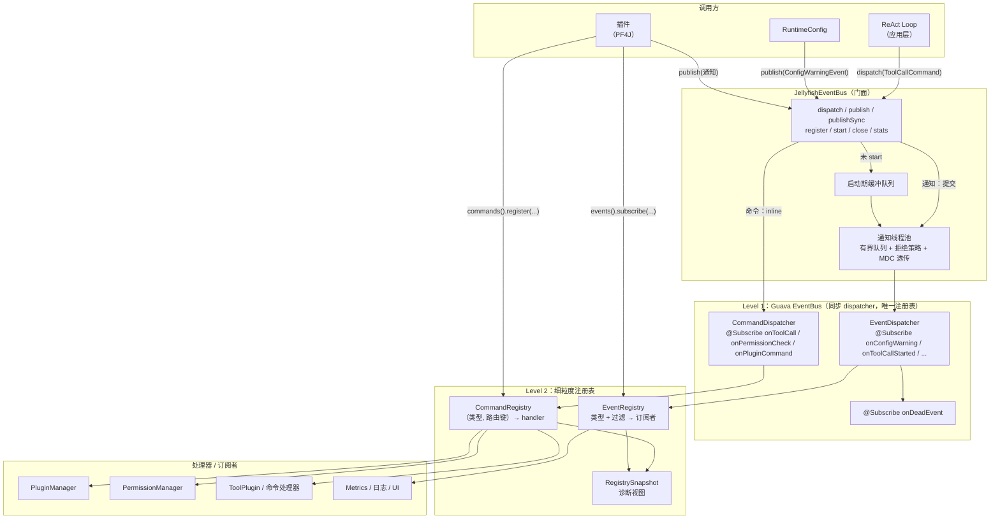
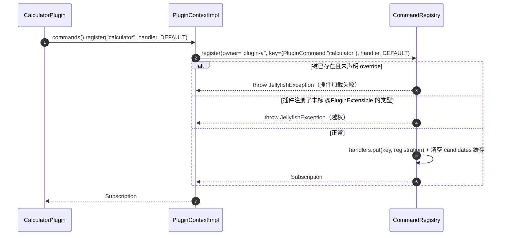
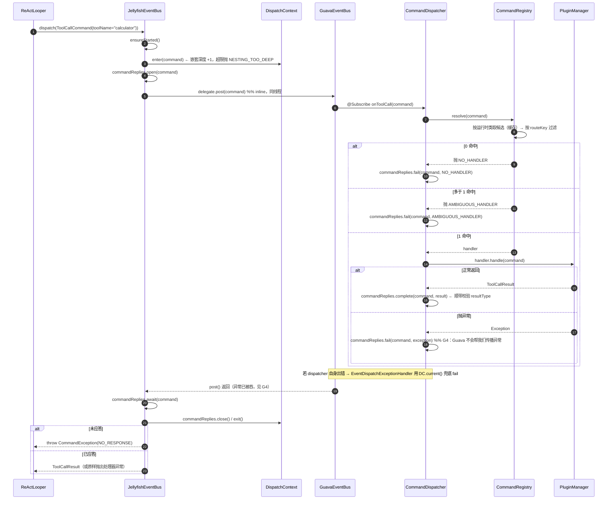
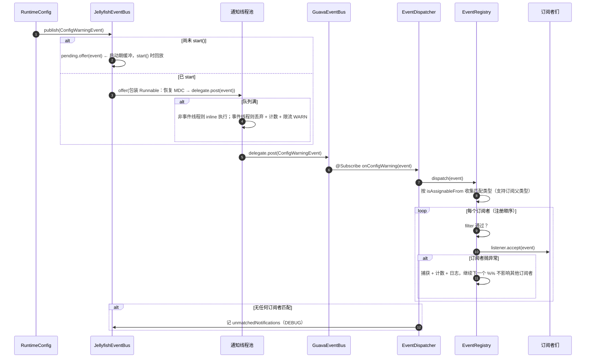
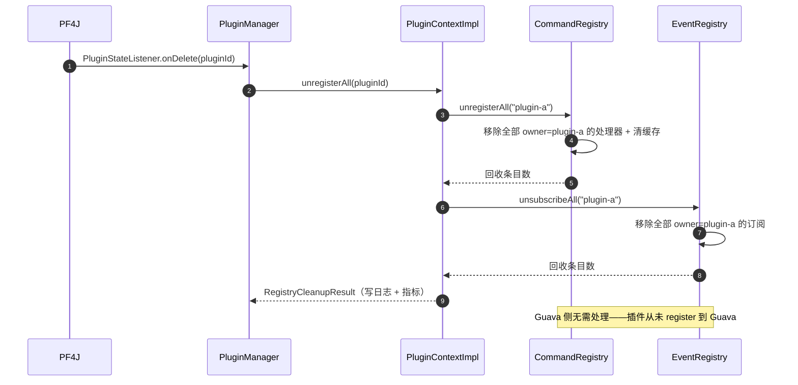

# 事件总线技术方案

> 版本：v1.1（已定稿待实施）
> 适用模块：`jellyfish-api`、`jellyfish-infra`、`jellyfish-core`、`jellyfish-cli`
> 关联文档：`Jellyfish技术方案.md`（§2.1 架构图、§1.4 技术选型）、`AGENTS.md`（代码结构）
> 阅读建议：先看 **§3 类结构与交互**（全局地图），再按需查阅后续章节的实现细节。

---

## 一、定位与边界

### 1.1 一句话定位

`JellyfishEventBus` 是**进程内的双通道总线**：一条**同步命令通道**承载请求-响应，一条**异步通知通道**承载广播；对外提供两层注册表——**Guava 负责"类型级"的粗粒度注册与派发，我们负责"业务键级"的细粒度路由与生命周期**。

`JellyfishEventBus` 不是"Guava EventBus 的薄包装"，而是"命令总线 + 通知总线"二合一，Guava 是它内部的订阅注册表与派发引擎。

### 1.2 职责边界

| Guava EventBus 提供 | 门面必须补齐 |
| --- | --- |
| `@Subscribe` 方法扫描与类型匹配（含父类、接口） | 同步 / 异步**发布端分流** |
| 订阅者注册表（对象粒度、并发安全） | 命令的**应答槽 + 恰好一个处理器** |
| `SubscriberExceptionHandler` 异常钩子 | 注册期**分类校验**（命令 / 通知 / 非法） |
| `DeadEvent` | **细粒度注册表**（业务键路由、覆盖、卸载） |
| `@AllowConcurrentEvents` | **生命周期**（`start` / `close`）、启动期事件缓冲 |
| — | 背压与拒绝策略、MDC 上下文透传、指标与诊断视图 |

### 1.3 设计依据（Guava 33.0.0-jre 实测结论）

方案中的细节均由以下实测结论推导，改动 Guava 版本前必须重新验证：

| 编号 | 实测结论 | 对设计的影响 |
| --- | --- | --- |
| G1 | `@Subscribe void on(Base)` 能收到子类 `Sub`；接口参数同样生效 | 可用父类型订阅，但**命令必须禁用基类订阅**，否则一个处理器收下所有命令 |
| G2 | 同一对象重复 `register` **不抛错**，事件只投递 1 次（Set 语义） | 注册可幂等；"重复装配"这类错误检测不到，改由细粒度注册表负责 |
| G3 | `unregister(obj)` 一次即彻底移除 | 订阅句柄可简单包装，无需引用计数 |
| G4 | 订阅者抛异常**不会传给 `post()` 调用者**，同一事件的其他订阅者照常执行 | 命令异常必须由**我们自己的 dispatcher** 捕获并回填应答槽 |
| G5 | `post()` 在同一线程内联执行订阅者 | 命令走同步通道时，调用栈同线程，深度控制与上下文都可依赖 ThreadLocal |
| G6 | `DeadEvent` 仅在**零订阅者匹配**时触发；注册 `Object` 订阅者会**吞掉**它 | 必须禁止 `Object` 订阅者，否则死事件检测失效 |

### 1.4 明确不做的事（已知边界）

| 不做 | 原因 |
| --- | --- |
| 不使用 `AsyncEventBus` | 它只是 `executor.execute(() -> bus.post(e))` 的语法糖；自管 Executor 才能做背压、MDC 透传、指标 |
| 不使用两个 Guava 实例分担同步/异步 | `register(Object)` 是对象粒度，同一对象无法按方法拆到两个总线 |
| 不保证**跨事件**顺序 | Guava 的 Executor 是总线级的，无法按事件选线程；顺序敏感的数据不走广播 |
| 不提供同步命令的**外部超时/取消** | inline 执行无法从外部打断处理器线程，超时由处理器自律（见 §7.5） |
| 不做 per-session 串行 Executor | v1 不引入；同会话严格保序的需求留给后续扩展 |
| 插件不能注册**核心命令** | 安全边界：只有标记 `@PluginExtensible` 的命令类型对插件开放（见 §6.1） |

---

## 二、核心概念与语义

### 2.1 命令与通知

| 维度 | 命令（Command） | 通知（Event） |
| --- | --- | --- |
| 语义 | 请求-响应，**恰好一个**处理器 | 广播，**0..N** 个订阅者 |
| 接口 | `dispatch(Command<R>) → R` | `publish(JellyfishEvent) → void` |
| 线程 | 调用者线程 inline 执行 | `jellyfish-event` 线程池 |
| 返回 | 结果值 / 抛异常 | 无 |
| 保序 | 同线程内天然有序 | 不保证 |
| 失败 | **原样回传给调用者** | 日志 + 指标，绝不外抛 |
| 典型例子 | `ToolCallCommand`、`PermissionCheckCommand`、`PluginCommand` | `ConfigWarningEvent`、`ToolCallCompletedEvent` |

**两通道互斥**：`publish*` 收到 `Command` 直接抛 `JellyfishException`；`dispatch` 收到非 `Command` 也抛。这样"同步还是异步"由调用点编译期决定，不会出现"命令被异步发出去、调用者拿到 null"。

### 2.2 两层注册表

```
插件 / 核心组件
      │  注册
      ▼
┌──────────────────────────────────────────────────────────────┐
│ Level 2：细粒度注册表（自研）                                  │
│  CommandRegistry： (命令类型, 路由键) → CommandHandler（恰好 1）│
│  EventRegistry：   事件类型 + 过滤条件 → 订阅者列表（0..N）     │
│  负责：路由、唯一性、冲突、覆盖、插件维度记账、诊断快照          │
└──────────────────────────────────────────────────────────────┘
      ▲  只被少数 dispatcher 访问
┌──────────────────────────────────────────────────────────────┐
│ Level 1：Guava EventBus（粗粒度）                              │
│  按"事件 / 命令的类"注册；订阅者永远是门面自己的 dispatcher      │
│  负责：类型匹配、线程安全注册表、订阅者异常隔离、DeadEvent        │
└──────────────────────────────────────────────────────────────┘
      ▲  dispatch / publish
┌──────────────────────────────────────────────────────────────┐
│ JellyfishEventBus 门面：通道分流、线程池、缓冲、生命周期、指标    │
└──────────────────────────────────────────────────────────────┘
```

**不可动摇的约束：插件永远不 `register` 到 Guava。** 插件只往 Level 2 注册；Guava 的订阅者只有门面自己的 dispatcher。这一条同时解决三件事：插件无需依赖 Guava、插件卸载不会在 Guava 注册表里残留强引用、跨 ClassLoader 的风险面被收窄到"事件数据对象"。

### 2.3 总体结构



---

## 三、类结构与交互

本节是整份方案的全局地图：先用一张类图说明有哪些类、谁拥有谁、谁调用谁，再用类职责表与四张时序图说明交互过程。后续章节按需展开实现细节。

### 3.1 类结构图

```mermaid
classDiagram
    direction TB

    %% ============ 契约层：jellyfish-api（零依赖，插件唯一可见） ============
    class JellyfishEvent {
        <<interface>>
        +getEventId() String
        +getOccurredAt() long
        +getSessionId() String
    }
    class EventPublisher {
        <<interface>>
        +publish(event) void
    }
    class Subscription {
        <<interface>>
        +close() void
    }
    class Command {
        <<abstract>>
        +getCommandId() String
        +getRouteKey() String
        +getResultType() Class
        +isExpired() boolean
    }
    class CommandHandler {
        <<interface>>
        +handle(command) R
    }
    class CommandReplies {
        +open(command) void
        +complete(command, result) void
        +fail(command, cause) void
        +await(command) R
        +close(command) void
    }
    class PluginCommandHandler {
        <<interface>>
        +handle(command) Object
    }
    class PluginCommand {
        +name String
        +payloadType Class
        +payload Object
    }
    class CommandRegistrar {
        <<interface>>
        +register(name, handler, options) Subscription
        +register(commandType, routeKey, handler, options) Subscription
    }
    class EventRegistrar {
        <<interface>>
        +subscribe(eventType, filter, listener) Subscription
    }
    class RegisterOptions {
        +DEFAULT$
        +override(flag)$ RegisterOptions
    }
    class PluginContext {
        <<interface>>
        +commands() CommandRegistrar
        +events() EventRegistrar
        +publisher() EventPublisher
    }
    class CommandException {
        <<Code>>
    }

    %% ============ 门面层 ============
    class JellyfishEventBus {
        -delegate GuavaEventBus
        -notifier Executor
        -commandRegistry CommandRegistry
        -eventRegistry EventRegistry
        -dispatchContext DispatchContext
        -stats EventBusStats
        -pending Queue
        -started boolean
        +dispatch(command) R
        +publish(event) void
        +publishSync(event) void
        +register(subscriber) Subscription
        +start() void
        +close() void
        +stats() EventBusStats
        +snapshot() RegistrySnapshot
        +pluginContext(pluginId) PluginContext
    }
    class DispatchContext {
        -inFlight ThreadLocal
        -depth ThreadLocal
        +enter(command) void
        +exit() void
        +current() Command
        +stats() EventBusStats
    }
    class EventBusOptions {
        +corePoolSize int
        +maxPoolSize int
        +queueCapacity int
        +pendingCapacity int
        +maxCommandDepth int
    }
    class EventBusStats {
        +dispatchedCommands LongAdder
        +failedCommands LongAdder
        +subscriberErrors LongAdder
        +droppedEvents LongAdder
        +render() String
    }

    %% ============ Level 1：Guava 层（只有这三个订阅者对象） ============
    class CommandDispatcher {
        +onToolCall(cmd) void
        +onPermissionCheck(cmd) void
        +onPluginCommand(cmd) void
        -invoke(command) void
    }
    class EventDispatcher {
        +onConfigWarning(evt) void
        +onToolCallCompleted(evt) void
        +onPluginNotification(evt) void
        +onDeadEvent(evt) void
        -dispatch(event) void
    }
    class EventDispatchExceptionHandler {
        +handleException(ex, ctx) void
    }
    class GuavaEventBus {
        <<Guava>>
        +register(subscriber) void
        +unregister(subscriber) void
        +post(event) void
    }
    class Subscribe {
        <<Guava 注解>>
    }
    class DeadEvent {
        <<Guava>>
    }

    %% ============ Level 2：细粒度注册表 ============
    class CommandRegistry {
        -handlers Map
        -candidates Map
        +register(owner, key, handler, options) void
        +resolve(command) CommandHandler
        +unregisterAll(owner) int
    }
    class CommandKey {
        +commandType Class
        +routeKey String
    }
    class CommandRegistration {
        +owner String
        +handler CommandHandler
        +overridden boolean
    }
    class EventRegistry {
        -subscriptions Map
        +subscribe(owner, type, filter, listener) Subscription
        +dispatch(event) void
        +unsubscribeAll(owner) int
    }
    class EventRegistration {
        +owner String
        +filter Predicate
        +listener Consumer
    }
    class RegistrySnapshot {
        +render() String
    }

    %% ============ 适配 ============
    class PluginContextImpl {
        -pluginId String
        +commands() CommandRegistrar
        +events() EventRegistrar
        +publisher() EventPublisher
    }

    %% ---------- 继承 / 实现 ----------
    Command <|-- PluginCommand
    JellyfishEventBus ..|> EventPublisher
    PluginContextImpl ..|> PluginContext
    PluginContextImpl ..|> CommandRegistrar
    PluginContextImpl ..|> EventRegistrar

    %% ---------- 组合（谁拥有谁） ----------
    JellyfishEventBus *-- CommandRegistry
    JellyfishEventBus *-- CommandReplies
    JellyfishEventBus *-- EventRegistry
    JellyfishEventBus *-- CommandDispatcher
    JellyfishEventBus *-- EventDispatcher
    JellyfishEventBus *-- DispatchContext
    JellyfishEventBus *-- EventBusStats
    JellyfishEventBus o-- GuavaEventBus : delegate（唯一注册表）
    CommandRegistry *-- CommandKey
    CommandRegistry o-- CommandRegistration
    EventRegistry o-- EventRegistration

    %% ---------- 依赖（谁调用谁） ----------
    JellyfishEventBus ..> EventBusOptions : 构造参数
    JellyfishEventBus ..> EventDispatchExceptionHandler : 注入 delegate
    JellyfishEventBus ..> PluginContextImpl : pluginContext(id) 创建
    JellyfishEventBus ..> RegistrySnapshot : snapshot() 组装

    CommandDispatcher ..> CommandRegistry : resolve(command)
    CommandDispatcher ..> CommandReplies : complete / fail
    CommandDispatcher ..> Subscribe : 标注方法

    EventDispatcher ..> EventRegistry : dispatch(event)
    EventDispatcher ..> EventBusStats : 计数
    EventDispatcher ..> Subscribe : 标注方法
    EventDispatcher ..> DeadEvent : 接收死事件

    EventDispatchExceptionHandler ..> DispatchContext : current()
    EventDispatchExceptionHandler ..> Command : fail(ex) 兜底

    PluginContextImpl ..> CommandRegistry : register / unregisterAll
    PluginContextImpl ..> EventRegistry : subscribe / unsubscribeAll

    RegistrySnapshot ..> CommandRegistry : 读取
    RegistrySnapshot ..> EventRegistry : 读取

    CommandRegistrar ..> CommandHandler
    CommandRegistrar ..> PluginCommandHandler
    CommandRegistrar ..> RegisterOptions
    PluginCommandHandler ..> PluginCommand
    EventRegistrar ..> Subscription
    PluginContext ..> CommandRegistrar
    PluginContext ..> EventRegistrar
    PluginContext ..> EventPublisher
    CommandRegistry ..> CommandHandler : 持有
    CommandRegistry ..> CommandException : NO_HANDLER / AMBIGUOUS_HANDLER
```



### 3.2 各类的职责

#### 3.2.1 契约层（`jellyfish-api`）——插件只看得见这一层

| 类 | 职责 | 关键点 |
| --- | --- | --- |
| `JellyfishEvent` | 通知的标记接口 | 带 `sessionId`，因为 Guava 没有定向派发，订阅方要自判归属 |
| `EventPublisher` | 只有 `publish` 的窄接口 | 让 `RuntimeConfig`、插件不依赖具体总线实现 |
| `Subscription` | 注册句柄（`AutoCloseable`） | Guava 只有 `unregister(Object)`，句柄语义由我们补 |
| `Command<R>` | 命令基类：纯请求数据（无应答槽） | 应答槽下沉到 infra 的 `CommandReplies`，插件只看到只读请求 |
| `CommandHandler<C,R>` | **插件的正向契约**：`return 结果 / throw 异常` | 插件完全看不到应答槽和 Guava |
| `PluginCommandHandler` | `PluginCommand` 的简化处理器 | 给最常用的“注册一个命令名”场景用 |
| `PluginCommand` | 插件自定义命令的**通用载体** | 插件不定义新 Java 类，只注册新名字 |
| `CommandRegistrar` / `EventRegistrar` | 细粒度注册入口 | 一个管“恰好一个”，一个管“0..N 广播” |
| `RegisterOptions` | 覆盖语义声明 | 默认报错，显式才允许覆盖 |
| `PluginContext` | 插件与核心交互的唯一门面 | `commands()` / `events()` / `publisher()` |
| `CommandException` | 命令错误码 | `NO_HANDLER` / `AMBIGUOUS_HANDLER` / `NO_RESPONSE` / `RESULT_TYPE_MISMATCH` / `NESTING_TOO_DEEP` |

#### 3.2.2 门面层（`infra/event`）

| 类 | 职责 |
| --- | --- |
| `JellyfishEventBus` | **唯一对外门面**。持有 Guava 注册表 + 两个注册表 + 线程池；负责通道分流、三道防线、启动缓冲、生命周期、插件上下文工厂 |
| `DispatchContext` | 派发期共享状态：`inFlight`（当前命令）、嵌套深度、统计引用。让 `CommandDispatcher` 与异常处理器共享上下文，避免字段互相穿透 |
| `EventBusOptions` | 线程池 / 队列 / 缓冲 / 深度上限等参数 |
| `EventBusStats` | `LongAdder` 指标，**不通过事件总线上报自身指标**（避免自指循环） |

#### 3.2.3 Level 1（Guava 桥）——全局只有这三个订阅者对象

| 类 | 职责 | 为什么只有它订阅 Guava |
| --- | --- | --- |
| `CommandDispatcher` | 每类核心命令一个 `@Subscribe` 方法，内部统一走 `invoke()`：查 Level 2 → 执行 → 回填 infra 侧应答槽 / 捕获异常 | 把“Guava 只能 void”这道边界**关在我们自己的代码里**，插件代码永远是 `return / throw` |
| `EventDispatcher` | 每类核心通知一个 `@Subscribe` 方法 → 转交 `EventRegistry.dispatch`；另订阅 `DeadEvent` | 类型级死事件只在这里能发现 |
| `EventDispatchExceptionHandler` | Guava 的 `SubscriberExceptionHandler`：命令派发中 → `command.fail(ex)`；否则日志 + 计数 | 兜底“连 dispatcher 都出错了”的情况，保证异常不静默 |

#### 3.2.4 Level 2（细粒度注册表）

| 类 | 职责 |
| --- | --- |
| `CommandRegistry` | `(命令类型, 路由键) → CommandHandler`，保证唯一；`resolve()` 做候选收集 + 缓存 + `NO_HANDLER` / `AMBIGUOUS_HANDLER` 判定；按 `owner` 批量回收 |
| `CommandKey` / `CommandRegistration` | 键（类型 + 路由键）与注册项（处理器 + 来源 + 覆盖标记） |
| `EventRegistry` | `事件类型 → 订阅者列表`，广播语义；`filter` 过滤；单订阅者异常不影响其他；按 `owner` 批量回收 |
| `EventRegistration` | 一条订阅：来源 + 过滤条件 + 监听器 |
| `RegistrySnapshot` | 诊断视图：“这个命令谁提供 / 这个插件注册了什么” |

#### 3.2.5 适配

| 类 | 职责 |
| --- | --- |
| `PluginContextImpl` | 实现 `PluginContext` **同时**实现两个 Registrar，把 `pluginId` 绑定为 `owner`，转发到两个注册表 |

> 这样设计的用意：插件侧只看到一个 `PluginContext`；而 `owner` 这个概念在核心侧贯穿了注册、覆盖记录、卸载回收、诊断快照四件事，是插件系统能管住资源的那根线。

### 3.3 交互过程

#### 3.3.1 插件注册命令（含冲突与越权）



要点：**冲突与越权在插件加载时就暴露**，而不是等首次调用。覆盖成功时记录“从 builtin 改为 plugin-a”，进启动日志和诊断快照。

#### 3.3.2 `dispatch(ToolCallCommand)` —— 同步命令通道



三条要点：

1. **全程同一个线程**（inline），所以调用栈、MDC、`DispatchContext` 的 ThreadLocal 都成立；
2. **Guava 只是“把命令送到 dispatcher”的管道**，真正的路由、唯一性、错误码都在 `CommandRegistry`；
3. **异常只有两个出口**：`CommandDispatcher` 正常捕获 → 写进应答槽；dispatcher 自己崩了 → `EventDispatchExceptionHandler` 用 `DispatchContext.current()` 兜底写进应答槽。两条路都能保证调用者拿到真实原因。

#### 3.3.3 `publish(ConfigWarningEvent)` —— 异步通知通道



对照 3.3.2：**同一个 Guava 实例、同一张注册表，差别只在发布端**穿不穿线程池。这也是为什么“命令走同步、通知走异步”不需要两个总线。

#### 3.3.4 插件卸载 —— 资源回收



这一格是整张图最值钱的地方：因为约束了“插件永远不直接注册 Guava”，**插件类的强引用只存在于 Level 2 一处**，卸载时按 `owner` 清一次就干净，不存在 Guava 注册表残留导致 ClassLoader 泄漏的问题。

### 3.4 如何读这张类图

> **契约层**定义“插件能说什么”；**门面**决定“这句话是同步还是异步、在哪个线程走”；**Guava 层**只是把类型级的消息送到三个 dispatcher；**Level 2 注册表**决定“具体由谁处理、是否允许覆盖、卸载时怎么清”。插件永远只在最右侧（`PluginContext`）出现，中间三层都是我们可控的。

---

## 四、类型契约（`jellyfish-api`）

`jellyfish-api` 保持零依赖，因此**注解不出现**在 api 中；插件只看到接口与数据类。

```
jellyfish-api/src/main/java/zcd/jellyfish/api/
├── JellyfishException.java
├── event/
│   ├── JellyfishEvent.java          # 通知标记接口
│   ├── EventPublisher.java          # 窄接口：发通知（对插件暴露的唯一总线能力）
│   ├── Subscription.java            # 注册句柄（AutoCloseable）
│   ├── EventRegistrar.java          # 细粒度：通知订阅注册
│   ├── RegisterOptions.java         # 覆盖等注册选项
│   ├── notification/
│   │   ├── ConfigWarningEvent.java       # 自 infra/config 上移
│   │   ├── ToolCallStartedEvent.java
│   │   ├── ToolCallCompletedEvent.java
│   │   ├── SessionCreatedEvent.java
│   │   ├── PluginStateChangedEvent.java
│   │   └── PluginNotificationEvent.java  # 插件自定义通知的通用载体
│   └── command/
│       ├── Command.java
│       ├── CommandException.java
│       ├── CommandHandler.java
│       ├── PluginCommandHandler.java
│       ├── PluginCommand.java
│       ├── CommandRegistrar.java
│       ├── PluginExtensible.java    # 标记：该命令类型允许插件注册处理器
│       ├── ToolCallCommand.java
│       ├── ToolCallResult.java
│       ├── PermissionCheckCommand.java
│       └── PermissionDecision.java
└── plugin/
    └── PluginContext.java           # 能力上下文：commands() / events()
```

### 4.1 通知标记接口

```java
/**
 * 通知事件标记接口。
 * <p>通知是广播语义（0..N 个订阅者），不携带返回值；字段全部只读。
 *
 * @author zcd
 */
public interface JellyfishEvent {

    /**
     * 获取事件唯一标识，用于日志关联与去重排查。
     *
     * @return 事件唯一标识
     */
    String getEventId();

    /**
     * 获取事件发生时间戳（毫秒）。
     *
     * @return 时间戳
     */
    long getOccurredAt();

    /**
     * 获取事件所属会话标识。多会话并发时订阅方据此自判归属。
     *
     * @return 会话标识；进程级事件返回 {@code null}
     */
    String getSessionId();
}
```

**为什么 `sessionId` 放在事件对象上**：Guava 没有定向派发能力，多会话并发时只能由订阅方按 `sessionId` 自判归属。放在对象上比放在 ThreadLocal 里更显式、更可测，MDC 只负责日志关联。

### 4.2 命令基类

```java
/**
 * 同步命令基类：只承载请求数据，是纯只读的请求消息。
 * <p>应答槽不在本类上：结果由 infra 侧的 {@code CommandReplies} 按 {@code commandId} 保管，
 * 插件作者拿到命令对象时只看到请求数据，看不到、也无法误用框架内部的应答机制。
 * 处理器的正向契约由 {@link CommandHandler} 保证：直接返回结果或抛出异常。
 *
 * @param <R> 命令结果类型
 * @author zcd
 */
public abstract class Command<R> {

    /** 命令唯一标识，用于日志关联。 */
    private final String commandId;

    /** 命令结果类型，用于抵消泛型擦除后的运行时校验。 */
    private final Class<R> resultType;

    /** 会话标识，进程级命令为 {@code null}。 */
    private final String sessionId;

    /** 截止时间（{@code System.nanoTime()} 基准），供处理器自律超时。 */
    private final long deadlineNanos;

    /**
     * 获取命令类型级的路由键。同一命令类型下，路由键相同的处理器至多一个。
     *
     * @return 路由键；返回 {@code null} 表示该命令类型全局唯一
     */
    public abstract String getRouteKey();

    /**
     * 判断是否已过截止时间。
     *
     * @return 已过期返回 {@code true}
     */
    public final boolean isExpired() { ... }

    /**
     * 获取命令结果类型，用于抵消泛型擦除后的运行时校验。
     *
     * @return 结果类型
     */
    public final Class<R> getResultType() { ... }
}
```

**应答槽为什么在 infra**：命令仍经 Guava 的 `@Subscribe` 派发（该方法只能返回 `void`），结果必须靠对象回填；
但回填能力放在 infra 侧的 `CommandReplies`（以命令自带的 `commandId` 为索引），而不是 api 的 `Command` 上，
避免把「不得调用」的框架内部方法暴露给插件。登记 / 回收由门面在派发的 `finally` 中保证，
因此无论正常应答、处理失败还是根本没有处理器，都只占用一次派发期间的短暂内存。

`getRouteKey()` 的取值约定：

| 命令类型 | 路由键 | 说明 |
| --- | --- | --- |
| `ToolCallCommand` | `toolName` | 每个工具一个处理器（由 `PluginManager` 自动登记） |
| `PluginCommand` | `name` | 插件自定义命令名 |
| `PermissionCheckCommand` | `null` | 类型唯一处理器（`PermissionManager`） |

### 4.3 命令处理器

```java
/**
 * 类型化命令处理器。
 * <p>声明 {@code throws Exception} 是刻意的：插件常见实现会调用 JDBC 等抛受检异常的 API，
 * 允许受检异常可以显著降低插件作者的样板代码；分发器统一捕获并回填为命令失败。
 *
 * @param <C> 命令类型
 * @param <R> 结果类型
 * @author zcd
 */
@FunctionalInterface
public interface CommandHandler<C extends Command<R>, R> {

    /**
     * 处理命令。
     *
     * @param command 命令对象，只读
     * @return 命令结果，不允许为 {@code null}
     * @throws Exception 处理失败时抛出，由分发器转为命令失败
     */
    R handle(C command) throws Exception;
}
```

```java
/**
 * 具名命令处理器，等价于 {@code CommandHandler<PluginCommand, Object>}，为插件作者提供最简签名。
 *
 * @author zcd
 */
@FunctionalInterface
public interface PluginCommandHandler {

    /**
     * 处理具名命令。
     *
     * @param command 命令对象，只读
     * @return 命令结果，不允许为 {@code null}
     * @throws Exception 处理失败时抛出
     */
    Object handle(PluginCommand command) throws Exception;
}
```

### 4.4 插件自定义命令的通用载体

```java
/**
 * 插件自定义命令的通用载体：名称 + 载荷 + 结果类型。
 * <p>插件不定义新的 Java 命令类型，而是注册新的命令名，避免插件自定义类跨 ClassLoader
 * 传播、以及核心为未知类型补 dispatcher 的问题。
 *
 * @author zcd
 */
@PluginExtensible
public final class PluginCommand extends Command<Object> {

    /** 命令名，如 {@code "sql:query"}。 */
    private final String name;

    /** 载荷原始类型，用于反序列化与运行时校验。 */
    private final Class<?> payloadType;

    /** 载荷对象，由 {@code ObjectMapperWrapper} 按 payloadType 绑定。 */
    private final Object payload;
}
```

**载荷类型安全**：`payloadType` 与 `resultType` 在派发前后各做一次运行时校验，不匹配抛 `CommandException(RESULT_TYPE_MISMATCH)`，避免类型污染扩散到 ReAct 层。

### 4.5 注册入口

```java
/**
 * 命令注册入口：对插件暴露的细粒度命令注册能力。
 *
 * @author zcd
 */
public interface CommandRegistrar {

    /**
     * 注册具名命令（{@link PluginCommand} 载体）。
     *
     * @param name     命令名，不可为空
     * @param handler  命令处理器
     * @param options  注册选项，覆盖语义在此声明
     * @return 注册句柄，插件卸载时可用于提前解除
     */
    Subscription register(String name, PluginCommandHandler handler, RegisterOptions options);

    /**
     * 注册指定命令类型下某个路由键的处理器。仅对标记 {@link PluginExtensible} 的命令类型开放。
     *
     * @param commandType 命令类型
     * @param routeKey    路由键，与 {@link Command#getRouteKey()} 对应
     * @param handler     命令处理器
     * @param options     注册选项
     * @param <C>         命令类型
     * @param <R>         结果类型
     * @return 注册句柄
     */
    <C extends Command<R>, R> Subscription register(Class<C> commandType, String routeKey,
                                                    CommandHandler<C, R> handler, RegisterOptions options);
}
```

```java
/**
 * 通知订阅入口：对插件暴露的细粒度通知订阅能力。
 *
 * @author zcd
 */
public interface EventRegistrar {

    /**
     * 订阅指定类型的通知，广播语义（0..N）。
     *
     * @param eventType 通知类型
     * @param filter    过滤条件，为 {@code null} 时不过滤
     * @param listener  订阅者
     * @param <E>       通知类型
     * @return 订阅句柄
     */
    <E extends JellyfishEvent> Subscription subscribe(Class<E> eventType,
                                                      Predicate<E> filter,
                                                      Consumer<E> listener);
}
```

```java
/**
 * 注册选项：目前只包含覆盖语义。
 *
 * @author zcd
 */
public final class RegisterOptions {

    /** 默认选项：不覆盖，命中已有注册直接失败。 */
    public static final RegisterOptions DEFAULT = new RegisterOptions(false);

    /**
     * 构造覆盖选项：允许替换同一 (命令类型, 路由键) 下的既有处理器。
     *
     * @param override 是否允许覆盖
     * @return 注册选项
     */
    public static RegisterOptions override(boolean override) { ... }
}
```

### 4.6 插件能力上下文

```java
/**
 * 插件能力上下文：插件与核心交互的唯一入口。
 * <p>插件不感知 EventBus、不依赖 Guava、不需要自行反注册。
 *
 * @author zcd
 */
public interface PluginContext {

    /**
     * 获取命令注册入口。
     *
     * @return 命令注册入口
     */
    CommandRegistrar commands();

    /**
     * 获取通知订阅入口。
     *
     * @return 通知订阅入口
     */
    EventRegistrar events();

    /**
     * 获取通知发布入口。
     *
     * @return 通知发布入口
     */
    EventPublisher publisher();
}
```

---

## 五、Level 1：Guava 层设计

### 5.1 单实例 + 发布端分流

内部只持有 **1 个同步 Guava `EventBus`**（唯一注册表），同步 / 异步差异只体现在发布端：

```java
/**
 * 事件总线门面：同步命令通道 + 异步通知通道。
 * <p>内部持有单个 Guava EventBus 作为唯一注册表，同步 / 异步的差异只在发布端体现：
 * {@code dispatch} 直接内联 {@code post}，{@code publish} 先提交线程池再 {@code post}。
 *
 * @author zcd
 */
@Singleton
public final class JellyfishEventBus implements EventPublisher, AutoCloseable {

    /** Guava 同步总线，dispatcher 为 inline；必须全限定名以避免与本类同名。 */
    private final com.google.common.eventbus.EventBus delegate;

    /** 通知通道线程池。 */
    private final Executor notifier;

    /** 命令派发中的当前命令，供异常处理器与深度控制使用。 */
    private final ThreadLocal<Command<?>> inFlight = new ThreadLocal<>();

    /** 命令嵌套深度。 */
    private final ThreadLocal<int[]> depth = ThreadLocal.withInitial(() -> new int[1]);

    /** start 之前发布的通知先入队，start 后回放。 */
    private final Queue<JellyfishEvent> pending = new ArrayDeque<>();

    /** 细粒度注册表。 */
    private final CommandRegistry commandRegistry;
    private final EventRegistry eventRegistry;

    private volatile boolean started;
}
```

### 5.2 Dispatcher 清单（显式登记点）

Level 1 的订阅者只有门面自己的两个 dispatcher。**新增核心命令 / 通知类型时，必须在此显式加一个方法**——这是有意保留的登记点：可 review、可加约定、可加指标。

```java
/**
 * 命令分发器：Guava 层的唯一命令入口，负责把命令转交细粒度注册表并回填应答槽。
 *
 * @author zcd
 */
final class CommandDispatcher {

    @Subscribe
    void onToolCall(ToolCallCommand command) {
        invoke(command);
    }

    @Subscribe
    void onPermissionCheck(PermissionCheckCommand command) {
        invoke(command);
    }

    @Subscribe
    void onPluginCommand(PluginCommand command) {
        invoke(command);
    }

    /**
     * 查询注册表并执行处理器，捕获处理器异常回填为命令失败。
     *
     * @param command 命令对象
     * @param <R>     结果类型
     */
    private <R> void invoke(Command<R> command) {
        CommandHandler<Command<R>, R> handler = resolve(command);
        if (handler == null) {
            return;
        }
        try {
            commandReplies.complete(command, handler.handle(command));
        } catch (Exception e) {
            commandReplies.fail(command, e);
        } finally {
            stats...
        }
    }
}
```

```java
/**
 * 通知分发器：Guava 层的唯一通知入口，负责按细粒度注册表广播，并处理死事件。
 *
 * @author zcd
 */
final class EventDispatcher {

    @Subscribe
    void onConfigWarning(ConfigWarningEvent event) { dispatch(event); }

    @Subscribe
    void onToolCallStarted(ToolCallStartedEvent event) { dispatch(event); }

    @Subscribe
    void onToolCallCompleted(ToolCallCompletedEvent event) { dispatch(event); }

    @Subscribe
    void onSessionCreated(SessionCreatedEvent event) { dispatch(event); }

    @Subscribe
    void onPluginStateChanged(PluginStateChangedEvent event) { dispatch(event); }

    @Subscribe
    void onPluginNotification(PluginNotificationEvent event) { dispatch(event); }

    /** 类型级死事件：发布了没有任何 dispatcher 订阅的类型，属于编程错误。 */
    @Subscribe
    void onDeadEvent(DeadEvent event) {
        log.warn("通知类型无 dispatcher 订阅: {}", event.getEvent().getClass().getName());
        stats.deadEventTypes.increment();
    }

    /**
     * 按细粒度注册表广播，单个订阅者失败不影响其他订阅者。
     *
     * @param event 通知事件
     * @param <E>   通知类型
     */
    private <E extends JellyfishEvent> void dispatch(E event) { ... }
}
```

**锁粒度说明**：Guava 为每个「订阅者对象 + 方法」生成独立的 `SynchronizedSubscriber`，锁是该 `Subscriber` 实例。因此：

- 不同的 `@Subscribe` 方法之间**不互斥**（不同命令类型、不同通知类型可并行）；
- 同一方法的并发调用**串行**（同一命令类型的多线程派发会排队）；
- 这是 `@AllowConcurrentEvents` 缺失时的默认行为，对我们是**有利的默认值**，v1 默认不加该注解。

### 5.3 注册期分类校验

`register(Object)` 时门面**自己扫一遍注解**（Guava 的 `SubscriberRegistry` 是包私有，查不到），仅用于分类与校验，实际注册仍交给 Guava：

```java
walkClassHierarchy(subscriber.getClass())            // getDeclaredMethods + 接口，带缓存
        .filter(m -> m.isAnnotationPresent(Subscribe.class))
        .forEach(this::classify);
```

| `@Subscribe` 参数类型 | 处置 |
| --- | --- |
| `Object` | **拒绝**（会吞掉 `DeadEvent`，见 G6），抛 `JellyfishException` |
| `Command` 或其抽象基类 | **拒绝**（基类订阅会收下所有子类命令，见 G1），抛 `JellyfishException` |
| `Command` 的具体子类 | 视为命令处理器：`commandType = 参数类型`，交给 `CommandRegistry` 登记 |
| 其他 | 视为通知订阅者：`eventType = 参数类型`（须实现 `JellyfishEvent`） |

命令处理器的**注册期唯一性校验**在 `CommandRegistry` 中完成（见 §6.1）；通知订阅者可重复注册（`0..N`）。

---

## 六、Level 2：细粒度注册表

### 6.1 CommandRegistry

**键**：`CommandKey = (命令类型 Class, 路由键 String)`，路由键来自 `Command#getRouteKey()`。

**语义**：每个键**至多一个**处理器。

```java
/**
 * 细粒度命令注册表：按 (命令类型, 路由键) 维护唯一处理器，支持覆盖与插件维度回收。
 *
 * @author zcd
 */
final class CommandRegistry {

    /** 注册项：处理器 + 来源 + 覆盖标记 + 注册序号。 */
    private final Map<CommandKey, CommandRegistration> handlers = new ConcurrentHashMap<>();

    /** 派发期候选解析缓存：命令运行时类 → 候选注册项。 */
    private final Map<Class<?>, List<CommandRegistration>> candidates = new ConcurrentHashMap<>();

    /**
     * 注册命令处理器。
     *
     * @param owner      来源（内置组件名或 pluginId），用于诊断与卸载
     * @param fromPlugin 是否来自插件
     * @throws JellyfishException 键冲突且未声明覆盖、或插件注册了未开放的命令类型
     */
    void register(String owner, boolean fromPlugin, CommandKey key,
                  CommandHandler<?, ?> handler, RegisterOptions options);
}
```

**校验规则**（全部 fail-fast，在注册时抛出）：

| 规则 | 说明 |
| --- | --- |
| 键冲突 | 同键已有注册且未声明 `override` → `JellyfishException` |
| 插件越权 | `fromPlugin == true` 且命令类型未标 `@PluginExtensible` → `JellyfishException`，防止插件覆盖 `PermissionCheckCommand` 等核心命令 |
| 覆盖记录 | 覆盖成功时记录「从 X 改为由 Y 提供」，输出到启动日志与诊断快照 |
| 路由键一致性 | 注册的 `routeKey` 必须与 `Command#getRouteKey()` 的取值域一致（具名注册由框架保证） |

**解析算法**（派发期，带缓存）：

1. 取 `command.getClass()` 的候选集：筛选「注册类型 `isAssignableFrom` 命令运行时类」的注册项，结果缓存（`candidates`）；
2. 按 `command.getRouteKey()` 过滤：注册时的路由键为 `null`（类型唯一）或与命令路由键相等；
3. 判定：
   - 命中 0 个 → `NO_HANDLER`（带命令类型与路由键，报错信息对插件作者友好）
   - 命中 > 1 个（例如超类注册 + 子类注册同时命中）→ `AMBIGUOUS_HANDLER`（带上全部来源）
   - 命中 1 个 → 正常执行

**为什么"无处理器"要在 Level 2 判定而不是靠 `DeadEvent`**：`DeadEvent` 只能告诉我们"没有 dispatcher 订阅该类型"，且会被 `Object` 订阅者吞掉（G6）；Level 2 能精确到"哪个命令名没人提供"，并且能区分 `NO_HANDLER` 与 `AMBIGUOUS_HANDLER`。

### 6.2 EventRegistry

**键**：`事件类型 Class`，值为订阅者列表（插入顺序，`CopyOnWriteArrayList`）。

**语义**：广播（`0..N`），与命令的"恰好一个"形成清晰对照。

```java
/**
 * 细粒度通知注册表：按事件类型维护订阅者列表，支持过滤与插件维度回收。
 *
 * @author zcd
 */
final class EventRegistry {

    /** 事件类型 → 订阅项列表，保持注册顺序。 */
    private final Map<Class<? extends JellyfishEvent>, List<EventRegistration>> subscriptions
            = new ConcurrentHashMap<>();

    /**
     * 订阅通知。
     *
     * @param owner      来源（内置组件名或 pluginId）
     * @param eventType  通知类型
     * @param filter     过滤条件，可为 {@code null}
     * @param listener   订阅者
     * @param <E>        通知类型
     * @return 订阅句柄
     */
    <E extends JellyfishEvent> Subscription subscribe(String owner, Class<E> eventType,
                                                      Predicate<E> filter, Consumer<E> listener);

    /**
     * 按来源批量解除订阅，用于插件卸载与组件销毁。
     *
     * @param owner 来源
     * @return 解除的订阅数量
     */
    int unsubscribeAll(String owner);

    /**
     * 广播事件：单个订阅者异常不影响其他订阅者。
     *
     * @param event 通知事件
     * @param <E>   通知类型
     */
    <E extends JellyfishEvent> void dispatch(E event);
}
```

**派发规则**：

1. 按 `isAssignableFrom` 收集匹配的事件类型（支持订阅父类型，见 G1）；
2. 按注册顺序逐个调用；`filter` 返回 `false` 则跳过；
3. 单订阅者异常 → 捕获、计数、日志，**继续下一个**（G4）；
4. 全部订阅者都未匹配 → 记 `unmatchedNotifications`（DEBUG 级；过滤条件不命中是合法情况，与死事件区分）。

### 6.3 覆盖与冲突

| 场景 | 行为 |
| --- | --- |
| 插件注册新命令名 | 直接成功 |
| 插件注册已存在的命令名 | 未声明 `override` → 插件加载失败（`JellyfishException`）；声明 `override(true)` → 覆盖并记录 |
| 两个插件注册同一命令名 | 后加载者决定：声明 `override` 则覆盖，否则加载失败 |
| 插件注册核心命令类型 | 命令类型未标 `@PluginExtensible` → 加载失败 |
| 通知订阅冲突 | 不存在冲突概念，`0..N` 广播 |

**内置工具走同一张表**：内置工具在启动时作为 `owner = "builtin"` 注册进 `CommandRegistry`，插件用 `override(true)` 覆盖。这样"内置 vs 插件"没有特殊分支，扩展模型统一。

### 6.4 卸载与内存管理

`CommandRegistry` 与 `EventRegistry` 对处理器 / 订阅者是**强引用**。插件卸载时若不清理，会导致插件类无法回收（ClassLoader 泄漏）。

策略：**一切注册项都带 `owner`**，插件卸载时按 `owner` 批量回收：

```java
/**
 * 回收指定来源的全部注册与订阅。
 *
 * @param owner 来源标识，插件场景为 pluginId
 * @return 回收条目数
 */
RegistryCleanupResult unregisterAll(String owner);
```

`PluginStateListener` 的 `stop` / `delete` 阶段调用它，并顺带关闭该插件持有的全部 `Subscription`。由于 Guava 注册表里从来没有插件对象（§2.2 约束），Guava 侧无需处理。

### 6.5 诊断快照

```java
/**
 * 注册表诊断快照：回答"这个命令谁提供、这个插件注册了什么"。
 *
 * @author zcd
 */
public final class RegistrySnapshot {

    /**
     * 渲染为多行文本，用于启动日志与 TUI 的 /plugins 视图。
     *
     * @return 可读快照
     */
    public String render();
}
```

输出示例：

```
commands:
  ToolCallCommand        calculator      <- builtin (overridden by plugin-a)
  ToolCallCommand        excel_reader    <- plugin-a
  PermissionCheckCommand <type-unique>   <- builtin
  PluginCommand          sql:query       <- plugin-b
notifications:
  ToolCallCompletedEvent <- metrics, plugin-a(filter: toolName=excel_reader)
  ConfigWarningEvent     <- startup-logger
```

---

## 七、门面 `JellyfishEventBus`

### 7.1 对外 API

```java
/**
 * 事件总线门面：同步命令通道 + 异步通知通道。
 *
 * @author zcd
 */
@Singleton
public final class JellyfishEventBus implements EventPublisher, AutoCloseable {

    /** 同步派发命令，返回结果；失败原样抛出。 */
    public <R> R dispatch(Command<R> command);

    /** 异步广播通知。 */
    @Override
    public void publish(JellyfishEvent event);

    /** 同步广播通知，用于必须立即产生可见副作用的场景。 */
    public void publishSync(JellyfishEvent event);

    /** 注册门面内部订阅者（仅组件自用，插件请走 PluginContext）。 */
    public Subscription register(Object subscriber);

    /** 标记启动：回放缓冲的通知，之后 publish 直接派发。 */
    public void start();

    /** 优雅关闭：停止接收、排空线程池、清理注册表。 */
    @Override
    public void close();

    /** 获取指标快照。 */
    public EventBusStats stats();

    /** 获取注册表诊断快照。 */
    public RegistrySnapshot snapshot();

    /** 插件注册入口，绑定 pluginId 作为 owner。 */
    public PluginContext pluginContext(String pluginId);
}
```

### 7.2 派发流程

**命令（同步）**：

```java
public <R> R dispatch(Command<R> command) {
    Objects.requireNonNull(command);              // 空命令直接拒绝
    ensureStarted();                              // 未 start → 抛异常
    dispatchContext.enter(command);               // 嵌套深度 +1，超限 → NESTING_TOO_DEEP
    commandReplies.open(command);                 // 登记应答槽（以 commandId 为索引）
    try {
        delegate.post(command);                   // 内联执行 CommandDispatcher
        return commandReplies.await(command);     // 未应答 → NO_RESPONSE
    } finally {
        commandReplies.close(command);
        dispatchContext.exit();
    }
}
```

三道防线（均由 §1.3 实测结论推导）：

1. **无处理器 → 硬失败**：`CommandRegistry` 查表即知（`NO_HANDLER`），比 `DeadEvent` 精确；
2. **处理器异常 → 回传调用者**：异常在 `CommandDispatcher` 内被捕获并 `commandReplies.fail(...)`（G4 保证 Guava 不会替我们传播）；
3. **无应答 → 硬失败**（`NO_RESPONSE`）：处理器逻辑被短路、或 dispatcher 自身出错时的兜底；`SubscriberExceptionHandler` 会再次尝试 `fail`（见 §7.4）。

**通知（异步）**：

```java
public void publish(JellyfishEvent event) {
    ensureEventType(event);
    if (!started) {
        offerPending(event);                      // start 之前入队，回放
        return;
    }
    offer(event);                                 // 提交线程池，失败按拒绝策略处理
}
```

### 7.3 启动期缓冲

现状问题：`RuntimeConfig` 在构造器里 `refresh()` 并 `publish(ConfigWarningEvent)`，此时订阅者尚未注册，事件必然丢失。

两条一起做：

1. `publish` / `publishSync` 在 `start()` 之前，异步通知一律入 `pending` 队列（有界 `pendingCapacity`，默认 1024，溢出计 `droppedEvents`）；`start()` 时逐条回放。
2. `RuntimeConfig` **不在构造器里 `refresh()`**，改由 `AgentHarness` 在 `bus.start()` 之后调用 `refresh()`。这条更根本，顺带去掉"构造器里做 IO"的坏味道。

`dispatch` 在 `start()` 之前**直接抛异常**（命令必须有处理器，不能缓冲）；`publishSync` 任何时刻直接派发（调用者明确要求"立刻"，结果只取决于当时的订阅者）。

### 7.4 异常处理

```java
/**
 * 订阅者异常处理器：命令通道尝试回填应答槽，通知通道只记账。
 *
 * @author zcd
 */
final class EventDispatchExceptionHandler implements SubscriberExceptionHandler {

    /** 与门面共享的命令派发上下文，由构造器注入。 */
    private final DispatchContext context;

    /** 命令应答槽，由构造器注入。 */
    private final CommandReplies commandReplies;

    @Override
    public void handleException(Throwable exception, SubscriberExceptionContext eventContext) {
        Command<?> command = context.current();
        if (command != null) {
            commandReplies.fail(command, exception); // 兜底：dispatcher 自身出错
            return;
        }
        log.error("订阅者异常 subscriber={} method={} event={}",
                eventContext.getSubscriber(), eventContext.getSubscriberMethod(),
                eventContext.getEvent().getClass().getName(), exception);
        context.stats().subscriberErrors.increment();
    }
}
```

**注意方法的可见性**：由于 dispatcher 已自行 `try/catch` 处理业务异常，此处理器**不再是主路径**，只处理"我们自己的 bug"；保留它是为了不让任何异常静默消失。

### 7.5 嵌套与超时

- **命令嵌套命令**（工具 A 调工具 B）：inline 模式下同线程递归 + Guava 的 per-thread 队列是安全的；用 `ThreadLocal` 计数器限制深度（默认 16），超限抛 `CommandException(NESTING_TOO_DEEP)`，防止插件互相调用打转。
- **回调内派发命令**：允许，同样受深度限制。
- **禁止在订阅回调里等待另一个异步通知的结果**：异步通道线程数有限，等待可能耗尽线程池甚至自死锁。写入 javadoc 与编码约定。
- **超时**：同步命令 inline 执行，调用者无法从外部打断处理器线程。约定**处理器自行负责超时**（如 shell 执行 `waitFor(timeout)`、HTTP 调用设置超时），`Command#getDeadlineNanos()` 只是给处理器的参考值。需要"跑到一半强行掐掉"的场景，见 §1.4。

---

## 八、线程模型与生命周期

### 8.1 线程池

```java
new ThreadPoolExecutor(
        corePoolSize,                    // 默认 2
        maxPoolSize,                     // 默认 8
        keepAliveSeconds,                // 默认 60
        TimeUnit.SECONDS,
        new ArrayBlockingQueue<>(queueCapacity),          // 默认 1024，有界避免 OOM
        new NamedDaemonThreadFactory("jellyfish-event-"), // 守护线程，不阻止 JVM 退出
        new EventRejectedExecutionHandler());
```

### 8.2 拒绝策略

自定义处理器（不使用 JDK 内置的 `CallerRunsPolicy` / `DiscardPolicy`）：

1. 当前线程**不是** `jellyfish-event-*` 线程 → 降级为 inline 执行（等价 `publishSync`），保证关键通知不丢；
2. 当前线程**是**事件线程 → 丢弃 + `droppedEvents` 计数 + 限流 WARN（避免递归放大）；
3. 无论哪种情况都记录指标。

理由：`CallerRunsPolicy` 会让 `publish` 的调用线程（可能是 ReAct 线程）跑订阅者而长时间阻塞；完全静默丢弃又不可接受。折中是"能兜就兜，不能兜就记账"。

### 8.3 顺序语义

| 维度 | 保证 |
| --- | --- |
| 命令 | 调用线程内联执行，同一线程内天然有序 |
| 同一订阅者 | 串行（Guava `SynchronizedSubscriber` 默认行为），即"每订阅者保序" |
| 同一事件类型 | 在 dispatcher 方法上串行，但线程池并发取事件，**不保证严格到达序** |
| 跨事件类型 | **不保证顺序**，写入 javadoc |
| 流式 token 等顺序敏感数据 | 不走广播，走点对点回调（如 `LlmStreamListener`） |

### 8.4 上下文透传

- 命令：inline 执行，调用线程的 MDC 天然保留，无需处理；
- 通知：`publish` 时快照 MDC，`notifier` 包装 Runnable 中恢复、派发完清理；
- 事件归属：`sessionId` 放在事件对象上（§4.1），订阅者据此自判，不依赖 ThreadLocal。

### 8.5 生命周期

```java
/**
 * 应用装配完成后的启动时序。
 */
public void bootstrap() {
    // 1. 门面内部 dispatcher 已在构造时注册到 Guava
    // 2. 注册核心组件订阅者，顺序确定 ⇒ 派发顺序确定
    eventBus.register(pluginManager);
    eventBus.register(permissionManager);
    eventBus.register(metricsReporter);
    // 3. 插件通过 PluginContext 向 Level 2 注册
    // 4. 启动总线：回放启动期缓冲
    eventBus.start();
    // 5. 此时配置告警才有订阅者
    runtimeConfig.refresh();
}
```

`close()` 时序：停止接收新事件 → `shutdown()` → `awaitTermination(shutdownAwaitMillis)` → 超时则 `shutdownNow()` → 清理两层注册表 → 日志报告被丢弃的事件数与剩余订阅者数。由 composition root（`Launcher` / `AgentHarness`）负责调用。

**为什么注册顺序显式写在启动序列里**：避免"构造器里 `register(this)`"导致的 `this` 逃逸与构造顺序不确定；显式顺序同时让 Guava 的"按注册顺序派发"变得可控。

---

## 九、可观测性与诊断

`EventBusStats` 使用 `LongAdder` 累加，**不通过事件总线上报自身指标**（避免自指循环）：

| 分类 | 指标 |
| --- | --- |
| 通知 | `publishedEvents`、`droppedEvents`、`deadEventTypes`（类型级无 dispatcher）、`unmatchedNotifications`（实例级无匹配）、`subscriberErrors` |
| 命令 | `dispatchedCommands`、`failedCommands`、`noHandlerCommands`、`ambiguousHandlerCommands`、`nestingRejectedCommands` |
| 缓冲 | `pendingReplayed`、`pendingOverflow` |
| 线程池 | `activeThreads`、`queueSize` |

诊断视图 `RegistrySnapshot`（§6.5）回答"命令谁提供 / 插件注册了什么 / 哪些内置被覆盖"，供启动日志与 TUI `/plugins` 使用——这是两层结构相较裸用 Guava 最大的运维收益。

`config.json` 尚未包含事件配置段；v1 的 `EventBusOptions` 用代码默认值 + 构造器注入，后续再补 `event` 双源配置段（`EventBusSettings`）。

---

## 十、插件接入示例

```java
/**
 * 计算器插件：演示命令注册与通知订阅。
 *
 * @author zcd
 */
public final class CalculatorPlugin implements ToolPlugin {

    @Override
    public void onStart(PluginContext context) {
        // 扩展命令：注册一个新命令名
        context.commands().register("calculator", this::calculate, RegisterOptions.DEFAULT);

        // 订阅通知：按工具名过滤
        context.events().subscribe(ToolCallCompletedEvent.class,
                event -> "calculator".equals(event.getToolName()),
                this::onToolCompleted);

        // 发布通知：插件自定义载荷走通用载体
        context.publisher().publish(new PluginNotificationEvent(
                "calculator", MapUtil.of("message", "ready"), null));
    }

    /**
     * 处理具名命令。
     *
     * @param command 命令对象
     * @return 计算结果
     */
    private Object calculate(PluginCommand command) {
        Expression expression = objectMapper.convert(command.getPayload(), Expression.class);
        return expression.evaluate();
    }

    /**
     * 处理工具完成通知。
     *
     * @param event 通知事件
     */
    private void onToolCompleted(ToolCallCompletedEvent event) {
        // ...
    }
}
```

插件作者全程不接触 Guava、不接触 `JellyfishEventBus`、不需要写 `unregister`。

---

## 十一、装配与启动序列

```java
/**
 * 事件总线相关依赖的 Dagger2 模块。
 *
 * @author zcd
 */
@Module
public final class EventModule {

    /**
     * 提供事件总线单例。
     *
     * @param options 总线选项
     * @return 事件总线
     */
    @Provides
    @Singleton
    static JellyfishEventBus provideEventBus(EventBusOptions options) {
        return new JellyfishEventBus(options);
    }

    /**
     * 提供窄接口视图：配置层与插件只依赖它。
     *
     * @param eventBus 事件总线
     * @return 通知发布接口
     */
    @Provides
    static EventPublisher provideEventPublisher(JellyfishEventBus eventBus) {
        return eventBus;
    }
}
```

启动序列见 §8.5；`core` 与 `infra` 只暴露带 `@Inject` 的构造器，Dagger 组件与 Module 仅存在于 `jellyfish-cli`。

---

## 十二、迁移方案

| 动作 | 文件 | 说明 |
| --- | --- | --- |
| 新增依赖 | `jellyfish-infra/pom.xml` | 加入 `guava`（父 POM 已管理 `33.0.0-jre`）；注意传递依赖 `failureaccess` 会被 shade 带上 |
| 重写 | `infra/event/EventBus.java` → `infra/event/JellyfishEventBus.java` | 保留 `Executor` / `EventBusOptions` 构造入口以便测试 |
| 删除 | `infra/event/EventListener.java` | 注解成为唯一订阅方式；泛型监听器适配器会被 Guava 擦除成 `Object` 从而误收全部事件 |
| 移动 | `infra/event/ConfigWarningEvent.java` → `api/event/notification/ConfigWarningEvent.java` | 实现 `JellyfishEvent`（`sessionId = null`、补 `eventId` / `occurredAt`） |
| 修改 | `infra/config/RuntimeConfig.java` | 依赖 `EventPublisher` 而非具体总线；移除构造器内的 `refresh()` |
| 新增 | `infra/event/{JellyfishEventBus, Subscription, EventDispatchExceptionHandler, EventBusOptions, EventBusStats, RegistrySnapshot, CommandDispatcher, CommandReplies, EventDispatcher, DispatchContext, EventThreadFactory, EventRejectedExecutionHandler}` | 见 §5、§7、§9 |
| 新增 | `infra/event/command/{CommandRegistry, CommandKey, CommandRegistration}`、`infra/event/notification/{EventRegistry, EventRegistration, EventSubscription, EventDispatchResult}` | 见 §6 |
| 新增 | `api/plugin/PluginContext.java` 及 api 事件契约 | 见 §4 |
| 重写测试 | `infra/event/JellyfishEventBusTest.java` | 使用**具体**事件 / 命令类型；覆盖同步异步分流、`NO_HANDLER`、`AMBIGUOUS_HANDLER`、`NO_RESPONSE`、处理器异常回传、死事件、订阅者异常隔离、`Object` 订阅者被拒、父类型订阅、启动期缓冲回放 |
| 重写测试 | `infra/event/{CommandRegistryTest, EventRegistryTest}` | 覆盖冲突、`override`、`@PluginExtensible` 越权、按 owner 回收、解析缓存与歧义 |
| 修改测试 | `infra/config/RuntimeConfigTest.java` | 用录制型 `EventPublisher` 或 NOOP 替换 `new EventBus(Runnable::run)`；`constructor_should_publish_warning_when_file_missing` 改为"显式 `refresh()` 后断言" |
| 移动测试 | `infra/event/ConfigWarningEventTest.java` → API 对应包路径 | 测试类包路径与被测类一致 |
| 文档 | `Jellyfish技术方案.md` §2.1 | `EventBus` 的说明由"异步事件 + 同步命令调度"更新为本方案的"双通道"，并补充 §5/§6 的链接 |
| 文档 | `AGENTS.md` | `infra/command/` 目录说明改为"命令由 `infra/event` 的同步通道承载" |

---

## 十三、落地阶段

| 阶段 | 范围 | 完成标志 |
| --- | --- | --- |
| 一：门面与通知通道 | `JellyfishEventBus`、`Subscription`、异常处理器、`EventBusOptions`、`EventBusStats`、`EventDispatcher`、`EventRegistry`；迁移 `ConfigWarningEvent` 与 `RuntimeConfig` | `JellyfishEventBusTest` / `EventRegistryTest` / `RuntimeConfigTest` 全绿；`mvn -q -DskipTests package` 通过 |
| 二：命令通道 | `Command` / `CommandException` / `CommandHandler` / `PluginCommand` / `CommandRegistrar` / `CommandRegistry` / `CommandDispatcher` / `CommandReplies`；`@PluginExtensible` 越权校验、覆盖与回收、`RegistrySnapshot` | `CommandRegistryTest` 全绿；覆盖 `NO_HANDLER` / `AMBIGUOUS_HANDLER` / `NO_RESPONSE` / 嵌套深度 |
| 三：接入真实组件 | `PluginManager` 作为 `ToolCallCommand` 注册方（按 `toolName` 登记 `ToolPlugin`）、`PermissionManager` 接 `PermissionCheckCommand`、ReAct 通过 `dispatch` 调工具 / 通过 `publish` 发通知；`PluginStateListener` 调 `unregisterAll` | 端到端跑通一次工具调用；插件卸载无残留（无 ClassLoader 泄漏告警） |

每阶段独立可交付、可编译、测试全绿后再进入下一阶段。

---

## 十四、决策记录

| 编号 | 决策 | 理由 |
| --- | --- | --- |
| D1 | 保留 Guava EventBus 作为底层引擎 | 成熟、并发安全、社区验证充分；我们补的恰好是路由与生命周期这类易写对的部分 |
| D2 | 命令不剥离到独立总线，统一由 `JellyfishEventBus` 承载，用同步 / 异步通道区分 | 工具等扩展点统一走插件与事件体系，扩展模型一致 |
| D3 | Level 1 用读法 A：每个核心类型一个显式 `@Subscribe` dispatcher；插件自定义命令走 `PluginCommand` 载体 | 新增核心类型走一次显式代码变更，可 review、可加约定；插件只需注册命令名，绕开跨 ClassLoader 定义类的问题 |
| D4 | 插件只使用 `PluginCommand`（名称 + 载荷 + 结果类型），不定义新的 Java 命令类型 | 扩展性与 ClassLoader 安全优先；类型安全由 `payloadType` / `resultType` 运行期校验补足 |
| D5 | 命令冲突默认报错，显式 `RegisterOptions.override(true)` 才允许覆盖 | 插件生态需要覆盖能力，但静默覆盖会带来难排查的"工具被替换"问题 |
| D6 | 应答槽下沉到 infra 的 `CommandReplies`（以命令自带的 `commandId` 为索引），api 的 `Command` 只保留只读请求数据 | 原方案把应答槽放在 api `Command` 上，会把「不得调用」的框架内部方法暴露给插件，误用（如先 `complete` 再 `return`）会静默丢弃返回值；下沉后索引复用已有 `commandId`，不额外引入映射层，插件契约变干净 |
| D7 | 插件不能注册未标 `@PluginExtensible` 的命令类型 | 安全边界：防止插件注册 `PermissionCheckCommand` 等核心命令绕过权限控制 |
| D8 | 不使用 `AsyncEventBus`，异步由门面自管 Executor 实现 | 才能做背压、MDC 透传、指标与拒绝策略 |
| D9 | 禁止 `Object` 订阅者与命令基类订阅 | `Object` 订阅者吞掉 `DeadEvent`（G6）；基类订阅收下所有子类命令（G1） |
| D10 | 本版本插件不支持命令派发，只支持异步通知（注册命令处理器 + 订阅/发布通知） | 命令派发涉及核心命令越权、插件间环回与加载顺序等风险，先收敛能力面；后续需要同步协作时再单独设计受限入口并另行决策 |
