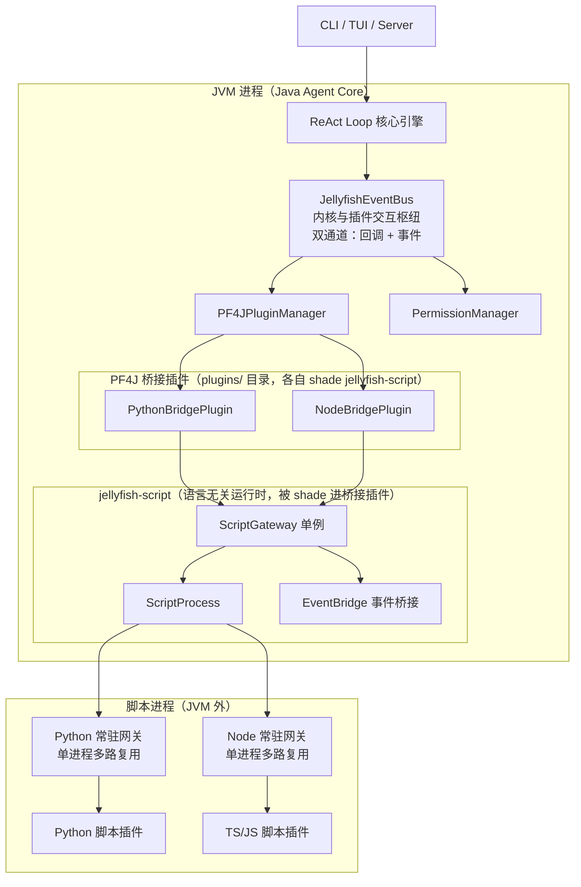
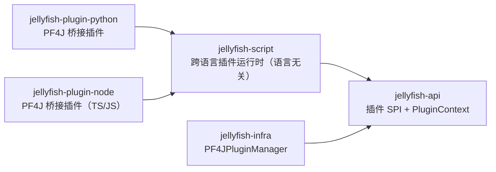

# Jellyfish 跨语言插件方案（架构与设计版）

> 本文与 `AGENTS.md`、`Jellyfish技术方案.md`、`双通道改造方案.md`、`扩展点设计方案.md` 对齐：跨语言插件与 Java 插件在交互枢纽语义上**完全同构**，内核不区分插件语言。
> 目标是让 Python / TypeScript(JS) 等语言的插件以「进程外插件」的形式接入，将来新增语言不需要改动 `jellyfish-infra` / `jellyfish-core`。

## 一、设计目标与核心原则

跨语言插件方案要解决四个核心问题：

1. **内存爆炸**：不能每个插件都启动一个 Python/Node 进程，否则依赖重复加载，内存不可控。
2. **进程残留**：JVM 退出或被强杀后，子进程不能变成孤儿进程。
3. **事件互通**：脚本进程要能像 Java 插件一样订阅和发布内核事件。
4. **能力同构**：脚本插件的权限边界必须与 Java 插件一致，不能借「跨语言」引入特权。

因此，整体设计遵循以下原则：

- **单进程多路复用**：每种语言全局一个常驻进程，所有该语言的脚本插件共享。
- **统一网关**：所有跨语言调用都经过 `ScriptGateway` 单例，插件不直接管理进程。
- **双向事件桥接**：通过 `EventBridge` 把 Java 交互枢纽与脚本进程双向打通。
- **桥接插件落地**：脚本插件由 PF4J 桥接插件承载，桥接插件自行 shade 运行时，内核 classpath 上不出现跨语言代码。
- **能力不增不减**：脚本只能注册回调处理器、订阅事件、发布事件，**不能发起回调**，与 Java 插件一致。
- **四重防残留**：ShutdownHook、PID 文件、看门狗、脚本超时自毁。
- **五层安全防御**：能力网关、权限声明、JAR 签名、进程管理、资源熔断。

---

## 二、整体架构



架构上分为五层：

| 层级 | 职责 |
|------|------|
| 接入层 | CLI / TUI / Server，负责用户交互 |
| Java 内核层 | 对话循环、交互枢纽、插件加载、权限校验 |
| 桥接插件层 | PF4J 插件形态，声明宿主语言与脚本目录，shade 跨语言运行时 |
| 跨语言网关层 | 进程池管理、JSON-RPC 路由、事件桥接 |
| 外部脚本层 | Python / Node 实际执行，按语言由常驻网关动态加载脚本插件 |

关键设计是：**Java 内核不感知脚本语言细节，只看到统一的 `JellyfishPlugin` SPI 与 `PluginContext`。**

---

## 三、模块与包结构

跨语言能力拆成「一个语言无关运行时 + 每种语言一个桥接插件」。



| 模块 | 坐标 | 职责 | 依赖 |
| --- | --- | --- | --- |
| `jellyfish-script` | `zcd:jellyfish-script` | 语言无关运行时：协议、进程池、事件桥接、生命周期、安全护栏 | `jellyfish-api` |
| `jellyfish-plugin-python` | `zcd:jellyfish-plugin-python` | Python 桥接插件：PF4J 描述符 + Python 语言适配 + 脚本网关资源 | `jellyfish-script`、`jellyfish-api` |
| `jellyfish-plugin-node` | `zcd:jellyfish-plugin-node` | TS/JS 桥接插件：PF4J 描述符 + Node 语言适配 + 脚本网关资源 | `jellyfish-script`、`jellyfish-api` |

桥接插件**自行把 `jellyfish-script` shade 进自己的插件 jar**：

- `jellyfish-infra` / `jellyfish-core` 只依赖 `jellyfish-api`，classpath 上不出现跨语言代码。
- `jellyfish-api` 由 PF4J 父类加载器共享，保证 `JellyfishPlugin`、`PluginContext` 类型在两侧一致。
- 新增一种语言 = 新增一个极薄的桥接插件模块 + 一套该语言的常驻网关资源，内核零改动。

```
jellyfish-script/src/main/java/zcd/jellyfish/script/
├── ScriptGateway.java          # 单例门面：常驻进程池、按 language + method 路由、订阅记录、生命周期
├── ScriptProcess.java          # 单个子进程 stdio 封装：sendRequest / notify / isAlive / destroyForcibly
├── ScriptProtocol.java         # JSON-RPC 2.0 over Stdio：帧编解码、请求 id 配对、超时
├── ScriptRequestHandler.java   # 脚本上行请求：register_tool / register_command / subscribe_event / emit_event
├── EventBridge.java            # 双向事件桥接：内核通知 ↔ 脚本，防循环 + 白名单 + 限流
├── ScriptLanguage.java         # 语言枚举与适配：各语言的启动命令与网关资源路径
├── ScriptLifecycle.java        # ShutdownHook / PID 文件 / 看门狗 / 空闲自毁
└── ScriptPermissions.java      # 权限常量：SCRIPT_PYTHON / SCRIPT_NODE / EVENT_SUBSCRIBE / EVENT_EMIT

jellyfish-plugin-python/src/main/
├── java/zcd/jellyfish/plugin/python/PythonBridgePlugin.java   # 实现 JellyfishPlugin，全部委托 ScriptGateway
└── resources/
    ├── plugin.properties        # PF4J 描述符：Plugin-Id、依赖、声明的权限
    └── scripts/gateway.py       # Python 常驻网关 + 业务脚本目录
```

---

## 四、核心组件与职责

### 1. PluginContext：能力白名单

`PluginContext`（`jellyfish-api`）是插件能接触到的全部能力边界，也是脚本插件能力的**唯一来源**：

- 回调注册入口：注册各扩展点的处理器（工具 `ToolCallRequest` / 具名命令 `PluginRequest`）。
- `events()`：订阅事件通道事件。
- `publisher()`：发布事件通道事件。

设计意图：脚本不能直接启动进程，也不能直接访问事件总线，一切必须由桥接插件经 `PluginContext` 转发，并经过 `PermissionManager` 校验。

### 2. ScriptGateway：单例网关

`ScriptGateway` 是整个跨语言方案的核心，职责包括：

- **进程池管理**：每种语言最多一个常驻进程。
- **路由分发**：根据 `language` 和 `method` 把请求转发到对应脚本进程。
- **生命周期管理**：启动、健康检查、异常重启、退出清理。
- **订阅记录**：记录脚本进程订阅了哪些事件类型。
- **与 EventBridge 协作**：把内核事件推给脚本，把脚本事件送回事件总线。

设计决策：**单例而非每插件一进程**，这是避免内存爆炸的关键。

### 3. ScriptProcess：通信管道抽象

`ScriptProcess` 封装一个脚本进程的输入输出流，对外提供：

- `sendRequest(method, params)`：发送 JSON-RPC 请求并等待响应。
- `notify(method, params)`：单向推送，不等待响应。
- `isAlive()`：判断进程是否存活。
- `destroyForcibly()`：强制销毁。

它让上层不关心底层是 Python 还是 Node。

### 4. EventBridge：双向事件代理

`EventBridge` 负责交互枢纽与脚本进程之间的双向事件流转：

- **Java → 脚本**：监听总线通知，序列化后通过 `event_occurred` 推送给脚本。
- **脚本 → Java**：接收脚本的 `emit_event`，经 `PluginContext.publisher()` 发布到事件通道。
- **防循环**：来自脚本的事件带来源标记，不再推回同一脚本进程。
- **过滤与限流**：只允许白名单事件类型，负载限制大小，队列有界。

### 5. ScriptLanguage：语言适配

`ScriptLanguage` 描述「一门语言怎么被宿主」：

- 启动命令与参数（如 `python3 gateway.py` / `node gateway.js`）。
- 网关资源路径（桥接插件 jar 内资源）。
- 用户脚本目录（外部可覆盖路径）。
- 该语言对应的权限常量。

新增语言只需新增一个适配实现 + 一个桥接插件模块。

---

## 五、通信模型与协议

### 通信模型

- **进程模型**：每种语言一个常驻进程，内部按 `method` 路由到不同脚本插件。
- **协议**：JSON-RPC 2.0 over Stdio，每行一个 JSON 对象。
- **调用方式**：同步请求-响应（回调通道）+ 异步事件推送（事件通道）。

### 消息类型

| 方向 | 方法 | 说明 |
|------|------|------|
| Java → 脚本 | `call_script` | 调用脚本业务方法 |
| Java → 脚本 | `execute_tool` | 执行脚本注册的工具处理器 |
| Java → 脚本 | `execute_command` | 执行脚本注册的自定义命令处理器 |
| Java → 脚本 | `event_occurred` | 推送内核通知事件 |
| 脚本 → Java | `register_tool` | 注册工具处理器 |
| 脚本 → Java | `register_command` | 注册具名命令处理器 |
| 脚本 → Java | `subscribe_event` | 订阅内核通知事件 |
| 脚本 → Java | `unsubscribe_event` | 取消订阅 |
| 脚本 → Java | `emit_event` | 脚本主动发布通知 |

设计要点：

- Java 内核只处理标准 RPC，不区分底层是 Python 还是 TS/JS。
- **协议里没有「脚本发起回调」的方法**：脚本只能注册回调处理器、发布事件，与 Java 插件能力一致。

---

## 六、事件桥接与双通道对齐

事件桥接是跨语言插件能否「像本地插件一样工作」的关键。

### 能力映射

| 脚本侧 | Java 侧落点 | 说明 |
|------|------|------|
| `register_tool` | 回调注册入口按 `tool.provide` 注册 `ToolCallRequest` 处理器 | 脚本贡献工具，与 Java 插件工具同构 |
| `register_command` | 回调注册入口按 `command.provide` 注册 `PluginRequest` 处理器 | 注册具名命令处理器 |
| `subscribe_event` | `PluginContext.events().subscribe(...)` | 只订阅事件通道 |
| `emit_event` | `PluginContext.publisher().publish(...)` | 只发布事件，不发起回调 |
| 内核 → 脚本 | `EventBridge` 推 `event_occurred` | 由事件通道触发，或回调执行结果回流 |

### 工具调用流程（回调通道）

1. ReAct 发起 `ToolCallRequest`，经交互枢纽的回调通道同步调用。
2. 桥接插件注册的处理器被唤醒，调用 `ScriptGateway.callScript(language, "execute_tool", ...)`。
3. 网关把请求投递给常驻进程，等待脚本返回。
4. 响应包装回 `ToolCallResult`，沿回调通道返回 ReAct。

### 订阅流程（事件通道）

1. 脚本调用 `subscribe_event`。
2. `ScriptGateway` 通过桥接插件在 `PluginContext.events()` 上注册监听器。
3. 事件发生时，`EventBridge` 序列化负载。
4. 通过 `event_occurred` 推送给对应脚本进程。
5. 脚本内部触发业务回调。

### 发布流程（事件通道）

1. 脚本调用 `emit_event`。
2. 网关收到后经 `PluginContext.publisher()` 发布通知。
3. 标记来源为脚本，防止循环回推。
4. Java 插件与其它脚本进程按订阅正常收到。

### 安全与性能

- 只允许白名单事件类型，禁止订阅内部敏感事件。
- 事件负载限制 1MB，超限只传事件标识。
- 推送队列有界，超出丢弃并告警。
- 插件必须声明 `EVENT_SUBSCRIBE` 和 `EVENT_EMIT` 权限。

---

## 七、脚本插件与 Java 插件的同构性

| 维度 | Java 插件 | 脚本插件 |
|------|-----------|----------|
| 加载方 | PF4J 直接加载 | PF4J 加载桥接插件，脚本由常驻网关动态加载 |
| 生命周期 | `JellyfishPlugin` start / stop | 桥接插件 start / stop 时拉起 / 回收脚本插件 |
| 能力入口 | `PluginContext` | 桥接插件代脚本调用 `PluginContext` |
| 注册回调处理器 | 支持 | 支持 |
| 订阅 / 发布事件 | 支持 | 支持 |
| 发起回调 | 不支持 | 不支持 |
| 权限声明 | 插件描述符 | 桥接插件 PF4J 描述符 + 脚本清单 |
| 卸载回收 | 按 pluginId 批量回收 | 桥接插件卸载 → 网关回收该语言全部脚本注册 |

一句话：**脚本插件的「代表」是一个 Java 桥接插件，内核看到的永远是标准 PF4J 插件，脚本进程只是它背后的一台无状态计算器。**

---

## 八、进程生命周期与防残留设计

| 痛点 | 设计 | 说明 |
|------|------|------|
| 内存爆炸 | 单进程多路复用 | 每种语言只启动一个进程，所有脚本插件共享，依赖只加载一次 |
| 进程残留 | ShutdownHook | JVM 退出时强制销毁所有子进程 |
| 孤儿进程 | PID 文件 | 启动写入 `pids/`，退出删除；重启时扫描清理 |
| 进程假死 | 看门狗 | 定时检查存活，异常自动重启 |
| 空闲占用 | 超时自毁 | 脚本长时间无输入主动退出 |

设计目标：即使 `kill -9` JVM，也有应急脚本按 PID 文件清理残留。

---

## 九、安全纵深防御

| 层级 | 设计 | 跨语言增强 |
|------|------|------------|
| L1 能力网关 | `PluginContext` 只暴露封装方法 | RPC 方法白名单；事件订阅限制类型；无回调发起 |
| L2 权限声明 | 插件权限描述符 | 必须声明 `SCRIPT_PYTHON`、`SCRIPT_NODE`、`EVENT_SUBSCRIBE`、`EVENT_EMIT` |
| L3 JAR 签名 | jarsigner 校验 | 防止插件篡改网关调用参数 |
| L4 进程管理 | Apache Commons Exec + Watchdog | 清空环境变量，锁定工作目录，事件负载限 1MB |
| L5 资源熔断 | 线程池 + 内存监控 | 事件队列有界，RPC 超时 30 秒，响应限 10MB |

核心思想：**脚本进程只是一个无状态计算器，所有敏感操作必须经过 Java 侧网关与权限校验。**

---

## 十、部署与运维设计

```
jellyfish/
├── jellyfish-cli.jar            # shaded 分发
├── plugins/                     # PF4J 插件目录
│   ├── *.jar                    # Java 插件
│   ├── jellyfish-plugin-python-x.y.z.jar   # 已 shade jellyfish-script
│   └── jellyfish-plugin-node-x.y.z.jar     # 已 shade jellyfish-script
├── scripts/                     # 用户脚本插件（可选外部覆盖）
│   ├── python/                  # Python 脚本插件
│   └── node/                    # TS/JS 脚本插件
└── pids/                        # 子进程 PID 文件
```

运维要点：

- 启动 Agent 时，桥接插件按需启动对应语言的常驻网关。
- 停止 Agent 时，ShutdownHook 强制清理子进程并删除 PID 文件。
- 应急清理脚本按 PID 文件清理孤儿进程。
- 日志统一聚合，脚本 stdout/stderr 重定向到 Agent 日志。

---

## 十一、实施路线图

| 阶段 | 目标 |
|------|------|
| Phase 1 | 纯 Java 插件 MVP，验证 PF4J 加载链路与 `PluginContext` 语义 |
| Phase 2 | `jellyfish-script` 运行时：`ScriptGateway` 单例 + `ScriptProcess`，Python 单进程多路复用 |
| Phase 3 | `EventBridge` 双向事件桥接，对齐双通道总线 |
| Phase 4 | 桥接插件模块化：`jellyfish-plugin-python` 落地，Node 网关复用同一运行时 |
| Phase 5 | 生命周期加固：ShutdownHook、PID、看门狗、空闲自毁 |
| Phase 6 | 安全合规：签名、权限、事件白名单、熔断 |
| Phase 7 | 生产就绪：压测、调优、应急脚本、监控告警 |

---

## 十二、关键设计决策总结

| 决策 | 原因 |
|------|------|
| 单例网关而非每插件一进程 | 避免内存爆炸，依赖只加载一次 |
| 独立 `jellyfish-script` 模块 | 跨语言是独立关注点，与 PF4J 的 jar 加载模型分离 |
| 每语言一个桥接插件 | PF4J 的启用/禁用/卸载粒度以插件为单位，脚本生命周期被内核统一治理 |
| 桥接插件 shade 运行时 | 内核 classpath 零污染，`infra`/`core` 完全不知道脚本进程存在 |
| JSON-RPC over Stdio | 简单、跨语言、易调试、无网络开销 |
| 事件桥接而非直接共享总线 | 进程隔离下唯一可行方案，且安全可控 |
| 脚本无发起回调权限 | 与 Java 插件能力同构，不因跨语言引入特权 |
| 五层安全防御 | 脚本不可信，必须经过 Java 侧网关校验 |
| 四重防残留 | 解决 JVM 退出、强杀、假死、空闲占用 |

---

## 十三、总结

这套跨语言插件架构的核心是：

- **Java 内核保持极简**，只负责对话循环、事件总线和权限校验。
- **`jellyfish-script` 单例网关**统一管理各语言常驻进程，解决内存和残留问题。
- **`EventBridge` 双向事件桥接**让脚本逻辑上完全接入内核事件体系。
- **PF4J 桥接插件**让脚本插件与 Java 插件同构，内核零感知。
- **安全五层 + 防残留四重**保证生产环境可控。

整体设计在灵活性、隔离性、安全性和语言可扩展性之间取得了平衡，可以按 Phase 逐步落地。
