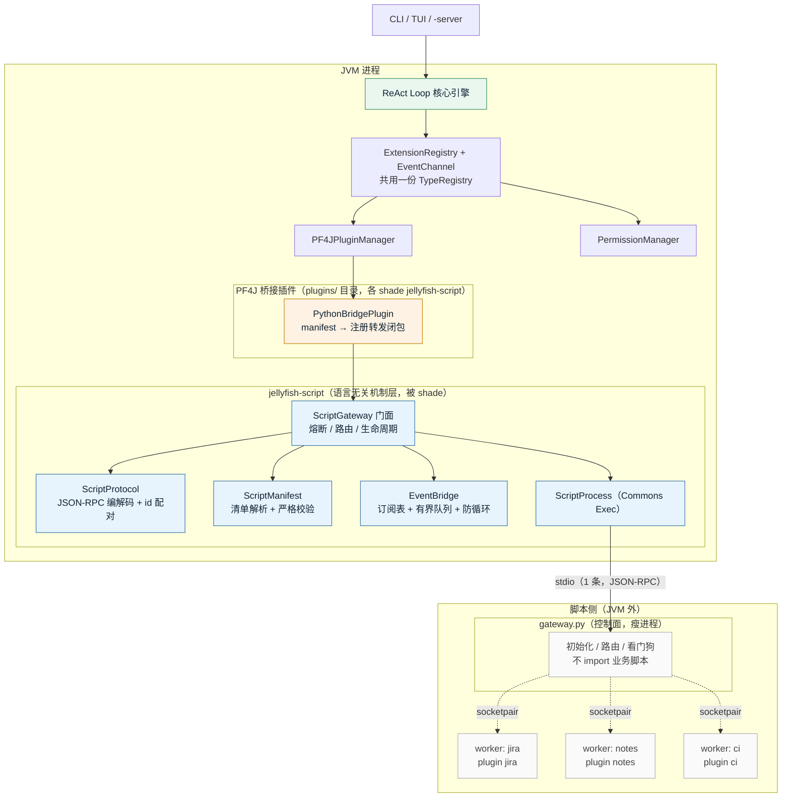
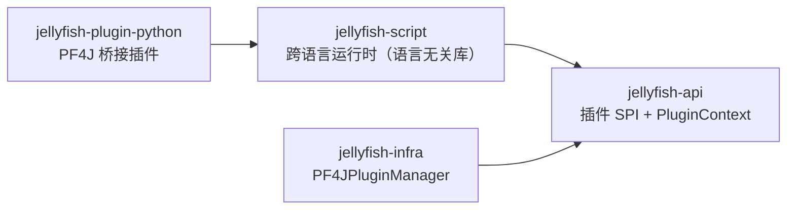
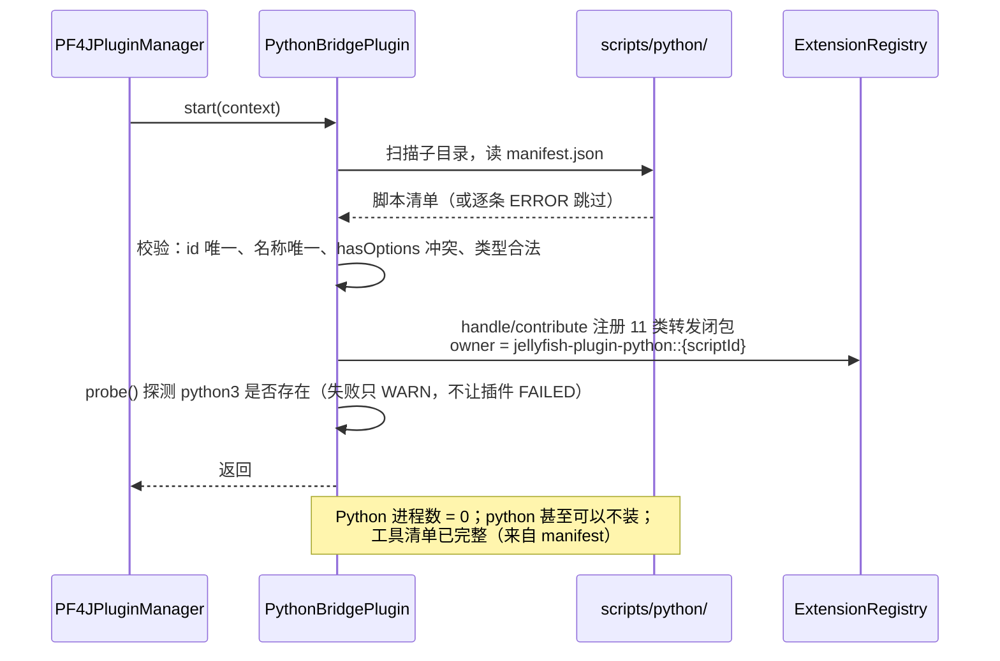
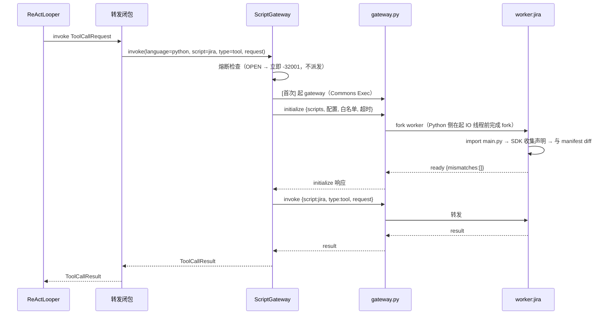
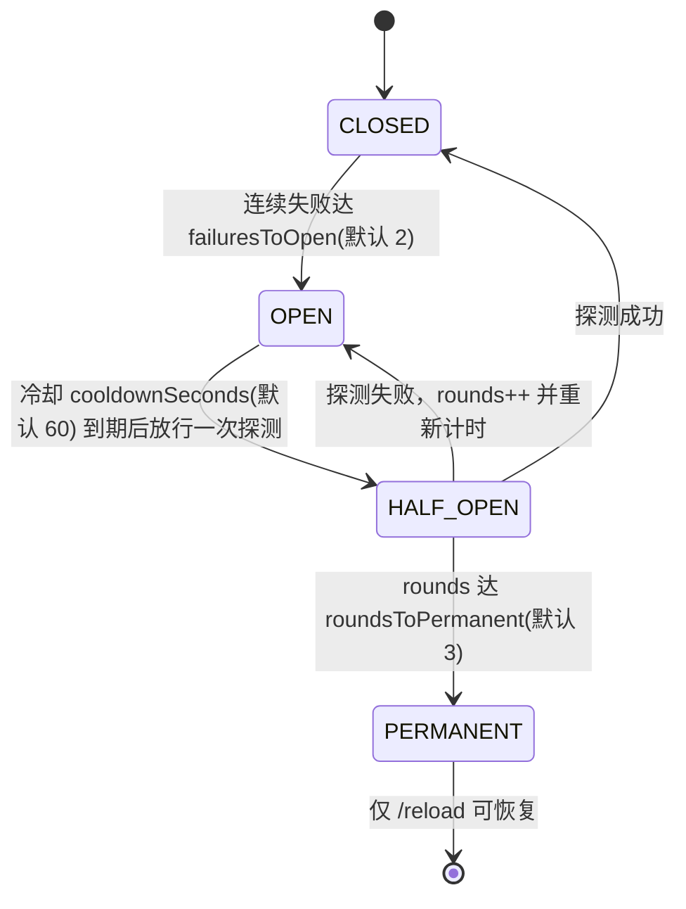

# Jellyfish 跨语言插件方案（可实施版）

> 本文与 `AGENTS.md` 对齐：`PluginContext` 的入口是 `handle` / `contribute` / `observe` / `emit`，
> 「扩展点 ID + 能力声明」两层已删除，注册边界由**回调类型可见性**承载，出站发布不再门禁。
> 脚本插件与 Java 插件在能力与权限上**完全同权**，内核不区分插件语言。
>
> **本版与早期版本的差异**见 §十五，重要改动有三处：
> 1. 从「每语言一个进程」改为「**控制面单实例 + 数据面按脚本隔离**」（§一、§二）；
> 2. 注册来源从「脚本运行时上报」改为「**静态清单 manifest**」（§五）——协议里因此**没有**任何注册方法；
> 3. 「权限声明层」整层删除（§十五）。

## 实施进度

| 阶段 | 状态 | 落地内容 |
|---|---|---|
| P0 骨架 | ✅ 已完成 | 根 pom 挂 `jellyfish-script`；`jellyfish-plugins` 挂 `jellyfish-plugin-python`；`ScriptLanguage`（语言适配 SPI）、`ScriptJson`（序列化封装）、`PythonConfig` / `PythonLanguage` / `PythonBridgePlugin`；插件包 shade 已实测排除 `zcd/jellyfish/api/` 与 `org/pf4j/`（否则 `PluginClasspathGuard` 会拒绝加载）；32 个单测覆盖 |
| P1 owner 命名空间 | ✅ 已完成 | `TypeRegistry.removeAllUnder(namespace, separator)`（含裸前缀不误伤、层级更深一并命中、空白命名空间/空分隔符报错）；`PluginContextFactory.release` 改按命名空间回收，并公开 `OWNER_NAMESPACE_SEPARATOR`；`plugin.id` 含 `::` 在描述符体检阶段被拒 |
| P2 manifest 与注册 | ✅ 已完成 | `ScriptManifest`（零容忍解析：未知键报错并列出允许键名、冲突检测）+ `ScriptPluginScanner`（逐脚本问题隔离）+ `ScriptRegistrar`（逐条注册隔离、owner 命名空间）+ `PythonLedger` + `/<lang>` 状态命令；`PluginContext.subContext(String)`（api）与 `PluginOwnerNamespace.requireChildId`（api）落地；**执行由 `ScriptRuntimeUnavailable` 暂代**（P4 接通进程） |
| P3 协议与 11 codec | ✅ 已完成 | `ExtensionCodec` / `ExtensionCodecs`（11 个类型名的唯一真源）/ 11 个 codec / `Payloads`；`ScriptJson` 补 `ParameterNamesModule`（修掉「快照写得出、读不回」）；`ScriptProtocol`（帧编解码 + 方法名 + 错误码，脏行宽容丢弃）+ `ScriptMessage` + `ScriptRpc`（id 配对、超时、迟到响应按 id 丢弃、断连一次性唤醒全部等待者）+ 三个失败类型（`ScriptCallException` / `ScriptTimeoutException` / `ScriptConnectionException`）。**40 个用例，其中「真实子进程 + 真实管道」的集成测试用 Java 写的协议回声，不依赖 Python** |
| P4 gateway 与 worker | ✅ 已完成 | Java 侧：`GatewaySettings` + `ScriptProcess`/`ScriptProcessFactory` 接缝 + `CommonsExecScriptProcess`（自持 `StreamPumper` + 行切分流 + 两段式关闭）+ `GatewayResources`（按内容摘要抽取）+ `ScriptGateway`（懒启动、initialize 下发清单摘要、失败归因、关闭两段式）。Python 侧：`gateway.py`（**单线程 select 事件循环**，见下方偏离说明）、`worker.py`、`jellyfish_sdk.py`、`script_wire.py` + `--dump-manifest` 清单生成器。端到端由 `-Pscript-it` 的 `PythonScriptIT` 用真实解释器守着（7 例） |
| P5 熔断 | ✅ 已完成 | `CircuitBreakerSettings` + `ScriptCircuitBreaker`（CLOSED / OPEN / HALF_OPEN / PERMANENT 全转移、自动半开、三个参数为 0 分别表示不熔断 / 立即重试 / 永不转永久）+ `ScriptCircuitBreaker` 的观察者 `ScriptCircuitListener` + `CircuitBreakingScriptCaller`（装饰 `ScriptCaller`，打开期间**立即抛 `-32001` 且不派发**，即不摘注册）+ **超时处置链**（宿主超时 → 发 `kill_worker` → 网关杀 worker → 抛出「已隔离」）+ 迟到响应丢弃（`ScriptGateway.describe()` 与 `/<lang>` 台账均可见计数）；`PythonConfig` 解析 `circuitBreaker` 段，桥接插件在打开/恢复时 `emit` `ConfigWarningEvent`。**29 个新单测**（状态机 13、装饰器 11、设置 3、网关隔离链 3，另在配置与台账上补 9 个）+ **5 个真实 Python 的端到端用例**（熔断只影响出问题的脚本、冷却后自动恢复而无需 `/reload`、`invokeTimeoutSeconds=0` 真的是「不超时」、网关被强杀后不留孤儿）。顺带修掉三条实测出来的进程泄漏/秒杀缺陷，见 §8.2 |
| P6 事件桥接 | ✅ 已完成 | `ScriptEventCatalog`（15 个可订阅事件的**唯一白名单 + 标量投影**）、`ScriptEventFactory`（**只有两类自由载荷事件可发布**）、`ScriptEventBridge`（订阅 + 有界队列 + 独立推送线程 + 发布受理）、`ScriptEventTarget`/`ScriptEventSink` 两个接缝；清单里的 `events` 在解析期就对着目录校验。网关侧：下行 `event` 扇出（只给「声明了它 + 当前空闲」的 worker）、上行 `emit_event` 转成带 id 的调用拿 `eventId`、**回声记忆**（脚本不收到自己刚发的事件）。SDK 侧：`ctx.emit_event`、事件处理器 `(event, ctx)`、`EMITTABLE_EVENTS`。**42 个新单测**（目录 12、工厂 11、桥接 12、网关 5、清单 2，另在台账与插件上补）+ **3 个真实 Python 的端到端用例**（事件送达订阅它的脚本、发布的事件进入内核且不回声、不可发布的事件被拒且不影响服务） |
| P7 生命周期加固 | ✅ 已完成 | **worker 快照推送**（`worker_state` 带 `pid`/`queued`/`inflight`，由循环里的对账推变化，宿主记入 `/<lang>` 台账 → 取消 `status` 协议方法）与**修掉一处每两秒刷屏的诊断噪声**（fork 出来的 worker 继承了网关的信号唤醒管道，而那个 fd 随即被关掉，于是每个信号都往 stderr 吐一段 `Bad file descriptor` 的 traceback）；网关 PID 文件（`ScriptPidFiles` 算路径 → `GatewaySettings.pidFile` 下发 → 网关先原子写自己的 PID、**启动时把上一份读出来只报告不处置**、干净退出时仅当文件仍记着自己才删）与启动期陈旧 PID 报告（进 `initialize` 应答 → 宿主 WARN + `/<lang>` 台账可见）；**不装 `ExecuteWatchdog`**（见 §15.3 第 6 条）。**新增 26 个单测**（路径计算 18、网关应答接线 2、worker 快照 6）+ **5 个真实 Python 的端到端用例**（PID 文件写得出且干净退出时删掉、遗留 PID 里那个进程必须活着被误杀、强杀网关后文件保留并充当下一次启动的线索、台账报出 worker PID、脚本卡住时台账报出「在途」并在隔离后转成「已退出」） |
| P8 示例与端到端 | 未开始 | |
| P9 Node 桥接 | 未开始 | |

---

## 一、设计目标与核心原则

跨语言插件要解决五个问题：

1. **内存爆炸**：不能每个插件都启动一个 Python/Node 进程，依赖重复加载不可控。
2. **故障连坐**：一个脚本卡死或崩溃，不能让同语言的其它脚本一起失效。
3. **启动耦合**：Python/Node 环境缺失或损坏，不能阻塞内核启动。
4. **事件互通**：脚本进程要能像 Java 插件一样订阅与发布内核事件。
5. **能力同构**：脚本插件的权限边界必须与 Java 插件一致，不能借「跨语言」引入特权。

因此设计遵循七条原则：

| # | 原则 | 落地方式 |
|---|---|---|
| 1 | **控制面单实例 + 数据面按脚本隔离** | 每语言一个常驻 `gateway`（唯一对内核说话、不跑业务）；每个脚本插件一个常驻 `worker` 进程 |
| 2 | **注册与进程生命周期解耦** | 注册来自静态清单 `manifest.json`，`worker` 按需拉起、空闲自毁 |
| 3 | **能力不增不减** | 脚本与 Java 插件同权：11 个扩展点全开；**脚本不能发起回调** |
| 4 | **内核零感知** | `infra` / `core` 的 classpath 上不出现任何跨语言代码；新增语言不动内核 |
| 5 | **桥接插件承载身份** | 脚本插件的「代表」是一个 PF4J 插件，内核看到的永远是标准插件 |
| 6 | **失败隔离优先于性能** | 任何脚本级故障只影响该脚本：杀 worker、熔断自恢复，不牵连同语言其它脚本 |
| 7 | **进程绝不泄漏** | Java ShutdownHook / gateway 父子回收 / 跨平台父死子亡 / PID 文件四重保证 |

**内存账如实写**：空闲时跨语言侧**进程数为 0、常驻内存为 0**；运行期 ≈ 1 份 gateway 基础运行时 +
已唤醒 worker 各自的依赖。这是「安全是底线」与「进程隔离」买到手的真实价格——
换回来的是「环境缺失/脚本损坏不阻塞内核启动」与「脚本级故障不连坐」。

---

## 二、整体架构


```mermaid
graph TB
    subgraph JVM["JVM 进程"]
        Core["ReAct Loop 核心引擎"]
        Bus["ExtensionRegistry + EventChannel<br>共用一份 TypeRegistry"]
        PluginMgr["PF4JPluginManager"]
        Perm["PermissionManager"]

        subgraph Bridge["PF4J 桥接插件（plugins/ 目录，各 shade jellyfish-script）"]
            P1["PythonBridgePlugin<br>manifest → 注册转发闭包"]
        end

        subgraph Runtime["jellyfish-script（语言无关机制层，被 shade）"]
            GW["ScriptGateway 门面<br>熔断 / 路由 / 生命周期"]
            Proto["ScriptProtocol<br>JSON-RPC 编解码 + id 配对"]
            Manifest["ScriptManifest<br>清单解析 + 严格校验"]
            Bridge2["EventBridge<br>订阅表 + 有界队列 + 防循环"]
            Exec["ScriptProcess（Commons Exec）"]
        end
    end

    subgraph Scripts["脚本侧（JVM 外）"]
        subgraph GWProc["gateway.py（控制面，瘦进程）"]
            Router["初始化 / 路由 / 看门狗<br>不 import 业务脚本"]
        end
        W1["worker: jira<br>plugin jira"]
        W2["worker: notes<br>plugin notes"]
        W3["worker: ci<br>plugin ci"]
    end

    CLI["CLI / TUI / -server"] --> Core
    Core --> Bus
    Bus --> PluginMgr
    Bus --> Perm
    PluginMgr --> P1
    P1 --> GW
    GW --> Proto
    GW --> Manifest
    GW --> Bridge2
    GW --> Exec
    Exec -->|"stdio（1 条，JSON-RPC）"| Router
    Router -.->|"socketpair"| W1
    Router -.->|"socketpair"| W2
    Router -.->|"socketpair"| W3

    classDef app fill:#E9F7EF,stroke:#2E8B57,color:#123
    classDef bridge fill:#FDF2E3,stroke:#C77B00,color:#123
    classDef rt fill:#E8F4FD,stroke:#2E6DA4,color:#123
    classDef sc fill:#FAFAFA,stroke:#AAA,color:#444
    class Core app
    class P1 bridge
    class GW,Proto,Manifest,Bridge2,Exec rt
    class Router,W1,W2,W3 sc
```

分层职责：

| 层 | 载体 | 知道什么 | 不知道什么 |
|---|---|---|---|
| 内核 | `jellyfish-infra` / `jellyfish-core` | PF4J 插件、`PluginContext` | 世界上有脚本这回事 |
| **桥接插件** | `plugins/jellyfish-plugin-python-*.jar` | 「我是内核眼里的一个插件」；脚本清单、语言配置 | JSON-RPC 帧、id 配对、进程看门狗 |
| **跨语言运行时** | `jellyfish-script`（被 shade 的库） | 协议、进程池、超时、熔断、事件队列、清单校验 | 「插件」是什么、Python 的语法 |
| 语言适配 | `PythonLanguage`（桥接插件内） | `python3 gateway.py`、资源路径、env 白名单、隔离机制 | 协议内容、内核语义 |
| 控制面 | `gateway.py` | 初始化、路由、worker 生命周期 | 内核、PF4J、业务逻辑 |
| 数据面 | `worker` 进程 | 加载自己那一个脚本、执行业务、发布事件 | 其它脚本的存在 |

### 关键分离：控制面 / 数据面

- **gateway.py 不 import 任何业务脚本、不跑业务代码**。它只做初始化、路由、看门狗。
  因此它几乎不可能被用户脚本拖垮——语言级故障（L3）的触发概率被压到极低。
- **每个脚本插件一个 worker 进程**。worker 崩溃、段错误、`os._exit()`、死循环都只影响它自己。
- **Java 侧协议不需要知道 worker 的存在**：仍然是一个进程、一条 stdio、一套 JSON-RPC。
  隔离完全收在 Python 侧实现，这是「抽象是否做对」的第一道验收。

---

## 三、模块与包结构


```mermaid
flowchart LR
    API["jellyfish-api<br>插件 SPI + PluginContext"]
    SCRIPT["jellyfish-script<br>跨语言运行时（语言无关库）"]
    PY["jellyfish-plugin-python<br>PF4J 桥接插件"]
    INFRA["jellyfish-infra<br>PF4JPluginManager"]

    PY --> SCRIPT
    SCRIPT --> API
    INFRA --> API
```

| 模块 | 坐标 | 打包 | 职责 | 依赖 |
| --- | --- | --- | --- | --- |
| `jellyfish-script` | `zcd:jellyfish-script` | jar（库） | 协议、清单、网关、熔断、事件桥、生命周期 | `jellyfish-api`(provided)、jackson(compile)、commons-exec(compile) |
| `jellyfish-plugin-python` | `zcd:jellyfish-plugin-python` | PF4J 插件 jar | PF4J 描述符 + `PythonLanguage` + `gateway.py` 与 Python SDK 资源 | `jellyfish-script`、`jellyfish-api`(provided) |
| `jellyfish-plugin-node` | `zcd:jellyfish-plugin-node` | PF4J 插件 jar | 同上，Node/TS 适配（**Phase 8，暂不实现**） | 同上 |

### 构建约定

- **`jellyfish-script` 挂在根 `pom.xml` 的 module 列表**（与 `jellyfish-api` / `jellyfish-infra` 同级）。
  它是被 shade 的**库**，不是插件，因此**不进** `jellyfish-plugins` 聚合，也不产出到 `plugins/` 目录。
- **桥接插件 shade `jellyfish-script` 及其非 api 依赖**（Jackson / Commons Exec）。
  `jellyfish-api` 与 `org.pf4j` 必须保持 `provided`——`PluginClasspathGuard` 会拒绝自带它们的插件 jar
  （子优先类加载器会让 `JellyfishPlugin` / `PluginContext` 出现两份互不相识的类型）。
- shade 的 `artifactSet/includes` **只列** `zcd:jellyfish-script` / `com.fasterxml.jackson.core:*` /
  `org.apache.commons:commons-exec`，并排除签名文件与 `module-info.class`（参照 `jellyfish-plugin-todo`）。
- **`jellyfish-script` 必须自带 Jackson**：内核的 `ObjectMapperWrapper` 在 `jellyfish-infra` 里，插件看不到它。

```
jellyfish-script/src/main/java/zcd/jellyfish/script/
├── ScriptGateway.java          # 门面：懒启动、路由、熔断、生命周期；由桥接插件持有（非全局 static）
├── ScriptProcess.java          # 单个子进程 + stdio 帧读写（基于 Commons Exec）
├── ScriptProtocol.java         # JSON-RPC 编解码、id 配对、待应答表、超时
├── ScriptRequestHandler.java   # 上行请求分派（emit_event / worker_state）
├── EventBridge.java            # 内核事件 → 脚本：订阅表 + 有界队列 + 防循环 + 白名单
├── ScriptManifest.java         # manifest 模型、解析、严格校验
├── ScriptRegistry.java         # 脚本清单 + 每脚本的注册句柄收集（用于熔断期快速失败）
├── ScriptCircuitBreaker.java   # 熔断状态机（CLOSED / OPEN / PERMANENT）
├── ScriptLifecycle.java        # ShutdownHook、PID 文件、看门狗、空闲自毁
├── ScriptLanguage.java         # 语言适配 SPI（启动命令、资源、env 白名单、隔离机制）
├── ScriptJson.java             # 统一 Jackson 封装（PluginContext 拿不到 infra 的 wrapper）
└── codec/                      # 11 个扩展点的请求/结果编解码
    ├── ExtensionCodec.java         # codec 契约
    ├── ExtensionCodecs.java        # 「类型名 → codec」注册表
    ├── ToolCodec.java / CommandCodec.java / CommandOptionsCodec.java
    ├── PromptCodec.java / StatusLineCodec.java / PanelCodec.java
    ├── PermissionCodec.java
    ├── SessionPersistCodec.java / SessionRestoreCodec.java / SessionDeleteCodec.java
    └── CompactionCodec.java

jellyfish-plugin-python/src/main/
├── java/zcd/jellyfish/plugin/python/
│   ├── PythonBridgePlugin.java   # 实现 JellyfishPlugin：读 manifest → 注册 → 委托 ScriptGateway
│   └── PythonLanguage.java       # python3 gateway.py、资源路径、env 白名单、isolation=process
└── resources/
    ├── plugin.properties
    └── scripts/
        ├── gateway.py            # Python 控制面网关
        ├── sdk/jellyfish_plugin.py   # 脚本 SDK：装饰器 + 事件 API
        └── dump_manifest.py      # 清单生成器（--dump-manifest）
```

用户脚本目录（**默认 `./scripts/python`，可配**）：

```
scripts/python/
└── jira/
    ├── manifest.json      ← 必需；缺失则 ERROR 并跳过该脚本
    ├── main.py            ← manifest.entry 指向它
    └── ...辅助模块与资源
```

---

## 四、owner 命名空间契约（新增）

### 问题

内核的注册回收是**精确匹配** `pluginId`：

```java
// JellyfishPluginManager.safeStop / safeUnload / rollback
contexts.release(pluginId);          // → registry.removeAll(pluginId)
```

若脚本的注册 owner 写成 `jellyfish-plugin-python::jira`，框架回收的却是 `jellyfish-plugin-python`，
就会留下**幽灵注册**（插件已停、工具还能调）——正是 `safeStop` 的注释里明确要避免的情形。

### 契约

**owner 命名空间**：`owner` 为 `pluginId`，或形如 `{pluginId}::{子标识}`。

- 分隔符固定为 **`::`**，常量是 `zcd.jellyfish.api.plugin.PluginOwnerNamespace.SEPARATOR`
  （放在 api 而非内核：它是跨边界契约，插件用它拼来源、内核用它做前缀回收，只写在内核里
  插件就只能自己抄一份字面量，分隔符一变就是静默的回收越界或残留）。
- `PluginContextFactory.release(pluginId)` 回收 **`pluginId` 自身 + 其命名空间下的一切**（含更多层级）。
- **插件侧用 `PluginContext.subContext(childId)` 派生子上下文**来注册到子命名空间。这是必需的：
  `PluginContext` 只暴露一个固定 owner，而 `PluginContextImpl` / `ExtensionRegistry` 在 infra、
  插件看不到，因此没有它就无法落地子 owner。子身份恒从**当前**身份派生，插件无法注册到别人的命名空间。
- 子标识的取值规则（非空白、不含空白字符/路径分隔符/命名空间分隔符）由
  `PluginOwnerNamespace.requireChildId` 承担，**插件侧与框架侧共用同一份规则**——
  两处一旦漂移，表现是「清单校验通过、注册时却拼不出合法 owner」。
- 匹配是「命名空间 + 分隔符」前缀，**不是裸前缀**：回收 `x` 不得碰 `xy` 这个毫不相干的插件。
- 脚本级 owner 形如 `{bridgePluginId}::{scriptId}`，对外表现为
  `jellyfish-plugin-python::jira`，在注册表诊断快照与 `/plugins` 里可见。
- 分隔符由调用方传给注册表（`removeAllUnder(namespace, separator)`）：命名空间是插件运行时的约定，
  不是注册表的约定，写死一个分隔符会让表底座替上层做主。

### 既有代码改动（三处，均已落地）

| 文件 | 改动 |
|---|---|
| `infra/registry/TypeRegistry.java` | 新增 `int removeAllUnder(String namespace, String separator)`：按 `owner.equals(ns) \|\| owner.startsWith(ns + sep)` 回收，命名空间为空白或分隔符为空则报错。**保留** `removeAll(owner)` 的精确语义不动（它同时服务内核内部来源如 `metrics`） |
| `infra/plugin/PluginContextFactory.java` | `release(pluginId)` 改调 `registry.removeAllUnder(pluginId, PluginOwnerNamespace.SEPARATOR)` |
| `api/plugin/PluginOwnerNamespace.java` | **新增**：`SEPARATOR` 常量（跨边界契约的唯一真源） |
| `infra/plugin/JellyfishPluginDescriptorFinder.java` | `createPluginDescriptor(Properties)` 里追加一条 `loadError`：`pluginId` 含 `::` 时拒绝加载 |

> `EventChannel.unsubscribeAll(owner)` **不改**：它服务的是内核内部 owner（如 `metrics`），精确语义正确。
>
> **为什么插件 id 带分隔符要被拒**：若允许一个叫 `x::y` 的插件，它自己的注册就会落在命名空间 `x` 下，
> 于是 `x` 停止时会把它的注册一并抺掉——**一个插件停掉另一个插件的工具**，而现场看上去一切正常。

---

## 五、脚本清单 manifest（注册的唯一来源）

### 设计取舍

注册改由静态清单承载，换来三个能力：**JVM 启动零依赖**（没装 Python 也能起来，且工具清单完整）、
**内存完全回零**（无请求时零进程）、**崩溃处置简单**（清单是权威，worker 崩了直接重启，无需重注册）。

代价是**清单可能与实现漂移**。这是本方案唯一的高危点，因此有一条硬性配套：**严格一致性校验**（见下）。

### schema

```jsonc
{
  "id": "jira",                          // 可选，缺省用目录名；同时是 owner 后缀
  "entry": "main.py",                    // 必填，相对脚本目录
  "tools": [
    {
      "name": "jira_issue",
      "description": "读取或更新一个 Jira issue",
      "parameters": { "key": {"type": "string"}, "comment": {"type": "string"} },
      "required": ["key"],
      "readOnly": true                   // 缺省 false（与 Java 侧「只读是显式选择」一致）
    }
  ],
  "commands": [
    {
      "name": "jira",
      "descriptor": { "summary": "操作 Jira issue", "usage": "<issueKey|search 关键词>",
                      "aliases": ["j"] },
      "hasOptions": true                 // true = 自动挂 CommandOptionRequest（见 §六.3）
    }
  ],
  "commandOptions": [                    // 显式入口，与 Java 插件逐字对齐；见 §六.3 的冲突规则
    { "name": "notes" }
  ],
  "contributions": ["prompt", "status_line", "panel"],   // 每种类型每脚本至多一条
  "events": ["SessionCreatedEvent", "ToolCallCompletedEvent"]  // 订阅白名单的**交集**
}
```

- `contributions` 取值：`prompt` / `status_line` / `panel` / `permission` /
  `session_persist` / `session_restore` / `session_delete` / `compaction`。
- `events` 是「脚本想订阅的」；实际订阅 = 与内核代码内白名单求交集（§六.6）。

### 严格一致性校验（`manifestStrict` 默认 `true`）

worker 首次被拉起时，SDK 收集脚本**真实的**声明（来自装饰器），与传入的 manifest 逐项 diff：

| 漂移 | 检测点 | 处置 |
|---|---|---|
| manifest 有、实现没有 | worker 的 `ready` 回报 | ERROR + 该脚本熔断 |
| **实现有、manifest 没有**（最危险：工具永不出现） | worker 的 `ready` 回报 | ERROR + 该脚本熔断，日志点名差异项 |
| 描述符内容不一致（如 `readOnly`） | 逐字段比对 | **以 manifest 为准**（它是启动期实际注册的那份），但必须 ERROR + 熔断，不静默取一个 |

### 清单生成器（必做）

```bash
python3 gateway.py --dump-manifest scripts/python/jira    # 从装饰器导出 manifest 骨架到 stdout
```

把「手写两份」降成「手写一份 + 一条命令」，是消解漂移的正面手段。

### 发现规则

- 扫 `scriptsRoot` 下的**子目录**，要求存在 `manifest.json`。
- **脚本根目录不存在 = 空清单**（正常的冷启动状态，不是故障：用户还没建脚本目录，
  或者从未用过脚本插件）；存在但不是目录、或不可读 = 全局故障，`start()` 抛错。
- **缺 manifest 的目录 = ERROR + 跳过**（不是静默忽略），并在桥接插件的启动汇总里列出。
- manifest 解析失败 / 校验不通过（工具名为空白、`contributions` 含未知类型……）= ERROR + 跳过该脚本。
- **单个脚本的清单问题不影响其它脚本**，也不让桥接插件 `FAILED`——桥接插件 `start()` 只有在
  「脚本根目录不可读」这类全局故障时才抛错。

---

## 六、通信协议

### 6.1 帧格式

- **JSON-RPC 2.0 over stdio**，UTF-8，**每行一个 JSON 对象**，`\n` 结尾。
- 字符串内的换行由 JSON 转义，协议层不存在多行帧。
- 强制 `PYTHONUNBUFFERED=1`，Python 侧用 `sys.stdout.buffer` 直接写原始字节。

```jsonc
// 请求（需要应答）
{"jsonrpc":"2.0","id":7,"method":"invoke","params":{"script":"jira","type":"tool","request":{...}}}
// 应答
{"jsonrpc":"2.0","id":7,"result":{"output":"..."}}
{"jsonrpc":"2.0","id":7,"error":{"code":-32000,"message":"..."}}
// 通知（不需要应答）
{"jsonrpc":"2.0","method":"event","params":{"event":"SessionCreatedEvent","payload":{...}}}
```

### 6.2 下行方法（Java → gateway）

| 方法 | 形态 | 用途 |
|---|---|---|
| `initialize` | 请求 | 启动期下发：脚本清单（含各自 manifest）、配置、事件白名单、超时与自毁参数。响应 `{scripts:[{id, ok, error?}]}` |
| `invoke` | 请求 | 执行一次扩展点调用；`params:{script, type, request}` |
| `event` | 通知 | 推送内核事件；`params:{event, payload}` |
| `kill_worker` | 请求 | 杀某个脚本的 worker；`params:{script, reason}`，响应 `{killed:bool}` |
| `shutdown` | 请求 | 优雅关闭：gateway 杀全部 worker 后退出 |

> **没有 `status` 方法**。曾计划用它给 `/<lang>` 提供「进程侧那一半」状态，实现时取消了：
> 它是一条**阻塞 RPC 且在一条渲染路径上**（网关单线程，卡住就把展示命令一起挂住），
> 而「看一眼状态」还会顺手把懒启动的网关拉起来。改用推送：worker 的 PID、在途、排队
> 随 `worker_state` 一起上报，宿主只做记录。

### 6.3 上行方法（gateway → Java）

| 方法 | 形态 | 用途 |
|---|---|---|
| `emit_event` | 请求 | 脚本发布通知；`params:{script, event, payload}`，响应 `{accepted:bool, eventId?, reason?}`。应答的接收方是**网关**（它要用 eventId 掐回声），脚本侧不等裁决，见 §6.6 |
| `worker_state` | 通知 | gateway 上报某个脚本的 worker 快照；`params:{script, state, alive, started, pid?, queued, inflight}`。它是**快照更新而不是事件日志**：生命周期状态（ready/refused/exited）不变、而「在途/排队」变了时会再报一次，宿主拿到的是「这个脚本现在是什么样」 |

> **协议里没有任何注册方法**。`register_tool` / `register_command` / `subscribe_event` 全部删除——
> 注册来源是 manifest（§五），订阅来源是 manifest 的 `events`。这是本版相对早期方案最重要的简化。

`hasOptions` 与 `register_command_options` 的冲突规则（两个入口都开放，与 Java 插件逐字对齐）：

| 声明 | 行为 |
|---|---|
| `commands[].hasOptions = true` | 自动为同一 `name` 挂 `CommandOptionRequest`，转发时 `type="command_options"` |
| `commandOptions:[{name}]` | 显式挂 `CommandOptionRequest` |
| **两者同时声明同一 name** | `start()` 期 **ERROR**（必是作者写错，早失败优于静默失效） |
| **同类同 name 重复声明** | `start()` 期 **ERROR**（否则 `handlers(...).size() != 1` 会让 `options()` 静默返回空列表） |

### 6.4 扩展点协议字段表

以下 11 个扩展点**全部开放**，与 Java 插件同权。`type` 是 `invoke` 的 `params.type`；
「注册形态」决定桥接层用 `handle` 还是 `contribute`。

---

#### 6.4.1 `tool` → `ToolCallRequest` / `ToolCallResult`（`handle`，路由键 = 工具名，描述符 `ToolDescriptor`）

```jsonc
// request
{ "tool": "jira_issue", "arguments": {"key":"PROJ-1"}, "sessionId": "s-1" }
// result
{ "output": "任意 JSON 值" }
```

`output` 的翻译规则（与 `ReActLooper.serializeOutput` 完全对齐）：

| 脚本返回 | Java 侧 | 回灌模型的文本 |
|---|---|---|
| `"output": "abc"` | `new ToolCallResult(name, "abc")` | `abc` |
| `"output": {"a":1}` / `[1,2]` | `new ToolCallResult(name, Map/List)` | `{"a":1}`（内核序列化） |
| `"output": 42` / `true` | `Number` / `Boolean` | `42` / `true` |
| `"output": null` 或缺省 | `output = null` | 空串 |

附则：

1. **错误必须走 JSON-RPC 的 `error` 对象**，不许用 `"output": {"error": ...}`——否则会被当正常输出回灌，
   语义静默错位。脚本侧异常 → 桥接层抛 `JellyfishException` → 内核转成「工具执行失败：…」回灌，
   与 Java 插件抛异常同权。**超时同此路径，不回灌会话失败。**
2. **传输前先挡硬上限**（10 MB），超限按 `-32003` 错误处理，避免 OOM。
   **不要在脚本里预先截断**：截断是内核职责（`react.maxToolOutputChars`），脚本也不知道该值。
3. 结构化输出的 JSON 文本同样会被内核按字符截断，与 Java 插件一致。

---

#### 6.4.2 `command` → `CommandRequest` / `CommandResult`（`handle`，路由键 = 命令名，描述符 `CommandDescriptor`）

```jsonc
// request
{ "command": "jira", "arguments": {"tokens":["PROJ-1"], "raw":"PROJ-1"}, "sessionId": "s-1" }
// result
{ "kind": "OK", "output": "已更新 PROJ-1",
  "choices": [{"value":"PROJ-1","label":"PROJ-1 修复登录","description":null,"current":true}] }
```

- `kind` ∈ `OK` / `ERROR` / `UNKNOWN`；桥接层按 kind 调 `CommandResult.ok/choices/error/unknown`。
- `choices` 非空时走 `CommandResult.choices(output, choices)`。
- `arguments` 由内核切分后下发（`CommandArguments` 的 `tokens` + `raw`），**脚本不需要自己拆命令行**。
- `CommandDescriptor` 在 manifest 里声明（`summary` / `usage` / `aliases`）。

---

#### 6.4.3 `command_options` → `CommandOptionRequest` / `CommandOptions`（`handle`，路由键 = 命令名，无描述符）

```jsonc
// request
{ "command": "jira", "sessionId": "s-1" }
// result
{ "choices": [{"value":"PROJ-2","label":"PROJ-2 导出超时","description":null,"current":false}] }
```

只读路径（`CommandManager.options` 明确不执行命令），用于 TUI 的二级选择页。

---

#### 6.4.4 `prompt` → `PromptContributionRequest` / `PromptContribution`（`contribute`）

```jsonc
// request
{ "sessionId": "s-1" }
// result
{ "text": "待办 2/5：…" }          // null / 缺省 = 本轮没有要贡献的上下文
```

**只进 system prompt，不追加进 messages。**

---

#### 6.4.5 `status_line` → `StatusLineContributionRequest` / `StatusLineContribution`（`contribute`）

```jsonc
// request
{ "sessionId": "s-1" }
// result
{ "text": "Jira 3" }               // null / 缺省 = 无片段
```

**硬约束**：处理器必须**纯只读、不得 `emit` `UiInvalidatedEvent`、必须快**（外壳在渲染线程内联执行）。
`-cli` 单次模式可能永不询问。

---

#### 6.4.6 `panel` → `PanelContributionRequest` / `PanelContribution`（`contribute`）

```jsonc
// request
{ "sessionId": "s-1" }
// result
{ "title": "Jira",
  "region": "DOCK",                                    // STATUS|DOCK|TOP|LEFT|null
  "lines": [ {"segments":[{"text":"PROJ-1 ","emphasis":"NORMAL"},
                          {"text":"●","emphasis":"ACCENT"}]} ] }
```

`emphasis` ∈ `NORMAL` / `DIM` / `ACCENT` / `WARN`；`region` 只是**软建议**，落位由外壳决定。
`lines` 为空 = 无面板。硬约束同 `status_line`。

---

#### 6.4.7 `permission` → `PermissionCheckRequest` / `PermissionVeto`（`contribute`）

```jsonc
// request
{ "agentId":"coder", "toolName":"write_file", "arguments":{...},
  "mode":"NORMAL",                                    // NORMAL|PLAN
  "sessionId":"s-1" }
// result
{ "denied": true, "reason": "禁止写入 .env" }          // denied=false → PermissionVeto.none()
```

**只两态**：脚本只能「拒绝」或「无异议」，**不能要求审批**——这是编译期约束（`PermissionVeto` 没有 ask）。
桥接层 handler 抛错时，`PermissionManager.intercept` 按「无异议」处理（与 Java 插件拦截器同权）。

---

#### 6.4.8 `session_persist` → `SessionPersistRequest` / `Void`（`contribute`）

```jsonc
// request
{ "snapshot": { ...SessionSnapshot... } }
// result: 无（脚本返回 null / 省略）
```

> ⚠️ **不可丢路径**：`SessionManager` 的持久化异常**原样上抛**（创建会话先落盘再入表）。
> 一个卡住的脚本会让**每次建会话都阻塞一个超时周期然后失败**。这与 `session-file`（Java 插件）
> 的风险同级、不是新增特权，但超时会连带到「会话创建」，因此**必须写进运维文档**。

`SessionSnapshot` 的 JSON 字段（与 api 唯一可见构造器逐字对齐，靠 `-parameters` 反序列化）：

```jsonc
{
  "sessionId":"s-1","createdAt":0,"updatedAt":0,"title":"…","agentId":"coder",
  "provider":"openai","model":"gpt-4o","permissionMode":"NORMAL",
  "messages":[{"messageId":"m-1","timestamp":0,"role":"user","content":"…",
               "toolCallId":null,"name":null,
               "toolCalls":[{"index":0,"id":"c-1","name":"read_file","arguments":"{}"}],
               "usage":{"promptTokens":1,"completionTokens":2,"totalTokens":3},
               "thinking":null}],
  "usage":{"promptTokens":0,"completionTokens":0,"totalTokens":0,"llmCalls":0},
  "compaction":{"summary":"…","boundaryMessageId":"m-9","createdAt":0,"droppedMessageCount":0}
}
```

---

#### 6.4.9 `session_restore` → `SessionRestoreRequest` / `SessionRestoreResult`（`contribute`）

```jsonc
// request: {}
// result
{ "sessions": [ { ...SessionSnapshot... } ] }         // 空数组 = 本插件恢复不出任何会话
```

恢复的失败语义是**相反**的：单个处理器读不出只告警跳过，不影响其它插件。
恢复必须排在 `pluginManager.bootstrap()` **之后**；此时脚本已是懒启动态，
因此**第一次恢复会触发 worker 拉起**，属正常时序（§七）。

---

#### 6.4.10 `session_delete` → `SessionDeleteRequest` / `Void`（`contribute`）

```jsonc
// request
{ "sessionId": "s-1" }
// result: 无
```

---

#### 6.4.11 `compaction` → `CompactionStrategyRequest` / `CompactionStrategy`（`contribute`）

```jsonc
// request
{ "sessionId":"s-1", "trigger":"AUTO",               // MANUAL|AUTO
  "messageCount":40, "compressedCount":10,
  "defaultKeepRecentMessages":20, "defaultMaxSummaryChars":4000,
  "budgetTokens":100000, "modelId":"openai/gpt-4o" }
// result
{ "summaryPrompt": "…{maxSummaryChars}…", "keepRecentMessages": 20, "maxSummaryChars": 4000 }
```

字段为 `null`/缺省 = 本插件不表态该字段（内核按「order 最小且声明了该字段」的那一个合并，
数值由内核钳制：保留 `[0, 消息总数]`、摘要上限 `[200, 20000]`）。
**处理器必须只读且快，不得发布事件。**

### 6.5 错误码

| code | 含义 | 脚本侧可修复 |
|---|---|---|
| `-32000` | 脚本业务失败（脚本内异常） | 是 |
| `-32001` | 脚本处于熔断中（桥接层本地产生，不派发） | 否（等待半开或 `/reload`） |
| `-32002` | 脚本不存在 / 未在 manifest 中声明 | 否 |
| `-32003` | 结果超过传输上限 | 是 |
| `-32004` | manifest 与实现不一致（严格校验失败） | 是 |
| `-32601` / `-32602` / `-32603` | 方法不存在 / 参数非法 / 脚本内部错误 | 视情况 |

超时**不是**错误码：它是 Java 侧客户端行为（§九）。

### 6.6 事件桥接

两个方向共用同一份白名单：**可订阅**由 `ScriptEventCatalog` 决定，**可发布**由 `ScriptEventFactory` 决定。
白名单硬编码在 `jellyfish-script` 里而不是配置化——事件类本来随内核版本增删，配置化只会带来两份清单的漂移，
而漂移的表现是「脚本声明订阅了一个再也不存在的事件」，这类问题在配置文件里看不出来。

**可订阅 = 15 个内核通知事件**（都是白名单，内核以后新增的事件不会自动对脚本开放）：

| 事件 | 下发的业务字段 |
|---|---|
| `SessionCreatedEvent` | agentId |
| `SessionClosedEvent` | agentId、messageCount |
| `SessionMessageAppendedEvent` | messageId、role |
| `ToolCallStartedEvent` | toolCallId、toolName |
| `ToolCallCompletedEvent` | toolCallId、toolName、success、durationMillis、errorMessage |
| `CommandExecutedEvent` | input、name、canonicalName、kind、source、durationMillis |
| `PermissionDecidedEvent` | agentId、toolName、mode、outcome、reason、source |
| `CompactionAppliedEvent` | boundaryMessageId、compressedCount、droppedCount、summaryLength |
| `PluginStateChangedEvent` | pluginId、state |
| `PluginNotificationEvent` | source、payload |
| `ConfigWarningEvent` | source、message |
| `ConfigReloadedEvent` | restartedPluginIds、durationMillis |
| `AgentsLoadedEvent` | defaultAgentId、agentIds |
| `ModelsLoadedEvent` | defaultProvider、defaultModel、providerNames |
| `UiInvalidatedEvent` | （无） |

每个载荷都额外带 `event`（事件名）、`eventId`、`occurredAt`、`sessionId`（无会话上下文时**这个键不存在**，
而不是 `null`——两者对脚本是不同语义）。字段缺失一律不写成 JSON `null`；集合字段排序后下发；
枚举字段下发枚举名。只下发标量：不下发嵌套快照结构，否则内核的内部结构就成了脚本的对外契约。

**可发布 = 两类自由载荷事件**：`PluginNotificationEvent`（payload 任意 JSON）与 `ConfigWarningEvent`
（`message` 必填非空）。**脚本不能伪造内核语义事件**——`ToolCallCompletedEvent`、`PermissionDecidedEvent`
这类是内核事实的转述，指标、审计与界面都按「它是真的」来消费；让脚本能造等于开了一条往审计里写假账的路。

#### Java → 脚本

1. 桥接插件 `start()` 时对目录里的每个事件类调一次 `context.observe(类型, listener)`（逐类显式订阅；
   `events.allow` 只做**额外收窄**，出现不可订阅的名字只告警）。
2. 事件发生时 `EventChannel` 的通知线程调用 listener → 投影 → **非阻塞入有界队列**（256）。
3. 桥接自己的推送线程发 `{method:"event", params:{event, payload}}`。
4. **丢弃的三种情形都计数**，让「脚本收不到事件」在 `/<lang>` 台账里可见：
   网关未运行（事件**不拉起进程**）、队列满、发送失败。

网关收到 `event` 后扇出，判据是「这个脚本的清单声明了它」且「它当前空闲」：

- **只推给已经在跑的 worker**：给一条通知补拉起解释器，等于把「事件到了」变成一次重操作，
  而通知本身允许丢。代价是没调用过的脚本收不到事件。
- **忙的 worker 直接丢并计数**：worker 是单线程的，卡在一次长调用里时它的 socket 缓冲区迟早被事件填满，
  而网关是单线程事件循环——一次阻塞写就把整个网关钉住。计数而不排队是唯一不会让网关停摆的选择。
- **跳过发起者**：见下。

#### 脚本 → Java

1. 脚本调 `ctx.emit_event(name, payload)`。会话标识由 worker 从**当前这次调用**的载荷里补上
   （脚本手里没有会话标识，那是宿主的概念）。
2. worker 发一帧 `emit_event` **通知**（不带 id）：**脚本不等裁决**——事件是单向的，
   等裁决就把调用线程的时间线交给了宿主；而名字写错这类问题在清单期就已经被拒绝过了。
3. 网关把它转成**带 id 的调用**发给宿主，目的只有一个：拿到应答里的 `eventId`。
4. 宿主侧校验白名单，`context.emit(...)` 发布到 `EventChannel`；拒绝只记 WARN
   （不补发一条告警事件：告警本身也是可订阅事件，脚本收到告警后再发一次非法事件就成了一条跨进程的环）。
5. **防回声**：网关用 `eventId` 记住「这条事件是哪个脚本刚发的」（有界 256 条，
   按条数而不是按时间过期——「事件还在飞」没有可观测的终点），扇出时跳过那个脚本。
   记忆放在网关而不是 Java 侧，是因为**扇出发生在网关**：Java 侧只能选择整条不推，那会连累无关脚本。

**已知边界**：只消除了直系回声。两个脚本互相触发（S1 发 A、S2 的 A 处理器发 B、S1 的 B 处理器发 A）
没有全局检测，靠脚本作者自律；两侧都有计数可见。

### 6.7 stdout 纪律

- 脚本与 gateway 的 **stdout 只走协议**；调试输出一律走 stderr（重定向进内核日志）。
- **非 JSON 行 / JSON 解析失败的行：宽容跳过，记 WARN 日志，不计数、不熔断。**
- stderr 由 Commons Exec 的 `PumpStreamHandler` 泵到日志，不参与协议。

---

## 七、启动与时序

### 7.1 启动期（`start()` 窗口内，**不拉起任何进程**）


```mermaid
sequenceDiagram
    participant M as PF4JPluginManager
    participant B as PythonBridgePlugin
    participant FS as scripts/python/
    participant R as ExtensionRegistry

    M->>B: start(context)
    B->>FS: 扫描子目录，读 manifest.json
    FS-->>B: 脚本清单（或逐条 ERROR 跳过）
    B->>B: 校验：id 唯一、名称唯一、hasOptions 冲突、类型合法
    B->>R: handle/contribute 注册 11 类转发闭包<br>owner = jellyfish-plugin-python::{scriptId}
    B->>B: probe() 探测 python3 是否存在（失败只 WARN，不让插件 FAILED）
    B-->>M: 返回
    Note over B,FS: Python 进程数 = 0；python 甚至可以不装；<br>工具清单已完整（来自 manifest）
```

**注册窗口契约遵守**：所有 `handle` / `contribute` / `observe` 都发生在 `start()` 内。
转发闭包不依赖 worker 存在，因此「注册与进程生命周期解耦」在代码形状上就成立了。

### 7.2 懒启动（首次调用）


```mermaid
sequenceDiagram
    participant L as ReActLooper
    participant H as 转发闭包
    participant G as ScriptGateway
    participant GW as gateway.py
    participant W as worker:jira

    L->>H: invoke ToolCallRequest
    H->>G: invoke(language=python, script=jira, type=tool, request)
    G->>G: 熔断检查（OPEN → 立即 -32001，不派发）
    G->>GW: [首次] 起 gateway（Commons Exec）
    G->>GW: initialize {scripts, 配置, 白名单, 超时}
    GW->>W: fork worker（Python 侧在起 IO 线程前完成 fork）
    W->>W: import main.py → SDK 收集声明 → 与 manifest diff
    W-->>GW: ready {mismatches:[]}
    GW-->>G: initialize 响应
    G->>GW: invoke {script:jira, type:tool, request}
    GW->>W: 转发
    W-->>GW: result
    GW-->>G: result
    G-->>H: ToolCallResult
    H-->>L: ToolCallResult
```

**Python 侧 fork 顺序硬约束**（`gateway.py` 必须严格遵守）：

```
1. 解析参数、读脚本清单            ← 进程仍是单线程
2. 逐个 fork worker                ← 此时不能有任何线程（Python 多线程下 fork 不安全，
                                     3.12+ 会警告、未来默认改 spawn）
3. 等全部 worker 上报 ready（经 socketpair 回 gateway）
4. 起 IO / 信号 / 看门狗线程，开始处理 Java 侧 stdio
5. 回 initialize 响应
```

> **实现偏离（已与用户确认，选 B）**：第 4 步的「起线程」改为「进入单线程 `select` 事件循环」。
> 原因是**本节原文与 §8.1 的 worker 空闲自毁互相矛盾**：worker 空闲 300s 自毁或崩溃之后必须
> 重新 fork，而那时按第 4 步网关已经有线程了——「重 fork」在原文里没有合法路径。
> 让网关**根本不存在任何线程**（`select` 同时多路复用宿主 stdio、各 worker 套接字、日志管道与
> 信号唤醒管道），上面这条硬约束就从「必须小心遵守的顺序」变成**恒真的性质**，
> 重 fork 也不需要第二条拉起路径（不需要 `subprocess.Popen` 兜底）。
> 网关本来就不执行业务代码（只路由 JSON），单线程不构成瓶颈；可观测行为与原文完全一致。

> **不做「公共依赖预导入白名单」**（已决策）。若将来内存成为瓶颈，可在第 2 步之前预导入共享依赖，
> 由 COW 共享——这是纯优化，不改任何契约。

### 7.3 恢复会话的时序

`SessionRestoreRequest` 在 `SessionBootstrap` 阶段被调用，那时脚本已是懒启动态，
因此**第一次恢复会触发 worker 拉起**。这是正常时序，不是异常：
「启动期零进程」的代价就是「首次真正用到时付一次 fork 成本」。

---

## 八、进程模型与生命周期

### 8.1 进程拓扑

| 进程 | 数量 | 生命周期 | 职责 |
|---|---|---|---|
| gateway | 每语言 ≤ 1 | 懒启动；无 worker 后空闲 **600s** 自毁 | 控制面：initialize、路由、看门狗、worker 管理 |
| worker | 每脚本 1 | 首个请求时 fork；空闲 **300s** 自毁；崩溃即杀 | 数据面：加载一个脚本、执行业务、发布事件 |

- **`ScriptGateway` 不是全局 static 单例**，而是由桥接插件在 `start()` 创建、`stop()` 销毁
  （PF4J 子优先类加载器下，一个桥接插件 = 一份 `jellyfish-script` = 一个实例）。两者等价，
  但实例化避免了插件类加载器里埋静态状态的隐患。
- **空闲自毁**是 A2 的必然配套：懒启动 + 不自毁 = 只懒一次。自毁后**注册仍然有效**
  （转发闭包不依赖进程），下次调用重新 fork——这正是「注册与进程解耦」的红利。
- **排队中的请求挂在「脚本」上，而不是挂在某一代 worker 上**：worker 会被空闲回收、被超时隔离、
  会崩溃，而「还没开始执行」的请求不该跟着消失。因此队列由脚本持有，换代对排队是透明的。
  由此推出两条不同的失败语义：
  * **被要求退场**（超时隔离 / 空闲自毁 / 重启）：在途请求失败（它可能跑了一半，重试会重复执行），
    **排队中的请求保留**给下一代 worker；
  * **非预期死亡**（崩溃）：在途与排队**一起失败**，让调用方明确重试。
  另外，排队请求另有一个「等待上限」（worker 迟迟起不来时放弃），避免出现「界面卡住且无错误可归因」。

### 8.2 进程绝不泄漏：四重保证

| 层 | 机制 | 覆盖场景 |
|---|---|---|
| 1 | **Java 侧**：`ScriptGateway.close()` 发 `shutdown` → 等 3s → `destroy()` → 等 2s → `destroyForcibly()`；JVM `ShutdownHook`（`Launcher`）兜底把插件停掉。**不装 `ExecuteWatchdog`**：它按墙上时钟到点强杀，而网关是设计成可空闲十分钟的长命进程（见 §15.3 第 6 条） | 正常退出、Ctrl-C |
| 2 | **gateway 是 worker 的父进程**：`SIGTERM`/`SIGINT` handler + `atexit` 杀全部 worker（kill → wait → kill -9）；每个 worker 一个 reaper 线程 `waitpid` 回收（**否则留僵尸**） | gateway 被杀、gateway 自身崩溃 |
| 3 | **跨平台父死子亡**：Linux 上 worker 额外设 `prctl(PR_SET_PDEATHSIG, SIGKILL)`（内核代发，且设完要自查一次 `getppid()`——父进程可能死在「fork 之后、prctl 之前」）；**macOS 无此机制**，用「worker 检查 `os.getppid() == 1` 则自杀」替代（开发机是 macOS，这条必须有）。检查由**定时器**（`setitimer(ITIMER_REAL)` + `SIGALRM` 处理器）驱动，而不是放在事件循环里——见下方「实测」 | gateway 被 `kill -9` |
| 4 | **PID 文件**：`pids/script-{language}.pid` 写 gateway PID；启动时把上一份读出来**只报告不杀**（避免误杀一个可能属于别的 JVM 的进程） | `kill -9` 之后的应急排查 |

**另一处实测出来的噪声（与泄漏无关，但在同一条诊断路径上）**：

fork 出来的 worker 会继承网关的**信号唤醒管道**（`signal.set_wakeup_fd` 在 C 层记着一个 fd 号），
而 `_child_setup` 紧接着就把那个 fd 关掉了。此后 worker 每收到一个信号
（孤儿看门狗的 `SIGALRM`、网关发的 `SIGTERM`、`SIGCHLD`），CPython 都会往一个已关闭的 fd 上写一次信号号，
然后往 stderr 打四行：

```
Exception ignored when trying to write to the signal wakeup fd:
Traceback (most recent call last):
  File "worker.py", line 125, in _check
OSError: [Errno 9] Bad file descriptor
```

**每两秒一条，永久刷屏**（实测：一个空闲 worker 八秒内 4 条）。它恰好挤在「worker 到底出没出事」这条线上，
把真正有用的那几行淹没掉——而诊断输出必须比被诊断对象更稳。
修法是在 `_child_setup` 里对子进程显式 `signal.set_wakeup_fd(-1)`：worker 侧没有任何人在读那个管道。

**PID 文件（第 4 层）的形态**：

- **谁写**：网关自己在收到 `initialize` 时写 `os.getpid()`。宿主即使能拿到子进程 PID（Java 8 的
  `Process` 没有 `pid()`），也不该由它写——写的人必须是「PID 属于谁」这件事的权威。
- **写在哪**：`~/jellyfish/pids/script-{language}.pid`，路径由 `ScriptPidFiles` 统一算好、随设置下发。
  它与网关资源目录**同级**而不是它的子目录：资源目录名带内容摘要，改一个字节就换目录，
  而 PID 文件的全部价值就在「被下一次启动看见」。
- **怎么写**：先写临时文件再 `os.replace`。读到一个只写了一半的数字比没有文件更糟——
  它会被当成真的，而人正是靠这个文件判断「刚才那个进程是谁」。
- **怎么退出**：干净退出时删掉，**但仅当文件里仍然是自己的 PID**。被 `kill -9` 时它留着（这正是它存在的理由）；
  两个网关同跑时（旧 JVM 被强杀、遗留网关还没自毁、新 JVM 又起来了），先走的那一个不许删掉
  「后来者还活着」这份唯一证据。
- **发现陈旧内容时只报告**：网关在覆盖前先把上一份读出来，用 `os.kill(pid, 0)` 判一次存活
  （不发信号，只做存在性与权限检查；僵尸也算「在」，排查时这是更保守的方向），
  把结论放进 `initialize` 应答 → 宿主 WARN 一句并写进 `/<lang>` 台账。
  **不做任何处置**：那个 PID 完全可能属于另一个 JVM，未经确认就杀，代价是杀掉无辜进程。
- **写不成就只告警**：PID 文件是排查线索，不是运行前提。拒绝启动网关等于把「没有线索」
  升级成「脚本全不可用」，方向完全反了。

**这条保证的实测结论（P5 期间踩到，两层都是真缺陷）**：

- **「只置一个标志位」的 SIGTERM 处理器是无效的**：脚本可能正卡在自己的代码里
  （`time.sleep(600)` 之类），而 CPython 在信号处理函数返回后会**恢复**那个被中断的系统调用，
  于是事件循环永远轮不到。现场是：网关早已退出，这个 worker 却要等用户代码自己醒来才消失，
  日志里没有任何一条指向它。**修法：SIGTERM/SIGINT 处理器直接 `os._exit`**——
  发出信号的一方（超时隔离 / 空闲自毁 / 关闭 / 拒绝服务）已经判定不需要它的任何输出。
  这个修复同时把集成用例的整体耗时从 39s 降到 12s：以前每次隔离都要等满强杀宽限。
- **事件循环里的 `getppid()` 检查同样指望不上**，理由相同。修法是定时器：
  `setitimer` 每 2 秒触发一次 `SIGALRM`，处理器在 `os.getppid() == 1` 时 `os._exit(0)`。
  它不依赖主线程回到任何地方，因此即使主线程卡在 `time.sleep(600)` 里也照样生效
  （PEP 475 随后恢复那个调用，脚本本身不受影响）。
  **实测（含反证）**：网关 `kill -9` → worker 存活 2.08s 后消失；把检查周期改成 600s 后
  worker 6 秒后仍存活。
- 还有一条**字面意思与实现相反**的缺陷：`invokeTimeoutSeconds: 0`（文档写「不超时」）
  在网关侧被当成截止时间 `0`，于是 `now > deadline` 恒真，任何调用都在派发的下一拍被隔离。
  现象是「脚本永远跑不出结果」，而用户从配置里读到的是「不超时」。
  **修法：0 要显式落成 `None`（没有截止时间）**，与同一个文件里 `wait_deadline` 已有的约定一致。

### 8.3 环境与工作目录

- **环境变量白名单透传**（不是清空——清空后 `python3` 都找不到）：
  `PATH` / `HOME` / `LANG` / `LC_*` / `PYTHONPATH` / `PYTHONHOME` / `VIRTUAL_ENV` / `NODE_PATH`；
  **强制追加** `PYTHONUNBUFFERED=1`。
- **脚本进程的 cwd = JVM 进程的 cwd**。插件拿不到工作目录（`ToolPaths` 也是按进程 cwd 解析相对路径），
  若脚本 cwd 另立一套，同一个相对路径在两边会指向不同文件。

---

## 九、故障模型与熔断

### 9.1 三级故障

| 级别 | 触发 | 影响面 | 处置 |
|---|---|---|---|
| **L1 脚本级（超时/失败）** | 单次 `invoke` 超时（默认 30s）、脚本回报的错误 | 该脚本 | 计入熔断；**杀该 worker**（宿主发指令、gateway 执行，确保不泄漏）；不牵连其它脚本 |
| **L2 脚本级（崩溃）** | worker 退出 / 段错误 / `os._exit()` / 死循环 | 该脚本 | 同上（worker 死亡体现在那次调用的失败上） |
| **L3 语言级** | gateway 自身崩溃 / stdio EOF / 管道写失败 | 整语言 | ERROR + 该语言不可用；**不计入熔断**（见下方「哪些失败计入」） |

**L3 现在只剩「瘦控制进程挂了」这一种可能**（它不 import 业务脚本、不跑业务代码），
早期方案里「一个脚本卡死带走全语言」的路径已经不存在。

**哪些失败计入熔断**（实现落在 `CircuitBreakingScriptCaller.countsAsFailure`，只此一处）：

| 失败 | 计入 | 理由 |
|---|---|---|
| 超时（`ScriptTimeoutException`） | ✅ | 「脚本没能答复」的典型形态，也正是熔断要防的资源占用 |
| 脚本回报的错误（`ScriptCallException`，含 `-32000` 业务异常） | ✅ | 按 §9.1 的定义：这一次调用没有拿到结果。**业务异常与脚本内部异常不区分**（决策见 §15.4 第 2 条）：协议上同码，而熔断只是暂时拒绝服务，判错一次的代价是一个冷却周期 |
| 连接层失败（`ScriptConnectionException`） | ❌ | 它是 L3，是**整门语言**的事。网关是懒启动的，下一次调用会重新拉起来；把一次短暂的网关故障记到每个脚本账上，结果是「网关好了，所有脚本还要再等一个冷却」 |
| `-32001`（熔断自己的拒绝） | ❌ | 再记一次失败会让冷却被自己的拒绝无限延长，**永不自动恢复** |
| 隔离请求未送达 | ❌ | 它是超时那条链上的附带信息，不是另一次失败 |

### 9.2 熔断状态机（不摘注册）


```mermaid
stateDiagram-v2
    [*] --> CLOSED
    CLOSED --> OPEN: 连续失败达 failuresToOpen(默认 2)
    OPEN --> HALF_OPEN: 冷却 cooldownSeconds(默认 60) 到期后放行一次探测
    HALF_OPEN --> CLOSED: 探测成功
    HALF_OPEN --> OPEN: 探测失败，rounds++ 并重新计时
    HALF_OPEN --> PERMANENT: rounds 达 roundsToPermanent(默认 3)
    PERMANENT --> [*]: 仅 /reload 可恢复
```

- **不摘注册**：熔断期间转发闭包**立即返回 `-32001` 错误，不派发**。工具仍在清单里，
  因此模型可能反复调用——用明确的错误文案消解：
  `「工具执行失败：脚本 jira 已因连续超时熔断，将在 42 秒后重试」`。模型看到一次就会避开。
- **为什么不用「摘注册」**：A2 的核心价值就是「注册与进程解耦」，摘注册把这个价值又丢掉了，
  而且恢复必须走 `/reload`（重注册只能在 `start()` 窗口内）。熔断保留了**自动半开恢复**。
- **打开与恢复都 `emit` `ConfigWarningEvent`**（只发一次），保证「工具莫名失败」在日志里可归因。
- **三个参数为 0 是合法配置**，分别表示「不熔断」「冷却到期立即探测」「永不转永久」；
  拒绝零会让「显式关闭熔断」这条唯一的即时止损手段失效。
- **状态是「已经发生的事实」**：`HALF_OPEN` 的含义是「已经放行过一次探测」，而不是「冷却已到期」。
  冷却到期的 `OPEN` 仍然是 `OPEN`（剩余时间读出来是 0，展示成「随时可探测」），
  只有 `admit()` 会把它推到 `HALF_OPEN`——**读状态不推进状态**，这样「谁动了状态机」始终只有
  `admit()` / `recordSuccess()` / `recordFailure()` 三个答案。
- **半开期不限制并发探测数**：限制「只放一个」要么排队要么计数，代价是把调用线程挂住；
  多放几次探测的代价只是多几次失败。状态由最后到达的那个结果决定，而它是自纠正的。

### 9.3 超时处置链

```
ReAct 线程 → 熔断装饰器（记一次失败）→ ScriptGateway.call 等待超时（timeout=30s）
  → 宿主发 {method:"kill_worker", params:{script:"jira", reason:"调用超时（30000 ms）"}}
  → gateway 收到指令，杀该 worker（SIGTERM → 宽限 → SIGKILL）、回收僵尸、回 {killed:true}
                                   ← kill 的执行方是 gateway（父进程）
  → 宿主抛 JellyfishException("脚本调用超时（已等待 30000 ms），已隔离该脚本的 worker: tool")
  → 熔断装饰器把它记成一次失败（到达阈值即打开，后续调用**立即**被拒且不派发）
  → ReAct 回灌「工具执行失败：…」，回合继续
```

- **两条触发路径并存**：网关自己也有同一个截止时间（宿主失联时仍然会清理），
  而网关那侧的 kill 是幂等的（`kill_at` 已置位就返回 false），因此两边同时动手不构成问题。
  这也解释了为什么 `killWorker` 把「没杀到」当成一个正常返回值而不是异常。

- **kill 的执行方是 gateway，不是 Java 侧**：Java 只发指令、收确认。
  `waitpid` 回收、PID 表维护都留在有父子关系的进程里，Java 侧不需要知道 worker 的存在。
- 被挂死的脚本线程随 worker 一起消失，**没有线程泄漏**。
- **迟到响应按 id 丢弃**，不做补偿（`ScriptProtocol` 的待应答表在超时时已移除该 id）。
- **杀 worker 的连坐范围**：只影响该脚本。这是选择每脚本一 worker 的直接收益。
- **超时之后有一段「正在换 worker」的窗口**：被隔离的 worker 若卡在不响应信号的系统调用里
  （例如 `time.sleep`），只能等强杀，从超时到新 worker 就绪之间可能有几秒，
  这期间**同一个脚本**的调用仍会失败。它是已实现行为而不是抖动，
  端到端用例里用重试窗口表达；熔断的冷却时间应当明显长于这个窗口，
  否则「冷却一到就探测、探测时 worker 还没换好」会连记几轮探测失败。

---

## 十、安全纵深

| 层 | 设计 | 跨语言落地 |
|---|---|---|
| L1 能力网关 | `PluginContext` 只暴露四个入口 | 脚本只能通过 manifest 声明注册、通过 `emit_event` 发布；**协议里没有「脚本发起回调」的方法** |
| L2 注册边界 | 由回调类型可见性承载 | 脚本能注册什么 = 桥接插件替它注册了什么 = 11 个 codec 覆盖的类型；**无权限声明层** |
| L3 进程隔离 | 脚本不可信 | 每脚本一 worker；进程级故障不连坐；env 白名单；cwd 锁定为进程 cwd |
| L4 资源熔断 | 有界队列 + 硬上限 | 事件推送队列有界（满了丢弃并计数）；RPC 超时 30s；单次响应上限 10 MB；worker 空闲 300s 自毁 |
| L5 进程管理 | Commons Exec + 看门狗 | `ExecuteWatchdog` 对 gateway 做进程级硬超时；`PumpStreamHandler` 泵 stderr |

**不做**（MVP 明确排除）：JAR 签名校验（L3 原方案）、内存监控（子进程 RSS 读取跨平台不成立）。
安全底线由**进程隔离 + 能力边界 + 资源熔断**三条承担。

---

## 十一、配置项

```jsonc
// jellyfish.json → plugins.configurations."jellyfish-plugin-python"
{
  "scriptsRoot": "scripts/python",        // 相对进程 cwd；其下每个子目录是一个脚本插件
  "pythonPath": "python3",                // 解释器可执行文件
  "gatewayRoot": "~/jellyfish/gateway",   // 网关资源抽取根目录（按语言 + 内容摘要分目录）
  "pidDirectory": "~/jellyfish/pids",     // 网关 PID 文件目录（只在事后排查时有用）
  "invokeTimeoutSeconds": 30,             // 单次 invoke 超时（0 = 不超时，不建议）
  "workerIdleSeconds": 300,               // worker 空闲自毁（0 = 关闭）
  "gatewayIdleSeconds": 600,              // gateway 空闲自毁（0 = 关闭）
  "manifestStrict": true,                 // manifest ↔ 实现严格校验
  "circuitBreaker": {                     // 熔断参数
    "failuresToOpen": 2,
    "cooldownSeconds": 60,
    "roundsToPermanent": 3
  },
  "events": { "allow": ["SessionCreatedEvent", "ToolCallCompletedEvent"] }  // 仅收窄，不扩展
}
```

- **熔断段里的 0 是有效配置**：`failuresToOpen: 0` 表示不熔断、`cooldownSeconds: 0` 表示冷却到期立即探测、
  `roundsToPermanent: 0` 表示永不转永久。拒绝零会让「显式关掉熔断」失去手段。
- **值写错就当场报错，不退回默认值**：`failuresToOpen` 写成 `"两次"` 的报错说的是「必须是非负整数」，
  而不是「必须是整数秒数」——报错文案把字段的类型说错，会让写错的人按错误的单位去理解自己的配置。
- `events.allow` **只收窄、不扩展**：内核可订阅的事件清单硬编码在运行时里（事件类随内核版本增删，
  配置化只会带来两份清单的漂移），因此这里写一个不存在的事件名不会扩大任何能力，只会把范围缩得更小。
  收窄在 Java 侧的桥接里生效（不订阅就不推送），网关只按各脚本清单里的 `events` 路由。
- `gatewayRoot` / `pidDirectory` 都展开行首 `~`；**PID 文件目录默认与网关资源目录同级**，
  而不是它的子目录——后者按内容摘要分目录，改一个字节就换目录，而 PID 文件的全部价值
  就在「被下一次启动看见」（见 §8.2）。
- `config.json` 的 `plugins.roots` 决定桥接插件 jar 的扫描目录，与本配置无关。

---

## 十二、部署与运维

```
jellyfish/
├── jellyfish-cli.jar                                  # shaded 分发
├── plugins/
│   ├── *.jar                                          # Java 插件
│   └── jellyfish-plugin-python-0.0.1-SNAPSHOT.jar     # 已 shade jellyfish-script + Jackson + Commons Exec
├── scripts/python/<scriptId>/{manifest.json, main.py, ...}   # 用户脚本插件
├── gateway/<language>/<digest16>/                     # 抽取出来的网关资源（按内容摘要分目录）
└── pids/script-python.pid                             # gateway PID（启动时只报告不杀）
```

- 启动 Agent **不拉起任何脚本进程**；首次调用某个脚本才 fork 其 worker。
- 停止 Agent：ShutdownHook → 优雅关闭 gateway → gateway 杀全部 worker；gateway 顺手删掉自己的 PID 文件。
- 应急：`pids/` 下的 PID 供人工排查。**只在清理得不如预期时才需要看它**——
  正常情况下网关被杀后 worker 两秒内自行退出（§8.2 第 3 层）；而 `kill -9` 之后没被删掉的那份文件，
  会被**下一次启动**读出来、连同一句「仍存活 / 已不存在」进日志与 `/<lang>` 台账。
- 日志聚合：脚本 stderr 与 gateway 诊断统一重定向进内核日志。

---

## 十三、实施路线图

| 阶段 | 内容 | 验收标准 |
|---|---|---|
| **P0 骨架** | 根 pom 挂 `jellyfish-script`；新建 `jellyfish-script` 与 `jellyfish-plugin-python`；shade 配置；空插件能加载 | `mvn -q package -DskipTests` 通过；插件加载测试绿；`PluginClasspathGuard` 不报违规 |
| **P1 owner 命名空间** | `TypeRegistry.removeAllUnder`；`PluginContextFactory.release` 改造；描述符 `::` 校验 | 单测：释放 `x` 连带回收 `x::a`、`x::b`，不影响 `xy` 与 `x2::a` |
| **P2 manifest 与注册** | `ScriptManifest` 模型/解析/校验；桥接插件读清单并注册转发闭包；`/<lang>` 状态命令 | 单测：清单解析、冲突检测（重复 name / hasOptions 冲突）、缺 manifest ERROR 跳过；加载测试：无 Python 环境下工具清单完整 |
| **P3 协议与 11 codec** | `ScriptProtocol`（id 配对/超时/错误码）、`ScriptProcess`（Commons Exec）、11 个 codec | 单测：每个 codec 的请求/结果往返；协议层用**用 Java 写的回声子进程**做集成测试 |
| **P4 gateway 与 worker** | `gateway.py`（单线程 fork 顺序、socketpair 路由、看门狗、空闲自毁）、`worker` 骨架、SDK 装饰器、`--dump-manifest` | 首次调用拉起 worker；`kill_worker` 后无僵尸；空闲自毁后内存回零 |
| **P5 熔断** | `ScriptCircuitBreaker` + 超时链路 + 迟到响应丢弃 | 单测：状态机全转移；集成测试：卡死脚本只影响自己，同语言其它脚本正常 |
| **P6 事件桥接** | 白名单订阅、有界队列、防循环、`emit_event` | 单测：队列满丢弃不阻塞；防循环；白名单拒绝 |
| **P7 生命周期加固** | PID 文件与启动期陈旧 PID 报告（只报告不杀）；macOS `getppid` 自杀与网关杀 worker 已在 P5 落地；`ExecuteWatchdog` 明确不做（见 §15.3 第 6 条） | 集成测试：SIGKILL gateway 后 worker 不残留（P5 已有）；PID 文件写得出、干净退出删得掉；遗留 PID 里的进程不被误杀；强杀后文件保留并被下一次启动报告 |
| **P8 示例与端到端** | 至少 2 个示例脚本插件（覆盖工具 + 命令 + 贡献 + 事件）、`-Pscript-it` profile | 真实 python3 端到端：注册→调用→事件→熔断→恢复 |
| **P9 Node 桥接**（后续） | `jellyfish-plugin-node` | **纯复制 + 换 `ScriptLanguage` + `gateway.js`，机制层零改动**——做不到说明抽象错了 |

---

## 十四、单元测试策略

- **单测（`mvn test`，无外部依赖）**：
  - `ScriptProtocol`：用内存流 + mock 子进程验帧编解码、id 配对、超时移除、错误码映射；
  - 11 个 codec：请求/结果双向往返，覆盖 `null` 缺省与边界（空 choices、`Void` 结果、超长上限）；
  - `ScriptManifest`：合法/非法清单、冲突规则、缺文件；
  - `ScriptCircuitBreaker`：状态机全转移与计数；
  - `EventBridge`：队列满丢弃、防循环、白名单；
  - `TypeRegistry.removeAllUnder` 与 `PluginContextFactory.release`。
- **协议层集成测试**：用一个**用 Java 写的「协议回声」子进程**冒充 gateway，验证 stdio 全链路，不需要 Python。
- **真实脚本端到端**：`-Pscript-it` profile，不进 `mvn test`（AGENTS.md 规定单测不访问外部资源）。
- 测试方法命名遵循 `{被测试方法}_should_{预期结果}_when_{条件}`。

---

## 十五、与早期方案的差异 & 需同步修改的既有文件

### 15.1 相对早期方案的设计改动

| # | 早期方案 | 本版 | 原因 |
|---|---|---|---|
| 1 | 每语言一个进程，所有脚本共享 | **控制面单实例 + 每脚本一 worker 进程** | 一个脚本卡死/崩溃不得连坐同语言其它脚本（安全底线） |
| 2 | 脚本运行时调 `register_tool` / `register_command` / `subscribe_event` 上报注册 | **注册来自静态 `manifest.json`**，协议中删除全部注册方法 | 换取「JVM 启动零依赖」「内存回零」「崩溃处置简单」；漂移由严格校验兜住 |
| 3 | `ScriptPermissions` + 权限声明（`SCRIPT_PYTHON` / `EVENT_SUBSCRIBE` / `EVENT_EMIT`） | **整层删除** | 现状 `PluginDeclaration` 只有 `pluginId + configuration`，注册边界由回调类型可见性承载，不存在声明层 |
| 4 | 只有 tool / command / event 三类 | **11 个扩展点全开** | 与 Java 插件同权 |
| 5 | 超时后直接杀进程 | 超时 → **杀该脚本的 worker**（gateway 执行）→ 熔断 | 爆炸半径从「整语言」降到「单脚本」；且不泄漏线程 |
| 6 | 五层安全防御（含 JAR 签名、内存监控） | 保留能力边界/进程隔离/资源熔断；**签名与内存监控移出 MVP** | 进程隔离已覆盖主要威胁；子进程 RSS 读取跨平台不成立 |
| 7 | 每插件一进程会导致内存爆炸，故必须共享 | 内存账改为：空闲为 0，运行期 = 1 份 gateway + 已唤醒 worker 各自依赖 | 如实呈现隔离的价格 |
| 8 | `jellyfish-script` 依赖 `jellyfish-api` 并 shade | 新增硬约束：桥接插件 shade 时**必须排除 api 与 pf4j** | `PluginClasspathGuard` 会拒绝自带内核契约的插件 jar |

### 15.2 需同步修改的既有文件

| 文件 | 改动 | 状态 |
|---|---|---|
| `pom.xml` | `<modules>` 增加 `jellyfish-script` | ✅ P0 |
| `jellyfish-plugins/pom.xml` | `<modules>` 增加 `jellyfish-plugin-python` | ✅ P0 |
| `jellyfish-infra/.../registry/TypeRegistry.java` | 新增 `removeAllUnder(String, String)` | ✅ P1 |
| `jellyfish-infra/.../plugin/PluginContextFactory.java` | `release` 改用 `removeAllUnder` | ✅ P1 |
| `jellyfish-infra/.../plugin/JellyfishPluginDescriptorFinder.java` | 追加 `pluginId` 不得含 `::` 的校验 | ✅ P1 |
| `jellyfish-api/.../plugin/PluginOwnerNamespace.java` | 新增 `SEPARATOR` 常量，作为分隔符的唯一真源 | ✅ P1 |
| `AGENTS.md` | 依赖图、模块表、包结构、路线图 | ✅ P0 |

### 15.3 P4 实施中定下、需要读者知道的点

| # | 事项 | 结论与理由 |
|---|---|---|
| 1 | Python 网关是**单线程 `select` 事件循环**而不是「IO/信号/看门狗线程」 | 见 §7.2 的实现偏离说明：让「fork 时没有线程」恒真，并去掉方案原文没有覆盖的重 fork 路径 |
| 2 | **队列属于脚本，不属于某一代 worker** | worker 会被空闲回收、被超时隔离、会崩溃，而「还没开始执行」的请求不该跟着消失。由此分出两条语义：**被要求退场**时在途失败、排队保留；**非预期死亡**时两者一起失败 |
| 3 | 初始化的等待上限**刻意比调用超时更宽**（网关 `max(10s, 调用超时)`，宿主 `max(30s, 调用超时+10s)`） | 网关那一侧更短，因此「哪个脚本、差在哪个扩展点」这种精确错误总是先到；宿主那侧只是兜底 |
| 4 | 排队请求另有一个「等待上限」 | 只用于 worker 迟迟起不来这一种情形，避免出现「界面卡住且无错误可归因」 |
| 5 | `_remaining` 在「不回收」配置下也返回一个很小的值 | 孤儿检测（`getppid() == 1`）挂在这个循环上；返回 `None` 会让 `select` 永久阻塞，**父进程被 `kill -9` 后 worker 再也不会自行退出**（实施中真的踩到了，见「P4 实测」） |
| 6 | 网关侧不设 `ExecuteWatchdog` | 它按墙上时钟到点 `destroy()`，而网关是设计成可空闲十分钟的长命进程；真正的超时是「某一次调用」 |
| 7 | `status` 协议方法**不做**，改为把 worker 快照推进 `worker_state` | 见 §6.2 的说明：阻塞 RPC 出现在一条展示命令的路径上，而且会让「看一眼状态」变成启动网关的理由。推送把同样的信息（worker PID、在途、排队）送到宿主，代价只是略微滞后——而台账本来就是给人看的，不是给代码判断用的 |

### 15.4 P5 实施中定下、需要读者知道的点

| # | 事项 | 结论与理由 |
|---|---|---|
| 1 | 熔断状态机放在 **Java 侧**（网关不认识 `-32001`） | 熔断的判据是「这个脚本最近怎么样」，与进程、协议、worker 无关。放在网关里，验一次「冷却后自动半开」就得先起一个真实进程；放在 `ScriptCaller` 的装饰器里，它能脱离进程被完整单测（13 个用例全部是毫秒级的，靠注入的假时钟推进冷却） |
| 2 | **「业务异常」也算失败**（按 §9.1 的字面） | **已决策（不区分）**：代价是一个**故意**上报「issue 不存在／凭据无效」的工具被连续调用两次，会把整个脚本熔断一个冷却周期；而它与「脚本内部异常」（`KeyError`）在协议上同码（`-32000`），宿主分不出来。曾考虑在 error 对象加 `kind` 字段、只让「内部异常 + 超时 + 崩溃」计入，**决定不做**：这会在协议里多出一个需要两侧长期对齐的维度，而它换来的是「把一类失败从熔断里摘出去」——熔断本来就只是暂时拒绝服务、冷却后自动半开，判断错一次的代价是这个脚本少服务一个冷却周期，不值得让它多背一个字段。**结论：失败就是失败，不分类** |
| 3 | 隔离请求的等待上限固定 5 秒，与调用超时无关 | 网关收到请求就把信号发出去了、应答是即时的（两段式升级在网关自己的循环里做）。给它一个跟调用超时挂钩的长上限，只会让「网关已经卡住」这种情况多挂住调用方几十秒 |
| 4 | **「不超时」与「立即超时」在配置里只差一个 0**，因此 0 必须显式表示「没有截止时间」 | 详见 §8.2 的实测结论：拿 0 当截止时间会让每次调用都被秒杀，而现象与配置的字面意思完全相反 |
| 5 | 熔断的「最近失败次数」对**所有扩展点**共同计数 | 一次提示词贡献失败与一次工具失败，对「这个脚本还健康吗」是同一个证据。若按扩展点分别计数，一个提示词写坏的脚本会让它的工具看起来完全正常，而现象是「模型行为偶尔怪」——比工具直接失败难查得多 |

### 15.5 P6 实施中定下、需要读者知道的点

1. **应答只到网关，不到脚本**。§6.3 把 `emit_event` 标成「需应答」：实现上应答确实存在，
   但接收方是**网关**（它要用 `eventId` 掐回声），脚本侧发完就继续跑。
   理由：事件是单向的，脚本等裁决等于把调用线程的时间线交给宿主；
   而「事件名写错」这类问题在清单期就被拒了（见第 3 条），不需要运行期再问一次。
2. **可发布白名单只有两类自由载荷事件**（`PluginNotificationEvent` / `ConfigWarningEvent`）。
   方案原文只说了「白名单」没说内容，这里定成窄的：脚本能造内核语义事件就等于能往审计里写假账。
   两类都是自由载荷，因此这份白名单不会跟着内核事件的字段演进变形。
3. **事件名的拒绝提前到清单期**（`ScriptManifest.parseEvents` 直接查 `ScriptEventCatalog`）。
   运行期那条路是静默的：订阅一个不存在的事件，表现是「处理器从来不执行」，
   而作者会先怀疑自己的代码、再怀疑事件没触发。报错里带上全部可订阅的名字。
4. **事件不拉起任何进程**：网关没运行 / 这个脚本的 worker 没起过 / worker 正忙，都会丢弃并计数。
   这一条是刻意的——「事件到了」不该触发 fork 解释器，也不该发生在线程的通知路径上。
5. **实测教训：推送路径上的异常捕获面必须开大**。曾经用 `_write_all(sock, ...)` 把 socket 当 fd 传，
   抛的是 `TypeError`（不在 `except OSError` 里），于是**整个网关退出**——
   把「少收一条通知」升级成「所有脚本全部不可用」。现在这一段捕获 `Exception`：
   事件是旁路，它失败最多丢一条通知，绝不能带走事件循环。
6. **回声记忆在网关而非 Java 侧**（方案原文本来就写的网关，这里记下为什么）：
   推送是「一份事件、多脚本」的扇出，扇出点在网关；Java 侧感知不到「要发给哪几个脚本」，
   在那里过滤只能整条不推。

### 15.6 P7 实施中定下、需要读者知道的点

1. **PID 文件是快照，不是锁**：它不参与任何互斥判断，也没有任何代码会根据它做处置。
   两个网关同跑是真实可能的（上一个 JVM 被 `kill -9`、它留下的网关还没自毁，新 JVM 又起来了），
   因此「文件里是谁」只是一个待人工确认的线索。`ScriptPidFiles` 里没有任何存活判定或杀进程的入口。
2. **不装 `ExecuteWatchdog`**（复核 §15.3 第 6 条）：P7 的清单里原本列了它，
   但它是按墙上时钟到点强杀，而网关是设计成可空闲 600s 的长命进程——装上等于定时杀正常运行时。
   「第 1 层」真正需要的是 `ScriptGateway.close()` 的三段式 + `Launcher` 的 `ShutdownHook`，两者都已在地上。
3. **PID 文件路径必须由 Java 侧算好下发**，与其它网关设置同理：让每种语言的网关自己取主目录、
   自己拼目录，三份实现里必然有两份漂移；而漂移的表现是「网关抽到 A、PID 写在 B」，
   只有真去翻文件才发现。
4. **写不成不得拦住启动**：`~/jellyfish/pids` 不可写、路径写错，都只记一条 WARN 并进 `/<lang>` 台账。
   PID 文件是排查线索而不是运行前提，为它拒绝服务会把「没有线索」升级成「脚本全不可用」。
5. **`prctl(PR_SET_PDEATHSIG)` 已实现，但本机（macOS）无法验证**：只做 `sys.platform` 判断 + 失败只记一行，
   非 Linux 平台静默跳过（那不是错误）。它只是把「两秒内发现父进程没了」缩短成「内核立刻杀」，
   **正确性并不依赖它**——定时器看门狗已经在 P5 实测过（含反证），prctl 是锦上添花。
   若日后在 Linux 上跑集成用例发现它没生效，回退掉它不会损失任何保证。
6. **台账里那一行是「上一次启动看到了什么」**，不是「现在怎么样」：留在 `describe()` 里的提示
   只在「发现遗留文件」那一刻产生过（下一瞬间文件就被本代覆盖了），因此它天然是一个快照。
   它与「网关 PID 4321」这种实时字段放在同一行时，用「上次启动」四个字把时间点写清楚。

### 15.7 尚未决策、留待实施时确认的点

- `ToolCallResult.output` 的结构化输出已确认允许（§6.4.1），**但 ReAct 侧对超大结构化输出的截断
  是按字符截 JSON 文本**，可能切出非法 JSON 片段。是否要在内核侧改为「超限则回灌一句摘要 + 提示」
  属内核改动，**超出本方案范围**，实施时若发现体验问题需单独提案。
- 桥接插件在 `start()` 里 `probe()` 探测解释器（`python3 --version`，2s 超时），失败只 WARN：
  **已实现**。工具清单来自清单文件、与解释器无关，因此在这里让插件转 `FAILED` 只会表现为
  「配好的工具凭空消失」。
